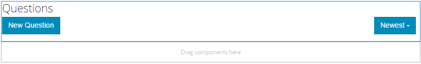
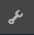
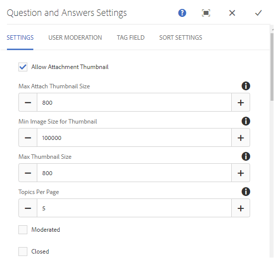

# Fonctionnalité du forum Q&amp;A{#q-a-forum-feature}

## Présentation {#introduction}

La fonction de forum QnA (questions et réponses) permet aux membres de la communauté de poser des questions et d’y répondre. Il permet aux membres de :

* Créer des questions
* Ajout d’images intégrées (avec prise en charge du glisser-déposer)
* Afficher et répondre aux questions
* Rechercher une question
* Aider à modérer le contenu QnA
* Identification des meilleures réponses
* Déplacer des questions QnA d’une page à une autre

La documentation décrit les éléments suivants :

* Ajout de la fonction de forum QnA à un site AEM.
* Paramètres de configuration du composant `QnA`.

## Ajout d’un forum de questions/réponses à une page {#adding-a-q-a-forum-to-a-page}

Pour ajouter un composant `QnA` à une page en mode création, utilisez l’explorateur de composants pour le localiser et `Communities / QnA` faire glisser sur une page où le forum QnA doit apparaître.

Pour plus d’informations, consultez [Principes de base des composants de communautés](/help/communities/basics.md).

Lorsque les [bibliothèques côté client requises](/help/communities/qna-essentials.md#essentials-for-client-side) sont incluses, le composant `QnA` s’affiche de la manière suivante :

### Configuration de QnA {#configuring-qna}

Sélectionnez le composant de `QnA` placé afin de pouvoir accéder à l’icône de `Configure` qui ouvre la boîte de dialogue de modification et de la sélectionner.

#### Onglet Paramètres {#settings-tab}

Sous l’onglet **Paramètres**, spécifiez les paramètres des sujets (questions) et des réponses (réponses) :

* **Autoriser la miniature de la pièce jointe**

  Si cette case est cochée, une miniature de l’image jointe est créée.

* **Taille max. de la miniature jointe**

  Taille maximale (en pixels) de l’image miniature de la pièce jointe. La valeur par défaut est 800 x 800.

* **Taille minimale de l’image de la miniature**

  Taille minimale (en octets) de l’image pour la génération de la miniature des images intégrées. La valeur par défaut est de 100000 octets (100 Ko).

* **Taille max. de la miniature**

  Taille maximale (en pixels) de l’image miniature de l’image intégrée. La valeur par défaut est 800 x 800.

* **Rubriques Par Page**

  Définit le nombre de questions/publications affichées par page. La valeur par défaut est 10.

* **Modéré**

  Si cette case est cochée, la publication des rubriques et des commentaires doit être approuvée avant leur apparition sur un site de publication. La valeur par défaut est désélectionnée.

* **Fermé**

  Si cette case est cochée, le forum est fermé aux nouvelles questions et commentaires. La valeur par défaut est désélectionnée.

* **Éditeur de texte enrichi**

  Si cette case est cochée, les rubriques et les commentaires peuvent être saisis avec des balises. La valeur par défaut est désélectionnée.

* **Autoriser le balisage**

  Si cette case est cochée, permet aux membres d’ajouter des libellés de balise à leurs publications (voir **Champ de balise** onglet). La valeur par défaut est désélectionnée.

* **Autoriser les chargements de fichiers**

  Si cette case est cochée, autorisez l&#39;ajout de pièces jointes à la question ou au commentaire. La valeur par défaut est désélectionnée.

* **Autoriser les éléments suivants**

  Si cette case est cochée, incluez la fonctionnalité suivante pour les publications de forum, qui permet aux membres d’être [avertis](/help/communities/notifications.md) des nouvelles publications. La valeur par défaut est désélectionnée.

* **Autoriser l’épinglage**

  Si cette case est cochée, les rubriques du forum peuvent être épinglées en haut de la liste des rubriques. La valeur par défaut est désélectionnée.

* **Autoriser les abonnements par e-mail**

  Si cette case est cochée, autoriser les membres à être avertis des nouvelles publications par e-mail ([abonnement](/help/communities/subscriptions.md)). Exige que la mention Autoriser le suivi soit cochée et que l’adresse [e-mail soit configurée](/help/communities/email.md). La valeur par défaut est désélectionnée.

* **Taille de fichier max**

  Pertinent uniquement si `Allow File Uploads` est coché. Ce champ limite la taille (en octets) d’un fichier chargé. La valeur par défaut est 104857600 (10 Mo).

* **Types de fichiers autorisés**

  Pertinent uniquement si `Allow File Uploads` est coché. Liste d’extensions de fichier séparées par des virgules avec le séparateur « point ». Par exemple : .jpg, .jpeg, .png, .doc, .docx, .pdf. Si des types de fichiers sont spécifiés, ceux qui ne le sont pas ne peuvent pas être chargés. Par défaut, aucun type n’est spécifié, de sorte que **tous** les types de fichiers sont autorisés.

* **Taille max. du fichier image joint**

  Pertinent uniquement si Autoriser le chargement de fichiers est coché. Nombre maximal d’octets qu’un fichier image chargé peut avoir. La valeur par défaut est 2097152 (2 Mo).

* **Autoriser les réponses**

  Si cette case est cochée, autoriser les réponses aux commentaires publiés sur la question. La valeur par défaut est désélectionnée.

* **Autoriser le vote**

  Si cette case est cochée, incluez la fonction Vote avec une question. La valeur par défaut est désélectionnée.

* **Autoriser les utilisateurs à supprimer des commentaires et des rubriques**

  Si cette case est cochée, permet aux membres de supprimer les commentaires et questions qu&#39;ils ont publiés. La valeur par défaut est désélectionnée.

* **Autoriser les membres privilégiés**

  Si cette case est cochée, seuls les membres privilégiés sont autorisés à créer du contenu.

* **Bloquer le contenu généré par l’utilisateur en mode d’édition Auteur**

  Si cette option est activée, bloque le contenu généré par l’utilisateur lors de la modification en mode création.

* **Déplacer La Réponse Sélectionnée Vers Le Haut**

  Si cette case est cochée, la première réponse affichée est une réponse sélectionnée. La valeur par défaut est désélectionnée.
* **Afficher les badges**

  Si cette case est cochée, afficher les [badges](/help/communities/implementing-scoring.md) gagnés et attribués avec l’entrée de blog d’un membre. La valeur par défaut est désélectionnée.

* **Autoriser le contenu en vedette**

  Si cette case est cochée, l’idée est identifiable comme [contenu présenté](/help/communities/featured.md). La valeur par défaut est désélectionnée.

* **Activer la mention**

  Si cette option est activée, elle permet aux utilisateurs de la communauté enregistrés d’identifier d’autres membres enregistrés (à l’aide de leur prénom, de leur nom et de leur nom d’utilisateur) et de les baliser en utilisant la syntaxe de @user-name commune. Les utilisateurs identifiés reçoivent des notifications sur leurs mentions.

* **Mentions max**

  Limitez le nombre maximal de mentions autorisées dans une publication. La valeur par défaut est 10.

* **Modèle de mention de l’interface utilisateur**

  Spécifiez la chaîne de modèle autorisée pour baliser (@mention) l’utilisateur enregistré dans une publication. Par exemple, `~{{familyName}}{{givenName}}`.

#### Onglet Modération des utilisateurs {#user-moderation-tab}

Sous l’onglet **Modération utilisateur**, spécifiez la manière dont les rubriques publiées (questions) et les réponses (contenu généré par l’utilisateur) sont gérées. Pour plus d’informations, voir [Modération du contenu créé par l’utilisateur](/help/communities/moderate-ugc.md).

* **Refuser les réponses**

  Si cette case est cochée, les modérateurs membres de confiance sont autorisés à refuser les réponses publiées et à empêcher les réponses d&#39;apparaître sur le forum public de questions-réponses. La valeur par défaut est désélectionnée.

* **Fermer/Rouvrir les rubriques**

  Si cette case est cochée, les modérateurs de membres de confiance peuvent fermer une question (sujet) pour apporter d&#39;autres modifications et réponses, et rouvrir une question. La valeur par défaut est désélectionnée.

* **Déplacer rubriques**
Si cette case est cochée, autorisez les modérateurs côté publication à déplacer les questions. La valeur par défaut est désélectionnée.

* **Publications de drapeaux**

  Si cette case est cochée, permettez aux membres de signaler les questions ou réponses des autres comme inappropriées. La valeur par défaut est désélectionnée.

* **Liste des motifs de l&#39;indicateur**

  Si cette case est cochée, permet aux membres de choisir, dans une liste déroulante, la raison pour laquelle ils signalent une question ou une réponse comme inappropriée. La valeur par défaut est désélectionnée.

* **Motif de l’indicateur personnalisé**

  Si cette case est cochée, permettez aux membres de saisir leur propre raison pour signaler une question ou une réponse comme inappropriée. La valeur par défaut est désélectionnée.

* **Seuil de modération**

  Permet d&#39;entrer le nombre de fois où une question ou une réponse doit être marquée par les membres avant que les modérateurs ne soient avertis. La valeur par défaut est 1 (une seule fois).

* **Limite de marquage**

  Permet d&#39;entrer le nombre de fois où une question ou une réponse doit être marquée avant d&#39;être masquée de la vue publique. Si elle est définie sur -1, la question ou la réponse marquée n’est jamais masquée de la vue publique. Sinon, ce nombre doit être supérieur ou égal au seuil de modération. La valeur par défaut est 5.

#### Onglet Champ de balise {#tag-field-tab}

Sous l’onglet **Champ de balise**, les balises pouvant être appliquées, si elles sont autorisées sous l’onglet **Paramètres** sont limitées en fonction des espaces de noms choisis.

* **Espaces de noms autorisés**

  Pertinent si `Allow Tagging` est coché sous l’onglet **Paramètres**. Les balises qui peuvent être appliquées sont limitées aux balises appartenant aux catégories d’espaces de noms cochées. La liste des espaces de noms inclut « Balises standard » (l’espace de noms par défaut) et « Inclure toutes les balises ». La valeur par défaut n’est pas cochée, ce qui signifie que tous les espaces de noms sont autorisés.

* **Limite de suggestions**

  Saisissez le nombre de balises à afficher en tant que suggestion au membre qui publie sur le forum. Une valeur de **-**&#x200B;1 signifie qu’aucune limite n’est définie. La valeur par défaut est 0.

#### Onglet Paramètres de tri {#sort-settings-tab}

Sous l’onglet **Paramètres de tri**, indiquez comment les commentaires publiés sont triés lorsqu’ils sont affichés.

* **Trier par**

  Vérifiez toutes les sélections de tri autorisées : `Newest, Oldest, Last Updated, Most Viewed, Most Active, Most Followed and Most Liked`. La valeur par défaut est `Newest, Oldest, Last Updated`.

* **Défini par défaut**

  Faites défiler l’écran vers le bas pour sélectionner l’une des options de tri cochées à afficher par défaut. La valeur par défaut est `Newest`.

* **Sélectionner les options de temps pour le tri Analytics**

  Faites défiler la liste déroulante pour sélectionner l’une des `All, Last 24 Hours, Last 7 Days, Last 30 Days`. La valeur par défaut est `All`.

## Expérience du visiteur du site {#site-visitor-experience}

### Identification des réponses {#identifying-answers}

Une réponse peut être marquée comme correcte ou utile à l’aide du bouton `Select Answer` . Une fois qu’une question est marquée comme Répondue, une autre réponse ne peut pas être sélectionnée tant que la première n’a pas été désélectionnée à l’aide du bouton `Unmark Chosen Answer` .

Une fois sélectionnée en tant que réponse viable, elle peut être désélectionnée à l’aide du bouton `Unmark Chosen Answer` .

Une fois qu’une réponse est sélectionnée comme réponse viable, une indication que la question a été `Answered` s’affiche en regard du sujet de la question sur la page QnA principale.

#### Modérateurs et administrateurs {#moderators-and-administrators}

Lorsque l’utilisateur connecté dispose des privilèges de modérateur ou d’administrateur, il peut effectuer les tâches de modération autorisées par la configuration du composant, quelle que soit la personne qui a créé la question ou la réponse.

Ils peuvent également trouver des réponses.

#### Membres {#members}

Lorsque les visiteurs du site sont connectés, en fonction de la configuration, ils peuvent :

* Posez une nouvelle question.
* Modifier ou supprimer des questions qu’ils ont créées.
* Signalez les questions ou les réponses des autres membres.
* Identifier les réponses aux questions qu’ils ont créées.

#### Anonyme {#anonymous}

Les visiteurs et visiteuses du site qui ne sont pas connectés peuvent uniquement lire les questions et réponses publiées, les traduire si elles sont prises en charge, mais ne peuvent ni ajouter de question ni de réponse, ni signaler les publications d’autres personnes.

## Informations supplémentaires {#additional-information}

Vous trouverez plus d’informations à ce sujet sur la page [QnA Essentials](/help/communities/qna-essentials.md) destinée aux développeurs et développeuses.

Pour la modération des rubriques et commentaires publiés, voir [Modération du contenu créé par l’utilisateur](/help/communities/moderate-ugc.md).

Pour baliser les rubriques publiées et les commentaires, consultez [Balisage du contenu créé par l’utilisateur](/help/communities/tag-ugc.md).
