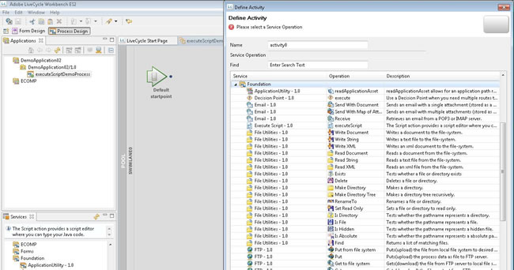

# Utiliser le service Execute Script dans AEM Forms on JEE Workbench pour créer des données XML {#using-execute-script-service-forms-jee-workbench}

Il existe beaucoup de données XML associées aux workflows Process Management d’AEM Forms on JEE. Par exemple, les informations XML peuvent être créées dans un processus et envoyées à une application Flex dans un espace de travail AEM Forms on JEE , utilisées pour les paramètres du système ou pour transmettre des informations à et depuis des formulaires. Il existe de nombreux cas où un développeur d’AEM Forms on JEE doit gérer du XML, ce qui nécessite souvent que le XML soit géré via un processus AEM Forms on JEE.

Lorsque vous utilisez des paramètres XML simples, vous pouvez utiliser le service `Set Value` par défaut d’AEM Forms on JEE. Ce service définit la valeur d’un ou plusieurs éléments de données dans le modèle de données de processus. Pour une logique conditionnelle simple « si ceci, alors cela », ce service peut répondre à l’objectif.

Cependant, dans des situations plus complexes, le service Set Value n’est pas aussi efficace. Dans ces situations, il faut s’appuyer sur un ensemble plus robuste de commandes de programmation, telles que celles fournies par un langage de programmation comme Java™. L’utilisation de Java™ pour créer du XML complexe peut s’avérer beaucoup plus facile et plus claire que la création d’un document XML à partir d’un texte simple dans le service Set Value. En outre, il est plus facile d’inclure la programmation conditionnelle dans Java™ que dans un service Set Value.

## Utiliser le service Execute Script dans un processus {#using-execute-script-service-in-process}

Parmi tous les services AEM Forms on JEE standard disponibles dans AEM Forms on JEE Workbench se trouve le service `Execute Script`. Ce service permet d’exécuter des scripts dans des processus et fournit l’opération `executeScript` pour ce faire.

### Créer une application et un processus avec le service Execute Script défini comme une activité {#create-an-application}

La création globale d’applications et de processus est hors de portée pour ce tutoriel, mais pour l’application de cette instruction, une application nommée « DemoApplication02 » a été créée. En supposant qu’une application ait déjà été créée, vous devez créer un processus dans cette application pour appeler le service executeScript. Pour ajouter un processus à l’application qui inclut le service `Execute Script` :

1. Cliquez avec le bouton droit de la souris sur votre application et sélectionnez **[!UICONTROL Nouveau]**. Dans le menu déroulant **[!UICONTROL Nouveau]**, sélectionnez **[!UICONTROL Processus]**. Nommez votre processus, ajoutez une description si nécessaire, puis sélectionnez l’icône voulue pour représenter ce processus. Pour les besoins de ce tutoriel, nous avons créé un processus et l’avons appelé `executeScriptDemoProcess`.
1. Définissez vos points de départ ou optez simplement pour l’ajout de vos points de départ ultérieurement.
1. Le processus est maintenant créé et doit s’ouvrir automatiquement dans la fenêtre [!UICONTROL Conception de processus]. Dans cette fenêtre, cliquez sur l’icône de sélecteur d’activité en haut de la fenêtre Conception de processus et faites glisser la nouvelle activité sur la piste de navigation. À ce stade, la [!UICONTROL fenêtre Définir l’activité] doit apparaître (voir la figure ci-dessous).
   
1. Le service executeScript se trouve dans l’ensemble de services `Foundation`. Le nom Services répertorie l’objet sous la forme `Execute Script – 1.0` avec le nom d’opération `executeScript`. Cliquez pour sélectionner cet élément.
1. Ce processus doit maintenant être créé et, par défaut, la fenêtre [!UICONTROL Propriétés du processus] s’affiche dans le volet de gauche.

#### Ajouter un script au processus avec le service Execute Script {#add-script-to-process-with-execute-script}

Une fois le processus créé avec l’activité de service Execute Script définie, il est possible d’ajouter un script à ce processus. Pour ajouter un script à ce processus :

1. Accédez à la palette [!UICONTROL Propriétés du processus]. Dans cette palette, développez la section [!UICONTROL Entrée] et cliquez sur l’icône « … ».

1. Dans la zone de texte qui s’affiche, écrivez votre script. Une fois le script écrit, appuyez sur OK (voir la figure ci-dessous).
   

## Créer du code XML à l’aide du service Execute Script {#create-xml-execute-script-service}

Une fois qu’un processus a été créé avec le service Execute Script inclus, il est possible d’utiliser ce script pour créer du code XML. Il est possible d’écrire les scripts décrits ci-dessous dans la zone de texte décrite dans la section Ajouter un script au processus avec la section Service `Execute Script` ci-dessus.

**À propos de la technologie du service Execute Script**

Pour connaître les capacités et les limites du service Execute Script, il faut connaître les fondements technologiques du service. AEM Forms on JEE utilise l’analyseur DOM (Apache Xerces Document Object Model) pour créer et stocker des variables XML dans des processus. Xerces est une implémentation Java™ de la [spécification du modèle d’objet de document](https://dom.spec.whatwg.org/) du W3C. La spécification DOM est un moyen standard de manipuler XML qui existe depuis 1998. L’implémentation Java™ de Xerces, Xerces-J, prend en charge DOM Level 2 version 1.0.

Les classes Java™ utilisées pour stocker les variables XML sont :

* org.apache.xerces.dom.NodeImpl et

* org.apache.xerces.dom.DocumentImpl

DocumentImpl est une sous-classe de NodeImpl. On peut donc supposer que toute variable de processus XML est une dérivation de NodeImpl. Voir la documentation de [NodeImpl](https://xerces.apache.org/xerces-j/apiDocs/org/apache/xerces/dom/NodeImpl.html) pour plus d’informations.

**Exemple de création de fichier XML à l’aide du service Execute Script**

Consultez ci-après un exemple de création de fichier XML au sein d’un service Execute Script. Le processus comporte une variable de nœud qui est de type XML. Le résultat de cette activité est un document XML. Lʼutilité de ce document, ou son application au processus global, est hors de portée de ce tutoriel ; tout dépend de ce que doit accomplir le document XML dans lʼapplication globale. Comme mentionné en introduction, le document XML peut servir à de nombreuses fins dans les formulaires et processus d’AEM Forms sur JEE. Ce tutoriel se contente d’expliquer comment coder l’activité Execute Script afin de générer un simple document XML.

Un script Java simple permettant de générer un document XML se présenterait comme suit :

```xml
import org.apache.xerces.dom.DocumentImpl;

import org.w3c.dom.Document;

import org.w3c.dom.Element;


Document document = new DocumentImpl();

Element topLevelResources = document.createElement("resources");

Element resource = document.createElement("resource");

resource.setAttribute("id", "first item id");

resource.setAttribute("value", "first item value");

topLevelResources.appendChild(resource);

document.appendChild(topLevelResources);

patExecContext.setProcessDataValue("/process_data/node", document);
```

>[!NOTE]
>
>Les objets DOM mentionnés précédemment doivent être importés dans le script.

Le résultat de ce script simple est un nouveau document XML avec un nœud de variable défini sur :

```xml
<resources>

<resource id="first item id" value="first item value"/>

</resources>
```

**Utiliser une boucle itérative pour ajouter des nœuds au XML**

Il est également possible d’ajouter des nœuds à une variable XML existante dans le processus. La variable, le nœud, contient l’objet XML venant d’être créé.

```xml
Document document = patExecContext.getProcessDataValue("/process_data/node");

NodeList childNodes = document.getChildNodes();

int numChildren = childNodes.getLength();

for (int i = 0; i < numChildren; i++)

{

Node currentChild = childNodes.item(i);

if (currentChild.getNodeType() == Node.ELEMENT_NODE)

{

// found the top-level node

Element newResource = document.createElement("resource");

newResource.setAttribute("id", "second item id");

newResource.setAttribute("value", "second item value");

currentChild.appendChild(newResource);

break;

}

}

patExecContext.setProcessDataValue("/process_data/node", document);
The variable node in the XML is now set to:

<resources> 

<resource id="first item id" value="first item value"/> 

<resource id="second item id" value="second item value"/> 

</resources>
```
