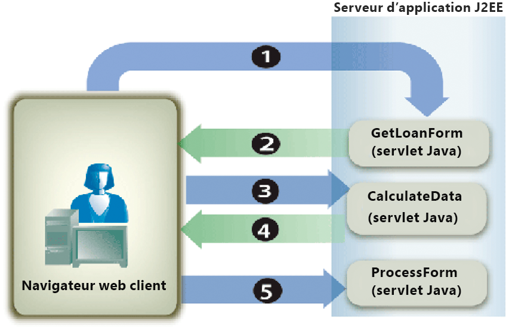

# Calcul des données du formulaire {#calculating-form-data}

**Les exemples et exemples de ce document ne concernent que l’environnement AEM Forms on JEE.**

Le service Forms peut calculer les valeurs qu’un utilisateur saisit dans un formulaire et afficher les résultats. Pour calculer les données de formulaire, vous devez effectuer deux tâches. Tout d’abord, vous créez un script de conception de formulaire qui calcule les données de formulaire. Une conception de formulaire prend en charge trois types de scripts. Un type de script est exécuté sur le client, un autre sur le serveur et le troisième sur le serveur et le client. Le type de script décrit dans cette rubrique s’exécute sur le serveur. Les calculs côté serveur sont pris en charge pour les transformations HTML, PDF et Form Guide (obsolète).

Dans le cadre du processus de conception de formulaire, vous pouvez utiliser des calculs et des scripts pour offrir une expérience utilisateur plus riche. Les calculs et les scripts peuvent être ajoutés à la plupart des champs et objets de formulaire. Vous devez créer un script de conception de formulaire pour effectuer des opérations de calcul sur les données saisies par un utilisateur dans un formulaire interactif.

L’utilisateur saisit des valeurs dans le formulaire et clique sur le bouton Calculer pour vue des résultats. Le processus suivant décrit un exemple d’application qui permet à un utilisateur de calculer des données :

* L’utilisateur accède à une page HTML nommée StartLoan.html qui fait office de page de début de l’application Web. Cette page appelle un servlet Java nommé `GetLoanForm`.
* La servlet `GetLoanForm` génère un formulaire de prêt. Ce formulaire contient un script, des champs interactifs, un bouton Calculer et un bouton Envoyer.
* L’utilisateur saisit des valeurs dans les champs du formulaire et clique sur le bouton Calculer. Le formulaire est envoyé au servlet Java `CalculateData` où le script est exécuté. Le formulaire est renvoyé à l’utilisateur avec les résultats de calcul affichés dans le formulaire.
* L’utilisateur continue à saisir et à calculer les valeurs jusqu’à ce qu’un résultat satisfaisant s’affiche. Lorsque l’utilisateur est satisfait, il clique sur le bouton Envoyer pour traiter le formulaire. Le formulaire est envoyé à un autre servlet Java nommé `ProcessForm` qui est chargé de récupérer les données envoyées. (Voir [Gestion du Forms envoyé](/help/forms/developing/rendering-forms.md#handling-submitted-forms).)


Le diagramme suivant illustre le flux logique de l’application.



Le tableau suivant décrit les étapes de ce diagramme.

<table>
 <thead>
  <tr>
   <th><p>Étape</p></th>
   <th><p>Description</p></th>
  </tr>
 </thead>
 <tbody>
  <tr>
   <td><p>1</p></td>
   <td><p>La servlet Java <code>GetLoanForm</code> est appelée à partir de la page début HTML. </p></td>
  </tr>
  <tr>
   <td><p>2</p></td>
   <td><p>Le servlet Java <code>GetLoanForm</code> utilise l'API Client du service Forms pour rendre le formulaire de prêt au navigateur Web client. La différence entre le rendu d’un formulaire qui contient un script configuré pour s’exécuter sur le serveur et le rendu d’un formulaire qui ne contient pas de script est que vous devez spécifier l’emplacement de cible utilisé pour exécuter le script. Si aucun emplacement de cible n’est spécifié, un script configuré pour s’exécuter sur le serveur n’est pas exécuté. Prenons l’exemple de l’application présentée dans cette section. Le servlet Java <code>CalculateData</code> correspond à l’emplacement de cible où le script est exécuté.</p></td>
  </tr>
  <tr>
   <td><p>3</p></td>
   <td><p>L’utilisateur saisit des données dans des champs interactifs et clique sur le bouton Calculer. Le formulaire est envoyé au servlet Java <code>CalculateData</code>, où le script est exécuté. </p></td>
  </tr>
  <tr>
   <td><p>4</p></td>
   <td><p>Le formulaire est rendu au navigateur Web avec les résultats de calcul affichés dans le formulaire. </p></td>
  </tr>
  <tr>
   <td><p>5</p></td>
   <td><p>L’utilisateur clique sur le bouton Envoyer lorsque les valeurs sont satisfaisantes. Le formulaire est envoyé à une autre servlet Java nommée <code>ProcessForm</code>.</p></td>
  </tr>
 </tbody>
</table>

En règle générale, un formulaire envoyé en tant que contenu PDF contient des scripts exécutés sur le client. Cependant, les calculs côté serveur peuvent également être exécutés. Impossible d’utiliser un bouton Envoyer pour calculer les scripts. Dans ce cas, les calculs ne sont pas exécutés car le service Forms considère que l’interaction est terminée.

Pour illustrer l’utilisation d’un script de conception de formulaire, cette section examine un formulaire interactif simple qui contient un script configuré pour s’exécuter sur le serveur. Le diagramme suivant présente une conception de formulaire contenant un script qui ajoute des valeurs saisies par un utilisateur dans les deux premiers champs et affiche le résultat dans le troisième champ.


**A.** Un champ nommé NumericField1  **B.** Un champ nommé NumericField2  **C.** Un champ nommé NumericField3

La syntaxe du script se trouvant dans cette conception de formulaire est la suivante :

```javascript
     NumericField3 = NumericField2 + NumericField1
```

Dans cette conception de formulaire, le bouton Calculer est un bouton de commande et le script se trouve dans le événement `Click` de ce bouton. Lorsqu’un utilisateur saisit des valeurs dans les deux premiers champs (NumericField1 et NumericField2) et clique sur le bouton Calculer, le formulaire est envoyé au service Forms, où le script est exécuté. Le service Forms restitue le formulaire au périphérique client avec les résultats du calcul affichés dans le champ NumericField3.

>[!NOTE]
>
>Pour plus d’informations sur la création d’un script de conception de formulaire, voir [Forms Designer](https://www.adobe.com/go/learn_aemforms_designer_63).

>[!NOTE]
>
>Pour plus d’informations sur le service Forms, voir [Guide de référence des services pour AEM Forms](https://www.adobe.com/go/learn_aemforms_services_63).

## Résumé des étapes {#summary-of-steps}

Pour calculer les données de formulaire, effectuez les tâches suivantes :

1. Incluez des fichiers de projet.
1. Créez un objet API Client Forms.
1. Récupérez un formulaire contenant un script de calcul.
1. Réécriture du flux de données de formulaire dans le navigateur Web client

**Inclure les fichiers de projet**

Incluez les fichiers nécessaires dans votre projet de développement. Si vous créez une application cliente à l’aide de Java, incluez les fichiers JAR nécessaires. Si vous utilisez des services Web, veillez à inclure les fichiers proxy.

**Création d’un objet API Client Forms**

Avant de pouvoir exécuter par programmation une opération d’API Client de service Forms, vous devez créer un client de service Forms. Si vous utilisez l’API Java, créez un objet `FormsServiceClient`. Si vous utilisez l’API du service Web Forms, créez un objet `FormsServiceService`.

**Récupération d’un formulaire contenant un script de calcul**

Vous utilisez l’API Client du service Forms pour créer une logique d’application qui gère un formulaire contenant un script configuré pour s’exécuter sur le serveur. Le processus est similaire à la gestion d’un formulaire envoyé. (Voir [Gestion du Forms envoyé](/help/forms/developing/handling-submitted-forms.md).)

Vérifiez que l’état de traitement associé au formulaire envoyé est `1` `(Calculate)`, ce qui signifie que le service Forms effectue une opération de calcul sur les données du formulaire et que les résultats doivent être renvoyés à l’utilisateur. Dans ce cas, un script configuré pour s’exécuter sur le serveur est exécuté automatiquement.

**Réécriture du flux de données de formulaire dans le navigateur Web client**

Après avoir vérifié que l’état de traitement associé à un formulaire envoyé est `1`, vous devez réécrire les résultats dans le navigateur Web client. Lorsque le formulaire est affiché, la valeur calculée s’affiche dans le ou les champs appropriés.

**Voir aussi**

[Inclusion des fichiers de bibliothèque Java AEM Forms](/help/forms/developing/invoking-aem-forms-using-java.md#including-aem-forms-java-library-files) 
[Calculer les données de formulaire à l’aide de Java ](/help/forms/developing/calculating-form-data.md#calculate-form-data-using-the-java-api)
[APICalculer les données de formulaire à l’aide du service Web ](/help/forms/developing/calculating-form-data.md#calculate-form-data-using-the-web-service-api)
[APISdéfinition des ](/help/forms/developing/invoking-aem-forms-using-java.md#setting-connection-properties)
[propriétés de connexionAPI de service Forms ](/help/forms/developing/forms-service-api-quick-starts.md#forms-service-api-quick-starts)
[Démarrage rapideRendu de ](/help/forms/developing/rendering-interactive-pdf-forms.md)
[formulaires PDF interactifsCréation d’Applications web renvoyant du Forms](/help/forms/developing/creating-web-applications-renders-forms.md)

## Calculer les données de formulaire à l’aide de l’API Java {#calculate-form-data-using-the-java-api}

Calculez les données de formulaire à l’aide de l’API Forms (Java) :

1. Inclure les fichiers de projet

   Incluez des fichiers JAR client, tels que adobe-forms-client.jar, dans le chemin de classe de votre projet Java.

1. Création d’un objet API Client Forms

   * Créez un objet `ServiceClientFactory` qui contient des propriétés de connexion.
   * Créez un objet `FormsServiceClient` en utilisant son constructeur et en transmettant l&#39;objet `ServiceClientFactory`.

1. Récupération d’un formulaire contenant un script de calcul

   * Pour récupérer des données de formulaire contenant un script de calcul, créez un objet `com.adobe.idp.Document` à l’aide de son constructeur et appelez la méthode `javax.servlet.http.HttpServletResponse` de l’objet `getInputStream` à partir du constructeur.
   * Appelez la méthode `processFormSubmission` de l’objet `FormsServiceClient` et transmettez les valeurs suivantes :

      * Objet `com.adobe.idp.Document` contenant les données du formulaire.
      * Valeur de chaîne qui spécifie les variables d’environnement, y compris tous les en-têtes HTTP appropriés. Vous devez spécifier le type de contenu à gérer en spécifiant une ou plusieurs valeurs pour la variable d&#39;environnement `CONTENT_TYPE`. Par exemple, pour gérer les données XML et PDF, spécifiez la valeur de chaîne suivante pour ce paramètre : `CONTENT_TYPE=application/xml&CONTENT_TYPE=application/pdf`
      * Valeur de chaîne qui spécifie la valeur d&#39;en-tête `HTTP_USER_AGENT` ; par exemple, `Mozilla/4.0 (compatible; MSIE 6.0; Windows NT 5.1; SV1; .NET CLR 1.1.4322)`.
      * Objet `RenderOptionsSpec` qui stocke les options d’exécution.

      La méthode `processFormSubmission` renvoie un objet `FormsResult` contenant les résultats de l’envoi du formulaire.

   * Vérifiez que l’état de traitement associé à un formulaire envoyé est `1` en appelant la méthode `FormsResult` de l’objet `getAction`. Si cette méthode renvoie la valeur `1`, le calcul a été effectué et les données peuvent être renvoyées au navigateur Web client.


1. Réécriture du flux de données de formulaire dans le navigateur Web client

   * Créez un objet `javax.servlet.ServletOutputStream` utilisé pour envoyer un flux de données de formulaire au navigateur Web client.
   * Créez un objet `com.adobe.idp.Document` en appelant la méthode `FormsResult` de l&#39;objet &quot;s `getOutputContent`.
   * Créez un objet `java.io.InputStream` en appelant la méthode `com.adobe.idp.Document` de l&#39;objet `getInputStream`.
   * Créez un tableau d’octets et remplissez-le avec le flux de données du formulaire en appelant la méthode `InputStream` de l’objet `read` et en transmettant le tableau d’octets comme argument.
   * Appelez la méthode `javax.servlet.ServletOutputStream` de l’objet `write` pour envoyer le flux de données de formulaire au navigateur Web client. Transférez le tableau d’octets à la méthode `write`.

**Voir aussi**


[Inclusion des fichiers de bibliothèque Java AEM Forms](/help/forms/developing/invoking-aem-forms-using-java.md#including-aem-forms-java-library-files)
[Réglage des propriétés de la connexion](/help/forms/developing/invoking-aem-forms-using-java.md#setting-connection-properties)

## Calculer les données de formulaire à l’aide de l’API de service Web {#calculate-form-data-using-the-web-service-api}

Calculez les données de formulaire à l’aide de l’API Forms (service Web) :

1. Inclure les fichiers de projet

   * Créez des classes de proxy Java qui utilisent le WSDL du service Forms.
   * Incluez les classes proxy Java dans votre chemin de classe.

1. Création d’un objet API Client Forms

   Créez un objet `FormsService` et définissez des valeurs d’authentification.

1. Récupération d’un formulaire contenant un script de calcul

   * Pour récupérer les données de formulaire publiées sur un servlet Java, créez un objet `BLOB` à l’aide de son constructeur.
   * Créez un objet `java.io.InputStream` en utilisant la méthode `javax.servlet.http.HttpServletResponse` de l&#39;objet `getInputStream`.
   * Créez un objet `java.io.ByteArrayOutputStream` en utilisant son constructeur et en transmettant la longueur de l&#39;objet `java.io.InputStream`.
   * Copiez le contenu de l&#39;objet `java.io.InputStream` dans l&#39;objet `java.io.ByteArrayOutputStream`.
   * Créez un tableau d’octets en appelant la méthode `toByteArray` de l’objet `java.io.ByteArrayOutputStream`.
   * Renseignez l’objet `BLOB` en appelant sa méthode `setBinaryData` et en transmettant le tableau d’octets comme argument.
   * Créez un objet `RenderOptionsSpec` en utilisant son constructeur. Définissez la valeur du paramètre régional en appelant la méthode `setLocale` de l’objet `RenderOptionsSpec` et en transmettant une valeur de chaîne qui spécifie la valeur du paramètre régional.
   * Appelez la méthode `processFormSubmission` de l’objet `FormsServiceClient` et transmettez les valeurs suivantes :

      * Objet `BLOB` contenant les données du formulaire.
      * Une valeur de chaîne qui spécifie des variables d’environnement inclut tous les en-têtes HTTP appropriés. Par exemple, vous pouvez spécifier la valeur de chaîne suivante : `HTTP_REFERER=referrer&HTTP_CONNECTION=keep-alive&CONTENT_TYPE=application/xml`
      * Valeur de chaîne qui spécifie la valeur d&#39;en-tête `HTTP_USER_AGENT` ; par exemple, `Mozilla/4.0 (compatible; MSIE 6.0; Windows NT 5.1; SV1; .NET CLR 1.1.4322)`.
      * Objet `RenderOptionsSpec` qui stocke les options d’exécution. Pour plus d’informations, .
      * Objet `BLOBHolder` vide renseigné par la méthode.
      * Objet `javax.xml.rpc.holders.StringHolder` vide renseigné par la méthode.
      * Objet `BLOBHolder` vide renseigné par la méthode.
      * Objet `BLOBHolder` vide renseigné par la méthode.
      * Objet `javax.xml.rpc.holders.ShortHolder` vide renseigné par la méthode.
      * Objet `MyArrayOf_xsd_anyTypeHolder` vide renseigné par la méthode. Ce paramètre permet de stocker les pièces jointes envoyées avec le formulaire.
      * Un objet `FormsResultHolder` vide qui est renseigné par la méthode avec le formulaire envoyé.

      La méthode `processFormSubmission` renseigne le paramètre `FormsResultHolder` avec les résultats de l’envoi du formulaire. La méthode `processFormSubmission` renvoie un objet `FormsResult` contenant les résultats de l’envoi du formulaire.

   * Vérifiez que l’état de traitement associé à un formulaire envoyé est `1` en appelant la méthode `FormsResult` de l’objet `getAction`. Si cette méthode renvoie la valeur `1`, le calcul a été effectué et les données peuvent être renvoyées au navigateur Web client.


1. Réécriture du flux de données de formulaire dans le navigateur Web client

   * Créez un objet `javax.servlet.ServletOutputStream` utilisé pour envoyer un flux de données de formulaire au navigateur Web client.
   * Créez un objet `BLOB` contenant des données de formulaire en appelant la méthode `FormsResult` de l&#39;objet `getOutputContent`.
   * Créez un tableau d’octets et remplissez-le en appelant la méthode `BLOB` de l’objet `getBinaryData`. Cette tâche affecte le contenu de l&#39;objet `FormsResult` au tableau d&#39;octets.
   * Appelez la méthode `javax.servlet.http.HttpServletResponse` de l’objet `write` pour envoyer le flux de données de formulaire au navigateur Web client. Transférez le tableau d’octets à la méthode `write`.

**Voir**
[également Appel d’AEM Forms à l’aide du codage Base64](/help/forms/developing/invoking-aem-forms-using-web.md#invoking-aem-forms-using-base64-encoding)
