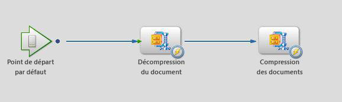

# Compresser et décompresser des fichiers à l’aide d’un DSC personnalisé AEM Forms sur JEE {#compressing-decompressing-files}

## Connaissances préalables {#prerequisites}

Expérience avec AEM Forms sur JEE Process Management, programmation Java™ de base et création de composants personnalisés.

**Autres produits nécessaires**

Éditeur Java™, par exemple [Eclipse](https://www.eclipse.org/) ou [Netbeans IDE](https://netbeans.apache.org/)

## Niveau d’utilisateur {#user-level}

Intermédiaire

AEM Forms on JEE permet aux développeurs et développeuses de créer des ASC (Acrobat Services Container) personnalisés pour créer des fonctionnalités enrichies prêtes à l’emploi. Ces composants que vous créez sont enfichables dans l’environnement d’exécution AEM Forms sur JEE afin de remplir la fonction qui leur a été donnée. Cet article explique comment créer un service ZIP personnalisé, qui peut être utilisé pour compresser une liste de fichiers dans un fichier .zip et décompresser un fichier .zip vers une liste de documents.

## Créer un composant ASC personnalisé {#create-custom-dsc-component}

Créez un composant ASC personnalisé avec deux opérations de service afin de pouvoir compresser et décompresser une liste de documents. Ce composant utilise le package java.util.zip pour la compression et la décompression.

Pour créer un composant ASC personnalisé :

1. Ajouter le fichier adobe-livecycle-client.jar à la bibliothèque
1. Ajouter les icônes requises
1. Créer une classe publique
1. Créer deux méthodes publiques appelées UnzipDocument et ZipDocuments
1. Écrire la logique de compression et de décompression

Le code se trouve ci-dessous :

```java
/*
 * Custom DSC : ZIP Utility
 * Purpose: This is a LiveCycle ES2 custom component used to Compress & Decompress List of Documents
 * Author: Nithiyanandam Dharmadass
 * Organization: Ministry of Finance, Kingdom of Bahrain
 * Last modified Date: 18/Apr/2011
 */
package nith.lces2.dsc;

import java.util.zip.ZipEntry;
import java.util.zip.ZipInputStream;
import com.adobe.idp.Document;
import java.io.ByteArrayOutputStream;
import java.io.InputStream;
import java.util.ArrayList;
import java.util.List;
import java.util.zip.ZipOutputStream;

public class ZIPService {

    static final int BUFFER = 2048; // 2MB buffer size

    public java.util.List UnzipDocument(com.adobe.idp.Document zipDocument) throws Exception {
        ZipInputStream zis = new ZipInputStream(zipDocument.getInputStream());

        ZipEntry zipFile;

        List resultList = new ArrayList();

        while ((zipFile = zis.getNextEntry()) != null) {

            ByteArrayOutputStream byteArrayOutStream = new ByteArrayOutputStream();

            int count;  // an int variable to hold the number of bytes read from input stream
            byte data[] = new byte[BUFFER];
            while ((count = zis.read(data, 0, BUFFER)) != -1) {
                byteArrayOutStream.write(data, 0, count);   // write to byte array
            }

            com.adobe.idp.Document unzippedDoc = new Document(byteArrayOutStream.toByteArray());  // create an idp document
            unzippedDoc.setAttribute("file", zipFile.getName());
            unzippedDoc.setAttribute("wsfilename", zipFile.getName());  // update the wsfilename attribute
            resultList.add(unzippedDoc);
        }
        return resultList;  // List of uncompressed documents
    }

    public com.adobe.idp.Document ZipDocuments(java.util.List listOfDocuments,java.lang.String zipFileName) throws Exception {

        if (listOfDocuments == null || listOfDocuments.size() == 0) {
            return null;
        }

        ByteArrayOutputStream byteArrayOutStream = new ByteArrayOutputStream();
        ZipOutputStream zos = new ZipOutputStream(byteArrayOutStream);  // ZIP Output Stream

        for (int i = 0; i < listOfDocuments.size(); i++) {
            Document doc = (Document) listOfDocuments.get(i);
            InputStream docInputStream = doc.getInputStream();
            ZipEntry zipEntry = new ZipEntry(doc.getAttribute("file").toString());
            zos.putNextEntry(zipEntry);
            int count;
            byte data[] = new byte[BUFFER];
            while ((count = docInputStream.read(data, 0, BUFFER)) != -1) {
                zos.write(data, 0, count);  // Read document content and add to zip entry
            }
            zos.closeEntry();
        }
        zos.flush();
        zos.close();

        Document zippedDoc = new Document(byteArrayOutStream.toByteArray());
        if(zipFileName==null || zipFileName.equals(""))
        {
            zipFileName = "CompressedList.zip";
        }
        zippedDoc.setAttribute("file", zipFileName);
        return zippedDoc;
    }
}
```

## Créer un fichier Component.XML {#create-component-xml-file}

Un fichier component.xml doit être créé dans le dossier racine du package qui a défini les opérations de service et leurs paramètres.

Le fichier component.xml est affiché ci-dessous :

```xml
<?xml version="1.0" encoding="UTF-8"?>
<component xmlns="https://adobe.com/idp/dsc/component/document">
<!-- Unique id identifying this component -->
   <component-id>ZipService</component-id>

<!-- Version -->
   <version>1.0</version>

<!-- Start of the Service definition -->
   <services>
<!-- Unique name for service descriptor.
           The value is used as the default name for
           deployed services -->
      <service name="ZipService">
<!-- service implementation class definition -->
        <implementation-class>nith.lces2.dsc.ZIPService</implementation-class>

<!-- description -->
        <description>Compress or Decompress list of documents</description>

<!--  You can provide your own icons for a distinct look   -->
          <small-icon>icons/Zip_icon16.png</small-icon>
          <large-icon>icons/Zip_icon32.png</large-icon>


<!-- automatically deploys the service and starts it after installation -->
         <auto-deploy service-id="ZipService" />

         <operations>
<!-- method name in the interface setSmtpHost-->
            <operation name="UnzipDocument">
<!-- input parameters to the "send" method -->
              <input-parameter name="zipDocument" title="Input ZIP Document" type="com.adobe.idp.Document">
                    <hint>A ZIP File to be decompressed</hint>
                </input-parameter>
                <output-parameter name="resultList" title="Decompressed list of documents" type="java.util.List">
                    <hint>Decompressed ZIP list</hint>
                </output-parameter>
            </operation>
            <operation name="ZipDocuments">
<!-- input parameters to the "send" method -->
              <input-parameter name="listOfDocuments" title="List of Documents" type="java.util.List">
                    <hint>A list of documents to be Compressed</hint>
                </input-parameter>
                <input-parameter name="zipFileName" title="Result File Name" type="java.lang.String">
                    <hint>The name of compressed file (optional)</hint>
                </input-parameter>

                <output-parameter name="zippedDoc" title="Compressed Zip file" type="com.adobe.idp.Document">
                    <hint>Compressed ZIP File</hint>
                </output-parameter>
            </operation>
             </operations>
      </service>
   </services>
</component>
```

## Regrouper et déployer le composant {#packaging-deploying-component}

1. Compilez le projet Java™ et créez un fichier .JAR.
1. Déployer le composant (fichier .JAR) sur le runtime AEM Forms sur JEE via Workbench
1. Démarrer le service à partir de Workbench (voir lʼillustration ci-dessous)


## Utiliser le service ZIP dans les workflows {#using-zip-service-in-workflows}

L’opération UnzipDocument du service personnalisé peut désormais accepter une variable de document comme entrée et retourner une liste de variables de document comme sortie.


De même, l’opération ZipDocuments du composant personnalisé peut accepter une liste de documents comme entrée, les compresser sous forme de fichier zip et retourner le document compressé.


L’orchestration de workflow suivante montre comment décompresser le fichier ZIP donné, le recompresser en un autre fichier ZIP et renvoyer la sortie (voir l’illustration ci-dessous).



## Exemples de cas d’utilisation commerciale {#business-use-cases}

Vous pouvez utiliser ce service ZIP dans les cas d’utilisation suivants :

* Rechercher tous les fichiers dans un dossier donné et les renvoyer sous forme de document compressé

* Fournir un fichier ZIP contenant plusieurs documents PDF auxquels des extensions Reader peuvent être ajoutées après leur décompression. Cela nécessite le module Reader Extensions pour AEM Forms on JEE.

* Fournir un fichier ZIP contenant un type hétérogène de document qui peut être décompressé et converti en document PDF à l’aide du service Generate PDF.

* La politique protège une liste de documents et renvoie un fichier ZIP.

* Permettre aux utilisateurs et utilisatrices de télécharger toutes les pièces jointes d’une instance de processus sous la forme d’un fichier ZIP unique.
