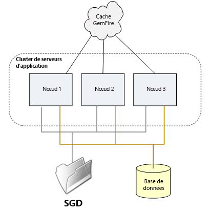
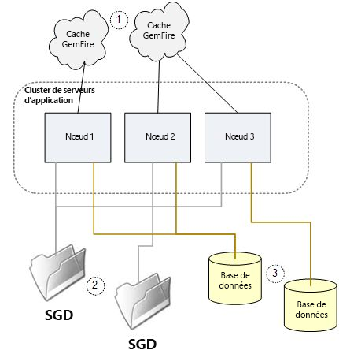

# Configurer et dépanner un cluster de serveurs AEM Forms on JEE {#configuring-troubleshooting-aem-forms-jee-server-cluster}

## Connaissances préalables {#prerequisites}

Connaissance des serveurs d’applications Adobe Experience Manager (AEM) Forms on JEE, JBoss®, WebSphere® et WebLogic®, des systèmes d’exploitation Red Hat® Linux®, SUSE® Linux®, Microsoft® Windows, IBM® AIX® ou Sun Solaris®, des serveurs de base de données Oracle, IBM® DB2® ou SQL Server, ainsi que des environnements web.

## Niveau d’utilisateur {#user-level}

Avancé

Un cluster AEM Forms on JEE est une topologie conçue pour permettre à AEM Forms on JEE de résister à l’échec d’un cluster. Il permet également à la topologie de mettre à l’échelle la capacité du système, au-delà des capacités d’un seul nœud. Un cluster combine plusieurs nœuds en un seul système logique qui partage des données et permet aux transactions d’étendre plusieurs nœuds dans leur exécution. Un cluster est le moyen le plus communément utilisé pour mettre à l’échelle AEM Forms on JEE, en ce sens que toute combinaison de services gérant une combinaison de charges de travail peut être prise en charge. Un cluster AEM Forms on JEE n’est pas nécessairement le mieux adapté à tous les types de déploiement. Une architecture avec équilibrage de la charge du serveur, non organisée en cluster, peut se révéler appropriée.

Ce document décrit les exigences de configuration spécifiques et les problèmes potentiels que vous pouvez rencontrer avec un cluster AEM Forms on JEE.

## Que contient un cluster ? {#what-is-in-cluster}

Les nœuds de cluster d’AEM Forms on JEE communiquent entre eux et partagent des informations pour permettre au cluster dans son ensemble d’avoir une configuration et un état d’application cohérents. Le partage d’informations au sein du cluster est effectué simultanément de plusieurs façons, utilisées dans différents contextes. Les méthodes de partage d’informations de base sont illustrées dans la figure ci-dessous :



### Cluster de serveurs d’applications {#application-server-cluster}

Un cluster AEM Forms on JEE repose sur les fonctionnalités de mise en cluster du serveur d’applications sous-jacent. Les clusters de serveurs d’applications permettent de gérer la configuration du cluster dans son ensemble et fournissent des services de cluster de bas niveau tels que Java™ Naming and Directory Interface (JNDI) qui permettent aux composants logiciels de se trouver les uns les autres dans le cluster. La sophistication des services de cluster et les dépendances techniques sous-jacentes du serveur d’applications dépendent du serveur d’applications. WebSphere® et WebLogic disposent de fonctionnalités de gestion sophistiquées des clusters, tandis que JBoss® propose une approche basique.

### Cache GemFire {#gemfire-cache}

Le cache GemFire est un mécanisme de cache distribué, implémenté dans chaque nœud de cluster. Les nœuds se trouvent les uns les autres et construisent un seul cache logique qui est maintenu cohérent entre les nœuds. Les nœuds qui se trouvent se rejoignent pour gérer un seul cache notionnel représenté sous la forme d’un nuage à la figure 1. Contrairement au répertoire de stockage global de documents et à la base de données, le cache est une entité purement théorique. Le contenu réellement mis en cache est stocké en mémoire et dans le répertoire `LC_TEMP` sur chacun des nœuds du cluster.

### Base de données {#database}

La base de données AEM Forms on JEE, accessible via les sources de données JDBC IDP_DS, EDC_DS, etc., est partagée par tous les nœuds du cluster. La plupart des données persistantes concernant l’état d’AEM Forms on JEE, telles que les transactions en cours, les données utilisateur associées aux transactions en cours et les données concernant la manière dont les paramètres système ont été définis, se trouvent dans cette base de données.

### Stockage global de documents {#global-document-storage}

Le stockage global de documents (GDS) est une zone de stockage basé sur un système de fichiers utilisée par Document Manager (classe IDPDocument) dans AEM Forms on JEE. Le GDS stocke des fichiers de courte et de longue durée qui doivent être accessibles à tous les nœuds du cluster.

### Autres éléments {#other-items}

Outre ces ressources partagées principales, d’autres éléments, comme Quartz, agissent comme des clusters spécifiques. Quartz est un sous-système de planificateur utilisé par AEM Forms on JEE, qui fait appel à des tables de base de données pour conserver ses connaissances sur ce qui a été planifié et sur les activités planifiées en cours d’exécution. Quartz doit être configuré différemment pour les clusters et les installations à un seul nœud, et il reprend son signal d’autres paramètres d’AEM Forms on JEE.

## Problèmes de configuration courants {#common-configuration}

L’une des choses les plus frustrantes concernant la maintenance ou la résolution des problèmes d’un cluster AEM Forms on JEE est qu’il n’existe pas d’emplacement unique pour vérifier l’intégrité du cluster. Pour confirmer que tout est correct dans le cluster, une enquête et une analyse sont nécessaires. Il existe plusieurs modes d’échec du fonctionnement du cluster, selon le problème lié à la configuration. La figure ci-dessous illustre un cluster mal configuré dans lequel plusieurs ressources partagées sont partagées de manière incorrecte.



Découvrez le fonctionnement de la mise en cluster et les types d’éléments que vous pouvez rechercher et vérifier dans un cluster, même si vous n’avez pas l’intention d’exécuter AEM Forms on JEE dans un cluster. En effet, certaines parties d’AEM Forms on JEE pourraient présenter des signaux sur le fonctionnement incorrect d’un cluster et adopter un comportement inattendu.

Quel est donc le problème avec la configuration de partage dans la figure ci-dessus ? Les sections suivantes décrivent les problèmes :

### (1) Configuration d’un cluster GemFire {#gemfire-cluster-configuration}

Plusieurs problèmes peuvent se produire avec le cache Gemfire. Voici deux scénarios classiques :

* Les nœuds qui devraient pouvoir se trouver les uns les autres n’y parviennent pas.

* Les nœuds mis en cluster peuvent se trouver les uns les autres et partager un cache alors qu’ils ne le devraient pas.

Si vous avez des nœuds à mettre en cluster, ils doivent se retrouver les uns les autres sur le réseau. Par défaut, ils le font avec des messages UDP à diffusion multiple. Chaque nœud envoie des messages de diffusion afin de signaler sa présence, et tout nœud qui reçoit un tel message commence à communiquer avec les autres nœuds qu’il rencontre. Ce genre de méthode de découverte automatique est courant, et de nombreux types de logiciels et d’appareils le font.

Un problème courant avec la découverte automatique est que les messages à diffusion multiple peuvent être filtrés par le réseau. Cela peut faire partie d’une politique réseau ou en raison de règles de pare-feu logiciel, ou parce qu’ils ne peuvent pas traverser le réseau existant entre les nœuds. En raison de la difficulté générale à obtenir la découverte automatique du portail UDP pour fonctionner dans des réseaux complexes, il est courant que les déploiements de production utilisent une autre méthode de découverte : les services de localisation TCP. Vous trouverez une discussion générale sur les services de localisation TCP dans les références.

**Comment savoir si j’utilise des services de localisation ou UDP ?**

Les propriétés JVM suivantes contrôlent la méthode utilisée par le cache GemFire pour trouver d’autres nœuds.

Paramètres de multidiffusion :

* `adobe.cache.multicast-port`: Port multidiffusion utilisé pour communiquer avec d’autres membres du système distribué. S’il est défini sur zéro, la multidiffusion est désactivée pour la détection et la distribution de membres.

* `gemfire.mcast-address` (facultatif) : permet de remplacer l’adresse IP par défaut utilisée par Gemfire.

Paramètres du service de localisation TCP :

* `adobe.cache.cluster-locators` : l’adresse IP/nom d’hôte du service de localisation TCP et port du service de localisation TCP pour tous les services de localisation utilisés par les membres du système pour communiquer avec les services de localisation en cours d’exécution.

La liste doit inclure tous les services de localisation actuellement utilisés et doit être configurée de manière cohérente pour chaque membre du système de cluster.

Si la liste des services de localisation TCP est vide, les services de localisation ne sont pas utilisés et la méthode de multidiffusion est utilisée à la place.

**Comment puis-je vérifier si mon service de localisation TCP est en cours d’exécution ?**

Tout d’abord, si les services de localisation TCP sont en cours d’utilisation, ils doivent être répertoriés dans la propriété JVM suivante sur tous les nœuds de cluster :

`-Dadobe.cache.cluster-locators=aix01.adobe.com[22345],aix02.adobe.com[22345]`

Il n’est pas nécessaire d’exécuter les services de localisation AEM Forms on JEE sur les nœuds du cluster, ils peuvent être exécutés sur d’autres systèmes distincts du cluster, le cas échéant. Plusieurs systèmes peuvent exécuter des localisateurs. Il est généralement recommandé de faire en sorte que ces derniers s’exécutent à deux endroits, ce qui peut entraîner un problème lors du redémarrage du cluster. Sur chacun des systèmes exécutant des services de localisation, vous devriez être en mesure de vérifier qu’ils s’exécutent à l’aide des commandes suivantes sur ces machines :

`netstat -an | grep 22345`

La réponse attendue doit être la suivante :

`tcp 0 0 *.22345 *.* LISTEN`

Voici une autre commande de vérification :

`ps -ef | grep gemfire`

La réponse attendue doit ressembler à ceci :

`livecycl 331984 1 0 10:14:51 pts/0 0:03 java -cp ./gemfire.jar: -Dgemfire.license-type=production -Dlocators=localhost[22345] com.gemstone.gemfire.distributed.Locator 22345`

**Comment puis-je voir les nœuds que GemFire considère se trouver dans le cluster ?**

GemFire génère des informations de journalisation qui peuvent être utilisées pour diagnostiquer les membres du cluster qui ont été trouvés et adoptés par le cache de GemFire. Vous pouvez l’utiliser pour vérifier que tous les membres corrects du cluster sont trouvés et qu’aucune découverte de nœud de cluster supplémentaire ou incorrecte n’est en cours. Le fichier journal de GemFire se trouve dans le répertoire temporaire AEM Forms on JEE configuré :

`.../LC_TEMP/adobeZZ__123456/Caching/Gemfire.log`

La chaîne numérique après `adobeZZ_` est propre au nœud du serveur. Vous devez donc rechercher le contenu réel de votre répertoire temporaire. Les deux caractères suivant `adobe` dépendent du type de serveur d’applications : `wl`, `jb` ou `ws`.

Les exemples de journaux suivants montrent ce qui se passe lorsqu’un cluster de deux nœuds se trouve.

Sur le premier nœud, AP-HP8 :

```xml
[config 2011/08/05 09:28:09.143 EDT GemfireCacheAdapter <server.startup : 0> tid=0x65] This member, ap-hp8(4268):18763, is becoming group coordinator.
[info 2011/08/05 09:28:09.151 EDT GemfireCacheAdapter <server.startup : 0> tid=0x65] Entered into membership in group GF6.5.1.17 with ID ap-hp8(4268)<v0>:18763/56449.
[info 2011/08/05 09:28:09.152 EDT GemfireCacheAdapter <server.startup : 0> tid=0x65] Starting DistributionManager ap-hp8(4268)<v0>:18763/56449.
[info 2011/08/05 09:28:09.153 EDT GemfireCacheAdapter <server.startup : 0> tid=0x65] Initial (membershipManager) view =  [ap-hp8(4268)<v0>:18763/56449]
[info 2011/08/05 09:28:09.153 EDT GemfireCacheAdapter <server.startup : 0> tid=0x65] Admitting member <ap-hp8(4268)<v0>:18763/56449>. Now there are 1 non-admin member(s).
[info 2011/08/05 09:28:09.154 EDT GemfireCacheAdapter <server.startup : 0> tid=0x65] ap-hp8(4268)<v0>:18763/56449 is the elder and the only member.
[info 2011/08/05 09:28:09.163 EDT GemfireCacheAdapter <server.startup : 0> tid=0x65] Did not hear back from any other system. I am the first one.
[info 2011/08/05 09:28:09.164 EDT GemfireCacheAdapter <server.startup : 0> tid=0x65] DistributionManager ap-hp8(4268)<v0>:18763/56449 started on 239.192.81.1[33456]. There were 0 other DMs. others: []
[info 2011/08/05 09:28:20.841 EDT GemfireCacheAdapter <Pooled Message Processor 1> tid=0xc4] New administration member detected at ap-hp7(2821)<v1>:19498/59136.
```

Sur l’autre nœud, AP-HP7 :

```xml
[info 2011/08/05 09:28:09.830 EDT GemfireCacheAdapter <server.startup : 0> tid=0x64] Attempting to join distributed system whose membership coordinator is ap-hp8(4268)<v0>:18763 using membership ID ap-hp7(2821):19498
[info 2011/08/05 09:28:10.058 EDT GemfireCacheAdapter <server.startup : 0> tid=0x64] Entered into membership in group GF6.5.1.17 with ID ap-hp7(2821)<v1>:19498/59136.
[info 2011/08/05 09:28:10.059 EDT GemfireCacheAdapter <server.startup : 0> tid=0x64] Starting DistributionManager ap-hp7(2821)<v1>:19498/59136.
[info 2011/08/05 09:28:10.060 EDT GemfireCacheAdapter <server.startup : 0> tid=0x64] Initial (membershipManager) view =  [ap-hp8(4268)<v0>:18763/56449, ap-hp7(2821)<v1>:19498/59136]
[info 2011/08/05 09:28:10.060 EDT GemfireCacheAdapter <server.startup : 0> tid=0x64] Admitting member <ap-hp8(4268)<v0>:18763/56449>. Now there are 1 non-admin member(s).
[info 2011/08/05 09:28:10.060 EDT GemfireCacheAdapter <server.startup : 0> tid=0x64] Admitting member <ap-hp7(2821)<v1>:19498/59136>. Now there are 2 non-admin member(s).
[info 2011/08/05 09:28:10.128 EDT GemfireCacheAdapter <server.startup : 0> tid=0x64] DistributionManager ap-hp7(2821)<v1>:19498/59136 started on 239.192.81.1[33456]. There were 1 other DMs. others: [ap-hp8(4268)<v0>:18763/56449]
```

**Et si GemFire trouve des nœuds qu’il ne devrait pas ?**

Chaque cluster distinct qui partage un réseau d’entreprise doit utiliser un ensemble distinct de services de localisation TCP, si certains sont utilisés, ou un numéro de port UDP distinct si une configuration UDP à diffusion multiple est utilisée. Comme la découverte automatique UDP est la configuration par défaut d’AEM Forms on JEE et que le même port par défaut 33456 est utilisé par plusieurs clusters, il est possible que les clusters qui ne doivent pas essayer de communiquer le fassent de manière inattendue. Par exemple, les clusters de production et d’assurance qualité doivent rester distincts, mais peuvent se connecter l’un à l’autre par le biais de la multidiffusion UDP.

La situation la plus courante lorsque vous découvrez des ports en double dans un réseau auquel GemFire n’est pas correctement mis en cluster est lors de l’amorçage d’un cluster. Ce que vous pouvez découvrir, c’est que le processus d’amorçage échoue sans cause évidente. En règle générale, des erreurs telles que celle-ci s’affichent :

```xml
Caused by: com.ibm.ejs.container.UnknownLocalException: nested exception is: com.adobe.pof.schema.ObjectTypeNotFoundException: Object Type: dsc.sc_service_configuration not found.
                at com.adobe.pof.schema.POFDefaultDomain.getObjectType(POFDefaultDomain.java:93)
                at com.adobe.idp.dsc.initializer.DSCInitializerBean.serviceConfigAuditAttributeExists(DSCInitializerBean.java:225)
                at com.adobe.idp.dsc.initializer.DSCInitializerBean.installSchema(DSCInitializerBean.java:186)
                at com.adobe.idp.dsc.initializer.DSCInitializerBean.bootstrap(DSCInitializerBean.java:94)
                at com.adobe.idp.dsc.initializer.EJSLocalStatelessDSCInitializerBeanLocalEJB_7bb34e85.bootstrap(Unknown Source)
                at com.adobe.livecycle.bootstrap.bootstrappers.DSCBootstrapper.bootstrap(DSCBootstrapper.java:68)
```

Dans ce cas, le programme d’amorçage fonctionne avec GemFire pour accéder aux tables requises. Il existe une incohérence entre les tables accessibles via JDBC et les informations de table mises en cache renvoyées par GemFire, qui proviennent d’un autre cluster avec une base de données sous-jacente différente.

Bien qu’un port en double soit souvent évident pendant l’amorçage, il est possible que cette situation se présente plus tard. Cela peut survenir lorsqu’un cluster est redémarré après son arrêt lorsque l’amorçage de l’autre cluster s’est produit. Ou, lorsque la configuration réseau est modifiée pour rendre les clusters qui étaient auparavant isolés, à des fins de multidiffusion, visibles les uns aux autres.

Pour diagnostiquer ces situations, examinez les journaux GemFire et déterminez soigneusement si seuls les nœuds attendus sont détectés. Pour résoudre le problème, il est nécessaire de modifier la propriété `adobe.cache.multicast-port` avec une valeur différente sur l’un ou les deux clusters.

### 2) Partage du stockage global de documents {#gds-sharing}

Le partage du répertoire de stockage global de documents est configuré en dehors d’AEM Forms on JEE lui-même, au niveau O/S, où vous devez organiser la mise à disposition de la même structure de répertoires partagée pour tous les nœuds du cluster. Sur les systèmes de type Windows, cela se fait en configurant un partage de fichiers soit d’un nœud à l’autre, soit d’un système de fichiers distant, tel qu’une solution NAS, à tous les nœuds. Sur les systèmes UNIX®, le partage du stockage global de documents est généralement effectué par le biais d’un partage de fichiers NFS, à nouveau, soit d’un nœud à l’autre, soit depuis un appareil NAS.

Un mode d’échec du cluster est possible si ce partage de fichiers distant n’est plus disponible ou présente des problèmes subtils. Un montage distant peut échouer en raison de problèmes réseau, de paramètres de sécurité ou d’une configuration incorrecte. Un redémarrage du système peut entraîner lʼentrée en vigueur des modifications de configuration effectuées des jours ou des semaines auparavant, ce qui peut causer des surprises.

**Que se passe-t-il si un partage NFS ne se monte pas ?**

Sous UNIX®, la façon dont les montages NFS sont mappés à la structure de répertoires peut permettre à un répertoire GDS apparemment utilisable dʼêtre disponible, même si le montage échoue. Prenez en compte les éléments suivants :

* Serveur NAS : dossier partagé NFS /u01/iapply/livecycle_gds
* Nœud 1 : un point de montage vers le dossier partagé (hébergé sur le serveur DB) situé à l’adresse : /u01/iapply/livecycle_gds
* Nœud 2 : un point de montage vers le dossier partagé (hébergé sur le serveur DB) situé à l’adresse : /u01/iapply/livecycle_gds

* LCES spécifie le chemin d’accès au répertoire GDS : /u01/iapply/livecycle_gds

Si le montage sur le nœud 1 échoue, la structure de répertoire contiendra toujours un chemin `/u01/iapply/livecycle_gds` vers le point de montage vide, et le nœud semblera fonctionner correctement. Mais comme le contenu GDS n’est pas réellement partagé avec l’autre nœud, le cluster ne fonctionnera pas correctement. Cela peut se produire et le cluster échoue alors pour des raisons qui nous sont impénétrables.

Il est recommandé dʼorganiser les éléments de sorte que le point de montage Linux® ne soit pas utilisé comme racine du répertoire GDS. À sa place, un répertoire au sein de ce point de montage Linux doit être utilisé comme racine GDS :

* Si vous disposez d’un serveur NFS, le répertoire suivant est sans doute présent : /some/storage/lc_cluster_dev/LC_GDS
* Sur votre nœud de cluster, vous disposez dʼun point de montage : /u01/iapply/shared
* Montez nfs_server: /some/storage/lc_cluster_dev/u01/iapply/shared
* Pointez votre répertoire GDS sur /u01/iapply/shared/LC_GDS

Si pour une raison quelconque le montage ne réussit pas, le point de montage nu ne contient pas de répertoire LC_GDS et votre cluster échoue de manière prévisible, puisqu’il ne trouve aucun répertoire GDS.

**Comment puis-je vérifier que tous les nœuds voient le même répertoire GDS et possèdent les mêmes autorisations ?**

Il est préférable de vérifier l’accès et le partage du stockage global de documents en accédant à chacun des noeuds en tant qu’utilisateur interactif ou utilisatrice interactive. Pour ce faire, vous pouvez utiliser SSH ou telnet sur les nœuds UNIX® ou un poste de travail distant sur les systèmes Windows. Vous devez pouvoir accéder au répertoire GDS ou au système de fichiers configuré sur chaque nœud et créer des fichiers de test à partir de chaque nœud visibles dans tous les autres nœuds.

Vérifiez que l’identifiant d’utilisateur sous lequel AEM Forms sur JEE fonctionne possède les autorisations appropriées. Sur les installations Windows clé en main, il s’agit d’un administrateur local. Sous UNIX®, il peut s’agir d’un utilisateur ou une utilisatrice de service spécifique configuré(e) dans le script de démarrage ou dans la configuration du serveur d’applications. Il est important que l’identifiant de cet utilisateur ou de cette utilisatrice soit en mesure de créer et de manipuler les fichiers du répertoire GDS de manière égale sur tous les nœuds.

Sur les systèmes UNIX®, les configurations NFS choisissent souvent par défaut de ne pas accorder la propriété ou des droits dʼaccès de la racine aux fichiers et aux objets. Si vous exécutez le serveur d’applications en tant qu’utilisateur ou utilisatrice racine, vous devrez peut-être spécifier des options sur le serveur NFS, le nœud qui monte les fichiers, ou les deux. Cela permet un accès et un contrôle bilatéraux des fichiers créés par un nœud et accessibles par un autre.

### (3) Partage de la base de données {#database-sharing}

Pour assurer le bon fonctionnement dʼun cluster, la même base de données doit être partagée par tous les membres du cluster. Les risques dʼerreur sont les suivants :

* définir accidentellement les IDP_DS, EDC_DS, AdobeDefaultSA_DS ou dʼautres sources de données requises de manière différente sur des nœuds de cluster distincts, de sorte que les nœuds pointent vers des bases de données différentes
* configurer accidentellement plusieurs nœuds distincts pour partager une base de données alors qu’ils ne le devraient pas.

En fonction de votre serveur d’applications, il peut être naturel que la connexion JDBC soit définie à lʼéchelle du cluster, de sorte que des définitions différentes ne sont pas possibles sur des nœuds différents. Sur JBoss®, cependant, il est tout à fait possible de configurer les éléments de sorte qu’une source de données, telle que IDP_DS, désigne une base de données sur le nœud 1, mais désigne autre chose sur le nœud 2.

Le problème inverse est plus courant. Cela concerne une situation où plusieurs nœuds autonomes (ou en cluster) d’AEM Forms on JEE pointent accidentellement vers le même schéma alors qu’ils ne sont pas censés le faire. Cela se produit le plus souvent lorsqu’un DBA donne les informations de connexion d’une seule base de données AEM Forms on JEE aux équipes de configuration DEV (développement) et QA (assurance qualité). Aucune des équipes n’a réalisé que les instances DEV et QA requièrent des bases de données distinctes.

## Cluster de serveurs d’applications {#application-server-cluster-1}

Pour réussir un cluster AEM Forms on JEE, le serveur d’applications doit être configuré et fonctionner correctement en tant que cluster. Dans WebSphere® et WebLogic, il s’agit d’un processus simple et bien documenté. Dans JBoss®, la configuration du cluster est un peu plus complexe. S’assurer que les nœuds sont configurés pour agir en tant que cluster et quʼils se trouvent et communiquent entre eux peut être une tâche ardue. JBoss® repose en interne sur JGroups, qui utilise la multidiffusion UDP pour rechercher et coordonner les nœuds pairs. Certains des problèmes mentionnés avec GemFire peuvent se produire, comme des nœuds qui ne se trouvent pas les uns les autres alors qu’ils le devraient et inversément.

Références :

* [Services d’entreprise à haute disponibilité via des clusters JBoss®](https://docs.jboss.org/jbossas/jboss4guide/r4/html/cluster.chapt.html)

* [Oracle WebLogic Server : utiliser des clusters](https://docs.oracle.com/cd/E12840_01/wls/docs103/pdf/cluster.pdf)

### Comment vérifier que JBoss® est correctement mis en cluster ? {#check-jboss-clustering}

Lorsque JBoss® démarre, au fur et à mesure que les membres du cluster sont découverts, les messages de niveau INFO concernant le nœud qui rejoint le cluster sont consignés dans le fichier journal ou la console.

Si un nom de cluster a été spécifié via l’option de ligne de commande -g lors de l’exécution, des messages similaires à ceux-ci s’affichent :

```xml
GMS: address is 10.36.34.44:55200 (cluster=QE_cluster)
GMS: address is 10.36.34.44:55200 (cluster=QE_cluster-HAPartitionCache)
and ones like:

[org.jboss.ha.framework.interfaces.HAPartition.QE_cluster] (JBoss System Threads(1)-3) Number of cluster members: 1
2011-07-14 11:34:03,072 INFO  [org.jboss.ha.framework.interfaces.HAPartition.QE_cluster] (JBoss System Threads(1)-3) Other members: 0
2011-07-14 11:34:03,138 INFO  [org.jboss.cache.RPCManagerImpl] (main) Received new cluster view: [10.36.34.44:55200|0] [10.36.34.44:55200]
2011-07-14 11:34:03,139 INFO  [org.jboss.cache.RPCManagerImpl] (main) Cache local address is 10.36.34.44:55200
```

### Planificateur Quartz {#quartz-scheduler}

Généralement, l’utilisation par AEM Forms on JEE du planificateur interne Quartz dans un cluster permet de suivre automatiquement la configuration globale du cluster d’AEM Forms on JEE. Toutefois, en raison dʼun bug (#2794033), la configuration automatique de Quartz en cluster échoue si les localisateurs TCP sont utilisés pour Gemfire au lieu de la découverte automatique à diffusion multiple. Dans ce cas, Quartz s’exécute mal en mode non cluster. Cette situation crée des blocages et une corruption des données dans les tableaux Quartz. Les effets secondaires sont pires dans la version 8.2.x que dans la version 9.0, car Quartz nʼest pas autant utilisé, mais il est toujours présent.

Les correctifs sont disponibles comme suit pour ce problème : 8.2.1.2 QF2.143 et 9.0.0.2 QF2.44.

Il existe également une solution de contournement, qui consiste à définir ces deux propriétés :

* `-Dadobe.cache.cluster.locators=xxx`

* `-Dadobe.cache.cluster-locators=xxx`

L’un des paramètres utilise un point entre « cluster » et « locators », tandis que l’autre utilise un trait d’union. Cette solution est facile à implémenter et moins risquée que l’application d’un correctif logiciel, mais elle implique la création artificielle d’un paramètre de configuration supplémentaire déroutant et mal nommé.

### Comment puis-je vérifier que Quartz s’exécute en tant que nœud unique ou cluster ? {#check-quartz}

Pour déterminer comment Quartz s’est configuré, vous devez examiner les messages générés par le service Planificateur d’AEM Forms on JEE au démarrage. Ces messages sont générés au niveau de gravité INFO, et il peut être nécessaire d’ajuster le niveau du journal et de redémarrer pour obtenir les messages. Dans la séquence de démarrage d’AEM Forms on JEE, l’initialisation de Quartz commence par la ligne suivante :

INFO  `[com.adobe.idp.scheduler.SchedulerServiceImpl]` IDPSchedulerService onLoad
Il est important de localiser cette première ligne dans les journaux. Cela est dû au fait que certains serveurs d’applications utilisent également Quartz et que leurs instances Quartz ne doivent pas être confondues avec les instances utilisées par le service de planificateur AEM Forms on JEE. Cela indique que le service Planificateur démarre, et les lignes qui le suivent vous diront si oui ou non il démarre correctement en mode cluster. Plusieurs messages s’affichent dans cette séquence, et c’est le dernier message « started » qui révèle comment Quartz est configuré :

Voici le nom de l’instance Quartz : `IDPSchedulerService_$_ap-hp8.ottperflab.adobe.com1312883903975`. Le nom de l’instance Quartz du planificateur commence toujours par la chaîne `IDPSchedulerService_$_`. La chaîne ajoutée à la fin de celle-ci vous indique si Quartz est exécuté ou non en mode cluster. L’identifiant unique long généré à partir du nom d’hôte du nœud et d’une longue chaîne de chiffres, ici `ap-hp8.ottperflab.adobe.com1312883903975`, indique qu’il fonctionne en cluster. S’il fonctionne comme un nœud unique, l’identifiant sera un nombre à deux chiffres, « 20 » :

INFO `[org.quartz.core.QuartzScheduler]` Planificateur `IDPSchedulerService_$_20` démarré.
Cette vérification doit être effectuée séparément sur tous les nœuds du cluster, car le planificateur de chaque nœud détermine indépendamment s’il doit fonctionner en mode cluster.

### Quels types de problèmes peuvent survenir si Quartz s’exécute dans le mauvais mode ? {#quartz-running-in-wrong-mode}

Si Quartz est configuré pour s’exécuter en tant que nœud unique, mais qu’il s’exécute en fait dans un cluster et partage les tables de la base de données Quartz avec d’autres nœuds, le service Planificateur d’AEM Forms on JEE ne fonctionnera pas de manière fiable. Et il s&#39;accompagne souvent de blocages dans la base de données. Voici une trace de la pile assez typique que vous pourriez voir dans cette situation :

```xml
[1/20/11 10:40:57:584 EST] 00000035 ErrorLogger   E org.quartz.core.ErrorLogger schedulerError An error occured while marking executed job complete. job= 'Asynchronous.TaskFormDataSaved:12955380518320.5650479324757354'
 org.quartz.JobPersistenceException: Could not remove trigger: ORA-00060: deadlock detected while waiting for resource  [See nested exception: java.sql.SQLException: ORA-00060: deadlock detected while waiting for resource ]
        at org.quartz.impl.jdbcjobstore.JobStoreSupport.removeTrigger(JobStoreSupport.java:1405)
        at org.quartz.impl.jdbcjobstore.JobStoreSupport.triggeredJobComplete(JobStoreSupport.java:2888)
        at org.quartz.impl.jdbcjobstore.JobStoreSupport$38.execute(JobStoreSupport.java:2872)
        at org.quartz.impl.jdbcjobstore.JobStoreSupport$40.execute(JobStoreSupport.java:3628)
        at org.quartz.impl.jdbcjobstore.JobStoreSupport.executeInNonManagedTXLock(JobStoreSupport.java:3662)
        at org.quartz.impl.jdbcjobstore.JobStoreSupport.executeInNonManagedTXLock(JobStoreSupport.java:3624)
        at org.quartz.impl.jdbcjobstore.JobStoreSupport.triggeredJobComplete(JobStoreSupport.java:2868)
        at org.quartz.core.QuartzScheduler.notifyJobStoreJobComplete(QuartzScheduler.java:1698)
        at org.quartz.core.JobRunShell.run(JobRunShell.java:273)
        at org.quartz.simpl.SimpleThreadPool$WorkerThread.run(SimpleThreadPool.java:529)
Caused by: java.sql.SQLException: ORA-00060: deadlock detected while waiting for resource
```

### Comment synchroniser les horloges système dans un cluster ? {#synchronize-system-clocks-cluster}

Pour qu’un cluster fonctionne correctement, les horloges de tous ses nœuds doivent être finement synchronisées. Cela ne peut pas être fait de manière adéquate à la main, il faut faire appel à un service quelconque de synchronisation temporelle qui s’exécute régulièrement. Les horloges sur tous les nœuds doivent être à moins d’une seconde les unes des autres. Les bonnes pratiques exigent que non seulement les nœuds du cluster, mais aussi la répartition de charge, le serveur de base de données, le serveur NAS GDS et tout autre composant soient également synchronisés.

La synchronisation temporelle de Windows se fait généralement au niveau du contrôleur de domaine. Les systèmes UNIX® peuvent se synchroniser à l’aide de NTP sur une autre source temporelle. Il est préférable que tous les systèmes, aussi bien les nœuds AEM Forms on JEE que les autres composants du système, se synchronisent sur la même source, si possible.

Il n’est absolument pas suffisant, même dans les environnements de test les plus temporaires, de régler manuellement les horloges sur les nœuds. Le réglage manuel des horloges ne permet pas une synchronisation suffisamment précise, et les horloges sur les deux nœuds s’éloigneront inévitablement l’une de l’autre, même en l’espace d’une seule journée. Un mécanisme actif de synchronisation temporelle est essentiel au fonctionnement fiable d’un cluster.

### Répartition de charge {#load-balancer}

Une répartition de charge HTTP qui distribue les requêtes HTTP à travers le cluster est une exigence typique pour un cluster qui fournit des services interactifs aux utilisateurs et utilisatrices. L’utilisation réussie d’une répartition de charge avec un cluster AEM Forms on JEE nécessite la configuration des éléments suivants :

* affinité de session

* règles de réécriture d’URL

* contrôle d’intégrité du nœud

### Que dois-je faire de la fonction de contrôle d’intégrité de ma répartition de charge ? {#load-balancer-health-check}

Certaines répartitions de charge peuvent être configurées pour effectuer un contrôle périodique de l’intégrité sur les nœuds faisant l’objet de répartition de charge. En règle générale, il s’agit d’une URL vers une fonction d’application à laquelle la répartition de charge tentera d’accéder. Si la charge réussit, le nœud est considéré comme sain et est conservé dans l’ensemble de répartition de charge. Si la charge de l’URL échoue, le nœud est considéré comme défectueux et est éliminé de l’ensemble. Bien souvent, l’URL de contrôle de l’intégrité est simplement connectée à la page de connexion de l’interface utilisateur d’administration d’AEM Forms on JEE. Il ne s’agit pas d’un contrôle d’intégrité idéal pour un membre de la grappe. Il serait préférable d’implémenter un processus de courte durée et d’utiliser l’URL de l’API REST comme fonction de contrôle d’intégrité.

## Chemin d’accès au fichier temporaire et paramètres de cluster similaires {#temporary-file-path-cluster-settings}

Certains paramètres de chemin d’accès aux fichiers d’AEM Forms on JEE sont établis à l’échelle de la grappe et ont le même paramètre en vigueur sur chaque nœud, mais sont interprétés indépendamment sur chaque nœud pour faire référence aux fichiers locaux. Les éléments essentiels à prendre en compte sont les paramètres de chemin de police et les paramètres de répertoire temporaires. Accédez à l’écran Configurations de base de l’interface utilisateur d’administration (Accueil > Paramètres > Système de base > Configurations de base).

Les paramètres suivants doivent être vérifiés :

1. Emplacement du répertoire temporaire :
1. Emplacement du répertoire des polices Adobe Server :
1. Emplacement du répertoire des polices personnalisées :
1. Emplacement du répertoire des polices système :
1. Emplacement du fichier de configuration des services de données :

Le cluster ne comporte qu’un seul paramètre de chemin d’accès pour chacun de ces paramètres de configuration. Par exemple, l’emplacement de votre répertoire temporaire pourrait être `/home/project/QA2/LC_TEMP`. Dans un cluster, il est nécessaire que ce chemin d’accès particulier soit effectivement accessible pour chaque nœud. Si un nœud possède le chemin d’accès au fichier temporaire attendu et qu’un autre nœud n’en possède pas, le nœud qui n’en possède pas ne fonctionne pas correctement.

Bien que ces fichiers et chemins d’accès puissent être partagés entre les nœuds ou situés séparément, ou sur des systèmes de fichiers distants, il est recommandé qu’ils soient des copies locales sur l’espace de stockage disque du nœud local.

Le chemin d’accès au répertoire temporaire, en particulier, ne doit pas être partagé entre plusieurs nœuds. Une procédure similaire à celle décrite pour vérifier que le répertoire de stockage global de documents doit être utilisé pour vérifier que le répertoire temporaire n’est pas partagé. Accédez à chaque nœud, créez un fichier temporaire dans le chemin d’accès indiqué par le paramètre de chemin d’accès, puis vérifiez que les autres nœuds ne partagent pas le fichier. Le chemin d’accès au répertoire temporaire doit faire référence à l’enregistrement de disque local sur chaque nœud, le cas échéant, et doit être vérifié.

Pour chacun des paramètres de chemin d’accès, assurez-vous qu’il existe réellement et est accessible à partir de chaque nœud du cluster, en utilisant l’identité d’utilisation effective sous laquelle AEM Forms on JEE s’exécute. Le contenu du répertoire des polices doit être lisible. Le répertoire temporaire doit permettre la lecture, l’écriture et le contrôle.
