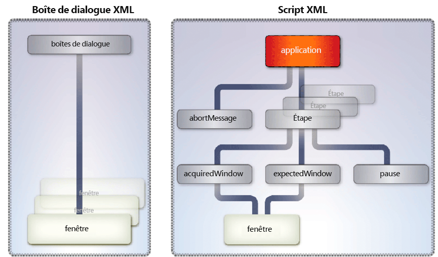

# Conversion entre les formats de fichier et le format PDF {#converting-between-file-formatsand-pdf}

**A propos du service Generate PDF**

Le service Generate PDF peut convertir de nombreux formats de fichier natifs en PDF. Il convertit également des fichiers PDF en d’autres formats et optimise la taille des documents PDF.

Le service Generate PDF utilise des applications natives pour convertir les formats de fichiers suivants en PDF. Sauf précision contraire, seules les versions allemande, anglaise, française et japonaise de ces applications sont prises en charge. *Windows* indique uniquement la prise en charge de Windows Server® 2003 et Windows Server 2008.

* Microsoft Office 2003 et 2007 pour convertir DOC, DOCX, RTF, TXT, XLS, XLSX, PPT, PPTX, VSD, MPP, MPPX, XPS et PUB (Windows uniquement)

>[!NOTE]
>
>Acrobat® 9.2 ou version ultérieure est nécessaire pour convertir le format Microsoft XPS au format PDF.

* Autodesk AutoCAD 2005, 2006, 2007, 2008 et 2009 pour convertir les fichiers DWF, DWG et DXW (en anglais uniquement)
* Corel WordPerfect 12 et X4 pour convertir WPD, QPW, SHW (en anglais uniquement)
* OpenOffice 2.0, 2.4, 3.0.1 et 3.1 pour convertir les formats ODT, ODS, ODP, ODG, ODF, SXW, SXI, SXC, SXD, DOC, DOCX, RTF, TXT, XLS, XLSX, PPT, PPTX, VSD, MPP, MPPX et PUB

>[!NOTE]
>
>le service Generate PDF ne prend pas en charge les versions 64 bits d’OpenOffice.

* Adobe Photoshop® CS2 pour convertir un fichier PSD (Windows uniquement)

>[!NOTE]
>
>Photoshop CS3 et CS4 ne sont pas pris en charge car ils ne prennent pas en charge Windows Server 2003 ou Windows Server 2008.

* Adobe FrameMaker® 7.2 et 8 pour convertir des fichiers FM (Windows uniquement)
* Adobe PageMaker® 7.0 pour convertir les formats PMD, PM6, P65 et PM (Windows uniquement)
* Formats natifs pris en charge par les applications tierces (requiert le développement de fichiers d’installation spécifiques à l’application) (Windows uniquement)

Le service Generate PDF peut convertir les formats standards suivants en PDF.

* Formats vidéo : SWF, FLV (Windows uniquement)
* Formats image : JPEG, JPG, JP2, J2Kí, JPC, J2C, GIF, BMP, TIFF, TIF, PNG, JPF
* HTML (Windows, Sun™ Solaris™ et Linux®)

Le service Generate PDF peut convertir des PDF aux formats de fichiers suivants (Windows uniquement) :

* Encapsulated Postscript (EPS)
* HTML3.2
* HTML 4.01 avec CSS 1.0
* DOC (format Microsoft Word)
* RTF
* Texte (à la fois accessible et brut)
* XML
* PDF/A-1a utilisant uniquement l’espace colorimétrique DeviceRGB
* PDF/A-1b utilisant uniquement l’espace colorimétrique DeviceRGB

Le service Generate PDF requiert que vous réalisiez ces tâches administratives :

* Installez les applications natives requises sur l’ordinateur hébergeant AEM Forms
* Installez Adobe Acrobat Professional ou Acrobat Pro Extended 9.2 sur l’ordinateur hébergeant AEM Forms.
* Réalisez les tâches consécutives à l’installation.

Ces tâches sont décrites dans la section Installation et déploiement d’AEM formulaires à l’aide de JBoss clé en main.

Vous pouvez exécuter ces tâches à l’aide du service Generate PDF :

* Convertir des formats de fichier natifs en PDF.
* Convertir des documents HTML en documents PDF.
* Convertir des documents PDF en formats de fichier.

>[!NOTE]
>
>Pour plus d’informations sur le service Generate PDF, voir [Guide de référence des services pour AEM Forms](https://www.adobe.com/go/learn_aemforms_services_63).

## Conversion de Documents Word en Documents PDF {#converting-word-documents-to-pdf-documents}

Cette section décrit comment utiliser l’API Generate PDF pour convertir par programmation un document Microsoft Word en document PDF.

>[!NOTE]
>
>Pour plus d’informations sur les formats de fichier supplémentaires, voir [Ajouter la prise en charge des formats de fichier natifs supplémentaires](converting-file-formats-pdf.md#adding-support-for-additional-native-file-formats).

>[!NOTE]
>
>Pour plus d’informations sur le service Generate PDF, voir [Guide de référence des services pour AEM Forms](https://www.adobe.com/go/learn_aemforms_services_63).

### Résumé des étapes {#summary-of-steps}

Pour convertir un document Microsoft Word en document PDF, effectuez les tâches suivantes :

1. Incluez des fichiers de projet.
1. Créez un client Generate PDF.
1. Récupérez le fichier à convertir en document PDF.
1. Convertissez le fichier en document PDF.
1. Récupérez les résultats.

**Inclure les fichiers de projet**

Incluez les fichiers nécessaires dans votre projet de développement. Si vous créez une application cliente à l’aide de Java, incluez les fichiers JAR nécessaires. Si vous utilisez des services Web, veillez à inclure les fichiers proxy.

**Création d’un client Generate PDF**

Avant de pouvoir exécuter par programmation une opération Generate PDF, créez un client de service Generate PDF. Si vous utilisez l’API Java, créez un objet `GeneratePdfServiceClient`. Si vous utilisez l’API du service Web, créez un objet `GeneratePDFServiceService`.

**Récupérer le fichier à convertir en document PDF**

Récupérez le document Microsoft Word à convertir en document PDF.

**Convertir le fichier en document PDF**

Après avoir créé le client de service Generate PDF, vous pouvez appeler la méthode `createPDF2`. Cette méthode nécessite des informations sur le document à convertir, y compris l&#39;extension de fichier.

**Récupérer les résultats**

Une fois le fichier converti en document PDF, vous pouvez récupérer les résultats. Par exemple, après avoir converti un fichier Word en document PDF, vous pouvez récupérer et enregistrer le document PDF.

**Voir également**

[Conversion de documents Word en documents PDF à l’aide de l’API Java](converting-file-formats-pdf.md#convert-word-documents-to-pdf-documents-using-the-java-api)

[Conversion de documents Word en documents PDF à l’aide de l’API du service Web](converting-file-formats-pdf.md#convert-word-documents-to-pdf-documents-using-the-web-service-api)

[Inclusion des fichiers de bibliothèque Java AEM Forms](/help/forms/developing/invoking-aem-forms-using-java.md#including-aem-forms-java-library-files)

[Réglage des propriétés de la connexion](/help/forms/developing/invoking-aem-forms-using-java.md#setting-connection-properties)

[Débuts rapides de l’API de service Generate PDF](/help/forms/developing/generate-pdf-service-java-api.md#generate-pdf-service-java-api-quick-start-soap)

### Conversion de documents Word en documents PDF à l’aide de l’API Java {#convert-word-documents-to-pdf-documents-using-the-java-api}

Conversion d’un document Microsoft Word en document PDF à l’aide de l’API Generate PDF (Java) :

1. Incluez des fichiers de projet.

   Incluez des fichiers JAR client, tels que adobe-generatepdf-client.jar, dans le chemin de classe de votre projet Java.

1. Créez un client Generate PDF.

   * Créez un objet `ServiceClientFactory` qui contient des propriétés de connexion.
   * Créez un objet `GeneratePdfServiceClient` en utilisant son constructeur et en transmettant l’objet `ServiceClientFactory`. 

1. Récupérez le fichier à convertir en document PDF.

   * Créez un objet `java.io.FileInputStream` qui représente le fichier Word à convertir en utilisant son constructeur. Transmettez une valeur de chaîne qui spécifie l’emplacement du fichier.
   * Créez un objet `com.adobe.idp.Document` en utilisant son constructeur et en transmettant l’objet `java.io.FileInputStream`. 

1. Convertissez le fichier en document PDF.

   Convertissez le fichier en document PDF en appelant la méthode `createPDF2` de l’objet `GeneratePdfServiceClient` et en transmettant les valeurs suivantes :

   * Objet `com.adobe.idp.Document` représentant le fichier à convertir.
   * Objet `java.lang.String` contenant l&#39;extension de fichier.
   * Objet `java.lang.String` contenant les paramètres de type de fichier à utiliser dans la conversion. Les paramètres de type de fichier fournissent des paramètres de conversion pour différents types de fichiers, tels que .doc ou .xls.
   * Objet `java.lang.String` contenant le nom des paramètres PDF à utiliser. Par exemple, vous pouvez spécifier `Standard`.
   * Objet `java.lang.String` contenant le nom des paramètres de sécurité à utiliser.
   * Objet `com.adobe.idp.Document` facultatif contenant les paramètres à appliquer lors de la génération du document PDF.
   * Objet `com.adobe.idp.Document` facultatif contenant des informations de métadonnées à appliquer au document PDF.

   La méthode `createPDF2` renvoie un objet `CreatePDFResult` contenant le nouveau document PDF et des informations de journal. Le fichier journal contient généralement des messages d’erreur ou d’avertissement générés par la demande de conversion.

1. Récupérez les résultats.

   Pour obtenir le document PDF, effectuez les opérations suivantes :

   * Appelez la méthode `CreatePDFResult` de l&#39;objet `getCreatedDocument`, qui renvoie un objet `com.adobe.idp.Document`.
   * Appelez la méthode `com.adobe.idp.Document` de l’objet `copyToFile` pour extraire le document PDF de l’objet créé à l’étape précédente.

   Si vous avez utilisé la méthode `createPDF2` pour obtenir le document de journal (non applicable aux conversions HTML), effectuez les actions suivantes :

   * Appelez la méthode `CreatePDFResult` de l’objet `getLogDocument`. Cette opération renvoie un objet `com.adobe.idp.Document`.
   * Appelez la méthode `com.adobe.idp.Document` de l&#39;objet `copyToFile` pour extraire le document de journal.


**Voir également**

[Résumé des étapes](converting-file-formats-pdf.md#summary-of-steps)

[Début rapide (mode SOAP) : Conversion d’un document Microsoft Word en document PDF à l’aide de l’API Java](/help/forms/developing/generate-pdf-service-java-api.md#quick-start-soap-mode-converting-a-microsoft-word-document-to-a-pdf-document-using-the-java-api)

[Inclusion des fichiers de bibliothèque Java AEM Forms](/help/forms/developing/invoking-aem-forms-using-java.md#including-aem-forms-java-library-files)

[Réglage des propriétés de la connexion](/help/forms/developing/invoking-aem-forms-using-java.md#setting-connection-properties)

### Conversion de documents Word en documents PDF à l’aide de l’API du service Web {#convert-word-documents-to-pdf-documents-using-the-web-service-api}

Conversion d’un document Microsoft Word en document PDF à l’aide de l’API Generate PDF (service Web) :

1. Incluez des fichiers de projet.

   Créez un projet Microsoft .NET qui utilise MTOM. Assurez-vous d’utiliser la définition WSDL suivante : `http://localhost:8080/soap/services/GeneratePDFService?WSDL&lc_version=9.0.1`.

   >[!NOTE]
   >
   >Remplacez `localhost` par l’adresse IP du serveur hébergeant AEM Forms.

1. Créez un client Generate PDF.

   * Créez un objet `GeneratePDFServiceClient` en utilisant son constructeur par défaut.
   * Créez un objet `GeneratePDFServiceClient.Endpoint.Address` en utilisant le constructeur `System.ServiceModel.EndpointAddress`. Transmettez une valeur de chaîne qui spécifie le WSDL au service AEM Forms (par exemple, `http://localhost:8080/soap/services/GeneratePDFService?blob=mtom`). Vous n&#39;avez pas besoin d&#39;utiliser l&#39;attribut `lc_version`. Spécifiez toutefois `?blob=mtom`.
   * Créez un objet `System.ServiceModel.BasicHttpBinding` en obtenant la valeur du champ `GeneratePDFServiceClient.Endpoint.Binding`. Convertissez la valeur de retour en `BasicHttpBinding`.
   * Définissez le champ `MessageEncoding` de l’objet `System.ServiceModel.BasicHttpBinding` sur `WSMessageEncoding.Mtom`. Cette valeur garantit l’utilisation de MTOM.
   * Activez l’authentification HTTP de base en exécutant les tâches suivantes :

      * Attribuez le nom d’utilisateur AEM forms au champ `GeneratePDFServiceClient.ClientCredentials.UserName.UserName`.
      * Attribuez la valeur de mot de passe correspondante au champ `GeneratePDFServiceClient.ClientCredentials.UserName.Password`.
      * Affectez la valeur constante `HttpClientCredentialType.Basic` au champ `BasicHttpBindingSecurity.Transport.ClientCredentialType`.
      * Affectez la valeur constante `BasicHttpSecurityMode.TransportCredentialOnly` au champ `BasicHttpBindingSecurity.Security.Mode`.

1. Récupérez le fichier à convertir en document PDF.

   * Créez un objet `BLOB` en utilisant son constructeur. L’objet `BLOB` permet de stocker le fichier à convertir en document PDF.
   * Créez un objet `System.IO.FileStream` en appelant son constructeur. Transmettez une valeur de chaîne qui représente l’emplacement du fichier à convertir et le mode d’ouverture du fichier.
   * Créez un tableau d’octets qui stocke le contenu de l’objet `System.IO.FileStream`. Vous pouvez déterminer la taille du tableau d’octets en obtenant la propriété `System.IO.FileStream` de l’objet `Length`.
   * Renseignez le tableau d’octets avec les données de flux en appelant la méthode `System.IO.FileStream` de l’objet `Read` et en transmettant le tableau d’octets, la position de départ et la longueur du flux à lire.
   * Renseignez l’objet `BLOB` en attribuant à sa propriété `MTOM` le contenu du tableau d’octets.

1. Convertissez le fichier en document PDF.

   Convertissez le fichier en document PDF en appelant la méthode `CreatePDF2` de l’objet `GeneratePDFServiceService` et en transmettant les valeurs suivantes :

   * Objet `BLOB` représentant le fichier à convertir.
   * Chaîne contenant l’extension de fichier.
   * Objet `java.lang.String` contenant les paramètres de type de fichier à utiliser dans la conversion. Les paramètres de type de fichier fournissent des paramètres de conversion pour différents types de fichiers, tels que .doc ou .xls.
   * Objet de chaîne contenant les paramètres PDF à utiliser. Vous pouvez spécifier `Standard`.
   * Objet de chaîne contenant les paramètres de sécurité à utiliser. Vous pouvez spécifier `No Security`.
   * Objet `BLOB` facultatif contenant les paramètres à appliquer lors de la génération du document PDF.
   * Objet `BLOB` facultatif contenant des informations de métadonnées à appliquer au document PDF.
   * Paramètre de sortie de type `BLOB` renseigné par la méthode `CreatePDF2`. La méthode `CreatePDF2` remplit cet objet avec le document converti. (Cette valeur de paramètre est requise uniquement pour l’appel de service Web).
   * Paramètre de sortie de type `BLOB` renseigné par la méthode `CreatePDF2`. La méthode `CreatePDF2` remplit cet objet avec le document de journal. (Cette valeur de paramètre est requise uniquement pour l’appel de service Web).

1. Récupérez les résultats.

   * Récupérez le document PDF converti en attribuant le champ `BLOB` de l’objet `MTOM` à un tableau d’octets. Le tableau d’octets représente le document PDF converti. Veillez à utiliser l&#39;objet `BLOB` utilisé comme paramètre de sortie pour la méthode `createPDF2`.
   * Créez un objet `System.IO.FileStream` en appelant son constructeur et en transmettant une valeur de chaîne qui représente l’emplacement du fichier du document PDF converti.
   * Créez un objet `System.IO.BinaryWriter` en appelant son constructeur et en transmettant l&#39;objet `System.IO.FileStream`.
   * Ecrivez le contenu du tableau d’octets dans un fichier PDF en appelant la méthode `System.IO.BinaryWriter` de l’objet `Write` et en transmettant le tableau d’octets.

**Voir également**

[Résumé des étapes](converting-file-formats-pdf.md#summary-of-steps)

[Appel de AEM Forms à l’aide de MTOM](/help/forms/developing/invoking-aem-forms-using-web.md#invoking-aem-forms-using-mtom)

[Appel de AEM Forms à l’aide de SwaRef](/help/forms/developing/invoking-aem-forms-using-web.md#invoking-aem-forms-using-swaref)

## Conversion de Documents HTML en Documents PDF {#converting-html-documents-to-pdf-documents}

Cette section décrit comment utiliser l’API Generate PDF pour convertir par programmation des documents HTML en documents PDF.

>[!NOTE]
>
>Pour plus d’informations sur le service Generate PDF, voir [Guide de référence des services pour AEM Forms](https://www.adobe.com/go/learn_aemforms_services_63).

### Résumé des étapes {#summary_of_steps-1}

Pour convertir un document HTML en document PDF, effectuez les tâches suivantes :

1. Incluez des fichiers de projet.
1. Créez un client Generate PDF.
1. Récupérez le contenu HTML à convertir en document PDF.
1. Convertissez le contenu HTML en document PDF.
1. Récupérez les résultats.

**Inclure les fichiers de projet**

Incluez les fichiers nécessaires dans votre projet de développement. Si vous créez une application cliente à l’aide de Java, incluez les fichiers JAR nécessaires. Si vous utilisez des services Web, veillez à inclure les fichiers proxy.

**Création d’un client Generate PDF**

Avant de pouvoir exécuter par programmation une opération Generate PDF, vous devez créer un client de service Generate PDF. Si vous utilisez l’API Java, créez un objet `GeneratePdfServiceClient`. Si vous utilisez l’API du service Web, créez un `GeneratePDFServiceService`.

**Récupérer le contenu HTML à convertir en document PDF**

Référencez le contenu HTML à convertir en document PDF. Vous pouvez référencer du contenu HTML tel qu’un fichier HTML ou du contenu HTML accessible à l’aide d’une URL.

**Conversion du contenu HTML en document PDF**

Après avoir créé le client de service, vous pouvez appeler l’opération de création de PDF appropriée. Cette opération nécessite des informations sur le document à convertir, y compris le chemin d&#39;accès au document de cible.

**Récupérer les résultats**

Une fois le contenu HTML converti en document PDF, vous pouvez récupérer les résultats et enregistrer le document PDF.

**Voir également**

[Conversion de contenu HTML en document PDF à l’aide de l’API Java](converting-file-formats-pdf.md#convert-html-content-to-a-pdf-document-using-the-java-api)

[Conversion de contenu HTML en document PDF à l’aide de l’API du service Web](converting-file-formats-pdf.md#convert-html-content-to-a-pdf-document-using-the-web-service-api)

[Inclusion des fichiers de bibliothèque Java AEM Forms](/help/forms/developing/invoking-aem-forms-using-java.md#including-aem-forms-java-library-files)

[Réglage des propriétés de la connexion](/help/forms/developing/invoking-aem-forms-using-java.md#setting-connection-properties)

[Débuts rapides de l’API de service Generate PDF](/help/forms/developing/generate-pdf-service-java-api.md#generate-pdf-service-java-api-quick-start-soap)

### Convertir le contenu HTML en document PDF à l’aide de l’API Java {#convert-html-content-to-a-pdf-document-using-the-java-api}

Conversion d’un document HTML en document PDF à l’aide de l’API Generate PDF (Java) :

1. Incluez des fichiers de projet.

   Incluez des fichiers JAR client, tels que adobe-generatepdf-client.jar, dans le chemin de classe de votre projet Java.

1. Créez un client Generate PDF.

   Créez un objet `GeneratePdfServiceClient` en utilisant son constructeur et en transmettant un objet `ServiceClientFactory` contenant des propriétés de connexion.

1. Récupérez le contenu HTML à convertir en document PDF.

   Récupérez du contenu HTML en créant une variable de chaîne et en affectant une URL pointant vers du contenu HTML.

1. Convertissez le contenu HTML en document PDF.

   Appelez la méthode `htmlToPDF2` de l’objet `GeneratePdfServiceClient` et transmettez les valeurs suivantes :

   * Objet `java.lang.String` contenant l’URL du fichier HTML à convertir.
   * Objet `java.lang.String` contenant les paramètres de type de fichier à utiliser dans la conversion. Les paramètres de type de fichier peuvent inclure des niveaux d&#39;indexation.
   * Objet `java.lang.String` contenant le nom des paramètres de sécurité à utiliser.
   * Objet `com.adobe.idp.Document` facultatif contenant les paramètres à appliquer lors de la génération du document PDF. Si ces informations ne sont pas fournies, les paramètres sont automatiquement sélectionnés en fonction des trois paramètres précédents.
   * Objet `com.adobe.idp.Document` facultatif contenant des informations de métadonnées à appliquer au document PDF.

1. Récupérez les résultats.

   La méthode `htmlToPDF2` renvoie un objet `HtmlToPdfResult` contenant le nouveau document PDF généré. Pour obtenir le document PDF nouvellement créé, effectuez les opérations suivantes :

   * Appelez la méthode `HtmlToPdfResult` de l’objet `getCreatedDocument`. Cette opération renvoie un objet `com.adobe.idp.Document`.
   * Appelez la méthode `com.adobe.idp.Document` de l’objet `copyToFile` pour extraire le document PDF de l’objet créé à l’étape précédente.

**Voir également**

[Conversion de Documents HTML en Documents PDF](converting-file-formats-pdf.md#converting-html-documents-to-pdf-documents)

[Début rapide (mode SOAP) : Conversion de contenu HTML en document PDF à l’aide de l’API Java](/help/forms/developing/generate-pdf-service-java-api.md#quick-start-soap-mode-converting-html-content-to-a-pdf-document-using-the-java-api)

[Début rapide (mode SOAP) : Conversion de contenu HTML en document PDF à l’aide de l’API Java](/help/forms/developing/generate-pdf-service-java-api.md#quick-start-soap-mode-converting-html-content-to-a-pdf-document-using-the-java-api)

[Inclusion des fichiers de bibliothèque Java AEM Forms](/help/forms/developing/invoking-aem-forms-using-java.md#including-aem-forms-java-library-files)

[Réglage des propriétés de la connexion](/help/forms/developing/invoking-aem-forms-using-java.md#setting-connection-properties)

### Conversion de contenu HTML en document PDF à l’aide de l’API de service Web {#convert-html-content-to-a-pdf-document-using-the-web-service-api}

Conversion de contenu HTML en document PDF à l’aide de l’API Generate PDF (service Web) :

1. Incluez des fichiers de projet.

   Créez un projet Microsoft .NET qui utilise MTOM. Assurez-vous d’utiliser la définition WSDL suivante : `http://localhost:8080/soap/services/GeneratePDFService?WSDL&lc_version=9.0.1`.

   >[!NOTE]
   >
   >Remplacez `localhost` par l’adresse IP du serveur hébergeant AEM Forms.

1. Créez un client Generate PDF.

   * Créez un objet `GeneratePDFServiceClient` en utilisant son constructeur par défaut.
   * Créez un objet `GeneratePDFServiceClient.Endpoint.Address` en utilisant le constructeur `System.ServiceModel.EndpointAddress`. Transmettez une valeur de chaîne qui spécifie le WSDL au service AEM Forms (par exemple, `http://localhost:8080/soap/services/GeneratePDFService?blob=mtom`). Vous n&#39;avez pas besoin d&#39;utiliser l&#39;attribut `lc_version`. Spécifiez toutefois `?blob=mtom`.
   * Créez un objet `System.ServiceModel.BasicHttpBinding` en obtenant la valeur du champ `GeneratePDFServiceClient.Endpoint.Binding`. Convertissez la valeur de retour en `BasicHttpBinding`.
   * Définissez le champ `MessageEncoding` de l’objet `System.ServiceModel.BasicHttpBinding` sur `WSMessageEncoding.Mtom`. Cette valeur garantit l’utilisation de MTOM.
   * Activez l’authentification HTTP de base en exécutant les tâches suivantes :

      * Attribuez le nom d’utilisateur AEM forms au champ `GeneratePDFServiceClient.ClientCredentials.UserName.UserName`.
      * Attribuez la valeur de mot de passe correspondante au champ `GeneratePDFServiceClient.ClientCredentials.UserName.Password`.
      * Affectez la valeur constante `HttpClientCredentialType.Basic` au champ `BasicHttpBindingSecurity.Transport.ClientCredentialType`.
      * Affectez la valeur constante `BasicHttpSecurityMode.TransportCredentialOnly` au champ `BasicHttpBindingSecurity.Security.Mode`.

1. Récupérez le contenu HTML à convertir en document PDF.

   Récupérez du contenu HTML en créant une variable de chaîne et en affectant une URL pointant vers du contenu HTML.

1. Convertissez le contenu HTML en document PDF.

   Convertissez le contenu HTML en document PDF en appelant la méthode `HtmlToPDF2` de l’objet `GeneratePDFServiceService` et en transmettant les valeurs suivantes :

   * Chaîne contenant le contenu HTML à convertir.
   * Objet `java.lang.String` contenant les paramètres de type de fichier à utiliser dans la conversion.
   * Objet de chaîne contenant les paramètres de sécurité à utiliser.
   * Objet `BLOB` facultatif contenant les paramètres à appliquer lors de la génération du document PDF.
   * Objet `BLOB` facultatif contenant des informations de métadonnées à appliquer au document PDF.
   * Paramètre de sortie de type `BLOB` renseigné par la méthode `CreatePDF2`. La méthode `CreatePDF2` remplit cet objet avec le document converti. (Cette valeur de paramètre n’est requise que pour l’appel de service Web).

1. Récupérez les résultats.

   * Récupérez le document PDF converti en attribuant le champ `BLOB` de l’objet `MTOM` à un tableau d’octets. Le tableau d’octets représente le document PDF converti. Veillez à utiliser l&#39;objet `BLOB` utilisé comme paramètre de sortie pour la méthode `HtmlToPDF2`.
   * Créez un objet `System.IO.FileStream` en appelant son constructeur et en transmettant une valeur de chaîne qui représente l’emplacement du fichier du document PDF converti.
   * Créez un objet `System.IO.BinaryWriter` en appelant son constructeur et en transmettant l&#39;objet `System.IO.FileStream`.
   * Ecrivez le contenu du tableau d’octets dans un fichier PDF en appelant la méthode `System.IO.BinaryWriter` de l’objet `Write` et en transmettant le tableau d’octets.

**Voir également**

[Conversion de Documents HTML en Documents PDF](converting-file-formats-pdf.md#converting-html-documents-to-pdf-documents)

[Appel de AEM Forms à l’aide de MTOM](/help/forms/developing/invoking-aem-forms-using-web.md#invoking-aem-forms-using-mtom)

[Appel de AEM Forms à l’aide de SwaRef](/help/forms/developing/invoking-aem-forms-using-web.md#invoking-aem-forms-using-swaref)

## Conversion de Documents PDF en formats sans image {#converting-pdf-documents-to-non-image-formats}

Cette section décrit comment utiliser l’API Java Generate PDF et l’API de service Web pour convertir par programmation un document PDF en fichier RTF, qui est un exemple de format autre qu’une image. Les autres formats autres que les images sont HTML, text, DOC et EPS. Lors de la conversion d’un document PDF au format RTF, assurez-vous que le document PDF ne contient pas d’éléments de formulaire, tels qu’un bouton d’envoi. Les éléments de formulaire ne sont pas convertis.

>[!NOTE]
>
>Pour plus d’informations sur le service Generate PDF, voir [Guide de référence des services pour AEM Forms](https://www.adobe.com/go/learn_aemforms_services_63).

### Résumé des étapes {#summary_of_steps-2}

Pour convertir un document PDF en l’un des types pris en charge, procédez comme suit :

1. Incluez des fichiers de projet.
1. Créez un client Generate PDF.
1. Récupérez le document PDF à convertir.
1. Convertir le document PDF.
1. Enregistrez le fichier converti.

**Inclure les fichiers de projet**

Incluez les fichiers nécessaires dans votre projet de développement. Si vous créez une application cliente à l’aide de Java, incluez les fichiers JAR nécessaires. Si vous utilisez des services Web, veillez à inclure les fichiers proxy.

**Création d’un client Generate PDF**

Avant de pouvoir exécuter par programmation une opération Generate PDF, vous devez créer un client de service Generate PDF. Si vous utilisez l’API Java, créez un objet `GeneratePdfServiceClient`. Si vous utilisez l’API du service Web, créez un objet `GeneratePDFServiceService`.

**Récupération du document PDF à convertir**

Récupérez le document PDF à convertir dans un format autre qu’une image.

**Conversion du document PDF**

Après avoir créé le client de service, vous pouvez appeler l’opération d’exportation PDF. Cette opération nécessite des informations sur le document à convertir, y compris le chemin d&#39;accès au document de cible.

**Enregistrer le fichier converti**

Enregistrez le fichier converti. Par exemple, si vous convertissez un document PDF en fichier RTF, enregistrez le document converti en fichier RTF.

**Voir également**

[Conversion d’un document PDF en fichier RTF à l’aide de l’API Java](converting-file-formats-pdf.md#convert-a-pdf-document-to-a-rtf-file-using-the-java-api)

[Conversion d’un document PDF en fichier RTF à l’aide de l’API du service Web](converting-file-formats-pdf.md#convert-a-pdf-document-to-a-rtf-file-using-the-web-service-api)

[Inclusion des fichiers de bibliothèque Java AEM Forms](/help/forms/developing/invoking-aem-forms-using-java.md#including-aem-forms-java-library-files)

[Réglage des propriétés de la connexion](/help/forms/developing/invoking-aem-forms-using-java.md#setting-connection-properties)

[Débuts rapides de l’API de service Generate PDF](/help/forms/developing/generate-pdf-service-java-api.md#generate-pdf-service-java-api-quick-start-soap)

### Conversion d’un document PDF en fichier RTF à l’aide de l’API Java {#convert-a-pdf-document-to-a-rtf-file-using-the-java-api}

Conversion d’un document PDF en fichier RTF à l’aide de l’API Generate PDF (Java) :

1. Incluez des fichiers de projet.

   Incluez des fichiers JAR client, tels que adobe-generatepdf-client.jar, dans le chemin de classe de votre projet Java.

1. Créez un client Generate PDF.

   Créez un objet `GeneratePdfServiceClient` en utilisant son constructeur et en transmettant un objet `ServiceClientFactory` contenant des propriétés de connexion.

1. Récupérez le document PDF à convertir.

   * Créez un objet `java.io.FileInputStream` qui représente le document PDF à convertir à l’aide de son constructeur. Transmettez une valeur de chaîne qui spécifie l’emplacement du document PDF.
   * Créez un objet `com.adobe.idp.Document` en utilisant son constructeur et en transmettant l’objet `java.io.FileInputStream`. 

1. Convertir le document PDF.

   Appelez la méthode `exportPDF2` de l’objet `GeneratePdfServiceClient` et transmettez les valeurs suivantes :

   * Objet `com.adobe.idp.Document` représentant le fichier PDF à convertir.
   * Objet `java.lang.String` contenant le nom du fichier à convertir.
   * Objet `java.lang.String` contenant le nom des paramètres Adobe PDF.
   * Objet `ConvertPDFFormatType` qui spécifie le type de fichier de cible pour la conversion.
   * Objet `com.adobe.idp.Document` facultatif contenant les paramètres à appliquer lors de la génération du document PDF.

   La méthode `exportPDF2` renvoie un objet `ExportPDFResult` contenant le fichier converti.

1. Convertir le document PDF.

   Pour obtenir le fichier nouvellement créé, effectuez les opérations suivantes :

   * Appelez la méthode `ExportPDFResult` de l’objet `getConvertedDocument`. Cette opération renvoie un objet `com.adobe.idp.Document`.
   * Appelez la méthode `com.adobe.idp.Document` de l’objet `copyToFile` pour extraire le nouveau document.

**Voir également**

[Résumé des étapes](converting-file-formats-pdf.md#summary-of-steps)

[Début rapide (mode SOAP) : Conversion de contenu HTML en document PDF à l’aide de l’API Java](/help/forms/developing/generate-pdf-service-java-api.md#quick-start-soap-mode-converting-html-content-to-a-pdf-document-using-the-java-api)

[Inclusion des fichiers de bibliothèque Java AEM Forms](/help/forms/developing/invoking-aem-forms-using-java.md#including-aem-forms-java-library-files)

[Réglage des propriétés de la connexion](/help/forms/developing/invoking-aem-forms-using-java.md#setting-connection-properties)

### Conversion d’un document PDF en fichier RTF à l’aide de l’API de service Web {#convert-a-pdf-document-to-a-rtf-file-using-the-web-service-api}

Conversion d’un document PDF en fichier RTF à l’aide de l’API Generate PDF (service Web) :

1. Incluez des fichiers de projet.

   Créez un projet Microsoft .NET qui utilise MTOM. Assurez-vous d’utiliser la définition WSDL suivante : `http://localhost:8080/soap/services/GeneratePDFService?WSDL&lc_version=9.0.1`.

   >[!NOTE]
   >
   >Remplacez `localhost` par l’adresse IP du serveur hébergeant AEM Forms.

1. Créez un client Generate PDf.

   * Créez un objet `GeneratePDFServiceClient` en utilisant son constructeur par défaut.
   * Créez un objet `GeneratePDFServiceClient.Endpoint.Address` en utilisant le constructeur `System.ServiceModel.EndpointAddress`. Transmettez une valeur de chaîne qui spécifie le WSDL au service AEM Forms (par exemple, `http://localhost:8080/soap/services/GeneratePDFService?blob=mtom`). Vous n&#39;avez pas besoin d&#39;utiliser l&#39;attribut `lc_version`. Spécifiez toutefois `?blob=mtom`.
   * Créez un objet `System.ServiceModel.BasicHttpBinding` en obtenant la valeur du champ `GeneratePDFServiceClient.Endpoint.Binding`. Convertissez la valeur de retour en `BasicHttpBinding`.
   * Définissez le champ `MessageEncoding` de l’objet `System.ServiceModel.BasicHttpBinding` sur `WSMessageEncoding.Mtom`. Cette valeur garantit l’utilisation de MTOM.
   * Activez l’authentification HTTP de base en exécutant les tâches suivantes :

      * Attribuez le nom d’utilisateur AEM forms au champ `GeneratePDFServiceClient.ClientCredentials.UserName.UserName`.
      * Attribuez la valeur de mot de passe correspondante au champ `GeneratePDFServiceClient.ClientCredentials.UserName.Password`.
      * Affectez la valeur constante `HttpClientCredentialType.Basic` au champ `BasicHttpBindingSecurity.Transport.ClientCredentialType`.
      * Affectez la valeur constante `BasicHttpSecurityMode.TransportCredentialOnly` au champ `BasicHttpBindingSecurity.Security.Mode`.

1. Récupérez le document PDF à convertir.

   * Créez un objet `BLOB` en utilisant son constructeur. L’objet `BLOB` est utilisé pour stocker un document PDF converti.
   * Créez un objet `System.IO.FileStream` en appelant son constructeur et en transmettant une valeur de chaîne qui représente l’emplacement du fichier du document PDF et le mode d’ouverture du fichier.
   * Créez un tableau d’octets qui stocke le contenu de l’objet `System.IO.FileStream`. Vous pouvez déterminer la taille du tableau d’octets en obtenant la propriété `System.IO.FileStream` de l’objet `Length`.
   * Renseignez le tableau d’octets avec les données de flux en appelant la méthode `System.IO.FileStream` de l’objet `Read` et en transmettant le tableau d’octets, la position de départ et la longueur du flux à lire.
   * Renseignez l’objet `BLOB` en attribuant à sa propriété `MTOM` le contenu du tableau d’octets.

1. Convertir le document PDF.

   Appelez la méthode `ExportPDF2` de l’objet `GeneratePDFServiceServiceWse` et transmettez les valeurs suivantes :

   * Objet `BLOB` représentant le fichier PDF à convertir.
   * Chaîne contenant le nom du chemin d’accès du fichier à convertir.
   * Objet `java.lang.String` qui spécifie l&#39;emplacement du fichier.
   * Objet de chaîne qui spécifie le type de fichier de cible pour la conversion. Spécifiez `RTF`.
   * Objet `BLOB` facultatif contenant les paramètres à appliquer lors de la génération du document PDF.
   * Paramètre de sortie de type `BLOB` renseigné par la méthode `ExportPDF2`. La méthode `ExportPDF2` remplit cet objet avec le document converti. (Cette valeur de paramètre n’est requise que pour l’appel de service Web).

1. Enregistrez le fichier converti.

   * Récupérez le document RTF converti en attribuant le champ `BLOB` de l&#39;objet `MTOM` à un tableau d&#39;octets. Le tableau d’octets représente le document RTF converti. Veillez à utiliser l&#39;objet `BLOB` utilisé comme paramètre de sortie pour la méthode `ExportPDF2`.
   * Créez un objet `System.IO.FileStream` en appelant son constructeur. Transmettez une valeur de chaîne qui représente l’emplacement du fichier RTF.
   * Créez un objet `System.IO.BinaryWriter` en appelant son constructeur et en transmettant l&#39;objet `System.IO.FileStream`.
   * Ecrivez le contenu du tableau d’octets dans un fichier RTF en appelant la méthode `System.IO.BinaryWriter` de l’objet `Write` et en transmettant le tableau d’octets.

**Voir également**

[Résumé des étapes](converting-file-formats-pdf.md#summary-of-steps)

[Appel de AEM Forms à l’aide de MTOM](/help/forms/developing/invoking-aem-forms-using-web.md#invoking-aem-forms-using-mtom)

[Appel de AEM Forms à l’aide de SwaRef](/help/forms/developing/invoking-aem-forms-using-web.md#invoking-aem-forms-using-swaref)

## Ajouter la prise en charge des formats de fichier natifs {#adding-support-for-additional-native-file-formats}

Cette section explique comment ajouter la prise en charge de formats de fichier natifs supplémentaires. Il fournit un aperçu des interactions entre le service Generate PDF et les applications natives utilisées par ce service pour convertir des formats de fichier natifs en PDF.

Cette section explique également ce qui suit :

* Comment modifier la réponse fournie par le service Generate PDF aux applications natives que ce produit utilise déjà pour convertir des formats de fichier natifs en PDF
* Les interactions entre le service Generate PDF, le composant AppMon (Application Monitor) du service Generate PDF et les applications natives, telles que Microsoft Word
* Les rôles que les grammaires XML jouent dans ces interactions

### Interactions de composant {#component-interactions}

Le service Generate PDF convertit les formats de fichier natifs en appelant l’application associée au format de fichier, puis en interagissant avec l’application pour imprimer le document à l’aide de l’imprimante par défaut. L’imprimante par défaut doit être configurée en tant qu’imprimante Adobe PDF.

Cette illustration présente les composants et pilotes impliqués dans la prise en charge des applications natives. Il mentionne également les grammaires XML qui influencent les interactions.

Interactions de composants pour la conversion de fichiers natifs

Ce document utilise le terme *application native* pour indiquer l&#39;application utilisée pour produire un format de fichier natif, tel que Microsoft Word.

** AppMonis est un composant d’entreprise qui interagit avec une application native de la même manière qu’un utilisateur navigue dans les boîtes de dialogue présentées par cette application. Les grammaires XML utilisées par AppMon pour indiquer à une application, telle que Microsoft Word, d&#39;ouvrir et d&#39;imprimer un fichier impliquent les tâches suivantes :

1. Ouverture du fichier en sélectionnant Fichier > Ouvrir
1. Veiller à ce que la boîte de dialogue Ouvrir s’affiche ; dans le cas contraire, gestion de l’erreur
1. Affichage du nom de fichier dans le champ Nom de fichier, puis clic sur le bouton Ouvrir
1. Vérification de l’ouverture effective du fichier
1. Ouverture de la boîte de dialogue Imprimer en sélectionnant Fichier > Imprimer
1. Vérification de l’affichage de la boîte de dialogue Imprimer

AppMon utilise des API Win32 standard pour interagir avec des applications tierces afin de transférer des événements d&#39;interface utilisateur tels que des touches et des clics de souris, ce qui est utile pour contrôler ces applications et produire des fichiers PDF à partir de ces dernières.

En raison d&#39;une limitation de ces API Win32, AppMon ne peut pas distribuer ces événements d&#39;interface utilisateur à certains types spécifiques de fenêtres, tels que les barres de menus flottantes (présentes dans certaines applications telles que TextPad), et certains types de boîtes de dialogue dont le contenu ne peut pas être récupéré à l&#39;aide des API Win32.

Il est facile d&#39;identifier visuellement une barre de menus flottante ; cependant, il pourrait ne pas être possible d&#39;identifier les types spéciaux de boîtes de dialogue simplement par inspection visuelle. Vous aurez besoin d&#39;une application tierce, telle que Microsoft Spy++ (qui fait partie de l&#39;environnement de développement Microsoft Visual C++) ou de son WinID équivalent (qui peut être téléchargé gratuitement à partir de [https://www.dennisbabkin.com/php/download.php?what=WinID](https://www.dennisbabkin.com/php/download.php?what=WinID)) pour examiner une boîte de dialogue afin de déterminer si AppMon pourra interagir avec elle à l&#39;aide des API Win32 standard.

Si WinID est capable d&#39;extraire le contenu de la boîte de dialogue, tel que le texte, les sous-fenêtres, l&#39;identifiant de classe de fenêtre, etc., AppMon peut également faire de même.

Ce tableau liste le type d’informations utilisées pour imprimer des formats de fichier natifs.

<table>
 <thead>
  <tr>
   <th><p>Type d'information</p></th>
   <th><p>Description</p></th>
   <th><p>Modification/création d’entrées liées à des fichiers natifs </p></th>
  </tr>
 </thead>
 <tbody>
  <tr>
   <td><p>Paramètres administratifs </p></td>
   <td><p>Inclut des paramètres PDF, des paramètres de sécurité et des paramètres de type de fichier. </p><p>Les paramètres de type de fichier associent des extensions de nom de fichier aux applications natives correspondantes. Les paramètres de type de fichier spécifient également les paramètres d’application natifs utilisés pour imprimer les fichiers natifs. </p></td>
   <td><p>Pour modifier les paramètres d’une application native déjà prise en charge, l’administrateur système définit les paramètres de type de fichier dans Administration Console. </p><p>Pour ajouter la prise en charge d’un nouveau format de fichier natif, vous devez modifier manuellement le fichier. (Voir <a href="converting-file-formats-pdf.md#adding-or-modifying-support-for-a-native-file-format">Ajouter ou modifier la prise en charge d’un format de fichier natif</a>.) </p></td>
  </tr>
  <tr>
   <td><p>Script </p></td>
   <td><p>Indique les interactions entre le service Generate PDF et une application native. Ces interactions orientent généralement l’application à imprimer un fichier vers le pilote Adobe PDF. </p><p>Le script contient des instructions qui demandent à l’application native d’ouvrir des boîtes de dialogue spécifiques et qui fournissent des réponses spécifiques aux champs et aux boutons de ces boîtes de dialogue. </p></td>
   <td><p>Le service Generate PDF inclut des fichiers de script pour toutes les applications natives prises en charge. Vous pouvez modifier ces fichiers à l’aide d’une application de modification XML.</p><p>Pour ajouter la prise en charge d’une nouvelle application native, vous devez créer un fichier de script. (Voir <a href="converting-file-formats-pdf.md#creating-or-modifying-an-additional-dialog-xml-file-for-a-native-application">Création ou modification d’un fichier XML de boîte de dialogue supplémentaire pour une application native</a>.) </p></td>
  </tr>
  <tr>
   <td><p>Instructions de la boîte de dialogue Générique </p></td>
   <td><p>Indique comment répondre aux boîtes de dialogue communes à plusieurs applications. Ces boîtes de dialogue sont générées par les systèmes d’exploitation, les applications d’assistance (telles que PDFMaker) et les pilotes. </p><p>Le fichier contenant ces informations est appmon.global.en_US.xml.</p></td>
   <td><p>Ne modifiez pas ce fichier. </p></td>
  </tr>
  <tr>
   <td><p>Instructions de la boîte de dialogue spécifique à l’application</p></td>
   <td><p>Indique comment répondre aux boîtes de dialogue spécifiques à l’application. </p><p>Le fichier qui contient ces informations est commun.<i>`[nomappli]`</i>.dialog.<i>`[locale]`</i>.xml (par exemple, appmon.word.en_US.xml).</p></td>
   <td><p>Ne modifiez pas ce fichier. </p><p>Pour ajouter des instructions de boîte de dialogue pour une nouvelle application native, voir <a href="converting-file-formats-pdf.md#creating_or_modifying_an_additional_dialog_xml_file_for_a_native_application">Création ou modification d’un fichier XML de boîte de dialogue supplémentaire pour une application native</a>.</p></td>
  </tr>
  <tr>
   <td><p>Autres instructions de boîte de dialogue spécifiques à l’application </p></td>
   <td><p>Spécifie les remplacements et les ajouts aux instructions de boîte de dialogue propres à l'application. La section présente un exemple de ces renseignements. </p><p>Le fichier qui contient ces informations est commun.<i>`[nom d’application]`</i>.addition.<i>`[locale]`</i>.xml. Un exemple est appmon.addition.en_US.xml.</p></td>
   <td><p>Les fichiers de ce type peuvent être créés et modifiés à l’aide d’une application de modification XML. (Voir <a href="converting-file-formats-pdf.md#creating-or-modifying-an-additional-dialog-xml-file-for-a-native-application">Création ou modification d’un fichier XML de boîte de dialogue supplémentaire pour une application native</a>.) </p><p><strong>Important</strong> : Vous devez créer des instructions de boîte de dialogue spécifiques à chaque application pour chaque application native que votre serveur prendra en charge. </p></td>
  </tr>
 </tbody>
</table>

### A propos du script et des fichiers XML de boîte de dialogue {#about-the-script-and-dialog-xml-files}

Les fichiers XML de script demandent au service Generate PDF de naviguer dans les boîtes de dialogue de l’application de la même manière qu’un utilisateur navigue dans les boîtes de dialogue de l’application. Les fichiers XML de script demandent également au service Generate PDF de répondre aux boîtes de dialogue en exécutant des actions telles que appuyer sur des boutons, sélectionner ou désélectionner des cases à cocher ou sélectionner des options de menu.

En revanche, les fichiers XML de boîte de dialogue répondent simplement aux boîtes de dialogue avec les mêmes types d’actions que ceux utilisés dans les fichiers XML de script.

#### Terminologie des éléments de boîte de dialogue et de fenêtre {#dialog-box-and-window-element-terminology}

Cette section et la section suivante utilisent une terminologie différente pour les boîtes de dialogue et les composants qu’elles contiennent, selon la perspective décrite. Les composants de la boîte de dialogue sont des éléments tels que des boutons, des champs et des zones de liste modifiable.

Lorsque cette section et la section suivante décrivent les boîtes de dialogue et leurs composants du point de vue d’un utilisateur, des termes tels que *boîte de dialogue*, *bouton*, *champ* et *zone de liste déroulante* sont utilisés.

Lorsque cette section et la section suivante décrivent les boîtes de dialogue et leurs composants du point de vue de leur représentation interne, le terme *élément de fenêtre* est utilisé. La représentation interne des éléments de fenêtre est une hiérarchie, où chaque instance d’élément de fenêtre est identifiée par des étiquettes. L’instance d’élément de fenêtre décrit également ses caractéristiques physiques et son comportement.

Du point de vue de l’utilisateur, les boîtes de dialogue et leurs composants présentent des comportements différents, où certains éléments de boîte de dialogue sont masqués jusqu’à ce qu’ils soient activés. Du point de vue de la représentation interne, il n&#39;existe aucun problème de comportement de ce genre. Par exemple, la représentation interne d&#39;une boîte de dialogue ressemble à celle des composants qu&#39;elle contient, à l&#39;exception des composants imbriqués dans la boîte de dialogue.

Cette section décrit les éléments XML qui fournissent des instructions à AppMon. Ces éléments portent des noms tels que l&#39;élément `dialog` et l&#39;élément `window`. Ce document utilise une police à espacement fixe pour distinguer les éléments XML. L’élément `dialog` identifie une boîte de dialogue qu’un fichier de script XML peut provoquer d’afficher, intentionnellement ou non. L’élément `window` identifie un élément de fenêtre (boîte de dialogue ou composants d’une boîte de dialogue).

#### Hiérarchie {#hierarchy}

Ce diagramme affiche la hiérarchie des scripts et des boîtes de dialogue XML. Un fichier XML de script est conforme au schéma script.xsd, qui inclut (au sens XML) le schéma window.xsd. De même, un fichier XML de boîte de dialogue est conforme au schéma dialogs.xsd, qui inclut également le schéma window.xsd.



Hiérarchie du script et du XML de la boîte de dialogue

#### Fichiers XML de script {#script-xml-files}

Un *fichier XML de script* spécifie une série d&#39;étapes qui orientent l&#39;application native vers certains éléments de fenêtre, puis fournissent des réponses à ces éléments. La plupart des réponses sont du texte ou des touches qui correspondent à l’entrée que l’utilisateur doit fournir à un champ, une zone de liste déroulante ou un bouton dans la boîte de dialogue correspondante.

Le service Generate PDF prend en charge les fichiers XML de script afin de diriger une application native vers l’impression d’un fichier natif. Cependant, les fichiers XML de script peuvent être utilisés pour accomplir toute tâche qu’un utilisateur peut effectuer lors de l’interaction avec les boîtes de dialogue de l’application native.

Les étapes d’un fichier XML de script sont exécutées dans l’ordre, sans possibilité d’embranchement. Le seul test conditionnel pris en charge est le délai d’expiration/de nouvelle tentative, qui entraîne l’arrêt d’un script si une étape ne se termine pas correctement dans un délai donné et après un nombre spécifique de Reprises.

Outre les étapes séquentielles, les instructions d’une étape sont également exécutées dans l’ordre. Vous devez vous assurer que les étapes et les instructions reflètent l’ordre dans lequel un utilisateur effectue les mêmes étapes.

Chaque étape d’un fichier XML de script identifie l’élément de fenêtre qui doit apparaître si les instructions de l’étape sont correctement exécutées. Si une boîte de dialogue inattendue s’affiche lors de l’exécution d’une étape de script, le service Generate PDF recherche les fichiers XML de la boîte de dialogue, comme décrit dans la section suivante.

#### Fichiers XML de boîte de dialogue {#dialog-xml-files}

L’exécution d’applications natives affiche différentes boîtes de dialogue qui s’affichent, que les applications natives soient en mode visible ou invisible. Les boîtes de dialogue peuvent être générées par le système d’exploitation ou par l’application elle-même. Lorsque les applications natives s’exécutent sous le contrôle du service Generate PDF, les boîtes de dialogue système et d’application native s’affichent dans une fenêtre invisible.

Un *fichier XML de boîte de dialogue* indique comment le service Generate PDF répond aux boîtes de dialogue du système ou de l’application native. Les fichiers de boîte de dialogue XML permettent au service Generate PDF de répondre aux boîtes de dialogue non sollicitées de manière à faciliter le processus de conversion.

Lorsque le système ou l’application native affiche une boîte de dialogue qui n’est pas gérée par le fichier XML de script en cours d’exécution, le service Generate PDF recherche les fichiers XML de la boîte de dialogue dans cet ordre, en s’arrêtant lorsqu’il trouve une correspondance :

* appmon.`[appname]`.additional.`[locale]`.xml
* appmon.`[appname]`.`[locale]`.xml (ne modifiez pas ce fichier.)
* appmon.global.`[locale]`.xml (ne modifiez pas ce fichier.)

Si le service Generate PDF trouve une correspondance pour la boîte de dialogue, il la ferme en lui envoyant le raccourci clavier ou toute autre action spécifiée pour la boîte de dialogue. Si les instructions de la boîte de dialogue indiquent un message d’abandon, le service Generate PDF interrompt la tâche en cours d’exécution et génère un message d’erreur. Un tel message d’abandon serait spécifié dans l’élément `abortMessage` de la grammaire XML du script.

Si le service Generate PDF rencontre une boîte de dialogue qui n’est décrite dans aucun des fichiers précédemment répertoriés, le service Generate PDF incorpore la légende de la boîte de dialogue dans l’entrée de fichier journal. La tâche en cours d&#39;exécution arrive à expiration. Vous pouvez ensuite utiliser les informations contenues dans le fichier journal pour composer de nouvelles instructions dans le fichier XML de boîte de dialogue supplémentaire pour l’application native.

### Ajouter ou modifier la prise en charge d’un format de fichier natif {#adding-or-modifying-support-for-a-native-file-format}

Cette section décrit les tâches que vous devez effectuer pour prendre en charge d’autres formats de fichier natifs ou pour modifier la prise en charge d’un format de fichier natif déjà pris en charge.

Avant de pouvoir ajouter ou modifier la prise en charge, vous devez exécuter les tâches suivantes.

#### Choix d&#39;un outil d&#39;identification des éléments de fenêtre {#choosing-a-tool-for-identifying-window-elements}

Les fichiers XML de boîte de dialogue et de script nécessitent que vous identifiiez l’élément de fenêtre (boîte de dialogue, champ ou autre composant de boîte de dialogue) auquel répond votre élément de boîte de dialogue ou de script. Par exemple, après qu’un script appelle un menu pour une application native, le script doit identifier l’élément de fenêtre de ce menu auquel des touches ou une action doivent être appliquées.

Vous pouvez facilement identifier une boîte de dialogue par la légende qu’elle affiche dans sa barre de titre. Cependant, vous devez utiliser un outil tel que Microsoft Spy++ pour identifier les éléments de fenêtre de niveau inférieur. Les éléments de la fenêtre de niveau inférieur peuvent être identifiés par divers attributs, qui ne sont pas évidents. De plus, chaque application native peut identifier son élément de fenêtre différemment. Par conséquent, il existe plusieurs façons d’identifier un élément de fenêtre. Voici l&#39;ordre suggéré pour la prise en compte de l&#39;identification des éléments de la fenêtre :

1. Légende elle-même si elle est unique
1. ID de contrôle, qui peut ou non être unique pour une boîte de dialogue donnée
1. Nom de classe, qui peut ou non être unique

N&#39;importe lequel ou une combinaison de ces trois attributs peut être utilisé pour identifier une fenêtre.

Si les attributs n’identifient pas de légende, vous pouvez à la place identifier un élément de fenêtre en utilisant son index par rapport à son parent. Un *index* spécifie la position de l&#39;élément de fenêtre par rapport à ses éléments de fenêtre frères. Souvent, les index sont le seul moyen d&#39;identifier les zones de liste modifiable.

Tenez compte de ces questions :

* Microsoft Spy++ affiche les légendes à l’aide d’une esperluette (&amp;) afin d’identifier la clé chaude de la légende. Par exemple, Spy++ affiche la légende d’une boîte de dialogue d’impression sous la forme `Pri&nt`, ce qui indique que la touche d’accès rapide est *n*. Les titres des légendes dans les fichiers XML de script et de boîte de dialogue doivent omettre les esperluettes.
* Certaines légendes comprennent des sauts de ligne. le service Generate PDF ne peut pas identifier les sauts de ligne. Si une légende comprend un saut de ligne, incluez-en suffisamment pour la différencier des autres options de menu, puis utilisez des expressions régulières pour la partie omise. Un exemple est ( `^Long caption title$`). (Voir [Utilisation d’expressions régulières dans les attributs de légende](converting-file-formats-pdf.md#using-regular-expressions-in-caption-attributes).)
* Utilisez des entités de caractères (également appelées séquences d’échappement) pour les caractères XML réservés. Par exemple, utilisez `&` pour les esperluettes, `<` et `>` pour les symboles inférieur et supérieur à, `&apos;` pour les apostrophes et `&quot;` pour les guillemets.

Si vous prévoyez de travailler sur des fichiers de boîte de dialogue ou de script XML, vous devez installer l&#39;application Microsoft Spy++.

#### Décompresser les fichiers de boîte de dialogue et de script {#unpackaging-the-dialog-and-script-files}

Les fichiers de boîte de dialogue et de script résident dans le fichier appmondata.jar. Avant de pouvoir modifier l’un de ces fichiers ou ajouter de nouveaux fichiers de script ou de boîte de dialogue, vous devez décompresser ce fichier JAR. Supposons, par exemple, que vous souhaitiez ajouter la prise en charge de l’application EditPlus. Vous créez deux fichiers XML, nommés appmon.editplus.script.en_US.xml et appmon.editplus.script.addition.en_US.xml. Ces scripts XML doivent être ajoutés au fichier adobe-appmondata.jar à deux emplacements, comme indiqué ci-dessous :

* adobe-livecycle-native-jboss-x86_win32.ear > adobe-Native2PDFSvc.war\WEB-INF\lib > adobe-native.jar > Native2PDFSvc-native.jar\bin > adobe-appmondata.jar\com\adobe\appmon. Le fichier adobe-livecycle-native-jboss-x86_win32.ear se trouve dans le dossier d’exportation sous `[AEM forms install directory]\configurationManager`. (si AEM Forms est déployé sur un autre serveur d’applications J2EE, remplacez le fichier adobe-livecycle-native-jboss-x86_win32.ear par le fichier EAR correspondant à votre serveur d’applications J2EE.)
* adobe-generatepdf-dsc.jar > adobe-appmondata.jar\com\adobe\appmon (le fichier adobe-appmondata.jar se trouve dans le fichier adobe-generatepdf-dsc.jar). Le fichier adobe-generatepdf-dsc.jar se trouve dans le dossier `[AEM forms install directory]\deploy`.

Après avoir ajouté ces fichiers XML au fichier adobe-appmondata.jar, vous devez redéployer le composant GeneratePDF. Pour ajouter des fichiers XML de boîte de dialogue et de script au fichier adobe-appmondata.jar, effectuez les tâches suivantes :

1. A l’aide d’un outil tel que WinZip ou WinRAR, ouvrez le fichier adobe-livecycle-native-jboss-x86_win32.earfile > adobe-Native2PDFSvc.war\WEB-INF\lib > adobe-native.jar > Native2PDFSvc-native.jar\bin > fichier adobe-appmondata.jar.
1. Ajoutez les fichiers XML de boîte de dialogue et de script dans le fichier appmondata.jar ou modifiez les fichiers XML existants dans ce fichier. (Voir [Création ou modification d’un fichier XML de script pour une application native](converting-file-formats-pdf.md#creating-or-modifying-a-script-xml-file-for-a-native-application)et [Création ou modification d’un fichier XML de boîte de dialogue supplémentaire pour une application native](converting-file-formats-pdf.md#creating-or-modifying-an-additional-dialog-xml-file-for-a-native-application).)
1. A l’aide d’un outil tel que WinZip ou WinRAR, ouvrez adobe-generatepdf-dsc.jar > adobe-appmondata.jar.
1. Ajoutez les fichiers XML de boîte de dialogue et de script dans le fichier appmondata.jar ou modifiez les fichiers XML existants dans ce fichier. (Voir [Création ou modification d’un fichier XML de script pour une application native](converting-file-formats-pdf.md#creating-or-modifying-a-script-xml-file-for-a-native-application)et [Création ou modification d’un fichier XML de boîte de dialogue supplémentaire pour une application native](converting-file-formats-pdf.md#creating-or-modifying-an-additional-dialog-xml-file-for-a-native-application).) Après avoir ajouté les fichiers XML au fichier adobe-appmondata.jar, importez le nouveau fichier adobe-appmondata.jar dans le fichier adobe-generatepdf-dsc.jar.
1. Si vous avez ajouté la prise en charge d’un format de fichier natif supplémentaire, créez une variable d’environnement système qui fournit le chemin d’accès de l’application (voir [Création d’une variable d’environnement pour localiser l’application native](converting-file-formats-pdf.md#creating-an-environment-variable-to-locate-the-native-application)).

**Pour redéployer le composant GeneratePDF**

1. Connectez-vous à Workbench.
1. Sélectionnez **Fenêtre** > **Afficher les Vues** > **Composants**. Cette action ajoute la vue Composants à Workbench.
1. Cliquez avec le bouton droit sur le composant GeneratePDF, puis sélectionnez **Arrêter le composant**.
1. Une fois le composant arrêté, cliquez avec le bouton droit de la souris et sélectionnez Désinstaller le composant pour le supprimer.
1. Cliquez avec le bouton droit de la souris sur l&#39;icône **Composants** et sélectionnez **Installer le composant**.
1. Recherchez et sélectionnez le fichier adobe-generatepdf-dsc.jar modifié, puis cliquez sur Ouvrir. Un carré rouge apparaît en regard du composant GeneratePDF.
1. Développez le composant GeneratePDF, sélectionnez Descripteurs de service, puis cliquez avec le bouton droit de la souris sur GeneratePDFService et sélectionnez Activer le service.
1. Dans la boîte de dialogue de configuration qui s’affiche, entrez les valeurs de configuration applicables. Si vous laissez ces valeurs vides, les valeurs de configuration par défaut sont utilisées.
1. Cliquez avec le bouton droit de la souris sur GeneratePDF et sélectionnez Composant de Début.
1. Développez Principaux Services. Une flèche verte apparaît en regard du nom du service s’il est en cours d’exécution. Sinon, le service est à l’état arrêté.
1. Si le service est à l’état arrêté, cliquez avec le bouton droit de la souris sur son nom et sélectionnez Début Service.

### Création ou modification d’un fichier XML de script pour une application native {#creating-or-modifying-a-script-xml-file-for-a-native-application}

Si vous souhaitez diriger des fichiers vers une nouvelle application native, vous devez créer un fichier XML de script pour cette application. Si vous souhaitez modifier la manière dont le service Generate PDF interagit avec une application native déjà prise en charge, vous devez modifier le script pour cette application.

Le script contient des instructions qui parcourent les éléments de fenêtre de l’application native et fournissent des réponses spécifiques à ces éléments. Le fichier contenant ces informations est `appmon.`[appname]&quot;`.script.`[locale]`.xml`. Par exemple, appmon.nompad.script.en_US.xml.

#### Identification des étapes que le script doit exécuter {#identifying-steps-the-script-must-execute}

A l’aide de l’application native, déterminez les éléments de fenêtre à parcourir et chaque réponse à effectuer pour imprimer le document. Notez les boîtes de dialogue qui résultent d’une réponse. Les étapes sont similaires à celles-ci :

1. Choisissez Fichier > Ouvrir.
1. Spécifiez le chemin d’accès, puis cliquez sur Ouvrir.
1. Choisissez Fichier > Imprimer dans la barre de menus.
1. Spécifiez les propriétés requises pour l’imprimante.
1. Sélectionnez Imprimer et attendez l’affichage de la boîte de dialogue Enregistrer sous. La boîte de dialogue Enregistrer sous est requise pour que le service Generate PDF indique la destination du fichier PDF.

#### Identification des boîtes de dialogue spécifiées dans les attributs de légende {#identifying-the-dialogs-specified-in-caption-attributes}

Utilisez Microsoft Spy++ pour obtenir les identités des propriétés des éléments de fenêtre dans l’application native. Vous devez avoir ces identités pour écrire des scripts.

#### Utilisation d’expressions régulières dans les attributs de légende {#using-regular-expressions-in-caption-attributes}

Vous pouvez utiliser des expressions régulières dans les spécifications de légende. Le service Generate PDF utilise la classe `java.util.regex.Matcher` pour prendre en charge les expressions régulières. Cet utilitaire prend en charge les expressions régulières décrites dans `java.util.regex.Pattern`. (Accédez au site Web Java à l’adresse [https://java.sun.com/j2se/1.4.2/docs/api/java/util/regex/Pattern.html](https://java.sun.com/j2se/1.4.2/docs/api/java/util/regex/Pattern.html).)

**Expression régulière prenant en charge le nom de fichier précédé du Bloc-notes dans la bannière du Bloc-notes**

```xml
 <!-- The regular expression ".*Notepad" means any number of non-terminating characters followed by Notepad. -->
 <step>
     <expectedWindow>
         <window caption=".*Notepad"/>
     </expectedWindow>
 </step>
```

**Expression régulière différenciant l&#39;impression de la configuration d&#39;impression**

```xml
 <!-- This regular expression differentiates the Print dialog box from the Print Setup dialog box. The "^" specifies the beginning of the line, and the "$" specifies the end of the line. -->
 <windowList>
     <window controlID="0x01" caption="^Print$" action="press"/>
 </windowList>
```

#### Ordre des éléments windowList et windowList {#ordering-the-window-and-windowlist-elements}

Vous devez commander les éléments `window` et `windowList` comme suit :

* Lorsque plusieurs éléments `window` apparaissent en tant qu&#39;enfants dans un élément `windowList` ou `dialog`, ordonnez ces éléments `window` dans l&#39;ordre décroissant, avec les longueurs des noms `caption` indiquant la position dans l&#39;ordre.
* Lorsque plusieurs éléments `windowList` apparaissent dans un élément `window`, ordonnez ces éléments `windowList` dans l&#39;ordre décroissant, avec les longueurs des attributs `caption` du premier élément `indexes/`indiquant la position dans l&#39;ordre.

**Ordre des éléments de la fenêtre dans un fichier de boîte de dialogue**

```xml
 <!-- The caption attribute in the following window element is 40 characters long. It is the longest caption in this example, so its parent window element appears before the others. -->
 <window caption="Unexpected Failure in DebugActiveProcess">
     <…>
 </window>

 <!-- Caption length is 33 characters. -->
 <window caption="Adobe Acrobat - License Agreement">
     <…>
 </window>

 <!-- Caption length is 33 characters. -->
 <window caption="Microsoft Visual.*Runtime Library">
     <…>
 </window>

 <!-- The caption attribute in the following window element is 28 characters long. It is the shortest caption in this example, so its parent window element appears after the others. -->
 <window caption="Adobe Acrobat - Registration">
     <…>
 </window>
```

**Ordre des éléments de la fenêtre dans un élément windowList**

```xml
 <!-- The caption attribute in the following indexes element is 56 characters long. It is the longest caption in this example, so its parent window element appears before the others. -->
 <windowList>
     <window caption="Can&apos;t exit design mode because.* cannot be created"/>
     <window className="Button" caption="OK" action="press"/>
 </windowList>
 <windowList>
     <window caption="Do you want to continue loading the project?"/>
     <window className="Button" caption="No" action="press"/>
 </windowList>
 <windowList>
     <window caption="The macros in this project are disabled"/>
     <window className="Button" caption="OK" action="press"/>
 </windowList>
```

### Création ou modification d’un fichier XML de boîte de dialogue supplémentaire pour une application native {#creating-or-modifying-an-additional-dialog-xml-file-for-a-native-application}

Si vous créez un script pour une application native qui n’était pas prise en charge précédemment, vous devez également créer un fichier XML de boîte de dialogue supplémentaire pour cette application. Chaque application native utilisée par AppMon ne doit comporter qu’un seul fichier XML de boîte de dialogue supplémentaire. Le fichier XML de boîte de dialogue supplémentaire est requis même si aucune boîte de dialogue non sollicitée n’est prévue. La boîte de dialogue supplémentaire doit comporter au moins un élément `window`, même si cet élément `window` n&#39;est qu&#39;un espace réservé.

>[!NOTE]
>
>Dans ce contexte, le terme &quot;supplémentaire&quot; désigne le contenu du fichier `appmon.[applicationname].addition.[locale]`.xml`. Un tel fichier spécifie les remplacements et les ajouts au fichier XML de la boîte de dialogue.

Vous pouvez également modifier le fichier XML de boîte de dialogue supplémentaire pour une application native à ces fins :

* Pour remplacer le fichier XML de boîte de dialogue d’une application avec une réponse différente
* Pour ajouter une réponse à une boîte de dialogue qui n&#39;est pas traitée dans le fichier XML de la boîte de dialogue pour cette application

Le nom de fichier qui identifie un fichier dialogXML supplémentaire est `appmon.[appname].addition.[locale].xml`. Un exemple est appmon.excel.addition.en_US.xml.

Le nom du fichier XML de boîte de dialogue supplémentaire doit utiliser le format `appmon.[applicationname].addition.[locale].xml`, où *applicationname* doit correspondre exactement au nom de l’application utilisé dans le fichier de configuration XML et dans le script.

>[!NOTE]
>
>Aucune des applications génériques spécifiées dans le fichier de configuration native2pdfconfig.xml n’a de fichier XML de boîte de dialogue Principal. La section [Ajoutant ou modifiant la prise en charge d&#39;un format de fichier natif](converting-file-formats-pdf.md#adding-or-modifying-support-for-a-native-file-format) décrit ces spécifications.

Vous devez classer les éléments `windowList` qui apparaissent en tant qu’enfants dans un élément `window`. (Voir [Ordre des éléments windowList et windowList](converting-file-formats-pdf.md#ordering-the-window-and-windowlist-elements).)

### Modification du fichier XML de la boîte de dialogue générale {#modifying-the-general-dialog-xml-file}

Vous pouvez modifier le fichier XML de la boîte de dialogue générale pour répondre aux boîtes de dialogue générées par le système ou pour répondre aux boîtes de dialogue communes à plusieurs applications.

#### Ajouter une entrée de type de fichier dans le fichier de configuration XML {#adding-a-filetype-entry-in-the-xml-configuration-file}

Cette procédure explique comment mettre à jour le fichier de configuration du service Generate PDF pour associer des types de fichiers à des applications natives. Pour mettre à jour ce fichier de configuration, vous devez utiliser Administration Console pour exporter les données de configuration dans un fichier. Le nom de fichier par défaut des données de configuration est native2pdfconfig.xml.

**Mise à jour du fichier de configuration du service Generate PDF**

1. Sélectionnez **Accueil** > **Services** > **Adobe PDF Generator** > **Fichiers de configuration**, puis sélectionnez **Exporter la configuration**.
1. Modifiez l’élément `filetype-settings` dans le fichier native2pdfconfig.xml, si nécessaire.
1. Sélectionnez **Accueil** > **Services** > **Adobe PDF Generator** >**Fichiers de configuration**, puis sélectionnez **Importer la configuration**. Les données de configuration sont importées dans le service Generate PDF, en remplacement des paramètres précédents.

>[!NOTE]
>
>Le nom de l’application est spécifié comme valeur de l’attribut `GenericApp` de l’élément `name`. Cette valeur doit correspondre exactement au nom correspondant spécifié dans le script que vous développez pour cette application. De même, l’attribut `displayName` de l’élément `GenericApp` doit correspondre exactement à la légende de la fenêtre `expectedWindow` du script correspondant. Cette équivalence est évaluée après avoir résolu les expressions régulières qui apparaissent dans les attributs `displayName` ou `caption`.

Dans cet exemple, les données de configuration par défaut fournies avec le service Generate PDF ont été modifiées afin de spécifier que le Bloc-notes (et non Microsoft Word) doit être utilisé pour traiter les fichiers avec l’extension .txt du nom de fichier. Avant cette modification, Microsoft Word était spécifié comme application native devant traiter ces fichiers.

**Modifications pour la redirection des fichiers texte vers le Bloc-notes (native2pdfconfig.xml)**

```xml
 <filetype-settings>

 <!-- Some native app file types were omitted for brevity. -->
 <!-- The following GenericApp element specifies Notepad as the native application that should be used to process files that have a txt file name extension. -->
             <GenericApp
                 extensions="txt"
                 name="Notepad" displayName=".*Notepad"/>
             <GenericApp
                 extensions="wpd"
                 name="WordPerfect" displayName="Corel WordPerfect"/>
             <GenericApp extensions="pmd,pm6,p65,pm"
                 name="PageMaker" displayName="Adobe PageMaker"/>
             <GenericApp extensions="fm"
                 name="FrameMaker" displayName="Adobe FrameMaker"/>
             <GenericApp extensions="psd"
                 name="Photoshop" displayName="Adobe Photoshop"/>
         </settings>
     </filetype-settings>
```

#### Création d’une variable d’environnement pour localiser l’application native {#creating-an-environment-variable-to-locate-the-native-application}

Créez une variable d’environnement qui spécifie l’emplacement du fichier exécutable de l’application native. La variable doit utiliser le format `[applicationname]_PATH`, où *applicationname* doit correspondre exactement au nom de l’application utilisé dans le fichier de configuration XML et dans le script, et où le chemin d’accès contient le chemin d’accès à l’exécutable entre guillemets de doublon. `Photoshop_PATH` est un exemple de cette variable d&#39;environnement.

Après avoir créé la nouvelle variable d’environnement, vous devez redémarrer le serveur sur lequel le service Generate PDF est déployé.

**Création d’une variable système dans l’environnement Windows XP**

1. Sélectionnez **Panneau de Contrôle > Système**.
1. Dans la boîte de dialogue Propriétés système, cliquez sur l&#39;onglet **Avancé**, puis sur **Variables d&#39;Environnement**.
1. Sous Variables système dans la boîte de dialogue Variables d’Environnement, cliquez sur **Nouveau**.
1. Dans la boîte de dialogue Nouvelle variable système, dans la zone **Nom de variable**, tapez un nom qui utilise le format `[applicationname]_PATH`.
1. Dans la zone **Valeur de variable**, saisissez le chemin d’accès complet et le nom de fichier du fichier exécutable de l’application, puis cliquez sur **OK**. Par exemple, saisissez: `c:\windows\Notepad.exe`
1. Dans la boîte de dialogue Variables d’Environnement, cliquez sur **OK**.

**Créer une variable système à partir de la ligne de commande**

1. Dans une fenêtre de ligne de commande, tapez la définition de variable, en utilisant le format suivant :

   ```shell
            [applicationname]_PATH=[Full path name]
   ```

   Par exemple, saisissez: `NotePad_PATH=C:\WINDOWS\NOTEPAD.EXE`

1. Début une nouvelle invite de ligne de commande pour que la variable système prenne effet.

#### Fichiers XML {#xml-files}

AEM Forms inclut des exemples de fichiers XML qui font en sorte que le service Generate PDF utilise le Bloc-notes pour traiter tous les fichiers portant l’extension .txt du nom de fichier. Ce code est inclus dans cette section. En outre, vous devez apporter les autres modifications décrites dans cette section.

#### Fichier XML de boîte de dialogue supplémentaire {#additional-dialog-xml-file}

Cet exemple contient les boîtes de dialogue supplémentaires pour l&#39;application Notepad. Ces boîtes de dialogue peuvent s’ajouter à celles spécifiées par le service Generate PDF.

**Boîte de dialogue du Bloc-notes (appmon.Bloc-notes.addition.en_US.xml)**

```xml
 <dialogs app="Notepad" locale="en_US" version="7.0" xmlns:xsi="https://www.w3.org/2001/XMLSchema-instance" xsi:noNamespaceSchemaLocation="dialogs.xsd">
     <window caption="Caption Title">
         <windowList>
             <window className="Button" caption="OK" action="press"/>
         </windowList>
     </window>
 </dialogs>
```

#### Fichier XML de script {#script-xml-file}

Cet exemple montre comment le service Generate PDF doit interagir avec le Bloc-notes pour imprimer des fichiers à l’aide de l’imprimante Adobe PDF.

**Fichier XML de script du Bloc-notes (appmon.Bloc-notes.script.en_US.xml)**

```xml
<?xml version="1.0" encoding="UTF-8" standalone="yes"?>
<!--
*
* ADOBE CONFIDENTIAL
* ___________________
* Copyright 2004 - 2005 Adobe Systems Incorporated
* All Rights Reserved.
*
* NOTICE:  All information contained herein is, and remains
* the property of Adobe Systems Incorporated and its suppliers,
* if any.  The intellectual and technical concepts contained
* herein are proprietary to Adobe Systems Incorporated and its
* suppliers and may be covered by U.S. and Foreign Patents,
* patents in process, and are protected by trade secret or copyright law.
* Dissemination of this information or reproduction of this material
* is strictly forbidden unless prior written permission is obtained
* from Adobe Systems Incorporated.
*-->

<!-- This file automates printing of text files via notepad to Adobe PDF printer. In order to see the complete hierarchy we recommend using the Microsoft Spy++ which details the properties of windows necessary to write scripts. In this sample there are total of eight steps-->

<application name="Notepad" version="9.0" locale="en_US" xmlns:xsi="https://www.w3.org/2001/XMLSchema-instance" xsi:noNamespaceSchemaLocation="scripts.xsd">

    <!-- In this step we wait for the application window to appear -->
    <step>
        <expectedWindow>
            <window caption=".*Notepad"/>
        </expectedWindow>
    </step>

    <!-- In this step, we acquire the application window and send File->Open menu bar, menu item commands and the expectation is the windows Open dialog-->
    <step>
        <acquiredWindow>
            <window caption=".*Notepad">
                <virtualInput>
                    <menuBar>
                        <selection>
                            <name>File</name>
                        </selection>
                        <selection>
                            <name>Open...</name>
                        </selection>
                    </menuBar>
                </virtualInput>
            </window>
        </acquiredWindow>
        <expectedWindow>
            <window caption="Open"/>
        </expectedWindow>
    </step>

    <!-- In this step, we acquire the Open window and then select the 'Edit' widget and input the source path followed by clicking on the 'Open' button . The expectation of this 'action' is that the Open dialog will disappear -->
    <step>
        <acquiredWindow>
            <window caption="Open">
                <windowList>
                    <window className="ComboBoxEx32">
                        <windowList>
                            <window className="ComboBox">
                                <windowList>
                                <window className="Edit" action="inputSourcePath"/>
                                </windowList>
                            </window>
                        </windowList>
                    </window>
                </windowList>
                <windowList>
                    <window className="Button" caption="Open" action="press"/>
                </windowList>
            </window>
        </acquiredWindow>
        <expectedWindow>
            <window caption="Open" action="disappear"/>
        </expectedWindow>
        <pause value="30"/>
    </step>

    <!-- In this step, we acquire the application window and send File->Print menu bar, menu item commands and the expectation is the windows Print dialog-->
    <step>
        <acquiredWindow>
            <window caption=".*Notepad">
                <virtualInput>
                    <menuBar>
                        <selection>
                            <name>File</name>
                        </selection>
                        <selection>
                            <name>Print...</name>
                        </selection>
                    </menuBar>
                </virtualInput>
            </window>
        </acquiredWindow>
        <expectedWindow>
            <window caption="Print">
        </window>
        </expectedWindow>
    </step>

    <!-- In this step, we acquire the Print dialog and click on the 'Preferences' button and the expected window in this case is the dialog with the caption '"Printing Preferences' -->
    <step>
        <acquiredWindow>
            <window caption="Print">
                <windowList>
                    <window caption="General">
                        <windowList>
                            <window className="Button" caption="Preferences" action="press"/>
                        </windowList>
                    </window>
                </windowList>
            </window>
        </acquiredWindow>
        <expectedWindow>
            <window caption="Printing Preferences"/>
        </expectedWindow>
    </step>

    <!-- In this step, we acquire the dialog "Printing Preferences' and select the combo box which is the 10th child of window with caption '"Adobe PDF Settings' and select the first index. (Note: All indeces start with 0.) Besides this we uncheck the box which  has the caption '"View Adobe PDF results' and we click on the button OK. The expectation is that 'Printing Preferences' dialog disappears. -->
    <step>
        <acquiredWindow>
            <window caption="Printing Preferences">
                <windowList>
                    <window caption="Adobe PDF Settings">
                        <windowList>
                            <window className="Button" caption="View Adobe PDF results" action="uncheck"/>
                        </windowList>
                        <windowList>
                            <window className="Button" caption="Ask to Replace existing PDF file" action="uncheck"/>
                        </windowList>
                    </window>
                </windowList>
                <windowList>
                    <window className="Button" caption="OK" action="press"/>
                </windowList>
            </window>
        </acquiredWindow>
        <expectedWindow>
            <window caption="Printing Preferences" action="disappear"/>
        </expectedWindow>
    </step>

    <!-- In this step, we acquire the 'Print' dialog and click on the Print button. The expectation is that the dialog with caption 'Print' disappears. In this case we use the regular expression '^Print$' for specifying the caption given there could be multiple dialogs with caption that includes the word Print. -->
    <step>
        <acquiredWindow>
            <window caption="Print">
                <windowList>
                    <window caption="General"/>
                    <window className="Button" caption="^Print$" action="press"/>
                </windowList>
            </window>
        </acquiredWindow>
        <expectedWindow>
            <window caption="Print" action="disappear"/>
        </expectedWindow>
    </step>
    <step>
        <expectedWindow>
            <window caption="Save PDF File As"/>
        </expectedWindow>
    </step>
    <!-- Finally in this step, we acquire the dialog with caption "Save PDF File As" and in the Edit widget type the destination path for the output PDF file and click on the Save button. The expectation is that the dialog disappears-->
    <step>
        <acquiredWindow>
            <window caption="Save PDF File As">
                <windowList>
                    <window className="Edit" action="inputDestinationPath"/>
                </windowList>
                <windowList>
                    <window className="Button" caption="Save" action="press"/>
                </windowList>
            </window>
        </acquiredWindow>
        <expectedWindow>
            <window caption="Save PDF File As" action="disappear"/>
        </expectedWindow>
    </step>

    <!-- We can always set a retry count or a maximum time for a step. In case we surpass these limitations, PDF Generator generates this abort message and terminates processing. -->
    <abortMessage msg="15078"/>
</application>
```

