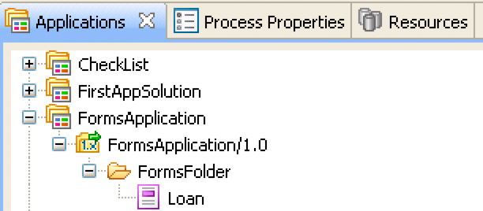
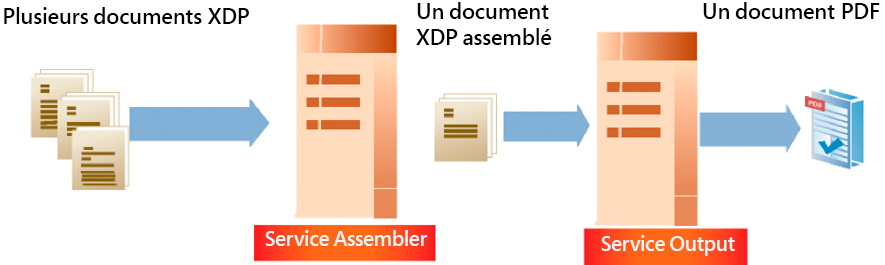
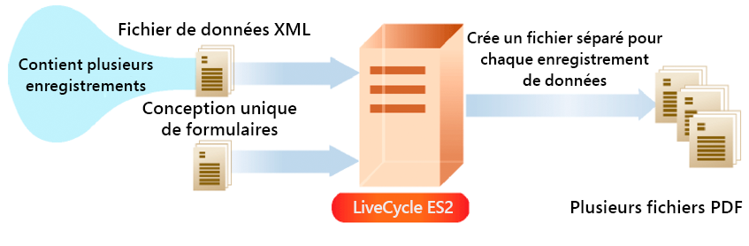
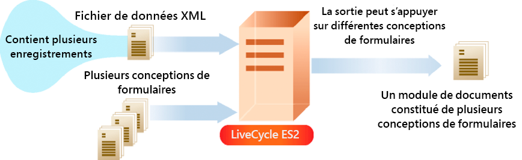

# Création de flux de sortie de document {#creating-document-output-streams}

**Les exemples et les exemples de ce document sont réservés à l’environnement AEM Forms on JEE.**

**À propos du service Output**

Le service Output vous permet de générer des documents au format PDF (y compris des documents PDF/A), PostScript, PCL (Printer Control Language), ainsi que les formats d’étiquettes suivants :

* Zebra - ZPL
* Intermec - IPL
* Datamax - DPL
* TecToshiba - TPCL

Le service Output vous permet de fusionner des données de formulaire XML avec une conception de formulaire et de générer le document sur une imprimante ou un fichier réseau.

Il existe deux façons de transmettre une conception de formulaire (un fichier XDP) au service Output. Vous pouvez transmettre au service Output une instance `com.adobe.idp.Document` contenant une conception de formulaire. Vous pouvez également transmettre une valeur URI qui spécifie l’emplacement de la conception de formulaire. Ces deux méthodes sont décrites dans la section *Programmation avec AEM forms*.

>[!NOTE]
>
>Le service Output ne prend pas en charge les documents PDF Acrobat contenant des scripts spécifiques à des objets d’application. Les documents PDF Acrobat contenant des scripts spécifiques à un objet d’application ne sont pas rendus.

Les sections suivantes expliquent comment transmettre une conception de formulaire au service Output à l’aide d’une valeur URI :

* [Création de documents PDF](creating-document-output-streams.md#creating-pdf-documents)
* [Création de documents PDF/A](creating-document-output-streams.md#creating-pdf-a-documents)

Les sections suivantes expliquent comment transmettre une conception de formulaire dans une instance `com.adobe.idp.Document` :

* [Transmission de documents situés dans Content Services (obsolète) vers Output Service](creating-document-output-streams.md#passing-documents-located-in-content-services-deprecated-to-the-output-service)
* [Création de documents PDF à l’aide de fragments](creating-document-output-streams.md#creating-pdf-documents-using-fragments)

Lorsque vous décidez de la technique à utiliser, vous devez notamment savoir si vous obtenez la conception de formulaire à partir d’un autre service AEM Forms, puis la transmettre dans une instance `com.adobe.idp.Document`. Les sections *Transmission de documents à Output Service* et *Création de documents PDF à l’aide de fragments* montrent comment obtenir une conception de formulaire à partir d’un autre service AEM Forms. La première section récupère la conception de formulaire à partir de Content Services (obsolète). La deuxième section récupère la conception de formulaire à partir du service Assembler.

Si vous obtenez la conception de formulaire à partir d’un emplacement fixe, tel que le système de fichiers, vous pouvez utiliser l’une ou l’autre des techniques. En d’autres termes, vous pouvez spécifier la valeur URI d’un fichier XDP ou utiliser une instance `com.adobe.idp.Document`.

Pour transmettre une valeur URI qui spécifie l’emplacement de la conception de formulaire lors de la création d’un document PDF, utilisez la méthode `generatePDFOutput` . De même, pour transmettre une instance `com.adobe.idp.Document` au service Output lors de la création d’un document PDF, utilisez la méthode `generatePDFOutput2` .

Lors de l’envoi d’un flux de sortie vers une imprimante réseau, vous pouvez également utiliser l’une ou l’autre des techniques. Pour envoyer un flux de sortie à une imprimante en transmettant une instance `com.adobe.idp.Document` contenant une conception de formulaire, utilisez la méthode `sendToPrinter2`. Pour envoyer un flux de sortie à une imprimante en transmettant une valeur URI, utilisez la méthode `sendToPrinter`. La section *Envoi de flux d’impression aux imprimantes* utilise la méthode `sendToPrinter`.

Vous pouvez accomplir ces tâches en utilisant le service Output :

* [Création de documents PDF](creating-document-output-streams.md#creating-pdf-documents)
* [Création de documents PDF/A](creating-document-output-streams.md#creating-pdf-a-documents)
* [Transmission de documents situés dans Content Services (obsolète) vers Output Service](creating-document-output-streams.md#passing-documents-located-in-content-services-deprecated-to-the-output-service)
* [Création de documents PDF à l’aide de fragments](creating-document-output-streams.md#creating-pdf-documents-using-fragments)
* [Impression dans des fichiers](creating-document-output-streams.md#printing-to-files)
* [Envoi de flux d’impression aux imprimantes](creating-document-output-streams.md#sending-print-streams-to-printers)
* [Création de plusieurs fichiers de sortie](creating-document-output-streams.md#creating-multiple-output-files)
* [Création de règles de recherche](creating-document-output-streams.md#creating-search-rules)
* [Aplatissement de documents PDF](creating-document-output-streams.md#flattening-pdf-documents)

>[!NOTE]
>
>Pour plus d’informations sur le service Output, voir [Référence des services pour AEM Forms](https://www.adobe.com/go/learn_aemforms_services_63).

## Création de documents PDF {#creating-pdf-documents}

Vous pouvez utiliser le service Output pour créer un document PDF basé sur une conception de formulaire et des données de formulaire XML que vous fournissez. Le document PDF créé par le service Output n’est pas un document PDF interactif ; un utilisateur ne peut pas saisir ni modifier des données de formulaire.

Si vous souhaitez créer un document PDF destiné au stockage à long terme, il est recommandé de créer un document PDF/A. (Voir [Création de documents PDF/A](creating-document-output-streams.md#creating-pdf-a-documents).)

Pour créer un formulaire PDF interactif qui permet à l’utilisateur de saisir des données, utilisez le service Forms. (Voir [Rendu des PDF forms interactifs](/help/forms/developing/rendering-forms.md#rendering-interactive-pdf-forms).)

>[!NOTE]
>
>Pour plus d’informations sur le service Output, voir [Référence des services pour AEM Forms](https://www.adobe.com/go/learn_aemforms_services_63).

### Résumé des étapes {#summary-of-steps}

Pour créer un document PDF, procédez comme suit :

1. Inclure les fichiers de projet.
1. Créez un objet client de sortie.
1. Référencez une source de données XML.
1. Définition des options d’exécution PDF.
1. Définissez les options d’exécution de rendu.
1. Générer un document PDF.
1. Récupérez les résultats de l’opération.

**Inclure les fichiers de projet**

Incluez les fichiers nécessaires dans votre projet de développement. Si vous créez une application cliente à l’aide de Java, incluez les fichiers JAR nécessaires. Si vous utilisez des services Web, veillez à inclure les fichiers proxy.

Les fichiers JAR suivants doivent être ajoutés au chemin d’accès aux classes de votre projet :

* adobe-livecycle-client.jar
* adobe-usermanager-client.jar
* adobe-output-client.jar
* adobe-utility.jar (Obligatoire si AEM Forms est déployé sur JBoss)
* jbossall-client.jar (requis si AEM Forms est déployé sur JBoss)

si AEM Forms est déployé sur un serveur d’applications J2EE pris en charge qui n’est pas JBoss, vous devez remplacer les fichiers adobe-utility.jar et jbossall-client.jar par des fichiers JAR spécifiques au serveur d’applications J2EE sur lequel AEM Forms est déployé.

**Création d’un objet client de sortie**

Avant d’effectuer une opération de service Output par programmation, vous devez créer un objet client de service Output. Si vous utilisez l’API Java, créez un objet `OutputClient` . Si vous utilisez l’API du service Web de sortie, créez un objet `OutputServiceService` .

**Référence à une source de données XML**

Pour fusionner les données avec la conception de formulaire, vous devez référencer une source de données XML contenant des données. Un élément XML doit exister pour chaque champ de formulaire que vous prévoyez de renseigner avec des données. Le nom de l’élément XML doit correspondre au nom du champ. Un élément XML est ignoré s’il ne correspond pas à un champ de formulaire ou si le nom de l’élément XML ne correspond pas au nom du champ. Il n&#39;est pas nécessaire de correspondre à l&#39;ordre dans lequel les éléments XML sont affichés si tous les éléments XML sont spécifiés.

Examinez l’exemple de formulaire de demande de prêt suivant.


Pour fusionner les données dans cette conception de formulaire, vous devez créer une source de données XML correspondant au formulaire. Le code XML suivant représente une source de données XDP XML qui correspond à l’exemple de formulaire de demande de prêt immobilier.

```xml
 <?xml version="1.0" encoding="UTF-8" ?>
 - <xfa:datasets xmlns:xfa="https://www.xfa.org/schema/xfa-data/1.0/">
 - <xfa:data>
 - <data>
     - <Layer>
         <closeDate>1/26/2007</closeDate>
         <lastName>Johnson</lastName>
         <firstName>Jerry</firstName>
         <mailingAddress>JJohnson@NoMailServer.com</mailingAddress>
         <city>New York</city>
         <zipCode>00501</zipCode>
         <state>NY</state>
         <dateBirth>26/08/1973</dateBirth>
         <middleInitials>D</middleInitials>
         <socialSecurityNumber>(555) 555-5555</socialSecurityNumber>
         <phoneNumber>5555550000</phoneNumber>
     </Layer>
     - <Mortgage>
         <mortgageAmount>295000.00</mortgageAmount>
         <monthlyMortgagePayment>1724.54</monthlyMortgagePayment>
         <purchasePrice>300000</purchasePrice>
         <downPayment>5000</downPayment>
         <term>25</term>
         <interestRate>5.00</interestRate>
     </Mortgage>
 </data>
 </xfa:data>
 </xfa:datasets>
```

**Définition des options d’exécution PDF**

Définissez l’option URI du fichier lors de la création d’un document PDF. Cette option spécifie le nom et l’emplacement du fichier PDF généré par le service Output.

>[!NOTE]
>
>Au lieu de définir l’option d’exécution URI du fichier, vous pouvez récupérer par programmation le document PDF à partir du type de données complexe renvoyé par le service Output. Toutefois, en définissant l’option d’exécution URI du fichier, vous n’avez pas besoin de créer une logique d’application qui récupère le document PDF par programmation.

**Définition des options d’exécution de rendu**

Vous pouvez définir des options d’exécution de rendu lors de la création d’un document PDF. Bien que ces options ne soient pas requises (contrairement aux options d’exécution PDF requises), vous pouvez effectuer des tâches telles que l’amélioration des performances du service Output. Par exemple, vous pouvez mettre en cache la conception de formulaire utilisée par le service Output afin d’améliorer ses performances.

Si vous utilisez un formulaire Acrobat balisé comme entrée, vous ne pouvez pas utiliser l’API Java ou Web Service Output pour désactiver le paramètre balisé. Si vous tentez de définir cette option par programmation sur `false`, le document PDF obtenu est toujours balisé.

>[!NOTE]
>
>Si vous ne spécifiez pas d’options d’exécution de rendu, les valeurs par défaut sont utilisées. Pour plus d’informations sur les options d’exécution de rendu, voir la référence de classe `RenderOptionsSpec` . (Voir [Référence de l’API AEM Forms](https://www.adobe.com/go/learn_aemforms_javadocs_63_en)).

**Générer un document PDF**

Après avoir référencé une source de données XML valide contenant des données de formulaire et défini des options d’exécution, vous pouvez appeler le service Output, ce qui génère un document PDF.

Lors de la génération d’un document PDF, vous spécifiez les valeurs URI requises par le service Output pour créer un document PDF. Une conception de formulaire peut être stockée dans des emplacements tels que le système de fichiers du serveur ou dans le cadre d’une application AEM Forms. Une conception de formulaire (ou d’autres ressources telles qu’un fichier image) qui existe dans le cadre d’une application Forms peut être référencée à l’aide de la valeur d’URI racine du contenu `repository:///`. Prenons par exemple la conception de formulaire suivante nommée *Loan.xdp* dans une application Forms nommée *Applications/FormsApplication* :


Pour accéder au fichier Loan.xdp affiché dans l’illustration précédente, spécifiez `repository:///Applications/FormsApplication/1.0/FormsFolder/` comme troisième paramètre transmis à la méthode `generatePDFOutput` de l’objet `OutputClient`. Indiquez le nom du formulaire (*Loan.xdp*) comme second paramètre transmis à la méthode `generatePDFOutput` de l’objet `OutputClient`.

Si le fichier XDP contient des images (ou d’autres ressources telles que des fragments), placez les ressources dans le même dossier d’application que le fichier XDP. AEM Forms utilise l’URI racine du contenu comme chemin d’accès de base pour résoudre les références aux images. Par exemple, si le fichier Loan.xdp contient une image, veillez à placer l’image dans `Applications/FormsApplication/1.0/FormsFolder/`.

>[!NOTE]
>
>Vous pouvez référencer un URI d’application Forms lors de l’appel des méthodes `generatePDFOutput` ou `generatePrintedOutput` de l’objet `OutputClient`.

>[!NOTE]
>
>Pour afficher un démarrage rapide complet qui crée un document PDF en référençant un fichier XDP situé dans une application Forms, voir [Démarrage rapide (mode EJB) : Création d’un document PDF basé sur un fichier XDP d’application à l’aide de l’API Java](/help/forms/developing/output-service-java-api-quick.md#quick-start-soap-mode-creating-a-pdf-document-based-on-an-application-xdp-file-using-the-java-api).

**Récupération des résultats de l’opération**

Une fois que le service Output a effectué une opération, il renvoie divers éléments de données, tels que les données XML d’état qui spécifient si l’opération a réussi.

**Voir également**

[Création d’un document PDF à l’aide de l’API Java](creating-document-output-streams.md#create-a-pdf-document-using-the-java-api)

[Création d’un document PDF à l’aide de l’API de service Web](creating-document-output-streams.md#create-a-pdf-document-using-the-web-service-api)

[Inclusion des fichiers de bibliothèque Java d’AEM Forms](/help/forms/developing/invoking-aem-forms-using-java.md#including-aem-forms-java-library-files)

[Réglage des propriétés de la connexion](/help/forms/developing/invoking-aem-forms-using-java.md#setting-connection-properties)

[Démarrages rapides de l’API Output Service](/help/forms/developing/output-service-java-api-quick.md#output-service-java-api-quick-start-soap)

### Créer un document PDF à l’aide de l’API Java {#create-a-pdf-document-using-the-java-api}

Créez un document PDF à l’aide de l’API Output (Java) :

1. Inclure les fichiers de projet.

   Incluez les fichiers JAR client, tels que adobe-output-client.jar, dans le chemin de classe de votre projet Java.

1. Créez un objet client de sortie.

   * Créez un objet `ServiceClientFactory` qui contient des propriétés de connexion.
   * Créez un objet `OutputClient` en utilisant son constructeur et en transmettant l’objet `ServiceClientFactory`.

1. Référencez une source de données XML.

   * Créez un objet `java.io.FileInputStream` qui représente la source de données XML utilisée pour remplir le document PDF en utilisant son constructeur et en transmettant une valeur string qui spécifie l’emplacement du fichier XML.
   * Créez un objet `com.adobe.idp.Document` en utilisant son constructeur. Transmettez l’objet `java.io.FileInputStream` .

1. Définition des options d’exécution PDF.

   * Créez un objet `PDFOutputOptionsSpec` en utilisant son constructeur.
   * Définissez l’option File URI en appelant la méthode `PDFOutputOptionsSpec` de l’objet `setFileURI`. Transmettez une valeur string qui spécifie l’emplacement du fichier PDF généré par le service Output. L’option File URI est relative au serveur d’applications J2EE hébergeant AEM Forms, et non à l’ordinateur client.

1. Définissez les options d’exécution de rendu.

   * Créez un objet `RenderOptionsSpec` en utilisant son constructeur.
   * Mettez en cache la conception de formulaire pour améliorer les performances du service Output en appelant la balise `setCacheEnabled` de l’objet `RenderOptionsSpec` et en transmettant `true`.

   >[!NOTE]
   >
   >Vous ne pouvez pas définir la version du document PDF à l’aide de la méthode `setPdfVersion` de l’objet `RenderOptionsSpec` si le document d’entrée est un formulaire Acrobat (un formulaire créé dans Acrobat) ou un document XFA signé ou certifié. Le document PDF de sortie conserve la version PDF d’origine. De même, vous ne pouvez pas définir l’option Adobe PDF balisée en appelant la méthode `setTaggedPDF` de l’objet `RenderOptionsSpec` si le document d’entrée est un formulaire Acrobat ou un document XFA signé ou certifié.

   >[!NOTE]
   >
   >Vous ne pouvez pas définir l’option PDF linéarisé à l’aide de la méthode `setLinearizedPDF` de l’objet `RenderOptionsSpec` si le document PDF d’entrée est certifié ou signé numériquement. (Voir [Signature numérique de documents PDF ](/help/forms/developing/digitally-signing-certifying-documents.md#digitally-signing-pdf-documents)*.)*

1. Générer un document PDF.

   Créez un document PDF en appelant la méthode `OutputClient` de l’objet `generatePDFOutput` et en transmettant les valeurs suivantes :

   * Valeur d’énumération `TransformationFormat`. Pour générer un document PDF, spécifiez `TransformationFormat.PDF`.
   * Valeur string spécifiant le nom de la nouvelle conception de formulaire.
   * Une valeur string qui spécifie la racine de contenu où se trouve la conception de formulaire.
   * Objet `PDFOutputOptionsSpec` contenant les options d’exécution PDF.
   * Objet `RenderOptionsSpec` contenant les options d’exécution de rendu.
   * Objet `com.adobe.idp.Document` contenant la source de données XML contenant les données à fusionner avec la conception de formulaire.

   La méthode `generatePDFOutput` renvoie un objet `OutputResult` contenant les résultats de l’opération.

   >[!NOTE]
   >
   >Lors de la génération d’un document PDF en appelant la méthode `generatePDFOutput`, sachez que vous ne pouvez pas fusionner des données avec un formulaire PDF XFA signé ou certifié. (Voir [Signature numérique et certification de documents ](/help/forms/developing/digitally-signing-certifying-documents.md#digitally-signing-and-certifying-documents)*.)*

   >[!NOTE]
   >
   >La méthode `getRecordLevelMetaDataList` de l’objet `OutputResult` renvoie `null`*.*

   >[!NOTE]
   >
   >Vous pouvez également créer un document PDF en appelant la méthode `generatePDFOutput2` de l’objet `OutputClient`. (Voir [Transfert de documents situés dans Content Services (obsolète) vers Output Service ](creating-document-output-streams.md#passing-documents-located-in-content-services-deprecated-to-the-output-service)*.)*

1. Récupérez les résultats de l’opération.

   * Récupérez un objet `com.adobe.idp.Document` qui représente l’état de l’opération `generatePDFOutput` en appelant la méthode `getStatusDoc` de l’objet `OutputResult`. Cette méthode renvoie des données XML d’état qui spécifient si l’opération a réussi.
   * Créez un objet `java.io.File` contenant les résultats de l’opération. Assurez-vous que l’extension de nom de fichier est .xml.
   * Appelez la méthode `copyToFile` de l’objet `com.adobe.idp.Document` pour copier le contenu de l’objet `com.adobe.idp.Document` dans le fichier (veillez à utiliser l’objet `com.adobe.idp.Document` renvoyé par la méthode `getStatusDoc` ).

   Bien que le service Output écrive le document PDF à l’emplacement spécifié par l’argument transmis à la méthode `setFileURI` de l’objet `PDFOutputOptionsSpec`, vous pouvez récupérer le document PDF/A par programmation en appelant la méthode `getGeneratedDoc` de l’objet `OutputResult`.

**Voir également**

[Résumé des étapes](creating-document-output-streams.md#summary-of-steps)

[Démarrage rapide (mode EJB) : Création d’un document PDF à l’aide de l’API Java](/help/forms/developing/output-service-java-api-quick.md#quick-start-soap-mode-creating-a-pdf-document-using-the-java-api)

[Démarrage rapide (mode SOAP) : Création d’un document PDF à l’aide de l’API Java](/help/forms/developing/output-service-java-api-quick.md#quick-start-soap-mode-creating-a-pdf-document-using-the-java-api)

[Inclusion des fichiers de bibliothèque Java d’AEM Forms](/help/forms/developing/invoking-aem-forms-using-java.md#including-aem-forms-java-library-files)

[Réglage des propriétés de la connexion](/help/forms/developing/invoking-aem-forms-using-java.md#setting-connection-properties)

### Créer un document PDF à l’aide de l’API de service Web {#create-a-pdf-document-using-the-web-service-api}

Créez un document PDF à l’aide de l’API Output (service Web) :

1. Inclure les fichiers de projet.

   Créez un projet Microsoft .NET qui utilise MTOM. Assurez-vous d’utiliser la définition WSDL suivante : `http://localhost:8080/soap/services/OutputService?WSDL&lc_version=9.0.1`.

   >[!NOTE]
   >
   >Remplacez `localhost` par l’adresse IP du serveur hébergeant AEM Forms.

1. Créez un objet client de sortie.

   * Créez un objet `OutputServiceClient` à l’aide de son constructeur par défaut.
   * Créez un objet `OutputServiceClient.Endpoint.Address` à l’aide du constructeur `System.ServiceModel.EndpointAddress`. Transmettez une valeur string qui spécifie le WSDL au service AEM Forms (par exemple, `http://localhost:8080/soap/services/OutputService?blob=mtom`). Vous n’avez pas besoin d’utiliser l’attribut `lc_version`. Cet attribut est utilisé lorsque vous créez une référence de service. Toutefois, spécifiez `?blob=mtom` pour utiliser MTOM.
   * Créez un objet `System.ServiceModel.BasicHttpBinding` en obtenant la valeur du champ `OutputServiceClient.Endpoint.Binding`. Convertissez la valeur de retour en `BasicHttpBinding`.
   * Définissez le champ `MessageEncoding` de l’objet `System.ServiceModel.BasicHttpBinding` sur `WSMessageEncoding.Mtom`. Cette valeur garantit l’utilisation de MTOM.
   * Activez l’authentification HTTP de base en effectuant les tâches suivantes :

      * Attribuez le nom d’utilisateur AEM forms au champ `OutputServiceClient.ClientCredentials.UserName.UserName`.
      * Attribuez la valeur de mot de passe correspondante au champ `OutputServiceClient.ClientCredentials.UserName.Password`.
      * Attribuez la valeur constante `HttpClientCredentialType.Basic` au champ `BasicHttpBindingSecurity.Transport.ClientCredentialType`.
      * Attribuez la valeur constante `BasicHttpSecurityMode.TransportCredentialOnly` au champ `BasicHttpBindingSecurity.Security.Mode`.

1. Référencez une source de données XML.

   * Créez un objet `BLOB` en utilisant son constructeur. L’objet `BLOB` est utilisé pour stocker les données XML qui seront fusionnées avec le document PDF.
   * Créez un objet `System.IO.FileStream` en appelant son constructeur et en transmettant une valeur string qui représente l’emplacement du fichier XML contenant les données de formulaire.
   * Créez un tableau d’octets qui stocke le contenu de l’objet `System.IO.FileStream`. Vous pouvez déterminer la taille du tableau d’octets en obtenant la propriété `System.IO.FileStream` de l’objet `Length`.
   * Renseignez le tableau d’octets avec les données de flux en appelant la méthode `System.IO.FileStream` de l’objet `Read` et en transmettant le tableau d’octets, la position de départ et la longueur du flux à lire.
   * Renseignez l’objet `BLOB` en attribuant son champ `MTOM` avec le contenu du tableau d’octets.

1. Définition des options d’exécution PDF

   * Créez un objet `PDFOutputOptionsSpec` en utilisant son constructeur.
   * Définissez l’option File URI en attribuant une valeur string qui spécifie l’emplacement du fichier PDF généré par le service Output au membre de données `fileURI` de l’objet `PDFOutputOptionsSpec`. L’option File URI est relative au serveur d’applications J2EE hébergeant AEM Forms, et non à l’ordinateur client.

1. Définissez les options d’exécution de rendu.

   * Créez un objet `RenderOptionsSpec` en utilisant son constructeur.
   * Mettez en cache la conception de formulaire pour améliorer les performances du service Output en affectant la valeur `true` au membre de données `cacheEnabled` de l’objet `RenderOptionsSpec`.

   >[!NOTE]
   >
   >Vous ne pouvez pas définir la version du document PDF à l’aide de la méthode `setPdfVersion` de l’objet `RenderOptionsSpec` si le document d’entrée est un formulaire Acrobat (un formulaire créé dans Acrobat) ou un document XFA signé ou certifié. Le document PDF de sortie conserve la version PDF d’origine. De même, vous ne pouvez pas définir l’option Adobe PDF balisée en appelant la méthode `RenderOptionsSpec` de l’objet `setTaggedPDF`* si le document d’entrée est un formulaire Acrobat ou un document XFA signé ou certifié.*

   >[!NOTE]
   >
   >Vous ne pouvez pas définir l’option PDF linéarisé à l’aide du membre `RenderOptionsSpec` de l’objet `linearizedPDF` si le document PDF d’entrée est certifié ou signé numériquement. (Voir [Signature numérique de documents PDF ](/help/forms/developing/digitally-signing-certifying-documents.md#digitally-signing-pdf-documents)*.)*

1. Générer un document PDF.

   Créez un document PDF en appelant la méthode `OutputServiceService` de l’objet `generatePDFOutput`et en transmettant les valeurs suivantes :

   * Valeur d’énumération `TransformationFormat`. Pour générer un document PDF, spécifiez `TransformationFormat.PDF`.
   * Valeur string spécifiant le nom de la nouvelle conception de formulaire.
   * Une valeur string qui spécifie la racine de contenu où se trouve la conception de formulaire.
   * Objet `PDFOutputOptionsSpec` contenant les options d’exécution PDF.
   * Objet `RenderOptionsSpec` contenant les options d’exécution de rendu.
   * Objet `BLOB` contenant la source de données XML contenant les données à fusionner avec la conception de formulaire.
   * Objet `BLOB` renseigné par la méthode `generatePDFOutput`. La méthode `generatePDFOutput` renseigne cet objet avec les métadonnées générées qui décrivent le document. (Cette valeur de paramètre est requise uniquement pour l’appel de service Web).
   * Objet `BLOB` renseigné par la méthode `generatePDFOutput`. La méthode `generatePDFOutput` renseigne cet objet avec les données de résultat. (Cette valeur de paramètre est requise uniquement pour l’appel de service Web).
   * Objet `OutputResult` contenant les résultats de l’opération. (Cette valeur de paramètre est requise uniquement pour l’appel de service Web).

   >[!NOTE]
   >
   >Lors de la génération d’un document PDF en appelant la méthode `generatePDFOutput`, sachez que vous ne pouvez pas fusionner des données avec un formulaire PDF XFA signé ou certifié. (Voir [Signature numérique et certification de documents ](/help/forms/developing/digitally-signing-certifying-documents.md#digitally-signing-and-certifying-documents)*.)*

   >[!NOTE]
   >
   >Vous pouvez également créer un document PDF en appelant la méthode `generatePDFOutput2` de l’objet `OutputClient`. (Voir [Transfert de documents situés dans Content Services (obsolète) vers Output Service ](creating-document-output-streams.md#passing-documents-located-in-content-services-deprecated-to-the-output-service)*.)*

1. Récupérez les résultats de l’opération.

   * Créez un objet `System.IO.FileStream` en appelant son constructeur et en transmettant une valeur string qui représente un emplacement de fichier XML contenant les données de résultat. Assurez-vous que l’extension de nom de fichier est .xml.
   * Créez un tableau d’octets qui stocke le contenu des données de l’objet `BLOB` qui a été renseigné avec les données de résultat par la méthode `generatePDFOutput` de l’objet `OutputServiceService` (le huitième paramètre). Renseignez le tableau d’octets en obtenant la valeur `BLOB` de l’objet `MTOM` `field`.
   * Créez un objet `System.IO.BinaryWriter` en appelant son constructeur et en transmettant l’objet `System.IO.FileStream`.
   * Ecrivez le contenu du tableau d’octets dans le fichier XML en appelant la méthode `System.IO.BinaryWriter` de l’objet `Write` et en transmettant le tableau d’octets.

   Voir également

[Résumé des étapes](creating-document-output-streams.md#summary-of-steps)

[Appel d’AEM Forms à l’aide de MTOM](/help/forms/developing/invoking-aem-forms-using-web.md#invoking-aem-forms-using-mtom)

[Appel d’AEM Forms à l’aide de SwaRef](/help/forms/developing/invoking-aem-forms-using-web.md#invoking-aem-forms-using-swaref)

   >[!NOTE]
   >
   >La méthode `generateOutput` de l’objet `OutputServiceService` est obsolète.

## Création de documents PDF/A {#creating-pdf-a-documents}

Vous pouvez utiliser le service Output pour créer un document PDF/A. Le format PDF/A étant un format d’archivage pour la conservation à long terme du contenu du document, toutes les polices sont incorporées et le fichier est décompressé. Par conséquent, un document PDF/A est généralement plus volumineux qu’un document PDF standard. En outre, un document PDF/A ne contient pas de contenu audio et vidéo. Comme les autres tâches du service Output, vous fournissez à la fois une conception de formulaire et des données à fusionner avec une conception de formulaire pour créer un document PDF/A.

La spécification PDF/A-1 se compose de deux niveaux de conformité, à savoir a et b. La principale différence entre les deux concerne la prise en charge de la structure logique (accessibilité), qui n’est pas requise pour le niveau de conformité b. Quel que soit le niveau de conformité, PDF/A-1 exige que toutes les polices soient incorporées dans le document PDF/A généré.

Bien que PDF/A soit la norme d’archivage des documents PDF, il n’est pas obligatoire que PDF/A soit utilisé pour l’archivage si un document PDF standard répond aux besoins de votre entreprise. L’objectif de la norme PDF/A est de créer un fichier PDF pouvant être stocké pendant une longue période et qui réponde aux exigences de conservation des documents. Par exemple, une URL ne peut pas être incorporée dans un fichier PDF/A, car au fil du temps, elle peut devenir invalide.

Votre entreprise doit évaluer ses propres besoins, le temps que vous avez l’intention de conserver le document, les considérations de taille de fichier et déterminer votre propre stratégie d’archivage. Vous pouvez déterminer par programmation si un document PDF est compatible avec le format PDF/A à l’aide du service DocConverter. (Voir [Détermination par programmation de la conformité PDF/A](/help/forms/developing/pdf-a-documents.md#programmatically-determining-pdf-a-compliancy).)

Un document PDF/A doit utiliser la police spécifiée dans la conception de formulaire et les polices ne peuvent pas être remplacées. Par conséquent, si une police située dans un document PDF n’est pas disponible sur le système d’exploitation hôte, une exception se produit.

Lorsqu’un document PDF/A est ouvert dans Acrobat, un message s’affiche pour confirmer que le document est un document PDF/A, comme illustré ci-dessous.


>[!NOTE]
>
>Le site web d’AIIM comporte une section PDF/A FAQ à laquelle vous pouvez accéder à l’adresse [https://www.aiim.org/documents/standards/19005-1_FAQ.pdf](https://www.aiim.org/documents/standards/19005-1_FAQ.pdf).

>[!NOTE]
>
>Pour plus d’informations sur le service Output, voir [Référence des services pour AEM Forms](https://www.adobe.com/go/learn_aemforms_services_63).

### Résumé des étapes {#summary_of_steps-1}

Pour créer un document PDF/A, procédez comme suit :

1. Inclure les fichiers de projet.
1. Créez un objet client de sortie.
1. Référencez une source de données XML.
1. Définition des options d’exécution PDF/A.
1. Définissez les options d’exécution de rendu.
1. Générer un document PDF/A.
1. Récupérez les résultats de l’opération.

**Inclure les fichiers de projet**

Incluez les fichiers nécessaires dans votre projet de développement. Si vous créez une application personnalisée à l’aide de Java, incluez les fichiers JAR nécessaires. Si vous utilisez des services Web, veillez à inclure les fichiers proxy.

Les fichiers JAR suivants doivent être ajoutés au chemin de classe de votre projet :

* adobe-livecycle-client.jar
* adobe-usermanager-client.jar
* adobe-output-client.jar
* adobe-utility.jar (Obligatoire si AEM Forms est déployé sur JBoss)
* jbossall-client.jar (requis si AEM Forms est déployé sur JBoss)

si AEM Forms est déployé sur un serveur d’applications J2EE pris en charge qui n’est pas JBoss, vous devez remplacer les fichiers adobe-utility.jar et jbossall-client.jar par des fichiers JAR spécifiques au serveur d’applications J2EE sur lequel AEM Forms est déployé.

**Création d’un objet client de sortie**

Avant d’effectuer une opération de service Output par programmation, vous devez créer un objet client de service Output. Si vous utilisez l’API Java, créez un objet `OutputClient` . Si vous utilisez l’API du service Web de sortie, créez un objet `OutputServiceService` .

**Référence à une source de données XML**

Pour fusionner les données avec la conception de formulaire, vous devez référencer une source de données XML contenant des données. Un élément XML doit exister pour chaque champ de formulaire à renseigner avec des données. Le nom de l’élément XML doit correspondre au nom du champ. Un élément XML est ignoré s’il ne correspond pas à un champ de formulaire ou si le nom de l’élément XML ne correspond pas au nom du champ. Il n&#39;est pas nécessaire de correspondre à l&#39;ordre dans lequel les éléments XML sont affichés si tous les éléments XML sont spécifiés.

**Définition des options d’exécution PDF/A**

Vous pouvez définir l’option URI du fichier lors de la création d’un document PDF/A. L’URI est relatif au serveur d’applications J2EE hébergeant AEM Forms. En d’autres termes, si vous définissez C:\Adobe, le fichier est écrit dans le dossier sur le serveur et non sur l’ordinateur client. L’URI spécifie le nom et l’emplacement du fichier PDF/A généré par le service Output.

**Définition des options d’exécution de rendu**

Vous pouvez définir des options d’exécution de rendu lors de la création de documents PDF/A. Vous pouvez définir deux options liées à PDF/A : les valeurs `PDFAConformance` et `PDFARevisionNumber`. La valeur `PDFAConformance` fait référence à la manière dont un document PDF respecte les exigences qui spécifient la manière dont les documents électroniques à long terme sont conservés. Les valeurs valides de cette option sont `A` et `B`. Pour plus d’informations sur la conformité a et b, voir la spécification ISO PDF/A-1 intitulée *ISO 19005-1 Document management*.

La valeur `PDFARevisionNumber` fait référence au numéro de révision d’un document PDF/A. Pour plus d’informations sur le numéro de révision d’un document PDF/A, voir la spécification ISO PDF/A-1 intitulée *ISO 19005-1 Document management*.

>[!NOTE]
>
>Vous ne pouvez pas définir l’option Adobe PDF balisée sur `false` lors de la création d’un document PDF/A 1A. PDF/A 1A sera toujours un document PDF balisé. En outre, vous ne pouvez pas définir l’option Adobe PDF balisée sur `true` lors de la création d’un document PDF/A 1B. PDF/A 1B sera toujours un document PDF non balisé.

**Génération d’un document PDF/A**

Après avoir référencé une source de données XML valide contenant des données de formulaire et défini des options d’exécution, vous pouvez appeler le service Output, ce qui génère un document PDF/A.

**Récupération des résultats de l’opération**

Une fois que le service Output a effectué une opération, il renvoie divers éléments de données, tels que des données XML qui spécifient si l’opération a réussi.

**Voir également**

[Création d’un document PDF/A à l’aide de l’API Java](creating-document-output-streams.md#create-a-pdf-a-document-using-the-java-api)

[Création d’un document PDF/A à l’aide de l’API de service Web](creating-document-output-streams.md#create-a-pdf-a-document-using-the-web-service-api)

[Inclusion des fichiers de bibliothèque Java d’AEM Forms](/help/forms/developing/invoking-aem-forms-using-java.md#including-aem-forms-java-library-files)

[Réglage des propriétés de la connexion](/help/forms/developing/invoking-aem-forms-using-java.md#setting-connection-properties)

[Démarrages rapides de l’API Output Service](/help/forms/developing/output-service-java-api-quick.md#output-service-java-api-quick-start-soap)

### Créer un document PDF/A à l’aide de l’API Java {#create-a-pdf-a-document-using-the-java-api}

Créez un document PDF/A à l’aide de l’API Output (Java) :

1. Inclure les fichiers de projet.

   Incluez les fichiers JAR client, tels que adobe-output-client.jar, dans le chemin de classe de votre projet Java.

1. Créez un objet client de sortie.

   * Créez un objet `ServiceClientFactory` qui contient des propriétés de connexion.
   * Créez un objet `OutputClient` en utilisant son constructeur et en transmettant l’objet `ServiceClientFactory`.

1. Référencez une source de données XML.

   * Créez un objet `java.io.FileInputStream` qui représente la source de données XML utilisée pour remplir le document PDF/A en utilisant son constructeur et en transmettant une valeur string qui spécifie l’emplacement du fichier XML.
   * Créez un objet `com.adobe.idp.Document` en utilisant son constructeur et en transmettant l’objet `java.io.FileInputStream`. 

1. Définition des options d’exécution PDF/A.

   * Créez un objet `PDFOutputOptionsSpec` en utilisant son constructeur.
   * Définissez l’option File URI en appelant la méthode `PDFOutputOptionsSpec` de l’objet `setFileURI`. Transmettez une valeur string qui spécifie l’emplacement du fichier PDF généré par le service Output. L’option File URI est relative au serveur d’applications J2EE hébergeant AEM Forms, et non à l’ordinateur client.

1. Définissez les options d’exécution de rendu.

   * Créez un objet `RenderOptionsSpec` en utilisant son constructeur.
   * Définissez la valeur `PDFAConformance` en appelant la méthode `setPDFAConformance` de l’objet `RenderOptionsSpec` et en transmettant une valeur d’énumération `PDFAConformance` qui spécifie le niveau de conformité. Par exemple, pour spécifier le niveau de conformité A, transmettez `PDFAConformance.A`.
   * Définissez la valeur `PDFARevisionNumber` en appelant la méthode `setPDFARevisionNumber` de l’objet `RenderOptionsSpec` et en transmettant `PDFARevisionNumber.Revision_1`.

   >[!NOTE]
   >
   >La version PDF d’un document PDF/A est 1.4, quelle que soit la valeur que vous indiquez pour la méthode `setPdfVersion`*de l’objet*.`RenderOptionsSpec`

1. Générer un document PDF/A.

   Créez un document PDF/A en appelant la méthode `generatePDFOutput` de l’objet `OutputClient` et en transmettant les valeurs suivantes :

   * Valeur d’énumération `TransformationFormat`. Pour générer un document PDF/A, spécifiez `TransformationFormat.PDFA`.
   * Valeur string spécifiant le nom de la nouvelle conception de formulaire.
   * Une valeur string qui spécifie la racine de contenu où se trouve la conception de formulaire.
   * Objet `PDFOutputOptionsSpec` contenant les options d’exécution PDF.
   * Objet `RenderOptionsSpec` contenant les options d’exécution de rendu.
   * Objet `com.adobe.idp.Document` contenant la source de données XML contenant les données à fusionner avec la conception de formulaire.

   La méthode `generatePDFOutput` renvoie un objet `OutputResult` contenant les résultats de l’opération.

   >[!NOTE]
   >
   >La méthode `getRecordLevelMetaDataList` de l’objet `OutputResult` renvoie `null`.

   >[!NOTE]
   >
   >Vous pouvez également créer un document PDF/A en appelant la méthode `OutputClient` de l’objet `generatePDFOutput`2. (Voir [Transfert de documents situés dans Content Services (obsolète) vers Output Service](creating-document-output-streams.md#passing-documents-located-in-content-services-deprecated-to-the-output-service).)

1. Récupérez les résultats de l’opération.

   * Créez un objet `com.adobe.idp.Document` qui représente l’état de la méthode `generatePDFOutput` en appelant la méthode `getStatusDoc` de l’objet.`OutputResult`
   * Créez un objet `java.io.File` qui contiendra les résultats de l’opération. Assurez-vous que l’extension de nom de fichier est .xml.
   * Appelez la méthode `copyToFile` de l’objet `com.adobe.idp.Document` pour copier le contenu de l’objet `com.adobe.idp.Document` dans le fichier (veillez à utiliser l’objet `com.adobe.idp.Document` renvoyé par la méthode `getStatusDoc` ).

   >[!NOTE]
   >
   >Bien que le service Output écrive le document PDF/A à l’emplacement spécifié par l’argument transmis à la méthode `setFileURI` de l’objet `PDFOutputOptionsSpec`, vous pouvez récupérer le document PDF/A par programmation en appelant la méthode `getGeneratedDoc` de l’objet `OutputResult`.

**Voir également**

[Résumé des étapes](creating-document-output-streams.md#summary-of-steps)

[Démarrage rapide (mode SOAP) : Création d’un document PDF/A à l’aide de l’API Java](/help/forms/developing/output-service-java-api-quick.md#quick-start-soap-mode-creating-a-pdf-a-document-using-the-java-api)

[Inclusion des fichiers de bibliothèque Java d’AEM Forms](/help/forms/developing/invoking-aem-forms-using-java.md#including-aem-forms-java-library-files)

[Réglage des propriétés de la connexion](/help/forms/developing/invoking-aem-forms-using-java.md#setting-connection-properties).

### Créer un document PDF/A à l’aide de l’API de service Web {#create-a-pdf-a-document-using-the-web-service-api}

Créez un document PDF/A à l’aide de l’API Output (service Web) :

1. Inclure les fichiers de projet.

   Créez un projet Microsoft .NET qui utilise MTOM. Assurez-vous d’utiliser la définition WSDL suivante : `http://localhost:8080/soap/services/OutputService?WSDL&lc_version=9.0.1`.

   >[!NOTE]
   >
   >Remplacez `localhost` par l’adresse IP du serveur hébergeant AEM Forms.

1. Créez un objet client de sortie.

   * Créez un objet `OutputServiceClient` à l’aide de son constructeur par défaut.
   * Créez un objet `OutputServiceClient.Endpoint.Address` à l’aide du constructeur `System.ServiceModel.EndpointAddress`. Transmettez une valeur string qui spécifie le WSDL au service AEM Forms (par exemple, `http://localhost:8080/soap/services/OutputService?blob=mtom`). Vous n’avez pas besoin d’utiliser l’attribut `lc_version`. Cet attribut est utilisé lorsque vous créez une référence de service. Toutefois, spécifiez `?blob=mtom` pour utiliser MTOM.
   * Créez un objet `System.ServiceModel.BasicHttpBinding` en obtenant la valeur du champ `OutputServiceClient.Endpoint.Binding`. Convertissez la valeur de retour en `BasicHttpBinding`.
   * Définissez le champ `MessageEncoding` de l’objet `System.ServiceModel.BasicHttpBinding` sur `WSMessageEncoding.Mtom`. Cette valeur garantit l’utilisation de MTOM.
   * Activez l’authentification HTTP de base en effectuant les tâches suivantes :

      * Attribuez le nom d’utilisateur AEM forms au champ `OutputServiceClient.ClientCredentials.UserName.UserName`.
      * Attribuez la valeur de mot de passe correspondante au champ `OutputServiceClient.ClientCredentials.UserName.Password`.
      * Attribuez la valeur constante `HttpClientCredentialType.Basic` au champ `BasicHttpBindingSecurity.Transport.ClientCredentialType`.
      * Attribuez la valeur constante `BasicHttpSecurityMode.TransportCredentialOnly` au champ `BasicHttpBindingSecurity.Security.Mode`.

1. Référencez une source de données XML.

   * Créez un objet `BLOB` en utilisant son constructeur. L’objet `BLOB` est utilisé pour stocker les données qui seront fusionnées avec le document PDF/A.
   * Créez un objet `System.IO.FileStream` en appelant son constructeur et en transmettant une valeur string qui représente l’emplacement du fichier du document PDF à chiffrer et le mode d’ouverture du fichier.
   * Créez un tableau d’octets qui stocke le contenu de l’objet `System.IO.FileStream`. Vous pouvez déterminer la taille du tableau d’octets en obtenant la propriété `System.IO.FileStream` de l’objet `Length`.
   * Renseignez le tableau d’octets avec les données de flux en appelant la méthode `System.IO.FileStream` de l’objet `Read` et en transmettant le tableau d’octets, la position de départ et la longueur du flux à lire.
   * Renseignez l’objet `BLOB` en attribuant son champ `MTOM` avec le contenu du tableau d’octets.

1. Définition des options d’exécution PDF/A.

   * Créez un objet `PDFOutputOptionsSpec` en utilisant son constructeur.
   * Définissez l’option File URI en attribuant une valeur string qui spécifie l’emplacement du fichier PDF généré par le service Output au membre de données `fileURI` de l’objet `PDFOutputOptionsSpec`. L’option File URI est relative au serveur d’applications J2EE hébergeant AEM Forms, et non à l’ordinateur client.

1. Définissez les options d’exécution de rendu.

   * Créez un objet `RenderOptionsSpec` en utilisant son constructeur.
   * Définissez la valeur `PDFAConformance` en attribuant une valeur d’énumération `PDFAConformance` au membre de données `PDFAConformance` de l’objet `RenderOptionsSpec`. Par exemple, pour spécifier le niveau de conformité A, affectez `PDFAConformance.A` à ce membre de données.
   * Définissez la valeur `PDFARevisionNumber` en attribuant une valeur d’énumération `PDFARevisionNumber` au membre de données `PDFARevisionNumber` de l’objet `RenderOptionsSpec`. Affectez `PDFARevisionNumber.Revision_1` à ce membre de données.

   >[!NOTE]
   >
   >La version PDF d’un document PDF/A est 1.4, quelle que soit la valeur spécifiée.

1. Générer un document PDF/A.

   Créez un document PDF en appelant la méthode `OutputServiceService` de l’objet `generatePDFOutput`et en transmettant les valeurs suivantes :

   * Une valeur d’énumération TransformationFormat . Pour générer un document PDF, spécifiez `TransformationFormat.PDFA`.
   * Valeur string spécifiant le nom de la nouvelle conception de formulaire.
   * Une valeur string qui spécifie la racine de contenu où se trouve la conception de formulaire.
   * Objet `PDFOutputOptionsSpec` contenant les options d’exécution PDF.
   * Objet `RenderOptionsSpec` contenant les options d’exécution de rendu.
   * Objet `BLOB` contenant la source de données XML contenant les données à fusionner avec la conception de formulaire.
   * Objet `BLOB` renseigné par la méthode `generatePDFOutput`. La méthode `generatePDFOutput` renseigne cet objet avec les métadonnées générées qui décrivent le document. (Cette valeur de paramètre est requise pour l’appel de service Web uniquement.)
   * Objet `BLOB` renseigné par la méthode `generatePDFOutput`. La méthode `generatePDFOutput` renseigne cet objet avec les données de résultat. (Cette valeur de paramètre est requise pour l’appel de service Web uniquement.)
   * Objet `OutputResult` contenant les résultats de l’opération. (Cette valeur de paramètre est requise pour l’appel de service Web uniquement.)

   >[!NOTE]
   >
   >Vous pouvez également créer un document PDF/A en appelant la méthode `OutputClient` de l’objet `generatePDFOutput`2. (Voir [Transfert de documents situés dans Content Services (obsolète) vers Output Service](creating-document-output-streams.md#passing-documents-located-in-content-services-deprecated-to-the-output-service).)

1. Récupérez les résultats de l’opération.

   * Créez un objet `System.IO.FileStream` en appelant son constructeur et en transmettant une valeur string qui représente un emplacement de fichier XML contenant les données de résultat. Assurez-vous que l’extension de nom de fichier est .xml.
   * Créez un tableau d’octets qui stocke le contenu des données de l’objet `BLOB` qui a été renseigné avec les données de résultat par la méthode `generatePDFOutput` de l’objet `OutputServiceService` (le huitième paramètre). Renseignez le tableau d’octets en obtenant la valeur du champ `MTOM` de l’objet `BLOB`.
   * Créez un objet `System.IO.BinaryWriter` en appelant son constructeur et en transmettant l’objet `System.IO.FileStream`.
   * Ecrivez le contenu du tableau d’octets dans le fichier XML en appelant la méthode `System.IO.BinaryWriter` de l’objet `Write` et en transmettant le tableau d’octets.

**Voir également**

[Résumé des étapes](creating-document-output-streams.md#summary-of-steps)

[Appel d’AEM Forms à l’aide de MTOM](/help/forms/developing/invoking-aem-forms-using-web.md#invoking-aem-forms-using-mtom)

[Appel d’AEM Forms à l’aide de SwaRef](/help/forms/developing/invoking-aem-forms-using-web.md#invoking-aem-forms-using-swaref)

## Transmission de documents situés dans Content Services (obsolète) au service Output {#passing-documents-located-in-content-services-deprecated-to-the-output-service}

Le service Output rend un formulaire PDF non interactif basé sur une conception de formulaire généralement enregistrée en tant que fichier XDP et créée dans Designer. Vous pouvez transmettre au service Output un objet `com.adobe.idp.Document` contenant la conception de formulaire. Le service Output effectue ensuite le rendu de la conception de formulaire située dans l’objet `com.adobe.idp.Document`.

L’un des avantages de la transmission d’un objet `com.adobe.idp.Document` au service Output est que d’autres opérations de service AEM Forms renvoient une instance `com.adobe.idp.Document`. En d’autres termes, vous pouvez obtenir une instance `com.adobe.idp.Document` à partir d’une autre opération de service et en effectuer le rendu. Supposons, par exemple, qu’un fichier XDP soit stocké dans un noeud Content Services (obsolète) nommé `/Company Home/Form Designs`, comme illustré ci-dessous.

Vous pouvez récupérer Loan.xdp par programmation à partir de Content Services (obsolète) et transmettre le fichier XDP au service Output dans un objet `com.adobe.idp.Document`.

>[!NOTE]
>
>Pour plus d’informations sur le service Forms, voir [Référence des services pour AEM Forms](https://www.adobe.com/go/learn_aemforms_services_63).

### Résumé des étapes {#summary_of_steps-2}

Pour transmettre un document obtenu à partir de Content Services (obsolète) au service Output, effectuez les tâches suivantes :

1. Inclure les fichiers de projet.
1. Créez un objet d’API Output et Document Management Client.
1. Récupérez la conception de formulaire auprès de Content Services (obsolète).
1. Générer le formulaire PDF non interactif.
1. Exécutez une action avec le flux de données.

**Inclure les fichiers de projet**

Incluez les fichiers nécessaires à votre projet de développement. Si vous créez une application cliente à l’aide de Java, incluez les fichiers JAR nécessaires. Si vous utilisez des services Web, incluez les fichiers proxy.

**Création d’une sortie et d’un objet API client Document Management**

Avant d’effectuer par programmation une opération d’API de service Output, créez un objet API de client de sortie. En outre, comme ce workflow récupère un fichier XDP de Content Services (obsolète), créez un objet API Document Management.

**Récupération de la conception de formulaire auprès de Content Services (obsolète)**

Récupérez le fichier XDP à partir de Content Services (obsolète) à l’aide de l’API Java ou de service Web. Le fichier XDP est renvoyé dans une instance `com.adobe.idp.Document` (ou une instance `BLOB` si vous utilisez des services Web). Vous pouvez ensuite transmettre l’instance `com.adobe.idp.Document` au service Output.

**Rendu du formulaire PDF non interactif**

Pour effectuer le rendu d’un formulaire non interactif, transmettez l’instance `com.adobe.idp.Document` qui a été renvoyée de Content Services (obsolète) au service Output.

>[!NOTE]
>
>Deux nouvelles méthodes nommées `generatePDFOutput2`et `eneratePrintedOutput2`acceptent un objet `com.adobe.idp.Document` contenant une conception de formulaire. Vous pouvez également transmettre une balise `com.adobe.idp.Document`contenant la conception de formulaire au service Output lors de l’envoi d’un flux d’impression vers une imprimante réseau.

**Exécution d’une action avec le flux de données de formulaire**

Vous pouvez enregistrer le formulaire non interactif au format PDF. Le formulaire peut être affiché dans Adobe Reader ou Acrobat.

**Voir également**

[Transmission de documents à Output Service à l’aide de l’API Java](creating-document-output-streams.md#pass-documents-to-the-output-service-using-the-java-api)

[Transmission de documents à Output Service à l’aide de l’API du service Web](creating-document-output-streams.md#pass-documents-to-the-output-service-using-the-web-service-api)

[Inclusion des fichiers de bibliothèque Java d’AEM Forms](/help/forms/developing/invoking-aem-forms-using-java.md#including-aem-forms-java-library-files)

[Réglage des propriétés de la connexion](/help/forms/developing/invoking-aem-forms-using-java.md#setting-connection-properties)

[Démarrages rapides de l’API Output Service](/help/forms/developing/output-service-java-api-quick.md#output-service-java-api-quick-start-soap)

[Création de documents PDF à l’aide de fragments](creating-document-output-streams.md#creating-pdf-documents-using-fragments)

### Transmettre des documents au service Output à l’aide de l’API Java {#pass-documents-to-the-output-service-using-the-java-api}

Transmettez un document récupéré de Content Services (obsolète) à l’aide du service Output et de l’API Content Services (obsolète) (Java) :

1. Inclure les fichiers de projet.

   Incluez les fichiers JAR client, tels que adobe-output-client.jar et adobe-contentservices-client.jar, dans le chemin de classe de votre projet Java.

1. Créez un objet d’API Output et Document Management Client.

   * Créez un objet `ServiceClientFactory` qui contient des propriétés de connexion. (Voir [Réglage des propriétés de la connexion](/help/forms/developing/invoking-aem-forms-using-java.md#setting-connection-properties).)
   * Créez un objet `OutputClient` en utilisant son constructeur et en transmettant l’objet `ServiceClientFactory`.
   * Créez un objet `DocumentManagementServiceClientImpl` en utilisant son constructeur et en transmettant l’objet `ServiceClientFactory`. 

1. Récupérez la conception de formulaire auprès de Content Services (obsolète).

   Appelez la méthode `retrieveContent` de l’objet `DocumentManagementServiceClientImpl` et transmettez les valeurs suivantes :

   * Une valeur string qui spécifie le magasin où le contenu est ajouté. Le magasin par défaut est `SpacesStore`. Cette valeur est un paramètre obligatoire.
   * Une valeur string qui spécifie le chemin d’accès complet du contenu à récupérer (par exemple, `/Company Home/Form Designs/Loan.xdp`). Cette valeur est un paramètre obligatoire.
   * Une valeur string qui spécifie la version. Cette valeur est un paramètre facultatif et vous pouvez transmettre une chaîne vide. Dans ce cas, la dernière version est récupérée.

   La méthode `retrieveContent` renvoie un objet `CRCResult` contenant le fichier XDP. Récupérez une instance `com.adobe.idp.Document` en appelant la méthode `CRCResult` de l’objet `getDocument`.

1. Générer le formulaire PDF non interactif.

   Appelez la méthode `generatePDFOutput2` de l’objet `OutputClient` et transmettez les valeurs suivantes :

   * Valeur d’énumération `TransformationFormat`. Pour générer un document PDF, spécifiez `TransformationFormat.PDF`.
   * Une valeur string qui spécifie la racine de contenu où se trouvent les ressources supplémentaires telles que les images.
   * Objet `com.adobe.idp.Document` représentant la conception de formulaire (utilisez l’instance renvoyée par la méthode `getDocument` de l’objet `CRCResult`).
   * Objet `PDFOutputOptionsSpec` contenant les options d’exécution PDF.
   * Objet `RenderOptionsSpec` contenant les options d’exécution de rendu.
   * Objet `com.adobe.idp.Document` contenant la source de données XML contenant les données à fusionner avec la conception de formulaire.

   La méthode `generatePDFOutput2` renvoie un objet `OutputResult` contenant les résultats de l’opération.

1. Exécutez une action avec le flux de données de formulaire.

   * Récupérez un objet `com.adobe.idp.Document` qui représente le formulaire non interactif en appelant la méthode `getGeneratedDoc` de l’objet `OutputResult`.
   * Créez un objet `java.io.File` contenant les résultats de l’opération. Assurez-vous que l’extension de nom de fichier est .pdf.
   * Appelez la méthode `copyToFile` de l’objet `com.adobe.idp.Document` pour copier le contenu de l’objet `com.adobe.idp.Document` dans le fichier (veillez à utiliser l’objet `com.adobe.idp.Document` renvoyé par la méthode `getGeneratedDoc` ).

**Voir également**

[Résumé des étapes](creating-document-output-streams.md#summary-of-steps)

[Démarrage rapide (mode EJB) : Transmission de documents à Output Service à l’aide de l’API Java](/help/forms/developing/output-service-java-api-quick.md#quick-start-soap-mode-passing-documents-to-the-output-service-using-the-java-api)

[Démarrage rapide (mode SOAP) : Transmission de documents à Output Service à l’aide de l’API Java](/help/forms/developing/output-service-java-api-quick.md#quick-start-soap-mode-passing-documents-to-the-output-service-using-the-java-api)

[Inclusion des fichiers de bibliothèque Java d’AEM Forms](/help/forms/developing/invoking-aem-forms-using-java.md#including-aem-forms-java-library-files)

[Réglage des propriétés de la connexion](/help/forms/developing/invoking-aem-forms-using-java.md#setting-connection-properties)

### Transmettre des documents au service Output à l’aide de l’API de service Web {#pass-documents-to-the-output-service-using-the-web-service-api}

Transmettez un document récupéré de Content Services (obsolète) à l’aide du service Output et de l’API Content Services (obsolète) (obsolète) :

1. Inclure les fichiers de projet.

   Créez un projet Microsoft .NET qui utilise MTOM. Comme cette application cliente appelle deux services AEM Forms, créez deux références de service. Utilisez la définition WSDL suivante pour la référence de service associée au service Output : `http://localhost:8080/soap/services/OutputService?WSDL&lc_version=9.0.1`.

   Utilisez la définition WSDL suivante pour la référence de service associée au service Document Management : `http://localhost:8080/soap/services/DocumentManagementService?WSDL&lc_version=9.0.1`.

   Comme le type de données `BLOB` est commun aux deux références de service, qualifiez complètement le type de données `BLOB` lors de son utilisation. Dans le démarrage rapide du service Web correspondant, toutes les instances `BLOB` sont entièrement qualifiées.

   >[!NOTE]
   >
   >Remplacez `localhost` par l’adresse IP du serveur hébergeant AEM Forms.

1. Créez un objet d’API Output et Document Management Client.

   * Créez un objet `OutputServiceClient` à l’aide de son constructeur par défaut.
   * Créez un objet `OutputServiceClient.Endpoint.Address` à l’aide du constructeur `System.ServiceModel.EndpointAddress`. Transmettez une valeur string qui spécifie le WSDL au service Forms (par exemple, `http://localhost:8080/soap/services/OutputService?blob=mtom`). Vous n’avez pas besoin d’utiliser l’attribut `lc_version`. Cet attribut est utilisé lorsque vous créez une référence de service.)
   * Créez un objet `System.ServiceModel.BasicHttpBinding` en obtenant la valeur du champ `OutputServiceClient.Endpoint.Binding`. Convertissez la valeur de retour en `BasicHttpBinding`.
   * Définissez le champ `MessageEncoding` de l’objet `System.ServiceModel.BasicHttpBinding` sur `WSMessageEncoding.Mtom`. Cette valeur garantit l’utilisation de MTOM.
   * Activez l’authentification HTTP de base en effectuant les tâches suivantes :

      * Attribuez le nom d’utilisateur AEM forms au champ `OutputServiceClient.ClientCredentials.UserName.UserName`.
      * Attribuez la valeur de mot de passe correspondante au champ `OutputServiceClient.ClientCredentials.UserName.Password`.
      * Attribuez la valeur constante `HttpClientCredentialType.Basic` au champ `BasicHttpBindingSecurity.Transport.ClientCredentialType`.
   * Attribuez la valeur constante `BasicHttpSecurityMode.TransportCredentialOnly` au champ `BasicHttpBindingSecurity.Security.Mode`.

   >[!NOTE]
   >
   >Répétez ces étapes pour le client de service `DocumentManagementServiceClient`.

1. Récupérez la conception de formulaire auprès de Content Services (obsolète).

   Récupérez le contenu en appelant la méthode `retrieveContent` de l’objet `DocumentManagementServiceClient` et en transmettant les valeurs suivantes :

   * Une valeur string qui spécifie le magasin où le contenu est ajouté. Le magasin par défaut est `SpacesStore`. Cette valeur est un paramètre obligatoire.
   * Une valeur string qui spécifie le chemin d’accès complet du contenu à récupérer (par exemple, `/Company Home/Form Designs/Loan.xdp`). Cette valeur est un paramètre obligatoire.
   * Une valeur string qui spécifie la version. Cette valeur est un paramètre facultatif et vous pouvez transmettre une chaîne vide. Dans ce cas, la dernière version est récupérée.
   * Un paramètre de sortie string qui stocke la valeur du lien de navigation.
   * Un paramètre de sortie `BLOB` qui stocke le contenu. Vous pouvez utiliser ce paramètre de sortie pour récupérer le contenu.
   * Un paramètre de sortie `ServiceReference1.MyMapOf_xsd_string_To_xsd_anyType` qui stocke les attributs de contenu.
   * Un paramètre de sortie `CRCResult`. Au lieu d’utiliser cet objet, vous pouvez utiliser le paramètre de sortie `BLOB` pour récupérer le contenu.

1. Générer le formulaire PDF non interactif.

   Appelez la méthode `generatePDFOutput2` de l’objet `OutputServiceClient` et transmettez les valeurs suivantes :

   * Valeur d’énumération `TransformationFormat`. Pour générer un document PDF, spécifiez `TransformationFormat.PDF`.
   * Une valeur string qui spécifie la racine de contenu où se trouvent les ressources supplémentaires telles que les images.
   * Objet `BLOB` représentant la conception de formulaire (utilisez l’instance `BLOB` renvoyée par Content Services (obsolète)).
   * Objet `PDFOutputOptionsSpec` contenant les options d’exécution PDF.
   * Objet `RenderOptionsSpec` contenant les options d’exécution de rendu.
   * Objet `BLOB` contenant la source de données XML contenant les données à fusionner avec la conception de formulaire.
   * Objet `BLOB` de sortie renseigné par la méthode `generatePDFOutput2`. La méthode `generatePDFOutput2` renseigne cet objet avec les métadonnées générées qui décrivent le document. (Cette valeur de paramètre est requise uniquement pour l’appel de service Web).
   * Objet `OutputResult` de sortie contenant les résultats de l’opération. (Cette valeur de paramètre est requise uniquement pour l’appel de service Web).

   La méthode `generatePDFOutput2` renvoie un objet `BLOB` contenant le formulaire PDF non interactif.

1. Exécutez une action avec le flux de données de formulaire.

   * Créez un objet `System.IO.FileStream` en appelant son constructeur. Transmettez une valeur string qui représente l’emplacement du fichier du document PDF interactif et le mode d’ouverture du fichier.
   * Créez un tableau d’octets qui stocke le contenu de l’objet `BLOB` récupéré à partir de la méthode `generatePDFOutput2`. Renseignez le tableau d’octets en obtenant la valeur du membre de données `MTOM` de l’objet `BLOB`.
   * Créez un objet `System.IO.BinaryWriter` en appelant son constructeur et en transmettant l’objet `System.IO.FileStream`.
   * Ecrivez le contenu du tableau d’octets dans un fichier PDF en appelant la méthode `System.IO.BinaryWriter` de l’objet `Write` et en transmettant le tableau d’octets.

**Voir également**

[Résumé des étapes](creating-document-output-streams.md#summary-of-steps)

[Appel d’AEM Forms à l’aide de MTOM](/help/forms/developing/invoking-aem-forms-using-web.md#invoking-aem-forms-using-mtom)

## Transmission de documents situés dans le référentiel au service Output {#passing-documents-located-in-the-repository-to-the-output-service}

Le service Output rend un formulaire PDF non interactif basé sur une conception de formulaire généralement enregistrée en tant que fichier XDP et créée dans Designer. Vous pouvez transmettre au service Output un objet `com.adobe.idp.Document` contenant la conception de formulaire. Le service Output effectue ensuite le rendu de la conception de formulaire située dans l’objet `com.adobe.idp.Document`.

L’un des avantages de la transmission d’un objet `com.adobe.idp.Document` au service Output est que d’autres opérations de service AEM Forms renvoient une instance `com.adobe.idp.Document`. En d’autres termes, vous pouvez obtenir une instance `com.adobe.idp.Document` à partir d’une autre opération de service et en effectuer le rendu. Supposons, par exemple, qu’un fichier XDP soit stocké dans le référentiel AEM Forms, comme illustré ci-dessous.



Le dossier *FormsFolder* est un emplacement défini par l’utilisateur dans le référentiel AEM Forms (cet emplacement est un exemple et n’existe pas par défaut). Dans cet exemple, une conception de formulaire nommée Loan.xdp se trouve dans ce dossier. Outre la conception de formulaire, d’autres documents de formulaire, tels que des images, peuvent être stockés à cet emplacement. Le chemin d’accès à une ressource située dans le référentiel AEM Forms est le suivant :

`Applications/Application-name/Application-version/Folder.../Filename`

Vous pouvez récupérer Loan.xdp par programmation à partir du référentiel AEM Forms et le transmettre au service Output dans un objet `com.adobe.idp.Document`.

Vous pouvez créer un fichier PDF à partir d’un fichier XDP situé dans le référentiel en utilisant l’une des deux méthodes suivantes. Vous pouvez transmettre l’emplacement XDP par référence ou récupérer par programmation le XDP à partir du référentiel et le transmettre au service Output dans un fichier XDP.

[Démarrage rapide (mode EJB) : Création d’un document PDF basé sur un fichier XDP d’application à l’aide de l’API Java](/help/forms/developing/output-service-java-api-quick.md#quick-start-soap-mode-creating-a-pdf-document-based-on-an-application-xdp-file-using-the-java-api)  (indique comment transmettre l’emplacement du fichier XDP par référence).

[Démarrage rapide (mode EJB) : Transmission d’un document situé dans le référentiel AEM Forms au service Output à l’aide de l’API Java](/help/forms/developing/output-service-java-api-quick.md#quick-start-soap-mode-passing-a-document-located-in-the-repository-to-the-output-service-using-the-java-api)  (indique comment récupérer par programmation le fichier XDP à partir du référentiel AEM Forms et le transmettre au service Output dans une  `com.adobe.idp.Document` instance). (Cette section explique comment effectuer cette tâche)

>[!NOTE]
>
>Pour plus d’informations sur le service Forms, voir [Référence des services pour AEM Forms](https://www.adobe.com/go/learn_aemforms_services_63).

### Résumé des étapes {#summary_of_steps-3}

Pour transmettre un document obtenu du référentiel AEM Forms au service Output, effectuez les tâches suivantes :

1. Inclure les fichiers de projet.
1. Créez un objet d’API Output et Document Management Client.
1. Récupérez la conception de formulaire à partir du référentiel AEM Forms.
1. Générer le formulaire PDF non interactif.
1. Exécutez une action avec le flux de données.

**Inclure les fichiers de projet**

Incluez les fichiers nécessaires à votre projet de développement. Si vous créez une application cliente à l’aide de Java, incluez les fichiers JAR nécessaires. Si vous utilisez des services Web, incluez les fichiers proxy.

**Création d’une sortie et d’un objet API client Document Management**

Avant d’effectuer par programmation une opération d’API de service Output, créez un objet API de client de sortie. En outre, comme ce workflow récupère un fichier XDP de Content Services (obsolète), créez un objet API Document Management.

**Récupération de la conception de formulaire à partir du référentiel AEM Forms**

Récupérez le fichier XDP à partir du référentiel AEM Forms à l’aide de l’API Repository. (Voir [Ressources de lecture](/help/forms/developing/aem-forms-repository.md#reading-resources).)

Le fichier XDP est renvoyé dans une instance `com.adobe.idp.Document` (ou une instance `BLOB` si vous utilisez des services Web). Vous pouvez ensuite transmettre l’instance `com.adobe.idp.Document` au service Output.

**Rendu du formulaire PDF non interactif**

Pour effectuer le rendu d’un formulaire non interactif, transmettez l’instance `com.adobe.idp.Document` qui a été renvoyée à l’aide de l’API AEM Forms Repository.

>[!NOTE]
>
>Deux nouvelles méthodes nommées `generatePDFOutput2`et `generatePrintedOutput2`acceptent un objet `com.adobe.idp.Document`contenant une conception de formulaire. Vous pouvez également transmettre au service Output une balise `com.adobe.idp.Document` contenant la conception de formulaire lors de l’envoi d’un flux d’impression à une imprimante réseau.

**Exécution d’une action avec le flux de données de formulaire**

Vous pouvez enregistrer le formulaire non interactif au format PDF. Le formulaire peut être affiché dans Adobe Reader ou Acrobat.

**Voir également**

[Transmettre des documents situés dans le référentiel au service Output à l’aide de l’API Java](creating-document-output-streams.md#pass-documents-located-in-the-repository-to-the-output-service-using-the-java-api)

[Inclusion des fichiers de bibliothèque Java d’AEM Forms](/help/forms/developing/invoking-aem-forms-using-java.md#including-aem-forms-java-library-files)

[Réglage des propriétés de la connexion](/help/forms/developing/invoking-aem-forms-using-java.md#setting-connection-properties)

[Démarrages rapides de l’API Output Service](/help/forms/developing/output-service-java-api-quick.md#output-service-java-api-quick-start-soap)

ResourceRepositoryClient

### Transmettez les documents situés dans le référentiel au service Output à l’aide de l’API Java {#pass-documents-located-in-the-repository-to-the-output-service-using-the-java-api}

Transmettez un document récupéré du référentiel à l’aide du service Output et de l’API Repository (Java) :

1. Inclure les fichiers de projet.

   Incluez les fichiers JAR client, tels que adobe-output-client.jar et adobe-repository-client.jar, dans le chemin de classe de votre projet Java.

1. Créez un objet d’API Output et Document Management Client.

   * Créez un objet `ServiceClientFactory` qui contient des propriétés de connexion. (Voir [Réglage des propriétés de la connexion](/help/forms/developing/invoking-aem-forms-using-java.md#setting-connection-properties).)
   * Créez un objet `OutputClient` en utilisant son constructeur et en transmettant l’objet `ServiceClientFactory`.
   * Créez un objet `DocumentManagementServiceClientImpl` en utilisant son constructeur et en transmettant l’objet `ServiceClientFactory`. 

1. Récupérez la conception de formulaire à partir du référentiel AEM Forms.

   Appelez la méthode `readResourceContent` de l’objet `ResourceRepositoryClient` et transmettez une valeur string qui spécifie l’emplacement URI au fichier XDP. Par exemple, `/Applications/FormsApplication/1.0/FormsFolder/Loan.xdp`. Cette valeur est obligatoire. Cette méthode renvoie une instance `com.adobe.idp.Document` qui représente le fichier XDP.

1. Générer le formulaire PDF non interactif.

   Appelez la méthode `generatePDFOutput2` de l’objet `OutputClient` et transmettez les valeurs suivantes :

   * Valeur d’énumération `TransformationFormat`. Pour générer un document PDF, spécifiez `TransformationFormat.PDF`.
   * Une valeur string qui spécifie la racine de contenu où se trouvent les ressources supplémentaires telles que les images. Par exemple, `repository:///Applications/FormsApplication/1.0/FormsFolder/`.
   * Objet `com.adobe.idp.Document` représentant la conception de formulaire (utilisez l’instance renvoyée par la méthode `readResourceContent` de l’objet `ResourceRepositoryClient`).
   * Objet `PDFOutputOptionsSpec` contenant les options d’exécution PDF.
   * Objet `RenderOptionsSpec` contenant les options d’exécution de rendu.
   * Objet `com.adobe.idp.Document` contenant la source de données XML contenant les données à fusionner avec la conception de formulaire.

   La méthode `generatePDFOutput2` renvoie un objet `OutputResult` contenant les résultats de l’opération.

1. Exécutez une action avec le flux de données de formulaire.

   * Récupérez un objet `com.adobe.idp.Document` qui représente le formulaire non interactif en appelant la méthode `getGeneratedDoc` de l’objet `OutputResult`.
   * Créez un objet `java.io.File` contenant les résultats de l’opération. Assurez-vous que l’extension de nom de fichier est .pdf.
   * Appelez la méthode `copyToFile` de l’objet `com.adobe.idp.Document` pour copier le contenu de l’objet `com.adobe.idp.Document` dans le fichier (veillez à utiliser l’objet `com.adobe.idp.Document` renvoyé par la méthode `getGeneratedDoc` ).

**Voir également**

[Résumé des étapes](creating-document-output-streams.md#summary-of-steps)

[Démarrage rapide (mode EJB) : Transmission d’un document situé dans le référentiel AEM Forms au service Output à l’aide de l’API Java](/help/forms/developing/output-service-java-api-quick.md#quick-start-soap-mode-passing-a-document-located-in-the-repository-to-the-output-service-using-the-java-api)

[Inclusion des fichiers de bibliothèque Java d’AEM Forms](/help/forms/developing/invoking-aem-forms-using-java.md#including-aem-forms-java-library-files)

[Réglage des propriétés de la connexion](/help/forms/developing/invoking-aem-forms-using-java.md#setting-connection-properties)

## Création de documents PDF à l’aide de fragments {#creating-pdf-documents-using-fragments}

Vous pouvez utiliser les services Output et Assembler pour créer un flux de sortie, tel qu’un document PDF, basé sur des fragments. Le service Assembler assemble un document XDP basé sur des fragments situés dans plusieurs fichiers XDP. Le document XDP assemblé est transmis au service Output, qui crée un document PDF. Bien que ce processus affiche un document PDF en cours de génération, le service Output peut générer d’autres types de sortie, tels que ZPL, pour ce processus. Un document PDF est utilisé à des fins de discussion uniquement.

L’illustration suivante présente ce processus.



Avant de lire *Création de documents PDF à l’aide de fragments*, il est recommandé de vous familiariser avec l’utilisation du service Assembler pour assembler plusieurs documents XDP. (Voir [Assemblage de plusieurs fragments XDP](/help/forms/developing/assembling-pdf-documents.md#assembling-multiple-xdp-fragments).)

>[!NOTE]
>
>Vous pouvez également transmettre une conception de formulaire assemblée par le service Assembler au service Forms au lieu du service Output. La Principale différence entre le service Output et le service Forms réside dans le fait que le service Forms génère des documents PDF interactifs, tandis que le service Output génère des documents PDF non interactifs. De plus, le service Forms ne peut pas générer de flux de sortie basés sur l’imprimante comme ZPL.

>[!NOTE]
>
>Pour plus d’informations sur le service Output, voir [Référence des services pour AEM Forms](https://www.adobe.com/go/learn_aemforms_services_63).

### Résumé des étapes {#summary_of_steps-4}

Pour créer un document PDF à partir de fragments, procédez comme suit :

1. Inclure les fichiers de projet.
1. Créez un objet client Output et Assembler.
1. Utilisez le service Assembler pour générer la conception de formulaire.
1. Utilisez le service Output pour générer le document PDF.
1. Enregistrez le document PDF au format PDF.

**Inclure les fichiers de projet**

Incluez les fichiers nécessaires dans votre projet de développement. Si vous créez une application cliente à l’aide de Java, incluez les fichiers JAR nécessaires. Si vous utilisez des services Web, veillez à inclure les fichiers proxy.

**Création d’un objet client Output et Assembler**

Avant d’effectuer par programmation une opération d’API de service Output, créez un objet API de client de sortie. En outre, comme ce processus appelle le service Assembler pour créer la conception de formulaire, créez un objet API client Assembler.

**Utilisation du service Assembler pour générer la conception de formulaire**

Utilisez le service Assembler pour générer la conception de formulaire à l’aide de fragments. Le service Assembler renvoie une instance `com.adobe.idp.Document` contenant la conception de formulaire.

**Utilisation du service Output pour générer le document PDF**

Vous pouvez utiliser le service Output pour générer un document PDF à l’aide de la conception de formulaire créée par le service Assembler. Transmettez l’instance `com.adobe.idp.Document` que le service Assembler a renvoyée au service Output.

**Enregistrement du document PDF en tant que fichier PDF**

Une fois que le service Output a généré un document PDF, vous pouvez l’enregistrer en tant que fichier PDF.

**Voir également**

[Création d’un document PDF à partir de fragments à l’aide de l’API Java](creating-document-output-streams.md#create-a-pdf-document-based-on-fragments-using-the-java-api)

[Création d’un document PDF à partir de fragments à l’aide de l’API du service Web](creating-document-output-streams.md#create-a-pdf-document-based-on-fragments-using-the-web-service-api)

[Inclusion des fichiers de bibliothèque Java d’AEM Forms](/help/forms/developing/invoking-aem-forms-using-java.md#including-aem-forms-java-library-files)

[Réglage des propriétés de la connexion](/help/forms/developing/invoking-aem-forms-using-java.md#setting-connection-properties)

[Démarrages rapides de l’API Output Service](/help/forms/developing/output-service-java-api-quick.md#output-service-java-api-quick-start-soap)

[Assemblage de plusieurs fragments XDP](/help/forms/developing/assembling-pdf-documents.md#assembling-multiple-xdp-fragments)

[Création de documents PDF](creating-document-output-streams.md#creating-pdf-documents)

### Créer un document PDF basé sur des fragments utilisant l’API Java {#create-a-pdf-document-based-on-fragments-using-the-java-api}

Créez un document PDF basé sur des fragments à l’aide de l’API Output Service et de l’API Assembler Service (Java) :

1. Inclure les fichiers de projet.

   Incluez les fichiers JAR client, tels que adobe-output-client.jar, dans le chemin de classe de votre projet Java.

1. Créez un objet client Output et Assembler.

   * Créez un objet `ServiceClientFactory` qui contient des propriétés de connexion.
   * Créez un objet `OutputClient` en utilisant son constructeur et en transmettant l’objet `ServiceClientFactory`.
   * Créez un objet `AssemblerServiceClient` en utilisant son constructeur et en transmettant l’objet `ServiceClientFactory`.

1. Utilisez le service Assembler pour générer la conception de formulaire.

   Appelez la méthode `invokeDDX` de l’objet `AssemblerServiceClient` et transmettez les valeurs requises suivantes :

   * Objet `com.adobe.idp.Document` représentant le document DDX à utiliser.
   * Objet `java.util.Map` contenant les fichiers XDP d’entrée.
   * Objet `com.adobe.livecycle.assembler.client.AssemblerOptionSpec` qui spécifie les options d’exécution, y compris la police par défaut et le niveau de journalisation de la tâche.

   La méthode `invokeDDX` renvoie un objet `com.adobe.livecycle.assembler.client.AssemblerResult` contenant le document XDP assemblé. Pour récupérer le document XDP assemblé, effectuez les actions suivantes :

   * Appelez la méthode `getDocuments` de l’objet `AssemblerResult`. Cette méthode renvoie un objet `java.util.Map` .
   * Effectuez une itération sur l’objet `java.util.Map` jusqu’à ce que vous trouviez l’objet `com.adobe.idp.Document` résultant.
   * Appelez la méthode `copyToFile` de l’objet `com.adobe.idp.Document` pour extraire le document XDP assemblé.


1. Utilisez le service Output pour générer le document PDF.

   Appelez la méthode `generatePDFOutput2` de l’objet `OutputClient` et transmettez les valeurs suivantes :

   * Valeur d’énumération `TransformationFormat`. Pour générer un document PDF, spécifiez `TransformationFormat.PDF`
   * Une valeur string qui spécifie la racine de contenu où se trouvent les ressources supplémentaires, telles que les images.
   * Objet `com.adobe.idp.Document` représentant la conception de formulaire (utilisez l’instance renvoyée par le service Assembler)
   * Objet `PDFOutputOptionsSpec` contenant les options d’exécution PDF
   * Objet `RenderOptionsSpec` contenant les options d’exécution de rendu
   * Objet `com.adobe.idp.Document` contenant la source de données XML contenant les données à fusionner avec la conception de formulaire.

   La méthode `generatePDFOutput2` renvoie un objet `OutputResult` contenant les résultats de l’opération.

1. Enregistrez le document PDF au format PDF.

   * Récupérez un objet `com.adobe.idp.Document` qui représente le document PDF en appelant la méthode `OutputResult` de l’objet `getGeneratedDoc`.
   * Créez un objet `java.io.File` contenant les résultats de l’opération. Assurez-vous que l’extension de nom de fichier est .pdf.
   * Appelez la méthode `copyToFile` de l’objet `com.adobe.idp.Document` pour copier le contenu de l’objet `com.adobe.idp.Document` dans le fichier. (Assurez-vous d’utiliser l’objet `com.adobe.idp.Document` renvoyé par la méthode `getGeneratedDoc`.)

**Voir également**

[Résumé des étapes](creating-document-output-streams.md#summary-of-steps)

[Démarrage rapide (mode EJB) : Création d’un document PDF à partir de fragments à l’aide de l’API Java](/help/forms/developing/output-service-java-api-quick.md#quick-start-soap-mode-creating-a-pdf-document-based-on-fragments-using-the-java-api)

[Démarrage rapide (mode SOAP) : Création d’un document PDF à partir de fragments à l’aide de l’API Java](/help/forms/developing/output-service-java-api-quick.md#quick-start-soap-mode-creating-a-pdf-document-based-on-fragments-using-the-java-api)

[Inclusion des fichiers de bibliothèque Java d’AEM Forms](/help/forms/developing/invoking-aem-forms-using-java.md#including-aem-forms-java-library-files)

[Réglage des propriétés de la connexion](/help/forms/developing/invoking-aem-forms-using-java.md#setting-connection-properties).

### Créer un document PDF basé sur des fragments à l’aide de l’API de service Web {#create-a-pdf-document-based-on-fragments-using-the-web-service-api}

Créez un document PDF basé sur des fragments à l’aide de l’API Output Service et de l’API Assembler Service (service Web) :

1. Inclure les fichiers de projet.

   Créez un projet Microsoft .NET qui utilise MTOM. Utilisez la définition WSDL suivante pour la référence de service associée au service Output :

   ```java
    http://localhost:8080/soap/services/OutputService?WSDL&lc_version=9.0.1.
   ```

   Utilisez la définition WSDL suivante pour la référence de service associée au service Assembler :

   ```java
    http://localhost:8080/soap/services/AssemblerService?WSDL&lc_version=9.0.1.
   ```

   Comme le type de données `BLOB` est commun aux deux références de service, qualifiez complètement le type de données `BLOB` lors de son utilisation. Dans le démarrage rapide du service Web correspondant, toutes les instances `BLOB` sont entièrement qualifiées.

   >[!NOTE]
   >
   >Remplacez `localhost` par l’adresse IP du serveur hébergeant AEM Forms.

1. Créez un objet client Output et Assembler.

   * Créez un objet `OutputServiceClient` à l’aide de son constructeur par défaut.
   * Créez un objet `OutputServiceClient.Endpoint.Address` à l’aide du constructeur `System.ServiceModel.EndpointAddress`. Transmettez une valeur string qui spécifie le WSDL au service AEM Forms (par exemple, `http://localhost:8080/soap/services/OutputService?blob=mtom`). Vous n’avez pas besoin d’utiliser l’attribut `lc_version`. Cet attribut est utilisé lorsque vous créez une référence de service. Toutefois, spécifiez `?blob=mtom` pour utiliser MTOM.
   * Créez un objet `System.ServiceModel.BasicHttpBinding` en obtenant la valeur du champ `OutputServiceClient.Endpoint.Binding`. Convertissez la valeur de retour en `BasicHttpBinding`.
   * Définissez le champ `MessageEncoding` de l’objet `System.ServiceModel.BasicHttpBinding` sur `WSMessageEncoding.Mtom`. Cette valeur garantit l’utilisation de MTOM.
   * Activez l’authentification HTTP de base en effectuant les tâches suivantes :

      * Attribuez le nom d’utilisateur AEM forms au champ `OutputServiceClient.ClientCredentials.UserName.UserName`.
      * Attribuez la valeur de mot de passe correspondante au champ `OutputServiceClient.ClientCredentials.UserName.Password`.
      * Attribuez la valeur constante `HttpClientCredentialType.Basic` au champ `BasicHttpBindingSecurity.Transport.ClientCredentialType`.
   * Attribuez la valeur constante `BasicHttpSecurityMode.TransportCredentialOnly` au champ `BasicHttpBindingSecurity.Security.Mode`.

   >[!NOTE]
   >
   >Répétez ces étapes pour l’objet `AssemblerServiceClient`.

1. Utilisez le service Assembler pour générer la conception de formulaire.

   Appelez la méthode `invokeDDX` de l’objet `AssemblerServiceClient` et transmettez les valeurs suivantes :

   * Objet `BLOB` représentant le document DDX
   * Objet `MyMapOf_xsd_string_To_xsd_anyType` contenant les fichiers requis
   * Objet `AssemblerOptionSpec` spécifiant les options d’exécution

   La méthode `invokeDDX` renvoie un objet `AssemblerResult` contenant les résultats de la tâche et toutes les exceptions qui se sont produites. Pour obtenir le document XDP nouvellement créé, effectuez les actions suivantes :

   * Accédez au champ `documents` de l’objet `AssemblerResult`, qui est un objet `Map` contenant les documents PDF obtenus.
   * Effectuez une itération sur l’objet `Map` pour récupérer la conception de formulaire assemblée. Transmettez la `value` de ce membre de tableau à une `BLOB`. Transmettez cette instance `BLOB` au service Output.


1. Utilisez le service Output pour générer le document PDF.

   Appelez la méthode `generatePDFOutput2` de l’objet `OutputServiceClient` et transmettez les valeurs suivantes :

   * Valeur d’énumération `TransformationFormat`. Pour générer un document PDF, spécifiez `TransformationFormat.PDF`.
   * Une valeur string qui spécifie la racine de contenu où se trouvent les ressources supplémentaires, telles que les images.
   * Objet `BLOB` représentant la conception de formulaire (utilisez l’instance `BLOB` renvoyée par le service Assembler).
   * Objet `PDFOutputOptionsSpec` contenant les options d’exécution PDF.
   * Objet `RenderOptionsSpec` contenant les options d’exécution de rendu.
   * Objet `BLOB` contenant la source de données XML contenant les données à fusionner avec la conception de formulaire.
   * Objet `BLOB` de sortie que la méthode `generatePDFOutput2` renseigne. La méthode `generatePDFOutput2` renseigne cet objet avec les métadonnées générées qui décrivent le document. (Cette valeur de paramètre est requise uniquement pour l’appel de service Web).
   * Objet `OutputResult` de sortie contenant les résultats de l’opération. (Cette valeur de paramètre est requise uniquement pour l’appel de service Web).

   La méthode `generatePDFOutput2` renvoie un objet `BLOB` contenant le formulaire PDF non interactif.

1. Enregistrez le document PDF au format PDF.

   * Créez un objet `System.IO.FileStream` en appelant son constructeur. Transmettez une valeur string qui représente l’emplacement du fichier du document PDF interactif et le mode d’ouverture du fichier.
   * Créez un tableau d’octets qui stocke le contenu de l’objet `BLOB` récupéré à partir de la méthode `generatePDFOutput2`. Renseignez le tableau d’octets en obtenant la valeur du membre de données `MTOM` de l’objet `BLOB`.
   * Créez un objet `System.IO.BinaryWriter` en appelant son constructeur et en transmettant l’objet `System.IO.FileStream`.
   * Ecrivez le contenu du tableau d’octets dans un fichier PDF en appelant la méthode `System.IO.BinaryWriter` de l’objet `Write` et en transmettant le tableau d’octets.

**Voir également**

[Résumé des étapes](creating-document-output-streams.md#summary-of-steps)

[Appel d’AEM Forms à l’aide de MTOM](/help/forms/developing/invoking-aem-forms-using-web.md#invoking-aem-forms-using-mtom)

## Impression dans des fichiers {#printing-to-files}

Vous pouvez utiliser le service Output pour imprimer des flux tels que PostScript, PCL (Printer Control Language) ou les formats d’étiquette suivants dans un fichier :

* Zebra - ZPL
* Intermec - IPL
* Datamax - DPL
* TecToshiba - TPCL

Le service Output vous permet de fusionner des données XML avec une conception de formulaire et d’imprimer le formulaire dans un fichier. L’illustration suivante présente le service Output créant des fichiers laser et d’étiquettes.

>[!NOTE]
>
>Pour plus d’informations sur l’envoi de flux d’impression vers des imprimantes, voir [Envoi de flux d’impression vers des imprimantes](creating-document-output-streams.md#sending-print-streams-to-printers).

>[!NOTE]
>
>Pour plus d’informations sur le service Output, voir [Référence des services pour AEM Forms](https://www.adobe.com/go/learn_aemforms_services_63).

### Résumé des étapes {#summary_of_steps-5}

Pour imprimer sur un fichier, procédez comme suit :

1. Inclure les fichiers de projet.
1. Créez un objet client de sortie.
1. Référencez une source de données XML.
1. Définissez les options d’exécution d’impression requises pour l’impression dans un fichier.
1. Imprimer le flux d’impression dans un fichier.
1. Récupérez les résultats de l’opération.

**Inclure les fichiers de projet**

Incluez les fichiers nécessaires dans votre projet de développement. Si vous créez une application cliente à l’aide de Java, incluez les fichiers JAR nécessaires. Si vous utilisez des services Web, veillez à inclure les fichiers proxy.

Les fichiers JAR suivants doivent être ajoutés au chemin de classe de votre projet :

* adobe-livecycle-client.jar
* adobe-usermanager-client.jar
* adobe-output-client.jar
* adobe-utility.jar (obligatoire si AEM Forms est déployé sur JBoss)
* jbossall-client.jar (obligatoire si AEM Forms est déployé sur JBoss)

si AEM Forms est déployé sur un serveur d’applications J2EE pris en charge qui n’est pas JBoss, vous devez remplacer les fichiers adobe-utility.jar et jbossall-client.jar par des fichiers JAR spécifiques au serveur d’applications J2EE sur lequel AEM Forms est déployé. (Voir [Inclusion des fichiers de bibliothèque Java AEM Forms](/help/forms/developing/invoking-aem-forms-using-java.md#including-aem-forms-java-library-files).)

**Création d’un objet client de sortie**

Avant d’effectuer une opération de service Output par programmation, vous devez créer un objet client de service Output. Si vous utilisez l’API Java, créez un objet `OutputClient` . Si vous utilisez l’API du service Web de sortie, créez un objet `OutputServiceService` .

**Référence à une source de données XML**

Pour imprimer un document contenant des données, vous devez référencer une source de données XML contenant des éléments XML pour chaque champ de formulaire à remplir avec des données. Le nom de l’élément XML doit correspondre au nom du champ. Un élément XML est ignoré s’il ne correspond pas à un champ de formulaire ou si le nom de l’élément XML ne correspond pas au nom du champ. Il n&#39;est pas nécessaire de correspondre à l&#39;ordre dans lequel les éléments XML sont affichés si tous les éléments XML sont spécifiés.

**Définition des options d’exécution d’impression requises pour l’impression dans un fichier**

Pour imprimer sur un fichier, vous devez définir l’option d’exécution File URI en spécifiant l’emplacement et le nom du fichier sur lequel le service Output imprime. Par exemple, pour demander au service Output d’imprimer un fichier PostScript nommé *MortgageForm.ps* sur C:\Adobe, spécifiez C:\Adobe\MortgageForm.ps.

>[!NOTE]
>
>Vous pouvez définir des options d’exécution facultatives. Pour plus d’informations sur toutes les options que vous pouvez définir, voir la référence de classe `PrintedOutputOptionsSpec` dans [Référence de l’API AEM Forms](https://www.adobe.com/go/learn_aemforms_javadocs_63_en).

**Imprimer le flux d’impression dans un fichier**

Après avoir référencé une source de données XML valide contenant des données de formulaire et défini les options d’exécution d’impression, vous pouvez appeler le service Output, ce qui entraîne l’impression d’un fichier.

**Récupération des résultats de l’opération**

Une fois que le service Output a effectué une opération, il renvoie divers éléments de données, tels que des données XML, qui indiquent si l’opération a réussi.

**Voir également**

[Imprimer dans des fichiers à l’aide de l’API Java](creating-document-output-streams.md#print-to-files-using-the-java-api)

[Imprimer dans des fichiers à l’aide de l’API de service Web](creating-document-output-streams.md#print-to-files-using-the-web-service-api)

[Inclusion des fichiers de bibliothèque Java d’AEM Forms](/help/forms/developing/invoking-aem-forms-using-java.md#including-aem-forms-java-library-files)

[Réglage des propriétés de la connexion](/help/forms/developing/invoking-aem-forms-using-java.md#setting-connection-properties)

[Démarrages rapides de l’API Output Service](/help/forms/developing/output-service-java-api-quick.md#output-service-java-api-quick-start-soap)

### Imprimer dans les fichiers à l’aide de l’API Java {#print-to-files-using-the-java-api}

Imprimer dans un fichier à l’aide de l’API Output (Java) :

1. Inclure les fichiers de projet.

   Incluez les fichiers JAR client, tels que adobe-output-client.jar, dans le chemin de classe de votre projet Java.

1. Créez un objet client de sortie.

   * Créez un objet `ServiceClientFactory` qui contient des propriétés de connexion.
   * Créez un objet `OutputClient` en utilisant son constructeur et en transmettant l’objet `ServiceClientFactory`.

1. Référencez une source de données XML.

   * Créez un objet `java.io.FileInputStream` qui représente la source de données XML utilisée pour remplir le document en utilisant son constructeur et en transmettant une valeur string qui spécifie l’emplacement du fichier XML.
   * Créez un objet `com.adobe.idp.Document` en utilisant son constructeur et en transmettant l’objet `java.io.FileInputStream`. 

1. Définissez les options d’exécution d’impression requises pour l’impression dans un fichier.

   * Créez un objet `PrintedOutputOptionsSpec` en utilisant son constructeur.
   * Spécifiez le fichier en appelant la méthode `setFileURI` de l’objet PrintedOutputOptionsSpec et en transmettant une valeur string qui représente le nom et l’emplacement du fichier. Par exemple, si vous souhaitez que le service Output s’imprime dans un fichier PostScript nommé MortgageForm.ps situé dans C:\Adobe, spécifiez C:\\Adobe\MortgageForm.ps.
   * Indiquez le nombre de copies à imprimer en appelant la méthode `setCopies` de l’objet `PrintedOutputOptionsSpec` et en transmettant une valeur entière représentant le nombre de copies.

1. Imprimer le flux d’impression dans un fichier.

   Imprimer dans un fichier en appelant la méthode `generatePrintedOutput` de l’objet `OutputClient` et en transmettant les valeurs suivantes :

   * Une valeur d’énumération `PrintFormat` qui spécifie le format de flux d’impression à créer. Par exemple, pour créer un flux d’impression PostScript, transmettez `PrintFormat.PostScript`.
   * Valeur string spécifiant le nom de la nouvelle conception de formulaire.
   * Une valeur string qui spécifie l’emplacement des fichiers collatéraux associés, tels que les fichiers image.
   * Une valeur string qui spécifie l’emplacement du fichier XDC à utiliser (vous pouvez transmettre `null` si vous avez spécifié le fichier XDC à utiliser à l’aide de l’objet `PrintedOutputOptionsSpec`).
   * Objet `PrintedOutputOptionsSpec` contenant les options d’exécution requises pour l’impression dans un fichier.
   * Objet `com.adobe.idp.Document` contenant la source de données XML contenant les données de formulaire.

   La méthode `generatePrintedOutput` renvoie un objet `OutputResult` contenant les résultats de l’opération.

   >[!NOTE]
   >
   >La méthode `getRecordLevelMetaDataList` de l’objet `OutputResult` renvoie `null`.

1. Récupérez les résultats de l’opération.

   * Créez un objet `com.adobe.idp.Document` qui représente l’état de la méthode `generatePrintedOutput` en appelant la méthode `getStatusDoc` de l’objet `OutputResult` (l’objet `OutputResult` a été renvoyé par la méthode `generatePrintedOutput`).
   * Créez un objet `java.io.File` qui contiendra les résultats de l’opération. Assurez-vous que l’extension de fichier est XML.
   * Appelez la méthode `copyToFile` de l’objet `com.adobe.idp.Document` pour copier le contenu de l’objet `com.adobe.idp.Document` dans le fichier (veillez à utiliser l’objet `com.adobe.idp.Document` renvoyé par la méthode `getStatusDoc` ).

**Voir également**

[Résumé des étapes](creating-document-output-streams.md#summary-of-steps)

[Démarrage rapide (mode SOAP) : Impression dans un fichier à l’aide de l’API Java](/help/forms/developing/output-service-java-api-quick.md#quick-start-soap-mode-printing-to-a-file-using-the-java-api)

[Inclusion des fichiers de bibliothèque Java d’AEM Forms](/help/forms/developing/invoking-aem-forms-using-java.md#including-aem-forms-java-library-files)

[Réglage des propriétés de la connexion](/help/forms/developing/invoking-aem-forms-using-java.md#setting-connection-properties).

### Imprimer dans des fichiers à l’aide de l’API de service Web {#print-to-files-using-the-web-service-api}

Imprimer dans un fichier à l’aide de l’API Output (service Web) :

1. Inclure les fichiers de projet.

   Créez un projet Microsoft .NET qui utilise MTOM. Assurez-vous d’utiliser la définition WSDL suivante : `http://localhost:8080/soap/services/OutputService?WSDL&lc_version=9.0.1`.

   >[!NOTE]
   >
   >Remplacez `localhost` par l’adresse IP du serveur hébergeant AEM Forms.

1. Créez un objet client de sortie.

   * Créez un objet `OutputServiceClient` à l’aide de son constructeur par défaut.
   * Créez un objet `OutputServiceClient.Endpoint.Address` à l’aide du constructeur `System.ServiceModel.EndpointAddress`. Transmettez une valeur string qui spécifie le WSDL au service AEM Forms (par exemple, `http://localhost:8080/soap/services/OutputService?blob=mtom`). Vous n’avez pas besoin d’utiliser l’attribut `lc_version`. Cet attribut est utilisé lorsque vous créez une référence de service. Toutefois, spécifiez `?blob=mtom` pour utiliser MTOM.
   * Créez un objet `System.ServiceModel.BasicHttpBinding` en obtenant la valeur du champ `OutputServiceClient.Endpoint.Binding`. Convertissez la valeur de retour en `BasicHttpBinding`.
   * Définissez le champ `MessageEncoding` de l’objet `System.ServiceModel.BasicHttpBinding` sur `WSMessageEncoding.Mtom`. Cette valeur garantit l’utilisation de MTOM.
   * Activez l’authentification HTTP de base en effectuant les tâches suivantes :

      * Attribuez le nom d’utilisateur AEM forms au champ `OutputServiceClient.ClientCredentials.UserName.UserName`.
      * Attribuez la valeur de mot de passe correspondante au champ `OutputServiceClient.ClientCredentials.UserName.Password`.
      * Attribuez la valeur constante `HttpClientCredentialType.Basic` au champ `BasicHttpBindingSecurity.Transport.ClientCredentialType`.
      * Attribuez la valeur constante `BasicHttpSecurityMode.TransportCredentialOnly` au champ `BasicHttpBindingSecurity.Security.Mode`.

1. Référencez une source de données XML.

   * Créez un objet `BLOB` en utilisant son constructeur. L’objet `BLOB` est utilisé pour stocker des données de formulaire.
   * Créez un objet `System.IO.FileStream` en appelant son constructeur et en transmettant une valeur string qui spécifie l’emplacement du fichier XML contenant les données de formulaire.
   * Créez un tableau d’octets qui stocke le contenu de l’objet `System.IO.FileStream`. Vous pouvez déterminer la taille du tableau d’octets en obtenant la propriété `System.IO.FileStream` de l’objet `Length`.
   * Renseignez le tableau d’octets avec les données de flux en appelant la méthode `System.IO.FileStream` de l’objet `Read` et en transmettant le tableau d’octets, la position de départ et la longueur du flux à lire.
   * Renseignez l’objet `BLOB` en attribuant sa propriété `binaryData` avec le contenu du tableau d’octets.

1. Définissez les options d’exécution d’impression requises pour l’impression dans un fichier.

   * Créez un objet `PrintedOutputOptionsSpec` en utilisant son constructeur.
   * Spécifiez le fichier en attribuant une valeur string qui représente l’emplacement et le nom du fichier au membre de données `fileURI` de l’objet `PrintedOutputOptionsSpec`. Par exemple, si vous souhaitez que le service Output imprime dans un fichier PostScript nommé *MortgageForm.ps* situé dans C:\Adobe, spécifiez C:\\Adobe\MortgageForm.ps.
   * Indiquez le nombre de copies à imprimer en attribuant une valeur entière représentant le nombre de copies aux `copies` membres de données de l’objet `PrintedOutputOptionsSpec`.

1. Imprimer le flux d’impression dans un fichier.

   Imprimer dans un fichier en appelant la méthode `generatePrintedOutput` de l’objet `OutputServiceService` et en transmettant les valeurs suivantes :

   * Une valeur d’énumération `PrintFormat` qui spécifie le format de flux d’impression à créer. Par exemple, pour créer un flux d’impression PostScript, transmettez `PrintFormat.PostScript`.
   * Valeur string spécifiant le nom de la nouvelle conception de formulaire.
   * Une valeur string qui spécifie l’emplacement des fichiers collatéraux associés, tels que les fichiers image.
   * Une valeur string qui spécifie l’emplacement du fichier XDC à utiliser (vous pouvez transmettre `null` si vous avez spécifié le fichier XDC à utiliser à l’aide de l’objet `PrintedOutputOptionsSpec`).
   * Objet `PrintedOutputOptionsSpec` contenant les options d’exécution d’impression requises pour l’impression dans un fichier.
   * Objet `BLOB` contenant la source de données XML contenant les données de formulaire.
   * Objet `BLOB` renseigné par la méthode `generatePDFOutput`. La méthode `generatePDFOutput` renseigne cet objet avec les métadonnées générées qui décrivent le document. (Cette valeur de paramètre est requise pour l’appel de service Web uniquement.)
   * Objet `BLOB` renseigné par la méthode `generatePDFOutput`. La méthode `generatePDFOutput` renseigne cet objet avec les données de résultat. (Cette valeur de paramètre est requise pour l’appel de service Web uniquement.)
   * Objet `OutputResult` contenant les résultats de l’opération. (Cette valeur de paramètre est requise pour l’appel de service Web uniquement.)

1. Récupérez les résultats de l’opération.

   * Créez un objet `System.IO.FileStream` en appelant son constructeur et en transmettant une valeur string qui représente un emplacement de fichier XML contenant les données de résultat. Assurez-vous que l’extension de fichier est XML.
   * Créez un tableau d’octets qui stocke le contenu des données de l’objet `BLOB` qui a été renseigné avec les données de résultat par la méthode `generatePDFOutput` de l’objet `OutputServiceService` (le huitième paramètre). Renseignez le tableau d’octets en obtenant la valeur du membre de données `MTOM` de l’objet `BLOB`.
   * Créez un objet `System.IO.BinaryWriter` en appelant son constructeur et en transmettant l’objet `System.IO.FileStream`.
   * Ecrivez le contenu du tableau d’octets dans le fichier XML en appelant la méthode `System.IO.BinaryWriter` de l’objet `Write` et en transmettant le tableau d’octets.

**Voir également**

[Résumé des étapes](creating-document-output-streams.md#summary-of-steps)

[Appel d’AEM Forms à l’aide de MTOM](/help/forms/developing/invoking-aem-forms-using-web.md#invoking-aem-forms-using-mtom)

[Appel d’AEM Forms à l’aide de SwaRef](/help/forms/developing/invoking-aem-forms-using-web.md#invoking-aem-forms-using-swaref)

## Envoi de flux d’impression aux imprimantes {#sending-print-streams-to-printers}

Vous pouvez utiliser le service Output pour envoyer des flux d’impression tels que PostScript, PCL (Printer Control Language) ou les formats d’étiquettes suivants aux imprimantes réseau :

* Zebra - ZPL
* Intermec - IPL
* Datamax - DPL
* TecToshiba - TPCL

Le service Output vous permet de fusionner des données XML avec une conception de formulaire et de générer le formulaire en tant que flux d’impression. Vous pouvez par exemple créer un flux d’impression PostScript et l’envoyer à une imprimante réseau. L’illustration suivante présente le service Output qui envoie des flux d’impression aux imprimantes réseau.

>[!NOTE]
>
>Pour montrer comment envoyer un flux d’impression à une imprimante réseau, cette section envoie un flux d’impression PostScript à une imprimante réseau à l’aide du protocole de l’imprimante partagée.

>[!NOTE]
>
>Pour plus d’informations sur le service Output, voir [Référence des services pour AEM Forms](https://www.adobe.com/go/learn_aemforms_services_63).

### Résumé des étapes {#summary_of_steps-6}

Pour envoyer un flux d’impression à une imprimante réseau, procédez comme suit :

1. Inclure les fichiers de projet.
1. Créez un objet client de sortie.
1. Référencez une source de données XML.
1. Définition des options d’exécution d’impression
1. Récupérez un document à imprimer.
1. Envoyez le document à une imprimante réseau.

**Inclure les fichiers de projet**

Incluez les fichiers nécessaires dans votre projet de développement. Si vous créez une application cliente à l’aide de Java, incluez les fichiers JAR nécessaires. Si vous utilisez des services Web, veillez à inclure les fichiers proxy.

Les fichiers JAR suivants doivent être ajoutés au chemin de classe de votre projet :

* adobe-livecycle-client.jar
* adobe-usermanager-client.jar
* adobe-output-client.jar
* adobe-utility.jar (Obligatoire si AEM Forms est déployé sur JBoss)
* jbossall-client.jar (requis si AEM Forms est déployé sur JBoss)

si AEM Forms est déployé sur un serveur d’applications J2EE pris en charge qui n’est pas JBoss, vous devez remplacer les fichiers adobe-utility.jar et jbossall-client.jar par des fichiers JAR spécifiques au serveur d’applications J2EE sur lequel AEM Forms est déployé.

**Création d’un objet client de sortie**

Avant d’effectuer une opération de service Output par programmation, créez un objet client de service Output. Si vous utilisez l’API Java, créez un objet `OutputClient` . Si vous utilisez l’API du service Web de sortie, créez un objet `OutputServiceClient` .

**Référence à une source de données XML**

Pour imprimer un document contenant des données, vous devez référencer une source de données XML contenant des éléments XML pour chaque champ de formulaire à remplir avec des données. Le nom de l’élément XML doit correspondre au nom du champ. Un élément XML est ignoré s’il ne correspond pas à un champ de formulaire ou si le nom de l’élément XML ne correspond pas au nom du champ. Il n&#39;est pas nécessaire de correspondre à l&#39;ordre dans lequel les éléments XML sont affichés si tous les éléments XML sont spécifiés.

**Définition des options d’exécution d’impression**

Vous pouvez définir les options d’exécution lors de l’envoi d’un flux d’impression vers une imprimante, notamment les options suivantes :

* **Copies** : Indique le nombre de copies à envoyer à l’imprimante. La valeur par défaut est 1.
* **Staple** : Une option XCI est définie lorsqu’un agrafeur est utilisé. Cette option peut être spécifiée dans le modèle de configuration par l’élément de base et est utilisée uniquement pour les imprimantes PS et PCL.
* **OutputJog** : Une option XCI est définie lorsque les pages de sortie doivent être jolies (physiquement décalées dans le bac de sortie). Cette option est réservée aux imprimantes PS et PCL.
* **OutputBin** : Valeur XCI utilisée pour permettre au pilote d’impression de sélectionner la corbeille de sortie appropriée.

>[!NOTE]
>
>Pour plus d’informations sur toutes les options d’exécution que vous pouvez définir, voir la référence de classe `PrintedOutputOptionsSpec`.

**Récupération d’un document à imprimer**

Récupérez un flux d’impression à envoyer à une imprimante. Par exemple, vous pouvez récupérer un fichier PostScript et l’envoyer à une imprimante.

Vous pouvez choisir d’envoyer un fichier PDF si l’imprimante prend en charge le format PDF. Cependant, l’envoi d’un document PDF à une imprimante pose un problème : chaque fabricant d’imprimante dispose d’une mise en oeuvre différente de l’interpréteur PDF. C&#39;est-à-dire que certains imprimeurs utilisent l&#39;interprétation d&#39;Adobe PDF, mais cela dépend de l&#39;imprimante. D’autres imprimantes disposent de leur propre interpréteur PDF. Par conséquent, les résultats de l’impression peuvent varier.

Une autre limitation de l’envoi d’un document PDF à une imprimante réside dans le fait qu’il s’agit uniquement d’impressions ; il ne peut pas accéder aux options recto verso, sélection de bac à papier et agrafage, à l’exception des paramètres de l’imprimante.

Pour récupérer un document à imprimer, vous devez utiliser la méthode `generatePrintedOutput` . Le tableau suivant spécifie les types de contenu définis pour un flux d’impression donné lors de l’utilisation de la méthode `generatePrintedOutput`.

<table>
 <thead>
  <tr>
   <th><p>Format d’impression </p></th>
   <th><p>Description</p></th>
  </tr>
 </thead>
 <tbody>
  <tr>
   <td><p>DPL </p></td>
   <td><p>Crée un flux de sortie xdc dpl203.xdc par défaut ou personnalisé.</p></td>
  </tr>
  <tr>
   <td><p>DPL 300 DPI </p></td>
   <td><p>Crée un flux de sortie DPL 300 DPI.</p></td>
  </tr>
  <tr>
   <td><p>DPL 406 DPI </p></td>
   <td><p>Crée un flux de sortie DPL 400 DPI.</p></td>
  </tr>
  <tr>
   <td><p>DPL 600 DPI </p></td>
   <td><p>Crée un flux de sortie DPL 600 DPI.</p></td>
  </tr>
  <tr>
   <td><p>GenericColorPCL </p></td>
   <td><p>Crée un flux de sortie PCL (5c) de couleur générique.</p></td>
  </tr>
  <tr>
   <td><p>GenericPSLevel3 </p></td>
   <td><p>Crée un flux de sortie PostScript de niveau 3 générique.</p></td>
  </tr>
  <tr>
   <td><p>IPL </p></td>
   <td><p>Crée un flux de sortie IPL personnalisé.</p></td>
  </tr>
  <tr>
   <td><p>IPL 300 DPI </p></td>
   <td><p>Crée un flux de sortie IPL 300 ppp.</p></td>
  </tr>
  <tr>
   <td><p>IPL 400 DPI </p></td>
   <td><p>Crée un flux de sortie IPL 400 ppp.</p></td>
  </tr>
  <tr>
   <td><p>PCL </p></td>
   <td><p>Crée un flux de sortie Generic Monochrome PCL (5e).</p></td>
  </tr>
  <tr>
   <td><p>PostScript </p></td>
   <td><p>Crée un flux de sortie PostScript de niveau 2 générique.</p></td>
  </tr>
  <tr>
   <td><p>TPCL </p></td>
   <td><p>Crée un flux de sortie TPCL personnalisé.</p></td>
  </tr>
  <tr>
   <td><p>TPCL 305 DPI </p></td>
   <td><p>Crée un flux de sortie TPCL 305 DPI.</p></td>
  </tr>
  <tr>
   <td><p>TPCL 600 DPI </p></td>
   <td><p>Crée un flux de sortie TPCL 600 DPI.</p></td>
  </tr>
  <tr>
   <td><p>ZPL </p></td>
   <td><p>Crée un flux de sortie ZPL 203 DPI.</p></td>
  </tr>
  <tr>
   <td><p>ZPL 300 DPI </p></td>
   <td><p>Crée un flux de sortie ZPL 300 DPI.</p></td>
  </tr>
 </tbody>
</table>

>[!NOTE]
>
>Vous pouvez également envoyer un flux d’impression à une imprimante à l’aide de la méthode `generatePrintedOutput2`. Toutefois, les démarrages rapides associés à la section Envoi de flux d’impression aux imprimantes utilisent la méthode `generatePrintedOutput` .

**Envoi du flux d’impression vers une imprimante réseau**

Après avoir récupéré un document à imprimer, vous pouvez appeler le service Output, ce qui entraîne l’envoi d’un flux d’impression vers une imprimante réseau. Pour que le service Output localise correctement l’imprimante, vous devez spécifier le serveur d’impression et le nom de l’imprimante. En outre, vous devez également spécifier le protocole d’impression.

>[!NOTE]
>
>Si PDFG est installé sur le serveur Forms et que le serveur s’exécute sur Windows Server 2008, vous ne pouvez pas utiliser la propriété SharedPrinter . Dans ce cas, utilisez un protocole d’imprimante différent.

>[!NOTE]
>
>Si vous utilisez une imprimante réseau et que le mécanisme d’accès est SharedPrinter, vous devez spécifier le chemin réseau complet de l’imprimante. Envoyez un flux d’impression vers une imprimante réseau à l’aide de l’API Java.

Envoyez un flux d’impression à une imprimante réseau à l’aide de l’API Output (Java) :

1. Inclure les fichiers de projet.

   Incluez les fichiers JAR client, tels que adobe-output-client.jar, dans le chemin de classe de votre projet Java.

1. Création d’un objet client de sortie

   * Créez un objet `ServiceClientFactory` qui contient des propriétés de connexion.
   * Créez un objet `OutputClient` en utilisant son constructeur et en transmettant l’objet `ServiceClientFactory`.

1. Référence à une source de données XML

   * Créez un objet `java.io.FileInputStream` qui représente la source de données XML utilisée pour remplir le document en utilisant son constructeur et en transmettant une valeur string qui spécifie l’emplacement du fichier XML.
   * Créez un objet `com.adobe.idp.Document` en utilisant son constructeur et en transmettant l’objet `java.io.FileInputStream`. 

1. Définition des options d’exécution d’impression

   Créez un objet `PrintedOutputOptionsSpec` qui représente les options d’exécution d’impression. Par exemple, vous pouvez spécifier le nombre de copies à imprimer en appelant la méthode `setCopies` de l’objet `PrintedOutputOptionsSpec`.

   >[!NOTE]
   >
   >Vous ne pouvez pas définir la valeur de pagination à l’aide de la méthode `setPagination` de l’objet `PrintedOutputOptionsSpec` si vous générez un flux d’impression ZPL. De même, vous ne pouvez pas définir les options suivantes pour un flux d’impression ZPL : OutputJog, PageOffset et Staple. La méthode `setPagination` n’est pas valide pour la génération PostScript. Il est valide uniquement pour la génération PCL.

1. Récupération d’un document à imprimer

   * Récupérez un document à imprimer en appelant la méthode `generatePrintedOutput` de l’objet `OutputClient` et en transmettant les valeurs suivantes :

      * Une valeur d’énumération `PrintFormat` qui spécifie le flux d’impression. Par exemple, pour créer un flux d’impression PostScript, transmettez `PrintFormat.PostScript`.
      * Valeur string spécifiant le nom de la nouvelle conception de formulaire.
      * Une valeur string qui spécifie l’emplacement des fichiers collatéraux associés, tels que les fichiers image.
      * Une valeur string qui spécifie l’emplacement du fichier XDC à utiliser.
      * Objet `PrintedOutputOptionsSpec` contenant les options d’exécution nécessaires à l’impression dans un fichier.
      * Objet `com.adobe.idp.Document` représentant la source de données XML contenant les données de formulaire à fusionner avec la conception de formulaire.

      Cette méthode renvoie un objet `OutputResult` contenant les résultats de l’opération.

   * Créez un objet `com.adobe.idp.Document` à envoyer à l’imprimante en appelant la méthode `OutputResult` de l’objet `getGeneratedDoc`. Cette méthode renvoie un objet `com.adobe.idp.Document` .


1. Envoi du flux d’impression vers une imprimante réseau

   Envoyez le flux d’impression à une imprimante réseau en appelant la méthode `sendToPrinter` de l’objet `OutputClient` et en transmettant les valeurs suivantes :

   * Objet `com.adobe.idp.Document` représentant le flux d’impression à envoyer à l’imprimante.
   * Valeur d’énumération `PrinterProtocol` spécifiant le protocole d’imprimante à utiliser. Par exemple, pour spécifier le protocole SharedPrinter, transmettez `PrinterProtocol.SharedPrinter`.
   * Une valeur string qui spécifie le nom du serveur d’impression. Par exemple, en supposant que le nom du serveur d’impression soit PrintServer1, transmettez `\\\PrintSever1`.
   * Une valeur string qui spécifie le nom de l’imprimante. Par exemple, en supposant que le nom de l’imprimante soit Printer1, transmettez `\\\PrintSever1\Printer1`.

   >[!NOTE]
   >
   >La méthode `sendToPrinter` a été ajoutée à l’API AEM Forms dans la version 8.2.1.

### Envoi d’un flux d’impression vers une imprimante à l’aide de l’API de service Web {#send-a-print-stream-to-a-printer-using-the-web-service-api}

Envoyez un flux d’impression à une imprimante réseau à l’aide de l’API Output (service Web) :

1. Inclure les fichiers de projet.

   Créez un projet Microsoft .NET qui utilise MTOM. Assurez-vous d’utiliser la définition WSDL suivante : `http://localhost:8080/soap/services/OutputService?WSDL&lc_version=9.0.1`.

   >[!NOTE]
   >
   >Remplacez `localhost` par l’adresse IP du serveur hébergeant AEM Forms.

1. Créez un objet client de sortie.

   * Créez un objet `OutputServiceClient` à l’aide de son constructeur par défaut.
   * Créez un objet `OutputServiceClient.Endpoint.Address` à l’aide du constructeur `System.ServiceModel.EndpointAddress`. Transmettez une valeur string qui spécifie le WSDL au service AEM Forms (par exemple, `http://localhost:8080/soap/services/OutputService?blob=mtom`). Vous n’avez pas besoin d’utiliser l’attribut `lc_version`. Cet attribut est utilisé lorsque vous créez une référence de service. Toutefois, spécifiez `?blob=mtom` pour utiliser MTOM.
   * Créez un objet `System.ServiceModel.BasicHttpBinding` en obtenant la valeur du champ `OutputServiceClient.Endpoint.Binding`. Convertissez la valeur de retour en `BasicHttpBinding`.
   * Définissez le champ `MessageEncoding` de l’objet `System.ServiceModel.BasicHttpBinding` sur `WSMessageEncoding.Mtom`. Cette valeur garantit l’utilisation de MTOM.
   * Activez l’authentification HTTP de base en effectuant les tâches suivantes :

      * Attribuez le nom d’utilisateur AEM forms au champ `OutputServiceClient.ClientCredentials.UserName.UserName`.
      * Attribuez la valeur de mot de passe correspondante au champ `OutputServiceClient.ClientCredentials.UserName.Password`.
      * Attribuez la valeur constante `HttpClientCredentialType.Basic` au champ `BasicHttpBindingSecurity.Transport.ClientCredentialType`.
      * Attribuez la valeur constante `BasicHttpSecurityMode.TransportCredentialOnly` au champ `BasicHttpBindingSecurity.Security.Mode`.

1. Référencez une source de données XML.

   * Créez un objet `BLOB` en utilisant son constructeur. L’objet `BLOB` est utilisé pour stocker des données de formulaire.
   * Créez un objet `System.IO.FileStream` en appelant son constructeur. Transmettez une valeur string qui spécifie l’emplacement du fichier XML qui contient les données de formulaire.
   * Créez un tableau d’octets qui stocke le contenu de l’objet `System.IO.FileStream`. Déterminez la longueur du tableau d’octets en obtenant la propriété `System.IO.FileStream` de l’objet `Length`.
   * Renseignez le tableau d’octets avec les données de flux en appelant la méthode `System.IO.FileStream` de l’objet `Read` et en transmettant le tableau d’octets, la position de départ et la longueur du flux à lire.
   * Renseignez l’objet `BLOB` en attribuant son champ `MTOM` avec le contenu du tableau d’octets.

1. Définissez les options d’exécution d’impression.

   Créez un objet `PrintedOutputOptionsSpec` en utilisant son constructeur. Par exemple, vous pouvez spécifier le nombre de copies à imprimer en attribuant une valeur entière qui représente le nombre de copies au membre de données `copies` de l’objet `PrintedOutputOptionsSpec`.

   >[!NOTE]
   >
   >Vous ne pouvez pas définir la valeur de pagination en utilisant le membre de données `pagination` de l’objet `PrintedOutputOptionsSpec` si vous générez un flux d’impression ZPL. De même, vous ne pouvez pas définir les options suivantes pour un flux d’impression ZPL : OutputJog, PageOffset et Staple. Le membre de données `pagination` n’est pas valide pour la génération PostScript. Il est valide uniquement pour la génération PCL.

1. Récupérez un document à imprimer.

   * Récupérez un document à imprimer en appelant la méthode `generatePrintedOutput` de l’objet `OutputServiceService` et en transmettant les valeurs suivantes :

      * Une valeur d’énumération `PrintFormat` qui spécifie le flux d’impression. Par exemple, pour créer un flux d’impression PostScript, transmettez `PrintFormat.PostScript`.
      * Valeur string spécifiant le nom de la nouvelle conception de formulaire.
      * Une valeur string qui spécifie l’emplacement des fichiers collatéraux associés, tels que les fichiers image.
      * Une valeur string qui spécifie l’emplacement du fichier XDC à utiliser.
      * Objet `PrintedOutputOptionsSpec` contenant les options d’exécution d’impression utilisées lors de l’envoi d’un flux d’impression vers une imprimante réseau.
      * Objet `BLOB` contenant la source de données XML contenant les données de formulaire.
      * Objet `BLOB` renseigné par la méthode `generatePrintedOutput`. La méthode `generatePrintedOutput` renseigne cet objet avec les métadonnées générées qui décrivent le document. (Cette valeur de paramètre est requise pour l’appel de service Web uniquement.)
      * Objet `BLOB` renseigné par la méthode `generatePrintedOutput`. La méthode `generatePrintedOutput` renseigne cet objet avec les données de résultat. (Cette valeur de paramètre est requise pour l’appel de service Web uniquement.)
      * Objet `OutputResult` contenant les résultats de l’opération. (Cette valeur de paramètre est requise pour l’appel de service Web uniquement.)
   * Créez un objet `BLOB` à envoyer à l’imprimante en obtenant la valeur de la méthode `OutputResult` de l’objet `generatedDoc`. Cette méthode renvoie un objet `BLOB` contenant des données PostScript renvoyées par la méthode `generatePrintedOutput` .


1. Envoyez le flux d’impression à une imprimante réseau.

   Envoyez le flux d’impression à une imprimante réseau en appelant la méthode `sendToPrinter` de l’objet `OutputClient` et en transmettant les valeurs suivantes :

   * Objet `BLOB` représentant le flux d’impression à envoyer à l’imprimante.
   * Valeur d’énumération `PrinterProtocol` spécifiant le protocole d’imprimante à utiliser. Par exemple, pour spécifier le protocole SharedPrinter, transmettez `PrinterProtocol.SharedPrinter`.
   * Valeur `bool` qui spécifie s’il faut utiliser la valeur du paramètre précédent. Transmettez la valeur `true`. (Cette valeur de paramètre est requise pour l’appel de service Web uniquement.)
   * Une valeur string qui spécifie le nom du serveur d’impression. Par exemple, en supposant que le nom du serveur d’impression soit PrintServer1, transmettez `\\\PrintSever1`.
   * Une valeur string qui spécifie le nom de l’imprimante. Par exemple, en supposant que le nom de l’imprimante soit Printer1, transmettez `\\\PrintSever1\Printer1`.

   >[!NOTE]
   >
   >La méthode `sendToPrinter` a été ajoutée à l’API AEM Forms dans la version 8.2.1.

## Création de plusieurs fichiers de sortie {#creating-multiple-output-files}

Le service Output peut créer des documents distincts pour chaque enregistrement d’une source de données XML ou d’un seul fichier contenant tous les enregistrements (cette fonctionnalité est la valeur par défaut). Supposons, par exemple, que dix enregistrements se trouvent dans une source de données XML et que vous enseigniez au service Output de créer des documents PDF (ou d’autres types de sortie) distincts pour chaque enregistrement à l’aide de l’API Output Service. Par conséquent, le service Output génère dix documents PDF. (Au lieu de créer des documents, vous pouvez envoyer plusieurs flux d’impression à une imprimante.)

L’illustration suivante présente également le service Output qui traite un fichier de données XML contenant plusieurs enregistrements. Cependant, supposons que vous enseigniez au service Output de créer un document PDF unique contenant tous les enregistrements de données. Dans ce cas, le service Output génère un document contenant tous les enregistrements.

L’illustration suivante présente le service Output qui traite un fichier de données XML contenant plusieurs enregistrements. Supposons que vous enseigniez au service Output de créer un document PDF distinct pour chaque enregistrement de données. Dans ce cas, le service Output génère un document PDF distinct pour chaque enregistrement de données.



Les données XML suivantes présentent un exemple de fichier de données contenant trois enregistrements de données.

```xml
 <?xml version="1.0" encoding="UTF-8"?>
 <batch>
 <LoanRecord>
     <mortgageAmount>500000</mortgageAmount>
     <lastName>Blue</lastName>
     <firstName>Tony</firstName>
     <SSN>555666777</SSN>
     <PositionTitle>Product Manager</PositionTitle>
     <Address>555 No Where Dr</Address>
     <City>New York</City>
     <StateProv>New York</StateProv>
     <ZipCode>51256</ZipCode>
     <Email>TBlue@NoMailServer.com</Email>
     <PhoneNum>555-7418</PhoneNum>
     <FaxNum>555-9981</FaxNum>
     <Description>Buy a home</Description>
 </LoanRecord>
 <LoanRecord>
     <mortgageAmount>300000</mortgageAmount>
     <lastName>White</lastName>
     <firstName>Sam</firstName>
     <SSN>555666222</SSN>
     <PositionTitle>Program Manager</PositionTitle>
     <Address>557 No Where Dr</Address>
     <City>New York</City>
     <StateProv>New York</StateProv>
     <ZipCode>51256</ZipCode>
     <Email>SWhite@NoMailServer.com</Email>
     <PhoneNum>555-7445</PhoneNum>
     <FaxNum>555-9986</FaxNum>
     <Description>Buy a home</Description>
 </LoanRecord>
 <LoanRecord>
     <mortgageAmount>700000</mortgageAmount>
     <lastName>Green</lastName>
     <firstName>Steve</firstName>
     <SSN>55566688</SSN>
     <PositionTitle>Project Manager</PositionTitle>
     <Address>445 No Where Dr</Address>
     <City>New York</City>
     <StateProv>New York</StateProv>
     <ZipCode>51256</ZipCode>
     <Email>SGreeb@NoMailServer.com</Email>
     <PhoneNum>555-2211</PhoneNum>
     <FaxNum>555-2221</FaxNum>
     <Description>Buy a home</Description>
 </LoanRecord>
 </batch>
```

Notez que l’élément XML qui démarre et termine chaque enregistrement de données est `LoanRecord`. Cet élément XML est référencé par la logique de l’application qui génère plusieurs fichiers.

>[!NOTE]
>
>Pour plus d’informations sur le service Output, voir [Référence des services pour AEM Forms](https://www.adobe.com/go/learn_aemforms_services_63).

### Résumé des étapes {#summary_of_steps-7}

Pour créer plusieurs fichiers PDF à partir d’une source de données XML, procédez comme suit :

1. Inclure les fichiers de projet.
1. Créez un objet client de sortie.
1. Référencez une source de données XML.
1. Définition des options d’exécution PDF.
1. Définissez les options d’exécution de rendu.
1. Générer plusieurs fichiers PDF.
1. Récupérez les résultats de l’opération.

**Inclure les fichiers de projet**

Incluez les fichiers nécessaires dans votre projet de développement. Si vous créez une application cliente à l’aide de Java, incluez les fichiers JAR nécessaires. Si vous utilisez des services Web, veillez à inclure les fichiers proxy.

Les fichiers JAR suivants doivent être ajoutés au chemin de classe de votre projet :

* adobe-livecycle-client.jar
* adobe-usermanager-client.jar
* adobe-output-client.jar
* adobe-utility.jar (obligatoire si AEM Forms est déployé sur JBoss)
* jbossall-client.jar (obligatoire si AEM Forms est déployé sur JBoss)

si AEM Forms est déployé sur un serveur d’applications J2EE pris en charge qui n’est pas JBoss, vous devez remplacer les fichiers adobe-utility.jar et jbossall-client.jar par des fichiers JAR spécifiques au serveur d’applications J2EE sur lequel AEM Forms est déployé.

**Création d’un objet client de sortie**

Avant d’effectuer une opération de service Output par programmation, vous devez créer un objet client de service Output. Si vous utilisez l’API Java, créez un objet `OutputClient` . Si vous utilisez l’API du service Web de sortie, créez un objet `OutputServiceService` .

**Référence à une source de données XML**

Référencez une source de données XML qui contient plusieurs enregistrements. Un élément XML doit être utilisé pour séparer les enregistrements de données. Par exemple, dans l’exemple de source de données XML illustré plus haut dans cette section, l’élément XML qui sépare les enregistrements de données est nommé `LoanRecord`.

Un élément XML doit exister pour chaque champ de formulaire à renseigner avec des données. Le nom de l’élément XML doit correspondre au nom du champ. Un élément XML est ignoré s’il ne correspond pas à un champ de formulaire ou si le nom de l’élément XML ne correspond pas au nom du champ. Il n&#39;est pas nécessaire de correspondre à l&#39;ordre dans lequel les éléments XML sont affichés si tous les éléments XML sont spécifiés.

**Définition des options d’exécution PDF**

Vous devez définir les options d’exécution suivantes pour que le service Output puisse créer plusieurs fichiers en fonction d’une source de données XML :

* **De nombreux fichiers** : Indique si le service Output crée un ou plusieurs documents. Vous pouvez spécifier true ou false. Pour créer un document distinct pour chaque enregistrement de données dans la source de données XML, indiquez true.
* **URI** du fichier : Indique l’emplacement des fichiers générés par le service Output. Supposons, par exemple, que vous souhaitiez spécifier C:\\Adobe\forms\Loan.pdf. Dans ce cas, le service Output crée un fichier nommé Loan.pdf et le place dans le dossier C:\\Adobe\forms folder. S’il existe plusieurs fichiers, les noms sont Loan0001.pdf, Loan0002.pdf, Loan0003.pdf, etc. Si vous indiquez un emplacement de fichier, les fichiers sont placés sur le serveur, et non sur l’ordinateur client.
* **Nom de l’enregistrement** : Spécifie le nom de l’élément XML dans la source de données qui sépare les enregistrements de données. Par exemple, dans l’exemple de source de données XML présenté plus haut dans cette section, l’élément XML qui sépare les enregistrements de données est appelé `LoanRecord`. (Au lieu de définir l’option d’exécution Nom d’enregistrement, vous pouvez définir le niveau d’enregistrement en lui affectant une valeur numérique qui indique le niveau d’élément qui contient les enregistrements de données. Cependant, vous ne pouvez définir que le Nom de l’enregistrement ou le Niveau d’enregistrement. Vous ne pouvez pas définir les deux valeurs.)

**Définition des options d’exécution de rendu**

Vous pouvez définir des options d’exécution de rendu lors de la création de plusieurs fichiers. Bien que ces options ne soient pas requises (contrairement aux options d’exécution de sortie, qui sont requises), vous pouvez effectuer des tâches telles que l’amélioration des performances du service Output. Par exemple, vous pouvez mettre en cache la conception de formulaire utilisée par le service Output pour améliorer les performances.

Lorsque le service Output traite les enregistrements par lots, il lit les données qui contiennent plusieurs enregistrements de manière incrémentielle. En d’autres termes, le service Output lit les données en mémoire et les libère au fur et à mesure du traitement du lot d’enregistrements. Le service Output charge les données de manière incrémentielle lorsque l’une des deux options d’exécution est définie. Si vous définissez l’option d’exécution Nom d’enregistrement , le service Output lit les données de manière incrémentielle. De même, si vous définissez l’option d’exécution Niveau d’enregistrement sur 2 ou plus, le service Output lit les données de manière incrémentielle.

Vous pouvez contrôler si le service Output effectue un chargement incrémentiel à l’aide de la méthode `PDFOutputOptionsSpec` ou `PrintedOutputOptionSpec` de l’objet `setLazyLoading`. Vous pouvez transmettre la valeur `false` à cette méthode qui désactive le chargement incrémentiel.

**Génération de plusieurs fichiers PDF**

Après avoir référencé une source de données XML valide contenant plusieurs enregistrements de données et défini des options d’exécution, vous pouvez appeler le service Output, ce qui entraîne la génération de plusieurs fichiers. Lors de la génération de plusieurs enregistrements, la méthode `getGeneratedDoc` de l’objet `OutputResult` renvoie `null`.

**Récupération des résultats de l’opération**

Une fois que le service Output a effectué une opération, il renvoie des données XML spécifiant si l’opération a réussi. Le code XML suivant est renvoyé par le service Output. Dans ce cas, le service Output a généré 42 documents.

```xml
 <?xml version="1.0" encoding="UTF-8"?>
 <printResult>
 <status>0</status>
 <requestId>4ad85f9e2</requestId>
 <context/>
 <messages>
 <message>Printed all 42 records successfully.</message>
 </messages>
 <printSpec>
 <input>
 <validated>true</validated>
 <dataFile recordIdField="" recordLevel="0" recordName="LoanRecord"/>
 <sniffRules lookAhead="300"/>
 <formDesign>Loan.xdp</formDesign>
 <contentRoot>C:\Adobe</contentRoot>
 <metadata-spec record="false"/>
 </input>
 <output>
 <format>PDF</format>
 <fileURI>C:\Adobe\forms\Loan.pdf</fileURI>
 <optionString>cacheenabled=true&padebug=false&linearpdf=false&pdfarevisionnumber=1&pdfaconformance=A&taggedpdf=false&TransactionTimeOut=180</optionString>
 <waitForResponse>true</waitForResponse>
 <outputStream>multiple</outputStream>
 </output>
 </printSpec>
 </printResult>
```

**Voir également**

[Inclusion des fichiers de bibliothèque Java d’AEM Forms](/help/forms/developing/invoking-aem-forms-using-java.md#including-aem-forms-java-library-files)

[Réglage des propriétés de la connexion](/help/forms/developing/invoking-aem-forms-using-java.md#setting-connection-properties)

[Démarrages rapides de l’API Output Service](/help/forms/developing/output-service-java-api-quick.md#output-service-java-api-quick-start-soap)

### Création de plusieurs fichiers PDF à l’aide de l’API Java {#create-multiple-pdf-files-using-the-java-api}

Créez plusieurs fichiers PDF à l’aide de l’API Output (Java) :

1. Inclure les fichiers de projet&quot;

   Incluez les fichiers JAR client, tels que adobe-output-client.jar, dans le chemin de classe de votre projet Java. .

1. Création d’un objet client de sortie

   * Créez un objet `ServiceClientFactory` qui contient des propriétés de connexion.
   * Créez un objet `OutputClient` en utilisant son constructeur et en transmettant l’objet `ServiceClientFactory`.

1. Référence à une source de données XML

   * Créez un objet `java.io.FileInputStream` qui représente la source de données XML qui contient plusieurs enregistrements en utilisant son constructeur et en transmettant une valeur string qui spécifie l’emplacement du fichier XML.
   * Créez un objet `com.adobe.idp.Document` en utilisant son constructeur et en transmettant l’objet `java.io.FileInputStream`. 

1. Définition des options d’exécution PDF

   * Créez un objet `PDFOutputOptionsSpec` en utilisant son constructeur.
   * Définissez l’option Multiple Files en appelant la méthode `PDFOutputOptionsSpec` de l’objet `setGenerateManyFiles`. Par exemple, transmettez la valeur `true` pour demander au service Output de créer un fichier PDF distinct pour chaque enregistrement de la source de données XML. (Si vous transmettez `false`, le service Output génère un seul document PDF contenant tous les enregistrements.)
   * Définissez l’option File URI en appelant la méthode `PDFOutputOptionsSpec` de l’objet `setFileUri` et en transmettant une valeur string qui spécifie l’emplacement des fichiers générés par le service Output. L’option File URI est relative au serveur d’applications J2EE hébergeant AEM Forms, et non à l’ordinateur client.
   * Définissez l’option Record Name en appelant la méthode `OutputOptionsSpec` de l’objet `setRecordName` et en transmettant une valeur string qui spécifie le nom de l’élément XML dans la source de données qui sépare les enregistrements de données. (Prenons l’exemple de la source de données XML présentée plus haut dans cette section. Le nom de l’élément XML qui sépare les enregistrements de données est LoanRecord).

1. Définition des options d’exécution de rendu

   * Créez un objet `RenderOptionsSpec` en utilisant son constructeur.
   * Mettez en cache la conception de formulaire pour améliorer les performances du service Output en appelant la balise `setCacheEnabled` de l’objet `RenderOptionsSpec` et en transmettant une valeur `Boolean` `true`.

1. Génération de plusieurs fichiers PDF

   Générez plusieurs fichiers PDF en appelant la méthode `OutputClient` de l’objet `generatePDFOutput` et en transmettant les valeurs suivantes :

   * Valeur `TransformationFormat` d’énumération. Pour générer un document PDF, spécifiez `TransformationFormat.PDF`.
   * Valeur string spécifiant le nom de la nouvelle conception de formulaire.
   * Une valeur string qui spécifie la racine de contenu où se trouve la conception de formulaire.
   * Objet `PDFOutputOptionsSpec` contenant les options d’exécution PDF.
   * Objet `RenderOptionsSpec` contenant les options d’exécution de rendu.
   * Objet `com.adobe.idp.Document` contenant la source de données XML contenant les données à fusionner avec la conception de formulaire.

   La méthode `generatePDFOutput` renvoie un objet `OutputResult` contenant les résultats de l’opération.

1. Récupération des résultats de l’opération

   * Créez un objet `java.io.File` qui représente un fichier XML qui contiendra les résultats de la méthode `generatePDFOutput`. Assurez-vous que l’extension de nom de fichier est .xml.
   * Appelez la méthode `copyToFile` de l’objet `com.adobe.idp.Document` pour copier le contenu de l’objet `com.adobe.idp.Document` dans le fichier (veillez à utiliser l’objet `com.adobe.idp.Document` renvoyé par la méthode `applyUsageRights` ).

**Voir également**

[Résumé des étapes](creating-document-output-streams.md#summary-of-steps)

[Démarrage rapide (mode EJB) : Création de plusieurs fichiers PDF à l’aide de l’API Java](/help/forms/developing/output-service-java-api-quick.md#quick-start-soap-mode-creating-multiple-pdf-files-using-the-java-api)

[Inclusion des fichiers de bibliothèque Java d’AEM Forms](/help/forms/developing/invoking-aem-forms-using-java.md#including-aem-forms-java-library-files)

[Réglage des propriétés de la connexion](/help/forms/developing/invoking-aem-forms-using-java.md#setting-connection-properties)

### Création de plusieurs fichiers PDF à l’aide de l’API de service Web {#create-multiple-pdf-files-using-the-web-service-api}

Créez plusieurs fichiers PDF à l’aide de l’API Output (service Web) :

1. Inclure les fichiers de projet.

   Créez un projet Microsoft .NET qui utilise MTOM. Assurez-vous d’utiliser la définition WSDL suivante : `http://localhost:8080/soap/services/OutputService?WSDL&lc_version=9.0.1`.

   >[!NOTE]
   >
   >Remplacez `localhost` par l’adresse IP du serveur hébergeant AEM Forms.

1. Créez un objet client de sortie.

   * Créez un objet `OutputServiceClient` à l’aide de son constructeur par défaut.
   * Créez un objet `OutputServiceClient.Endpoint.Address` à l’aide du constructeur `System.ServiceModel.EndpointAddress`. Transmettez une valeur string qui spécifie le WSDL au service AEM Forms (par exemple, `http://localhost:8080/soap/services/OutputService?blob=mtom`). Vous n’avez pas besoin d’utiliser l’attribut `lc_version`. Cet attribut est utilisé lorsque vous créez une référence de service. Toutefois, spécifiez `?blob=mtom` pour utiliser MTOM.
   * Créez un objet `System.ServiceModel.BasicHttpBinding` en obtenant la valeur du champ `OutputServiceClient.Endpoint.Binding`. Convertissez la valeur de retour en `BasicHttpBinding`.
   * Définissez le champ `MessageEncoding` de l’objet `System.ServiceModel.BasicHttpBinding` sur `WSMessageEncoding.Mtom`. Cette valeur garantit l’utilisation de MTOM.
   * Activez l’authentification HTTP de base en effectuant les tâches suivantes :

      * Attribuez le nom d’utilisateur AEM forms au champ `OutputServiceClient.ClientCredentials.UserName.UserName`.
      * Attribuez la valeur de mot de passe correspondante au champ `OutputServiceClient.ClientCredentials.UserName.Password`.
      * Attribuez la valeur constante `HttpClientCredentialType.Basic` au champ `BasicHttpBindingSecurity.Transport.ClientCredentialType`.
      * Attribuez la valeur constante `BasicHttpSecurityMode.TransportCredentialOnly` au champ `BasicHttpBindingSecurity.Security.Mode`.

1. Référencez une source de données XML.

   * Créez un objet `BLOB` en utilisant son constructeur. L’objet `BLOB` est utilisé pour stocker des données de formulaire contenant plusieurs enregistrements.
   * Créez un objet `System.IO.FileStream` en appelant son constructeur. Transmettez une valeur string qui représente l’emplacement du fichier XML qui contient plusieurs enregistrements.
   * Créez un tableau d’octets qui stocke le contenu de l’objet `System.IO.FileStream`. Vous pouvez déterminer la taille du tableau d’octets en obtenant la propriété `System.IO.FileStream` de l’objet `Length`.
   * Renseignez le tableau d’octets avec les données de flux en appelant la méthode `System.IO.FileStream` de l’objet `Read` et en transmettant le tableau d’octets, la position de départ et la longueur du flux à lire.
   * Renseignez l’objet `BLOB` en attribuant son champ `MTOM` avec le contenu du tableau d’octets.

1. Définition des options d’exécution PDF.

   * Créez un objet `PDFOutputOptionsSpec` en utilisant son constructeur.
   * Définissez l’option Multiple Files en attribuant une valeur booléenne au membre de données `generateManyFiles` de l’objet `OutputOptionsSpec`. Par exemple, affectez la valeur `true` à ce membre de données pour demander au service Output de créer un fichier PDF distinct pour chaque enregistrement de la source de données XML. (Si vous affectez `false` à ce membre de données, le service Output génère un seul fichier PDF contenant tous les enregistrements.)
   * Définissez l’option URI du fichier en attribuant une valeur string qui spécifie l’emplacement du ou des fichiers générés par le service Output au membre de données `fileURI` de l’objet `OutputOptionsSpec`. L’option File URI est relative au serveur d’applications J2EE hébergeant AEM Forms, et non à l’ordinateur client.
   * Définissez l’option de nom d’enregistrement en attribuant une valeur string qui spécifie le nom de l’élément XML dans la source de données qui sépare les enregistrements de données au membre de données `recordName` de l’objet `OutputOptionsSpec`.
   * Définissez l’option Copies en attribuant une valeur entière qui spécifie le nombre de copies générées par le service Output au membre de données `copies` de l’objet `OutputOptionsSpec`.

1. Définissez les options d’exécution de rendu.

   * Créez un objet `RenderOptionsSpec` en utilisant son constructeur.
   * Mettez en cache la conception de formulaire pour améliorer les performances du service Output en affectant la valeur `true` au membre de données `cacheEnabled` de l’objet `RenderOptionsSpec`.

1. Générer plusieurs fichiers PDF.

   Créez plusieurs fichiers PDF en appelant la méthode `OutputServiceService` de l’objet `generatePDFOutput`et en transmettant les valeurs suivantes :

   * Une valeur d’énumération TransformationFormat . Pour générer un document PDF, spécifiez `TransformationFormat.PDF`.
   * Valeur string spécifiant le nom de la nouvelle conception de formulaire.
   * Une valeur string qui spécifie la racine de contenu où se trouve la conception de formulaire.
   * Objet `PDFOutputOptionsSpec` contenant les options d’exécution PDF.
   * Objet `RenderOptionsSpec` contenant les options d’exécution de rendu.
   * Objet `BLOB` contenant la source de données XML contenant les données à fusionner avec la conception de formulaire.
   * Objet `BLOB` renseigné par la méthode `generatePDFOutput`. La méthode `generatePDFOutput` renseigne cet objet avec les métadonnées générées qui décrivent le document.
   * Objet `BLOB` renseigné par la méthode `generatePDFOutput`. La méthode `generatePDFOutput` renseigne cet objet avec les données de résultat.
   * Objet `OutputResult` contenant les résultats de l’opération.

1. Récupération des résultats de l’opération

   * Créez un objet `System.IO.FileStream` en appelant son constructeur et en transmettant une valeur string qui représente un emplacement de fichier XML contenant les données de résultat. Assurez-vous que l’extension de nom de fichier est .xml.
   * Créez un tableau d’octets qui stocke le contenu des données de l’objet `BLOB` qui a été renseigné avec les données de résultat par la méthode `generatePDFOutput` de l’objet `OutputServiceService` (le huitième paramètre). Renseignez le tableau d’octets en obtenant la valeur du membre de données `binaryData` de l’objet `BLOB`.
   * Créez un objet `System.IO.BinaryWriter` en appelant son constructeur et en transmettant l’objet `System.IO.FileStream`.
   * Ecrivez le contenu du tableau d’octets dans le fichier XML en appelant la méthode `System.IO.BinaryWriter` de l’objet `Write` et en transmettant le tableau d’octets.

**Voir également**

[Résumé des étapes](creating-document-output-streams.md#summary-of-steps)

[Appel d’AEM Forms à l’aide de MTOM](/help/forms/developing/invoking-aem-forms-using-web.md#invoking-aem-forms-using-mtom)

[Appel d’AEM Forms à l’aide de SwaRef](/help/forms/developing/invoking-aem-forms-using-web.md#invoking-aem-forms-using-swaref)

## Création de règles de recherche {#creating-search-rules}

Vous pouvez créer des règles de recherche pour que le service Output examine les données d’entrée et utilise différentes conceptions de formulaire basées sur le contenu des données pour générer la sortie. Par exemple, si le texte *prêt immobilier* se trouve dans les données d’entrée, le service Output peut utiliser une conception de formulaire nommée Mortgage.xdp. De même, si le texte *voiture* se trouve dans les données d’entrée, le service Output peut utiliser une conception de formulaire enregistrée sous le nom AutomobileLoan.xdp. Bien que le service Output puisse générer différents types de sortie, cette section suppose que le service Output génère un fichier PDF. Le diagramme suivant illustre le service Output qui génère un fichier PDF en traitant un fichier de données XML et en utilisant l’une des nombreuses conceptions de formulaire.

En outre, le service Output peut générer des packages de documents, où plusieurs enregistrements sont fournis dans le jeu de données et où chaque enregistrement est associé à une conception de formulaire et où un seul document est généré avec plusieurs conceptions de formulaire.



>[!NOTE]
>
>Pour plus d’informations sur le service Output, voir [Référence des services pour AEM Forms](https://www.adobe.com/go/learn_aemforms_services_63).

### Résumé des étapes {#summary_of_steps-8}

Pour demander au service Output d’utiliser des règles de recherche lors de la génération d’un document, procédez comme suit :

1. Inclure les fichiers de projet.
1. Créez un objet client de sortie.
1. Référencez une source de données XML.
1. Définissez des règles de recherche.
1. Définition des options d’exécution PDF.
1. Définissez les options d’exécution de rendu.
1. Générer un document PDF.
1. Récupérez les résultats de l’opération.

**Inclure les fichiers de projet**

Incluez les fichiers nécessaires dans votre projet de développement. Si vous créez une application cliente à l’aide de Java, incluez les fichiers JAR nécessaires. Si vous utilisez des services web, veillez à inclure les fichiers proxy.

Les fichiers JAR suivants doivent être ajoutés au chemin d’accès aux classes de votre projet :

* adobe-livecycle-client.jar
* adobe-usermanager-client.jar
* adobe-output-client.jar
* adobe-utility.jar (Obligatoire si AEM Forms est déployé sur JBoss)
* jbossall-client.jar (requis si AEM Forms est déployé sur JBoss)

si AEM Forms est déployé sur un serveur d’applications J2EE pris en charge qui n’est pas JBoss, vous devez remplacer adobe-utility.jar et jbossall-client.jar par des fichiers JAR spécifiques au serveur d’applications J2EE sur lequel AEM Forms est déployé.

**Création d’un objet client de sortie**

Avant d’effectuer une opération de service Output par programmation, vous devez créer un objet client de service Output.

**Référence à une source de données XML**

Un élément XML doit exister pour chaque champ de formulaire à renseigner avec des données. Le nom de l’élément XML doit correspondre au nom du champ. Un élément XML est ignoré s’il ne correspond pas à un champ de formulaire ou si le nom de l’élément XML ne correspond pas au nom du champ. Il n&#39;est pas nécessaire de correspondre à l&#39;ordre dans lequel les éléments XML sont affichés, tant que tous les éléments XML sont spécifiés.

**Définition des règles de recherche**

Pour définir des règles de recherche, vous définissez un ou plusieurs modèles de texte que les services Output recherchent dans les données d’entrée. Pour chaque modèle de texte que vous définissez, vous spécifiez une conception de formulaire correspondante utilisée si le modèle de texte est localisé. Si un modèle de texte est localisé, le service Output utilise la conception de formulaire correspondante pour générer la sortie. *prêt immobilier* est un exemple de modèle de texte.

>[!NOTE]
>
>Si les modèles de texte ne sont pas localisés, le formulaire par défaut est utilisé. Assurez-vous que toutes les conceptions de formulaire que vous utilisez se trouvent à la racine de contenu.

**Définition des options d’exécution PDF**

Définissez les options d’exécution PDF suivantes afin que le service Output puisse créer un document PDF à partir de plusieurs conceptions de formulaire :

* **URI** du fichier : Indique le nom et l’emplacement du fichier PDF généré par le service Output.
* **Règles** : Indique les règles que vous avez définies.
* **LookAHead** : Indique le nombre d’octets à utiliser depuis le début du fichier de données d’entrée pour rechercher les modèles de texte définis. La valeur par défaut est de 500 octets.

**Définition des options d’exécution de rendu**

Vous pouvez définir des options d’exécution de rendu lors de la création de fichiers PDF. Bien que ces options ne soient pas requises (contrairement aux options d’exécution PDF), vous pouvez effectuer des tâches telles que l’amélioration des performances du service Output. Par exemple, vous pouvez mettre en cache la conception de formulaire utilisée par le service Output pour améliorer les performances.

**Générer un document PDF**

Après avoir référencé une source de données XML valide et défini les options d’exécution, vous pouvez appeler le service Output, ce qui génère un document PDF. Si le service Output localise un modèle de texte spécifié dans les données d’entrée, il utilise la conception de formulaire correspondante. Si aucun modèle de texte n’est utilisé, le service Output utilise la conception de formulaire par défaut.

**Récupération des résultats de l’opération**

Une fois que le service Output a effectué une opération, il renvoie des données XML spécifiant si l’opération a réussi.

**Voir également**

[Inclusion des fichiers de bibliothèque Java d’AEM Forms](/help/forms/developing/invoking-aem-forms-using-java.md#including-aem-forms-java-library-files)

[Réglage des propriétés de la connexion](/help/forms/developing/invoking-aem-forms-using-java.md#setting-connection-properties)

[Démarrages rapides de l’API Output Service](/help/forms/developing/output-service-java-api-quick.md#output-service-java-api-quick-start-soap)

### Créer des règles de recherche à l’aide de l’API Java {#create-search-rules-using-the-java-api}

Créez des règles de recherche à l’aide de l’API Output (Java) :

1. Inclure les fichiers de projet.

   Incluez les fichiers JAR client, tels que adobe-output-client.jar, dans le chemin de classe de votre projet Java.

1. Créez un objet client de sortie.

   * Créez un objet `ServiceClientFactory` qui contient des propriétés de connexion.
   * Créez un objet `OutputClient` en utilisant son constructeur et en transmettant l’objet `ServiceClientFactory`.

1. Référencez une source de données XML.

   * Créez un objet `java.io.FileInputStream` qui représente la source de données XML utilisée pour remplir le document PDF en utilisant son constructeur et en transmettant une valeur string qui spécifie l’emplacement du fichier XML.
   * Créez un objet `com.adobe.idp.Document` en utilisant son constructeur et en transmettant l’objet `java.io.FileInputStream`. 

1. Définissez des règles de recherche.

   * Créez un objet `Rule` en utilisant son constructeur.
   * Définissez un modèle de texte en appelant la méthode `Rule` de l’objet `setPattern` et en transmettant une valeur string qui spécifie un modèle de texte.
   * Définissez la conception de formulaire correspondante en appelant la méthode `setForm` de l’objet `Rule` . Transmettez une valeur string qui spécifie le nom de la conception de formulaire.

   >[!NOTE]
   >
   >Pour chaque modèle de texte à définir, répétez les trois sous-étapes précédentes.

   * Créez un objet `java.util.List` à l’aide d’un constructeur `java.util.ArrayList`.
   * Pour chaque objet `Rule` que vous avez créé, appelez la méthode `add` de l’objet `java.util.List` et transmettez l’objet `Rule` .


1. Définition des options d’exécution PDF.

   * Créez un objet `PDFOutputOptionsSpec` en utilisant son constructeur.
   * Indiquez le nom et l’emplacement du fichier PDF généré par le service Output en appelant la méthode `PDFOutputOptionsSpec` de l’objet `setFileURI`. Transmettez une valeur string qui spécifie l’emplacement du fichier PDF. L’option File URI est relative au serveur d’applications J2EE hébergeant AEM Forms, et non à l’ordinateur client.
   * Définissez les règles que vous avez définies en appelant la méthode `setRules` de l’objet `PDFOutputOptionsSpec`. Transmettez l’objet `java.util.List` contenant les objets `Rule`.
   * Définissez le nombre d’octets à analyser pour les modèles de texte définis en appelant la méthode `setLookAhead` de l’objet `PDFOutputOptionsSpec`. Transmettez une valeur entière qui représente le nombre d’octets.

1. Définissez les options d’exécution de rendu.

   * Créez un objet `RenderOptionsSpec` en utilisant son constructeur.
   * Mettez en cache la conception de formulaire afin d’améliorer les performances du service Output en appelant la balise `RenderOptionsSpec` de l’objet `setCacheEnabled` et en transmettant `true`.

1. Générer un document PDF.

   Générez un document PDF basé sur plusieurs conceptions de formulaire en appelant la méthode `generatePDFOutput` de l’objet `OutputClient` et en transmettant les valeurs suivantes :

   * Valeur d’énumération `TransformationFormat`. Pour générer un document PDF, spécifiez `TransformationFormat.PDF`.
   * Une valeur string qui spécifie le nom de la conception de formulaire par défaut. En d’autres termes, la conception de formulaire utilisée si aucun modèle de texte n’est localisé.
   * Une valeur string qui spécifie la racine de contenu où se trouvent les conceptions de formulaire.
   * Objet `PDFOutputOptionsSpec` contenant les options d’exécution PDF.
   * Objet `RenderOptionsSpec` contenant les options d’exécution de rendu.
   * Objet `com.adobe.idp.Document` contenant les données de formulaire recherchées par le service Output pour les modèles de texte définis.

   La méthode `generatePDFOutput` renvoie un objet `OutputResult` contenant les résultats de l’opération.

1. Récupérez les résultats de l’opération.

   * Créez un objet `com.adobe.idp.Document` qui représente l’état de la méthode `generatePDFOutput` en appelant la méthode `getStatusDoc` de l’objet.`OutputResult`
   * Créez un objet `java.io.File` qui contiendra les résultats de l’opération. Assurez-vous que l’extension de fichier est .xml.
   * Appelez la méthode `copyToFile` de l’objet `com.adobe.idp.Document` pour copier le contenu de l’objet `com.adobe.idp.Document` dans le fichier (veillez à utiliser l’objet `com.adobe.idp.Document` renvoyé par la méthode `getStatusDoc` ).

**Voir également**

[Résumé des étapes](creating-document-output-streams.md#summary-of-steps)

[Démarrage rapide (mode EJB) : Création de règles de recherche à l’aide de l’API Java](/help/forms/developing/output-service-java-api-quick.md#quick-start-soap-mode-creating-search-rules-using-the-java-api)

[Démarrage rapide (mode SOAP) : Création de règles de recherche à l’aide de l’API Java](/help/forms/developing/output-service-java-api-quick.md#quick-start-soap-mode-creating-search-rules-using-the-java-api)

[Inclusion des fichiers de bibliothèque Java d’AEM Forms](/help/forms/developing/invoking-aem-forms-using-java.md#including-aem-forms-java-library-files)

[Réglage des propriétés de la connexion](/help/forms/developing/invoking-aem-forms-using-java.md#setting-connection-properties)

### Créez des règles de recherche à l’aide de l’API de service Web {#create-search-rules-using-the-web-service-api}

Créez des règles de recherche à l’aide de l’API Output (service Web) :

1. Inclure les fichiers de projet.

   Créez un projet Microsoft .NET qui utilise MTOM. Assurez-vous d’utiliser la définition WSDL suivante : `http://localhost:8080/soap/services/OutputService?WSDL&lc_version=9.0.1`.

   >[!NOTE]
   >
   >Remplacez `localhost` par l’adresse IP du serveur hébergeant AEM Forms.

1. Créez un objet client de sortie.

   * Créez un objet `OutputServiceClient` à l’aide de son constructeur par défaut.
   * Créez un objet `OutputServiceClient.Endpoint.Address` à l’aide du constructeur `System.ServiceModel.EndpointAddress`. Transmettez une valeur string qui spécifie le WSDL au service AEM Forms (par exemple, `http://localhost:8080/soap/services/OutputService?blob=mtom`). Vous n’avez pas besoin d’utiliser l’attribut `lc_version`. Cet attribut est utilisé lorsque vous créez une référence de service. Toutefois, spécifiez `?blob=mtom` pour utiliser MTOM.
   * Créez un objet `System.ServiceModel.BasicHttpBinding` en obtenant la valeur du champ `OutputServiceClient.Endpoint.Binding`. Convertissez la valeur de retour en `BasicHttpBinding`.
   * Définissez le champ `MessageEncoding` de l’objet `System.ServiceModel.BasicHttpBinding` sur `WSMessageEncoding.Mtom`. Cette valeur garantit l’utilisation de MTOM.
   * Activez l’authentification HTTP de base en effectuant les tâches suivantes :

      * Attribuez le nom d’utilisateur AEM forms au champ `OutputServiceClient.ClientCredentials.UserName.UserName`.
      * Attribuez la valeur de mot de passe correspondante au champ `OutputServiceClient.ClientCredentials.UserName.Password`.
      * Attribuez la valeur constante `HttpClientCredentialType.Basic` au champ `BasicHttpBindingSecurity.Transport.ClientCredentialType`.
      * Attribuez la valeur constante `BasicHttpSecurityMode.TransportCredentialOnly` au champ `BasicHttpBindingSecurity.Security.Mode`.

1. Référencez une source de données XML.

   * Créez un objet `BLOB` en utilisant son constructeur. L’objet `BLOB` est utilisé pour stocker les données qui seront fusionnées avec le document PDF.
   * Créez un objet `System.IO.FileStream` en appelant son constructeur et en transmettant une valeur string qui représente l’emplacement du fichier du document PDF à chiffrer et le mode d’ouverture du fichier.
   * Créez un tableau d’octets qui stocke le contenu de l’objet `System.IO.FileStream`. Vous pouvez déterminer la taille du tableau d’octets en obtenant la propriété `System.IO.FileStream` de l’objet `Length`.
   * Renseignez le tableau d’octets avec les données de flux en appelant la méthode `System.IO.FileStream` de l’objet `Read` et en transmettant le tableau d’octets, la position de départ et la longueur du flux à lire.
   * Renseignez l’objet `BLOB` en attribuant son champ `MTOM` avec le contenu du tableau d’octets.

1. Définissez des règles de recherche.

   * Créez un objet `Rule` en utilisant son constructeur.
   * Définissez un modèle de texte en attribuant une valeur string qui spécifie un modèle de texte au `Rule` membre de données `pattern` de l’objet.
   * Définissez la conception de formulaire correspondante en attribuant une valeur string qui spécifie la conception de formulaire au `Rule` membre de données `form` de l’objet.

   >[!NOTE]
   >
   >Pour chaque modèle de texte à définir, répétez les trois sous-étapes précédentes.

   * Créez un objet `MyArrayOf_xsd_anyType` qui stocke les règles.
   * Affectez chaque objet `Rule` à un élément du tableau `MyArrayOf_xsd_anyType`. Appelez la méthode `Add` de l’objet `MyArrayOf_xsd_anyType` pour chaque objet `Rule`.


1. Définition des options d’exécution PDF

   * Créez un objet `PDFOutputOptionsSpec` en utilisant son constructeur.
   * Définissez l’option d’URI de fichier en attribuant une valeur string qui spécifie l’emplacement du fichier PDF généré par le service Output au membre de données `fileURI` de l’objet `PDFOutputOptionsSpec`. L’option File URI est relative au serveur d’applications J2EE hébergeant AEM Forms, et non à l’ordinateur client.
   * Définissez l’option Copies en attribuant une valeur entière qui spécifie le nombre de copies générées par le service Output au membre de données `copies` de l’objet `PDFOutputOptionsSpec`.
   * Définissez les règles que vous avez définies en affectant l’objet `MyArrayOf_xsd_anyType` qui stocke les règles dans le membre de données `rules` de l’objet `PDFOutputOptionsSpec`.
   * Définissez le nombre d’octets à analyser pour les modèles de texte définis en attribuant une valeur entière qui représente le nombre d’octets à analyser à la méthode de données `lookAhead` de l’objet `PDFOutputOptionsSpec`.

1. Définition des options d’exécution de rendu

   * Créez un objet `RenderOptionsSpec` en utilisant son constructeur.
   * Mettez en cache la conception de formulaire afin d’améliorer les performances du service Output en affectant la valeur `true` au membre de données `cacheEnabled` de l’objet `RenderOptionsSpec`.

   >[!NOTE]
   >
   >Vous ne pouvez pas définir la version du document PDF à l’aide du membre `RenderOptionsSpec` de l’objet `pdfVersion` si le document d’entrée est un formulaire Acrobat. Le document PDF de sortie conserve la version PDF du formulaire Acrobat. De même, vous ne pouvez pas définir l’option PDF balisé à l’aide de la méthode `taggedPDF` de l’objet `RenderOptionsSpec` si le document d’entrée est un formulaire Acrobat.

   >[!NOTE]
   >
   >Vous ne pouvez pas définir l’option PDF linéarisé à l’aide du membre `RenderOptionsSpec` de l’objet `linearizedPDF` si le document PDF d’entrée est certifié ou signé numériquement. Pour plus d’informations, voir [Signature numérique de documents PDF](/help/forms/developing/digitally-signing-certifying-documents.md#digitally-signing-pdf-documents).

1. Générer un document PDF

   Créez un document PDF en appelant la méthode `OutputServiceService` de l’objet `generatePDFOutput`et en transmettant les valeurs suivantes :

   * Valeur d’énumération `TransformationFormat`. Pour générer un document PDF, spécifiez `TransformationFormat.PDF`.
   * Valeur string spécifiant le nom de la nouvelle conception de formulaire.
   * Une valeur string qui spécifie la racine de contenu où se trouve la conception de formulaire.
   * Objet `PDFOutputOptionsSpec` contenant les options d’exécution PDF.
   * Objet `RenderOptionsSpec` contenant les options d’exécution de rendu.
   * Objet `BLOB` contenant la source de données XML contenant les données à fusionner avec la conception de formulaire.
   * Objet `BLOB` renseigné par la méthode `generatePDFOutput`. La méthode `generatePDFOutput` renseigne cet objet avec les métadonnées générées qui décrivent le document. (Cette valeur de paramètre est requise uniquement pour l’appel de service Web).
   * Objet `BLOB` renseigné par la méthode `generatePDFOutput`. La méthode `generatePDFOutput` renseigne cet objet avec les données de résultat. (Cette valeur de paramètre est requise uniquement pour l’appel de service Web).
   * Objet `OutputResult` contenant les résultats de l’opération. (Cette valeur de paramètre est requise uniquement pour l’appel de service Web).

   >[!NOTE]
   >
   >Lors de la génération d’un document PDF en appelant la méthode `generatePDFOutput`, sachez que vous ne pouvez pas fusionner des données avec un formulaire PDF XFA signé, certifié ou contenant des droits d’utilisation. Pour plus d’informations sur les droits d’utilisation, voir [Application des droits d’utilisation aux documents PDF](/help/forms/developing/assigning-usage-rights.md#applying-usage-rights-to-pdf-documents).

1. Récupération des résultats de l’opération

   * Créez un objet `System.IO.FileStream` en appelant son constructeur et en transmettant une valeur string qui représente un emplacement de fichier XML contenant les données de résultat. Assurez-vous que l’extension de fichier est XML.
   * Créez un tableau d’octets qui stocke le contenu des données de l’objet `BLOB` qui a été renseigné avec les données de résultat par la méthode `generatePDFOutput` de l’objet `OutputServiceService` (le huitième paramètre). Renseignez le tableau d’octets en obtenant la valeur du membre de données `MTOM` de l’objet `BLOB`.
   * Créez un objet `System.IO.BinaryWriter` en appelant son constructeur et en transmettant l’objet `System.IO.FileStream`.
   * Ecrivez le contenu du tableau d’octets dans le fichier XML en appelant la méthode `System.IO.BinaryWriter` de l’objet `Write` et en transmettant le tableau d’octets.

**Voir également**

[Résumé des étapes](creating-document-output-streams.md#summary-of-steps)

[Appel d’AEM Forms à l’aide de MTOM](/help/forms/developing/invoking-aem-forms-using-web.md#invoking-aem-forms-using-mtom)

[Appel d’AEM Forms à l’aide de SwaRef](/help/forms/developing/invoking-aem-forms-using-web.md#invoking-aem-forms-using-swaref)

## Aplatissement de documents PDF {#flattening-pdf-documents}

Vous pouvez utiliser le service Output pour transformer un document PDF interactif en PDF non interactif. Un document PDF interactif permet aux utilisateurs de saisir ou de modifier les données contenues dans les champs du document PDF. Le processus de transformation d’un document PDF interactif en document PDF non interactif est appelé *aplatissement*. Lorsqu’un document PDF est aplati, un utilisateur ne peut pas modifier les données des champs du document. S’assurer que les données ne peuvent être modifiées est l’une des raisons de l’aplatissement d’un document PDF.

Vous pouvez aplatir les types de documents PDF suivants :

* Documents PDF XFA interactifs
* Acrobat Forms

Toute tentative d’aplatissement d’un document PDF non interactif entraîne une exception.

>[!NOTE]
>
>Pour plus d’informations sur le service Output, voir [Référence des services pour AEM Forms](https://www.adobe.com/go/learn_aemforms_services_63).

### Résumé des étapes {#summary_of_steps-9}

Pour aplatir un document PDF interactif dans un document PDF non interactif, procédez comme suit :

1. Inclure les fichiers de projet.
1. Créez un objet client de sortie.
1. Récupérez un document PDF interactif.
1. Transforme le document PDF.
1. Enregistrez le document PDF non interactif au format PDF.

**Inclure les fichiers de projet**

Incluez les fichiers nécessaires dans votre projet de développement. Si vous créez une application cliente à l’aide de Java, incluez les fichiers JAR nécessaires. Si vous utilisez des services Web, veillez à inclure les fichiers proxy.

Les fichiers JAR suivants doivent être ajoutés au chemin de classe de votre projet :

* adobe-livecycle-client.jar
* adobe-usermanager-client.jar
* adobe-output-client.jar
* adobe-utility.jar (obligatoire si AEM Forms est déployé sur JBoss)
* jbossall-client.jar (obligatoire si AEM Forms est déployé sur JBoss)

si AEM Forms est déployé sur un serveur d’applications J2EE pris en charge qui n’est pas JBoss, vous devez remplacer les fichiers adobe-utility.jar et jbossall-client.jar par des fichiers JAR spécifiques au serveur d’applications J2EE sur lequel AEM Forms est déployé. Pour plus d’informations sur l’emplacement de tous les fichiers JAR AEM Forms, voir [Inclusion des fichiers de bibliothèque Java AEM Forms](/help/forms/developing/invoking-aem-forms-using-java.md#including-aem-forms-java-library-files).

**Création d’un objet client de sortie**

Avant d’effectuer une opération de service Output par programmation, vous devez créer un objet client de service Output. Si vous utilisez l’API Java, créez un objet `OutputClient` . Si vous utilisez l’API du service Web de sortie, créez un objet `OutputServiceService` .

**Récupération d’un document PDF interactif**

Récupérez un document PDF interactif que vous souhaitez transformer en document PDF non interactif. Toute tentative de transformation d’un document PDF non interactif entraîne une exception.

**Transformer le document PDF**

Après avoir récupéré un document PDF interactif, vous pouvez le transformer en document PDF non interactif. Le service Output renvoie un document PDF non interactif.

**Enregistrement du document PDF non interactif en tant que fichier PDF**

Vous pouvez enregistrer le document PDF non interactif en tant que fichier PDF.

**Voir également**

[Aplatissement d’un document PDF à l’aide de l’API Java](creating-document-output-streams.md#flatten-a-pdf-document-using-the-java-api)

[Aplatissement d’un document PDF à l’aide de l’API du service Web](creating-document-output-streams.md#flatten-a-pdf-document-using-the-web-service-api)

[Inclusion des fichiers de bibliothèque Java d’AEM Forms](/help/forms/developing/invoking-aem-forms-using-java.md#including-aem-forms-java-library-files)

[Réglage des propriétés de la connexion](/help/forms/developing/invoking-aem-forms-using-java.md#setting-connection-properties)

[Démarrages rapides de l’API Output Service](/help/forms/developing/output-service-java-api-quick.md#output-service-java-api-quick-start-soap)

### Aplatissement d’un document PDF à l’aide de l’API Java {#flatten-a-pdf-document-using-the-java-api}

Aplatissement d’un document PDF interactif en document PDF non interactif à l’aide de l’API Output (Java) :

1. Inclure les fichiers de projet.

   Incluez les fichiers JAR client, tels que adobe-output-client.jar, dans le chemin de classe de votre projet Java.

1. Créez un objet client de sortie.

   * Créez un objet `ServiceClientFactory` qui contient des propriétés de connexion.
   * Créez un objet `OutputClient` en utilisant son constructeur et en transmettant l’objet `ServiceClientFactory`.

1. Récupérez un document PDF interactif.

   * Créez un objet `java.io.FileInputStream` qui représente le document PDF interactif à transformer à l’aide de son constructeur et en transmettant une valeur string qui spécifie l’emplacement du fichier PDF interactif.
   * Créez un objet `com.adobe.idp.Document` en utilisant son constructeur et en transmettant l’objet `java.io.FileInputStream`. 

1. Transforme le document PDF.

   Transformez le document PDF interactif en document PDF non interactif en appelant la méthode `OutputServiceService` de l’objet `transformPDF` et en transmettant les valeurs suivantes :

   * Objet `com.adobe.idp.Document` contenant le document PDF interactif.
   * Valeur `TransformationFormat` d’énumération. Pour générer un document PDF non interactif, spécifiez `TransformationFormat.PDF`.
   * Valeur `PDFARevisionNumber` d’énumération qui spécifie le numéro de révision. Ce paramètre étant destiné à un document PDF/A, vous pouvez spécifier `null`.
   * Une valeur string qui représente le numéro de modification et l’année, séparés par deux points. Ce paramètre étant destiné à un document PDF/A, vous pouvez spécifier `null`.
   * Valeur `PDFAConformance` enum qui représente le niveau de conformité PDF/A. Ce paramètre étant destiné à un document PDF/A, vous pouvez spécifier `null`.

   La méthode `transformPDF` renvoie un objet `com.adobe.idp.Document` contenant un document PDF non interactif.

1. Enregistrez le document PDF non interactif au format PDF.

   * Créez un objet `java.io.File` et assurez-vous que l’extension de nom de fichier est .pdf.
   * Appelez la méthode `copyToFile` de l’objet `Document` pour copier le contenu de l’objet `Document` dans le fichier (veillez à utiliser l’objet `Document` renvoyé par la méthode `transformPDF` ).

**Voir également**

[Résumé des étapes](creating-document-output-streams.md#summary-of-steps)

[Démarrage rapide (mode EJB) : Transformation d’un document PDF à l’aide de l’API Java](/help/forms/developing/output-service-java-api-quick.md#quick-start-soap-mode-transforming-a-pdf-document-using-the-java-api)

[Démarrage rapide (mode SOAP) : Transformation d’un document PDF à l’aide de l’API Java](/help/forms/developing/output-service-java-api-quick.md#quick-start-soap-mode-transforming-a-pdf-document-using-the-java-api)

[Inclusion des fichiers de bibliothèque Java d’AEM Forms](/help/forms/developing/invoking-aem-forms-using-java.md#including-aem-forms-java-library-files)

[Réglage des propriétés de la connexion](/help/forms/developing/invoking-aem-forms-using-java.md#setting-connection-properties)

### Aplatissement d’un document PDF à l’aide de l’API de service Web {#flatten-a-pdf-document-using-the-web-service-api}

Aplatissement d’un document PDF interactif en document PDF non interactif à l’aide de l’API Output (service Web) :

1. Inclure les fichiers de projet.

   Créez un projet Microsoft .NET qui utilise MTOM. Assurez-vous d’utiliser la définition WSDL suivante : `http://localhost:8080/soap/services/OutputService?WSDL&lc_version=9.0.1`.

   >[!NOTE]
   >
   >Remplacez `localhost` par l’adresse IP du serveur hébergeant AEM Forms.

1. Créez un objet client de sortie.

   * Créez un objet `OutputServiceClient` à l’aide de son constructeur par défaut.
   * Créez un objet `OutputServiceClient.Endpoint.Address` à l’aide du constructeur `System.ServiceModel.EndpointAddress`. Transmettez une valeur string qui spécifie le WSDL au service AEM Forms (par exemple, `http://localhost:8080/soap/services/OutputService?blob=mtom`). Vous n’avez pas besoin d’utiliser l’attribut `lc_version`. Cet attribut est utilisé lorsque vous créez une référence de service. Toutefois, spécifiez `?blob=mtom` pour utiliser MTOM.
   * Créez un objet `System.ServiceModel.BasicHttpBinding` en obtenant la valeur du champ `OutputServiceClient.Endpoint.Binding`. Convertissez la valeur de retour en `BasicHttpBinding`.
   * Définissez le champ `MessageEncoding` de l’objet `System.ServiceModel.BasicHttpBinding` sur `WSMessageEncoding.Mtom`. Cette valeur garantit l’utilisation de MTOM.
   * Activez l’authentification HTTP de base en effectuant les tâches suivantes :

      * Attribuez le nom d’utilisateur AEM forms au champ `OutputServiceClient.ClientCredentials.UserName.UserName`.
      * Attribuez la valeur de mot de passe correspondante au champ `OutputServiceClient.ClientCredentials.UserName.Password`.
      * Attribuez la valeur constante `HttpClientCredentialType.Basic` au champ `BasicHttpBindingSecurity.Transport.ClientCredentialType`.
      * Attribuez la valeur constante `BasicHttpSecurityMode.TransportCredentialOnly` au champ `BasicHttpBindingSecurity.Security.Mode`.

1. Récupérez un document PDF interactif.

   * Créez un objet `BLOB` en utilisant son constructeur. L’objet `BLOB` est utilisé pour stocker le document PDF interactif.
   * Créez un objet `System.IO.FileStream` en appelant son constructeur et en transmettant une valeur string qui représente l’emplacement du fichier du document PDF interactif.
   * Créez un tableau d’octets qui stocke le contenu de l’objet `System.IO.FileStream`. Vous pouvez déterminer la taille du tableau d’octets en obtenant la propriété `System.IO.FileStream` de l’objet `Length`.
   * Renseignez le tableau d’octets avec les données de flux en appelant la méthode `System.IO.FileStream` de l’objet `Read` et en transmettant le tableau d’octets, la position de départ et la longueur du flux à lire.
   * Renseignez l’objet `BLOB` en attribuant sa propriété `MTOM` avec le contenu du tableau d’octets.

1. Transforme le document PDF.

   Transformez le document PDF interactif en document PDF non interactif en appelant la méthode `OutputClient` de l’objet `transformPDF` et en transmettant les valeurs suivantes :

   * Objet `BLOB` contenant le document PDF interactif.
   * Valeur d’énumération `TransformationFormat`. Pour générer un document PDF non interactif, spécifiez `TransformationFormat.PDF`.
   * Valeur `PDFARevisionNumber` d’énumération qui spécifie le numéro de révision.
   * Valeur boolean qui spécifie si la valeur d’énumération `PDFARevisionNumber` est utilisée. Ce paramètre étant destiné à un document PDF/A, vous pouvez spécifier `false`.
   * Une valeur string qui représente le numéro de modification et l’année, séparés par deux points. Ce paramètre étant destiné à un document PDF/A, vous pouvez spécifier `null`.
   * Valeur `PDFAConformance` enum qui représente le niveau de conformité PDF/A.
   * Valeur booléenne qui spécifie si la valeur d’énumération `PDFAConformance` est utilisée. Ce paramètre étant destiné à un document PDF/A, vous pouvez spécifier `false`.

   La méthode `transformPDF` renvoie un objet `BLOB` contenant un document PDF non interactif.

1. Enregistrez le document PDF non interactif au format PDF.

   * Créez un objet `System.IO.FileStream` en appelant son constructeur et en transmettant une valeur string qui représente l’emplacement du fichier du document PDF non interactif.
   * Créez un tableau d’octets qui stocke le contenu des données de l’objet `BLOB` renvoyé par la méthode `transformPDF`. Renseignez le tableau d’octets en obtenant la valeur du membre de données `MTOM` de l’objet `BLOB`.
   * Créez un objet `System.IO.BinaryWriter` en appelant son constructeur et en transmettant l’objet `System.IO.FileStream`.
   * Ecrivez le contenu du tableau d’octets dans un fichier PDF en appelant la méthode `System.IO.BinaryWriter` de l’objet `Write` et en transmettant le tableau d’octets.

**Voir également**

[Résumé des étapes](creating-document-output-streams.md#summary-of-steps)

[Appel d’AEM Forms à l’aide de MTOM](/help/forms/developing/invoking-aem-forms-using-web.md#invoking-aem-forms-using-mtom)

[Appel d’AEM Forms à l’aide de SwaRef](/help/forms/developing/invoking-aem-forms-using-web.md#invoking-aem-forms-using-swaref)
