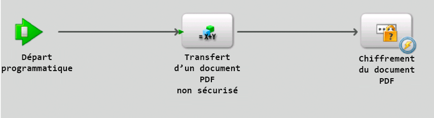
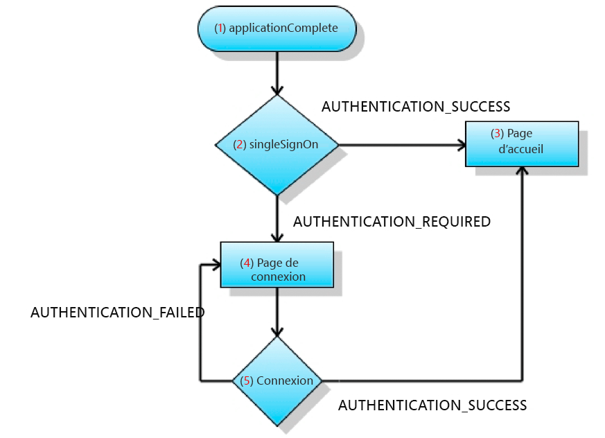

# Création d’applications de Flash Builder qui effectuent une authentification SSO à l’aide de jetons HTTP {#creating-flash-builder-applicationsthat-perform-sso-authentication-using-http-tokens}

**Les exemples et les exemples de ce document sont réservés à l’environnement AEM Forms on JEE.**

Vous pouvez créer une application cliente à l’aide d’un Flash Builder qui effectue l’authentification par authentification unique (SSO) à l’aide de jetons HTTP. Supposons, par exemple, que vous créiez une application web à l’aide de Flash Builder. Supposons ensuite que l’application contient des vues différentes, où chaque vue appelle une opération AEM Forms différente. Au lieu d’authentifier un utilisateur pour chaque opération Forms, vous pouvez créer une page de connexion qui permet à un utilisateur de s’authentifier une fois. Une fois authentifié, un utilisateur peut appeler plusieurs opérations sans avoir à s’authentifier à nouveau. Par exemple, si un utilisateur s’est connecté à Workspace (ou à une autre application Forms), il n’aura plus besoin de s’authentifier.

Bien que l’application cliente contienne la logique d’application requise pour effectuer l’authentification SSO, AEM User Management effectue l’authentification de l’utilisateur. Pour authentifier un utilisateur à l’aide de jetons HTTP, l’application cliente appelle l’opération `authenticateWithHTTPToken` du service Authentication Manager. User Management peut authentifier les utilisateurs à l’aide d’un jeton HTTP. Pour les appels de service Web ou de suppression suivants vers AEM Forms, il n’est pas nécessaire de transmettre des informations d’identification pour l’authentification.

>[!NOTE]
>
>Avant de lire cette section, il est recommandé de se familiariser avec l’appel d’AEM Forms à l’aide de Remoting. (Voir [Appel d’AEM Forms à l’aide d’AEM Forms Remoting](/help/forms/developing/invoking-aem-forms-using-remoting.md#invoking-aem-forms-using-remoting).)

Le processus de courte durée AEM Forms suivant, nommé `MyApplication/EncryptDocument`, est appelé après l’authentification d’un utilisateur à l’aide de la fonction SSO. (Pour plus d’informations sur ce processus, comme ses valeurs d’entrée et de sortie, voir [Exemple de processus de courte durée](/help/forms/developing/aem-forms-processes.md).)



>[!NOTE]
>
>Ce processus n’est pas basé sur un processus AEM Forms existant. Pour suivre les exemples de code qui expliquent comment appeler ce processus, créez un processus nommé `MyApplication/EncryptDocument` à l’aide de Workbench. (Voir [Utilisation de Workbench](https://www.adobe.com/go/learn_aemforms_workbench_63).)

L’application cliente créée à l’aide de Flash Builder interagit avec le servlet de sécurité d’User Manager configuré à `/um/login` et `/um/logout`. En d’autres termes, l’application cliente envoie une requête à l’URL `/um/login` au démarrage pour déterminer le statut de l’utilisateur. Ensuite, User Manager répond avec le statut de l’utilisateur. L’application client et le servlet de sécurité User Manager communiquent à l’aide du protocole HTTP.

**Format de requête**

Le servlet de sécurité requiert les variables d’entrée suivantes :

* `um_no_redirect` - Cette valeur doit être  `true`. Cette variable accompagne toutes les demandes effectuées au servlet de sécurité User Manager. Il permet également au servlet de sécurité de différencier la requête entrante provenant d’un client flex ou d’autres applications web.
* `j_username` - Cette valeur correspond à la valeur de l’identifiant de connexion de l’utilisateur indiquée dans le formulaire de connexion.
* `j_password` - Cette valeur est le mot de passe correspondant de l’utilisateur tel qu’il est fourni dans le formulaire de connexion.

La valeur `j_password` n’est requise que pour les demandes d’informations d’identification. Si la valeur du mot de passe n’est pas spécifiée, le servlet de sécurité vérifie si le compte que vous utilisez est déjà authentifié. Si tel est le cas, vous pouvez procéder comme suit : cependant, le servlet de sécurité ne vous authentifie plus.

>[!NOTE]
>
>Pour une gestion correcte de l’i18n, assurez-vous que ces valeurs sont au format POST.

**Format de réponse**

Le servlet de sécurité configuré à `/um/login` répond en utilisant le format `URLVariables` . Dans ce format, la sortie du type de contenu est text/plain. La sortie contient des paires nom-valeur séparées par une esperluette (&amp;). La réponse contient les variables suivantes :

* `authenticated` - La valeur est  `true` ou  `false`.
* `authstate` - Cette valeur peut contenir l’une des valeurs suivantes :

   * `CREDENTIAL_CHALLENGE` - Cet état indique que User Manager n’est pas en mesure de déterminer l’identité de l’utilisateur par aucun moyen. Pour que l’authentification se produise, le nom d’utilisateur et le mot de passe de l’utilisateur sont requis.
   * `SPNEGO_CHALLENGE`- Cet état est traité de la même manière que  `CREDENTIAL_CHALLENGE`.
   * `COMPLETE` - Cet état indique que User Manager peut authentifier l’utilisateur.
   * `FAILED` - Cet état indique que User Manager n’a pas pu authentifier l’utilisateur. En réponse à cet état, le client flex peut afficher un message d’erreur à l’utilisateur.
   * `LOGGED_OUT` - Cet état indique que l’utilisateur s’est déconnecté avec succès.

* `assertionid` - Si l’état était ,  `COMPLETE` il contient la  `assertionId` valeur de l’utilisateur. Une application cliente peut obtenir la valeur `AuthResult` pour l’utilisateur.

**Processus de connexion**

Lorsqu’une application cliente démarre, vous pouvez envoyer une requête de POST au servlet de sécurité `/um/login`. Par exemple, `https://<your_serverhost>:<your_port>/um/login?um_no_redirect=true`. Lorsque la requête atteint le servlet de sécurité User Manager, elle effectue les étapes suivantes :

1. Il recherche un cookie nommé `lcAuthToken`. Si l’utilisateur s’est déjà connecté à une autre application Forms, ce cookie est présent. Si le cookie est trouvé, son contenu est validé.
1. Si la fonction SSO basée sur l’en-tête est activée, le servlet recherche les en-têtes configurés pour déterminer l’identité de l’utilisateur.
1. Si SPNEGO est activé, le servlet tente de lancer SPNEGO et tente de déterminer l’identité de l’utilisateur.

Si le servlet de sécurité localise un jeton valide correspondant à un utilisateur, le servlet de sécurité vous permet de procéder et répond avec `authstate=COMPLETE`. Sinon, le servlet de sécurité répond avec `authstate=CREDENTIAL_CHALLENGE`. La liste suivante explique ces valeurs :

* `Case authstate=COMPLETE`: Indique que l’utilisateur est authentifié et que la  `assertionid` valeur contient l’identifiant d’assertion de l’utilisateur. À ce stade, l’application cliente peut se connecter à AEM Forms. Le servlet configuré pour cette URL peut obtenir le `AuthResult` de l’utilisateur en appelant la méthode `AuthenticationManager.authenticate(HttpRequestToken)`. L’instance `AuthResult` peut créer le contexte du gestionnaire d’utilisateurs et le stocker dans la session.
* `Case authstate=CREDENTIAL_CHALLENGE`: Indique que le servlet de sécurité requiert les informations d’identification de l’utilisateur. En réponse, l’application cliente peut afficher l’écran de connexion de l’utilisateur et envoyer les informations d’identification obtenues au servlet de sécurité (par exemple, `https://<your_serverhost>:<your_port>/um/login?um_no_redirect=true&j_username=administrator&j_password=password)`). Si l’authentification est réussie, le servlet de sécurité répond avec `authstate=COMPLETE`.

Si l’authentification échoue toujours, le servlet de sécurité répond avec `authstate=FAILED`. Pour répondre à cette valeur, l’application cliente peut afficher un message afin d’obtenir à nouveau les informations d’identification.

>[!NOTE]
>
>Bien que `authstate=CREDENTIAL_CHALLENGE`, il est recommandé au client d’envoyer les informations d’identification obtenues au servlet de sécurité dans un formulaire de POST.

**Processus de déconnexion**

Lorsqu’une application cliente se déconnecte, vous pouvez envoyer une requête à l’URL suivante :

`https://<your_serverhost>:<your_port>/um/logout?um_no_redirect=true`

Lors de la réception de cette demande, le servlet de sécurité User Manager supprime le cookie `lcAuthToken` et répond avec `authstate=LOGGED_OUT`. Une fois que l’application cliente a reçu cette valeur, elle peut effectuer des tâches de nettoyage.

## Création d’une application cliente qui authentifie AEM utilisateurs de formulaires à l’aide de l’authentification unique {#creating-a-client-application-that-authenticates-aem-forms-users-using-sso}

Pour démontrer comment créer une application cliente qui effectue l’authentification SSO, un exemple d’application cliente est créé. L’illustration suivante présente les étapes effectuées par l’application cliente pour authentifier un utilisateur à l’aide de la connexion unique.



L’illustration précédente décrit le flux d’application qui se produit au démarrage de l’application cliente.

1. L’application cliente déclenche l’événement `applicationComplete` .
1. L’appel à `ISSOManager.singleSignOn` est effectué. L’application client envoie une demande au servlet de sécurité User Manager.
1. Si le servlet de sécurité authentifie l’utilisateur, `ISSOManager` distribue `SSOEvent.AUTHENTICATION_SUCCESS`. En réponse, l’application cliente affiche la page principale. Dans cet exemple, la page principale appelle le processus de courte durée AEM Forms appelé MyApplication/EncryptDocument.
1. Si le servlet de sécurité ne peut pas déterminer si l’utilisateur est valide, l’application demande à nouveau les informations d’identification de l’utilisateur. La classe `ISSOManager` distribue l’événement `SSOEvent.AUTHENTICATION_REQUIRED`. L’application cliente affiche la page de connexion.
1. Les informations d’identification fournies dans la page de connexion sont envoyées à la méthode `ISSOManager.login` . Si l’authentification est réussie, elle mène à l’étape 3. Sinon, l’événement `SSOEvent.AUTHENTICATION_FAILED` est déclenché. L’application cliente affiche la page de connexion et un message d’erreur approprié.

### Création de l’application cliente {#creating-the-client-application}

L’application cliente se compose des fichiers suivants :

* `SSOStandalone.mxml`: Le fichier MXML principal qui représente l’application cliente. (Voir [Création du fichier SSOStandalone.mxml](creating-flash-builder-applications-perform.md#creating-the-ssostandalone-mxml-file).)
* `um/ISSOManager.as`: Exposez les opérations liées à l’authentification unique (SSO). (Voir [Création du fichier ISSOManager.as](creating-flash-builder-applications-perform.md#creating-the-issomanager-as-file).)
* `um/SSOEvent.as`: Le  `SSOEvent` est distribué pour les événements liés à l’authentification unique. (Voir [Création du fichier SSOEvent.as](creating-flash-builder-applications-perform.md#creating-the-ssoevent-as-file).)
* `um/SSOManager.as`: Gère les opérations liées à l’authentification unique et distribue les événements appropriés. (Voir [Création du fichier SSOManager.as](creating-flash-builder-applications-perform.md#creating-the-ssomanager-as-file).)
* `um/UserManager.as`: Contient la logique d’application qui appelle le service Authentication Manager à l’aide de son WSDL. (Voir [Création du fichier UserManager.as](creating-flash-builder-applications-perform.md#creating-the-usermanager-as-file).)
* `views/login.mxml`: Représente l’écran de connexion. (Voir [Création du fichier login.mxml](creating-flash-builder-applications-perform.md#creating-the-login-mxml-file).)
* `views/logout.mxml`: Représente l’écran de déconnexion. (Voir [Création du fichier logout.mxml](creating-flash-builder-applications-perform.md#creating-the-logout-mxml-file).)
* `views/progress.mxml`: Représente une vue de progression. (Voir [Création du fichier progress.mxml](creating-flash-builder-applications-perform.md#creating-the-progress-mxml-file).)
* `views/remoting.mxml`: Représente la vue qui appelle le processus de courte durée d’AEM Forms appelé MyApplication/EncryptDocument à l’aide de remoting. (Voir [Création du fichier remoting.mxml](creating-flash-builder-applications-perform.md#creating-the-remoting-mxml-file).)

L’illustration suivante fournit une représentation visuelle de l’application cliente.


>[!NOTE]
>
>Notez qu’il existe deux packages nommés um et views. Lors de la création de l’application cliente, veillez à placer les fichiers dans leurs packages appropriés. Veillez également à ajouter le fichier adobe-remoting-provider.swc au chemin de classe de votre projet. (Voir [Inclusion du fichier de bibliothèque Flex AEM Forms](/help/forms/developing/invoking-aem-forms-using-remoting.md#including-the-aem-forms-flex-library-file).)

### Création du fichier SSOStandalone.mxml {#creating-the-ssostandalone-mxml-file}

Le code suivant représente le fichier SSOStandalone.mxml.

```xml
 <?xml version="1.0" encoding="utf-8"?>
 <mx:Application
                 layout="absolute"
                 applicationComplete="initApp()"
                 height="400" width="550"
                 xmlns:v="views.*"
                 backgroundColor="#EDE8F0" viewSourceURL="srcview/index.html">
     <mx:Script>
         <![CDATA[
             import mx.utils.URLUtil;
             import um.SSOEvent;
             import mx.core.UIComponent;
             import um.SSOManager;
             import mx.rpc.events.ResultEvent;
             import mx.utils.ObjectUtil;
             import mx.controls.Alert;
 
             [Bindable]
             private var _serverURL:String;
 
             private var _ssoManager:SSOManager;
 
             private var _progress:UIComponent;
 
             private var _loginPage:UIComponent;
 
             private function initApp():void{
                 _serverURL = determineServerUrl();
                 _ssoManager = new SSOManager(_serverURL);
 
                 _ssoManager.addEventListener(SSOEvent.AUTHENTICATION_FAILED,loginHandler);
                 _ssoManager.addEventListener(SSOEvent.AUTHENTICATION_SUCCESS,loginHandler);
                 _ssoManager.addEventListener(SSOEvent.AUTHENTICATION_REQUIRED,loginHandler);
                 _ssoManager.addEventListener(SSOEvent.LOGOUT_COMPLETE,loginHandler);
                 _ssoManager.addEventListener(SSOEvent.AUTHENTICATION_FAULT,loginHandler);
 
                 trace("[Main] Add the required event handlers for authentication");
                 _ssoManager.singleSignOn();
 
                 showBusy();
             }
 
             private function determineServerUrl():String
             {
                 var s:String ;
                 var appUrl:String = Application.application.url;
                 var givenUrl:String  = ExternalInterface.call("serverUrl.toString");
                 trace("[Main] Application url ["+appUrl+"] Given url ["+givenUrl+"]");
                 if(appUrl != null && appUrl.search("^http") != -1){
                     s = appUrl;
                 }
                 if(s == null){
                     s = givenUrl;
                 }
                 if(s== null){
                     s = "https://hiro-xp:8080/";
                 }
                 s = URLUtil.getFullURL(s,"/");
                 trace("[Main] Would be using ["+s+"] as serverUrl");
                 return s;
             }
 
             private function loginHandler(event:SSOEvent):void
             {
                 trace("[Main] Handling event "+event.type);
                 switch(event.type)
                 {
                     case SSOEvent.AUTHENTICATION_FAILED:
                         viewContent.selectedChild = login;
                         login.showLoginFailed();
                         break;
                     case SSOEvent.AUTHENTICATION_SUCCESS:
                         viewContent.selectedChild = remoting;
                         break;
                     case SSOEvent.AUTHENTICATION_REQUIRED:
                         viewContent.selectedChild = login;
                         break;
                     case SSOEvent.LOGOUT_COMPLETE:
                         viewContent.selectedChild = logout;
                         break;
                     case SSOEvent.AUTHENTICATION_FAULT:
                         Alert.show("Error doing authentication. Root error ["+event.rootEvent+"]","Authentication Fault",Alert.OK);
                 }
             }
 
             public function get ssoManager():SSOManager
             {
                 return _ssoManager;
             }
 
             public function showBusy():void
             {
                 viewContent.selectedChild = progress;
             }
 
             public function get serverUrl():String
             {
                 return _serverURL;
             }
 
         ]]>
     </mx:Script>
     <mx:ViewStack x="0" y="0" id="viewContent" >
         <v:login id="login" />
         <v:remoting id="remoting"  />
         <v:progress id="progress" />
         <v:logout id="logout"/>
     </mx:ViewStack>
 </mx:Application>
 
```

### Création du fichier ISSOManager.as {#creating-the-issomanager-as-file}

Le code suivant représente le fichier ISSOManager.as .

```java
 package um
 {
     import flash.events.IEventDispatcher;
 
     /**
      * The <code>ISSOManager</code> expose operations related to Single Sign On (SSO) in AEM Forms
      * environment. The application should register appropriate <code>SSOEvent</code> handlers prior
      * to calling any of the following operations
      */
     public interface ISSOManager extends IEventDispatcher
     {
         /**
          * Tries to validate whether the user has an already existing session or not (SSO Scenarios). The application
          * may call this method during the initialization. In general this call would lead to one of the
          * following events getting dispatched
          * <ul>
          * <li>SSOEvent.AUTHENTICATION_SUCCESS - If a SSO session was found and valid
          * <li>SSOEvent.AUTHENTICATION_REQUIRED - No SSO session was found and as such authentication is required in
          * the form of username and password.
          * <li>SSOEvent.AUTHENTICATION_FAULT - Some error has occured while connecting to the server
          * </ul>
          */
         function singleSignOn():void;
 
         /**
          * Authenticates the user using username and password. It may lead to one of the following events
          * <ul>
          * <li>SSOEvent.AUTHENTICATION_SUCCESS - The authentication is successful and a session is established
          * <li>SSOEvent.AUTHENTICATION_FAILED - Authentication has failed
          * </ul>
          */
         function login(username:String, password:String):void;
 
         /**
          * Terminates the current session and logs out the user.
          */
         function logout():void;
 
         /**
          * Get the assertionId for the logged in user
          */
         function get assertionId():String;
     }
 }
```

### Création du fichier SSOEvent.as {#creating-the-ssoevent-as-file}

Le code suivant représente le fichier SSOEvent.as .

```java
 package um
 {
     import flash.events.Event;
 
     /**
      * The <code>SSOEvent</code> is dispatched for SSO related events
      */
     public class SSOEvent extends Event
     {
         /**
          * This type of event would be dispatched when the Authentication process is successful. Authentication
          * might have been done with SSO or username and password. As a response to this event the application
          * can show the welcome page to the user
          * The application may want to perform specific check for permission/role so as to verify the user is allowed.
          * So as a response to this event the application would do those checks and then only show the welcome page
          */
         public static const AUTHENTICATION_SUCCESS:String = "authenticationSuccess";
 
         /**
          * This type of event would be dispatched when authentication fails using the username, password.
          * As a response to this type of event an application can show an error message to the user.
          * This event would only happen when authentication is done using username and password and NOT in
          * SSO case.
          */
         public static const AUTHENTICATION_FAILED:String = "authenticationFailed";
 
         /**
          * This type of event would be dispatched when authentication using SSO is not achieved. And due to
          * that we require the user's username and password for authentication. As a response to this event
          * the application can show the login page to the user.
          */
         public static const AUTHENTICATION_REQUIRED:String = "authenticationRequired";
 
         /**
          * This type of event would be dispatched when logout is complete. As a response to this event the
          * application may show a logout page informing the user that he has been logged out. Or the application
          * can take the user back to login page
          */
         public static const LOGOUT_COMPLETE:String = "logoutComplete";
 
         /**
          * This type of event would be dispatched when ever there is a problem in doing Authentication. The root cause
          * can be obtained from the <code>rootEvent</code>.
          */
         public static const AUTHENTICATION_FAULT:String = "authenticationFault";
 
         private var _rootEvent:Event;
 
         public function SSOEvent(type:String, rootEvent:Event=null)
         {
             super(type,true,false);
             _rootEvent = rootEvent;
         }
 
         /**
          * The root event. If current event type is <code>AUTHENTICATION_FAULT</code> then it would be an
          * <code>IOErrorEvent</code> in other cases it would be complete event. Its basic use is to extract the root
          * cause in case of an authentication fault.
          */
         public function get rootEvent():Event
         {
             return _rootEvent;
         }
     }
 }
```

### Création du fichier SSOManager.as {#creating-the-ssomanager-as-file}

Le code suivant représente le fichier SSOManager.as .

```java
 package um
 {
     import flash.events.Event;
     import flash.events.EventDispatcher;
     import flash.events.IOErrorEvent;
     import flash.external.ExternalInterface;
     import flash.net.URLLoader;
     import flash.net.URLLoaderDataFormat;
     import flash.net.URLRequest;
     import flash.net.URLVariables;
 
     import mx.utils.ObjectUtil;
 
     /**
      * Manages the SSO related operations and dispatches appropriate events. It would connect to the UM Filter/Servlet
      * at <code>um/login</code> The UM response would be of form of url encoded variables. It would look for
      * <code>authstate</code> value in the response and depending on that it would proceed.
      *
      * <p>If there is an IO_Error while initial attempt to UM then it would assume it as a 401 response. And it would
      * be assumed that SPNEGO based authenticatin is not working and therefore user would be shown a login page.
      */
     public class SSOManager extends EventDispatcher implements ISSOManager
     {
         private static const SSO_URL:String = "um/login";
         private static const SSO_LOGOUT_URL:String = "um/logout";
         private static const AUTH_COOKIE_NAME:String = "lcAuthToken";
 
         private var _serverUrl:String;
         private var _assertionId:String;
 
         /**
          * Constructs an SSOManager with the given server url.
          *
          * @param serverUrl - The uri of the server to connect to. it must be without any context path e.g
          * http://localhost:8080/. The SSOManager would directly append the path of UM exposed SSO url to it
          * for its operations
          */
         public function SSOManager(serverUrl:String)
         {
             _serverUrl = serverUrl;
         }
 
         public function singleSignOn():void
         {
             sendRequest(SSO_URL,true);
         }
 
         public function login(username:String, password:String):void
         {
             sendRequest(SSO_URL,false,
                 function(request:URLRequest,vars:URLVariables):void
                 {
                     vars.j_username = username;
                     vars.j_password = password;
                 }
             );
         }
 
         public function logout():void
         {
             sendRequest(SSO_LOGOUT_URL);
         }
 
         public function get assertionId():String
         {
             return _assertionId;
         }
 
 
 
         /**
          * Connects to the UM security service.
          */
         private function sendRequest(relativeUrl:String,authenticationRequest:Boolean=false, requestProcessor:Function=null):void
         {
             var loader:URLLoader = new URLLoader();
             loader.dataFormat = URLLoaderDataFormat.VARIABLES;
             var request:URLRequest = new URLRequest(_serverUrl + relativeUrl);
             trace("[SSOmanager] Contacting ["+request.url+"]");
             var vars:URLVariables = new URLVariables();
             vars.um_no_redirect = "true";
             request.data = vars;
             if(requestProcessor != null){
                 requestProcessor(request,vars);
             }
 
             loader.addEventListener(Event.COMPLETE,authHandler);
             //if its an authentication request then only treat io error as a possible 401
             //for others treat them as faults
             if(authenticationRequest){
                 loader.addEventListener(IOErrorEvent.IO_ERROR,httpAuthenticationHandler);
             }else{
                 loader.addEventListener(IOErrorEvent.IO_ERROR,authFaultHandler);
             }
             trace("[SSOmanager] Sending request "+ ObjectUtil.toString(request));
             loader.load(request);
         }
 
         private function authHandler(event:Event):void
         {
             var loader:URLLoader = URLLoader(event.target);
             var response:URLVariables = URLVariables(loader.data);
             trace("[SSOmanager] Processing response ["+ObjectUtil.toString(response)+"]");
             handleAuthResult(response["authstate"],response);
         }
 
         /**
          * Handles the IOErrorEvent. Flash would dispatch IOEvent in response to HTTP 401.
          * There is no way to distinguish it from the genuine IOError.
          */
         private function httpAuthenticationHandler(event:IOErrorEvent):void
         {
             trace("[SSOmanager] Processing IOErrorEvent ["+ObjectUtil.toString(event)+"]");
             handleAuthResult("CREDENTIAL_CHALLENGE");
 
         }
 
         /**
          * Dispatches appropriate <code>SSOEvent</code> on the basis of the <code>authstate</code>
          * value of the response.
          * The response is url encoded in for of
          * <pre>
          * authenticated=false&authstate=SPNEGO_CHALLENGE
          * </pre>
          * Depending on <code>authstate</code> the SSOEvent is dispatched
          */
         private function handleAuthResult(authState:String,response:URLVariables = null):void
         {
             trace("[SSOmanager] processing state "+authState);
             switch(authState)
             {
                 case "FAILED"  :
                     dispatchEvent(new SSOEvent(SSOEvent.AUTHENTICATION_FAILED));
                     break;
                 case "COMPLETE" :
                     _assertionId = response ? response["assertionid"] : null;
                     dispatchEvent(new SSOEvent(SSOEvent.AUTHENTICATION_SUCCESS));
                     break;
                 case "CREDENTIAL_CHALLENGE" :
                     dispatchEvent(new SSOEvent(SSOEvent.AUTHENTICATION_REQUIRED));
                     break;
                 case "LOGGED_OUT" :
                     dispatchEvent(new SSOEvent(SSOEvent.LOGOUT_COMPLETE));
                     break;
                 default:
                     dispatchEvent(new SSOEvent(SSOEvent.AUTHENTICATION_REQUIRED));
                     break;
             }
         }
 
         private function authFaultHandler(event:Event):void
         {
             dispatchEvent(new SSOEvent(SSOEvent.AUTHENTICATION_FAULT,event));
         }
 
     }
 }
```

### Création du fichier UserManager.as {#creating-the-usermanager-as-file}

Le code suivant représente le fichier UserManager.as.

```java
 package um
 {
     import flash.events.Event;
     import mx.rpc.soap.WebService;
     import mx.rpc.soap.Operation;
     import mx.rpc.IResponder;
     import mx.rpc.events.FaultEvent;
     import mx.rpc.events.ResultEvent;
     import mx.rpc.soap.LoadEvent;
 
     public class UserManager
     {
         private var _ssoManager:ISSOManager;
         private var _serverUrl:String;
 
         public function UserManager(ssoManager:ISSOManager,serverUrl:String)
         {
             _serverUrl = serverUrl;
             _ssoManager = ssoManager;
         }
 
         public function retrieveAssertion(responder:IResponder):String
         {
             var assertionId:String = _ssoManager.assertionId;
             if(!assertionId)
             {
                 trace("[UserManager] AssertionId not found");
                 return null;
             }
 
             var ws:WebService = new WebService();
             var wsdl:String = _serverUrl+'soap/services/AuthenticationManagerService?wsdl&lc_version=8.2.1';
             ws.loadWSDL(wsdl);
             ws.addEventListener(LoadEvent.LOAD,
                 function(event:Event):void
                 {
                     trace("[UserManager] WSDL loaded");
                     var authenticate:Operation = ws.authenticateWithHttpToken as Operation;
                     authenticate.resultFormat = "e4x";
                     authenticate.addEventListener(ResultEvent.RESULT,
                         function(event:Event):void
                         {
                             responder.result(event);
                         }
                     );
                     authenticate.send({assertionId:assertionId});
                 }
             );
 
             ws.addEventListener(FaultEvent.FAULT,
                 function(event:Event):void
                 {
                     responder.fault(event);
                 }
             );
             return null;
         }
     }
 }
```

### Création du fichier login.mxml {#creating-the-login-mxml-file}

Le code suivant représente le fichier login.mxml.

```xml
 <?xml version="1.0" encoding="utf-8"?>
 <mx:Canvas  width="500" height="400">
     <mx:Script>
         <![CDATA[
             import mx.core.Application;
             public function showLoginFailed():void
             {
                 loginMessage.text = "Username or Password incorrect";
             }
 
             private function doLogin():void
             {
                 Application.application.ssoManager.login(j_username.text,j_password.text);
                 Application.application.showBusy();
             }
 
         ]]>
     </mx:Script>
 
     <mx:VBox height="113" width="244" x="128" y="144" horizontalAlign="center" verticalGap="10">
         <mx:HBox width="100%">
             <mx:HBox width="100%" verticalAlign="middle" horizontalAlign="center" height="32">
                 <mx:Label text="Username" fontWeight="bold"/>
                 <mx:TextInput id="j_username"/>
             </mx:HBox>
         </mx:HBox>
         <mx:HBox width="100%" height="33" horizontalAlign="center" horizontalGap="10" verticalAlign="middle">
             <mx:Label text="Password" fontWeight="bold"/>
             <mx:TextInput displayAsPassword="true" id="j_password"/>
         </mx:HBox>
         <mx:Button label="Login" click="doLogin()"/>
     </mx:VBox>
     <mx:Text x="128" y="122" id="loginMessage" width="230" height="14"/>
     <mx:Label x="154" y="65" text="AEM Forms SSO Demo" fontFamily="Georgia" fontSize="20" color="#0A0A0A"/>
 </mx:Canvas>
 
```

### Création du fichier logout.mxml {#creating-the-logout-mxml-file}

Le code suivant représente le fichier logout.mxml.

```xml
 <?xml version="1.0" encoding="utf-8"?>
 <mx:Canvas  width="500" height="400">
     <mx:Label x="97" y="188" text="You have successfully logged out from the application"/>
 
 </mx:Canvas>
 
```

### Création du fichier progress.mxml {#creating-the-progress-mxml-file}

Le code suivant représente le fichier progress.mxml.

```xml
 <?xml version="1.0" encoding="utf-8"?>
 <mx:Canvas >
     <mx:Label x="151" y="141" text="Wait...."/>
     <mx:SWFLoader source="LoadingCircle.swf" width="50" height="50" horizontalCenter="0" verticalCenter="0"/>
 </mx:Canvas>
```

### Création du fichier remoting.mxml {#creating-the-remoting-mxml-file}

Le code suivant représente le fichier remoting.mxml qui appelle le processus `MyApplication/EncryptDocument`. Un document étant transmis au processus, la logique d’application chargée de transmettre un document sécurisé à AEM Forms se trouve dans ce fichier. (Voir [Transmission de documents sécurisés pour appeler des processus à l’aide de Remoting](/help/forms/developing/invoking-aem-forms-using-remoting.md#passing-secure-documents-to-invoke-processes-using-remoting).)

```xml
 <?xml version="1.0" encoding="utf-8"?>
 <mx:Canvas  width="664" height="400" creationComplete="initializeChannelSet()" xmlns:views="views.*">
     <mx:Script>
 
         <![CDATA[
 
             import mx.rpc.livecycle.DocumentReference;
             import flash.net.FileReference;
             import flash.net.URLRequest;
             import flash.events.Event;
             import flash.events.DataEvent;
             import mx.messaging.ChannelSet;
             import mx.messaging.channels.AMFChannel;
             import mx.rpc.events.ResultEvent;
             import mx.collections.ArrayCollection;
             import mx.rpc.AsyncToken;
             import um.UserManager;
             import mx.rpc.events.ResultEvent;
             import mx.rpc.events.FaultEvent;
             import mx.core.Application;
             import mx.rpc.Responder;
             import mx.utils.ObjectUtil;
 
             // Classes used in file retrieval
             private var fileRef:FileReference = new FileReference();
             private var docRef:DocumentReference = new DocumentReference();
             private var parentResourcePath:String = "/";
             //private var serverPort:String = "'[server]:[port]'";
             private var serverPort:String = "'[server]:[port]'";
             private var now1:Date;
             private var userManager:UserManager;
 
             // Define a ChannelSet object.
             public var cs:ChannelSet;
 
             // Holds information returned from AEM Forms
             [Bindable]
             public var progressList:ArrayCollection = new ArrayCollection();
 
 
             // Set up channel set to invoke AEM Forms.
             // This must be done before calling any service or process, but only
             // once for the entire application.
             private function initializeChannelSet():void {
                 cs = new ChannelSet();
                 cs.addChannel(new AMFChannel("remoting-amf", "https://" + serverPort + "/remoting/messagebroker/amf"));
                 EncryptDocument.channelSet = cs;
 
             //Get the user that is authenticated
             userManager = new UserManager(Application.application.ssoManager,Application.application.serverUrl);
             userManager.retrieveAssertion(
                     new mx.rpc.Responder(
                         function(event:ResultEvent):void
                         {
                             var name:String = XML(event.currentTarget.lastResult)..*::authenticatedUser.*::userid.text();
                             username.text = "Welcome "+name;
                         },
                         function(event:FaultEvent):void
                         {
                             mx.controls.Alert.show(event.fault.faultString,'Error')
                         }
                     )
                 );
 
             }
 
             // Call this method to upload the file.
             // This creates a file picker and lets the user select a PDF file to pass to the EncryptDocument process.
             private function uploadFile():void {
                 fileRef.addEventListener(Event.SELECT, selectHandler);
                 fileRef.addEventListener(DataEvent.UPLOAD_COMPLETE_DATA,completeHandler);
                 fileRef.browse();
             }
 
             // Gets called for selected file. Does the actual upload via the file upload servlet.
             private function selectHandler(event:Event):void {
                 var authTokenService:RemoteObject = new RemoteObject("LC.FileUploadAuthenticator");
                 authTokenService.addEventListener("result", authTokenReceived);
                 authTokenService.channelSet = cs;
                 authTokenService.getFileUploadToken();
             }
 
             private function authTokenReceived(event:ResultEvent):void
             {
                 var token:String = event.result as String;
                 var request:URLRequest = DocumentReference.constructRequestForUpload("https://hiro-xp:8080", token);
 
                 try
                 {
                     fileRef.upload(request);
                 }
                 catch (error:Error)
                 {
                     trace("Unable to upload file.");
                 }
             }
 
             // Called once the file is completely uploaded.
             private function completeHandler(event:DataEvent):void {
 
                 // Set the docRefs url and referenceType parameters
                 docRef.url = event.data as String;
                 docRef.referenceType=DocumentReference.REF_TYPE_URL;
                 executeInvokeProcess();
             }
 
             //This method invokes the EncryptDocument process
             public function executeInvokeProcess():void {
                 //Create an Object to store the input value for the EncryptDocument process
                 now1 = new Date();
 
                 var params:Object = new Object();
                 params["inDoc"]=docRef;
 
                 // Invoke the EncryptDocument process
                 var token:AsyncToken;
                 token = EncryptDocument.invoke(params);
                 token.name = name;
             }
 
 
             // This method handles a successful conversion invocation
             public function handleResult(event:ResultEvent):void
             {
 
                 //Retrieve information returned from the service invocation
                 var token:AsyncToken = event.token;
                 var res:Object = event.result;
                 var dr:DocumentReference = res["outDoc"] as DocumentReference;
                 var now2:Date = new Date();
 
                 // These fields map to columns in the DataGrid
                 var progObject:Object = new Object();
                 progObject.filename = token.name;
                 progObject.timing = (now2.time - now1.time).toString();
                 progObject.state = "Success";
                 progObject.link = "<a href='" + dr.url + "'> open </a>";
                 progressList.addItem(progObject);
             }
 
 
             private function resultHandler(event:ResultEvent):void {
             // Do anything else here.
 
             }
 
             private function logout():void
             {
                 Application.application.ssoManager.logout();
                 Application.application.showBusy();
             }
 
 
         ]]>
 
     </mx:Script>
 
     <mx:RemoteObject id="EncryptDocument" destination="MyApplication/EncryptDocument" result="resultHandler(event);">
             <mx:method name="invoke" result="handleResult(event)"/>
     </mx:RemoteObject>
 
 
     <!--//This consists of what is displayed on the webpage-->
     <mx:Panel id="lcPanel" title="EncryptDocument  (Deprecated for AEM forms) AEM Forms Remoting Example"
           height="25%" width="25%" paddingTop="10" paddingLeft="10" paddingRight="10"
           paddingBottom="10">
         <mx:Label width="100%" color="blue"
                   id="username"/>
 
         <mx:DataGrid x="10" y="0" width="500" id="idProgress" editable="false"
                          dataProvider="{progressList}" height="231" selectable="false" >
         <mx:columns>
                 <mx:DataGridColumn headerText="Filename" width="200" dataField="filename" editable="false"/>
                 <mx:DataGridColumn headerText="State" width="75" dataField="state" editable="false"/>
                 <mx:DataGridColumn headerText="Timing" width="75" dataField="timing" editable="false"/>
                 <mx:DataGridColumn headerText="Click to Open" dataField="link" editable="false" >
                 <mx:itemRenderer>
 
                         <mx:Component>
                         <mx:Text x="0" y="0" width="100%" htmlText="{data.link}"/>
                         </mx:Component>
                     </mx:itemRenderer>
             </mx:DataGridColumn>
         </mx:columns>
     </mx:DataGrid>
     <mx:Button label="Select File" click="uploadFile()" />
     <mx:Button label="Logout"  click="logout()" />
     </mx:Panel>
 </mx:Canvas>
 
 
```

### Informations supplémentaires {#additional-information}

Les sections suivantes apportent des détails supplémentaires sur la communication entre l’application cliente et le servlet de sécurité User Manager.

### Une nouvelle authentification a lieu {#a-new-authentication-occurs}

Dans ce cas, l’utilisateur tente pour la première fois de se connecter à AEM Forms à partir d’une application cliente. (il n’existe aucune session précédente impliquant l’utilisateur.) Dans l’événement `applicationComplete` , la méthode `SSOManager.singleSignOn` est appelée pour envoyer une requête au gestionnaire des utilisateurs.

`GET /um/login?um%5Fno%5Fredirect=true HTTP/1.1`

Le servlet de sécurité User Manager répond avec la valeur suivante :

`HTTP/1.1 200 OK`

`authenticated=false&authstate=CREDENTIAL_CHALLENGE`

En réponse à cette valeur, une valeur `SSOEvent.AUTHENTICATION_REQUIRED` est distribuée. Par conséquent, l’application cliente affiche un écran de connexion pour l’utilisateur. Les informations d’identification sont renvoyées au servlet de sécurité User Manager.

`GET /um/login?um%5Fno%5Fredirect=true&j%5Fusername=administrator&j%5Fpassword=password HTTP/1.1`

Le servlet de sécurité User Manager répond avec la valeur suivante :

```verilog
 HTTP/1.1 200 OK
 Set-Cookie: lcAuthToken=53630BC8-F6D4-F588-5D5B-4668EFB2EC7A; Path=/
 authenticated=true&authstate=COMPLETE&assertionid=53630BC8-F6D4-F588-5D5B-4668EFB2EC7A
```

Par conséquent, `authstate=COMPLETE the SSOEvent.AUTHENTICATION_SUCCESS` est distribué. L’application cliente peut effectuer d’autres traitements si nécessaire. Par exemple, un journal qui suit la date et l’heure d’authentification de l’utilisateur peut être créé.

### L’utilisateur est déjà authentifié {#the-user-is-already-authenticated}

Dans ce cas, l’utilisateur s’est déjà connecté à AEM Forms, puis accède à l’application cliente. L’application cliente se connecte au servlet de sécurité User Manager au démarrage.

```verilog
 GET /um/login?um%5Fno%5Fredirect=true HTTP/1.1
 Cookie: JSESSIONID=A4E0BCC2DD4BCCD3167C45FA350BD72A; lcAuthToken=53630BC8-F6D4-F588-5D5B-4668EFB2EC7A
```

Comme l’utilisateur est déjà authentifié, le cookie User Manager est présent et est envoyé au servlet de sécurité User Manager. Le servlet récupère ensuite la valeur `assertionId` et vérifie qu’elle est valide. S’il est valide, `authstate=COMPLETE` est renvoyé. Sinon, `authstate=CREDENTIAL_CHALLENGE` est renvoyé. Voici une réponse type :

```verilog
 HTTP/1.1 200 OK
        authenticated=true&authstate=COMPLETE&assertionid=53630BC8-F6D4-F588-5D5B-4668EFB2EC7A
```

Dans ce cas, l’utilisateur ne voit pas d’écran de connexion et est directement dirigé vers un écran de bienvenue.
