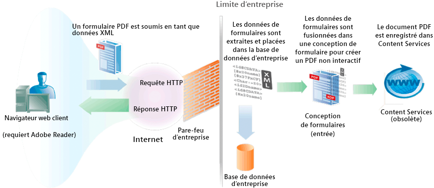

# Création de documents PDF avec des données XML envoyées {#creating-pdf-documents-with-submittedxml-data}

**Les exemples et les exemples de ce document sont réservés à l’environnement AEM Forms on JEE.**

## Création de documents PDF avec des données XML envoyées {#creating-pdf-documents-with-submitted-xml-data}

Les applications Web qui permettent aux utilisateurs de remplir des formulaires interactifs requièrent que les données soient renvoyées au serveur. Le service Forms vous permet de récupérer les données de formulaire saisies par l’utilisateur dans un formulaire interactif. Vous pouvez ensuite transmettre les données de formulaire à une autre opération de service AEM Forms et créer un document PDF à l’aide des données.

>[!NOTE]
>
>Avant de lire ce contenu, il est recommandé de bien comprendre la gestion des formulaires envoyés. Les concepts tels que la relation entre une conception de formulaire et les données XML envoyées sont abordés dans la section Gestion des Forms envoyées.

Tenez compte du workflow suivant qui implique trois services AEM Forms :

* Un utilisateur envoie des données XML au service Forms à partir d’une application Web.
* Le service Forms est utilisé pour traiter le formulaire envoyé et extraire les champs de formulaire. Les données de formulaire peuvent être traitées. Par exemple, les données peuvent être envoyées à une base de données d’entreprise.
* Les données de formulaire sont envoyées au service Output pour créer un document PDF non interactif.
* Le document PDF non interactif est stocké dans Content Services (obsolète).

Le diagramme suivant fournit une représentation visuelle de ce workflow.

Une fois que l’utilisateur a envoyé le formulaire à partir du navigateur Web client, le document PDF non interactif est stocké dans Content Services (obsolète). L’illustration suivante présente un document PDF stocké dans Content Services (obsolète).

### Résumé des étapes {#summary-of-steps}

Pour créer un document PDF non interactif avec les données XML envoyées et le stocker dans le document PDF dans Content Services (obsolète), effectuez les tâches suivantes :

1. Inclure les fichiers de projet.
1. Créez des objets Forms, Output et Document Management.
1. Récupérez les données de formulaire à l’aide du service Forms.
1. Créez un document PDF non interactif à l’aide du service Output.
1. Stockez le formulaire PDF dans Content Services (obsolète) à l’aide du service Document Management.

**Inclure les fichiers de projet**

Incluez les fichiers nécessaires dans votre projet de développement. Si vous créez une application cliente à l’aide de Java, incluez les fichiers JAR nécessaires. Si vous utilisez des services Web, veillez à inclure les fichiers proxy.

**Création d’objets Forms, Output et Document Management**

Avant d’effectuer par programmation une opération d’API de service Forms, créez un objet API client Forms. De même, comme ce workflow appelle les services Output et Document Management, créez un objet API Output Client et un objet API Document Management Client .

**Récupération des données de formulaire à l’aide du service Forms**

Récupérez les données de formulaire qui ont été envoyées au service Forms. Vous pouvez traiter les données envoyées pour répondre aux besoins de votre entreprise. Par exemple, vous pouvez stocker des données de formulaire dans une base de données d’entreprise. Toutefois, pour créer un document PDF non interactif, les données de formulaire sont transmises au service Output.

**Créez un document PDF non interactif à l’aide du service Output.**

Utilisez le service Output pour créer un document PDF non interactif basé sur une conception de formulaire et des données de formulaire XML. Dans le workflow, les données de formulaire sont récupérées à partir du service Forms.

**Stockage du formulaire PDF dans Content Services (obsolète) à l’aide du service Document Management**

Utilisez l’API du service Document Management pour stocker un document PDF dans Content Services (obsolète).

**Voir également**

[Inclusion des fichiers de bibliothèque Java d’AEM Forms](/help/forms/developing/invoking-aem-forms-using-java.md#including-aem-forms-java-library-files)

[Réglage des propriétés de la connexion](/help/forms/developing/invoking-aem-forms-using-java.md#setting-connection-properties)

[Démarrages rapides de l’API Forms Service](/help/forms/developing/forms-service-api-quick-starts.md#forms-service-api-quick-starts)

### Créez un document PDF avec les données XML envoyées à l’aide de l’API Java {#create-a-pdf-document-with-submitted-xml-data-using-the-java-api}

Créez un document PDF avec les données XML envoyées à l’aide de l’API Forms, Output et Document Management (Java) :

1. Inclure les fichiers de projet

   Incluez les fichiers JAR client, tels que adobe-forms-client.jar, adobe-output-client.jar et adobe-contentservices-client.jar dans le chemin de classe de votre projet Java.

1. Création d’objets Forms, Output et Document Management

   * Créez un objet `ServiceClientFactory` qui contient des propriétés de connexion.
   * Créez un objet `FormsServiceClient` en utilisant son constructeur et en transmettant l’objet `ServiceClientFactory`. 
   * Créez un objet `OutputClient` en utilisant son constructeur et en transmettant l’objet `ServiceClientFactory`.
   * Créez un objet `DocumentManagementServiceClientImpl` en utilisant son constructeur et en transmettant l’objet `ServiceClientFactory`. 

1. Récupération des données de formulaire à l’aide du service Forms

   * Appelez la méthode `processFormSubmission` de l’objet `FormsServiceClient` et transmettez les valeurs suivantes :

      * Objet `com.adobe.idp.Document` contenant les données de formulaire.
      * Une valeur string qui spécifie les variables d’environnement, y compris tous les en-têtes HTTP pertinents. Indiquez le type de contenu à gérer en spécifiant une ou plusieurs valeurs pour la variable d&#39;environnement `CONTENT_TYPE`. Par exemple, pour gérer les données XML, spécifiez la valeur de chaîne suivante pour ce paramètre : `CONTENT_TYPE=text/xml`.
      * Une valeur string qui spécifie la valeur d’en-tête `HTTP_USER_AGENT`, telle que `Mozilla/4.0 (compatible; MSIE 6.0; Windows NT 5.1; SV1; .NET CLR 1.1.4322)`.
      * Objet `RenderOptionsSpec` qui stocke les options d’exécution.

      La méthode `processFormSubmission` renvoie un objet `FormsResult` contenant les résultats de l’envoi du formulaire.

   * Déterminez si le service Forms a terminé le traitement des données de formulaire en appelant la méthode `getAction` de l’objet `FormsResult`. Si cette méthode renvoie la valeur `0`, les données sont prêtes à être traitées.
   * Récupérez les données de formulaire en créant un objet `com.adobe.idp.Document` en appelant la méthode `getOutputContent` de l’objet `FormsResult`. (Cet objet contient des données de formulaire qui peuvent être envoyées au service Output.)
   * Créez un objet `java.io.InputStream` en appelant le constructeur `java.io.DataInputStream` et en transmettant l’objet `com.adobe.idp.Document`.
   * Créez un objet `org.w3c.dom.DocumentBuilderFactory` en appelant la méthode `newInstance` statique de l’objet `org.w3c.dom.DocumentBuilderFactory`.
   * Créez un objet `org.w3c.dom.DocumentBuilder` en appelant la méthode `newDocumentBuilder` de l’objet `org.w3c.dom.DocumentBuilderFactory`.
   * Créez un objet `org.w3c.dom.Document` en appelant la méthode `parse` de l’objet `org.w3c.dom.DocumentBuilder` et en transmettant l’objet `java.io.InputStream`.
   * Récupérez la valeur de chaque noeud dans le document XML. Pour accomplir cette tâche, vous pouvez créer une méthode personnalisée qui accepte deux paramètres : l’objet `org.w3c.dom.Document` et le nom du noeud dont vous souhaitez récupérer la valeur. Cette méthode renvoie une valeur string représentant la valeur du noeud. Dans l’exemple de code qui suit ce processus, cette méthode personnalisée est appelée `getNodeText`. Le corps de cette méthode s’affiche.

1. Créez un document PDF non interactif à l’aide du service Output.

   Créez un document PDF en appelant la méthode `OutputClient` de l’objet `generatePDFOutput` et en transmettant les valeurs suivantes :

   * Valeur `TransformationFormat` d’énumération. Pour générer un document PDF, spécifiez `TransformationFormat.PDF`.
   * Valeur string spécifiant le nom de la nouvelle conception de formulaire. Assurez-vous que la conception de formulaire est compatible avec les données de formulaire extraites du service Forms.
   * Une valeur string qui spécifie la racine de contenu où se trouve la conception de formulaire.
   * Objet `PDFOutputOptionsSpec` contenant les options d’exécution PDF.
   * Objet `RenderOptionsSpec` contenant les options d’exécution de rendu.
   * Objet `com.adobe.idp.Document` contenant la source de données XML contenant les données à fusionner avec la conception de formulaire. Assurez-vous que cet objet a été renvoyé par la méthode `getOutputContent` de l’objet `FormsResult`.
   * La méthode `generatePDFOutput` renvoie un objet `OutputResult` contenant les résultats de l’opération.
   * Récupérez le document PDF non interactif en appelant la méthode `OutputResult` de l’objet `getGeneratedDoc`. Cette méthode renvoie une instance `com.adobe.idp.Document` qui représente le document PDF non interactif.

1. Stockage du formulaire PDF dans Content Services (obsolète) à l’aide du service Document Management

   Ajoutez le contenu en appelant la méthode `storeContent` de l’objet `DocumentManagementServiceClientImpl` et en transmettant les valeurs suivantes :

   * Une valeur string qui spécifie le magasin où le contenu est ajouté. Le magasin par défaut est `SpacesStore`. Cette valeur est un paramètre obligatoire.
   * Une valeur string qui spécifie le chemin d’accès complet de l’espace où le contenu est ajouté (par exemple, `/Company Home/Test Directory`). Cette valeur est un paramètre obligatoire.
   * Nom du noeud qui représente le nouveau contenu (par exemple, `MortgageForm.pdf`). Cette valeur est un paramètre obligatoire.
   * Une valeur string qui spécifie le type de noeud. Pour ajouter un nouveau contenu, tel qu’un fichier PDF, spécifiez `{https://www.alfresco.org/model/content/1.0}content`. Cette valeur est un paramètre obligatoire.
   * Objet `com.adobe.idp.Document` représentant le contenu. Cette valeur est un paramètre obligatoire.
   * Une valeur string qui spécifie la valeur de codage (par exemple, `UTF-8`). Cette valeur est un paramètre obligatoire.
   * Une valeur d’énumération `UpdateVersionType` qui spécifie comment gérer les informations de version (par exemple, `UpdateVersionType.INCREMENT_MAJOR_VERSION` pour incrémenter la version du contenu. ) Cette valeur est un paramètre obligatoire.
   * Une instance `java.util.List` qui spécifie les aspects liés au contenu. Cette valeur est un paramètre facultatif et vous pouvez spécifier `null`.
   * Objet `java.util.Map` qui stocke les attributs de contenu.

   La méthode `storeContent` renvoie un objet `CRCResult` qui décrit le contenu. À l’aide d’un objet `CRCResult`, vous pouvez, par exemple, obtenir la valeur d’identifiant unique du contenu. Pour effectuer cette tâche, appelez la méthode `CRCResult` de l’objet `getNodeUuid`.

**Voir également**

[Inclusion des fichiers de bibliothèque Java d’AEM Forms](/help/forms/developing/invoking-aem-forms-using-java.md#including-aem-forms-java-library-files)

[Réglage des propriétés de la connexion](/help/forms/developing/invoking-aem-forms-using-java.md#setting-connection-properties)
