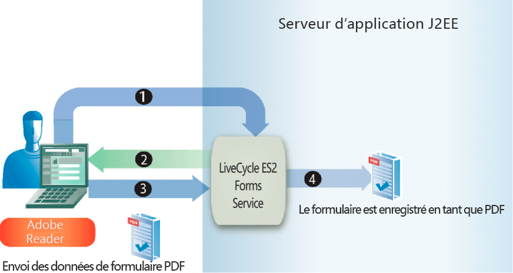

# Gestion du Forms envoyé {#handling-submitted-forms}

**Les exemples et exemples de ce document ne concernent que l’environnement AEM Forms on JEE.**

Les applications Web permettant à un utilisateur de remplir des formulaires interactifs nécessitent que les données soient renvoyées au serveur. Le service Forms vous permet de récupérer les données saisies par l’utilisateur dans un formulaire interactif. Après avoir récupéré les données, vous pouvez les traiter pour répondre aux besoins de votre entreprise. Par exemple, vous pouvez stocker les données dans une base de données, les envoyer à une autre application, les envoyer à un autre service, fusionner les données dans une conception de formulaire, afficher les données dans un navigateur Web, etc.

Les données de formulaire sont envoyées au service Forms sous la forme de données XML ou PDF, une option définie dans Designer. Un formulaire envoyé au format XML vous permet d’extraire des valeurs de données de champ individuelles. En d’autres termes, vous pouvez extraire la valeur de chaque champ de formulaire que l’utilisateur a saisi dans le formulaire. Un formulaire envoyé en tant que données PDF est une donnée binaire et non une donnée XML. Vous pouvez enregistrer le formulaire au format PDF ou l’envoyer à un autre service. Si vous souhaitez extraire des données d’un formulaire envoyé au format XML, puis utiliser les données du formulaire pour créer un document PDF, appelez une autre opération AEM Forms. (Voir [Création de Documents PDF avec des données XML envoyées](/help/forms/developing/creating-pdf-documents-submitted-xml.md)).

Le diagramme suivant montre les données envoyées à un servlet Java nommé `HandleData` à partir d&#39;un formulaire interactif affiché dans un navigateur Web.

Le tableau suivant décrit les étapes du diagramme.

<table>
 <thead>
  <tr>
   <th>
Étape
</th>
   <th>
Description
</th>
  </tr>
 </thead>
 <tbody>
  <tr>
   <td>
1
</td>
   <td>
Un utilisateur remplit un formulaire interactif et clique sur le bouton Envoyer du formulaire.
</td>
  </tr>
  <tr>
   <td>
2
</td>
   <td>
Les données sont envoyées au servlet Java <code>HandleData</code> sous forme de données XML.
</td>
  </tr>
  <tr>
   <td>
3
</td>
   <td>
Le servlet Java <code>HandleData</code> contient la logique d'application permettant de récupérer les données.
</td>
  </tr>
 </tbody>
</table>

## Gestion des données XML envoyées {#handling-submitted-xml-data}

Lorsque les données de formulaire sont envoyées au format XML, vous pouvez récupérer les données XML qui représentent les données envoyées. Tous les champs de formulaire apparaissent sous la forme de noeuds dans un schéma XML. Les valeurs de noeud correspondent aux valeurs que l’utilisateur a renseignées. Prenons le cas d’un formulaire de prêt dans lequel chaque champ du formulaire apparaît comme noeud dans les données XML. La valeur de chaque noeud correspond à la valeur qu’un utilisateur remplit. Supposons qu’un utilisateur remplisse le formulaire de prêt avec les données affichées dans le formulaire suivant.

L’illustration suivante présente les données XML correspondantes récupérées à l’aide de l’API Client du service Forms.

Champs du formulaire de prêt. Ces valeurs peuvent être récupérées
à l’aide des classes XML Java.

>[!NOTE]
>
>La conception de formulaire doit être correctement configurée dans Designer pour que les données soient envoyées sous forme de données XML. Pour configurer correctement la conception de formulaire de manière à envoyer des données XML, assurez-vous que le bouton Envoyer situé sur la conception de formulaire est configuré pour envoyer des données XML. Pour plus d’informations sur la définition du bouton Envoyer pour envoyer des données XML, voir [AEM Forms Designer](https://www.adobe.com/go/learn_aemforms_designer_63).

## Gestion des données PDF envoyées {#handling-submitted-pdf-data}

Prenons l’exemple d’une application Web qui appelle le service Forms. Une fois que le service Forms a rendu un formulaire PDF interactif à un navigateur Web client, l’utilisateur l’a rempli et l’a renvoyé au format PDF. Lorsque le service Forms reçoit les données PDF, il peut envoyer les données PDF à un autre service ou les enregistrer dans un fichier PDF. Le diagramme suivant illustre le flux logique de l’application.

Le tableau suivant décrit les étapes de ce diagramme.

<table>
 <thead>
  <tr>
   <th>
Étape
</th>
   <th>
Description
</th>
  </tr>
 </thead>
 <tbody>
  <tr>
   <td>
1
</td>
   <td>
Une page Web contient un lien qui accède à un servlet Java qui appelle le service Forms.
</td>
  </tr>
  <tr>
   <td>
2
</td>
   <td>
Le service Forms génère un formulaire PDF interactif dans le navigateur Web client.
</td>
  </tr>
  <tr>
   <td>
3
</td>
   <td>
L’utilisateur remplit un formulaire interactif et clique sur un bouton d’envoi. Le formulaire est renvoyé au service Forms en tant que données PDF. Cette option est définie dans Designer.
</td>
  </tr>
  <tr>
   <td>
4
</td>
   <td>
Le service Forms enregistre les données PDF dans un fichier PDF. 
</td>
  </tr>
 </tbody>
</table>

## Gestion des données UTF-16 de l’URL envoyée {#handling-submitted-url-utf-16-data}

Si les données de formulaire sont envoyées en tant que données d’URL UTF-16, l’ordinateur client nécessite Adobe Reader ou Acrobat 8.1 ou une version ultérieure. De même, si la conception de formulaire contient un bouton d’envoi contenant des données codées URL (HTTP Post) et que l’option de codage des données est UTF-16, la conception de formulaire doit être modifiée dans un éditeur de texte tel que le Bloc-notes. Vous pouvez définir l’option de codage sur `UTF-16LE` ou `UTF-16BE` pour le bouton d’envoi. Designer ne fournit pas cette fonctionnalité.

>[!NOTE]
>
>Pour plus d’informations sur le service Forms, voir [Guide de référence des services pour AEM Forms](https://www.adobe.com/go/learn_aemforms_services_63).

## Résumé des étapes {#summary-of-steps}

Pour gérer les formulaires envoyés, effectuez les tâches suivantes :

1. Incluez des fichiers de projet.
1. Créez un objet API Client Forms.
1. Récupérez les données du formulaire.
1. Déterminez si l’envoi du formulaire contient des pièces jointes.
1. Traiter les données envoyées.

**Inclure les fichiers de projet**

Incluez les fichiers nécessaires dans votre projet de développement. Si vous créez une application cliente à l’aide de Java, incluez les fichiers JAR nécessaires. Si vous utilisez des services Web, veillez à inclure les fichiers proxy.

**Création d’un objet API Client Forms**

Avant de pouvoir exécuter par programmation une opération d’API Client de service Forms, vous devez créer un client de service Forms. Si vous utilisez l’API Java, créez un objet `FormsServiceClient`. Si vous utilisez l’API du service Web Forms, créez un objet `FormsService`.

**Récupération des données de formulaire**

Pour récupérer les données de formulaire envoyées, vous appelez la méthode `FormsServiceClient` de l’objet `processFormSubmission`. Lorsque vous appelez cette méthode, vous devez spécifier le type de contenu du formulaire envoyé. Lorsque des données sont envoyées d’un navigateur Web client au service Forms, elles peuvent être envoyées au format XML ou PDF. Pour récupérer les données saisies dans les champs de formulaire, les données peuvent être envoyées sous forme de données XML.

Vous pouvez également récupérer les champs de formulaire d’un formulaire envoyé en tant que données PDF en définissant les options d’exécution suivantes :

* Transmettez la valeur suivante à la méthode `processFormSubmission` en tant que paramètre de type de contenu : `CONTENT_TYPE=application/pdf`.
* Définissez la valeur `PDFToXDP` de l’objet `RenderOptionsSpec` sur `true`.
* Définissez la valeur `ExportDataFormat` de l’objet `RenderOptionsSpec` sur `XMLData`.

Vous spécifiez le type de contenu du formulaire envoyé lorsque vous appelez la méthode `processFormSubmission`. La liste suivante spécifie les valeurs de type de contenu applicables :

* **text/xml** : Représente le type de contenu à utiliser lorsqu’un formulaire PDF envoie des données de formulaire au format XML.
* **application/x-www-form-urlencoded** : Représente le type de contenu à utiliser lorsqu’un formulaire HTML envoie des données au format XML.
* **application/pdf** : Représente le type de contenu à utiliser lorsqu’un formulaire PDF envoie des données au format PDF.

>[!NOTE]
>
>Vous remarquerez qu’il existe trois débuts rapides correspondants associés à la section Gestion du Forms envoyé. Le début rapide Gestion des PDF forms envoyés au format PDF à l’aide de l’API Java montre comment gérer les données PDF envoyées. Le type de contenu spécifié dans ce début rapide est `application/pdf`. Le début rapide Gestion des PDF forms envoyés en tant que XML à l’aide de l’API Java montre comment gérer les données XML envoyées à partir d’un formulaire PDF. Le type de contenu spécifié dans ce début rapide est `text/xml`. De même, le début rapide Gestion des formulaires HTML envoyés en tant que XML à l’aide de l’API Java montre comment gérer les données XML envoyées à partir d’un formulaire HTML. Le type de contenu spécifié dans ce début rapide est application/x-www-form-urlencoded.

Vous récupérez les données de formulaire qui ont été publiées sur le service Forms et déterminez leur état de traitement. En d’autres termes, lorsque des données sont envoyées au service Forms, cela ne signifie pas nécessairement que le service Forms a terminé de traiter les données et que les données sont prêtes à être traitées. Par exemple, les données peuvent être envoyées au service Forms pour qu’un calcul puisse être effectué. Une fois le calcul terminé, le formulaire est rendu à l’utilisateur avec les résultats de calcul affichés. Avant de traiter les données envoyées, il est recommandé de déterminer si le service Forms a terminé le traitement des données.

Le service Forms renvoie les valeurs suivantes pour indiquer s’il a terminé le traitement des données :

* **0 (Envoyer) : les données** envoyées sont prêtes à être traitées.
* **1 (Calculer) :** Le service Forms a effectué une opération de calcul sur les données et les résultats doivent être rendus à l’utilisateur.
* **2 (Valider) :** les données de formulaire validées du service Forms et les résultats doivent être rendus à l’utilisateur.
* **3 (Suivant) :** La page active a changé avec les résultats qui doivent être écrits dans l’application cliente.
* **4 (Précédent**) : La page active a changé avec les résultats qui doivent être écrits dans l’application cliente.

>[!NOTE]
>
>Les calculs et validations doivent être rendus à l’utilisateur. (Voir [Calcul des données de formulaire](/help/forms/developing/calculating-form-data.md#calculating-form-data).

**Déterminez si l’envoi du formulaire contient des pièces jointes.**

Forms envoyé au service Forms peut contenir des pièces jointes. Par exemple, à l’aide du volet de pièces jointes intégré d’Acrobat, un utilisateur peut sélectionner des pièces jointes à envoyer avec le formulaire. En outre, un utilisateur peut également sélectionner des pièces jointes à l’aide d’une barre d’outils HTML générée avec un fichier HTML.

Après avoir déterminé si un formulaire contient des pièces jointes, vous pouvez traiter les données. Par exemple, vous pouvez enregistrer la pièce jointe dans le système de fichiers local.

>[!NOTE]
>
>Le formulaire doit être envoyé au format PDF pour récupérer les pièces jointes. Si le formulaire est envoyé en tant que données XML, les pièces jointes ne sont pas envoyées.

**Traiter les données envoyées**

En fonction du type de contenu des données envoyées, vous pouvez extraire des valeurs de champ de formulaire individuelles des données XML envoyées ou enregistrer les données PDF envoyées dans un fichier PDF (ou les envoyer à un autre service). Pour extraire des champs de formulaire individuels, convertissez les données XML envoyées en une source de données XML, puis récupérez les valeurs de source de données XML à l’aide des classes `org.w3c.dom`.

**Voir également**

[Inclusion des fichiers de bibliothèque Java AEM Forms](/help/forms/developing/invoking-aem-forms-using-java.md#including-aem-forms-java-library-files)

[Réglage des propriétés de la connexion](/help/forms/developing/invoking-aem-forms-using-java.md#setting-connection-properties)

[Débuts rapides de l’API du service Forms](/help/forms/developing/forms-service-api-quick-starts.md#forms-service-api-quick-starts)

[Transmission de Documents au service Forms](/help/forms/developing/passing-documents-forms-service.md)

[Création d’Applications web renvoyant Forms](/help/forms/developing/creating-web-applications-renders-forms.md)

## Gérer les formulaires envoyés à l’aide de l’API Java {#handle-submitted-forms-using-the-java-api}

Gérez un formulaire envoyé à l’aide de l’API Forms (Java) :

1. Inclure les fichiers de projet

   Incluez des fichiers JAR client, tels que adobe-forms-client.jar, dans le chemin de classe de votre projet Java.

1. Création d’un objet API Client Forms

   * Créez un objet `ServiceClientFactory` qui contient des propriétés de connexion.
   * Créez un objet `FormsServiceClient` en utilisant son constructeur et en transmettant l&#39;objet `ServiceClientFactory`.

1. Récupération des données de formulaire

   * Pour récupérer les données de formulaire qui ont été publiées sur un servlet Java, créez un objet `com.adobe.idp.Document` à l’aide de son constructeur et appelez la méthode `getInputStream` de l’objet `javax.servlet.http.HttpServletResponse` à partir du constructeur.
   * Créez un objet `RenderOptionsSpec` en utilisant son constructeur. Définissez la valeur du paramètre régional en appelant la méthode `setLocale` de l’objet `RenderOptionsSpec` et en transmettant une valeur de chaîne qui spécifie la valeur du paramètre régional.

   >[!NOTE]
   >
   >Vous pouvez demander au service Forms de créer des données XDP ou XML à partir du contenu PDF envoyé en appelant la méthode `RenderOptionsSpec` de l’objet `setPDF2XDP` et en transmettant `true`, en appelant `setXMLData` et en transmettant `true`. Vous pouvez ensuite appeler la méthode `getOutputXML` de l’objet `FormsResult` pour récupérer les données XML qui correspondent aux données XDP/XML. (L&#39;objet `FormsResult` est renvoyé par la méthode `processFormSubmission`, qui est expliquée à l&#39;étape suivante.)

   * Appelez la méthode `processFormSubmission` de l’objet `FormsServiceClient` et transmettez les valeurs suivantes :

      * Objet `com.adobe.idp.Document` contenant les données du formulaire.
      * Valeur de chaîne qui spécifie les variables d’environnement, y compris tous les en-têtes HTTP appropriés. Spécifiez le type de contenu à gérer. Pour gérer les données XML, spécifiez la valeur de chaîne suivante pour ce paramètre : `CONTENT_TYPE=text/xml`. Pour gérer les données PDF, spécifiez la valeur de chaîne suivante pour ce paramètre : `CONTENT_TYPE=application/pdf`.
      * Valeur de chaîne qui spécifie la valeur d’en-tête `HTTP_USER_AGENT`, par exemple . `Mozilla/4.0 (compatible; MSIE 6.0; Windows NT 5.1; SV1; .NET CLR 1.1.4322)`. Cette valeur de paramètre est facultative.
      * Objet `RenderOptionsSpec` qui stocke les options d’exécution.

      La méthode `processFormSubmission` renvoie un objet `FormsResult` contenant les résultats de l’envoi du formulaire.

   * Déterminez si le service Forms a terminé de traiter les données de formulaire en appelant la méthode `FormsResult` de l’objet `getAction`. Si cette méthode renvoie la valeur `0`, les données sont prêtes à être traitées.

1. Déterminez si l’envoi du formulaire contient des pièces jointes.

   * Appelez la méthode `FormsResult` de l’objet `getAttachments`. Cette méthode renvoie un objet `java.util.List` contenant des fichiers qui ont été envoyés avec le formulaire.
   * Effectuez une itération dans l&#39;objet `java.util.List` pour déterminer s&#39;il existe des pièces jointes. S’il existe des pièces jointes, chaque élément est une instance `com.adobe.idp.Document`. Vous pouvez enregistrer les pièces jointes en appelant la méthode `com.adobe.idp.Document` de l&#39;objet `copyToFile` et en transmettant un objet `java.io.File`.

   >[!NOTE]
   >
   >Cette étape s’applique uniquement si le formulaire est envoyé au format PDF.

1. Traiter les données envoyées

   * Si le type de contenu des données est `application/vnd.adobe.xdp+xml` ou `text/xml`, créez une logique d’application pour récupérer les valeurs de données XML.

      * Créez un objet `com.adobe.idp.Document` en appelant la méthode `FormsResult` de l&#39;objet `getOutputContent`.
      * Créez un objet `java.io.InputStream` en appelant le constructeur `java.io.DataInputStream` et en transmettant l&#39;objet `com.adobe.idp.Document`.
      * Créez un objet `org.w3c.dom.DocumentBuilderFactory` en appelant la méthode `org.w3c.dom.DocumentBuilderFactory` statique de l&#39;objet `newInstance`.
      * Créez un objet `org.w3c.dom.DocumentBuilder` en appelant la méthode `org.w3c.dom.DocumentBuilderFactory` de l&#39;objet `newDocumentBuilder`.
      * Créez un objet `org.w3c.dom.Document` en appelant la méthode `org.w3c.dom.DocumentBuilder` de l&#39;objet `parse` et en transmettant l&#39;objet `java.io.InputStream`.
      * Récupérez la valeur de chaque noeud dans le document XML. Pour accomplir cette tâche, vous pouvez créer une méthode personnalisée qui accepte deux paramètres : l’objet `org.w3c.dom.Document` et le nom du noeud dont vous souhaitez récupérer la valeur. Cette méthode renvoie une valeur de chaîne représentant la valeur du noeud. Dans l&#39;exemple de code qui suit ce processus, cette méthode personnalisée est appelée `getNodeText`. Le corps de cette méthode s’affiche.
   * Si le type de contenu des données est `application/pdf`, créez une logique d’application pour enregistrer les données PDF envoyées au format PDF.

      * Créez un objet `com.adobe.idp.Document` en appelant la méthode `FormsResult` de l&#39;objet `getOutputContent`.
      * Créez un objet `java.io.File` en utilisant son constructeur public. Veillez à spécifier PDF comme extension de nom de fichier.
      * Renseignez le fichier PDF en appelant la méthode `com.adobe.idp.Document` de l’objet `copyToFile` et en transmettant l’objet `java.io.File`.

**Voir également**

[Début rapide (mode SOAP) : Gestion des PDF forms envoyés en tant que XML à l’aide de l’API Java](/help/forms/developing/forms-service-api-quick-starts.md#quick-start-soap-mode-handling-pdf-forms-submitted-as-xml-using-the-java-api)

[Début rapide (mode SOAP) : Gestion des formulaires HTML envoyés en tant que XML à l’aide de l’API Java](/help/forms/developing/forms-service-api-quick-starts.md#quick-start-soap-mode-handling-html-forms-submitted-as-xml-using-the-java-api)

[Début rapide (mode SOAP) : Gestion des PDF forms envoyés au format PDF à l’aide de l’API Java](/help/forms/developing/forms-service-api-quick-starts.md#quick-start-soap-mode-handling-pdf-forms-submitted-as-pdf-using-the-java-api)

[Inclusion des fichiers de bibliothèque Java AEM Forms](/help/forms/developing/invoking-aem-forms-using-java.md#including-aem-forms-java-library-files)

[Réglage des propriétés de la connexion](/help/forms/developing/invoking-aem-forms-using-java.md#setting-connection-properties)

## Gérer les données PDF envoyées à l’aide de l’API de service Web {#handle-submitted-pdf-data-using-the-web-service-api}

Gérez un formulaire envoyé à l’aide de l’API Forms (service Web) :

1. Inclure les fichiers de projet

   * Créez des classes de proxy Java qui utilisent le WSDL du service Forms.
   * Incluez les classes proxy Java dans votre chemin de classe.

1. Création d’un objet API Client Forms

   Créez un objet `FormsService` et définissez des valeurs d’authentification.

1. Récupération des données de formulaire

   * Pour récupérer les données de formulaire publiées sur un servlet Java, créez un objet `BLOB` à l’aide de son constructeur.
   * Créez un objet `java.io.InputStream` en appelant la méthode `javax.servlet.http.HttpServletResponse` de l&#39;objet `getInputStream`.
   * Créez un objet `java.io.ByteArrayOutputStream` en utilisant son constructeur et en transmettant la longueur de l&#39;objet `java.io.InputStream`.
   * Copiez le contenu de l&#39;objet `java.io.InputStream` dans l&#39;objet `java.io.ByteArrayOutputStream`.
   * Créez un tableau d’octets en appelant la méthode `toByteArray` de l’objet `java.io.ByteArrayOutputStream`.
   * Renseignez l’objet `BLOB` en appelant sa méthode `setBinaryData` et en transmettant le tableau d’octets comme argument.
   * Créez un objet `RenderOptionsSpec` en utilisant son constructeur. Définissez la valeur du paramètre régional en appelant la méthode `setLocale` de l’objet `RenderOptionsSpec` et en transmettant une valeur de chaîne qui spécifie la valeur du paramètre régional.
   * Appelez la méthode `processFormSubmission` de l’objet `FormsService` et transmettez les valeurs suivantes :

      * Objet `BLOB` contenant les données du formulaire.
      * Valeur de chaîne qui spécifie les variables d’environnement, y compris tous les en-têtes HTTP appropriés. Spécifiez le type de contenu à gérer. Pour gérer les données XML, spécifiez la valeur de chaîne suivante pour ce paramètre : `CONTENT_TYPE=text/xml`. Pour gérer les données PDF, spécifiez la valeur de chaîne suivante pour ce paramètre : `CONTENT_TYPE=application/pdf`.
      * Valeur de chaîne qui spécifie la valeur d&#39;en-tête `HTTP_USER_AGENT` ; par exemple, `Mozilla/4.0 (compatible; MSIE 6.0; Windows NT 5.1; SV1; .NET CLR 1.1.4322)`.
      * Objet `RenderOptionsSpec` qui stocke les options d’exécution.
      * Objet `BLOBHolder` vide renseigné par la méthode.
      * Objet `javax.xml.rpc.holders.StringHolder` vide renseigné par la méthode.
      * Objet `BLOBHolder` vide renseigné par la méthode.
      * Objet `BLOBHolder` vide renseigné par la méthode.
      * Objet `javax.xml.rpc.holders.ShortHolder` vide renseigné par la méthode.
      * Objet `MyArrayOf_xsd_anyTypeHolder` vide renseigné par la méthode. Ce paramètre permet de stocker les pièces jointes envoyées avec le formulaire.
      * Un objet `FormsResultHolder` vide qui est renseigné par la méthode avec le formulaire envoyé.

      La méthode `processFormSubmission` renseigne le paramètre `FormsResultHolder` avec les résultats de l’envoi du formulaire.

   * Déterminez si le service Forms a terminé de traiter les données de formulaire en appelant la méthode `FormsResult` de l’objet `getAction`. Si cette méthode renvoie la valeur `0`, les données du formulaire sont prêtes à être traitées. Vous pouvez obtenir un objet `FormsResult` en obtenant la valeur du membre de données `FormsResultHolder` de l&#39;objet `value`.

1. Déterminez si l’envoi du formulaire contient des pièces jointes.

   Obtenez la valeur du membre de données `value` de l&#39;objet `MyArrayOf_xsd_anyTypeHolder` (l&#39;objet `MyArrayOf_xsd_anyTypeHolder` a été transmis à la méthode `processFormSubmission`). Ce membre de données renvoie un tableau de `Objects`. Chaque élément du tableau `Object` est un `Object`qui correspond aux fichiers envoyés avec le formulaire. Vous pouvez obtenir chaque élément du tableau et le projeter dans un objet `BLOB`.

1. Traiter les données envoyées

   * Si le type de contenu des données est `application/vnd.adobe.xdp+xml` ou `text/xml`, créez une logique d’application pour récupérer les valeurs de données XML.

      * Créez un objet `BLOB` en appelant la méthode `FormsResult` de l&#39;objet `getOutputContent`.
      * Créez un tableau d’octets en appelant la méthode `getBinaryData` de l’objet `BLOB`.
      * Créez un objet `java.io.InputStream` en appelant le constructeur `java.io.ByteArrayInputStream` et en transmettant le tableau d’octets.
      * Créez un objet `org.w3c.dom.DocumentBuilderFactory` en appelant la méthode `org.w3c.dom.DocumentBuilderFactory` statique de l&#39;objet `newInstance`.
      * Créez un objet `org.w3c.dom.DocumentBuilder` en appelant la méthode `org.w3c.dom.DocumentBuilderFactory` de l&#39;objet `newDocumentBuilder`.
      * Créez un objet `org.w3c.dom.Document` en appelant la méthode `org.w3c.dom.DocumentBuilder` de l&#39;objet `parse` et en transmettant l&#39;objet `java.io.InputStream`.
      * Récupérez la valeur de chaque noeud dans le document XML. Pour accomplir cette tâche, vous pouvez créer une méthode personnalisée qui accepte deux paramètres : l’objet `org.w3c.dom.Document` et le nom du noeud dont vous souhaitez récupérer la valeur. Cette méthode renvoie une valeur de chaîne représentant la valeur du noeud. Dans l&#39;exemple de code qui suit ce processus, cette méthode personnalisée est appelée `getNodeText`. Le corps de cette méthode s’affiche.
   * Si le type de contenu des données est `application/pdf`, créez une logique d’application pour enregistrer les données PDF envoyées au format PDF.

      * Créez un objet `BLOB` en appelant la méthode `FormsResult` de l&#39;objet `getOutputContent`.
      * Créez un tableau d’octets en appelant la méthode `getBinaryData` de l’objet `BLOB`.
      * Créez un objet `java.io.File` en utilisant son constructeur public. Veillez à spécifier PDF comme extension de nom de fichier.
      * Créez un objet `java.io.FileOutputStream` en utilisant son constructeur et en transmettant l’objet `java.io.File`. 
      * Renseignez le fichier PDF en appelant la méthode `java.io.FileOutputStream` de l’objet `write` et en transmettant le tableau d’octets.

**Voir également**

[Appel de AEM Forms à l’aide du codage Base64](/help/forms/developing/invoking-aem-forms-using-web.md#invoking-aem-forms-using-base64-encoding)