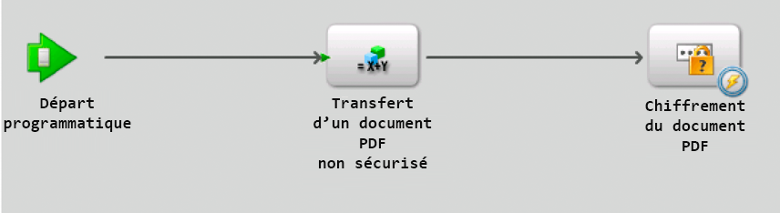
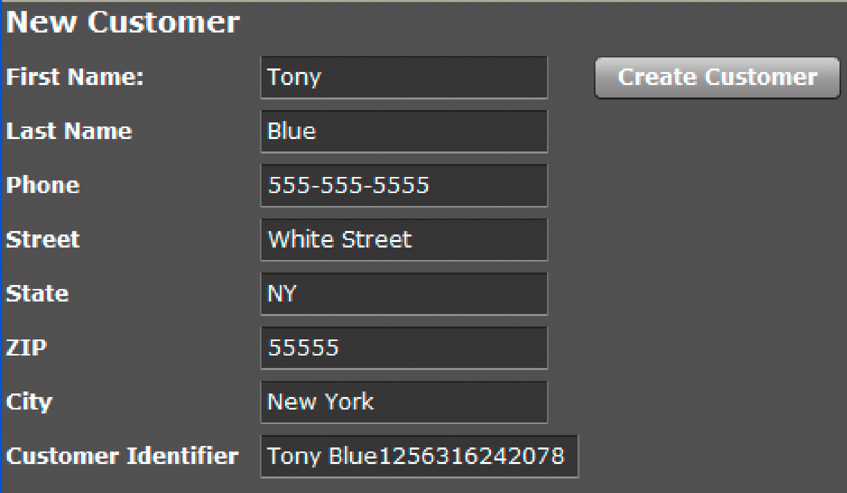

# Appeler AEM Forms à l’aide de Remoting {#invoking-aem-forms-using-remoting}

**Les exemples et exemples de ce document ne concernent que l’environnement AEM Forms on JEE.**

Les processus créés dans Workbench peuvent être appelés à l’aide de Remoting. En d’autres termes, vous pouvez appeler un processus AEM Forms à partir d’une application cliente créée avec Flex. Cette fonctionnalité est basée sur Data Services.

>[!NOTE]
>
>Lors de l’utilisation de Remoting, il est recommandé d’appeler les processus créés dans Workbench par opposition aux services AEM Forms. Cependant, il est possible d&#39;appeler directement les services AEM Forms. (voir Chiffrement de documents PDF à l’aide de Remoting, dans AEM Forms Developer Center).

>[!NOTE]
>
>Si un service AEM Forms n’est pas configuré pour autoriser l’accès anonyme, les requêtes d’un client Flex entraînent un problème de navigateur Web. L’utilisateur doit saisir son nom d’utilisateur et son mot de passe.

Le processus de courte durée AEM Forms suivant, appelé `MyApplication/EncryptDocument`, peut être appelé à l’aide de Remoting. (Pour plus d’informations sur ce processus, telles que ses valeurs d’entrée et de sortie, voir [Exemple de processus de courte durée](/help/forms/developing/aem-forms-processes.md).)



>[!NOTE]
>
>Pour appeler un processus AEM Forms à l’aide d’une application Flex, assurez-vous qu’un point de terminaison distant est activé. Par défaut, un point de terminaison distant est activé lorsque vous déployez un processus.

Lorsque ce processus est appelé, il effectue les actions suivantes :

1. Obtient le document PDF non sécurisé transmis en tant que valeur d’entrée. Cette action est basée sur l’opération `SetValue`. Le nom du paramètre d’entrée est `inDoc` et son type de données est `document`. (Le type de données `document` est un type de données disponible dans Workbench.)
1. Chiffrement du document PDF avec un mot de passe. Cette action est basée sur l’opération `PasswordEncryptPDF`. Le nom de la valeur de sortie pour ce processus est `outDoc` et représente le document PDF chiffré par mot de passe. Le type de données de outDoc est `document`.
1. Enregistre le document PDF chiffré par mot de passe sous la forme d’un fichier PDF dans le système de fichiers local. Cette action est basée sur l’opération `WriteDocument`. 

>[!NOTE]
>
>Le processus `MyApplication/EncryptDocument` ne repose pas sur un processus AEM Forms existant. Pour suivre avec les exemples de code, créez un processus nommé `MyApplication/EncryptDocument` à l’aide de Workbench.

>[!NOTE]
>
>Pour plus d’informations sur l’utilisation de Remoting pour appeler un processus de longue durée, voir [Appel de processus de longue durée centrés sur l’homme](/help/forms/developing/invoking-human-centric-long-lived.md#invoking-human-centric-long-lived-processes).

**Voir également**

[Inclusion du fichier de bibliothèque AEM Forms Flex](invoking-aem-forms-using-remoting.md#including-the-aem-forms-flex-library-file)

[Gestion des documents avec (obsolète pour les formulaires AEM) AEM Forms Remoting](invoking-aem-forms-using-remoting.md#handling-documents-with-remoting)

[Appeler un processus de courte durée en transmettant un document non sécurisé à l’aide de l’outil AEM Forms Remoting (obsolète pour les formulaires AEM)](invoking-aem-forms-using-remoting.md#invoking-a-short-lived-process-by-passing-an-unsecure-document-using-remoting)

[Authentification des applications clientes créées avec Flex](invoking-aem-forms-using-remoting.md#authenticating-client-applications-built-with-flex)

[Transfert de documents sécurisés pour appeler des processus à l’aide de Remoting](invoking-aem-forms-using-remoting.md#passing-secure-documents-to-invoke-processes-using-remoting)

[Appel de services de composants personnalisés à l’aide de Remoting](invoking-aem-forms-using-remoting.md#invoking-custom-component-services-using-remoting)

[Création d’une application cliente créée avec Flex qui appelle un processus de longue durée axé sur l’être humain](/help/forms/developing/invoking-human-centric-long-lived.md#creating-a-client-application-built-with-flex-that-invokes-a-human-centric-long-lived-process)

[Création d’applications de Flash Builder qui effectuent une authentification SSO à l’aide de jetons HTTP](/help/forms/developing/creating-flash-builder-applications-perform.md#creating-flash-builder-applications-that-perform-sso-authentication-using-http-tokens)

Pour plus d’informations sur la façon d’afficher les données de processus dans un contrôle graphique Flex, voir [Affichage des données de processus AEM Forms dans les graphiques Flex](https://www.adobe.com/devnet/livecycle/articles/populating_flexcontrols.html).

>[!NOTE]
>
>*Veillez à placer le fichier crossdomain.xml au bon endroit. Par exemple, si vous avez déployé AEM Forms sur JBoss, placez ce fichier à l’emplacement suivant : &lt;répertoire_installation>\Adobe_Experience_Manager_forms\jboss\server\lc_turnkey\deploy\jboss-web.deployer\ROOT.war.*

## Inclusion du fichier de bibliothèque AEM Forms Flex {#including-the-aem-forms-flex-library-file}

Pour appeler par programmation des processus AEM Forms à l’aide de Remoting, ajoutez le fichier adobe-remoting-provider.swc au chemin de classe de votre projet Flex. Ce fichier SWC se trouve à l’emplacement suivant :

* *&lt;install_directory>\Adobe_Experience_Manager_forms\sdk\misc\DataServices\Client-Libraries*

   où &quot;a0/>install_directory&lt;a1/&quot; correspond au répertoire dans lequel AEM Forms est installé.**

**Voir également**

[Appeler AEM Forms à l’aide de AEM Forms Remoting (obsolète pour les formulaires AEM)](invoking-aem-forms-using-remoting.md#invoking-aem-forms-using-remoting)

[Gestion des documents avec (obsolète pour les formulaires AEM) AEM Forms Remoting](invoking-aem-forms-using-remoting.md#handling-documents-with-remoting)

[Appeler un processus de courte durée en transmettant un document non sécurisé à l’aide de l’outil AEM Forms Remoting (obsolète pour les formulaires AEM)](invoking-aem-forms-using-remoting.md#invoking-a-short-lived-process-by-passing-an-unsecure-document-using-remoting)

[Authentification des applications clientes créées avec Flex](invoking-aem-forms-using-remoting.md#authenticating-client-applications-built-with-flex)

## Gestion des documents avec Remoting {#handling-documents-with-remoting}

L&#39;un des types Java non primitifs les plus importants utilisés en AEM Forms est la classe `com.adobe.idp.Document`. Un document est généralement requis pour appeler une opération AEM Forms. Il s’agit principalement d’un document PDF, mais il peut contenir d’autres types de document tels que SWF, HTML, XML ou un fichier DOC. (Voir [Transfert de données aux services AEM Forms à l’aide de l’API Java](/help/forms/developing/invoking-aem-forms-using-java.md#passing-data-to-aem-forms-services-using-the-java-api).)

Une application cliente créée avec Flex ne peut pas demander directement un document. Par exemple, vous ne pouvez pas lancer Adobe Reader pour demander une URL qui génère un fichier PDF. Les demandes de types de document, tels que les documents PDF et Microsoft Word, renvoient un résultat correspondant à une URL. Il appartient au client d’afficher le contenu de l’URL. Le service Document Management permet de générer les informations sur l’URL et le type de contenu. Les requêtes de documents XML renvoient le document XML complet dans le résultat.

### Transmission d’un document en tant que paramètre d’entrée {#passing-a-document-as-an-input-parameter}

Une application cliente créée avec Flex ne peut pas transmettre un document directement à un processus AEM Forms. À la place, l’application cliente utilise une instance de la classe d’ActionScript `mx.rpc.livecycle.DocumentReference` pour transmettre des paramètres d’entrée à une opération qui attend une instance `com.adobe.idp.Document`. Une application cliente Flex dispose de plusieurs options pour configurer un objet `DocumentReference` :

* Lorsque le document se trouve sur le serveur et que l’emplacement de son fichier est connu, définissez la propriété referenceType de l’objet DocumentReference sur REF_TYPE_FILE. Définissez la propriété fileRef sur l’emplacement du fichier, comme le montre l’exemple suivant :

```java
 ... var docRef: DocumentReference = new DocumentReference(); 
 docRef.referenceType = DocumentReference.REF_TYPE_FILE; 
 docRef.fileRef = "C:/install/adobe/cs2/How to Uninstall.pdf"; ...
```

* Lorsque le document se trouve sur le serveur et que vous connaissez son URL, définissez la propriété referenceType de l’objet DocumentReference sur REF_TYPE_URL. Définissez la propriété url sur l’URL, comme le montre l’exemple suivant :

```java
... var docRef: DocumentReference = new DocumentReference(); 
docRef.referenceType = DocumentReference.REF_TYPE_URL; 
docRef.url = "https://companyserver:8080/DocumentManager/116/7855"; ...
```

* Pour créer un objet DocumentReference à partir d’une chaîne de texte dans l’application cliente, définissez la propriété referenceType de l’objet DocumentReference sur REF_TYPE_INLINE. Définissez la propriété text sur le texte à inclure dans l’objet, comme le montre l’exemple suivant :

```java
... var docRef: DocumentReference = new DocumentReference(); 
docRef.referenceType = DocumentReference.REF_TYPE_INLINE; 
docRef.text = "Text for my document";  // Optionally, you can override the server’s default character set  // if necessary:  // docRef.charsetName=CharacterSetName  ...
```

* Lorsque le document ne se trouve pas sur le serveur, utilisez la servlet de téléchargement Remoting pour télécharger un document vers AEM Forms. La nouvelle version de AEM Forms est la possibilité de télécharger des documents sécurisés. Lorsque vous téléchargez un document sécurisé, vous devez utiliser un utilisateur doté du rôle *Utilisateur de l’application de téléchargement de Document*. Sans ce rôle, l’utilisateur ne peut pas télécharger un document sécurisé. Il est recommandé d’utiliser la connexion unique pour télécharger un document sécurisé. (Voir [Transmission de documents sécurisés pour appeler des processus à l’aide de Remoting](invoking-aem-forms-using-remoting.md#passing-secure-documents-to-invoke-processes-using-remoting).)

>[!NOTE]
si AEM Forms est configuré pour autoriser le téléchargement de documents non sécurisés, vous pouvez utiliser un utilisateur qui ne dispose pas du rôle Utilisateur de l’application de téléchargement de Document pour télécharger un document. Un utilisateur peut également disposer de l’autorisation de téléchargement de Document. Toutefois, si AEM Forms est configuré pour n’autoriser que les documents sécurisés, assurez-vous que l’utilisateur dispose du rôle Utilisateur de l’application de téléchargement de Document ou de l’autorisation de téléchargement de Document. (Voir [Configuration d’AEM Forms pour accepter les documents sécurisés et non sécurisés](invoking-aem-forms-using-remoting.md#configuring-aem-forms-to-accept-secure-and-unsecure-documents).

Vous utilisez des fonctionnalités de téléchargement de Flash standard pour l’URL de téléchargement désignée : `https://SERVER:PORT/remoting/lcfileupload`. Vous pouvez ensuite utiliser l&#39;objet `DocumentReference` lorsqu&#39;un paramètre d&#39;entrée de type `Document` est attendu.
` private function startUpload():void  {  fileRef.addEventListener(Event.SELECT, selectHandler);  fileRef.addEventListener("uploadCompleteData", completeHandler);  try  {   var success:Boolean = fileRef.browse();  }    catch (error:Error)  {   trace("Unable to browse for files.");  }  }      private function selectHandler(event:Event):void {  var request:URLRequest = new  URLRequest("https://SERVER:PORT/remoting/lcfileupload")  try   {   fileRef.upload(request);   }    catch (error:Error)   {   trace("Unable to upload file.");   }  }    private function completeHandler(event:DataEvent):void  {   var params:Object = new Object();   var docRef:DocumentReference = new DocumentReference();   docRef.url = event.data as String;   docRef.referenceType = DocumentReference.REF_TYPE_URL;  }`Le Début rapide Remoting utilise la servlet de téléchargement Remoting pour transmettre un fichier PDF au `MyApplication/EncryptDocument`processus. (Voir [Appeler un processus de courte durée en transmettant un document non sécurisé à l’aide de (obsolète pour les formulaires AEM) AEM Forms Remoting](invoking-aem-forms-using-remoting.md#invoking-a-short-lived-process-by-passing-an-unsecure-document-using-remoting).)

```java
 
private
function startUpload(): void  { 
 fileRef.addEventListener(Event.SELECT, selectHandler); 
 fileRef.addEventListener("uploadCompleteData", completeHandler); 
 try  { 
  var success: Boolean = fileRef.browse(); 
 }  
 catch (error: Error)  { 
  trace("Unable to browse for files."); 
 } 
}   
private
function selectHandler(event: Event): void { 
 var request: URLRequest = new  URLRequest("https://SERVER:PORT/remoting/lcfileupload")  try  { 
  fileRef.upload(request); 
 }  
 catch (error: Error)  { 
  trace("Unable to upload file."); 
 } 
}  
private
function completeHandler(event: DataEvent): void  { 
 var params: Object = new Object(); 
 var docRef: DocumentReference = new DocumentReference(); 
 docRef.url = event.data as String; 
 docRef.referenceType = DocumentReference.REF_TYPE_URL; 
}
```

Le Début rapide Remoting utilise la servlet de téléchargement Remoting pour transmettre un fichier PDF au `MyApplication/EncryptDocument`processus. (Voir [Appeler un processus de courte durée en transmettant un document non sécurisé à l’aide de (obsolète pour les formulaires AEM) AEM Forms Remoting](invoking-aem-forms-using-remoting.md#invoking-a-short-lived-process-by-passing-an-unsecure-document-using-remoting).)

### Retransmettre un document à une application cliente {#passing-a-document-back-to-a-client-application}

Une application cliente reçoit un objet de type `mx.rpc.livecycle.DocumentReference` pour une opération de service qui renvoie une instance `com.adobe.idp.Document` en tant que paramètre de sortie. Dans la mesure où une application cliente traite des objets d’ActionScript et non de Java, vous ne pouvez pas renvoyer un objet de Document basé sur Java à un client Flex. Au lieu de cela, le serveur génère une URL pour le document et la retransmet au client. La propriété `referenceType` de l&#39;objet `DocumentReference` indique si le contenu se trouve dans l&#39;objet `DocumentReference` ou doit être récupéré à partir d&#39;une URL dans la propriété `DocumentReference.url`. La propriété `DocumentReference.contentType` spécifie le type de document.

**Voir également**

[Appeler AEM Forms à l’aide de AEM Forms Remoting (obsolète pour les formulaires AEM)](invoking-aem-forms-using-remoting.md#invoking-aem-forms-using-remoting)

[Inclusion du fichier de bibliothèque AEM Forms Flex](invoking-aem-forms-using-remoting.md#including-the-aem-forms-flex-library-file)

[Appeler un processus de courte durée en transmettant un document non sécurisé à l’aide de l’outil AEM Forms Remoting (obsolète pour les formulaires AEM)](invoking-aem-forms-using-remoting.md#invoking-a-short-lived-process-by-passing-an-unsecure-document-using-remoting)

[Authentification des applications clientes créées avec Flex](invoking-aem-forms-using-remoting.md#authenticating-client-applications-built-with-flex)

[Transfert de documents sécurisés pour appeler des processus à l’aide de Remoting](invoking-aem-forms-using-remoting.md#passing-secure-documents-to-invoke-processes-using-remoting)

## Appeler un processus de courte durée en transmettant un document non sécurisé à l’aide de Remoting {#invoking-a-short-lived-process-by-passing-an-unsecure-document-using-remoting}

Pour appeler un processus AEM Forms à partir d’une application créée avec Flex, effectuez les tâches suivantes :

1. Créez une instance `mx:RemoteObject`.
1. Créez une instance `ChannelSet`.
1. Transmettez les valeurs d’entrée requises.
1. Gérez les valeurs renvoyées.

>[!NOTE]
Cette section explique comment appeler un processus AEM Forms et télécharger un document lorsque AEM Forms est configuré pour charger des documents non sécurisés. Pour plus d’informations sur la manière d’appeler des processus AEM Forms et de télécharger des documents sécurisés et de configurer AEM Forms pour accepter des documents sécurisés et non sécurisés, voir [Passage de documents sécurisés pour appeler des processus à l’aide de Remoting](invoking-aem-forms-using-remoting.md#passing-secure-documents-to-invoke-processes-using-remoting).

**Création d’une instance mx:RemoteObject**

Vous créez une instance `mx:RemoteObject` pour appeler un processus AEM Forms créé dans Workbench. Pour créer une instance `mx:RemoteObject`, spécifiez les valeurs suivantes :

* **id :** nom de l’ `mx:RemoteObject` instance qui représente le processus à appeler.
* **destination:** nom du processus AEM Forms à appeler. Par exemple, pour appeler le processus `MyApplication/EncryptDocument`, spécifiez `MyApplication/EncryptDocument`.
* **result :** nom de la méthode Flex qui gère le résultat.

Dans la balise `mx:RemoteObject`, spécifiez une balise `<mx:method>` qui spécifie le nom de la méthode d’appel du processus. En règle générale, le nom d’une méthode d’appel Forms est `invoke`.

L&#39;exemple de code suivant crée une instance `mx:RemoteObject` qui appelle le processus `MyApplication/EncryptDocument`.

```java
 <mx:RemoteObject id="EncryptDocument" destination="MyApplication/EncryptDocument" result="resultHandler(event);">
          <mx:method name="invoke" result="handleExecuteInvoke(event)"/>
      </mx:RemoteObject>
```

**Créer un Canal pour AEM Forms**

Une application cliente peut appeler AEM Forms en spécifiant un Canal dans MXML ou ActionScript, comme l’illustre l’exemple d’ActionScript suivant. Le Canal doit être `AMFChannel`, `SecureAMFChannel`, `HTTPChannel` ou `SecureHTTPChannel`.

```java
     ...
     private function refresh():void{
         var cs:ChannelSet= new ChannelSet();
         cs.addChannel(new AMFChannel("my-amf",
             "https://yourlcserver:8080/remoting/messagebroker/amf"));
         EncryptDocument.setCredentials("administrator", "password");
         EncryptDocument.channelSet = cs;
     }
     ...
```

Affectez l’instance `ChannelSet` au champ `mx:RemoteObject` de l’instance `channelSet` (comme illustré dans l’exemple de code précédent). En règle générale, vous importez la classe de canal dans une instruction d&#39;importation plutôt que de spécifier le nom complet lorsque vous appelez la méthode `ChannelSet.addChannel`.

**Transmission des valeurs d’entrée**

Un processus créé dans Workbench peut prendre zéro ou plusieurs paramètres d’entrée et renvoyer une valeur de sortie. Une application cliente transmet des paramètres d’entrée dans un objet `ActionScript` avec des champs qui correspondent à des paramètres appartenant au processus AEM Forms. Le processus de courte durée, nommé `MyApplication/EncryptDocument`, requiert un paramètre d’entrée nommé `inDoc`. Le nom de l’opération exposée par le processus est `invoke` (nom par défaut d’un processus de courte durée). (Voir [Appeler AEM Forms à l’aide de (obsolète pour les formulaires AEM) AEM Forms Remoting](invoking-aem-forms-using-remoting.md#invoking-aem-forms-using-remoting).)

L&#39;exemple de code suivant transmet un document PDF au processus `MyApplication/EncryptDocument` :

```java
     ...
     var params:Object = new Object();
 
     //Document is an instance of DocumentReference
     //that store an unsecured PDF document
     params["inDoc"] = pdfDocument;
 
     // Invoke an operation synchronously:
     EncryptDocument.invoke(params);
     ...
```

Dans cet exemple de code, `pdfDocument` est une instance `DocumentReference` qui contient un document PDF non sécurisé. Pour plus d’informations sur un `DocumentReference`, voir [Gestion des documents avec (obsolète pour les formulaires AEM) AEM Forms Remoting](invoking-aem-forms-using-remoting.md#handling-documents-with-remoting).

**Appel d’une version spécifique d’un service**

Vous pouvez appeler une version spécifique d’un service Forms en utilisant un paramètre `_version` dans la carte des paramètres de l’appel. Par exemple, pour appeler la version 1.2 du service `MyApplication/EncryptDocument` :

```java
 var params:Object = new Object();
 params["inDoc"] = pdfDocument;
 params["_version"] = "1.2"
 var token:AsyncToken = echoService.echoString(params);
```

Le paramètre `version` doit être une chaîne contenant un point unique. Les valeurs à gauche, dans la version principale et à droite, dans la version mineure de la période doivent être des entiers. Si ce paramètre n’est pas spécifié, la version principale de l’en-tête est appelée.

**Gestion des valeurs de retour**

Les paramètres de sortie de processus AEM Forms sont désérialisés en objets d’ActionScript à partir desquels l’application cliente extrait des paramètres spécifiques par nom, comme le montre l’exemple suivant. (La valeur de sortie du processus `MyApplication/EncryptDocument` est nommée `outDoc`.)

```java
     ...
     var res:Object = event.result;
     var docRef:DocumentReference = res["outDoc"] as DocumentReference;
     ...
```

**Appel du processus MyApplication/EncryptDocument**

Vous pouvez appeler le processus `MyApplication/EncryptDocument` en procédant comme suit :

1. Créez une instance `mx:RemoteObject` par ActionScript ou MXML. Voir Création d’une instance mx:RemoteObject.
1. Configurez une instance `ChannelSet` pour communiquer avec AEM Forms et associez-la à l&#39;instance `mx:RemoteObject`. Voir Création d’un Canal à AEM Forms.
1. Appelez la méthode `login` de ChannelSet ou la méthode `setCredentials` du service pour spécifier la valeur d&#39;identifiant utilisateur et le mot de passe. (Voir [Utilisation de la connexion unique](invoking-aem-forms-using-remoting.md#using-single-sign-on).)
1. Renseignez une instance `mx.rpc.livecycle.DocumentReference` avec un document PDF non sécurisé à transmettre au processus `MyApplication/EncryptDocument`. (Voir [Transmission d’un document en tant que paramètre d’entrée](invoking-aem-forms-using-remoting.md#passing-a-document-as-an-input-parameter).)
1. Chiffrez le document PDF en appelant la méthode `invoke` de l’instance `mx:RemoteObject`. Transmettez le `Object` qui contient le paramètre d’entrée (qui est le document PDF non sécurisé). Voir Transfert de valeurs d’entrée.
1. Récupérez le document PDF chiffré par mot de passe renvoyé par le processus. Voir Gestion des valeurs renvoyées.

[Début rapide : Appeler un processus de courte durée en transmettant un document non sécurisé à l’aide de l’outil AEM Forms Remoting (obsolète pour les formulaires AEM)](/help/forms/developing/invocation-api-quick-starts.md#quick-start-invoking-a-short-lived-process-by-passing-an-unsecure-document-using-deprecated-for-aem-forms-aem-forms-remoting)

## Authentification des applications clientes créées avec Flex {#authenticating-client-applications-built-with-flex}

Il existe plusieurs manières d’authentifier une requête Remoting d’une application Flex par AEM gestionnaire d’utilisateurs de formulaires, notamment l’authentification unique AEM Forms via le service de connexion central, l’authentification de base et l’authentification personnalisée. Lorsque ni l’authentification unique ni l’accès anonyme ne sont activés, une requête Remoting entraîne une authentification de base (par défaut) ou une authentification personnalisée.

L’authentification de base repose sur l’authentification de base J2EE standard du conteneur d’applications Web. Pour l’authentification de base, une erreur HTTP 401 entraîne un problème de navigateur. Cela signifie que lorsque vous tentez de vous connecter à une application Forms à l’aide de RemoteObject et que vous n’êtes pas encore connecté à l’application Flex, le navigateur vous invite à saisir un nom d’utilisateur et un mot de passe.

Pour l’authentification personnalisée, le serveur envoie une erreur au client pour indiquer que l’authentification est requise.

>[!NOTE]
Pour plus d’informations sur l’authentification à l’aide de jetons HTTP, voir [Création d’applications de Flash Builder qui effectuent une authentification SSO à l’aide de jetons HTTP](/help/forms/developing/creating-flash-builder-applications-perform.md#creating-flash-builder-applications-that-perform-sso-authentication-using-http-tokens).

### Utilisation de l&#39;authentification personnalisée {#using-custom-authentication}

Pour activer l’authentification personnalisée dans Administration Console, vous devez passer de la méthode d’authentification Basic à Custom sur le point de terminaison distant. Si vous utilisez l’authentification personnalisée, votre application cliente appelle la méthode `ChannelSet.login` pour se connecter et la méthode `ChannelSet.logout` pour se déconnecter.

>[!NOTE]
Dans la version précédente d’AEM Forms, vous avez envoyé des informations d’identification à une destination en appelant la méthode `RemoteObject.setCredentials`. La méthode `setCredentials` ne transmettait pas les informations d&#39;identification au serveur avant la première tentative du composant de se connecter au serveur. Par conséquent, si le composant a émis un événement d’erreur, vous ne pouvez pas être certain si l’erreur est survenue en raison d’une erreur d’authentification ou pour une autre raison. La méthode `ChannelSet.login` se connecte au serveur lorsque vous l&#39;appelez afin que vous puissiez gérer un problème d&#39;authentification immédiatement. Bien que vous puissiez continuer à utiliser la méthode `setCredentials`, il est recommandé d&#39;utiliser la méthode `ChannelSet.login`.

Dans la mesure où plusieurs destinations peuvent utiliser les mêmes canaux et l&#39;objet ChannelSet correspondant, la connexion à une destination consigne l&#39;utilisateur dans toute autre destination utilisant le même canal ou canaux. Si deux composants appliquent des informations d’identification différentes au même objet ChannelSet, les dernières informations d’identification appliquées sont utilisées. Si plusieurs composants utilisent le même objet ChannelSet authentifié, l&#39;appel de la méthode `logout` déconnecte tous les composants des destinations.

L&#39;exemple suivant utilise les méthodes `ChannelSet.login` et `ChannelSet.logout` avec un contrôle RemoteObject. Cette application effectue les actions suivantes :

* Crée un objet `ChannelSet` dans le gestionnaire `creationComplete` qui représente les canaux utilisés par le composant `RemoteObject`.
* Transmet les informations d’identification au serveur en appelant la fonction `ROLogin` en réponse à un événement de clic sur le bouton.
* Utilise le composant RemoteObject pour envoyer une chaîne au serveur en réponse à un événement de clic sur un bouton. Le serveur renvoie la même chaîne au composant RemoteObject
* Utilise le événement de résultats du composant RemoteObject pour afficher la chaîne dans un contrôle TextArea
* Déconnecte le serveur en appelant la fonction `ROLogout` en réponse à un événement de clic sur le bouton.

```java
 <?xml version=”1.0”?>
 <!-- security/SecurityConstraintCustom.mxml -->
 <mx:Application xmlns:mx=”https://www.adobe.com/2006/mxml” width=”100%”
     height=”100%” creationComplete=”creationCompleteHandler();”>
 
     <mx:Script>
         <![CDATA[
             import mx.controls.Alert;
             import mx.messaging.config.ServerConfig;
             import mx.rpc.AsyncToken;
             import mx.rpc.AsyncResponder;
             import mx.rpc.events.FaultEvent;
             import mx.rpc.events.ResultEvent;
             import mx.messaging.ChannelSet;
 
             // Define a ChannelSet object.
             public var cs:ChannelSet;
 
             // Define an AsyncToken object.
             public var token:AsyncToken;
 
             // Initialize ChannelSet object based on the
             // destination of the RemoteObject component.
             private function creationCompleteHandler():void {
                 if (cs == null)
                 cs = ServerConfig.getChannelSet(remoteObject.destination);
             }
 
             // Login and handle authentication success or failure.
             private function ROLogin():void {
                 // Make sure that the user is not already logged in.
                 if (cs.authenticated == false) {
                     token = cs.login(“sampleuser”, “samplepassword”);
                     // Add result and fault handlers.
                     token.addResponder(new AsyncResponder(LoginResultEvent,
                     LoginFaultEvent));
                 }
             }
 
             // Handle successful login.
             private function LoginResultEvent(event:ResultEvent,
                 token:Object=null):void  {
                     switch(event.result) {
                         case “success”:
                             authenticatedCB.selected = true;
                             break;
                             default:
                     }
                 }
 
                 // Handle login failure.
                 private function LoginFaultEvent(event:FaultEvent,
                     token:Object=null):void {
                         switch(event.fault.faultCode) {
                             case “Client.Authentication”:
                                 default:
                                 authenticatedCB.selected = false;
                                 Alert.show(“Login failure: “ + event.fault.faultString);
                     }
                 }
 
                 // Logout and handle success or failure.
                 private function ROLogout():void {
                     // Add result and fault handlers.
                     token = cs.logout();
                     token.addResponder(new
                         AsyncResponder(LogoutResultEvent,LogoutFaultEvent));
                 }
 
                 // Handle successful logout.
                 private function LogoutResultEvent(event:ResultEvent,
                     token:Object=null):void {
                         switch (event.result) {
                             case “success”:
                                 authenticatedCB.selected = false;
                                 break;
                                 default:
                     }
                 }
 
                 // Handle logout failure.
                 private function LogoutFaultEvent(event:FaultEvent,
                     token:Object=null):void {
                         Alert.show(“Logout failure: “ + event.fault.faultString);
                 }
                 // Handle message recevied by RemoteObject component.
                 private function resultHandler(event:ResultEvent):void {
                     ta.text += “Server responded: “+ event.result + “\n”;
                 }
 
                 // Handle fault from RemoteObject component.
                 private function faultHandler(event:FaultEvent):void {
                     ta.text += “Received fault: “ + event.fault + “\n”;
                 }
             ]]>
     </mx:Script>
     <mx:HBox>
         <mx:Label text=”Enter a text for the server to echo”/>
         <mx:TextInput id=”ti” text=”Hello World!”/>
         <mx:Button label=”Login”
             click=”ROLogin();”/>
         <mx:Button label=”Echo”
             enabled=”{authenticatedCB.selected}”
             click=”remoteObject.echo(ti.text);”/>
         <mx:Button label=”Logout”
             click=”ROLogout();”/>
         <mx:CheckBox id=”authenticatedCB”
             label=”Authenticated?”
             enabled=”false”/>
     </mx:HBox>
     <mx:TextArea id=”ta” width=”100%” height=”100%”/>
 
     <mx:RemoteObject id=”remoteObject”
         destination=”myDest”
         result=”resultHandler(event);”
         fault=”faultHandler(event);”/>
 </mx:Application>
```

Les méthodes `login` et `logout` renvoient un objet AsyncToken. Affectez des gestionnaires de événement à l&#39;objet AsyncToken pour que le événement de résultats gère un appel réussi et que le événement d&#39;erreur gère un échec.

### Utilisation de la connexion unique {#using-single-sign-on}

AEM utilisateurs de formulaires peuvent se connecter à plusieurs applications Web AEM Forms pour effectuer une tâche. Lorsque les utilisateurs passent d’une application Web à une autre, il n’est pas efficace de les obliger à se connecter séparément à chaque application Web. Le mécanisme de connexion unique AEM Forms permet aux utilisateurs de se connecter une seule fois, puis d&#39;accéder à toute application Web AEM Forms. Les développeurs AEM Forms pouvant créer des applications clientes à utiliser avec AEM Forms, ils doivent également pouvoir tirer parti du mécanisme de connexion unique.

Chaque application Web AEM Forms est incluse dans son propre fichier d’archive Web (WAR), qui est ensuite inclus dans un fichier d’archive Enterprise (EAR). Etant donné qu’un serveur d’applications n’autorise pas le partage de données de session entre différentes applications Web, AEM Forms utilise des cookies HTTP pour stocker les informations d’authentification. Les cookies d’authentification permettent à un utilisateur de se connecter à une application Forms, puis de se connecter à d’autres applications Web AEM Forms. Cette technique est connue sous le nom de connexion unique.

Les développeurs AEM Forms écrivent des applications clientes pour étendre les fonctionnalités des guides de formulaire (obsolète) et personnaliser Workspace. Par exemple, une application Workspace peut début un processus. L’application cliente utilise ensuite un point de terminaison distant pour récupérer les données du service Forms.

Lorsqu’un service AEM Forms est appelé à l’aide de AEM Forms Remoting (obsolète pour les formulaires AEM), l’application cliente transmet le cookie d’authentification dans le cadre de la demande. L’utilisateur ayant déjà été authentifié, aucune connexion supplémentaire n’est requise pour établir une connexion à partir de l’application cliente vers le service AEM Forms.

>[!NOTE]
Si un cookie n’est pas valide ou est absent, il n’existe aucune redirection implicite vers une page de connexion. Par conséquent, vous pouvez toujours appeler un service anonyme.

Vous pouvez contourner le mécanisme de connexion unique AEM Forms en écrivant une application cliente qui se connecte et se déconnecte par elle-même. Si vous ignorez le mécanisme de connexion unique, vous pouvez utiliser une authentification de base ou une authentification personnalisée avec votre application.

Ce mécanisme n’utilisant pas le mécanisme de connexion unique AEM Forms, aucun cookie d’authentification n’est écrit au client. Les informations d&#39;identification de connexion sont stockées dans l&#39;objet `ChannelSet` pour le canal distant. Par conséquent, tout appel `RemoteObject` passé sur le même `ChannelSet` est effectué dans le contexte de ces informations d’identification.

### Configuration de la connexion unique en AEM Forms {#setting-up-single-sign-on-in-aem-forms}

Pour utiliser la connexion unique en AEM Forms, installez le composant de processus des formulaires, qui inclut le service de connexion centralisé. Une fois qu’un utilisateur se connecte, le service de connexion centralisé renvoie un cookie d’authentification à l’utilisateur. Chaque requête ultérieure à une application Web Forms contient le cookie. Si le cookie est valide, l’utilisateur est considéré comme authentifié et n’a pas à se reconnecter.

### Ecriture d’une application cliente utilisant l’authentification unique {#writing-a-client-application-that-uses-single-sign-on}

Lorsque vous profitez du mécanisme de connexion unique, vous vous attendez à ce que les utilisateurs se connectent en utilisant le service de connexion centralisé avant de démarrer une application cliente. En d’autres termes, une application cliente ne se connecte pas par le biais du navigateur ou en appelant la méthode `ChannelSet.login`.

Si vous utilisez le mécanisme de connexion unique AEM Forms, configurez le point de terminaison Remoting pour utiliser l’authentification personnalisée, et non l’authentification de base. Dans le cas contraire, lors de l’utilisation de l’authentification de base, une erreur d’authentification entraîne un problème de navigateur, que vous ne souhaitez pas voir. Au lieu de cela, votre application détecte l’erreur d’authentification, puis affiche un message demandant à l’utilisateur de se connecter à l’aide du service de connexion centralisé.

Une application cliente accède à AEM Forms par l’intermédiaire d’un point de terminaison distant en utilisant le composant `RemoteObject`, comme le montre l’exemple suivant.

```java
 <?xml version="1.0"?>
 <mx:Application
        backgroundColor="#FFFFFF">
 
       <mx:Script>
          <![CDATA[
 
            import mx.controls.Alert;
            import mx.rpc.events.FaultEvent;
 
            // Prompt user to login on a fault.
            private function faultHandler(event:FaultEvent):void
            {
             if(event.fault.faultCode=="Client.Authentication")
             {
                 Alert.show(
                     event.fault.faultString + "\n" +
                     event.fault.faultCode + "\n" +
                     "Please login to continue.");
             }
         }
          ]]>
       </mx:Script>
 
       <mx:RemoteObject id="srv"
           destination="product"
           fault="faultHandler(event);"/>
 
       <mx:DataGrid
           width="100%" height="100%"
           dataProvider="{srv.getProducts.lastResult}"/>
 
       <mx:Button label="Get Data"
           click="srv.getProducts();"/>
 
 </mx:Application>
```

**Connexion en tant que nouvel utilisateur pendant l’exécution de l’application Flex**

Une application créée avec Flex inclut le cookie d’authentification avec chaque requête à un service AEM Forms. Pour des raisons de performances, AEM Forms ne valide pas le cookie pour chaque requête. Cependant, AEM Forms détecte quand un cookie d’authentification est remplacé par un autre cookie d’authentification.

Par exemple, vous début une application cliente et lorsque l’application est principale, vous utilisez le service de connexion centralisé pour vous déconnecter. Vous pouvez ensuite vous connecter sous un autre nom d’utilisateur. La connexion en tant qu’autre utilisateur remplace le cookie d’authentification existant par un cookie d’authentification pour le nouvel utilisateur.

À la demande suivante de l’application cliente, AEM Forms détecte que le cookie a changé et déconnecte l’utilisateur. Par conséquent, la première requête après un changement de cookie échoue. Toutes les requêtes suivantes sont effectuées dans le contexte du nouveau cookie et sont réussies.

**Déconnexion**

Pour se déconnecter d’AEM Forms et invalider une session, le cookie d’authentification doit être supprimé de l’ordinateur du client. L’authentification unique ayant pour but de permettre à un utilisateur de se connecter une seule fois, vous ne souhaitez pas qu’une application cliente supprime le cookie. Cette action déconnecte effectivement l’utilisateur.

Par conséquent, l’appel de la méthode `RemoteObject.logout` dans une application cliente génère un message d’erreur sur le client, indiquant que la session n’est pas déconnectée. L’utilisateur peut plutôt utiliser le service de connexion centralisé pour se déconnecter et supprimer le cookie d’authentification.

**Déconnexion en cours d’exécution de l’application Flex**

Vous pouvez début une application cliente créée avec Flex et utiliser le service de connexion centralisé pour vous déconnecter. Dans le cadre du processus de déconnexion, le cookie d’authentification est supprimé. Si une demande de suppression est effectuée sans cookie ou avec un cookie non valide, la session utilisateur est invalidée. Cette action est en fait une déconnexion. La prochaine fois que l’application cliente tente de se connecter à un service AEM Forms, l’utilisateur est invité à se connecter.

**Voir également**

[Appeler AEM Forms à l’aide de AEM Forms Remoting (obsolète pour les formulaires AEM)](invoking-aem-forms-using-remoting.md#invoking-aem-forms-using-remoting)

[Gestion des documents avec (obsolète pour les formulaires AEM) AEM Forms Remoting](invoking-aem-forms-using-remoting.md#handling-documents-with-remoting)

[Inclusion du fichier de bibliothèque AEM Forms Flex](invoking-aem-forms-using-remoting.md#including-the-aem-forms-flex-library-file)

[Appeler un processus de courte durée en transmettant un document non sécurisé à l’aide de l’outil AEM Forms Remoting (obsolète pour les formulaires AEM)](invoking-aem-forms-using-remoting.md#invoking-a-short-lived-process-by-passing-an-unsecure-document-using-remoting)

[Transfert de documents sécurisés pour appeler des processus à l’aide de Remoting](invoking-aem-forms-using-remoting.md#passing-secure-documents-to-invoke-processes-using-remoting)

## Transfert de documents sécurisés pour appeler des processus à l’aide de Remoting {#passing-secure-documents-to-invoke-processes-using-remoting}

Vous pouvez transmettre des documents sécurisés à AEM Forms lors de l’appel d’un processus qui requiert un ou plusieurs documents. En transmettant un document sécurisé, vous protégez les informations commerciales et les documents confidentiels. Dans ce cas, un document peut faire référence à un document PDF, un document XML, un document Word, etc. La transmission d&#39;un document sécurisé à AEM Forms à partir d&#39;une application cliente écrite dans Flex est nécessaire lorsque AEM Forms est configuré pour autoriser des documents sécurisés. (Voir [Configuration d’AEM Forms pour accepter les documents sécurisés et non sécurisés](invoking-aem-forms-using-remoting.md#configuring-aem-forms-to-accept-secure-and-unsecure-documents).)

Lorsque vous transmettez un document sécurisé, utilisez l’authentification unique et spécifiez un utilisateur de formulaires AEM qui a le rôle *Utilisateur de l’application de téléchargement de Document*. Sans ce rôle, l’utilisateur ne peut pas télécharger un document sécurisé. Vous pouvez attribuer un rôle par programmation à un utilisateur. (Voir [Gestion des rôles et des autorisations](/help/forms/developing/users.md#managing-roles-and-permissions).)

>[!NOTE]
Lorsque vous créez un nouveau rôle et souhaitez que les membres de ce rôle téléchargent des documents sécurisés, veillez à spécifier l’autorisation de téléchargement de Document.

AEM Forms prend en charge une opération nommée `getFileUploadToken` qui renvoie un jeton transmis à la servlet de transfert. La méthode `DocumentReference.constructRequestForUpload` requiert une URL vers AEM Forms avec le jeton renvoyé par la méthode `LC.FileUploadAuthenticator.getFileUploadToken`. Cette méthode renvoie un objet `URLRequest` utilisé dans l’appel à la servlet de transfert. Le code suivant illustre cette logique applicative.

```java
     ...
         private function startUpload():void
         {
             fileRef.addEventListener(Event.SELECT, selectHandler);
             fileRef.addEventListener("uploadCompleteData", completeHandler);
             try
             {
         var success:Boolean = fileRef.browse();
             }
             catch (error:Error)
             {
                 trace("Unable to browse for files.");
             }
 
         }
 
          private function selectHandler(event:Event):void
             {
             var authTokenService:RemoteObject = new RemoteObject("LC.FileUploadAuthenticator");
             authTokenService.addEventListener("result", authTokenReceived);
             authTokenService.channelSet = cs;
             authTokenService.getFileUploadToken();
             }
 
         private function authTokenReceived(event:ResultEvent):void
             {
             var token:String = event.result as String;
             var request:URLRequest = DocumentReference.constructRequestForUpload("http://localhost:8080", token);
 
             try
             {
           fileRef.upload(request);
             }
             catch (error:Error)
             {
             trace("Unable to upload file.");
             }
             }
 
         private function completeHandler(event:DataEvent):void
         {
 
             var params:Object = new Object();
             var docRef:DocumentReference = new DocumentReference();
             docRef.url = event.data as String;
             docRef.referenceType = DocumentReference.REF_TYPE_URL;
         }
         ...
```

)

### Configuration de AEM Forms pour accepter des documents sécurisés et non sécurisés {#configuring-aem-forms-to-accept-secure-and-unsecure-documents}

Vous pouvez utiliser Administration Console pour indiquer si les documents sont sécurisés lors de la transmission d’un document d’une application cliente Flex à un processus AEM Forms. Par défaut, AEM Forms est configuré pour accepter les documents sécurisés. Vous pouvez configurer AEM Forms pour accepter des documents sécurisés en procédant comme suit :

1. Connectez-vous à Administration Console.
1. Cliquez sur **Paramètres**.
1. Cliquez sur **Paramètres de Core System.**
1. Cliquez sur Configurations.
1. Assurez-vous que l’option Autoriser le téléchargement de documents non sécurisés à partir des applications Flex est désélectionnée.

>[!NOTE]
Pour configurer AEM Forms pour accepter les documents non sécurisés, sélectionnez l’option Autoriser le transfert de documents non sécurisés à partir des applications Flex. Redémarrez ensuite une application ou un service pour vous assurer que le paramètre est appliqué.

### Début rapide : Appeler un processus de courte durée en transmettant un document sécurisé à l’aide de Remoting {#quick-start-invoking-a-short-lived-process-by-passing-a-secure-document-using-remoting}

L’exemple de code suivant appelle le `MyApplication/EncryptDocument.`Un utilisateur doit se connecter pour cliquer sur le bouton Sélectionner un fichier utilisé pour télécharger un fichier PDF et appeler le processus. En d’autres termes, une fois l’utilisateur authentifié, le bouton Sélectionner un fichier est activé. L’illustration suivante présente l’application cliente Flex après l’authentification d’un utilisateur. Notez que la case à cocher Authentifiée est activée.


si AEM Forms est configuré pour autoriser uniquement le téléchargement de documents sécurisés et que l’utilisateur ne dispose pas du rôle *Utilisateur de l’application de téléchargement de Document*, une exception est générée. Si l’utilisateur dispose de ce rôle, le fichier est téléchargé et le processus appelé.

```java
 <?xml version="1.0" encoding="utf-8"?>
 <mx:Application  xmlns="*"
      creationComplete="initializeChannelSet();">
        <mx:Script>
        <![CDATA[
      import mx.rpc.livecycle.DocumentReference;
      import flash.net.FileReference;
      import flash.net.URLRequest;
      import flash.events.Event;
      import flash.events.DataEvent;
      import mx.messaging.ChannelSet;
      import mx.messaging.channels.AMFChannel;
      import mx.rpc.events.ResultEvent;
      import mx.collections.ArrayCollection;
      import mx.rpc.AsyncToken;
      import mx.controls.Alert;
      import mx.rpc.events.FaultEvent;
      import mx.rpc.AsyncResponder;
 
      // Classes used in file retrieval
      private var fileRef:FileReference = new FileReference();
      private var docRef:DocumentReference = new DocumentReference();
      private var parentResourcePath:String = "/";
      private var now1:Date;
      private var serverPort:String = "hiro-xp:8080";
 
      // Define a ChannelSet object.
      public var cs:ChannelSet;
 
      // Define an AsyncToken object.
      public var token:AsyncToken;
 
       // Holds information returned from AEM Forms
      [Bindable]
      public var progressList:ArrayCollection = new ArrayCollection();
 
 
      // Handles a successful login
     private function LoginResultEvent(event:ResultEvent,
         token:Object=null):void  {
             switch(event.result) {
                 case "success":
                     authenticatedCB.selected = true;
                     btnFile.enabled = true;
                     btnLogout.enabled = true;
                     btnLogin.enabled = false;
                         break;
                     default:
                 }
             }
 
 
 // Handle login failure.
 private function LoginFaultEvent(event:FaultEvent,
     token:Object=null):void {
     switch(event.fault.faultCode) {
                 case "Client.Authentication":
                         default:
                         authenticatedCB.selected = false;
                         Alert.show("Login failure: " + event.fault.faultString);
                 }
             }
 
 
      // Set up channel set to invoke AEM Forms
      private function initializeChannelSet():void {
        cs = new ChannelSet();
        cs.addChannel(new AMFChannel("remoting-amf", "https://" + serverPort + "/remoting/messagebroker/amf"));
        EncryptDocument2.channelSet = cs;
      }
 
     // Call this method to upload the file.
      // This creates a file picker and lets the user select a PDF file to pass to the EncryptDocument process.
      private function uploadFile():void {
        fileRef.addEventListener(Event.SELECT, selectHandler);
        fileRef.addEventListener(DataEvent.UPLOAD_COMPLETE_DATA,completeHandler);
        fileRef.browse();
      }
 
      // Gets called for selected file. Does the actual upload via the file upload servlet.
      private function selectHandler(event:Event):void {
              var authTokenService:RemoteObject = new RemoteObject("LC.FileUploadAuthenticator");
         authTokenService.addEventListener("result", authTokenReceived);
         authTokenService.channelSet = cs;
         authTokenService.getFileUploadToken();
      }
 
     private function authTokenReceived(event:ResultEvent):void
     {
     var token:String = event.result as String;
     var request:URLRequest = DocumentReference.constructRequestForUpload("https://hiro-xp:8080", token);
 
     try
     {
           fileRef.upload(request);
     }
     catch (error:Error)
     {
         trace("Unable to upload file.");
     }
 }
 
      // Called once the file is completely uploaded.
      private function completeHandler(event:DataEvent):void {
 
        // Set the docRef’s url and referenceType parameters
        docRef.url = event.data as String;
        docRef.referenceType=DocumentReference.REF_TYPE_URL;
        executeInvokeProcess();
      }
 
     //This method invokes the EncryptDocument process
      public function executeInvokeProcess():void {
         //Create an Object to store the input value for the EncryptDocument process
           now1 = new Date();
 
         var params:Object = new Object();
         params["inDoc"]=docRef;
 
         // Invoke the EncryptDocument process
         var token:AsyncToken;
         token = EncryptDocument2.invoke(params);
         token.name = name;
      }
 
      // AEM Forms  login method
      private function ROLogin():void {
         // Make sure that the user is not already logged in.
 
         //Get the User and Password
         var userName:String = txtUser.text;
         var pass:String = txtPassword.text;
 
        if (cs.authenticated == false) {
             token = cs.login(userName, pass);
 
         // Add result and fault handlers.
         token.addResponder(new AsyncResponder(LoginResultEvent,    LoginFaultEvent));
                 }
             }
 
      // This method handles a successful process invocation
      public function handleResult(event:ResultEvent):void
      {
            //Retrieve information returned from the service invocation
          var token:AsyncToken = event.token;
          var res:Object = event.result;
          var dr:DocumentReference = res["outDoc"] as DocumentReference;
          var now2:Date = new Date();
 
           // These fields map to columns in the DataGrid
          var progObject:Object = new Object();
          progObject.filename = token.name;
          progObject.timing = (now2.time - now1.time).toString();
          progObject.state = "Success";
          progObject.link = "<a href='" + dr.url + "'> open </a>";
          progressList.addItem(progObject);
      }
 
      // Prompt user to login on a fault.
       private function faultHandler(event:FaultEvent):void
            {
             if(event.fault.faultCode=="Client.Authentication")
             {
                 Alert.show(
                     event.fault.faultString + "\n" +
                     event.fault.faultCode + "\n" +
                     "Please login to continue.");
             }
            }
 
       // AEM Forms  logout method
     private function ROLogout():void {
         // Add result and fault handlers.
         token = cs.logout();
         token.addResponder(new AsyncResponder(LogoutResultEvent,LogoutFaultEvent));
     }
 
     // Handle successful logout.
     private function LogoutResultEvent(event:ResultEvent,
         token:Object=null):void {
         switch (event.result) {
         case "success":
                 authenticatedCB.selected = false;
                 btnFile.enabled = false;
                 btnLogout.enabled = false;
                 btnLogin.enabled = true;
                 break;
                 default:
             }
     }
 
     // Handle logout failure.
     private function LogoutFaultEvent(event:FaultEvent,
             token:Object=null):void {
             Alert.show("Logout failure: " + event.fault.faultString);
     }
 
          private function resultHandler(event:ResultEvent):void {
          // Do anything else here.
          }
        ]]>
 
      </mx:Script>
      <mx:RemoteObject id="EncryptDocument" destination="MyApplication/EncryptDocument" result="resultHandler(event);">
          <mx:method name="invoke" result="handleResult(event)"/>
      </mx:RemoteObject>
 
       <!--//This consists of what is displayed on the webpage-->
      <mx:Panel id="lcPanel" title="EncryptDocument  (Deprecated for AEM forms) AEM Forms Remoting Example"
           height="25%" width="25%" paddingTop="10" paddingLeft="10" paddingRight="10"
           paddingBottom="10">
         <mx:Label width="100%" color="blue"
                text="Select a PDF file to pass to the EncryptDocument process"/>
        <mx:DataGrid x="10" y="0" width="500" id="idProgress" editable="false"
           dataProvider="{progressList}" height="231" selectable="false" >
          <mx:columns>
            <mx:DataGridColumn headerText="Filename" width="200" dataField="filename" editable="false"/>
            <mx:DataGridColumn headerText="State" width="75" dataField="state" editable="false"/>
            <mx:DataGridColumn headerText="Timing" width="75" dataField="timing" editable="false"/>
            <mx:DataGridColumn headerText="Click to Open" dataField="link" editable="false" >
             <mx:itemRenderer>
                <mx:Component>
                   <mx:Text x="0" y="0" width="100%" htmlText="{data.link}"/>
                </mx:Component>
             </mx:itemRenderer>
            </mx:DataGridColumn>
          </mx:columns>
        </mx:DataGrid>
        <mx:Button label="Select File" click="uploadFile()"  id="btnFile" enabled="false"/>
        <mx:Button label="Login" click="ROLogin();" id="btnLogin"/>
        <mx:Button label="LogOut" click="ROLogout();" enabled="false" id="btnLogout"/>
        <mx:HBox>
         <mx:Label text="User:"/>
         <mx:TextInput id="txtUser" text=""/>
         <mx:Label text="Password:"/>
         <mx:TextInput id="txtPassword" text="" displayAsPassword="true"/>
         <mx:CheckBox id="authenticatedCB"
             label="Authenticated?"
             enabled="false"/>
     </mx:HBox>
      </mx:Panel>
 </mx:Application>
```

**Voir également**

[Appeler AEM Forms à l’aide de AEM Forms Remoting (obsolète pour les formulaires AEM)](invoking-aem-forms-using-remoting.md#invoking-aem-forms-using-remoting)

[Gestion des documents avec (obsolète pour les formulaires AEM) AEM Forms Remoting](invoking-aem-forms-using-remoting.md#handling-documents-with-remoting)

[Inclusion du fichier de bibliothèque AEM Forms Flex](invoking-aem-forms-using-remoting.md#including-the-aem-forms-flex-library-file)

[Appeler un processus de courte durée en transmettant un document non sécurisé à l’aide de l’outil AEM Forms Remoting (obsolète pour les formulaires AEM)](invoking-aem-forms-using-remoting.md#invoking-a-short-lived-process-by-passing-an-unsecure-document-using-remoting)

[Authentification des applications clientes créées avec Flex](invoking-aem-forms-using-remoting.md#authenticating-client-applications-built-with-flex)

## Appel de services de composants personnalisés à l’aide de Remoting {#invoking-custom-component-services-using-remoting}

Vous pouvez appeler des services situés dans un composant personnalisé à l’aide de Remoting. Prenons l’exemple du composant Banque qui contient le service client. Vous pouvez appeler des opérations qui appartiennent au service Client à l’aide d’une application cliente écrite dans Flex. Avant de pouvoir exécuter le début rapide associé à cette section, vous devez créer le composant personnalisé Banque.

Le service Client expose une opération appelée `createCustomer`. Cette discussion décrit comment créer une application cliente Flex qui appelle le service client et crée un client. Cette opération nécessite un objet complexe de type `com.adobe.livecycle.sample.customer.Customer` qui représente le nouveau client. L’illustration suivante présente l’application cliente qui appelle le service client et crée un nouveau client. L&#39;opération `createCustomer` renvoie une valeur d&#39;identifiant de client. La valeur d’identifiant s’affiche dans la zone de texte Identifiant du client.



Le tableau suivant liste les contrôles qui font partie de cette application cliente.

<table>
 <thead>
  <tr>
   <th><p>Nom du contrôle</p></th>
   <th><p>Description</p></th>
  </tr>
 </thead>
 <tbody>
  <tr>
   <td><p>txtFirst</p></td>
   <td><p>Indique le prénom du client. </p></td>
  </tr>
  <tr>
   <td><p>txtLast</p></td>
   <td><p>Indique le nom de famille du client. </p></td>
  </tr>
  <tr>
   <td><p>txtPhone</p></td>
   <td><p>Indique le numéro de téléphone du client.</p></td>
  </tr>
  <tr>
   <td><p>txtStreet</p></td>
   <td><p>Spécifie le nom de rue du client.</p></td>
  </tr>
  <tr>
   <td><p>txtState</p></td>
   <td><p>Indique l’état du client. </p></td>
  </tr>
  <tr>
   <td><p>txtZIP</p></td>
   <td><p>Indique le code postal du client. </p></td>
  </tr>
  <tr>
   <td><p>txtCity</p></td>
   <td><p>Indique la ville du client.</p></td>
  </tr>
  <tr>
   <td><p>txtCustId</p></td>
   <td><p>Indique la valeur d’identifiant du client à laquelle appartient le nouveau compte. Cette zone de texte est renseignée par la valeur de retour de l’opération <code>createCustomer</code> du service clientèle. </p></td>
  </tr>
 </tbody>
</table>

### Mappage de types de données complexes AEM Forms {#mapping-aem-forms-complex-data-types}

Certaines opérations AEM Forms nécessitent des types de données complexes en tant que valeurs d’entrée. Ces types de données complexes définissent les valeurs d’exécution utilisées par l’opération. Par exemple, l’opération `createCustomer` du service client nécessite une instance `Customer` contenant les valeurs d’exécution requises par le service. Sans le type complexe, le service à la clientèle lance une exception et n’effectue pas l’opération.

Lors de l’appel d’un service AEM Forms, créez des objets d’ActionScript qui correspondent aux types complexes AEM Forms requis. Pour chaque type de données complexe requis pour une opération, créez un objet d’ActionScript distinct.

Dans la classe ActionScript, utilisez la balise de métadonnées `RemoteClass` pour établir une correspondance avec le type complexe AEM Forms. Par exemple, lors de l’appel de l’opération `createCustomer` du service client, créez une classe d’ActionScript qui correspond au type de données `com.adobe.livecycle.sample.customer.Customer`.

La classe d&#39;ActionScript suivante nommée Customer indique comment mapper au type de données AEM Forms `com.adobe.livecycle.sample.customer.Customer`.

```java
 package customer
 
 {
     [RemoteClass(alias="com.adobe.livecycle.sample.customer.Customer")]
     public class Customer
     {
            public var name:String;
            public var street:String;
            public var city:String;
            public var state:String;
            public var phone:String;
            public var zip:int;
        }
 }
```

Le type de données complet du type complexe AEM Forms est affecté à la balise d&#39;alias.

Les champs de la classe d&#39;ActionScript correspondent aux champs appartenant au type complexe AEM Forms. Les six champs situés dans la classe ActionScript client correspondent aux champs appartenant à `com.adobe.livecycle.sample.customer.Customer`.

>[!NOTE]
Pour déterminer les noms de champ qui appartiennent à un type complexe Forms, il est recommandé de vue du fichier WSDL d’un service dans un navigateur Web. Un fichier WSDL spécifie les types complexes d’un service et les membres de données correspondants. Le fichier WSDL suivant est utilisé pour le service à la clientèle : `https://[yourServer]:[yourPort]/soap/services/CustomerService?wsdl.`

La classe ActionScript client appartient à un pack nommé customer. Il est recommandé de placer toutes les classes d&#39;ActionScript qui correspondent à des types de données AEM Forms complexes dans leur propre package. Créez un dossier dans le dossier src du projet Flex et importez le fichier d’ActionScript dans le dossier, comme illustré ci-dessous.


### Début rapide : Appel du service personnalisé Client à l’aide de Remoting {#quick-start-invoking-the-customer-custom-service-using-remoting}

L’exemple de code suivant appelle le service client et crée un nouveau client. Lorsque vous exécutez cet exemple de code, veillez à remplir toutes les zones de texte. Veillez également à créer le fichier Customer.as qui correspond à `com.adobe.livecycle.sample.customer.Customer`.

>[!NOTE]
Avant d’exécuter ce début rapide, vous devez créer et déployer le composant personnalisé Banque.

```java
 <?xml version="1.0" encoding="utf-8"?>
 <mx:Application  layout="absolute" backgroundColor="#B1ABAB">
 
 <mx:Script>
            <![CDATA[
 
      import flash.net.FileReference;
      import flash.net.URLRequest;
      import flash.events.Event;
      import flash.events.DataEvent;
      import mx.messaging.ChannelSet;
      import mx.messaging.channels.AMFChannel;
      import mx.rpc.events.ResultEvent;
      import mx.collections.ArrayCollection;
      import mx.rpc.AsyncToken;
      import mx.managers.CursorManager;
      import mx.rpc.remoting.mxml.RemoteObject;
 
 
      // Custom class that corresponds to an input to the
      // AEM Forms encryption method
      import customer.Customer;
 
      // Classes used in file retrieval
      private var fileRef:FileReference = new FileReference();
      private var parentResourcePath:String = "/";
      private var serverPort:String = "hiro-xp:8080";
      private var now1:Date;
      private var fileName:String;
 
      // Prepares parameters for encryptPDFUsingPassword method call
      public function executeCreateCustomer():void
      {
 
        var cs:ChannelSet= new ChannelSet();
     cs.addChannel(new AMFChannel("remoting-amf", "https://" + serverPort + "/remoting/messagebroker/amf"));
 
     customerService.setCredentials("administrator", "password");
     customerService.channelSet = cs;
 
     //Create a Customer object required to invoke the Customer service's
     //createCustomer operation
     var myCust:Customer = new Customer();
 
     //Get values from the user of the Flex application
     var fullName:String = txtFirst.text +" "+txtLast.text ;
     var Phone:String = txtPhone.text;
     var Street:String = txtStreet.text;
     var State:String = txtState.text;
     var Zip:int = parseInt(txtZIP.text);
     var City:String = txtCity.text;
 
     //Populate Customer fields
     myCust.name = fullName;
     myCust.phone = Phone;
     myCust.street= Street;
     myCust.state= State;
     myCust.zip = Zip;
     myCust.city = City;
 
     //Invoke the Customer service's createCustomer operation
     var params:Object = new Object();
        params["inCustomer"]=myCust;
     var token:AsyncToken;
        token = customerService.createCustomer(params);
        token.name = name;
      }
 
      private function handleResult(event:ResultEvent):void
      {
          // Retrieve the information returned from the service invocation
          var token:AsyncToken = event.token;
          var res:Object = event.result;
          var custId:String = res["CustomerId"] as String;
 
          //Assign to the custId to the text box
          txtCustId.text = custId;
      }
 
 
      private function resultHandler(event:ResultEvent):void
      {
 
      }
            ]]>
 </mx:Script>
 <mx:RemoteObject id="customerService" destination="CustomerService" result="resultHandler(event);">
 <mx:method name="createCustomer" result="handleResult(event)"/>
 </mx:RemoteObject>
 
 
 <mx:Style source="../bank.css"/>
     <mx:Grid>
                     <mx:GridRow width="100%" height="100%">
                         <mx:GridItem width="100%" height="100%">
                             <mx:Label text="New Customer" fontSize="16" fontWeight="bold"/>
                         </mx:GridItem>
                         <mx:GridItem width="100%" height="100%">
                         </mx:GridItem>
                         <mx:GridItem width="100%" height="100%">
                         </mx:GridItem>
                     </mx:GridRow>
                     <mx:GridRow width="100%" height="100%">
                         <mx:GridItem width="100%" height="100%">
                             <mx:Label text="First Name:" fontSize="12" fontWeight="bold"/>
                         </mx:GridItem>
                         <mx:GridItem width="100%" height="100%">
                             <mx:TextInput styleName="textField" id="txtFirst"/>
                         </mx:GridItem>
                         <mx:GridItem width="100%" height="100%">
                             <mx:Button label="Create Customer" id="btnCreateCustomer" click="executeCreateCustomer()"/>
                         </mx:GridItem>
                     </mx:GridRow>
                     <mx:GridRow width="100%" height="100%">
                         <mx:GridItem width="100%" height="100%">
                             <mx:Label text="Last Name" fontSize="12" fontWeight="bold"/>
                         </mx:GridItem>
                         <mx:GridItem width="100%" height="100%">
                             <mx:TextInput styleName="textField" id="txtLast"/>
                         </mx:GridItem>
                         <mx:GridItem width="100%" height="100%">
                         </mx:GridItem>
                     </mx:GridRow>
                     <mx:GridRow width="100%" height="100%">
                         <mx:GridItem width="100%" height="100%">
                             <mx:Label text="Phone" fontSize="12" fontWeight="bold"/>
                         </mx:GridItem>
                         <mx:GridItem width="100%" height="100%">
                             <mx:TextInput styleName="textField" id="txtPhone"/>
                         </mx:GridItem>
                         <mx:GridItem width="100%" height="100%">
                         </mx:GridItem>
                     </mx:GridRow>
                     <mx:GridRow width="100%" height="100%">
                         <mx:GridItem width="100%" height="100%">
                             <mx:Label text="Street" fontSize="12" fontWeight="bold"/>
                         </mx:GridItem>
                         <mx:GridItem width="100%" height="100%">
                             <mx:TextInput styleName="textField" id="txtStreet"/>
                         </mx:GridItem>
                         <mx:GridItem width="100%" height="100%">
                         </mx:GridItem>
                     </mx:GridRow>
                     <mx:GridRow width="100%" height="100%">
                         <mx:GridItem width="100%" height="100%">
                             <mx:Label text="State" fontSize="12" fontWeight="bold"/>
                         </mx:GridItem>
                         <mx:GridItem width="100%" height="100%">
                             <mx:TextInput styleName="textField" id="txtState"/>
                         </mx:GridItem>
                         <mx:GridItem width="100%" height="100%">
                         </mx:GridItem>
                     </mx:GridRow>
                     <mx:GridRow width="100%" height="100%">
                         <mx:GridItem width="100%" height="100%">
                             <mx:Label text="ZIP" fontSize="12" fontWeight="bold"/>
                         </mx:GridItem>
                         <mx:GridItem width="100%" height="100%">
                             <mx:TextInput styleName="textField" id="txtZIP"/>
                         </mx:GridItem>
                         <mx:GridItem width="100%" height="100%">
                         </mx:GridItem>
                     </mx:GridRow>
                     <mx:GridRow width="100%" height="100%">
                         <mx:GridItem width="100%" height="100%">
                             <mx:Label text="City" fontSize="12" fontWeight="bold"/>
                         </mx:GridItem>
                         <mx:GridItem width="100%" height="100%">
                             <mx:TextInput styleName="textField" id="txtCity"/>
                         </mx:GridItem>
                         <mx:GridItem width="100%" height="100%">
                         </mx:GridItem>
                     </mx:GridRow>
                             <mx:GridRow width="100%" height="100%">
                         <mx:GridItem width="100%" height="100%">
                             <mx:Label text="Customer Identifier" fontSize="12" fontWeight="bold"/>
                         </mx:GridItem>
                         <mx:GridItem width="100%" height="100%">
                             <mx:TextInput styleName="textField" id="txtCustId" editable="false"/>
                         </mx:GridItem>
                         <mx:GridItem width="100%" height="100%">
                         </mx:GridItem>
                     </mx:GridRow>
                 </mx:Grid>
 </mx:Application>
 
```

**Feuille de style**

Ce début rapide contient une feuille de style nommée *bank.css*. Le code suivant représente la feuille de style utilisée.

```css
 /* CSS file */
 global
 {
          backgroundGradientAlphas: 1.0, 1.0;
          backgroundGradientColors: #525152,#525152;
          borderColor: #424444;
          verticalAlign: middle;
          color: #FFFFFF;
          font-size:12;
          font-weight:normal;
 }
 
 ApplicationControlBar
 {
          fillAlphas: 1.0, 1.0;
          fillColors: #393839, #393839;
 }
 
 .textField
 {
          backgroundColor: #393839;
          background-disabled-color: #636563;
 }
 
 
 .button
 {
          fillColors: #636563, #424242;
 }
 
 .dropdownMenu
 {
          backgroundColor: #DDDDDD;
          fillColors: #636563, #393839;
          alternatingItemColors: #888888, #999999;
 }
 
 .questionLabel
 {
 
 }
 
 ToolTip
 {
        backgroundColor: black;
        backgroundAlpha: 1.0;
        cornerRadius: 0;
        color: white;
 }
 
 DateChooser
 {
        cornerRadius: 0; /* pixels */
        headerColors: black, black;
        borderColor: black;
        themeColor: black;
        todayColor: red;
        todayStyleName: myTodayStyleName;
        headerStyleName: myHeaderStyleName;
        weekDayStyleName: myWeekDayStyleName;
        dropShadowEnabled: true;
 }
 
 .myTodayStyleName
 {
        color: white;
 }
 
 .myWeekDayStyleName
 {
        fontWeight: normal;
 }
 
 .myHeaderStyleName
 {
        color: red;
        fontSize: 16;
        fontWeight: bold;
 }
```

**Voir également**

[Appeler AEM Forms à l’aide de AEM Forms Remoting (obsolète pour les formulaires AEM)](invoking-aem-forms-using-remoting.md#invoking-aem-forms-using-remoting)

[Gestion des documents avec (obsolète pour les formulaires AEM) AEM Forms Remoting](invoking-aem-forms-using-remoting.md#handling-documents-with-remoting)

[Inclusion du fichier de bibliothèque AEM Forms Flex](invoking-aem-forms-using-remoting.md#including-the-aem-forms-flex-library-file)

[Appeler un processus de courte durée en transmettant un document non sécurisé à l’aide de l’outil AEM Forms Remoting (obsolète pour les formulaires AEM)](invoking-aem-forms-using-remoting.md#invoking-a-short-lived-process-by-passing-an-unsecure-document-using-remoting)

[Authentification des applications clientes créées avec Flex](invoking-aem-forms-using-remoting.md#authenticating-client-applications-built-with-flex)

[Transfert de documents sécurisés pour appeler des processus à l’aide de Remoting](invoking-aem-forms-using-remoting.md#passing-secure-documents-to-invoke-processes-using-remoting)
