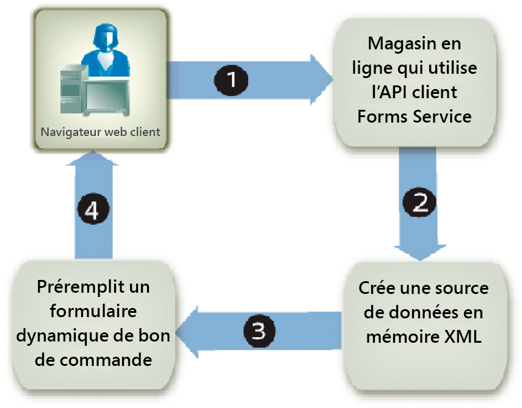

# Préremplissage des formulaires avec des dispositions souple {#prepopulating-forms-with-flowable-layouts1}

## Préremplissage des formulaires avec des dispositions souple {#prepopulating-forms-with-flowable-layouts2}

Le préremplissage de formulaires affiche les données pour les utilisateurs dans un formulaire rendu. Supposons, par exemple, qu’un utilisateur se connecte à un site Web avec un nom d’utilisateur et un mot de passe. Si l’authentification réussit, l’application cliente requête une base de données pour obtenir des informations sur l’utilisateur. Les données sont fusionnées dans le formulaire, puis le formulaire est rendu à l’utilisateur. Par conséquent, l’utilisateur peut vue des données personnalisées dans le formulaire.

La préremplissage d’un formulaire présente les avantages suivants :

* Elle permet à l’utilisateur d’afficher des données personnalisées dans un formulaire.
* Réduit la quantité de saisie effectuée par l’utilisateur pour remplir un formulaire.
* Elle assure l’intégrité des données grâce au contrôle du placement des données.

Les deux sources de données XML suivantes peuvent préremplir un formulaire :

* Source de données XDP, XML conforme à la syntaxe XFA (ou données XFDF pour préremplir un formulaire créé à l’aide d’Acrobat).
* Source de données XML arbitraire qui contient des paires nom/valeur correspondant aux noms de champ du formulaire (les exemples de cette section utilisent une source de données XML arbitraire).

Un élément XML doit exister pour chaque champ de formulaire que vous souhaitez préremplir. Le nom de l’élément XML doit correspondre au nom du champ. Un élément XML est ignoré s’il ne correspond pas à un champ de formulaire ou si le nom de l’élément XML ne correspond pas au nom du champ. Il n’est pas nécessaire de correspondre à l’ordre dans lequel les éléments XML sont affichés, tant que tous les éléments XML sont spécifiés.

Lorsque vous préremplissez un formulaire qui contient déjà des données, vous devez spécifier celles qui sont déjà affichées dans la source de données XML. Supposons qu’un formulaire contenant 10 champs comporte des données dans quatre champs. Supposons ensuite que vous souhaitiez préremplir les six champs restants. Dans ce cas, vous devez spécifier 10 éléments XML dans la source de données XML utilisée pour préremplir le formulaire. Si vous ne spécifiez que six éléments, les quatre champs d’origine sont vides.

Par exemple, vous pouvez préremplir un formulaire tel que l’exemple de formulaire de confirmation. (Voir &quot;Formulaire de confirmation&quot; dans [Rendu de PDF forms](/help/forms/developing/rendering-interactive-pdf-forms.md)interactifs.)

Pour préremplir l’exemple de formulaire de confirmation, vous devez créer une source de données XML contenant trois éléments XML qui correspondent aux trois champs du formulaire. Ce formulaire contient les trois champs suivants : `FirstName`, `LastName`et `Amount`. La première étape consiste à créer une source de données XML contenant des éléments XML qui correspondent aux champs situés dans la conception de formulaire. L’étape suivante consiste à affecter des valeurs de données aux éléments XML, comme le montre le code XML suivant.

```xml
     <Untitled>
         <FirstName>Jerry</FirstName>
         <LastName>Johnson</LastName>
         <Amount>250000</Amount>
     </Untitled>
```

Une fois que vous avez prérempli le formulaire de confirmation avec cette source de données XML, puis rendu le formulaire, les valeurs de données que vous avez attribuées aux éléments XML s’affichent, comme illustré dans le diagramme suivant.


### Préremplissage de formulaires avec des dispositions à disposition souple {#prepopulating_forms_with_flowable_layouts-1}

Les formulaires dotés de dispositions à disposition souple sont utiles pour afficher une quantité indéterminée de données pour les utilisateurs. Comme la disposition du formulaire s’ajuste automatiquement à la quantité de données fusionnées, il n’est pas nécessaire de prédéfinir une disposition ou un nombre de pages fixes pour le formulaire, comme vous le devez pour un formulaire avec une disposition fixe.

Un formulaire est généralement renseigné avec des données obtenues lors de l’exécution. Par conséquent, vous pouvez préremplir un formulaire en créant une source de données XML en mémoire et en plaçant les données directement dans la source de données XML en mémoire.

Prenons l’exemple d’une application Web, telle qu’une boutique en ligne. Une fois qu’un acheteur en ligne a terminé d’acheter des articles, tous les articles achetés sont placés dans une source de données XML en mémoire qui est utilisée pour préremplir un formulaire. Le diagramme suivant montre ce processus, qui est expliqué dans le tableau suivant le diagramme.



Le tableau suivant décrit les étapes de ce diagramme.

<table>
 <thead>
  <tr>
   <th><p>Étape</p></th>
   <th><p>Description</p></th>
  </tr>
 </thead>
 <tbody>
  <tr>
   <td><p>1</p></td>
   <td><p>Un utilisateur achète des articles dans une boutique en ligne Web. </p></td>
  </tr>
  <tr>
   <td><p>2</p></td>
   <td><p>Une fois que l’utilisateur a terminé d’acheter des éléments et cliqué sur le bouton Envoyer, une source de données XML en mémoire est créée. Les éléments achetés et les informations utilisateur sont placés dans la source de données XML en mémoire. </p></td>
  </tr>
  <tr>
   <td><p>3</p></td>
   <td><p>La source de données XML est utilisée pour préremplir un formulaire de bon de commande (un exemple de ce formulaire est illustré ci-dessous). </p></td>
  </tr>
  <tr>
   <td><p>4</p></td>
   <td><p>Le formulaire de bon de commande est rendu au navigateur Web client. </p></td>
  </tr>
 </tbody>
</table>

Le diagramme suivant illustre un exemple de formulaire de bon de commande. Les informations du tableau peuvent être ajustées au nombre d’enregistrements des données XML.


>[!NOTE]
>
>Un formulaire peut être prérempli avec des données provenant d’autres sources, telles qu’une base de données d’entreprise ou des applications externes.

### Considérations relatives à la conception de formulaire {#form-design-considerations}

Les formulaires dotés de dispositions souples sont basés sur les conceptions de formulaire créées dans Designer. Une conception de formulaire spécifie un ensemble de règles de disposition, de présentation et de capture de données, y compris le calcul de valeurs en fonction des entrées utilisateur. Les règles sont appliquées lorsque des données sont entrées dans un formulaire. Les champs ajoutés à un formulaire sont des sous-formulaires qui se trouvent dans la conception de formulaire. Par exemple, dans le formulaire de bon de commande illustré dans le diagramme précédent, chaque ligne est un sous-formulaire. Pour plus d’informations sur la création d’une conception de formulaire contenant des sous-formulaires, voir [Création d’un formulaire de bon de commande doté d’une disposition](https://www.adobe.com/go/learn_aemforms_qs_poformflowable_9)souple.

### Présentation des sous-groupes de données {#understanding-data-subgroups}

Une source de données XML est utilisée pour préremplir les formulaires avec des dispositions fixes et des dispositions souples. Cependant, la différence réside dans le fait qu’une source de données XML qui préremplit un formulaire avec une disposition souple contient des éléments XML répétitifs qui sont utilisés pour préremplir les sous-formulaires qui sont répétés dans le formulaire. Ces éléments XML répétitifs sont appelés sous-groupes de données.

Une source de données XML utilisée pour préremplir le formulaire de bon de commande illustré dans le diagramme précédent contient quatre sous-groupes de données qui se répètent. Chaque sous-groupe de données correspond à un article acheté. Les articles achetés sont un écran, une lampe de bureau, un téléphone et un carnet d&#39;adresses.

La source de données XML suivante est utilisée pour préremplir le formulaire de bon de commande.

```xml
     <header>
         <!-- XML elements used to prepopulate non-repeating fields such as address
         <!and city
         <txtPONum>8745236985</txtPONum>
         <dtmDate>2004-02-08</dtmDate>
         <txtOrderedByCompanyName>Any Company Name</txtOrderedByCompanyName>
         <txtOrderedByAddress>555, Any Blvd.</txtOrderedByAddress>
         <txtOrderedByCity>Any City</txtOrderedByCity>
         <txtOrderedByStateProv>ST</txtOrderedByStateProv>
         <txtOrderedByZipCode>12345</txtOrderedByZipCode>
         <txtOrderedByCountry>Any Country</txtOrderedByCountry>
         <txtOrderedByPhone>(123) 456-7890</txtOrderedByPhone>
         <txtOrderedByFax>(123) 456-7899</txtOrderedByFax>
         <txtOrderedByContactName>Contact Name</txtOrderedByContactName>
         <txtDeliverToCompanyName>Any Company Name</txtDeliverToCompanyName>
         <txtDeliverToAddress>7895, Any Street</txtDeliverToAddress>
         <txtDeliverToCity>Any City</txtDeliverToCity>
         <txtDeliverToStateProv>ST</txtDeliverToStateProv>
         <txtDeliverToZipCode>12346</txtDeliverToZipCode>
         <txtDeliverToCountry>Any Country</txtDeliverToCountry>
         <txtDeliverToPhone>(123) 456-7891</txtDeliverToPhone>
         <txtDeliverToFax>(123) 456-7899</txtDeliverToFax>
         <txtDeliverToContactName>Contact Name</txtDeliverToContactName>
     </header>
     <detail>
         <!-- A data subgroup that contains information about the monitor>
         <txtPartNum>00010-100</txtPartNum>
         <txtDescription>Monitor</txtDescription>
         <numQty>1</numQty>
         <numUnitPrice>350.00</numUnitPrice>
     </detail>
     <detail>
         <!-- A data subgroup that contains information about the desk lamp>
         <txtPartNum>00010-200</txtPartNum>
         <txtDescription>Desk lamps</txtDescription>
         <numQty>3</numQty>
         <numUnitPrice>55.00</numUnitPrice>
     </detail>
     <detail>
         <!-- A data subgroup that contains information about the Phone>
             <txtPartNum>00025-275</txtPartNum>
             <txtDescription>Phone</txtDescription>
             <numQty>5</numQty>
             <numUnitPrice>85.00</numUnitPrice>
     </detail>
     <detail>
         <!-- A data subgroup that contains information about the address book>
         <txtPartNum>00300-896</txtPartNum>
         <txtDescription>Address book</txtDescription>
         <numQty>2</numQty>
         <numUnitPrice>15.00</numUnitPrice>
     </detail>
```

Notez que chaque sous-groupe de données contient quatre éléments XML qui correspondent à ces informations :

* Numéro de pièce d&#39;articles
* Description des éléments
* Quantité d&#39;articles
* Prix unitaire

Le nom de l’élément XML parent d’un sous-groupe de données doit correspondre au nom du sous-formulaire situé dans la conception de formulaire. Par exemple, dans le diagramme précédent, notez que le nom de l’élément XML parent du sous-groupe de données est `detail`. Cela correspond au nom du sous-formulaire qui se trouve dans la conception de formulaire sur laquelle repose le formulaire de bon de commande. Si le nom de l’élément XML parent du sous-groupe de données et le sous-formulaire ne correspondent pas, aucun formulaire côté serveur n’est prérempli.

Chaque sous-groupe de données doit contenir des éléments XML correspondant aux noms de champ du sous-formulaire. Le `detail` sous-formulaire de la conception de formulaire contient les champs suivants :

* txtPartNum
* txtDescription
* numQty
* numUnitPrice

>[!NOTE]
>
>Si vous tentez de préremplir un formulaire avec une source de données contenant des éléments XML répétitifs et que vous définissez l’ `RenderAtClient` option sur `No`, seul le premier enregistrement de données est fusionné dans le formulaire. Pour vous assurer que tous les enregistrements de données sont fusionnés dans le formulaire, définissez la variable `RenderAtClient` sur `Yes`. Pour plus d’informations sur l’ `RenderAtClient` option, voir [Rendu de formulaires sur le client](/help/forms/developing/rendering-forms-client.md).

>[!NOTE]
>
>For more information about the Forms service, see [Services Reference for AEM Forms](https://www.adobe.com/go/learn_aemforms_services_63).

### Résumé des étapes {#summary-of-steps}

Pour préremplir un formulaire avec une disposition souple, effectuez les tâches suivantes :

1. Incluez des fichiers de projet.
1. Créez une source de données XML en mémoire.
1. Convertir la source de données XML.
1. Générer un formulaire prérempli.

**Inclure les fichiers de projet**

Incluez les fichiers nécessaires dans votre projet de développement. Si vous créez une application cliente à l’aide de Java, incluez les fichiers JAR nécessaires. Si vous utilisez des services Web, veillez à inclure les fichiers proxy.

**Inclure les fichiers de projet**

Incluez les fichiers nécessaires dans votre projet de développement. Si vous créez une application cliente à l’aide de Java, incluez les fichiers JAR nécessaires. Si vous utilisez des services Web, veillez à inclure les fichiers proxy.

**Création d’une source de données XML en mémoire**

Vous pouvez utiliser `org.w3c.dom` des classes pour créer une source de données XML en mémoire afin de préremplir un formulaire avec une disposition souple. Vous devez placer les données dans une source de données XML conforme au formulaire. Pour plus d’informations sur la relation entre un formulaire avec une disposition souple et la source de données XML, voir [Présentation des sous-groupes](#understanding-data-subgroups)de données.

**Conversion de la source de données XML**

Une source de données XML en mémoire créée à l’aide de `org.w3c.dom` classes peut être convertie en objet `com.adobe.idp.Document` avant de pouvoir être utilisée pour préremplir un formulaire. Une source de données XML en mémoire peut être convertie à l’aide des classes de transformation XML Java.

>[!NOTE]
>
>Si vous utilisez le fichier WSDL du service Forms pour préremplir un formulaire, vous devez convertir un `org.w3c.dom.Document` objet en `BLOB` objet.

**Générer un formulaire prérempli**

Vous générez un formulaire prérempli comme tout autre formulaire. La seule différence est que vous utilisez l’ `com.adobe.idp.Document` objet qui contient la source de données XML pour préremplir le formulaire.

**Voir également**

[Inclusion des fichiers de bibliothèque Java AEM Forms](/help/forms/developing/invoking-aem-forms-using-java.md#including-aem-forms-java-library-files)

[Réglage des propriétés de la connexion](/help/forms/developing/invoking-aem-forms-using-java.md#setting-connection-properties)

[Débuts rapides de l’API Forms Service](/help/forms/developing/forms-service-api-quick-starts.md#forms-service-api-quick-starts)

[Rendu des PDF forms interactifs](/help/forms/developing/rendering-interactive-pdf-forms.md)

[Création d’Applications web renvoyant des formulaires](/help/forms/developing/creating-web-applications-renders-forms.md)

### Préremplissage de formulaires à l’aide de l’API Java {#prepopulating-forms-using-the-java-api}

Pour préremplir un formulaire avec une disposition souple à l’aide de l’API Forms (Java), procédez comme suit :

1. Inclure les fichiers de projet

   Incluez des fichiers JAR client, tels que adobe-forms-client.jar, dans le chemin de classe de votre projet Java. Pour plus d’informations sur l’emplacement de ces fichiers, voir [Inclusion des fichiers de bibliothèque Java AEM Forms](/help/forms/developing/invoking-aem-forms-using-java.md#including-aem-forms-java-library-files).

1. Création d’une source de données XML en mémoire

   * Créez un objet Java `DocumentBuilderFactory` en appelant la `DocumentBuilderFactory` méthode `newInstance` class.
   * Créez un objet Java `DocumentBuilder` en appelant la `DocumentBuilderFactory` méthode de l’ `newDocumentBuilder` objet.
   * Appelez la méthode `DocumentBuilder` de l’ `newDocument` objet pour instancier un `org.w3c.dom.Document` objet.
   * Créez l’élément racine de la source de données XML en appelant la `org.w3c.dom.Document` `createElement` méthode de l’objet. Ceci crée un objet `Element` qui représente l’élément racine. Transmettez à la `createElement` méthode une valeur de chaîne représentant le nom de l’élément. Convertissez la valeur de retour en `Element`. Ensuite, ajoutez l’élément racine au document en appelant la `Document` `appendChild` méthode de l’objet et transmettez l’objet de l’élément racine en tant qu’argument. Les lignes de code suivantes présentent cette logique d’application :

      ` Element root = (Element)document.createElement("transaction");  document.appendChild(root);`

   * Créez l’élément d’en-tête de la source de données XML en appelant la `Document` `createElement` méthode de l’objet. Transmettez à la `createElement` méthode une valeur de chaîne représentant le nom de l’élément. Convertissez la valeur de retour en `Element`. Ensuite, ajoutez l’élément d’en-tête à l’élément racine en appelant la `root` `appendChild` méthode de l’objet et transmettez l’objet d’élément d’en-tête en tant qu’argument. Les éléments XML ajoutés à l’élément d’en-tête correspondent à la partie statique du formulaire. Les lignes de code suivantes présentent cette logique d’application :

      ` Element header = (Element)document.createElement("header");  root.appendChild(header);`

   * Créez un élément enfant qui appartient à l’élément d’en-tête en appelant la `Document` `createElement` méthode de l’objet et transmettez une valeur de chaîne qui représente le nom de l’élément. Convertissez la valeur de retour en `Element`. Ensuite, définissez une valeur pour l’élément enfant en appelant sa `appendChild` méthode et transmettez la méthode de l’ `Document` objet `createTextNode` en tant qu’argument. Spécifiez une valeur de chaîne qui apparaît comme valeur de l’élément enfant. Enfin, ajoutez l’élément enfant à l’élément d’en-tête en appelant la `appendChild` méthode de l’élément d’en-tête et transmettez l’objet d’élément enfant en tant qu’argument. Les lignes de code suivantes présentent cette logique d’application :

      ` Element poNum= (Element)document.createElement("txtPONum");  poNum.appendChild(document.createTextNode("8745236985"));  header.appendChild(LastName);`


   * Ajoutez tous les éléments restants à l’élément d’en-tête en répétant la dernière sous-étape pour chaque champ apparaissant dans la partie statique du formulaire (dans le diagramme de la source de données XML, ces champs sont affichés dans la section A. (Voir [Présentation des sous-groupes](#understanding-data-subgroups)de données.)
   * Créez l’élément de détail de la source de données XML en appelant la `Document` `createElement` méthode de l’objet. Transmettez à la `createElement` méthode une valeur de chaîne représentant le nom de l’élément. Convertissez la valeur de retour en `Element`. Ensuite, ajoutez l’élément de détail à l’élément racine en appelant la `root` `appendChild` méthode de l’objet et transmettez l’objet d’élément de détail en tant qu’argument. Les éléments XML ajoutés à l’élément de détail correspondent à la partie dynamique du formulaire. Les lignes de code suivantes présentent cette logique d’application :

      ` Element detail = (Element)document.createElement("detail");  root.appendChild(detail);`

   * Créez un élément enfant qui appartient à l’élément de détail en appelant la `Document` `createElement` méthode de l’objet et transmettez une valeur de chaîne qui représente le nom de l’élément. Convertissez la valeur de retour en `Element`. Ensuite, définissez une valeur pour l’élément enfant en appelant sa `appendChild` méthode et transmettez la méthode de l’ `Document` objet `createTextNode` en tant qu’argument. Spécifiez une valeur de chaîne qui apparaît comme valeur de l’élément enfant. Enfin, ajoutez l’élément enfant à l’élément de détail en appelant la `appendChild` méthode de l’élément de détail et transmettez l’objet d’élément enfant en tant qu’argument. Les lignes de code suivantes présentent cette logique d’application :

      ` Element txtPartNum = (Element)document.createElement("txtPartNum");  txtPartNum.appendChild(document.createTextNode("00010-100"));  detail.appendChild(txtPartNum);`

   * Répétez la dernière sous-étape pour tous les éléments XML à ajouter à l’élément de détail. Pour créer correctement la source de données XML utilisée pour remplir le formulaire de bon de commande, vous devez ajouter les éléments XML suivants à l’élément de détail : `txtDescription`, `numQty`et `numUnitPrice`.
   * Répétez les deux dernières sous-étapes pour tous les éléments de données utilisés pour préremplir le formulaire.

1. Conversion de la source de données XML

   * Créez un `javax.xml.transform.Transformer` objet en appelant la méthode `javax.xml.transform.Transformer` statique de l’ `newInstance` objet.
   * Créez un `Transformer` objet en appelant la `TransformerFactory` méthode de l’ `newTransformer` objet.
   * Créez un objet `ByteArrayOutputStream` en utilisant son constructeur.
   * Créez un `javax.xml.transform.dom.DOMSource` objet en utilisant son constructeur et en transmettant l’ `org.w3c.dom.Document` objet créé à l’étape 1.
   * Créez un objet `javax.xml.transform.dom.DOMSource` en utilisant son constructeur et en transmettant l’objet `ByteArrayOutputStream`. 
   * Renseignez l’ `ByteArrayOutputStream` objet Java en appelant la `javax.xml.transform.Transformer` méthode de l’ `transform` objet et en transmettant les `javax.xml.transform.dom.DOMSource` et les `javax.xml.transform.stream.StreamResult` objets.
   * Créez un tableau d’octets et affectez la taille de l’ `ByteArrayOutputStream` objet au tableau d’octets.
   * Renseignez le tableau d’octets en appelant la `ByteArrayOutputStream` `toByteArray` méthode de l’objet.
   * Create a `com.adobe.idp.Document` object by using its constructor and passing the byte array.

1. Générer un formulaire prérempli

   Appelez la méthode `FormsServiceClient` de l’ `renderPDFForm` objet et transmettez les valeurs suivantes :

   * Valeur de chaîne qui spécifie le nom de la conception de formulaire, y compris l’extension du nom de fichier.
   * Objet `com.adobe.idp.Document` contenant des données à fusionner avec le formulaire. Assurez-vous d’utiliser l’ `com.adobe.idp.Document` objet créé aux étapes 1 et 2.
   * Objet `PDFFormRenderSpec` qui stocke les options d’exécution.
   * Objet `URLSpec` contenant des valeurs URI requises par le service Forms.
   * Objet `java.util.HashMap` qui stocke les pièces jointes. Il s’agit d’un paramètre facultatif que vous pouvez spécifier `null` si vous ne souhaitez pas joindre de fichiers au formulaire.

   La `renderPDFForm` méthode renvoie un `FormsResult` objet qui contient un flux de données de formulaire qui doit être écrit dans le navigateur Web client.

   * Créez un `javax.servlet.ServletOutputStream` objet utilisé pour envoyer un flux de données de formulaire au navigateur Web client.
   * Créez un `com.adobe.idp.Document` objet en appelant la `FormsResult` méthode de l’ `getOutputContent` objet.
   * Créez un `java.io.InputStream` objet en appelant la `com.adobe.idp.Document` méthode de l’ `getInputStream` objet.
   * Créez un tableau d’octets pour le remplir avec le flux de données du formulaire en invoquant la `InputStream` `read` méthode de l’objet et en transmettant le tableau d’octets comme argument.
   * Appelez la méthode `javax.servlet.ServletOutputStream` de l’objet `write` pour envoyer le flux de données du formulaire au navigateur Web client. Transférez le tableau d’octets à la `write` méthode.


**Voir également**

[Début rapide (mode SOAP) : Préremplissage de formulaires avec des dispositions souple à l’aide de l’API Java](/help/forms/developing/forms-service-api-quick-starts.md#quick-start-soap-mode-prepopulating-forms-with-flowable-layouts-using-the-java-api)

[Inclusion des fichiers de bibliothèque Java AEM Forms](/help/forms/developing/invoking-aem-forms-using-java.md#including-aem-forms-java-library-files)

[Réglage des propriétés de la connexion](/help/forms/developing/invoking-aem-forms-using-java.md#setting-connection-properties)

### Préremplissage de formulaires à l’aide de l’API du service Web {#prepopulating-forms-using-the-web-service-api}

Pour préremplir un formulaire avec une disposition souple à l’aide de l’API Forms (service Web), procédez comme suit :

1. Inclure les fichiers de projet

   * Créez des classes de proxy Java qui utilisent le WSDL du service Forms. (Voir [Création de classes de proxy Java à l’aide d’Apache Axis](/help/forms/developing/invoking-aem-forms-using-web.md#creating-java-proxy-classes-using-apache-axis).)
   * Incluez les classes proxy Java dans votre chemin de classe.

1. Création d’une source de données XML en mémoire

   * Créez un objet Java `DocumentBuilderFactory` en appelant la `DocumentBuilderFactory` méthode `newInstance` class.
   * Créez un objet Java `DocumentBuilder` en appelant la `DocumentBuilderFactory` méthode de l’ `newDocumentBuilder` objet.
   * Appelez la méthode `DocumentBuilder` de l’ `newDocument` objet pour instancier un `org.w3c.dom.Document` objet.
   * Créez l’élément racine de la source de données XML en appelant la `org.w3c.dom.Document` `createElement` méthode de l’objet. Ceci crée un objet `Element` qui représente l’élément racine. Transmettez à la `createElement` méthode une valeur de chaîne représentant le nom de l’élément. Convertissez la valeur de retour en `Element`. Ensuite, ajoutez l’élément racine au document en appelant la `Document` `appendChild` méthode de l’objet et transmettez l’objet de l’élément racine en tant qu’argument. Les lignes de code suivantes présentent cette logique d’application :

      ` Element root = (Element)document.createElement("transaction");  document.appendChild(root);`

   * Créez l’élément d’en-tête de la source de données XML en appelant la `Document` `createElement` méthode de l’objet. Transmettez à la `createElement` méthode une valeur de chaîne représentant le nom de l’élément. Convertissez la valeur de retour en `Element`. Ensuite, ajoutez l’élément d’en-tête à l’élément racine en appelant la `root` `appendChild` méthode de l’objet et transmettez l’objet d’élément d’en-tête en tant qu’argument. Les éléments XML ajoutés à l’élément d’en-tête correspondent à la partie statique du formulaire. Les lignes de code suivantes présentent cette logique d’application :

      ` Element header = (Element)document.createElement("header");  root.appendChild(header);`

   * Créez un élément enfant qui appartient à l’élément d’en-tête en appelant la `Document` `createElement` méthode de l’objet et transmettez une valeur de chaîne qui représente le nom de l’élément. Convertissez la valeur de retour en `Element`. Ensuite, définissez une valeur pour l’élément enfant en appelant sa `appendChild` méthode et transmettez la méthode de l’ `Document` objet `createTextNode` en tant qu’argument. Spécifiez une valeur de chaîne qui apparaît comme valeur de l’élément enfant. Enfin, ajoutez l’élément enfant à l’élément d’en-tête en appelant la `appendChild` méthode de l’élément d’en-tête et transmettez l’objet d’élément enfant en tant qu’argument. Les lignes de code suivantes présentent cette logique d’application :

      ` Element poNum= (Element)document.createElement("txtPONum");  poNum.appendChild(document.createTextNode("8745236985"));  header.appendChild(LastName);`

   * Ajoutez tous les éléments restants à l’élément d’en-tête en répétant la dernière sous-étape pour chaque champ apparaissant dans la partie statique du formulaire (dans le diagramme de la source de données XML, ces champs sont affichés dans la section A. (Voir [Présentation des sous-groupes](#understanding-data-subgroups)de données.)
   * Créez l’élément de détail de la source de données XML en appelant la `Document` `createElement` méthode de l’objet. Transmettez à la `createElement` méthode une valeur de chaîne représentant le nom de l’élément. Convertissez la valeur de retour en `Element`. Ensuite, ajoutez l’élément de détail à l’élément racine en appelant la `root` `appendChild` méthode de l’objet et transmettez l’objet d’élément de détail en tant qu’argument. Les éléments XML ajoutés à l’élément de détail correspondent à la partie dynamique du formulaire. Les lignes de code suivantes présentent cette logique d’application :

      ` Element detail = (Element)document.createElement("detail");  root.appendChild(detail);`

   * Créez un élément enfant qui appartient à l’élément de détail en appelant la `Document` `createElement` méthode de l’objet et transmettez une valeur de chaîne qui représente le nom de l’élément. Convertissez la valeur de retour en `Element`. Ensuite, définissez une valeur pour l’élément enfant en appelant sa `appendChild` méthode et transmettez la méthode de l’ `Document` objet `createTextNode` en tant qu’argument. Spécifiez une valeur de chaîne qui apparaît comme valeur de l’élément enfant. Enfin, ajoutez l’élément enfant à l’élément de détail en appelant la `appendChild` méthode de l’élément de détail et transmettez l’objet d’élément enfant en tant qu’argument. Les lignes de code suivantes présentent cette logique d’application :

      ` Element txtPartNum = (Element)document.createElement("txtPartNum");  txtPartNum.appendChild(document.createTextNode("00010-100"));  detail.appendChild(txtPartNum);`

   * Répétez la dernière sous-étape pour tous les éléments XML à ajouter à l’élément de détail. Pour créer correctement la source de données XML utilisée pour remplir le formulaire de bon de commande, vous devez ajouter les éléments XML suivants à l’élément de détail : `txtDescription`, `numQty`et `numUnitPrice`.
   * Répétez les deux dernières sous-étapes pour tous les éléments de données utilisés pour préremplir le formulaire.

1. Conversion de la source de données XML

   * Créez un `javax.xml.transform.Transformer` objet en appelant la méthode `javax.xml.transform.Transformer` statique de l’ `newInstance` objet.
   * Créez un `Transformer` objet en appelant la `TransformerFactory` méthode de l’ `newTransformer` objet.
   * Créez un objet `ByteArrayOutputStream` en utilisant son constructeur.
   * Créez un `javax.xml.transform.dom.DOMSource` objet en utilisant son constructeur et en transmettant l’ `org.w3c.dom.Document` objet créé à l’étape 1.
   * Créez un objet `javax.xml.transform.dom.DOMSource` en utilisant son constructeur et en transmettant l’objet `ByteArrayOutputStream`. 
   * Renseignez l’ `ByteArrayOutputStream` objet Java en appelant la `javax.xml.transform.Transformer` méthode de l’ `transform` objet et en transmettant les `javax.xml.transform.dom.DOMSource` et les `javax.xml.transform.stream.StreamResult` objets.
   * Créez un tableau d’octets et affectez la taille de l’ `ByteArrayOutputStream` objet au tableau d’octets.
   * Renseignez le tableau d’octets en appelant la `ByteArrayOutputStream` `toByteArray` méthode de l’objet.
   * Créez un `BLOB` objet à l’aide de son constructeur, appelez sa `setBinaryData` méthode et transmettez le tableau d’octets.

1. Générer un formulaire prérempli

   Appelez la méthode `FormsService` de l’ `renderPDFForm` objet et transmettez les valeurs suivantes :

   * Valeur de chaîne qui spécifie le nom de la conception de formulaire, y compris l’extension du nom de fichier.
   * Objet `BLOB` contenant des données à fusionner avec le formulaire. Assurez-vous d’utiliser l’ `BLOB` objet créé lors des étapes 1 et 2.
   * Objet `PDFFormRenderSpecc` qui stocke les options d’exécution. For more information, see [AEM Forms API Reference](https://www.adobe.com/go/learn_aemforms_javadocs_63_en).
   * Objet `URLSpec` contenant des valeurs URI requises par le service Forms.
   * Objet `java.util.HashMap` qui stocke les pièces jointes. Il s’agit d’un paramètre facultatif que vous pouvez spécifier `null` si vous ne souhaitez pas joindre de fichiers au formulaire.
   * Objet vide `com.adobe.idp.services.holders.BLOBHolder` rempli par la méthode. Elle permet de stocker le formulaire PDF rendu.
   * Objet vide `javax.xml.rpc.holders.LongHolder` rempli par la méthode. (Cet argument stocke le nombre de pages dans le formulaire).
   * Objet vide `javax.xml.rpc.holders.StringHolder` rempli par la méthode. (Cet argument stocke la valeur du paramètre régional).
   * Objet vide `com.adobe.idp.services.holders.FormsResultHolder` qui contiendra les résultats de cette opération.

   La `renderPDFForm` méthode remplit l’ `com.adobe.idp.services.holders.FormsResultHolder` objet transmis en tant que valeur du dernier argument avec un flux de données de formulaire qui doit être écrit dans le navigateur Web client.

   * Créez un `FormResult` objet en obtenant la valeur du membre `com.adobe.idp.services.holders.FormsResultHolder` de données de l’ `value` objet.
   * Créez un `BLOB` objet contenant des données de formulaire en appelant la `FormsResult` méthode de l’ `getOutputContent` objet.
   * Obtenez le type de contenu de l’ `BLOB` objet en appelant sa `getContentType` méthode.
   * Définissez le type de contenu de l’ `javax.servlet.http.HttpServletResponse` objet en appelant sa `setContentType` méthode et en transmettant le type de contenu de l’ `BLOB` objet.
   * Créez un `javax.servlet.ServletOutputStream` objet utilisé pour écrire le flux de données du formulaire dans le navigateur Web client en appelant la `javax.servlet.http.HttpServletResponse` méthode de l’ `getOutputStream` objet.
   * Créez un tableau d’octets et remplissez-le en appelant la `BLOB` `getBinaryData` méthode de l’objet. Cette tâche affecte le contenu de l’ `FormsResult` objet au tableau d’octets.
   * Appelez la méthode `javax.servlet.http.HttpServletResponse` de l’objet `write` pour envoyer le flux de données du formulaire au navigateur Web client. Transférez le tableau d’octets à la `write` méthode.

   >[!NOTE]
   >
   >La `renderPDFForm` méthode remplit l’ `com.adobe.idp.services.holders.FormsResultHolder` objet transmis en tant que valeur du dernier argument avec un flux de données de formulaire qui doit être écrit dans le navigateur Web client.

**Voir également**

[Appel de AEM Forms à l’aide du codage Base64](/help/forms/developing/invoking-aem-forms-using-web.md#invoking-aem-forms-using-base64-encoding)

