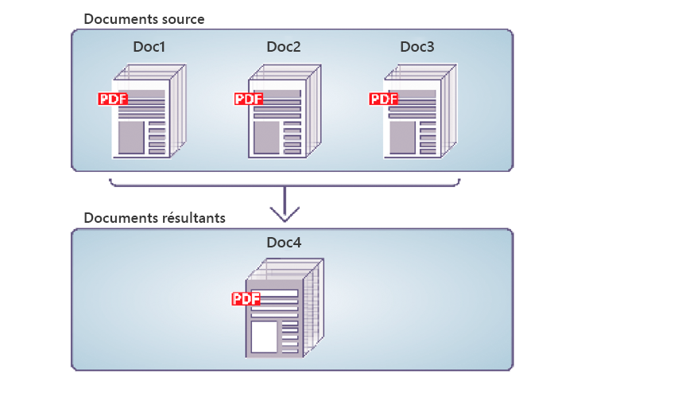

# Assemblage par programmation de Documents PDF {#programmatically-assembling-pdf-documents}

**Les exemples et exemples de ce document ne concernent que l’environnement AEM Forms on JEE.**

Vous pouvez utiliser l’API Service Assembler pour assembler plusieurs documents PDF en un seul document PDF. L’illustration suivante montre trois documents PDF fusionnés en un seul document PDF.



Pour assembler plusieurs documents PDF en un seul document PDF, vous devez disposer d’un document DDX. Un document DDX décrit le document PDF produit par le service Assembler. En d’autres termes, le document DDX indique au service Assembler quelles actions exécuter.

Aux fins de cette discussion, supposons que le document DDX suivant soit utilisé.

```xml
 <?xml version="1.0" encoding="UTF-8"?>
 <DDX xmlns="https://ns.adobe.com/DDX/1.0/">
     <PDF result="out.pdf">
         <PDF source="map.pdf" />
         <PDF source="directions.pdf" />
     </PDF>
 </DDX>
```

Ce document DDX fusionne en un seul document PDF deux documents PDF nommés *map.pdf* et *directions.pdf*.

>[!NOTE]
>
>Pour voir un document DDX qui désassemble un document PDF, voir [Déassemblage par programmation de Documents PDF](/help/forms/developing/programmatically-disassembling-pdf-documents.md#programmatically-disassembling-pdf-documents).

>[!NOTE]
>
>Pour plus d’informations sur le service Assembler, voir [Guide de référence des services pour AEM Forms](https://www.adobe.com/go/learn_aemforms_services_63).

>[!NOTE]
>
>Pour plus d’informations sur un document DDX, voir [Service Assembler et Référence DDX](https://www.adobe.com/go/learn_aemforms_ddx_63).

## Considérations relatives à l’appel du service Assembler à l’aide de services Web {#considerations-when-invoking-assembler-service-using-web-services}

Lorsque vous ajoutez des en-têtes et des pieds de page lors de l&#39;assemblage de documents volumineux, vous pouvez rencontrer une erreur `OutOfMemory` et les fichiers ne seront pas assemblés. Pour réduire les risques que ce problème se produise, ajoutez un élément `DDXProcessorSetting` à votre document DDX, comme indiqué dans l’exemple suivant.

`<DDXProcessorSetting name="checkpoint" value="2000" />`

Vous pouvez ajouter cet élément en tant qu’enfant de l’élément `DDX` ou enfant d’un élément `PDF result`. La valeur par défaut de ce paramètre est 0 (zéro), ce qui désactive la coche et le DDX se comporte comme si l’élément `DDXProcessorSetting` n’était pas présent. Si vous avez rencontré une erreur `OutOfMemory`, vous devrez peut-être définir la valeur sur un entier, généralement entre 500 et 5000. Une petite valeur de point de contrôle entraîne un pointage plus fréquent.

## Résumé des étapes {#summary-of-steps}

Pour assembler un document PDF unique à partir de plusieurs documents PDF, effectuez les tâches suivantes :

1. Incluez des fichiers de projet.
1. Créez un client PDF Assembler.
1. Référencez un document DDX existant.
1. Documents PDF d’entrée de référence.
1. Définissez les options d’exécution.
1. Assemblage des documents PDF d’entrée.
1. Extrayez les résultats.

**Inclure les fichiers de projet**

Incluez les fichiers nécessaires dans votre projet de développement. Si vous créez une application cliente à l’aide de Java, incluez les fichiers JAR nécessaires. Si vous utilisez des services Web, veillez à inclure les fichiers proxy.

Les fichiers JAR suivants doivent être ajoutés au chemin de classe de votre projet :

* adobe-livecycle-client.jar
* adobe-usermanager-client.jar
* adobe-assembler-client.jar
* adobe-utilities.jar (requis si AEM Forms est déployé sur JBoss)
* jbossall-client.jar (requis si AEM Forms est déployé sur JBoss)

si AEM Forms est déployé sur un serveur d’applications J2EE pris en charge autre que JBoss, vous devez remplacer les fichiers adobe-utilities.jar et jbossall-client.jar par des fichiers JAR spécifiques au serveur d’applications J2EE sur lequel AEM Forms est déployé.

**Création d’un client PDF Assembler**

Avant de pouvoir exécuter une opération Assembler par programmation, vous devez créer un client Assembler.

**Référencer un document DDX existant**

Un document DDX doit être référencé pour assembler un document PDF. Prenons l’exemple du document DDX introduit dans cette section. Ce document DDX demande au service Assembler de fusionner deux documents PDF en un seul document PDF.

**Documents PDF d’entrée de référence**

Référencez les documents PDF d’entrée que vous souhaitez transmettre au service Assembler. Par exemple, si vous souhaitez transmettre deux documents PDF d’entrée nommés Carte et Direction, vous devez transmettre les fichiers PDF correspondants.

Le fichier map.pdf et le fichier directions.pdf doivent tous deux être placés dans un objet de collection. Le nom de la clé doit correspondre à la valeur de l’attribut source PDF dans le document DDX. Peu importe le nom du fichier PDF si la clé et l’attribut source du document DDX correspondent.

>[!NOTE]
>
>Un objet `AssemblerResult`, qui contient un objet de collection, est renvoyé si vous appelez l&#39;opération `invokeDDX`. Cette opération est utilisée lorsque vous transmettez au service Assembler deux ou plusieurs documents PDF d’entrée. Cependant, si vous ne transmettez qu’un seul fichier PDF d’entrée au service Assembler et que vous ne prévoyez qu’un seul document de retour, appelez l’opération `invokeOneDocument`. Lors de l’appel de cette opération, un seul document est renvoyé. Pour plus d’informations sur l’utilisation de cette opération, voir [Assemblage de Documents PDF chiffrés](/help/forms/developing/assembling-encrypted-pdf-documents.md#assembling-encrypted-pdf-documents).

**Définition des options d’exécution**

Vous pouvez définir des options d’exécution qui contrôlent le comportement du service Assembler lorsqu’il effectue une tâche. Par exemple, vous pouvez définir une option qui indique au service Assembler de continuer à traiter une tâche en cas d’erreur. Pour plus d&#39;informations sur les options d&#39;exécution que vous pouvez définir, consultez la référence de classe `AssemblerOptionSpec` dans [AEM Forms API Reference](https://www.adobe.com/go/learn_aemforms_javadocs_63_en).

**Assemblage des documents PDF d’entrée**

Après avoir créé le client de service, référencé un fichier DDX, créé un objet de collection qui stocke les documents PDF d’entrée et défini les options d’exécution, vous pouvez appeler l’opération DDX. Lors de l’utilisation du document DDX spécifié dans cette section, les fichiers map.pdf et direction.pdf sont fusionnés en un document PDF.

**Extraire les résultats**

Le service Assembler renvoie un objet `java.util.Map`, qui peut être obtenu à partir de l&#39;objet `AssemblerResult` et qui contient les résultats de l&#39;opération. L&#39;objet `java.util.Map` renvoyé contient les documents résultants et les exceptions éventuelles.

Le tableau suivant récapitule certaines des valeurs clés et types d&#39;objet qui peuvent se trouver dans l&#39;objet `java.util.Map` renvoyé.

<table>
 <thead>
  <tr>
   <th><p>Valeur clé</p></th>
   <th><p>Type d’objet</p></th>
   <th><p>Description</p></th>
  </tr>
 </thead>
 <tbody>
  <tr>
   <td><p><code><i>documentName</i></code></p></td>
   <td><p><code>com.adobe.idp.Document</code></p></td>
   <td><p>Contient les documents résultants spécifiés dans un élément cible DDX</p></td>
  </tr>
  <tr>
   <td><p><code><i>documentName</i></code></p></td>
   <td><p><code>Exception</code></p></td>
   <td><p>Contient toute exception pour le document</p></td>
  </tr>
  <tr>
   <td><p><code>OutputMapConstants.LOG_NAME</code></p></td>
   <td><p><code>com.adobe.idp.Documen</code></p></td>
   <td><p>Contient le journal des tâches</p></td>
  </tr>
 </tbody>
</table>

**Voir également**

[Inclusion des fichiers de bibliothèque Java AEM Forms](/help/forms/developing/invoking-aem-forms-using-java.md#including-aem-forms-java-library-files)

[Réglage des propriétés de la connexion](/help/forms/developing/invoking-aem-forms-using-java.md#setting-connection-properties)

[Démontage programmatique des Documents PDF](/help/forms/developing/programmatically-disassembling-pdf-documents.md#programmatically-disassembling-pdf-documents)

## Assemblage de documents PDF à l’aide de l’API Java {#assemble-pdf-documents-using-the-java-api}

Assemblage d’un document PDF à l’aide de l’API Service Assembler (Java) :

1. Incluez des fichiers de projet.

   Incluez des fichiers JAR client, tels que adobe-assembler-client.jar, dans le chemin de classe de votre projet Java.

1. Créez un client PDF Assembler.

   * Créez un objet `ServiceClientFactory` qui contient des propriétés de connexion.
   * Créez un objet `AssemblerServiceClient` en utilisant son constructeur et en transmettant l&#39;objet `ServiceClientFactory`.

1. Référencez un document DDX existant.

   * Créez un objet `java.io.FileInputStream` qui représente le document DDX en utilisant son constructeur et en transmettant une valeur de chaîne qui spécifie l’emplacement du fichier DDX.
   * Créez un objet `com.adobe.idp.Document` en utilisant son constructeur et en transmettant l’objet `java.io.FileInputStream`. 

1. Documents PDF d’entrée de référence.

   * Créez un objet `java.util.Map` utilisé pour stocker des documents PDF d’entrée à l’aide d’un constructeur `HashMap`.
   * Pour chaque document PDF d’entrée, créez un objet `java.io.FileInputStream` en utilisant son constructeur et en transmettant l’emplacement du document PDF d’entrée.
   * Pour chaque document PDF d’entrée, créez un objet `com.adobe.idp.Document` et transmettez l’objet `java.io.FileInputStream` contenant le document PDF.
   * Pour chaque document d&#39;entrée, ajoutez une entrée à l&#39;objet `java.util.Map` en invoquant sa méthode `put` et en transmettant les arguments suivants :

      * Valeur de chaîne qui représente le nom de la clé. Cette valeur doit correspondre à la valeur de l’élément source PDF spécifié dans le document DDX.
      * Objet `com.adobe.idp.Document` (ou objet `java.util.List` spécifiant plusieurs documents) contenant le document PDF source.

1. Définissez les options d’exécution.

   * Créez un objet `AssemblerOptionSpec` qui stocke les options d’exécution à l’aide de son constructeur.
   * Définissez des options d&#39;exécution pour répondre aux besoins de votre entreprise en appelant une méthode appartenant à l&#39;objet `AssemblerOptionSpec`. Par exemple, pour demander au service Assembler de continuer à traiter une tâche en cas d’erreur, appelez la méthode `AssemblerOptionSpec` de l’objet `setFailOnError` et transmettez `false`.

1. Assemblage des documents PDF d’entrée.

   Appelez la méthode `invokeDDX` de l’objet `AssemblerServiceClient` et transmettez les valeurs requises suivantes :

   * Objet `com.adobe.idp.Document` représentant le document DDX à utiliser
   * Objet `java.util.Map` contenant les fichiers PDF d’entrée à assembler
   * Objet `com.adobe.livecycle.assembler.client.AssemblerOptionSpec` qui spécifie les options d’exécution, y compris la police par défaut et le niveau de journal de tâches

   La méthode `invokeDDX` renvoie un objet `com.adobe.livecycle.assembler.client.AssemblerResult` contenant les résultats de la tâche et les exceptions survenues.

1. Extrayez les résultats.

   Pour obtenir le document PDF nouvellement créé, effectuez les opérations suivantes :

   * Appelez la méthode `AssemblerResult` de l’objet `getDocuments`. Cette opération renvoie un objet `java.util.Map`.
   * Effectuez une itération dans l&#39;objet `java.util.Map` jusqu&#39;à ce que vous trouviez l&#39;objet `com.adobe.idp.Document` obtenu. (Vous pouvez utiliser l’élément de résultat PDF spécifié dans le document DDX pour obtenir le document.)
   * Appelez la méthode `com.adobe.idp.Document` de l’objet `copyToFile` pour extraire le document PDF.

   >[!NOTE]
   >
   >Si `LOG_LEVEL` a été défini pour produire un journal, vous pouvez extraire le journal à l&#39;aide de la méthode `AssemblerResult` de l&#39;objet `getJobLog`.

**Voir également**

[Début rapide (mode SOAP) : Assemblage d’un document PDF à l’aide de l’API Java](/help/forms/developing/assembler-service-java-api-quick.md#quick-start-soap-mode-assembling-a-pdf-document-using-the-java-api)

[Inclusion des fichiers de bibliothèque Java AEM Forms](/help/forms/developing/invoking-aem-forms-using-java.md#including-aem-forms-java-library-files)

[Réglage des propriétés de la connexion](/help/forms/developing/invoking-aem-forms-using-java.md#setting-connection-properties)

## Assemblage de documents PDF à l’aide de l’API du service Web {#assemble-pdf-documents-using-the-web-service-api}

Assemblage de documents PDF à l’aide de l’API Service Assembler (service Web) :

1. Incluez des fichiers de projet.

   Créez un projet Microsoft .NET qui utilise MTOM. Assurez-vous d’utiliser la définition WSDL suivante : `http://localhost:8080/soap/services/AssemblerService?WSDL&lc_version=9.0.1`.

   >[!NOTE]
   >
   >Remplacez `localhost` par l’adresse IP du serveur hébergeant AEM Forms.

1. Créez un client PDF Assembler.

   * Créez un objet `AssemblerServiceClient` en utilisant son constructeur par défaut.
   * Créez un objet `AssemblerServiceClient.Endpoint.Address` en utilisant le constructeur `System.ServiceModel.EndpointAddress`. Transmettez une valeur de chaîne qui spécifie le WSDL au service AEM Forms (par exemple, `http://localhost:8080/soap/services/AssemblerService?blob=mtom`). Vous n&#39;avez pas besoin d&#39;utiliser l&#39;attribut `lc_version`. Cet attribut est utilisé lorsque vous créez une référence de service.
   * Créez un objet `System.ServiceModel.BasicHttpBinding` en obtenant la valeur du champ `AssemblerServiceClient.Endpoint.Binding`. Convertissez la valeur de retour en `BasicHttpBinding`.
   * Définissez le champ `MessageEncoding` de l’objet `System.ServiceModel.BasicHttpBinding` sur `WSMessageEncoding.Mtom`. Cette valeur garantit l’utilisation de MTOM.
   * Activez l’authentification HTTP de base en exécutant les tâches suivantes :

      * Attribuez le nom d’utilisateur AEM forms au champ `AssemblerServiceClient.ClientCredentials.UserName.UserName`.
      * Attribuez la valeur de mot de passe correspondante au champ `AssemblerServiceClient.ClientCredentials.UserName.Password`.
      * Affectez la valeur constante `HttpClientCredentialType.Basic` au champ `BasicHttpBindingSecurity.Transport.ClientCredentialType`.
      * Affectez la valeur constante `BasicHttpSecurityMode.TransportCredentialOnly` au champ `BasicHttpBindingSecurity.Security.Mode`.

1. Référencez un document DDX existant.

   * Créez un objet `BLOB` en utilisant son constructeur. L’objet `BLOB` est utilisé pour stocker le document DDX.
   * Créez un objet `System.IO.FileStream` en appelant son constructeur et en transmettant une valeur de chaîne qui représente l’emplacement du fichier du document DDX et le mode d’ouverture du fichier.
   * Créez un tableau d’octets qui stocke le contenu de l’objet `System.IO.FileStream`. Vous pouvez déterminer la taille du tableau d’octets en obtenant la propriété `System.IO.FileStream` de l’objet `Length`.
   * Renseignez le tableau d’octets avec les données de flux en appelant la méthode `System.IO.FileStream` de l’objet `Read` et en transmettant le tableau d’octets, la position de départ et la longueur du flux à lire.
   * Renseignez l’objet `BLOB` en attribuant sa propriété `MTOM` au contenu du tableau d’octets.

1. Documents PDF d’entrée de référence.

   * Pour chaque document PDF d’entrée, créez un objet `BLOB` à l’aide de son constructeur. L’objet `BLOB` est utilisé pour stocker le document PDF d’entrée.
   * Créez un objet `System.IO.FileStream` en appelant son constructeur et en transmettant une valeur de chaîne qui représente l’emplacement du fichier du document PDF d’entrée et le mode d’ouverture du fichier.
   * Créez un tableau d’octets qui stocke le contenu de l’objet `System.IO.FileStream`. Vous pouvez déterminer la taille du tableau d’octets en obtenant la propriété `System.IO.FileStream` de l’objet `Length`.
   * Renseignez le tableau d’octets avec les données de flux en appelant la méthode `System.IO.FileStream` de l’objet `Read`. Passez le tableau d’octets, la position de départ et la longueur du flux à lire.
   * Renseignez l’objet `BLOB` en attribuant son champ `MTOM` au contenu du tableau d’octets.
   * Créez un objet `MyMapOf_xsd_string_To_xsd_anyType`. Cet objet de collection est utilisé pour stocker les documents PDF d’entrée.
   * Pour chaque document PDF d’entrée, créez un objet `MyMapOf_xsd_string_To_xsd_anyType_Item`. Par exemple, si deux documents PDF d’entrée sont utilisés, créez deux objets `MyMapOf_xsd_string_To_xsd_anyType_Item`.
   * Attribuez une valeur de chaîne qui représente le nom de clé au champ `MyMapOf_xsd_string_To_xsd_anyType_Item` de l&#39;objet `key`. Cette valeur doit correspondre à la valeur de l’élément source PDF spécifié dans le document DDX. (Effectuez cette tâche pour chaque document PDF d’entrée.)
   * Affectez l’objet `BLOB` qui stocke le document PDF au champ `MyMapOf_xsd_string_To_xsd_anyType_Item` de l’objet `value`. (Effectuez cette tâche pour chaque document PDF d’entrée.)
   * Ajoutez l&#39;objet `MyMapOf_xsd_string_To_xsd_anyType_Item` à l&#39;objet `MyMapOf_xsd_string_To_xsd_anyType`. Appelez la méthode `MyMapOf_xsd_string_To_xsd_anyType` de l&#39;objet `Add` et transmettez l&#39;objet `MyMapOf_xsd_string_To_xsd_anyType`. (Effectuez cette tâche pour chaque document PDF d’entrée.)

1. Définissez les options d’exécution.

   * Créez un objet `AssemblerOptionSpec` qui stocke les options d’exécution à l’aide de son constructeur.
   * Définissez des options d&#39;exécution pour répondre aux besoins de votre entreprise en attribuant une valeur à un membre de données qui appartient à l&#39;objet `AssemblerOptionSpec`. Par exemple, pour demander au service Assembler de continuer à traiter une tâche en cas d’erreur, affectez `false` au membre de données `failOnError` de l’objet `AssemblerOptionSpec`.

1. Assemblage des documents PDF d’entrée.

   Appelez la méthode `invoke` de l’objet `AssemblerServiceClient` et transmettez les valeurs suivantes :

   * Objet `BLOB` représentant le document DDX.
   * Tableau `mapItem` contenant les documents PDF d’entrée. Ses clés doivent correspondre aux noms des fichiers source PDF et ses valeurs doivent être les objets `BLOB` correspondant à ces fichiers.
   * Objet `AssemblerOptionSpec` qui spécifie les options d’exécution.

   La méthode `invoke` renvoie un objet `AssemblerResult` contenant les résultats de la tâche et les exceptions qui peuvent s&#39;être produites.

1. Extrayez les résultats.

   Pour obtenir le document PDF nouvellement créé, effectuez les opérations suivantes :

   * Accédez au champ `documents` de l’objet `AssemblerResult`, qui est un objet `Map` contenant les documents PDF résultants.
   * Effectuez une itération dans l&#39;objet `Map` jusqu&#39;à ce que vous trouviez la clé correspondant au nom du document résultant. Ensuite, définissez `value` sur `BLOB`.
   * Extrayez les données binaires qui représentent le document PDF en accédant à la propriété `BLOB` `MTOM` de l’objet. Cette opération renvoie un tableau d’octets que vous pouvez écrire dans un fichier PDF.

   >[!NOTE]
   >
   >Si `LOG_LEVEL` a été défini pour produire un journal, vous pouvez extraire le journal en obtenant la valeur du membre de données `AssemblerResult` de l&#39;objet `jobLog`.

**Voir également**

[Appel de AEM Forms à l’aide de MTOM](/help/forms/developing/invoking-aem-forms-using-web.md#invoking-aem-forms-using-mtom)
