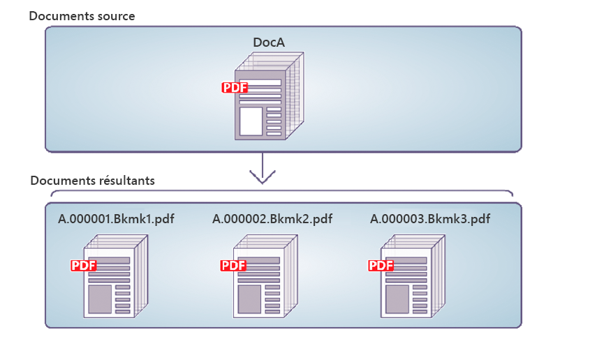

# Démontage par programmation des Documents PDF {#programmatically-disassembling-pdf-documents}

**Les exemples et exemples de ce document ne concernent que l’environnement AEM Forms on JEE.**

Vous pouvez désassembler un document PDF en le transmettant au service Assembler. En règle générale, cette tâche est utile lorsque le document PDF a été créé à l’origine à partir de nombreux documents individuels, tels qu’un ensemble d’instructions. Dans l’illustration suivante, DocA est divisé en plusieurs documents résultants, où le signet de premier niveau 1 sur une page identifie le début d’un nouveau document résultant.



Pour désassembler un document PDF, assurez-vous que l’élément `PDFsFromBookmarks` se trouve dans le document DDX. L&#39;élément `PDFsFromBookmarks` est un élément cible et ne peut être qu&#39;un élément enfant de l&#39;élément `DDX`. Il ne possède pas d&#39;attribut `result`, car il peut générer plusieurs documents.

L&#39;élément `PDFsFromBookmarks` génère un document unique pour chaque signet de niveau 1 dans le document source.

Aux fins de cette discussion, supposons que le document DDX suivant soit utilisé.

```xml
 <?xml version="1.0" encoding="UTF-8"?>
 <DDX xmlns="https://ns.adobe.com/DDX/1.0/">
      <PDFsFromBookmarks prefix="stmt">
     <PDF source="AssemblerResultPDF.pdf"/>
 </PDFsFromBookmarks>
 </DDX>
```

>[!NOTE]
>
>Avant de lire cette section, il est recommandé de se familiariser avec l’assemblage de documents PDF à l’aide du service Assembler. (Voir [Assemblage par programmation de Documents PDF](/help/forms/developing/programmatically-assembling-pdf-documents.md).)

>[!NOTE]
>
>Lorsque vous transmettez un document PDF unique au service Assembler et récupérez un seul document, vous pouvez appeler l’opération `invokeOneDocument`. Cependant, pour désassembler un document PDF, utilisez l&#39;opération `invokeDDX` car bien qu&#39;un document PDF d&#39;entrée soit transmis au service Assembler, le service Assembler renvoie un objet de collection contenant un ou plusieurs documents.

>[!NOTE]
>
>Pour plus d’informations sur le service Assembler, voir [Guide de référence des services pour AEM Forms](https://www.adobe.com/go/learn_aemforms_services_63).

>[!NOTE]
>
>Pour plus d’informations sur un document DDX, voir [Service Assembler et Référence DDX](https://www.adobe.com/go/learn_aemforms_ddx_63).

## Résumé des étapes {#summary-of-steps}

Pour désassembler un document PDF, effectuez les tâches suivantes :

1. Incluez des fichiers de projet.
1. Créez un client PDF Assembler.
1. Référencez un document DDX existant.
1. Référencez un document PDF à désassembler.
1. Définissez les options d’exécution.
1. Désassemblez le document PDF.
1. Enregistrez les documents PDF déassemblés.

**Inclure les fichiers de projet**

Incluez les fichiers nécessaires dans votre projet de développement. Si vous créez une application cliente à l’aide de Java, incluez les fichiers JAR nécessaires. Si vous utilisez des services Web, veillez à inclure les fichiers proxy.

Les fichiers JAR suivants doivent être ajoutés au chemin de classe de votre projet :

* adobe-livecycle-client.jar
* adobe-usermanager-client.jar
* adobe-assembler-client.jar
* adobe-utilities.jar (requis si AEM Forms est déployé sur JBoss)
* jbossall-client.jar (requis si AEM Forms est déployé sur JBoss)

si AEM Forms est déployé sur un serveur d’applications J2EE pris en charge qui n’est pas JBoss, vous devez remplacer adobe-utilities.jar et jbossall-client.jar par des fichiers JAR spécifiques au serveur d’applications J2EE sur lequel AEM Forms est déployé.

**Création d’un client PDF Assembler**

Avant de pouvoir exécuter une opération Assembler par programmation, vous devez créer un client de service Assembler.

**Référencer un document DDX existant**

Un document DDX doit être référencé pour désassembler un document PDF. Ce document DDX doit contenir l’élément `PDFsFromBookmarks`.

**Référence à un document PDF à désassembler**

Pour désassembler un document PDF, référencez un fichier PDF représentant le document PDF à désassembler. Lorsqu’il est transmis au service Assembler, un document PDF distinct est renvoyé pour chaque signet de niveau 1 du document.

**Définition des options d’exécution**

Vous pouvez définir des options d’exécution qui contrôlent le comportement du service Assembler lorsqu’il effectue une tâche. Par exemple, vous pouvez définir une option qui indique au service Assembler de continuer à traiter une tâche en cas d’erreur.

**Désassembler le document PDF**

Après avoir créé le client de service Assembler, référencé le document DDX, référencé un document PDF pour le désassembler et défini les options d’exécution, vous pouvez désassembler un document PDF en invoquant la méthode `invokeDDX`. Si le document DDX contient des instructions pour désassembler le document PDF, le service Assembler renvoie les documents PDF désassemblés dans un objet de collection.

**Enregistrer les documents PDF déassemblés**

Tous les documents PDF déassemblés sont renvoyés dans un objet de collection. Effectuez une itération dans l’objet de collection et enregistrez chaque document PDF au format PDF.

**Voir également**

[Inclusion des fichiers de bibliothèque Java AEM Forms](/help/forms/developing/invoking-aem-forms-using-java.md#including-aem-forms-java-library-files)

[Réglage des propriétés de la connexion](/help/forms/developing/invoking-aem-forms-using-java.md#setting-connection-properties)

[Assemblage par programmation de Documents PDF](/help/forms/developing/programmatically-assembling-pdf-documents.md)

## Désassembler un document PDF à l’aide de l’API Java {#disassemble-a-pdf-document-using-the-java-api}

Désassembler un document PDF à l’aide de l’API Assembler Service (Java) :

1. Incluez des fichiers de projet.

   Incluez des fichiers JAR client, tels que adobe-assembler-client.jar, dans le chemin de classe de votre projet Java.

1. Créez un client PDF Assembler.

   * Créez un objet `ServiceClientFactory` qui contient des propriétés de connexion.
   * Créez un objet `AssemblerServiceClient` en utilisant son constructeur et en transmettant l&#39;objet `ServiceClientFactory`.

1. Référencez un document DDX existant.

   * Créez un objet `java.io.FileInputStream` qui représente le document DDX en utilisant son constructeur et en transmettant une valeur de chaîne qui spécifie l’emplacement du fichier DDX.
   * Créez un objet `com.adobe.idp.Document` en utilisant son constructeur et en transmettant l’objet `java.io.FileInputStream`. 

1. Référencez un document PDF à désassembler.

   * Créez un objet `java.util.Map` utilisé pour stocker des documents PDF d’entrée à l’aide d’un constructeur `HashMap`.
   * Créez un objet `java.io.FileInputStream` en utilisant son constructeur et en transmettant l’emplacement du document PDF à désassembler.
   * Créez un objet `com.adobe.idp.Document` et transmettez l’objet `java.io.FileInputStream` contenant le document PDF à désassembler.
   * Ajoutez une entrée à l&#39;objet `java.util.Map` en invoquant sa méthode `put` et en transmettant les arguments suivants :

      * Valeur de chaîne qui représente le nom de la clé. Cette valeur doit correspondre à la valeur de l’élément source PDF spécifié dans le document DDX.
      * Objet `com.adobe.idp.Document` contenant le document PDF à désassembler.

1. Définissez les options d’exécution.

   * Créez un objet `AssemblerOptionSpec` qui stocke les options d’exécution à l’aide de son constructeur.
   * Définissez des options d&#39;exécution pour répondre aux besoins de votre entreprise en appelant une méthode appartenant à l&#39;objet `AssemblerOptionSpec`. Par exemple, pour demander au service Assembler de continuer à traiter une tâche en cas d’erreur, appelez la méthode `AssemblerOptionSpec` de l’objet `setFailOnError` et transmettez `false`.

1. Désassemblez le document PDF.

   Appelez la méthode `invokeDDX` de l’objet `AssemblerServiceClient` et transmettez les valeurs requises suivantes :

   * Objet `com.adobe.idp.Document` représentant le document DDX à utiliser
   * Objet `java.util.Map` contenant le document PDF à désassembler
   * Un objet `com.adobe.livecycle.assembler.client.AssemblerOptionSpec` qui spécifie les options d’exécution, y compris la police par défaut et le niveau du journal des tâches

   La méthode `invokeDDX` renvoie un objet `com.adobe.livecycle.assembler.client.AssemblerResult` contenant les documents PDF désassemblés et les exceptions survenues.

1. Enregistrez les documents PDF déassemblés.

   Pour obtenir les documents PDF déassemblés, effectuez les actions suivantes :

   * Appelez la méthode `AssemblerResult` de l’objet `getDocuments`. Cette opération renvoie un objet `java.util.Map`.
   * Effectuez une itération dans l&#39;objet `java.util.Map` jusqu&#39;à ce que vous trouviez l&#39;objet `com.adobe.idp.Document` obtenu.
   * Appelez la méthode `com.adobe.idp.Document` de l’objet `copyToFile` pour extraire le document PDF.

**Voir également**

[Démontage programmatique des Documents PDF](#programmatically-disassembling-pdf-documents)

[Début rapide (mode SOAP) : Démontage d’un document PDF à l’aide de l’API Java](/help/forms/developing/assembler-service-java-api-quick.md#quick-start-soap-mode-disassembling-a-pdf-document-using-the-java-api)

[Inclusion des fichiers de bibliothèque Java AEM Forms](/help/forms/developing/invoking-aem-forms-using-java.md#including-aem-forms-java-library-files)

[Réglage des propriétés de la connexion](/help/forms/developing/invoking-aem-forms-using-java.md#setting-connection-properties)

## Désassembler un document PDF à l’aide de l’API du service Web {#disassemble-a-pdf-document-using-the-web-service-api}

Désassemblez un document PDF à l’aide de l’API Assembler Service (service Web) :

1. Incluez des fichiers de projet.

   Créez un projet Microsoft .NET qui utilise MTOM. Assurez-vous d’utiliser la définition WSDL suivante lors de la définition d’une référence de service : `http://localhost:8080/soap/services/AssemblerService?WSDL&lc_version=9.0.1`.

   >[!NOTE]
   >
   >Remplacez `localhost` par l’adresse IP du serveur hébergeant AEM Forms.

1. Créez un client PDF Assembler.

   * Créez un objet `AssemblerServiceClient` en utilisant son constructeur par défaut.
   * Créez un objet `AssemblerServiceClient.Endpoint.Address` en utilisant le constructeur `System.ServiceModel.EndpointAddress`. Transmettez une valeur de chaîne qui spécifie le WSDL au service AEM Forms (par exemple, `http://localhost:8080/soap/services/AssemblerService?blob=mtom`). Vous n&#39;avez pas besoin d&#39;utiliser l&#39;attribut `lc_version`. Cet attribut est utilisé lorsque vous créez une référence de service.
   * Créez un objet `System.ServiceModel.BasicHttpBinding` en obtenant la valeur du champ `AssemblerServiceClient.Endpoint.Binding`. Convertissez la valeur de retour en `BasicHttpBinding`.
   * Définissez le champ `MessageEncoding` de l’objet `System.ServiceModel.BasicHttpBinding` sur `WSMessageEncoding.Mtom`. Cette valeur garantit l’utilisation de MTOM.
   * Activez l’authentification HTTP de base en exécutant les tâches suivantes :

      * Attribuez le nom d’utilisateur AEM forms au champ `AssemblerServiceClient.ClientCredentials.UserName.UserName`.
      * Attribuez la valeur de mot de passe correspondante au champ `AssemblerServiceClient.ClientCredentials.UserName.Password`.
      * Affectez la valeur constante `HttpClientCredentialType.Basic` au champ `BasicHttpBindingSecurity.Transport.ClientCredentialType`.
      * Affectez la valeur constante `BasicHttpSecurityMode.TransportCredentialOnly` au champ `BasicHttpBindingSecurity.Security.Mode`.

1. Référencez un document DDX existant.

   * Créez un objet `BLOB` en utilisant son constructeur. L’objet `BLOB` est utilisé pour stocker le document DDX.
   * Créez un objet `System.IO.FileStream` en appelant son constructeur. Transmettez une valeur de chaîne qui représente l’emplacement du fichier du document DDX et le mode d’ouverture du fichier.
   * Créez un tableau d’octets qui stocke le contenu de l’objet `System.IO.FileStream`. Vous pouvez déterminer la taille du tableau d’octets en obtenant la propriété `System.IO.FileStream` de l’objet `Length`.
   * Renseignez le tableau d’octets avec les données de flux en appelant la méthode `System.IO.FileStream` de l’objet `Read` et en transmettant le tableau d’octets, la position de départ et la longueur du flux à lire.
   * Renseignez l’objet `BLOB` en attribuant sa propriété `MTOM` au contenu du tableau d’octets.

1. Référencez un document PDF à désassembler.

   * Créez un objet `BLOB` en utilisant son constructeur. L’objet `BLOB` est utilisé pour stocker le document PDF d’entrée. Cet objet `BLOB` est transmis à `invokeOneDocument` en tant qu&#39;argument.
   * Créez un objet `System.IO.FileStream` en appelant son constructeur et en transmettant une valeur de chaîne qui représente l’emplacement du fichier du document PDF d’entrée et le mode d’ouverture du fichier.
   * Créez un tableau d’octets qui stocke le contenu de l’objet `System.IO.FileStream`. Vous pouvez déterminer la taille du tableau d’octets en obtenant la propriété `System.IO.FileStream` de l’objet `Length`.
   * Renseignez le tableau d’octets avec les données de flux en appelant la méthode `System.IO.FileStream` de l’objet `Read` et en transmettant le tableau d’octets, la position de départ et la longueur du flux à lire.
   * Renseignez l’objet `BLOB` en affectant son champ `MTOM` au contenu du tableau d’octets.
   * Créez un objet `MyMapOf_xsd_string_To_xsd_anyType`. Cet objet de collection est utilisé pour stocker le PDF à désassembler.
   * Créez un objet `MyMapOf_xsd_string_To_xsd_anyType_Item`.
   * Attribuez une valeur de chaîne qui représente le nom de clé au champ `MyMapOf_xsd_string_To_xsd_anyType_Item` de l’objet `key`. Cette valeur doit correspondre à la valeur de l’élément source PDF spécifié dans le document DDX.
   * Affectez l’objet `BLOB` qui stocke le document PDF au champ `MyMapOf_xsd_string_To_xsd_anyType_Item` de l’objet `value`.
   * Ajoutez l&#39;objet `MyMapOf_xsd_string_To_xsd_anyType_Item` à l&#39;objet `MyMapOf_xsd_string_To_xsd_anyType`. Appelez la méthode `MyMapOf_xsd_string_To_xsd_anyType` object’ `Add` et transmettez l’objet `MyMapOf_xsd_string_To_xsd_anyType`.

1. Définissez les options d’exécution.

   * Créez un objet `AssemblerOptionSpec` qui stocke les options d’exécution à l’aide de son constructeur.
   * Définissez des options d&#39;exécution pour répondre aux besoins de votre entreprise en attribuant une valeur à un membre de données qui appartient à l&#39;objet `AssemblerOptionSpec`. Par exemple, pour demander au service Assembler de continuer à traiter une tâche en cas d’erreur, affectez `false` au champ `failOnError` de l’objet `AssemblerOptionSpec`.

1. Désassemblez le document PDF.

   Appelez la méthode `invokeDDX` de l’objet `AssemblerServiceClient` et transmettez les valeurs suivantes :

   * Un objet `BLOB` représentant le document DDX qui désassemble le document PDF
   * Objet `MyMapOf_xsd_string_To_xsd_anyType` contenant le document PDF à désassembler
   * Objet `AssemblerOptionSpec` qui spécifie les options d’exécution

   La méthode `invokeDDX` renvoie un objet `AssemblerResult` contenant les résultats de la tâche et les exceptions survenues.

1. Enregistrez les documents PDF déassemblés.

   Pour obtenir les documents PDF nouvellement créés, effectuez les opérations suivantes :

   * Accédez au champ `documents` de l’objet `AssemblerResult`, qui est un objet `Map` contenant les documents PDF désassemblés.
   * Effectuez une itération dans l&#39;objet `Map` pour obtenir chaque document cible. Ensuite, définissez `value` sur `BLOB`.
   * Extrayez les données binaires qui représentent le document PDF en accédant à la propriété `BLOB` `MTOM` de l’objet. Cette opération renvoie un tableau d’octets que vous pouvez écrire dans un fichier PDF.

**Voir également**

[Démontage programmatique des Documents PDF](#programmatically-disassembling-pdf-documents)

[Appel de AEM Forms à l’aide de MTOM](/help/forms/developing/invoking-aem-forms-using-web.md#invoking-aem-forms-using-mtom)
