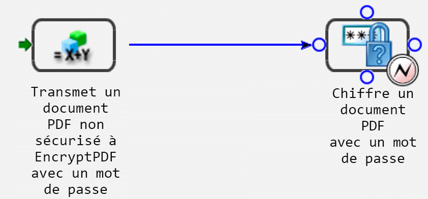
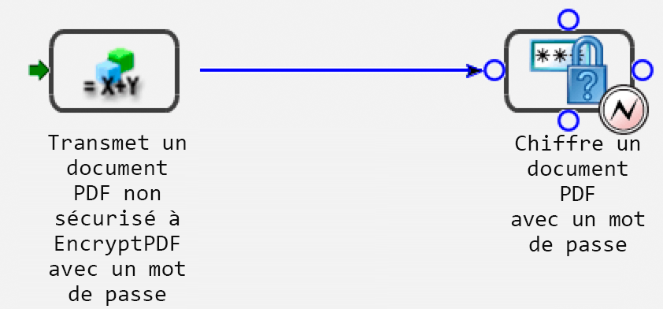

# Gestion programmatique des points de fin {#programmatically-managing-endpoints}

**À propos du service de registre des points de fin**

Le service Endpoint Registry permet de gérer les points de fin par programmation. Vous pouvez, par exemple, ajouter les types de points de fin suivants à un service :

* EJB
* méthode d’objet
* Watched Folder
* Courrier électronique
* (Obsolète pour AEM forms) Remoting
* Gestionnaire de 

   ***Remarque **: Les points de fin Remoting SOAP, EJB et (obsolète pour AEM forms on JEE) sont automatiquement créés pour chaque service activé. Les points de fin SOAP et EJB activent SOAP et EJB pour toutes les opérations de service.*

   Un point de fin Remoting permet aux clients Flex d’appeler des opérations sur le service AEM Forms auquel le point de fin est ajouté. Une destination Flex portant le même nom que le point de fin est créée et les clients Flex peuvent créer des objets RemoteObjects pointant vers cette destination pour appeler des opérations sur le service concerné.

   Les points de fin Email, Manager et Watched Folder n’exposent qu’une opération spécifique du service. L’ajout de ces points de fin nécessite une deuxième étape de configuration pour sélectionner une méthode à appeler, définir des paramètres de configuration et spécifier les mappages des paramètres d’entrée et de sortie.

   Vous pouvez organiser les points de fin TaskManager en groupes appelés **. Ces  sont ensuite exposées à Workspace par le biais de TaskManager, où les utilisateurs finaux voient les points de fin TaskManager tels qu’ils sont classés. Dans Workspace, les utilisateurs finaux voient ces  dans le volet de navigation. Les points de fin de chaque  de sont affichés sous forme de cartes de processus sur la page Processus  dans Workspace.

   Vous pouvez accomplir ces  à l’aide du service de registre de point de fin :

* Ajouter des points de fin EJB. (Voir [Ajout de points de fin](programmatically-endpoints.md#adding-ejb-endpoints)EJB.)
* Ajouter les points de fin SOAP. (Voir [Ajout de points de fin](programmatically-endpoints.md#adding-soap-endpoints)SOAP.)
* Ajouter Points de fin Watched Folder (voir [Ajout de points de fin Watched Folder](programmatically-endpoints.md#adding-watched-folder-endpoints)).
* Ajouter Points de fin de courrier électronique. (See [Adding Email Endpoints](programmatically-endpoints.md#adding-email-endpoints).)
* Ajouter Points de fin Remoting. (Voir [Ajout de points](programmatically-endpoints.md#adding-remoting-endpoints)de fin Remoting.)
* Ajouter Points de fin TaskManager (voir [Ajout de points de fin TaskManager](programmatically-endpoints.md#adding-taskmanager-endpoints)).
* Modification des points de fin (voir [Modification des points de fin](programmatically-endpoints.md#modifying-endpoints)).
* Suppression des points de fin (voir [Suppression des points de fin](programmatically-endpoints.md#removing-endpoints)).
* Récupérez les informations du connecteur du point de fin (voir [Récupération des informations](programmatically-endpoints.md#retrieving-endpoint-connector-information)du connecteur du point de fin).

## Ajout de points de fin EJB {#adding-ejb-endpoints}

Vous pouvez par programmation ajouter un point de fin EJB à un service à l’aide de l’API Java d’AEM Forms. En ajoutant un point de fin EJB à un service, vous activez une application cliente pour appeler le service à l’aide du mode EJB. En d’autres termes, lorsque vous définissez les propriétés de connexion requises pour appeler AEM Forms, vous pouvez sélectionner le mode EJB. (Voir [Réglage des propriétés de la connexion](/help/forms/developing/invoking-aem-forms-using-java.md#setting-connection-properties).)

>[!NOTE]
>
>Vous ne pouvez pas ajouter de point de fin EJB à l’aide de services Web.

>[!NOTE]
>
>En règle générale, un point de fin EJB est ajouté par défaut à un service. Toutefois, un point de fin EJB peut être ajouté à un processus qui est déployé par programmation ou lorsqu’un point de fin EJB a été supprimé et doit être ajouté à nouveau.

### Résumé des étapes {#summary-of-steps}

Pour ajouter un point de fin EJB à un service, effectuez le  suivant :

1. Incluez des fichiers de projet.
1. Créez un `EndpointRegistry Client` objet.
1. Définissez les attributs du point de fin EJB.
1. Créez un point de fin EJB.
1. Activez le point de fin.

**Inclure les fichiers de projet**

Incluez les fichiers nécessaires dans votre projet de développement. Les fichiers JAR suivants doivent être ajoutés au chemin de classe de votre projet :

* adobe-livecycle-client.jar
* adobe-usermanager-client.jar
* adobe-utilities.jar (requis si AEM Forms est déployé sur JBoss Application Server)
* jbossall-client.jar (requis si AEM Forms est déployé sur JBoss Application Server)

For information about the location of these JAR files, see [Including AEM Forms Java library files](/help/forms/developing/invoking-aem-forms-using-java.md#including-aem-forms-java-library-files).

**Création d’un objet Client EndpointRegistry**

Avant de pouvoir ajouter un point de fin EJB par programmation, vous devez créer un `EndpointRegistryClient` objet.

**Définition des attributs de point de fin EJB**

Pour créer un point de fin EJB pour un service, spécifiez les valeurs suivantes :

* **Identificateur** du connecteur : Indique le type de point de fin à créer. Pour créer un point de fin EJB, spécifiez `EJB`.
* **Description**: Indique la description du point de fin.
* **Nom**: Indique le nom du point de fin.
* **Identifiant** du service : Indique le service auquel appartient le point de fin.
* **Nom** de l&#39;opération : Indique le nom de l’opération appelée à l’aide du point de fin. Lors de la création d’un point de fin EJB, spécifiez un caractère générique ( `*`). Cependant, si vous souhaitez spécifier une opération spécifique plutôt que d’appeler toutes les opérations de service, spécifiez le nom de l’opération plutôt que d’utiliser le caractère générique ( `*`).

**Création d’un point de fin EJB**

Après avoir défini les attributs de point de fin EJB, vous pouvez créer un point de fin EJB pour un service.

**Activer le point de fin**

Après avoir créé un nouveau point de fin, vous devez l’activer. Après avoir activé le point de fin, il peut être utilisé pour appeler le service. Après avoir activé le point de fin, vous pouvez le  dans Administration Console.

**Voir également**

[Ajout d’un point de fin EJB à l’aide de l’API Java](programmatically-endpoints.md#adding-an-ejb-endpoint-using-the-java-api)

[Inclusion des fichiers de bibliothèque Java AEM Forms](/help/forms/developing/invoking-aem-forms-using-java.md#including-aem-forms-java-library-files)

[Réglage des propriétés de la connexion](/help/forms/developing/invoking-aem-forms-using-java.md#setting-connection-properties)

### Ajout d’un point de fin EJB à l’aide de l’API Java {#adding-an-ejb-endpoint-using-the-java-api}

Ajouter un point de fin EJB à l’aide de l’API Java :

1. Incluez des fichiers de projet.

   Incluez des fichiers JAR client, tels que adobe-livecycle-client.jar, dans le chemin de classe de votre projet Java. (

1. Créez un objet Client EndpointRegistry.

   * Créez un objet `ServiceClientFactory` qui contient des propriétés de connexion.
   * Create an `EndpointRegistryClient` object by using its constructor and passing the `ServiceClientFactory` object.

1. Définissez les attributs du point de fin EJB.

   * Créez un objet `CreateEndpointInfo` en utilisant son constructeur.
   * Spécifiez la valeur de l’identifiant du connecteur en appelant la `CreateEndpointInfo` méthode de l’objet et en transmettant la valeur de chaîne `setConnectorId` `EJB`.
   * Spécifiez la description du point de fin en appelant la `CreateEndpointInfo` `setDescription` méthode de l’objet et en transmettant une valeur de chaîne qui décrit le point de fin.
   * Spécifiez le nom du point de fin en appelant la `CreateEndpointInfo` `setName` méthode de l’objet et en transmettant une valeur de chaîne qui spécifie le nom.
   * Spécifiez le service auquel appartient le point de fin en appelant la `CreateEndpointInfo` `setServiceId` méthode de l’objet et en transmettant une valeur de chaîne qui spécifie le nom du service.
   * Spécifiez l’opération appelée en appelant la `CreateEndpointInfo` `setOperationName` méthode de l’objet et transmettez une valeur de chaîne qui spécifie le nom de l’opération. Pour les points de fin SOAP et EJB, spécifiez un caractère générique ( `*`), ce qui implique toutes les opérations.

1. Créez un point de fin EJB.

   Créez le point de fin en appelant la `EndpointRegistryClient` méthode de l’ `createEndpoint` objet et en transmettant l’ `CreateEndpointInfo` objet. Cette méthode renvoie un `Endpoint` objet qui représente le nouveau point de fin EJB.

1. Activez le point de fin.

   Activez le point de fin en appelant la méthode enable de l’ `EndpointRegistryClient` objet et en transmettant l’ `Endpoint` objet renvoyé par la `createEndpoint` méthode.

**Voir également**

[Résumé des étapes](programmatically-endpoints.md#summary-of-steps)

[QuickStart : Ajout d’un point de fin EJB à l’aide de l’API Java](/help/forms/developing/endpoint-registry-java-api-quick.md#quickstart-adding-an-ejb-endpoint-using-the-java-api)

[Inclusion des fichiers de bibliothèque Java AEM Forms](/help/forms/developing/invoking-aem-forms-using-java.md#including-aem-forms-java-library-files)

[Réglage des propriétés de la connexion](/help/forms/developing/invoking-aem-forms-using-java.md#setting-connection-properties)

## Ajout de points de fin SOAP {#adding-soap-endpoints}

Vous pouvez par programmation ajouter un point de fin SOAP à un service à l’aide de l’API Java d’AEM Forms. En ajoutant un point de fin SOAP, vous activez une application cliente pour appeler le service à l’aide du mode SOAP. En d’autres termes, lorsque vous définissez les propriétés de connexion requises pour appeler AEM Forms, vous pouvez sélectionner le mode SOAP.

>[!NOTE]
>
>Vous ne pouvez pas ajouter de point de fin SOAP à l’aide de services Web.

>[!NOTE]
>
>En règle générale, un point de fin SOAP est ajouté par défaut à un service. Cependant, un point de fin SOAP peut être ajouté à un processus qui est déployé par programmation ou lorsqu’un point de fin SOAP a été supprimé et doit être ajouté à nouveau.

### Résumé des étapes {#summary_of_steps-1}

Pour ajouter un point de fin SOAP à un service, effectuez le  suivant :

1. Incluez des fichiers de projet.
1. Créez un `EndpointRegistryClient` objet.
1. Définissez les attributs des points de fin SOAP.
1. Créez un point de fin SOAP.
1. Activez le point de fin.

**Inclure les fichiers de projet**

Incluez les fichiers nécessaires dans votre projet de développement. Si vous créez une application cliente à l’aide de Java, incluez les fichiers JAR nécessaires. Si vous utilisez des services Web, veillez à inclure les fichiers proxy.

Les fichiers JAR suivants doivent être ajoutés au chemin de classe de votre projet :

* adobe-livecycle-client.jar
* adobe-usermanager-client.jar
* adobe-utilities.jar (requis si AEM Forms est déployé sur JBoss Application Server)
* jbossall-client.jar (requis si AEM Forms est déployé sur JBoss Application Server)

Ces fichiers JAR sont nécessaires pour créer un point de fin SOAP. Toutefois, vous avez besoin de fichiers JAR supplémentaires si vous utilisez le point de fin SOAP pour appeler le service. Pour plus d’informations sur les fichiers JAR d’AEM Forms, voir [Inclusion de fichiers](/help/forms/developing/invoking-aem-forms-using-java.md#including-aem-forms-java-library-files)de bibliothèque Java d’AEM Forms.

**Création d’un objet Client EndpointRegistry**

Pour ajouter par programmation un point de fin SOAP à un service, vous devez créer un `EndpointRegistryClient` objet.

**Définition des attributs de point de fin SOAP**

Pour ajouter un point de fin SOAP à un service, spécifiez les valeurs suivantes :

* **Valeur** d’identificateur du connecteur : Indique le type de point de fin à créer. Pour créer un point de fin SOAP, spécifiez `SOAP`.
* **Description**: Indique la description du point de fin.
* **Nom**: Indique le nom du point de fin.
* **Valeur** de l&#39;identifiant de service : Indique le service auquel appartient le point de fin.
* **Nom** de l&#39;opération : Indique le nom de l’opération appelée à l’aide du point de fin. Lors de la création d’un point de fin SOAP, spécifiez un caractère générique ( `*`). Cependant, si vous souhaitez spécifier une opération spécifique plutôt que d’appeler toutes les opérations de service, spécifiez le nom de l’opération plutôt que d’utiliser le caractère générique ( `*`).

**Création d’un point de fin SOAP**

Après avoir défini les attributs de point de fin SOAP, vous pouvez créer un point de fin SOAP.

**Activer le point de fin**

Après avoir créé un nouveau point de fin, vous devez l’activer. Lorsque le point de fin est activé, il peut être utilisé pour appeler le service. Une fois le point de fin activé, vous pouvez le  voir dans Administration Console.

**Voir également**

[Ajouter un point de fin SOAP à l’aide de l’API Java](programmatically-endpoints.md#add-a-soap-endpoint-using-the-java-api)

[Inclusion des fichiers de bibliothèque Java AEM Forms](/help/forms/developing/invoking-aem-forms-using-java.md#including-aem-forms-java-library-files)

[Réglage des propriétés de la connexion](/help/forms/developing/invoking-aem-forms-using-java.md#setting-connection-properties)

### Ajouter un point de fin SOAP à l’aide de l’API Java {#add-a-soap-endpoint-using-the-java-api}

Ajouter un point de fin SOAP à un service à l’aide de l’API Java :

1. Incluez des fichiers de projet.

   Incluez des fichiers JAR client, tels que adobe-livecycle-client.jar, dans le chemin de classe de votre projet Java.

1. Créez un objet Client EndpointRegistry.

   * Créez un objet `ServiceClientFactory` qui contient des propriétés de connexion.
   * Create an `EndpointRegistryClient` object by using its constructor and passing the `ServiceClientFactory` object.

1. Définissez les attributs des points de fin SOAP.

   * Créez un objet `CreateEndpointInfo` en utilisant son constructeur.
   * Spécifiez la valeur de l’identifiant du connecteur en appelant la `CreateEndpointInfo` méthode de l’objet et en transmettant la valeur de chaîne `setConnectorId` `SOAP`.
   * Spécifiez la description du point de fin en appelant la `CreateEndpointInfo` `setDescription` méthode de l’objet et en transmettant une valeur de chaîne qui décrit le point de fin.
   * Spécifiez le nom du point de fin en appelant la `CreateEndpointInfo` `setName` méthode de l’objet et en transmettant une valeur de chaîne qui spécifie le nom.
   * Spécifiez le service auquel appartient le point de fin en appelant la `CreateEndpointInfo` `setServiceId` méthode de l’objet et en transmettant une valeur de chaîne qui spécifie le nom du service.
   * Spécifiez l’opération appelée en appelant la `CreateEndpointInfo` `setOperationName` méthode de l’objet et en transmettant une valeur de chaîne spécifiant le nom de l’opération. Pour les points de fin SOAP et EJB, spécifiez un caractère générique ( `*`), ce qui implique toutes les opérations.

1. Créez un point de fin SOAP.

   Créez le point de fin en appelant la `EndpointRegistryClient` méthode de l’ `createEndpoint` objet et en transmettant l’ `CreateEndpointInfo` objet. Cette méthode renvoie un `Endpoint` objet qui représente le nouveau point de fin SOAP.

1. Activez le point de fin.

   Activez le point de fin en appelant la méthode enable de l’ `EndpointRegistryClient` objet et en transmettant l’ `Endpoint` objet renvoyé par la `createEndpoint` méthode.

**Voir également**

[Résumé des étapes](programmatically-endpoints.md#summary-of-steps)

[QuickStart : Ajout d’un point de fin SOAP à l’aide de l’API Java](/help/forms/developing/endpoint-registry-java-api-quick.md#quickstart-adding-a-soap-endpoint-using-the-java-api)

[Inclusion des fichiers de bibliothèque Java AEM Forms](/help/forms/developing/invoking-aem-forms-using-java.md#including-aem-forms-java-library-files)

[Réglage des propriétés de la connexion](/help/forms/developing/invoking-aem-forms-using-java.md#setting-connection-properties)

## Ajout de points de fin Watched Folder {#adding-watched-folder-endpoints}

Vous pouvez par programmation ajouter un point de fin Watched Folder à un service à l’aide de l’API Java d’AEM Forms. En ajoutant un point de fin Watched Folder, vous permettez aux utilisateurs de placer un fichier (tel qu’un fichier PDF) dans un dossier. Lorsque le fichier est placé dans le dossier, le service configuré est alors appelé et manipule le fichier. Après que le service a effectué l’opération spécifiée, il enregistre le fichier modifié dans un dossier de sortie spécifié. Un dossier de contrôle est configuré pour être numérisé à un intervalle de temps fixe ou selon un calendrier cron, par exemple tous les lundis, mercredis et vendredis à midi.

Pour ajouter par programmation un point de fin Watched Folder à un service, tenez compte du processus de courte durée *EncryptDocument* suivant. (Voir [Présentation des processus](/help/forms/developing/aem-forms-processes.md#understanding-aem-forms-processes)AEM Forms.)



Ce processus accepte un PDF non sécurisé comme valeur d’entrée, puis transmet le PDF non sécurisé à l’ `EncryptPDFUsingPassword` opération du service Encryption. Le  PDF est chiffré avec un mot de passe et le PDF chiffré par mot de passe est la valeur de sortie de ce processus. Le nom de la valeur d’entrée (le  PDF non sécurisé) est `InDoc` et le type de données est `com.adobe.idp.Document`. Le nom de la valeur de sortie (le PDF chiffré par mot de passe) est `SecuredDoc` et le type de données est `com.adobe.idp.Document`.

>[!NOTE]
>
>Vous ne pouvez pas ajouter de point de fin Watched Folder à l’aide de services Web.

### Résumé des étapes {#summary_of_steps-2}

Pour ajouter un point de fin Watched Folder à un service, effectuez le  suivant :

1. Incluez des fichiers de projet.
1. Créez un `EndpointRegistryClient` objet.
1. Définissez les attributs des points de fin Watched Folder.
1. Spécifiez les valeurs de configuration.
1. Définissez les valeurs des paramètres d’entrée.
1. Définissez une valeur de paramètre de sortie.
1. Créez un point de fin Watched Folder.
1. Activez le point de fin.

**Inclure les fichiers de projet**

Incluez les fichiers nécessaires dans votre projet de développement. Si vous créez une application cliente à l’aide de Java, incluez les fichiers JAR nécessaires. Si vous utilisez des services Web, veillez à inclure les fichiers proxy.

Les fichiers JAR suivants doivent être ajoutés au chemin de classe de votre projet :

* adobe-livecycle-client.jar
* adobe-usermanager-client.jar
* adobe-utilities.jar (requis si AEM Forms est déployé sur JBoss Application Server)
* jbossall-client.jar (requis si AEM Forms est déployé sur JBoss Application Server)

For information about the location of these JAR files, see [Including AEM Forms Java library files](/help/forms/developing/invoking-aem-forms-using-java.md#including-aem-forms-java-library-files).

**Création d’un objet Client EndpointRegistry**

Pour ajouter par programmation un point de fin Watched Folder, vous devez créer un `EndpointRegistryClient` objet.

**Définition des attributs de point de fin Watched Folder**

Pour créer un point de fin Watched Folder pour un service, spécifiez les valeurs suivantes :

* **Identificateur** du connecteur : Indique le type de point de fin créé. Pour créer un point de fin Watched Folder, spécifiez `WatchedFolder`.
* **Description**: Indique la description du point de fin.
* **Nom**: Indique le nom du point de fin.
* **Identifiant** du service : Indique le service auquel appartient le point de fin. Par exemple, pour ajouter un point de fin Watched Folder au processus introduit dans cette section (un processus devient un service lorsqu’il est activé à l’aide de Workbench), spécifiez `EncryptDocument`.
* **Nom** de l&#39;opération : Indique le nom de l’opération appelée à l’aide du point de fin. En règle générale, lors de la création d’un point de fin Watched Folder pour un service qui provient d’un processus créé dans Workbench, le nom de l’opération est `invoke`.

**Définition des valeurs de configuration**

Vous devez spécifier des valeurs de configuration pour un point de fin Watched Folder lors de l’ajout par programmation d’un point de fin Watched Folder à un service. Ces valeurs de configuration sont spécifiées par un administrateur si un point de fin Watched Folder est ajouté à l’aide d’Administration Console.

Le suivant spécifie les valeurs de configuration qui sont définies lors de l’ajout par programmation d’un point de fin Watched Folder à un service :

* **url**: Indique l’emplacement du dossier de contrôle. Dans un  organisé en grappes, cette valeur doit pointer vers un dossier réseau partagé accessible à partir de chaque ordinateur de la grappe.
* **asynchrone**: Identifie le type d’appel comme étant asynchrone ou synchrone. Les processus provisoires et synchrones peuvent être appelés uniquement de façon synchrone. La valeur par défaut est true. Il est recommandé d’opter pour un mode asynchrone.
* **cronExpression**: Utilisé par quartz pour planifier l’interrogation du répertoire d’entrée. Pour plus d’informations sur la configuration du cron  , voir [https://quartz.sourceforge.net/javadoc/org/quartz/CronTrigger.html](https://quartz.sourceforge.net/javadoc/org/quartz/CronTrigger.html).
* **purgeDuration**: Il s’agit d’un attribut obligatoire. Les fichiers et les dossiers du dossier result sont purgés lorsqu’ils sont plus anciens que cette valeur. Cette valeur est mesurée en jours. Cet attribut est utile pour s’assurer que le dossier de résultats n’est pas plein. La valeur -1 jour indique de ne jamais supprimer le dossier result. La valeur par défaut est -1.
* **repeatInterval**: Intervalle, en secondes, d’analyse du dossier de contrôle pour l’entrée. À moins que le ralentissement ne soit activé, cette valeur doit être supérieure au temps nécessaire pour traiter une tâche moyenne ; dans le cas contraire, le système pourrait être surchargé. La valeur par défaut est 5.   
* **repeatCount**: Nombre de fois où un dossier de contrôle analyse le dossier ou le répertoire. La valeur -1 indique une analyse indéfinie. La valeur par défaut est -1.
* **throttleOn**: Limite le nombre de tâches du dossier de contrôle pouvant être traitées à tout moment. Le nombre maximal de tâches est déterminé par la valeur batchSize.
* **userName**: Nom d’utilisateur utilisé lors de l’appel d’un service  à partir du dossier de contrôle. Cette valeur est obligatoire. La valeur par défaut est SuperAdmin.
* **domainName**: Domaine de l’utilisateur. Cette valeur est obligatoire. La valeur par défaut est DefaultDom.
* **batchSize**: Nombre de fichiers ou de dossiers à sélectionner par analyse. Utilisez cette valeur pour éviter une surcharge sur le système ; l’analyse simultanée d’un trop grand nombre de fichiers peut entraîner un blocage. La valeur par défaut est 2.   
* **waitTime**: Durée, en millisecondes, d’attente avant l’analyse d’un dossier ou d’un fichier après sa création. Par exemple, si le temps d’attente est de 36 000 000 millisecondes (une heure) et que le fichier a été créé il y a une minute, ce fichier est récupéré après 59 minutes ou plus. Cet attribut est utile pour s’assurer qu’un fichier ou un dossier est complètement copié dans le dossier input. Par exemple, si vous devez traiter un fichier volumineux et que le téléchargement du fichier dure dix minutes, définissez le délai d’attente sur 10&amp;ast;60 &amp;ast;1000 millisecondes. Ce paramètre empêche le dossier de contrôle d’analyser le fichier s’il n’a pas attendu dix minutes. La valeur par défaut est 0.
* **excludeFilePattern**: modèle utilisé par un dossier de contrôle pour déterminer les fichiers et les dossiers à analyser et à sélectionner. Les fichiers ou les dossiers dotés de ce modèle ne seront pas analysés en vue de leur traitement. Ce paramètre est utile lorsque l’entrée est un dossier contenant plusieurs fichiers. Le contenu du dossier peut être copié dans un dossier dont le nom sera choisi par le dossier de contrôle. Cette étape empêche le dossier de contrôle de sélectionner un dossier à traiter avant que le dossier ne soit complètement copié dans le dossier d’entrée. For example, if the excludeFilePattern value is `data*`, all files and folders that match `data*` are not picked up. This includes files and folders named `data1`, `data2`, and so on. De plus, le modèle peut être complété par des modèles de caractères génériques pour spécifier des modèles de fichiers. Le dossier de contrôle modifie l’ de  normal pour prendre en charge les modèles de caractères génériques tels que `*.*` et `*.pdf`. Ces modèles de caractères génériques ne sont pas pris en charge par les   ordinaires.
* **includeFilePattern**: modèle utilisé par le dossier de contrôle pour déterminer les dossiers et les fichiers à analyser et à sélectionner. For example, if this value is `*`, all files and folders that match `input*` are picked up. This includes files and folders named `input1`, `input2`, and so on. La valeur par défaut est `*`. Cette valeur indique tous les fichiers et dossiers. De plus, le modèle peut être complété par des modèles de caractères génériques pour spécifier des modèles de fichiers. Le dossier de contrôle modifie l’ de  normal pour prendre en charge les modèles de caractères génériques tels que `*.*` et `*.pdf`. Ces modèles de caractères génériques ne sont pas pris en charge par les   ordinaires. Cette valeur est obligatoire.
* **resultFolderName**: Dossier dans lequel les résultats enregistrés sont stockés. Cet emplacement peut être un chemin d’accès absolu ou relatif au répertoire. Si les résultats ne se trouvent pas dans ce dossier, vérifiez le dossier failure. Les fichiers en lecture seule ne sont pas traités et ils sont enregistrés dans le dossier failure. La valeur par défaut est `result/%Y/%M/%D/`. Il s’agit du dossier des résultats dans le dossier de contrôle.
* **preserveFolderName**: Emplacement de stockage des fichiers après une analyse et une récupération réussies. Cet emplacement peut être un chemin d’accès de répertoire absolu, relatif ou nul. La valeur par défaut est `preserve/%Y/%M/%D/`.
* **failureFolderName**: Dossier dans lequel les fichiers d’échec sont enregistrés. Cet emplacement dépend toujours du dossier de contrôle. Les fichiers en lecture seule ne sont pas traités et ils sont enregistrés dans le dossier failure. La valeur par défaut est `failure/%Y/%M/%D/`.
* **preserveOnFailure**: Conserver les fichiers d’entrée en cas d’échec de l’exécution de l’opération sur un service. La valeur par défaut est true.
* **overwriteDuplicateFilename**: Lorsque la valeur est définie sur true, les fichiers du dossier des résultats et du dossier preserve sont remplacés. Lorsqu’il est défini sur false, le nom est utilisé pour les fichiers et les dossiers contenant un suffixe d’index numérique. La valeur par défaut est false. 

**Définition des valeurs de paramètre d’entrée**

Lors de la création d’un point de fin Watched Folder, vous devez définir les valeurs des paramètres d’entrée. En d’autres termes, vous devez décrire les valeurs d’entrée transmises à l’opération appelée par le dossier de contrôle. Prenons l’exemple du processus introduit dans cette rubrique. Il a une valeur d’entrée nommée `InDoc` et son type de données est `com.adobe.idp.Document`. Lors de la création d’un point de fin Watched Folder pour ce processus (une fois qu’un processus est activé, il devient un service), vous devez définir la valeur du paramètre d’entrée.

Pour définir les valeurs des paramètres d’entrée requises pour un point de fin Watched Folder, spécifiez les valeurs suivantes :

**Nom** du paramètre d’entrée : Nom du paramètre d’entrée. Le nom d’une valeur d’entrée est spécifié dans Workbench pour un processus. Si la valeur d’entrée appartient à une opération de service (service qui n’est pas un processus créé dans Workbench), le nom d’entrée est spécifié dans le fichier component.xml. Par exemple, le nom du paramètre d’entrée pour le processus introduit dans cette section est `InDoc`.

**Type** de mappage : Permet de configurer les valeurs d’entrée requises pour appeler l’opération de service. Il existe deux types de mappage :

* `Literal`: Le point de fin Watched Folder utilise la valeur saisie dans le champ telle qu’elle est affichée. Tous les types Java de base sont pris en charge. Par exemple, si une API utilise des entrées telles que String, long, int et Boolean, la chaîne est convertie en type approprié et le service est appelé.
* `Variable`: la valeur saisie est un modèle de fichier que le dossier de contrôle utilise pour sélectionner l’entrée. Par exemple, si vous sélectionnez Variable pour le type de mappage et que le d’entrée doit être un fichier PDF, vous pouvez spécifier `*.pdf`comme valeur de mappage.

**Valeur** de mappage : Indique la valeur du type de mappage. Par exemple, si vous sélectionnez un type de `Variable` mappage, vous pouvez spécifier `*.pdf` comme modèle de fichier.

**Type** de données : Indique le type de données des valeurs d’entrée. Par exemple, le type de données de la valeur d’entrée du processus introduit dans cette section est `com.adobe.idp.Document`.

**Définir une valeur de paramètre de sortie**

Lors de la création d’un point de fin Watched Folder, vous devez définir une valeur de paramètre de sortie. Autrement dit, vous devez décrire la valeur de sortie renvoyée par le service appelé par le point de fin Watched Folder. Prenons l’exemple du processus introduit dans cette rubrique. Il a une valeur de sortie nommée `SecuredDoc` et son type de données est `com.adobe.idp.Document`. Lors de la création d’un point de fin Watched Folder pour ce processus (une fois qu’un processus est activé, il devient un service), vous devez définir la valeur du paramètre de sortie.

Pour définir une valeur de paramètre de sortie requise pour un point de fin Watched Folder, spécifiez les valeurs suivantes :

**Nom** du paramètre de sortie : Nom du paramètre de sortie. Le nom d’une valeur de sortie de processus est spécifié dans Workbench. Si la valeur de sortie appartient à une opération de service (service qui n’est pas un processus créé dans Workbench), le nom de sortie est spécifié dans le fichier component.xml. Par exemple, le nom du paramètre de sortie pour le processus introduit dans cette section est `SecuredDoc`.

**Type** de mappage : Permet de configurer la sortie du service et de l’opération. Les options suivantes sont disponibles :

* Si le service renvoie un objet unique (un seul  de), le modèle est `%F.pdf` et la destination source est nom_fichier_source.pdf. Par exemple, le processus introduit dans cette section renvoie un seul  de. Par conséquent, le type de mappage peut être défini comme `%F.pdf` ( `%F` signifie utiliser le nom de fichier donné). Le modèle `%E` spécifie l’extension du  d’entrée.
* Si le service renvoie un , le modèle est `Result\%F\`et la destination source est Result\sourcefilename\source1 (sortie 1) et Result\sourcefilename\source2 (sortie 2).
* Si le service renvoie un mappage, le modèle est `Result\%F\`et la destination source est Result\sourcefilename\file1 and Result\sourcefilename\file2. Si le mappage comporte plusieurs objets, le modèle est `Result\%F.pdf` et la destination source est Result\nom_fichier_source1.pdf (sortie 1), Result\nom_fichier_source2.pdf (sortie 2), etc.

**Type** de données : Indique le type de données de la valeur renvoyée. Par exemple, le type de données de la valeur de retour du processus introduit dans cette section est `com.adobe.idp.Document`.

**Création d’un point de fin Watched Folder**

Après avoir défini les attributs du point de fin, les valeurs de configuration et les valeurs des paramètres d’entrée et de sortie, vous devez créer le point de fin Watched Folder.

**Activer le point de fin**

Après avoir créé un point de fin Watched Folder, vous devez l’activer. Lorsque le point de fin est activé, il peut être utilisé pour appeler le service. Après avoir activé le point de fin, vous pouvez le  dans Administration Console.

**Voir également**

[Ajouter un point de fin Watched Folder à l’aide de l’API Java](programmatically-endpoints.md#add-a-watched-folder-endpoint-using-the-java-api)

[Inclusion des fichiers de bibliothèque Java AEM Forms](/help/forms/developing/invoking-aem-forms-using-java.md#including-aem-forms-java-library-files)

[Réglage des propriétés de la connexion](/help/forms/developing/invoking-aem-forms-using-java.md#setting-connection-properties)

### Ajouter un point de fin Watched Folder à l’aide de l’API Java {#add-a-watched-folder-endpoint-using-the-java-api}

Ajouter un point de fin Watched Folder à l’aide de l’API Java d’AEM Forms :

1. Incluez des fichiers de projet.

   Incluez des fichiers JAR client, tels que adobe-livecycle-client.jar, dans le chemin de classe de votre projet Java.

1. Créez un objet Client EndpointRegistry.

   * Créez un objet `ServiceClientFactory` qui contient des propriétés de connexion.
   * Create an `EndpointRegistryClient` object by using its constructor and passing the `ServiceClientFactory` object.

1. Définissez les attributs des points de fin Watched Folder.

   * Créez un objet `CreateEndpointInfo` en utilisant son constructeur.
   * Spécifiez la valeur de l’identifiant du connecteur en appelant la `CreateEndpointInfo` méthode de l’objet et en transmettant la valeur de chaîne `setConnectorId` `WatchedFolder`.
   * Spécifiez la description du point de fin en appelant la `CreateEndpointInfo` `setDescription` méthode de l’objet et en transmettant une valeur de chaîne qui décrit le point de fin.
   * Spécifiez le nom du point de fin en appelant la `CreateEndpointInfo` `setName` méthode de l’objet et en transmettant une valeur de chaîne qui spécifie le nom.
   * Spécifiez le service auquel appartient le point de fin en appelant la `CreateEndpointInfo` `setServiceId` méthode de l’objet et en transmettant une valeur de chaîne qui spécifie le nom du service.
   * Spécifiez l’opération appelée en appelant la `CreateEndpointInfo` `setOperationName` méthode de l’objet et en transmettant une valeur de chaîne spécifiant le nom de l’opération. En règle générale, lors de la création d’un point de fin Watched Folder pour un service issu d’un processus créé dans Workbench, le nom de l’opération est appelé.

1. Spécifiez les valeurs de configuration.

   Pour chaque valeur de configuration à définir pour le point de fin Watched Folder, vous devez appeler la `CreateEndpointInfo` `setConfigParameterAsText` méthode de l’objet. Par exemple, pour définir la valeur de `url` configuration, appelez la `CreateEndpointInfo` `setConfigParameterAsText` méthode de l’objet et transmettez les valeurs de chaîne suivantes :

   * Valeur de chaîne qui spécifie le nom de la valeur de configuration. Lors de la définition de la valeur de `url` configuration, spécifiez `url`.
   * Valeur de chaîne qui spécifie la valeur de la valeur de configuration. Lors de la définition de la valeur de `url` configuration, spécifiez l’emplacement du dossier de contrôle.
   >[!NOTE]
   >
   >Pour afficher toutes les valeurs de configuration définies pour le service EncryptDocument, reportez-vous à l’exemple de code Java situé dans [QuickStart : Ajout d’un point de fin Watched Folder à l’aide de l’API](/help/forms/developing/endpoint-registry-java-api-quick.md#quickstart-adding-a-watched-folder-endpoint-using-the-java-api)Java.

1. Définissez les valeurs des paramètres d’entrée.

   Définissez une valeur de paramètre d’entrée en appelant la `CreateEndpointInfo` `setInputParameterMapping` méthode de l’objet et en transmettant les valeurs suivantes :

   * Valeur de chaîne qui spécifie le nom du paramètre d’entrée. Par exemple, le nom du paramètre d’entrée du service EncryptDocument est `InDoc`.
   * Valeur de chaîne qui spécifie le type de données du paramètre d’entrée. Par exemple, le type de données du paramètre `InDoc` d’entrée est `com.adobe.idp.Document`.
   * Valeur de chaîne qui spécifie le type de mappage. For example, you can specify `variable`.
   * Valeur de chaîne qui spécifie la valeur du type de mappage. Par exemple, vous pouvez spécifier &amp;ast;.pdf comme modèle de fichier.
   >[!NOTE]
   >
   >Appelez la `setInputParameterMapping` méthode pour chaque valeur de paramètre d’entrée à définir. Le processus EncryptDocument ne comportant qu’un seul paramètre d’entrée, vous devez appeler cette méthode une seule fois.

1. Définissez une valeur de paramètre de sortie.

   Définissez une valeur de paramètre de sortie en appelant la `CreateEndpointInfo` `setOutputParameterMapping` méthode de l’objet et en transmettant les valeurs suivantes :

   * Valeur de chaîne qui spécifie le nom du paramètre de sortie. Par exemple, le nom du paramètre de sortie pour le service EncryptDocument est `SecuredDoc`.
   * Valeur de chaîne qui spécifie le type de données du paramètre de sortie. Par exemple, le type de données du paramètre de `SecuredDoc` sortie est `com.adobe.idp.Document`.
   * Valeur de chaîne qui spécifie le type de mappage. For example, you can specify `%F.pdf`.

1. Créez un point de fin Watched Folder.

   Créez le point de fin en appelant la `EndpointRegistryClient` méthode de l’ `createEndpoint` objet et en transmettant l’ `CreateEndpointInfo` objet. Cette méthode renvoie un `Endpoint` objet qui représente le point de fin Watched Folder.

1. Activez le point de fin.

   Activez le point de fin en appelant la `EndpointRegistryClient` méthode de l’ `enable` objet et en transmettant l’ `Endpoint` objet renvoyé par la `createEndpoint` méthode.

**Voir également**

[Résumé des étapes](programmatically-endpoints.md#summary-of-steps)

[QuickStart : Ajout d’un point de fin Watched Folder à l’aide de l’API Java](/help/forms/developing/endpoint-registry-java-api-quick.md#quickstart-adding-a-watched-folder-endpoint-using-the-java-api)

[Inclusion des fichiers de bibliothèque Java AEM Forms](/help/forms/developing/invoking-aem-forms-using-java.md#including-aem-forms-java-library-files)

[Réglage des propriétés de la connexion](/help/forms/developing/invoking-aem-forms-using-java.md#setting-connection-properties)

### Fichier constant des valeurs de configuration du dossier de contrôle {#watched-folder-configuration-values-constant-file}

Le [QuickStart : L’ajout d’un point de fin Watched Folder à l’aide de l’API](/help/forms/developing/endpoint-registry-java-api-quick.md#quickstart-adding-a-watched-folder-endpoint-using-the-java-api) Java utilise un fichier constant qui doit faire partie de votre projet Java pour compiler le  rapide. Ce fichier constant représente les valeurs de configuration qui doivent être définies lors de l’ajout d’un point de fin Watched Folder. Le code Java suivant représente le fichier de constante.

```as3
 /**
     * This class contains constants that can be used when setting Watched Folder
     * configuration values
     */

 public final class WatchedFolderEndpointConfigConstants {

         public static final String PROPERTY_FILEPROVIDER_URL = "url";
         public static final String PROPERTY_PROPERTY_ASYNCHRONOUS = "asynchronous";
         public static final String PROPERTY_CRON_EXPRESSION = "cronExpression";
         public static final String PROPERTY_PURGE_DURATION = "purgeDuration";
         public static final String PROPERTY_REPEAT_INTERVAL = "repeatInterval";
         public static final String PROPERTY_REPEAT_COUNT = "repeatCount";
         public static final String PROPERTY_THROTTLE = "throttleOn";
         public static final String PROPERTY_USERNAMER = "userName";
         public static final String PROPERTY_DOMAINNAME = "domainName";
         public static final String PROPERTY_FILEPROVIDER_BATCH_SIZE = "batchSize";
         public static final String PROPERTY_FILEPROVIDER_WAIT_TIME = "waitTime";
         public static final String PROPERTY_EXCLUDE_FILE_PATTERN = "excludeFilePattern";
         public static final String PROPERTY_INCLUDE_FILE_PATTERN = "excludeFilePattern";
         public static final String PROPERTY_FILEPROVIDER_RESULT_FOLDER_NAME =  "resultFolderName";
         public static final String PROPERTY_FILEPROVIDER_PRESERVE_FOLDER_NAME = "preserveFolderName";
         public static final String PROPERTY_FILEPROVIDER_FAILURE_FOLDER_NAME = "failureFolderName";
         public static final String PROPERTY_FILEPROVIDER_PRESERVE_ON_FAILURE = "preserveOnFailure";
         public static final String PROPERTY_FILEPROVIDER_OVERWRITE_DUPLICATE_FILENAME = "overwriteDuplicateFilename";
        }
```

## Ajout de points de fin de courrier électronique {#adding-email-endpoints}

Vous pouvez par programmation ajouter un point de fin de courrier électronique à un service à l’aide de l’API Java d’AEM Forms. En ajoutant un point de fin Courrier électronique, vous permettez aux utilisateurs d’envoyer un message électronique avec une ou plusieurs pièces jointes à un compte de messagerie spécifié. Ensuite, l’opération de configuration du service est appelée et manipule les fichiers. Une fois que le service a effectué l’opération spécifiée, il envoie un message électronique à l’expéditeur avec les fichiers modifiés en tant que pièces jointes.

Aux fins de l’ajout par programmation d’un point de fin de courrier électronique à un service, tenez compte du processus de courte durée *MyApplication\EncryptDocument* suivant. Pour plus d’informations sur les processus de courte durée, voir [Présentation des processus](/help/forms/developing/aem-forms-processes.md#understanding-aem-forms-processes)AEM Forms.


Ce processus accepte un PDF non sécurisé comme valeur d’entrée, puis transmet le PDF non sécurisé à l’ `EncryptPDFUsingPassword` opération du service Encryption. Ce processus chiffre le PDF avec un mot de passe et renvoie le PDF chiffré par mot de passe  comme valeur de sortie. Le nom de la valeur d’entrée (le  PDF non sécurisé) est `InDoc` et le type de données est `com.adobe.idp.Document`. Le nom de la valeur de sortie (le PDF chiffré par mot de passe) est `SecuredDoc` et le type de données est `com.adobe.idp.Document`.

>[!NOTE]
>
>Vous ne pouvez pas ajouter de point de fin de courrier électronique à l’aide de services Web.

### Résumé des étapes {#summary_of_steps-3}

Pour ajouter un point de fin de courrier électronique à un service, effectuez le  suivant :

1. Incluez des fichiers de projet.
1. Créez un `EndpointRegistryClient` objet.
1. Définissez les attributs des points de fin de courrier électronique.
1. Spécifiez les valeurs de configuration.
1. Définissez les valeurs des paramètres d’entrée.
1. Définissez une valeur de paramètre de sortie.
1. Créez le point de fin Courrier électronique.
1. Activez le point de fin.

**Inclure les fichiers de projet**

Incluez les fichiers nécessaires dans votre projet de développement. Si vous créez une application cliente à l’aide de Java, incluez les fichiers JAR nécessaires. Si vous utilisez des services Web, veillez à inclure les fichiers proxy.

Les fichiers JAR suivants doivent être ajoutés au chemin de classe de votre projet :

* adobe-livecycle-client.jar
* adobe-usermanager-client.jar
* adobe-utilities.jar (requis si AEM Forms est déployé sur JBoss Application Server)
* jbossall-client.jar (requis si AEM Forms est déployé sur JBoss Application Server)

For information about the location of these JAR files, see [Including AEM Forms Java library files](/help/forms/developing/invoking-aem-forms-using-java.md#including-aem-forms-java-library-files).

**Création d’un objet Client EndpointRegistry**

Avant de pouvoir ajouter un point de fin de courrier électronique par programmation, vous devez créer un `EndpointRegistryClient` objet.

**Définition des attributs du point de fin de courrier électronique**

Pour créer un point de fin de courrier électronique pour un service, spécifiez les valeurs suivantes :

* **Valeur** d’identificateur du connecteur : Indique le type de point de fin créé. Pour créer un point de fin de courrier électronique, spécifiez `Email`.
* **Description**: Indique une description du point de fin.
* **Nom**: Indique le nom du point de fin.
* **Valeur** de l&#39;identifiant de service : Indique le service auquel appartient le point de fin. Par exemple, pour ajouter un point de fin de courrier électronique au processus introduit dans cette section (un processus devient un service lorsqu’il est activé à l’aide de Workbench), spécifiez `EncryptDocument`.
* **Nom** de l&#39;opération : Indique le nom de l’opération appelée à l’aide du point de fin. En règle générale, lors de la création d’un point de fin de courrier électronique pour un service qui provient d’un processus créé dans Workbench, le nom de l’opération est `invoke`.

**Définition des valeurs de configuration**

Vous devez spécifier des valeurs de configuration pour un point de fin de courrier électronique lors de l’ajout par programmation d’un point de fin de courrier électronique à un service. Ces valeurs de configuration sont spécifiées par un administrateur si un point de fin de courrier électronique est ajouté à l’aide d’Administration Console.

>[!NOTE]
>
>Le compte de messagerie surveillé est un compte spécial utilisé uniquement pour le point de fin de courrier électronique. Ce compte n’est pas un compte de messagerie d’un utilisateur ordinaire. Le compte de messagerie d’un utilisateur régulier ne doit pas être configuré comme compte utilisé par le fournisseur de messagerie car le fournisseur de messagerie supprime les messages électroniques de la boîte de réception une fois les messages terminés.

Les valeurs de configuration suivantes sont définies lors de l’ajout par programmation d’un point de fin de courrier électronique à un service :

* **cronExpression**: Un cron   si le courrier électronique doit être planifié à l’aide d’un cron .
* **repeatCount**: Nombre de fois où le point de fin de courrier électronique analyse le dossier ou le répertoire. La valeur -1 indique une analyse indéfinie. La valeur par défaut est -1.
* **repeatInterval**: Taux d&#39;analyse en secondes utilisé par le destinataire pour vérifier le courrier entrant. La valeur par défaut est 10.   
* **startDelay**: Temps d’attente pour l’analyse après la . L’heure par défaut est 0.
* **batchSize**: Nombre de messages électroniques que le destinataire traite par analyse pour obtenir des performances optimales. La valeur -1 désigne tous les messages électroniques. La valeur par défaut est 2.   
* **userName**: Nom d’utilisateur utilisé lors de l’appel d’un service de  à partir d’un courrier électronique. La valeur par défaut est `SuperAdmin`.
* **domainName**: Valeur de configuration obligatoire. La valeur par défaut est `DefaultDom`.
* **domainPattern**: Indique les modèles de domaine du courrier électronique entrant que le fournisseur accepte. For example, if `adobe.com` is used, only email from adobe.com is processed, email from other domains is ignored.
* **filePattern**: Indique les modèles de pièces jointes entrantes que le fournisseur accepte. Cela inclut les fichiers qui ont des extensions de nom de fichier spécifiques (&amp;ast;.dat, &amp;ast;.xml), les fichiers qui ont des noms spécifiques (data) et les fichiers dont le nom et l’extension contiennent un  de  composite (&amp;ast;).[D][aA]&#39;port&#39;). La valeur par défaut est `*`.
* **RecipientSuccessJob**: adresse électronique à laquelle des messages sont envoyés pour indiquer les tâches réussies. Par défaut, un message de travail effectué est toujours envoyé à l’expéditeur. Si vous saisissez `sender`, les résultats des messages électroniques sont envoyés à l’expéditeur. Jusqu’à 100 destinataires sont pris en charge. Spécifiez des supplémentaires avec des adresses électroniques, chacun séparé par une virgule. Pour désactiver cette option, laissez cette valeur vide. Dans certains cas, vous pouvez déclencher un processus et ne souhaitez pas recevoir de notification par courrier électronique du résultat. La valeur par défaut est `sender`.
* **RecipientFailedJob**: adresse électronique à laquelle des messages sont envoyés pour signaler les tâches ayant échoué. Par défaut, un message de tâche ayant échoué est toujours envoyé à l’expéditeur. Si vous saisissez `sender`, les résultats des messages électroniques sont envoyés à l’expéditeur. Jusqu’à 100 destinataires sont pris en charge. Spécifiez des supplémentaires avec des adresses électroniques, chacun séparé par une virgule. Pour désactiver cette option, laissez cette valeur vide. La valeur par défaut est `sender`.
* **inboxHost**: nom d’hôte de la boîte de réception ou adresse IP du fournisseur de messagerie électronique à analyser.
* **inboxPort**: port utilisé par le serveur de messagerie. La valeur POP3 par défaut est 110 et la valeur IMAP par défaut est 143. Si le protocole SSL est activé, la valeur POP3 par défaut est 995 et la valeur IMAP par défaut est 993.
* **inboxProtocol**: protocole de courrier électronique que le point de fin de courrier électronique doit utiliser pour analyser la boîte de réception. Les options sont `IMAP` ou `POP3`. Le serveur de messagerie de l’hôte boîte de réception doit prendre en charge ces protocoles.
* **inboxTimeOut**: Délai d’attente en secondes pour que le fournisseur de messagerie électronique attende les réponses de la boîte de réception. La valeur par défaut est 60.   
* **inboxUser**: nom d’utilisateur requis pour se connecter au compte de messagerie. Selon le serveur de messagerie et la configuration, il peut s’agir uniquement de la partie nom d’utilisateur du courrier électronique ou de l’adresse électronique complète.
* **inboxPassword**: mot de passe de l’utilisateur de la boîte de réception.
* **inboxSSLEnabled**: Définissez cette valeur pour forcer le fournisseur de messagerie à utiliser SSL lors de l’envoi de messages de notification de résultats ou d’erreurs. Assurez-vous que l’hôte IMAP ou POP3 prend en charge SSL.
* **smtpHost**: nom d’hôte du serveur de messagerie auquel le fournisseur de messagerie envoie les résultats et les messages d’erreur.
* **smtpPort**: La valeur par défaut du port SMTP est 25.
* **smtpUser**: compte utilisateur que le fournisseur de messagerie électronique doit utiliser lorsqu’il envoie des notifications par courrier électronique des résultats et des erreurs.
* **smtpPassword**: mot de passe du compte SMTP. Certains serveurs de messagerie ne nécessitent pas de mot de passe SMTP.
* **charSet**: Jeu de caractères utilisé par le fournisseur de messagerie électronique. La valeur par défaut est `UTF-8`.
* **smtpSSLEnabled**: Définissez cette valeur pour forcer le fournisseur de messagerie à utiliser SSL lors de l’envoi de messages de notification de résultats ou d’erreurs. Vérifiez que l’hôte SMTP prend en charge SSL.
* **failureJobFolder**: Spécifie un répertoire dans lequel stocker les résultats lorsque le serveur de messagerie SMTP n&#39;est pas opérationnel.
* **asynchrone**: Lorsqu’elle est définie sur synchrone, toutes les  d’entrée sont traitées et une seule réponse est renvoyée. Lorsqu’elle est définie sur asynchrone, une réponse est envoyée pour chaque d’entrée traité. Par exemple, un point de fin de courrier électronique est créé pour le processus introduit dans cette rubrique et un message électronique est envoyé à la boîte de réception du point de fin qui contient plusieurs  PDF non sécurisés. Lorsque tous les PDF sont chiffrés avec un mot de passe et que le point de fin est configuré en mode synchrone, un message électronique de réponse unique est envoyé avec tous les PDF sécurisés  joints. Si le point de fin est configuré en mode asynchrone, un message électronique de réponse distinct est envoyé pour chaque  PDF sécurisé. Chaque message électronique contient un seul PDF en tant que pièce jointe. La valeur par défaut est asynchrone.

**Définition des valeurs de paramètre d’entrée**

Lors de la création d’un point de fin de courrier électronique, vous devez définir les valeurs des paramètres d’entrée. En d’autres termes, vous devez décrire les valeurs d’entrée transmises à l’opération appelée par le point de fin de courrier électronique. Prenons l’exemple du processus introduit dans cette rubrique. Il a une valeur d’entrée nommée `InDoc` et son type de données est `com.adobe.idp.Document`. Lors de la création d’un point de fin de courrier électronique pour ce processus (une fois qu’un processus est activé, il devient un service), vous devez définir la valeur du paramètre d’entrée.

Pour définir les valeurs de paramètre d’entrée requises pour un point de fin de courrier électronique, spécifiez les valeurs suivantes :

**Nom** du paramètre d’entrée : Nom du paramètre d’entrée. Le nom d’une valeur d’entrée est spécifié dans Workbench pour un processus. Si la valeur d’entrée appartient à une opération de service (service Forms qui n’est pas un processus créé dans Workbench), le nom d’entrée est spécifié dans le fichier component.xml. Par exemple, le nom du paramètre d’entrée pour le processus introduit dans cette section est `InDoc`.

**Type** de mappage : Permet de configurer les valeurs d’entrée requises pour appeler l’opération de service. Deux types de mappage sont les suivants :

* `Literal`: Le point de fin Courrier électronique utilise la valeur saisie dans le champ telle qu’elle est affichée. Tous les types Java de base sont pris en charge. Par exemple, si une interface API utilise une entrée de type chaîne, long, nombre entier ou valeur booléenne, cette entrée est convertie en type approprié, puis le service est appelé.
* `Variable`: La valeur saisie est un modèle de fichier que le point de fin de courrier électronique utilise pour sélectionner l’entrée. Par exemple, si vous sélectionnez Variable pour le type de mappage et que le d’entrée doit être un fichier PDF, vous pouvez spécifier `*.pdf` comme valeur de mappage.

**Valeur** de mappage : Indique la valeur du type de mappage. Par exemple, si vous sélectionnez un type de mappage de variable, vous pouvez spécifier `*.pdf` comme modèle de fichier.

**Type** de données : Indique le type de données des valeurs d’entrée. Par exemple, le type de données de la valeur d’entrée du processus introduit dans cette section est com.adobe.idp..

**Définir une valeur de paramètre de sortie**

Lors de la création d’un point de fin de courrier électronique, vous devez définir une valeur de paramètre de sortie. Autrement dit, vous devez décrire la valeur de sortie renvoyée par le service appelé par le point de fin de courrier électronique. Prenons l’exemple du processus introduit dans cette rubrique. Il a une valeur de sortie nommée `SecuredDoc` et son type de données est `com.adobe.idp.Document`. Lors de la création d’un point de fin de courrier électronique pour ce processus (une fois qu’un processus est activé, il devient un service), vous devez définir la valeur du paramètre de sortie.

Pour définir une valeur de paramètre de sortie requise pour un point de fin de courrier électronique, spécifiez les valeurs suivantes :

**Nom** du paramètre de sortie : Nom du paramètre de sortie. Le nom d’une valeur de sortie de processus est spécifié dans Workbench. Si la valeur de sortie appartient à une opération de service (service qui n’est pas un processus créé dans Workbench), le nom de sortie est spécifié dans le fichier component.xml. Par exemple, le nom du paramètre de sortie pour le processus introduit dans cette section est `SecuredDoc`.

**Type** de mappage : Permet de configurer la sortie du service et de l’opération. Les options suivantes sont disponibles :

* Si le service renvoie un objet unique (un seul  de), le modèle est `%F.pdf` et la destination source est nom_fichier_source.pdf. Par exemple, le processus introduit dans cette section renvoie un seul  de. Par conséquent, le type de mappage peut être défini comme `%F.pdf` ( `%F` signifie utiliser le nom de fichier donné). Le modèle `%E` spécifie l’extension du  d’entrée.
* Si le service renvoie un , le modèle est `Result\%F\`et la destination source est Result\sourcefilename\source1 (sortie 1) et Result\sourcefilename\source2 (sortie 2).
* Si le service renvoie un mappage, le modèle est `Result\%F\`et la destination source est Result\sourcefilename\file1 and Result\sourcefilename\file2. Si le mappage comporte plusieurs objets, le modèle est `Result\%F.pdf` et la destination source est Result\nom_fichier_source1.pdf (sortie 1), Result\nom_fichier_source2.pdf (sortie 2), etc.

**Type** de données : Indique le type de données de la valeur renvoyée. Par exemple, le type de données de la valeur de retour du processus introduit dans cette section est `com.adobe.idp.Document`.

**Création du point de fin de courrier électronique**

Après avoir défini les attributs et les valeurs de configuration des points de fin de courrier électronique, ainsi que les valeurs des paramètres d’entrée et de sortie, vous devez créer le point de fin de courrier électronique.

**Activer le point de fin**

Après avoir créé un point de fin de courrier électronique, vous devez l’activer. Lorsque le point de fin est activé, il peut être utilisé pour appeler le service. Après avoir activé le point de fin, vous pouvez le  dans Administration Console.

**Voir également**

[Ajouter un point de fin de courrier électronique à l’aide de l’API Java](programmatically-endpoints.md#add-an-email-endpoint-using-the-java-api)

[Inclusion des fichiers de bibliothèque Java AEM Forms](/help/forms/developing/invoking-aem-forms-using-java.md#including-aem-forms-java-library-files)

[Réglage des propriétés de la connexion](/help/forms/developing/invoking-aem-forms-using-java.md#setting-connection-properties)

### Ajouter un point de fin de courrier électronique à l’aide de l’API Java {#add-an-email-endpoint-using-the-java-api}

Ajouter un point de fin de courrier électronique à l’aide de l’API Java :

1. Incluez des fichiers de projet.

   Incluez des fichiers JAR client, tels que adobe-livecycle-client.jar, dans le chemin de classe de votre projet Java.

1. Créez un objet Client EndpointRegistry.

   * Créez un objet `ServiceClientFactory` qui contient des propriétés de connexion.
   * Create an `EndpointRegistryClient` object by using its constructor and passing the `ServiceClientFactory` object.

1. Définissez les attributs des points de fin de courrier électronique.

   * Créez un objet `CreateEndpointInfo` en utilisant son constructeur.
   * Spécifiez la valeur de l’identifiant du connecteur en appelant la `CreateEndpointInfo` méthode de l’objet et en transmettant la valeur de chaîne `setConnectorId` `Email`.
   * Spécifiez la description du point de fin en appelant la `CreateEndpointInfo` `setDescription` méthode de l’objet et en transmettant une valeur de chaîne qui décrit le point de fin.
   * Spécifiez le nom du point de fin en appelant la `CreateEndpointInfo` `setName` méthode de l’objet et en transmettant une valeur de chaîne qui spécifie le nom.
   * Spécifiez le service auquel appartient le point de fin en appelant la `CreateEndpointInfo` `setServiceId` méthode de l’objet et en transmettant une valeur de chaîne qui spécifie le nom du service.
   * Spécifiez l’opération appelée en appelant la `CreateEndpointInfo` `setOperationName` méthode de l’objet et en transmettant une valeur de chaîne spécifiant le nom de l’opération. En règle générale, lors de la création d’un point de fin de courrier électronique pour un service issu d’un processus créé dans Workbench, le nom de l’opération est appelé.

1. Spécifiez les valeurs de configuration.

   Pour chaque valeur de configuration à définir pour le point de fin Email, vous devez appeler la `CreateEndpointInfo` `setConfigParameterAsText` méthode de l’objet. Par exemple, pour définir la valeur de `smtpHost` configuration, appelez la `CreateEndpointInfo` `setConfigParameterAsText` méthode de l’objet et transmettez les valeurs suivantes :

   * Valeur de chaîne qui spécifie le nom de la valeur de configuration. Lors de la définition de la valeur de `smtpHost` configuration, spécifiez `smtpHost`.
   * Valeur de chaîne qui spécifie la valeur de la valeur de configuration. Lors de la définition de la valeur de `smtpHost` configuration, spécifiez une valeur de chaîne qui spécifie le nom du serveur SMTP.
   >[!NOTE]
   >
   >Pour afficher toutes les valeurs de configuration définies pour le service EncryptDocument présentées dans cette section, reportez-vous à l’exemple de code Java situé dans [QuickStart : Ajout d’un point de fin de courrier électronique à l’aide de l’API](/help/forms/developing/endpoint-registry-java-api-quick.md#quickstart-adding-an-email-endpoint-using-the-java-api)Java.

1. Définissez les valeurs des paramètres d’entrée.

   Définissez une valeur de paramètre d’entrée en appelant la `CreateEndpointInfo` `setInputParameterMapping` méthode de l’objet et en transmettant les valeurs suivantes :

   * Valeur de chaîne qui spécifie le nom du paramètre d’entrée. Par exemple, le nom du paramètre d’entrée du service EncryptDocument est `InDoc`.
   * Valeur de chaîne qui spécifie le type de données du paramètre d’entrée. Par exemple, le type de données du paramètre `InDoc` d’entrée est `com.adobe.idp.Document`.
   * Valeur de chaîne qui spécifie le type de mappage. For example, you can specify `variable`.
   * Valeur de chaîne qui spécifie la valeur du type de mappage. Par exemple, vous pouvez spécifier &amp;ast;.pdf comme modèle de fichier.
   >[!NOTE]
   >
   >Appelez la `setInputParameterMapping` méthode pour chaque valeur de paramètre d’entrée à définir. Le processus EncryptDocument ne comportant qu’un seul paramètre d’entrée, vous devez appeler cette méthode une seule fois.

1. Définissez une valeur de paramètre de sortie.

   Définissez une valeur de paramètre de sortie en appelant la `CreateEndpointInfo` `setOutputParameterMapping` méthode de l’objet et en transmettant les valeurs suivantes :

   * Valeur de chaîne qui spécifie le nom du paramètre de sortie. Par exemple, le nom du paramètre de sortie pour le service EncryptDocument est `SecuredDoc`.
   * Valeur de chaîne qui spécifie le type de données du paramètre de sortie. Par exemple, le type de données du paramètre de `SecuredDoc` sortie est `com.adobe.idp.Document`.
   * Valeur de chaîne qui spécifie le type de mappage. For example, you can specify `%F.pdf`.

1. Créez le point de fin Courrier électronique.

   Créez le point de fin en appelant la `EndpointRegistryClient` méthode de l’ `createEndpoint` objet et en transmettant l’ `CreateEndpointInfo` objet. Cette méthode renvoie un `Endpoint` objet qui représente le point de fin Email.

1. Activez le point de fin.

   Activez le point de fin en appelant la `EndpointRegistryClient` méthode de l’ `enable` objet et en transmettant l’ `Endpoint` objet renvoyé par la `createEndpoint` méthode.

**Voir également**

[Résumé des étapes](programmatically-endpoints.md#summary-of-steps)

[QuickStart : Ajout d’un point de fin Watched Folder à l’aide de l’API Java](/help/forms/developing/endpoint-registry-java-api-quick.md#quickstart-adding-a-watched-folder-endpoint-using-the-java-api)

[Inclusion des fichiers de bibliothèque Java AEM Forms](/help/forms/developing/invoking-aem-forms-using-java.md#including-aem-forms-java-library-files)

[Réglage des propriétés de la connexion](/help/forms/developing/invoking-aem-forms-using-java.md#setting-connection-properties)

### Fichier constant des valeurs de configuration du courrier électronique {#email-configuration-values-constant-file}

Le [QuickStart : L’ajout d’un point de fin de courrier électronique à l’aide de l’API](/help/forms/developing/endpoint-registry-java-api-quick.md#quickstart-adding-an-email-endpoint-using-the-java-api) Java utilise un fichier constant qui doit faire partie de votre projet Java pour compiler le  rapide. Ce fichier constant représente les valeurs de configuration qui doivent être définies lors de l’ajout d’un point de fin de courrier électronique. Le code Java suivant représente le fichier de constante.

```as3
 /**
     * This class contains constants that can be used when setting email endpoint
     * configuration values
     */
 public class EmailEndpointConfigConstants {

     public static final String PROPERTY_EMAILPROVIDER_CRON_EXPRESSION = "cronExpression";
     public static final String PROPERTY_EMAILPROVIDER_REPREAT_COUNT = "repeatCount";
     public static final String PROPERTY_EMAILPROVIDER_REPREAT_INTERVAL = "repeatInterval";
     public static final String PROPERTY_EMAILPROVIDER_START_DELAY = "startDelay";
     public static final String PROPERTY_EMAILPROVIDER_BATCH_SIZE = "batchSize";
     public static final String PROPERTY_EMAILPROVIDER_USERNAME = "userName";
     public static final String PROPERTY_EMAILPROVIDER_DOMAINNAME = "domainName";
     public static final String PROPERTY_EMAILPROVIDER_DOMAINPATTERN = "domainPattern";
     public static final String PROPERTY_EMAILPROVIDER_FILEPATTERN = "filePattern";
     public static final String PROPERTY_EMAILPROVIDER_RECIPIENT_SUCCESSFUL_JOB = "recipientSuccessfulJob";
     public static final String PROPERTY_EMAILPROVIDER_RECIPIENT_FAILED_JOB = "recipientFailedJob";
     public static final String PROPERTY_EMAILPROVIDER_INBOX_HOST = "inboxHost";
     public static final String PROPERTY_EMAILPROVIDER_INBOX_PORT = "inboxPort";
     public static final String PROPERTY_EMAILPROVIDER_PROTOCOL = "inboxProtocol";
     public static final String PROPERTY_EMAILPROVIDER_INBOX_TIMEOUT = "inboxTimeOut";
     public static final String PROPERTY_EMAILPROVIDER_INBOX_USER = "inboxUser";
     public static final String PROPERTY_EMAILPROVIDER_INBOX_PASSWORD = "inboxPassword";
     public static final String PROPERTY_EMAILPROVIDER_INBOX_SSL = "inboxSSLEnabled";
     public static final String PROPERTY_EMAILPROVIDER_SMTP_HOST = "smtpHost";
     public static final String PROPERTY_EMAILPROVIDER_SMTP_PORT = "smtpPort";
     public static final String PROPERTY_EMAILPROVIDER_SMTP_USER = "smtpUser";
     public static final String PROPERTY_EMAILPROVIDER_SMTP_PASSWORD = "smtpPassword";
     public static final String PROPERTY_EMAILPROVIDER_CHARSET = "charSet";
     public static final String PROPERTY_EMAILPROVIDER_SMTP_SSL = "smtpSSLEnabled";
     public static final String PROPERTY_EMAILPROVIDER_FAILED_FOLDER = "failedJobFolder";
     public static final String PROPERTY_EMAILPROVIDER_ASYNCHRONOUS = "asynchronous";
 }
```

## Ajout de points de fin Remoting {#adding-remoting-endpoints}

>[!NOTE]
>
>API LiveCycle Remoting obsolètes pour AEM forms on JEE.

Vous pouvez par programmation ajouter un point de fin Remoting à un service à l’aide de l’API Java d’AEM Forms. En ajoutant un point de fin Remoting, vous activez une application Flex pour appeler le service à distance. (Voir [Appel d’AEM Forms à l’aide d’AEM Forms Remoting](/help/forms/developing/invoking-aem-forms-using-remoting.md#invoking-aem-forms-using-remoting)(obsolète pour AEM Forms).)

Pour l’ajout par programmation d’un point de fin Remoting à un service, tenez compte du processus de courte durée *EncryptDocument* suivant.



Ce processus accepte un PDF non sécurisé comme valeur d’entrée, puis transmet le PDF non sécurisé à l’ `EncryptPDFUsingPassword` opération du service Encryption. Le  PDF est chiffré avec un mot de passe et le PDF chiffré par mot de passe est la valeur de sortie de ce processus. Le nom de la valeur d’entrée (le  PDF non sécurisé) est `InDoc` et le type de données est `com.adobe.idp.Document`. Le nom de la valeur de sortie (le PDF chiffré par mot de passe) est `SecuredDoc` et le type de données est `com.adobe.idp.Document`.

Pour démontrer comment ajouter un point de fin Remoting à un service, cette section ajoute un point de fin Remoting à un service appelé EncryptDocument.

>[!NOTE]
>
>Vous ne pouvez pas ajouter de point de fin Remoting à l’aide de services Web.

### Résumé des étapes {#summary_of_steps-4}

Pour supprimer un point de fin d’un service, effectuez le  suivant :

1. Incluez des fichiers de projet.
1. Créez un `EndpointRegistryClient` objet.
1. Définissez les attributs des points de fin Remoting.
1. Créez un point de fin Remoting.
1. Activez le point de fin.

**Inclure les fichiers de projet**

Incluez les fichiers nécessaires dans votre projet de développement. Si vous créez une application cliente à l’aide de Java, incluez les fichiers JAR nécessaires. Si vous utilisez des services Web, veillez à inclure les fichiers proxy.

Les fichiers JAR suivants doivent être ajoutés au chemin de classe de votre projet :

* adobe-livecycle-client.jar
* adobe-usermanager-client.jar
* adobe-utilities.jar (requis si AEM Forms est déployé sur JBoss Application Server)
* jbossall-client.jar (requis si AEM Forms est déployé sur JBoss Application Server)

For information about the location of these JAR files, see [Including AEM Forms Java library files](/help/forms/developing/invoking-aem-forms-using-java.md#including-aem-forms-java-library-files).

**Création d’un objet Client EndpointRegistry**

Pour ajouter par programmation un point de fin Remoting, vous devez créer un `EndpointRegistryClient` objet.

**Définition des attributs de point de fin Remoting**

Pour créer un point de fin Remoting pour un service, spécifiez les valeurs suivantes :

* **Valeur** d’identificateur du connecteur : Indique le type de point de fin créé. Pour créer un point de fin Remoting, spécifiez `Remoting`.
* **Description**: Indique la description du point de fin.
* **Nom**: Indique le nom du point de fin.
* **Valeur** de l&#39;identifiant de service : Indique le service auquel appartient le point de fin. Par exemple, pour ajouter un point de fin Remoting au processus introduit dans cette section (un processus devient un service lorsqu’il est activé dans Workbench), spécifiez `EncryptDocument`.
* **Nom** de l&#39;opération : Indique le nom de l’opération appelée à l’aide du point de fin. Lors de la création d’un point de fin Remoting, spécifiez un caractère générique (&amp;ast;).

**Création d’un point de fin Remoting**

Après avoir défini les attributs de point de fin Remoting, vous pouvez créer un point de fin Remoting pour un service.

**Activer le point de fin**

Après avoir créé un nouveau point de fin, vous devez l’activer. Lorsqu’un point de fin Remoting est activé, il permet à un client Flex d’appeler le service.

**Voir également**

[Ajouter un point de fin Remoting à l’aide de l’API Java](programmatically-endpoints.md#add-a-remoting-endpoint-using-the-java-api)

[Inclusion des fichiers de bibliothèque Java AEM Forms](/help/forms/developing/invoking-aem-forms-using-java.md#including-aem-forms-java-library-files)

[Réglage des propriétés de la connexion](/help/forms/developing/invoking-aem-forms-using-java.md#setting-connection-properties)

### Ajouter un point de fin Remoting à l’aide de l’API Java {#add-a-remoting-endpoint-using-the-java-api}

Ajouter un point de fin Remoting à l’aide de l’API Java :

1. Incluez des fichiers de projet.

   Incluez des fichiers JAR client, tels que adobe-livecycle-client.jar, dans le chemin de classe de votre projet Java.

1. Créez un objet Client EndpointRegistry.

   * Créez un objet `ServiceClientFactory` qui contient des propriétés de connexion.
   * Create an `EndpointRegistryClient` object by using its constructor and passing the `ServiceClientFactory` object.

1. Définissez les attributs des points de fin Remoting.

   * Créez un objet `CreateEndpointInfo` en utilisant son constructeur.
   * Spécifiez la valeur de l’identifiant du connecteur en appelant la `CreateEndpointInfo` méthode de l’objet et en transmettant la valeur de chaîne `setConnectorId` `Remoting`.
   * Spécifiez la description du point de fin en appelant la `CreateEndpointInfo` `setDescription` méthode de l’objet et en transmettant une valeur de chaîne qui décrit le point de fin.
   * Spécifiez le nom du point de fin en appelant la `CreateEndpointInfo` `setName` méthode de l’objet et en transmettant une valeur de chaîne qui spécifie le nom.
   * Spécifiez le service auquel appartient le point de fin en appelant la `CreateEndpointInfo` `setServiceId` méthode de l’objet et en transmettant une valeur de chaîne qui spécifie le nom du service.
   * Spécifiez l’opération appelée par la `CreateEndpointInfo` `setOperationName` méthode de l’objet et transmettez une valeur de chaîne qui spécifie le nom de l’opération. Pour un point de fin Remoting, spécifiez un caractère générique (&amp;ast;).

1. Créez un point de fin Remoting.

   Créez le point de fin en appelant la `EndpointRegistryClient` méthode de l’ `createEndpoint` objet et en transmettant l’ `CreateEndpointInfo` objet. Cette méthode renvoie un `Endpoint` objet qui représente le nouveau point de fin Remoting.

1. Activez le point de fin.

   Activez le point de fin en appelant la `EndpointRegistryClient` méthode de l’ `enable` objet et en transmettant l’ `Endpoint` objet renvoyé par la `createEndpoint` méthode.

**Voir également**

[Résumé des étapes](programmatically-endpoints.md#summary-of-steps)

[QuickStart : Ajout d’un point de fin Remoting à l’aide de l’API Java](/help/forms/developing/endpoint-registry-java-api-quick.md#quickstart-adding-a-remoting-endpoint-using-the-java-api)

[Inclusion des fichiers de bibliothèque Java AEM Forms](/help/forms/developing/invoking-aem-forms-using-java.md#including-aem-forms-java-library-files)

[Réglage des propriétés de la connexion](/help/forms/developing/invoking-aem-forms-using-java.md#setting-connection-properties)

## Ajout de points de fin TaskManager {#adding-taskmanager-endpoints}

Vous pouvez par programmation ajouter un point de fin TaskManager à un service à l’aide de l’API Java d’AEM Forms. En ajoutant un point de fin TaskManager à un service, vous permettez à un utilisateur de Workspace d’appeler le service. En d’autres termes, un utilisateur travaillant dans Workspace peut appeler un processus qui possède un point de fin TaskManager correspondant.

>[!NOTE]
>
>Vous ne pouvez pas ajouter de point de fin TaskManager à l’aide de services Web.

### Résumé des étapes {#summary_of_steps-5}

Pour ajouter un point de fin TaskManager à un service, effectuez le  suivant :

1. Incluez des fichiers de projet.
1. Créez un `EndpointRegistryClient` objet.
1. Créez un  pour le point de fin.
1. Définissez les attributs du point de fin TaskManager.
1. Créez un point de fin TaskManager.
1. Activez le point de fin.

**Inclure les fichiers de projet**

Incluez les fichiers nécessaires dans votre projet de développement. Si vous créez une application cliente à l’aide de Java, incluez les fichiers JAR nécessaires. Si vous utilisez des services Web, veillez à inclure les fichiers proxy.

Les fichiers JAR suivants doivent être ajoutés au chemin de classe de votre projet :

* adobe-livecycle-client.jar
* adobe-usermanager-client.jar
* adobe-utilities.jar (requis si AEM Forms est déployé sur JBoss Application Server)
* jbossall-client.jar (requis si AEM Forms est déployé sur JBoss Application Server)

For information about the location of these JAR files, see [Including AEM Forms Java library files](/help/forms/developing/invoking-aem-forms-using-java.md#including-aem-forms-java-library-files).

**Création d’un objet Client EndpointRegistry**

Avant de pouvoir ajouter un point de fin TaskManager par programmation, vous devez créer un `EndpointRegistryClient` objet.

**Création d’un  pour le point de fin**

Les  sont utilisés pour organiser les services dans Workspace. En d’autres termes, un utilisateur de Workspace peut appeler un service qui possède un point de fin TaskManager en sélectionnant un  dans Workspace. Lors de la création d’un point de fin TaskManager, vous pouvez référencer un  existant ou créer par programmation un nouveau  de.

>[!NOTE]
>
>Cette section crée un nouveau  de dans le cadre de l’ajout d’un point de fin TaskManager à un service.

**Définition des attributs de point de fin TaskManager**

Pour créer un point de fin TaskManager pour un service, spécifiez les valeurs suivantes :

* **Identificateur** du connecteur : Indique le type de point de fin créé. Pour créer un point de fin TaskManager, spécifiez `TaskManagerConnector`.
* **Description**: Indique la description du point de fin.
* **Nom**: Indique le nom du point de fin.
* **Identifiant** du service : Indique le service auquel appartient le point de fin.
* ****: Spécifie une valeur d’identificateur de  associée au point de fin TaskManager.
* **Nom** de l&#39;opération : En règle générale, lors de la création d’un point de fin TaskManager pour un service qui provient d’un processus créé dans Workbench, le nom de l’opération est `invoke`.

**Création d’un point de fin TaskManager**

Après avoir défini des attributs de point de fin TaskManager, vous pouvez créer un point de fin TaskManager pour un service.

**Activer le point de fin**

Après avoir créé un nouveau point de fin, vous devez l’activer. Lorsque le point de fin est activé, il peut être utilisé pour appeler le service depuis Workspace. Après avoir activé le point de fin, vous pouvez le  dans Administration Console.

**Voir également**

[Ajouter un point de fin TaskManager à l’aide de l’API Java](programmatically-endpoints.md#add-a-taskmanager-endpoint-using-the-java-api)

[Inclusion des fichiers de bibliothèque Java AEM Forms](/help/forms/developing/invoking-aem-forms-using-java.md#including-aem-forms-java-library-files)

[Réglage des propriétés de la connexion](/help/forms/developing/invoking-aem-forms-using-java.md#setting-connection-properties)

### Ajouter un point de fin TaskManager à l’aide de l’API Java {#add-a-taskmanager-endpoint-using-the-java-api}

Ajouter un point de fin TaskManager à l’aide de l’API Java :

1. Incluez des fichiers de projet.

   Incluez des fichiers JAR client, tels que adobe-livecycle-client.jar, dans le chemin de classe de votre projet Java.

1. Créez un objet Client EndpointRegistry.

   * Créez un objet `ServiceClientFactory` qui contient des propriétés de connexion.
   * Create an `EndpointRegistryClient` object by using its constructor and passing the `ServiceClientFactory` object.

1. Créez un  pour le point de fin.

   * Create a `CreateEndpointCategoryInfo` object by using its constructor and passing the following values:

      * Valeur de chaîne qui spécifie la valeur d’identificateur de la  de
      * Valeur de chaîne qui spécifie la description du  de
   * Créez le  en appelant la `EndpointRegistryClient` méthode de l’ `createEndpointCategory` objet et en transmettant l’ `CreateEndpointCategoryInfo` objet. Cette méthode renvoie un `EndpointCategory` objet qui représente le nouvel .


1. Définissez les attributs du point de fin TaskManager.

   * Créez un objet `CreateEndpointInfo` en utilisant son constructeur.
   * Spécifiez la valeur de l’identifiant du connecteur en appelant la `CreateEndpointInfo` méthode de l’objet et en transmettant la valeur de chaîne `setConnectorId` `TaskManagerConnector`.
   * Spécifiez la description du point de fin en appelant la `CreateEndpointInfo` `setDescription` méthode de l’objet et en transmettant une valeur de chaîne qui décrit le point de fin.
   * Spécifiez le nom du point de fin en appelant la `CreateEndpointInfo` `setName` méthode de l’objet et en transmettant une valeur de chaîne qui spécifie le nom.
   * Spécifiez le service auquel appartient le point de fin en appelant la `CreateEndpointInfo` `setServiceId` méthode de l’objet et en transmettant une valeur de chaîne qui spécifie le nom du service.
   * Spécifiez l’ auquel appartient le point de fin en appelant la `CreateEndpointInfo` `setCategoryId` méthode de l’objet et en transmettant une valeur de chaîne qui spécifie la valeur de l’identificateur de . Vous pouvez appeler la `EndpointCategory` méthode de l’ `getId` objet pour obtenir la valeur d’identificateur de cette .
   * Spécifiez l’opération appelée en appelant la `CreateEndpointInfo` `setOperationName` méthode de l’objet et en transmettant une valeur de chaîne spécifiant le nom de l’opération. En règle générale, lors de la création d’un `TaskManager` point de fin pour un service issu d’un processus créé dans Workbench, le nom de l’opération est `invoke`le suivant :

1. Créez un point de fin TaskManager.

   Créez le point de fin en appelant la `EndpointRegistryClient` méthode de l’ `createEndpoint` objet et en transmettant l’ `CreateEndpointInfo` objet. Cette méthode renvoie un `Endpoint` objet qui représente le nouveau point de fin TaskManager.

1. Activez le point de fin.

   Activez le point de fin en appelant la `EndpointRegistryClient` méthode de l’ `enable` objet et en transmettant l’ `Endpoint` objet renvoyé par la `createEndpoint` méthode.

**Voir également**

[Résumé des étapes](programmatically-endpoints.md#summary-of-steps)

[QuickStart : Ajout d’un point de fin TaskManager à l’aide de l’API Java](/help/forms/developing/endpoint-registry-java-api-quick.md#quickstart-adding-a-taskmanager-endpoint-using-the-java-api)

[Inclusion des fichiers de bibliothèque Java AEM Forms](/help/forms/developing/invoking-aem-forms-using-java.md#including-aem-forms-java-library-files)

[Réglage des propriétés de la connexion](/help/forms/developing/invoking-aem-forms-using-java.md#setting-connection-properties)

## Modification des points de fin {#modifying-endpoints}

Vous pouvez modifier un point de fin existant par programmation à l’aide de l’API Java d’AEM Forms. En modifiant un point de fin, vous pouvez modifier son comportement. Prenons l’exemple d’un point de fin Watched Folder qui spécifie un dossier utilisé comme dossier de contrôle. Vous pouvez modifier par programmation les valeurs de configuration qui appartiennent au point de fin Watched Folder, ce qui entraîne le fonctionnement d’un autre dossier en tant que dossier de contrôle. Pour plus d’informations sur les valeurs de configuration qui appartiennent à un point de fin Watched Folder, voir [Ajout de points de fin Watched Folder](programmatically-endpoints.md#adding-watched-folder-endpoints).

Pour démontrer comment modifier un point de fin, cette section modifie un point de fin Watched Folder en modifiant le dossier qui se comporte comme le dossier de contrôle.

>[!NOTE]
>
>Vous ne pouvez pas modifier un point de fin à l’aide de services Web.

### Résumé des étapes {#summary_of_steps-6}

Pour modifier un point de fin, effectuez le  suivant :

1. Incluez des fichiers de projet.
1. Créez un `EndpointRegistryClient` objet.
1. Récupérez le point de fin.
1. Spécifiez de nouvelles valeurs de configuration.

**Inclure les fichiers de projet**

Incluez les fichiers nécessaires dans votre projet de développement. Si vous créez une application cliente à l’aide de Java, incluez les fichiers JAR nécessaires. Si vous utilisez des services Web, veillez à inclure les fichiers proxy.

Les fichiers JAR suivants doivent être ajoutés au chemin de classe de votre projet :

* adobe-livecycle-client.jar
* adobe-usermanager-client.jar
* adobe-utilities.jar (requis si AEM Forms est déployé sur JBoss Application Server)
* jbossall-client.jar (requis si AEM Forms est déployé sur JBoss Application Server)

For information about the location of these JAR files, see [Including AEM Forms Java library files](/help/forms/developing/invoking-aem-forms-using-java.md#including-aem-forms-java-library-files).

**Création d’un objet Client EndpointRegistry**

Pour modifier un point de fin par programmation, vous devez créer un `EndpointRegistryClient` objet.

**Récupérer le point de fin à modifier**

Avant de pouvoir modifier un point de fin, vous devez le récupérer. Pour récupérer un point de fin, vous devez vous connecter en tant qu’utilisateur pouvant accéder à un point de fin. Il est recommandé de se connecter en tant qu’administrateur. (Voir [Réglage des propriétés de la connexion](/help/forms/developing/invoking-aem-forms-using-java.md#setting-connection-properties)).

Vous pouvez récupérer un point de fin en récupérant un de points de fin. Vous pouvez ensuite effectuer une itération dans le  du, en recherchant le point de terminaison spécifique à supprimer. Par exemple, vous pouvez localiser un point de fin en déterminant le service qui correspond au point de fin et au type de point de fin. Lorsque vous localisez le point de fin, vous pouvez le modifier.

**Spécifier les nouvelles valeurs de configuration**

Lors de la modification d’un point de fin, spécifiez de nouvelles valeurs de configuration. Par exemple, pour modifier un point de fin Watched Folder, réinitialisez toutes les valeurs de configuration des points de fin Watched Folder, et pas seulement celles que vous souhaitez modifier. Pour plus d’informations sur les valeurs de configuration qui appartiennent à un point de fin Watched Folder, voir [Ajout de points de fin Watched Folder](programmatically-endpoints.md#adding-watched-folder-endpoints).

>[!NOTE]
>
>Pour plus d’informations sur les valeurs de configuration qui appartiennent à un point de fin de courrier électronique, voir [Ajout de points de fin](programmatically-endpoints.md#adding-email-endpoints)de courrier électronique.

>[!NOTE]
>
>Vous ne pouvez pas modifier le service appelé par le point de fin. Si vous tentez de modifier le service, une exception est générée. Pour modifier le service associé à un point de fin donné, supprimez le point de fin et créez-en un nouveau. (Voir [Suppression des points de fin](programmatically-endpoints.md#removing-endpoints).)

**Voir également**

[Modification d’un point de fin à l’aide de l’API Java](programmatically-endpoints.md#modifying-an-endpoint-using-the-java-api)

[Inclusion des fichiers de bibliothèque Java AEM Forms](/help/forms/developing/invoking-aem-forms-using-java.md#including-aem-forms-java-library-files)

[Réglage des propriétés de la connexion](/help/forms/developing/invoking-aem-forms-using-java.md#setting-connection-properties)

### Modification d’un point de fin à l’aide de l’API Java {#modifying-an-endpoint-using-the-java-api}

Modifiez un point de fin à l’aide de l’API Java :

1. Incluez des fichiers de projet.

   Incluez des fichiers JAR client, tels que adobe-livecycle-client.jar, dans le chemin de classe de votre projet Java.

1. Créez un objet Client EndpointRegistry.

   * Créez un objet `ServiceClientFactory` qui contient des propriétés de connexion.
   * Create an `EndpointRegistryClient` object by using its constructor and passing the `ServiceClientFactory` object.

1. Récupérez le point de fin à modifier.

   * Récupérez un  de tous les points de fin auxquels l’utilisateur actuel (spécifié dans les propriétés de connexion) peut accéder en appelant la `EndpointRegistryClient` méthode de l’ `getEndpoints` objet et en transmettant un `PagingFilter` objet qui agit comme un filtre. Vous pouvez transmettre une `(PagingFilter)null` valeur pour renvoyer tous les points de fin. Cette méthode renvoie un `java.util.List` objet où chaque élément est un `Endpoint` objet. Pour plus d’informations sur un `PagingFilter` objet, voir Référence [API](https://www.adobe.com/go/learn_aemforms_javadocs_63_en)AEM Forms.
   * Parcourez l’ `java.util.List` objet pour déterminer s’il possède des points de fin. S’il existe des points de fin, chaque élément est une `EndPoint` instance.
   * Déterminez le service qui correspond à un point de fin en appelant la `EndPoint` `getServiceId` méthode de l’objet. Cette méthode renvoie une valeur de chaîne qui spécifie le nom du service.
   * Déterminez le type de point de fin en appelant la `EndPoint` `getConnectorId` méthode de l’objet. Cette méthode renvoie une valeur de chaîne qui spécifie le type de point de fin. Par exemple, si le point de fin est un point de fin Watched Folder, cette méthode renvoie `WatchedFolder`.

1. Spécifiez de nouvelles valeurs de configuration.

   * Create a `ModifyEndpointInfo` object by invoking its constructor.
   * Pour chaque valeur de configuration à définir, appelez la `ModifyEndpointInfo` `setConfigParameterAsText` méthode de l’objet. Par exemple, pour définir la valeur de configuration de l’URL, appelez la `ModifyEndpointInfo` `setConfigParameterAsText` méthode de l’objet et transmettez les valeurs suivantes :

      * Valeur de chaîne qui spécifie le nom de la valeur de configuration. Par exemple, pour définir la valeur de `url` configuration, spécifiez `url`.
      * Valeur de chaîne qui spécifie la valeur de la valeur de configuration. Pour définir une valeur pour la valeur de `url` configuration, spécifiez l’emplacement du dossier de contrôle.
   * Invoke the `EndpointRegistryClient` object’s `modifyEndpoint` method and pass the `ModifyEndpointInfo` object.


**Voir également**

[Résumé des étapes](programmatically-endpoints.md#summary-of-steps)

[QuickStart : Modification d’un point de fin à l’aide de l’API Java](/help/forms/developing/endpoint-registry-java-api-quick.md#quickstart-modifying-an-endpoint-using-the-java-api)

[Inclusion des fichiers de bibliothèque Java AEM Forms](/help/forms/developing/invoking-aem-forms-using-java.md#including-aem-forms-java-library-files)

[Réglage des propriétés de la connexion](/help/forms/developing/invoking-aem-forms-using-java.md#setting-connection-properties)

## Suppression des points de fin {#removing-endpoints}

Vous pouvez supprimer par programmation un point de fin d’un service à l’aide de l’API Java d’AEM Forms. Une fois que vous avez supprimé un point de fin, le service ne peut pas être appelé à l’aide de la méthode d’appel activée par le point de fin. Par exemple, si vous supprimez un point de fin SOAP d’un service, vous ne pouvez pas appeler le service à l’aide du mode SOAP.

Pour démontrer comment supprimer un point de fin d’un service, cette section supprime un point de fin EJB d’un service appelé *EncryptDocument*.

>[!NOTE]
>
>Vous ne pouvez pas supprimer un point de fin à l’aide de services Web.

### Résumé des étapes {#summary_of_steps-7}

Pour supprimer un point de fin d’un service, effectuez le  suivant :

1. Incluez des fichiers de projet.
1. Créez un `EndpointRegistryClient` objet.
1. Récupérez le point de fin.
1. Supprimez le point de fin.

**Inclure les fichiers de projet**

Incluez les fichiers nécessaires dans votre projet de développement. Si vous créez une application cliente à l’aide de Java, incluez les fichiers JAR nécessaires. Si vous utilisez des services Web, veillez à inclure les fichiers proxy.

Les fichiers JAR suivants doivent être ajoutés au chemin de classe de votre projet :

* adobe-livecycle-client.jar
* adobe-usermanager-client.jar
* adobe-utilities.jar (requis si AEM Forms est déployé sur JBoss Application Server)
* jbossall-client.jar (requis si AEM Forms est déployé sur JBoss Application Server)

For information about the location of these JAR files, see [Including AEM Forms Java library files](/help/forms/developing/invoking-aem-forms-using-java.md#including-aem-forms-java-library-files).

**Création d’un objet Client EndpointRegistry**

Pour supprimer un point de fin par programmation, vous devez créer un `EndpointRegistryClient` objet.

**Récupérez le point de fin à supprimer**

Avant de pouvoir supprimer un point de fin, vous devez le récupérer. Pour récupérer un point de fin, vous devez vous connecter en tant qu’utilisateur pouvant accéder à un point de fin. Il est recommandé de se connecter en tant qu’administrateur. (Voir [Réglage des propriétés de la connexion](/help/forms/developing/invoking-aem-forms-using-java.md#setting-connection-properties)).

Vous pouvez récupérer un point de fin en récupérant un de points de fin. Vous pouvez ensuite effectuer une itération dans le  du, en recherchant le point de terminaison spécifique à supprimer. Par exemple, vous pouvez localiser un point de fin en déterminant le service qui correspond au point de fin et au type de point de fin. Lorsque vous localisez le point de fin, vous pouvez le supprimer.

**Suppression du point de fin**

Après avoir créé un nouveau point de fin, vous devez l’activer. Lorsque le point de fin est activé, il peut être utilisé pour appeler le service. Après avoir activé le point de fin, vous pouvez le  dans Administration Console.

**Voir également**

[Suppression d’un point de fin à l’aide de l’API Java](programmatically-endpoints.md#removing-an-endpoint-using-the-java-api)

[Inclusion des fichiers de bibliothèque Java AEM Forms](/help/forms/developing/invoking-aem-forms-using-java.md#including-aem-forms-java-library-files)

[Réglage des propriétés de la connexion](/help/forms/developing/invoking-aem-forms-using-java.md#setting-connection-properties)

### Suppression d’un point de fin à l’aide de l’API Java {#removing-an-endpoint-using-the-java-api}

Supprimez un point de fin à l’aide de l’API Java :

1. Incluez des fichiers de projet.

   Incluez des fichiers JAR client, tels que adobe-livecycle-client.jar, dans le chemin de classe de votre projet Java.

1. Créez un objet Client EndpointRegistry.

   * Créez un objet `ServiceClientFactory` qui contient des propriétés de connexion.
   * Create an `EndpointRegistryClient` object by using its constructor and passing the `ServiceClientFactory` object.

1. Récupérez le point de fin à supprimer.

   * Récupérez un  de tous les points de fin auxquels l’utilisateur actuel (spécifié dans les propriétés de connexion) a accès en appelant la `EndpointRegistryClient` méthode de l’ `getEndpoints` objet et en transmettant un `PagingFilter` objet qui agit comme un filtre. Vous pouvez transmettre `(PagingFilter)null` pour renvoyer tous les points de fin. Cette méthode renvoie un `java.util.List` objet où chaque élément est un `Endpoint` objet.
   * Parcourez l’ `java.util.List` objet pour déterminer s’il possède des points de fin. S’il existe des points de fin, chaque élément est une `EndPoint` instance.
   * Déterminez le service qui correspond à un point de fin en appelant la `EndPoint` `getServiceId` méthode de l’objet. Cette méthode renvoie une valeur de chaîne qui spécifie le nom du service.
   * Déterminez le type de point de fin en appelant la `EndPoint` `getConnectorId` méthode de l’objet. Cette méthode renvoie une valeur de chaîne qui spécifie le type de point de fin. Par exemple, si le point de fin est un point de fin EJB, cette méthode renvoie `EJB`.

1. Supprimez le point de fin.

   Supprimez le point de fin en appelant la `EndpointRegistryClient` méthode de l’ `remove` objet et en transmettant l’ `EndPoint` objet qui représente le point de fin à supprimer.

**Voir également**

[Résumé des étapes](programmatically-endpoints.md#summary-of-steps)

[QuickStart : Suppression d’un point de fin à l’aide de l’API Java](/help/forms/developing/endpoint-registry-java-api-quick.md#quickstart-removing-an-endpoint-using-the-java-api)

[Inclusion des fichiers de bibliothèque Java AEM Forms](/help/forms/developing/invoking-aem-forms-using-java.md#including-aem-forms-java-library-files)

[Réglage des propriétés de la connexion](/help/forms/developing/invoking-aem-forms-using-java.md#setting-connection-properties)

## Récupération des informations du connecteur du point de fin {#retrieving-endpoint-connector-information}

Vous pouvez par programmation récupérer des informations sur les connecteurs de point de fin à l’aide de l’API AEM Forms. Un connecteur permet à un point de fin d’appeler un service à l’aide de diverses méthodes d’appel. Par exemple, un connecteur Watched Folder permet à un point de fin d’appeler un service à l’aide de dossiers de contrôle. En récupérant par programmation des informations sur les connecteurs de point de fin, vous pouvez récupérer les valeurs de configuration associées à un connecteur, telles que les valeurs de configuration requises et celles qui sont facultatives.

Pour démontrer comment récupérer des informations sur les connecteurs de point de fin, cette section récupère des informations sur un connecteur de dossier de contrôle. (See [Adding Watched Folder Endpoints](programmatically-endpoints.md#adding-watched-folder-endpoints).)

>[!NOTE]
>
>Vous ne pouvez pas récupérer d’informations sur les points de fin à l’aide de services Web.

>[!NOTE]
>
>Cette rubrique utilise l’ `ConnectorRegistryClient` API pour récupérer des informations sur les connecteurs de point de fin. (voir Référence [sur l’API](https://www.adobe.com/go/learn_aemforms_javadocs_63_en)AEM Forms).

### Résumé des étapes {#summary_of_steps-8}

Pour récupérer les informations du connecteur de point de fin, effectuez le  suivant :

1. Incluez des fichiers de projet.
1. Créez un `ConnectorRegistryClient` objet.
1. Spécifiez le type de connecteur.
1. Récupérez les valeurs de configuration.

**Inclure les fichiers de projet**

Incluez les fichiers nécessaires dans votre projet de développement. Si vous créez une application cliente à l’aide de Java, incluez les fichiers JAR nécessaires. Si vous utilisez des services Web, veillez à inclure les fichiers proxy.

Les fichiers JAR suivants doivent être ajoutés au chemin de classe de votre projet :

* adobe-livecycle-client.jar
* adobe-usermanager-client.jar
* adobe-utilities.jar (requis si AEM Forms est déployé sur JBoss Application Server)
* jbossall-client.jar (requis si AEM Forms est déployé sur JBoss Application Server)

Si AEM Forms est déployé sur un serveur d’applications J2EE pris en charge qui n’est pas JBoss, remplacez adobe-utilities.jar et jbossall-client.jar par des fichiers JAR spécifiques au serveur d’applications J2EE sur lequel AEM Forms est déployé. For information about the location of all AEM Forms JAR files, see [Including AEM Forms Java library files](/help/forms/developing/invoking-aem-forms-using-java.md#including-aem-forms-java-library-files).

**Création d’un objet Client ConnectorRegistry**

Pour récupérer par programmation les informations du connecteur de point de fin, créez un `ConnectorRegistryClient` objet.

**Spécifier le type de connecteur**

Spécifiez le type de connecteur à partir duquel récupérer les informations. Les types de connecteurs suivants existent :

* **EJB**: Permet à une application cliente d’appeler un service en mode EJB.
* **SOAP**: Permet à une application cliente d’appeler un service à l’aide du mode SOAP.
* **Watched Folder**: Permet aux dossiers de contrôle d’appeler un service.
* **Courriel**: Permet aux messages électroniques d’appeler un service.
* **Remoting**: Permet à une application cliente Flex d’appeler un service.
* **TaskManagerConnector**: Permet à un utilisateur de Workspace d’appeler un service à partir de Workspace.

**Récupération des valeurs de configuration**

Après avoir spécifié le type de connecteur, vous pouvez récupérer des informations sur le connecteur, telles que la valeur de configuration prise en charge. Par exemple, pour n’importe quel connecteur, vous pouvez déterminer les valeurs de configuration requises et celles qui sont facultatives.

**Voir également**

[Récupérer les informations du connecteur du point de fin à l’aide de l’API Java](programmatically-endpoints.md#retrieve-endpoint-connector-information-using-the-java-api)

[Inclusion des fichiers de bibliothèque Java AEM Forms](/help/forms/developing/invoking-aem-forms-using-java.md#including-aem-forms-java-library-files)

[Réglage des propriétés de la connexion](/help/forms/developing/invoking-aem-forms-using-java.md#setting-connection-properties)

### Récupérer les informations du connecteur du point de fin à l’aide de l’API Java {#retrieve-endpoint-connector-information-using-the-java-api}

Récupérez les informations du connecteur du point de fin à l’aide de l’API Java :

1. Incluez des fichiers de projet. .

   Incluez des fichiers JAR client, tels que adobe-livecycle-client.jar, dans le chemin de classe de votre projet Java.

1. Créez un objet Client ConnectorRegistry.

   * Créez un objet `ServiceClientFactory` qui contient des propriétés de connexion.
   * Créez un objet `ConnectorRegistryClient` en utilisant son constructeur et en transmettant l’objet `ServiceClientFactory`. 

1. Spécifiez le type de connecteur.

   Spécifiez le type de connecteur en appelant la `ConnectorRegistryClient` `getEndpointDefinition` méthode de l’objet et en transmettant une valeur de chaîne qui spécifie le type de connecteur. Par exemple, pour spécifier le type de connecteur du dossier de contrôle, transmettez la valeur de chaîne `WatchedFolder`. Cette méthode renvoie un `Endpoint` objet correspondant au type de connecteur.

1. Récupérez les valeurs de configuration.

   * Récupérez les valeurs de configuration associées dans ce point de fin en appelant la `Endpoint` `getConfigParameters` méthode de l’objet. Cette méthode renvoie un tableau d’ `ConfigParameter` objets.
   * Récupérez des informations sur chaque valeur de configuration en récupérant chaque élément du tableau. Chaque élément est un `ConfigParameter` objet. Vous pouvez, par exemple, déterminer si la valeur de configuration est obligatoire ou facultative en appelant la `ConfigParameter` `isRequired` méthode de l’objet. Si la valeur de configuration est requise, cette méthode renvoie `true`.

**Voir également**

[Résumé des étapes](programmatically-endpoints.md#summary-of-steps)

[QuickStart : Récupération des informations du connecteur de point de fin à l’aide de l’API Java](/help/forms/developing/endpoint-registry-java-api-quick.md#quickstart-retrieving-endpoint-connector-information-using-the-java-api)

[Inclusion des fichiers de bibliothèque Java AEM Forms](/help/forms/developing/invoking-aem-forms-using-java.md#including-aem-forms-java-library-files)

[Réglage des propriétés de la connexion](/help/forms/developing/invoking-aem-forms-using-java.md#setting-connection-properties)
