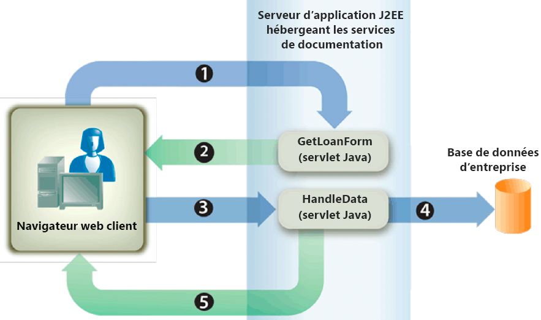

# Rendu des PDF forms interactifs {#rendering-interactive-pdf-forms}

**Les exemples et exemples de ce document ne concernent que l’environnement AEM Forms on JEE.**

Le service Forms effectue le rendu de PDF forms interactifs sur les périphériques clients, généralement les navigateurs Web, afin de recueillir des informations auprès des utilisateurs. Une fois le formulaire interactif rendu, un utilisateur peut saisir des données dans les champs du formulaire et cliquer sur un bouton d’envoi situé sur le formulaire pour renvoyer les informations au service Forms. Adobe Reader ou Acrobat doit être installé sur l’ordinateur hébergeant le navigateur Web client pour qu’un formulaire PDF interactif soit visible.

>[!NOTE]
>
>Avant de pouvoir générer un formulaire à l’aide du service Forms, créez une conception de formulaire. En règle générale, une conception de formulaire est créée dans Designer et enregistrée dans un fichier XDP. Pour plus d’informations sur la création d’une conception de formulaire, voir [Forms Designer](https://www.adobe.com/go/learn_aemforms_designer_63).

**Exemple de demande de prêt**

Un exemple de demande de prêt est présenté pour montrer comment le service Forms utilise des formulaires interactifs pour collecter des informations auprès des utilisateurs. Cette application permet à un utilisateur de remplir un formulaire contenant les données nécessaires pour sécuriser un prêt, puis d’envoyer les données au service Forms. Le diagramme suivant présente le flux logique de la demande de prêt.



Le tableau suivant décrit les étapes de ce diagramme.

<table>
 <thead>
  <tr>
   <th><p>Étape</p></th>
   <th><p>Description</p></th>
  </tr>
 </thead>
 <tbody>
  <tr>
   <td><p>1</p></td>
   <td><p>La servlet Java <code>GetLoanForm</code> est appelée à partir d’une page HTML. </p></td>
  </tr>
  <tr>
   <td><p>2</p></td>
   <td><p>Le servlet Java <code>GetLoanForm</code> utilise l'API Client du service Forms pour rendre le formulaire de prêt au navigateur Web client. (Voir <a href="#render-an-interactive-pdf-form-using-the-java-api">Générer un formulaire PDF interactif à l’aide de l’API Java</a>.)</p></td>
  </tr>
  <tr>
   <td><p>3</p></td>
   <td><p>Une fois que l’utilisateur a rempli le formulaire de prêt et cliqué sur le bouton d’envoi, les données sont envoyées au servlet Java <code>HandleData</code>. (Voir <i>"Formulaire de prêt"</i>.)</p></td>
  </tr>
  <tr>
   <td><p>4</p></td>
   <td><p>Le servlet Java <code>HandleData</code> utilise l’API Client du service Forms pour traiter l’envoi du formulaire et récupérer les données du formulaire. Les données sont ensuite stockées dans une base de données d’entreprise. (Voir <a href="/help/forms/developing/handling-submitted-forms.md#handling-submitted-forms">Gestion du Forms envoyé</a>.)</p></td>
  </tr>
  <tr>
   <td><p>5</p></td>
   <td><p>Un formulaire de confirmation est rendu au navigateur Web. Les données telles que le prénom et le nom de l’utilisateur sont fusionnées avec le formulaire avant d’être générées. (Voir <a href="/help/forms/developing/prepopulating-forms-flowable-layouts.md">Préremplissage de Forms avec des dispositions souple</a>.)</p></td>
  </tr>
 </tbody>
</table>

**Formulaire de prêt**

Ce formulaire interactif de prêt est rendu par le servlet Java `GetLoanForm` de l’exemple de demande de prêt.


**Formulaire de confirmation**

Ce formulaire est rendu par le servlet Java `HandleData` de l’exemple de demande de prêt.


Le servlet Java `HandleData` préremplit ce formulaire avec le prénom et le nom de l’utilisateur, ainsi que le montant. Une fois le formulaire prérempli, il est envoyé au navigateur Web client. (Voir [Préremplissage de Forms avec des dispositions souple](/help/forms/developing/prepopulating-forms-flowable-layouts.md)).

**Servlets Java**

L’exemple de demande de prêt est un exemple d’application de service Forms qui existe en tant que servlet Java. Un servlet Java est un programme Java s’exécutant sur un serveur d’applications J2EE, tel que WebSphere, et contient le code API du client du service Forms.

Le code suivant montre la syntaxe d&#39;une servlet Java appelée GetLoanForm :

```java
     public class GetLoanForm extends HttpServlet implements Servlet {
         public void doGet(HttpServletRequest req, HttpServletResponse resp
         throws ServletException, IOException {

         }
         public void doPost(HttpServletRequest req, HttpServletResponse resp
         throws ServletException, IOException {

             }
```

En règle générale, vous ne placez pas le code de l’API Client du service Forms dans la méthode `doGet` ou `doPost` d’une servlet Java. Il est préférable de programmer pour placer ce code dans une classe distincte, instancier la classe à partir de la méthode `doPost` (ou de la méthode `doGet`) et appeler les méthodes appropriées. Toutefois, pour des raisons de concision du code, les exemples de code de cette section sont conservés au minimum et les exemples de code sont placés dans la méthode `doPost`.

>[!NOTE]
>
>Pour plus d’informations sur le service Forms, voir [Guide de référence des services pour AEM Forms](https://www.adobe.com/go/learn_aemforms_services_63).

**Résumé des étapes**

Pour générer un formulaire PDF interactif, effectuez les tâches suivantes :

1. Incluez des fichiers de projet.
1. Créez un objet API Client Forms.
1. Spécifiez des valeurs URI.
1. Joindre des fichiers au formulaire (facultatif).
1. Générer un formulaire PDF interactif
1. Ecrivez le flux de données du formulaire dans le navigateur Web client.

**Inclure les fichiers de projet**

Incluez les fichiers nécessaires dans votre projet de développement. Si vous créez une application cliente à l’aide de Java, incluez les fichiers JAR nécessaires. Si vous utilisez des services Web, veillez à inclure les fichiers proxy.

**Création d’un objet API Client Forms**

Avant de pouvoir exécuter par programmation une opération d’API Client de service Forms, vous devez créer un objet API Client Forms. Si vous utilisez l’API Java, créez un objet `FormsServiceClient`. Si vous utilisez l’API du service Web Forms, créez un objet `FormsService`.

**Spécification des valeurs URI**

Vous pouvez spécifier les valeurs URI requises par le service Forms pour générer un formulaire. Une conception de formulaire enregistrée dans le cadre d’une application Forms peut être référencée à l’aide de la valeur URI racine de contenu `repository:///`. Prenons l’exemple de la conception de formulaire suivante nommée *Loan.xdp* située dans une application Forms nommée *FormsApplication* :


Pour accéder à cette conception de formulaire, spécifiez `Applications/FormsApplication/1.0/FormsFolder/Loan.xdp` comme nom du formulaire (le premier paramètre transmis à la méthode `renderPDFForm`) et `repository:///` comme valeur URI racine du contenu.

>[!NOTE]
>
>Pour plus d’informations sur la création d’une application Forms à l’aide de Workbench, voir [Aide de Workbench](https://www.adobe.com/go/learn_aemforms_workbench_63).

Le chemin d&#39;accès à une ressource située dans une application Forms est le suivant :

`Applications/Application-name/Application-version/Folder.../Filename`

Les valeurs suivantes présentent quelques exemples de valeurs URI :

* Applications/AppraisalReport/1.0/Forms/FullForm.xdp
* Applications/AnotherApp/1.1/Assets/picture.jpg
* Applications/SomeApp/2.0/Resources/Data/XSDs/MyData.xsd

Lorsque vous générez un formulaire interactif, vous pouvez définir des valeurs d’URI telles que l’URL de la cible vers laquelle les données du formulaire sont publiées. L’URL de la cible peut être définie de l’une des manières suivantes :

* Sur le bouton Envoyer lors de la conception de la conception de formulaire dans Designer
* En utilisant l’API du client du service Forms

Si l’URL de la cible est définie dans la conception de formulaire, ne la remplacez pas par l’API Client du service Forms. En d’autres termes, la définition de l’URL de cible à l’aide de l’API Forms réinitialise l’URL spécifiée dans la conception de formulaire à celle spécifiée à l’aide de l’API. Si vous souhaitez envoyer le formulaire PDF à l’URL de cible spécifiée dans la conception de formulaire, définissez par programmation l’URL de la cible sur une chaîne vide.

Si vous disposez d’un formulaire contenant un bouton d’envoi et un bouton de calcul (avec un script correspondant s’exécutant sur le serveur), vous pouvez définir par programmation l’URL vers laquelle le formulaire est envoyé pour exécuter le script. Utilisez le bouton d’envoi sur la conception de formulaire pour spécifier l’URL vers laquelle les données du formulaire sont publiées. (Voir [Calcul des données de formulaire](/help/forms/developing/calculating-form-data.md).)

>[!NOTE]
>
>Au lieu de spécifier une valeur d’URL pour référencer un fichier XDP, vous pouvez également transmettre une instance `com.adobe.idp.Document` au service Forms. L&#39;instance `com.adobe.idp.Document` contient une conception de formulaire. (Voir [Transmission de Documents au service Forms](/help/forms/developing/passing-documents-forms-service.md).)

**Joindre des fichiers au formulaire**

Vous pouvez joindre des fichiers à un formulaire. Lorsque vous générez un formulaire PDF avec des pièces jointes, les utilisateurs peuvent récupérer les pièces jointes en Acrobat à l’aide du volet de pièces jointes. Vous pouvez associer différents types de fichier à un formulaire, tel qu’un fichier texte, ou à un fichier binaire tel qu’un fichier JPG.

>[!NOTE]
>
>Le fait de joindre des pièces jointes à un formulaire est facultatif.

**Génération d’un formulaire PDF interactif**

Pour générer un formulaire, utilisez une conception de formulaire créée dans Designer et enregistrée dans un fichier XDP ou PDF. Vous pouvez également générer un formulaire créé à l’aide d’Acrobat et enregistré au format PDF. Pour générer un formulaire PDF interactif, appelez la méthode `FormsServiceClient` de l’objet `renderPDFForm` ou la méthode `renderPDFForm2`.

`renderPDFForm` utilise un objet `URLSpec`. La racine de contenu du fichier XDP est transmise au service Forms à l’aide de la méthode `URLSpec` de l’objet `setContentRootURI`. Le nom de la conception de formulaire ( `formQuery`) est transmis en tant que valeur de paramètre distincte. Les deux valeurs sont concaténées pour obtenir la référence absolue à la conception de formulaire.

La méthode `renderPDFForm2` accepte une instance `com.adobe.idp.Document` contenant le document XDP ou PDF à rendre.

>[!NOTE]
>
>L’option d’exécution PDF balisé ne peut pas être définie si le document d’entrée est un document PDF. Si le fichier d’entrée est un fichier XDP, l’option PDF balisé peut être définie.

## Générer un formulaire PDF interactif à l’aide de l’API Java {#render-an-interactive-pdf-form-using-the-java-api}

Générer un formulaire PDF interactif à l’aide de l’API Forms (Java) :

1. Inclure les fichiers de projet

   Incluez des fichiers JAR client, tels que adobe-forms-client.jar, dans le chemin de classe de votre projet Java.

1. Création d’un objet API Client Forms

   * Créez un objet `ServiceClientFactory` qui contient des propriétés de connexion.
   * Créez un objet `FormsServiceClient` en utilisant son constructeur et en transmettant l&#39;objet `ServiceClientFactory`.

1. Spécification des valeurs URI

   * Créez un objet `URLSpec` qui stocke les valeurs URI à l’aide de son constructeur.
   * Appelez la méthode `URLSpec` de l’objet `setApplicationWebRoot` et transmettez une valeur de chaîne qui représente la racine Web de l’application.
   * Appelez la méthode `URLSpec` de l’objet `setContentRootURI` et transmettez une valeur de chaîne qui spécifie la valeur URI racine du contenu. Assurez-vous que la conception de formulaire se trouve dans l’URI racine de contenu. Dans le cas contraire, le service Forms renvoie une exception. Pour référencer le référentiel, spécifiez `repository:///`.
   * Appelez la méthode `URLSpec` de l’objet `setTargetURL` et transmettez une valeur de chaîne qui spécifie la valeur de l’URL de cible à l’endroit où les données du formulaire sont publiées. Si vous définissez l’URL de la cible dans la conception de formulaire, vous pouvez transmettre une chaîne vide. Vous pouvez également spécifier l’URL vers laquelle un formulaire est envoyé pour effectuer des calculs.

1. Joindre des fichiers au formulaire

   * Créez un objet `java.util.HashMap` pour stocker les pièces jointes en utilisant son constructeur.
   * Appelez la méthode `java.util.HashMap` de l’objet `put` pour chaque fichier à joindre au formulaire généré. Transmettez les valeurs suivantes à cette méthode :

      * Valeur de chaîne qui spécifie le nom du fichier joint, y compris l’extension du nom de fichier.
   * Objet `com.adobe.idp.Document` contenant la pièce jointe du fichier.

   >[!NOTE]
   >
   >Répétez cette étape pour chaque fichier à joindre au formulaire. Cette étape est facultative et vous pouvez transmettre `null` si vous ne souhaitez pas envoyer de pièces jointes.

1. Génération d’un formulaire PDF interactif

   Appelez la méthode `renderPDFForm` de l’objet `FormsServiceClient` et transmettez les valeurs suivantes :

   * Valeur de chaîne qui spécifie le nom de la conception de formulaire, y compris l’extension du nom de fichier. Si vous référencez une conception de formulaire faisant partie d’une application Forms, veillez à spécifier le chemin d’accès complet, tel que `Applications/FormsApplication/1.0/FormsFolder/Loan.xdp`.
   * Objet `com.adobe.idp.Document` contenant les données à fusionner avec le formulaire. Si vous ne souhaitez pas fusionner de données, transmettez un objet `com.adobe.idp.Document` vide.
   * Objet `PDFFormRenderSpec` qui stocke les options d’exécution. Il s’agit d’un paramètre facultatif et vous pouvez spécifier `null` si vous ne souhaitez pas spécifier d’options d’exécution.
   * Objet `URLSpec` contenant des valeurs URI requises par le service Forms.
   * Objet `java.util.HashMap` qui stocke les pièces jointes. Il s’agit d’un paramètre facultatif et vous pouvez spécifier `null` si vous ne souhaitez pas joindre de fichiers au formulaire.

   La méthode `renderPDFForm` renvoie un objet `FormsResult` contenant un flux de données de formulaire qui doit être écrit dans le navigateur Web client.

1. Ecrire le flux de données du formulaire dans le navigateur Web client

   * Créez un objet `com.adobe.idp.Document` en appelant la méthode `FormsResult` de l&#39;objet &quot;s `getOutputContent`.
   * Obtenez le type de contenu de l&#39;objet `com.adobe.idp.Document` en appelant sa méthode `getContentType`.
   * Définissez le type de contenu de l&#39;objet `javax.servlet.http.HttpServletResponse` en appelant sa méthode `setContentType` et en transmettant le type de contenu de l&#39;objet `com.adobe.idp.Document`.
   * Créez un objet `javax.servlet.ServletOutputStream` utilisé pour écrire le flux de données du formulaire dans le navigateur Web client en appelant la méthode `javax.servlet.http.HttpServletResponse` de l’objet `getOutputStream`.
   * Créez un objet `java.io.InputStream` en appelant la méthode `com.adobe.idp.Document` de l&#39;objet `getInputStream`.
   * Créez un tableau d’octets et remplissez-le avec le flux de données du formulaire en appelant la méthode `InputStream` de l’objet `read` et en transmettant le tableau d’octets comme argument.
   * Appelez la méthode `javax.servlet.ServletOutputStream` de l’objet `write` pour envoyer le flux de données de formulaire au navigateur Web client. Transférez le tableau d’octets à la méthode `write`.

## Générer un formulaire PDF interactif à l’aide de l’API du service Web {#render-an-interactive-pdf-form-using-the-web-service-api}

Générer un formulaire PDF interactif à l’aide de l’API Forms (service Web) :

1. Inclure les fichiers de projet

   * Créez des classes de proxy Java qui utilisent le WSDL du service Forms.
   * Incluez les classes proxy Java dans votre chemin de classe.

1. Création d’un objet API Client Forms

   Créez un objet `FormsService` et définissez des valeurs d’authentification.

1. Spécification des valeurs URI

   * Créez un objet `URLSpec` qui stocke les valeurs URI à l’aide de son constructeur.
   * Appelez la méthode `URLSpec` de l’objet `setApplicationWebRoot` et transmettez une valeur de chaîne qui représente la racine Web de l’application.
   * Appelez la méthode `URLSpec` de l’objet `setContentRootURI` et transmettez une valeur de chaîne qui spécifie la valeur URI racine du contenu. Assurez-vous que la conception de formulaire se trouve dans l’URI racine de contenu. Dans le cas contraire, le service Forms renvoie une exception. Pour référencer le référentiel, spécifiez `repository:///`.
   * Appelez la méthode `URLSpec` de l’objet `setTargetURL` et transmettez une valeur de chaîne qui spécifie la valeur de l’URL de cible à l’endroit où les données du formulaire sont publiées. Si vous définissez l’URL de la cible dans la conception de formulaire, vous pouvez transmettre une chaîne vide. Vous pouvez également spécifier l’URL vers laquelle un formulaire est envoyé pour effectuer des calculs.

1. Joindre des fichiers au formulaire

   * Créez un objet `java.util.HashMap` pour stocker les pièces jointes en utilisant son constructeur.
   * Appelez la méthode `java.util.HashMap` de l’objet `put` pour chaque fichier à joindre au formulaire généré. Transmettez les valeurs suivantes à cette méthode :

      * Valeur de chaîne spécifiant le nom du fichier joint, y compris l’extension du nom de fichier
   * Objet `BLOB` contenant la pièce jointe du fichier

   >[!NOTE]
   >
   >Répétez cette étape pour chaque fichier à joindre au formulaire.

1. Génération d’un formulaire PDF interactif

   Appelez la méthode `renderPDFForm` de l’objet `FormsService` et transmettez les valeurs suivantes :

   * Valeur de chaîne qui spécifie le nom de la conception de formulaire, y compris l’extension du nom de fichier. Si vous référencez une conception de formulaire faisant partie d’une application Forms, veillez à spécifier le chemin d’accès complet, tel que `Applications/FormsApplication/1.0/FormsFolder/Loan.xdp`.
   * Objet `BLOB` contenant les données à fusionner avec le formulaire. Si vous ne souhaitez pas fusionner les données, transmettez `null`.
   * Objet `PDFFormRenderSpec` qui stocke les options d’exécution. Il s’agit d’un paramètre facultatif et vous pouvez spécifier `null` si vous ne souhaitez pas spécifier d’options d’exécution.
   * Objet `URLSpec` contenant des valeurs URI requises par le service Forms.
   * Objet `java.util.HashMap` qui stocke les pièces jointes. Il s’agit d’un paramètre facultatif et vous pouvez spécifier `null` si vous ne souhaitez pas joindre de fichiers au formulaire.
   * Objet `com.adobe.idp.services.holders.BLOBHolder` vide renseigné par la méthode. Elle permet de stocker le formulaire PDF rendu.
   * Objet `javax.xml.rpc.holders.LongHolder` vide renseigné par la méthode. (Cet argument stocke le nombre de pages dans le formulaire.)
   * Objet `javax.xml.rpc.holders.StringHolder` vide renseigné par la méthode. (Cet argument stocke la valeur du paramètre régional.)
   * Un objet `com.adobe.idp.services.holders.FormsResultHolder` vide qui contiendra les résultats de cette opération.

   La méthode `renderPDFForm` remplit l’objet `com.adobe.idp.services.holders.FormsResultHolder` transmis en tant que valeur du dernier argument avec un flux de données de formulaire qui doit être écrit dans le navigateur Web client.

1. Ecrire le flux de données du formulaire dans le navigateur Web client

   * Créez un objet `FormResult` en obtenant la valeur du membre de données `com.adobe.idp.services.holders.FormsResultHolder` de l&#39;objet `value`.
   * Créez un objet `BLOB` contenant des données de formulaire en appelant la méthode `FormsResult` de l&#39;objet `getOutputContent`.
   * Obtenez le type de contenu de l&#39;objet `BLOB` en appelant sa méthode `getContentType`.
   * Définissez le type de contenu de l&#39;objet `javax.servlet.http.HttpServletResponse` en appelant sa méthode `setContentType` et en transmettant le type de contenu de l&#39;objet `BLOB`.
   * Créez un objet `javax.servlet.ServletOutputStream` utilisé pour écrire le flux de données du formulaire dans le navigateur Web client en appelant la méthode `javax.servlet.http.HttpServletResponse` de l’objet `getOutputStream`.
   * Créez un tableau d’octets et remplissez-le en appelant la méthode `BLOB` de l’objet `getBinaryData`. Cette tâche affecte le contenu de l&#39;objet `FormsResult` au tableau d&#39;octets.
   * Appelez la méthode `javax.servlet.http.HttpServletResponse` de l’objet `write` pour envoyer le flux de données de formulaire au navigateur Web client. Transférez le tableau d’octets à la méthode `write`.

**Ecrire le flux de données du formulaire dans le navigateur Web client**

Lorsque le service Forms effectue le rendu d’un formulaire, il renvoie un flux de données de formulaire que vous devez écrire dans le navigateur Web client. Lorsqu’il est écrit dans le navigateur Web client, le formulaire est visible pour l’utilisateur.
