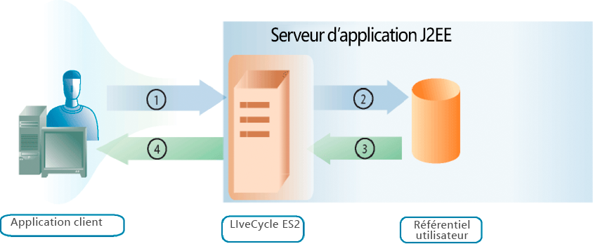

# Gestion des utilisateurs {#managing-users}

**À propos de User Management**

Vous pouvez utiliser l’API User Management pour créer des applications clientes capables de gérer des rôles, des autorisations et des entités (qui peuvent être des utilisateurs ou des groupes), ainsi que d’authentifier des utilisateurs. L’API User Management se compose des API AEM Forms suivantes :

* API du service Directory Manager
* API du service Authentication Manager
* API du service Authorization Manager

User Management vous permet d’attribuer, de supprimer et de déterminer des rôles et des autorisations. Il vous permet également d’attribuer, de supprimer et de requête des domaines, des utilisateurs et des groupes. Enfin, vous pouvez utiliser User Management pour authentifier les utilisateurs.

Dans [Ajouter Utilisateurs](users.md#adding-users), vous comprendrez comment ajouter des utilisateurs par programmation. Cette section utilise l’API du service Directory Manager.

Dans [Suppression d’utilisateurs](users.md#deleting-users), vous comprendrez comment supprimer des utilisateurs par programmation. Cette section utilise l’API du service Directory Manager.

Dans [Gestion des utilisateurs et des groupes](users.md#managing-users-and-groups), vous comprendrez la différence entre un utilisateur local et un utilisateur d&#39;annuaire et vous verrez des exemples d&#39;utilisation des API Java et des services Web pour gérer par programmation les utilisateurs et les groupes. Cette section utilise l’API du service Directory Manager.

Dans [Gestion des rôles et des autorisations](users.md#managing-roles-and-permissions), vous découvrirez les rôles et autorisations du système et ce que vous pouvez faire par programmation pour les améliorer, et vous verrez des exemples d&#39;utilisation des API Java et des services Web pour gérer par programmation les rôles et les autorisations. Cette section utilise à la fois l’API Service du Gestionnaire d’annuaires et l’API Service du Gestionnaire d’autorisations.

Dans [Authentification des utilisateurs](users.md#authenticating-users), vous verrez des exemples d&#39;utilisation des API Java et des API de services Web pour authentifier les utilisateurs par programmation. Cette section utilise l’API Service du Gestionnaire d’autorisations.

**Présentation du processus d&#39;authentification**

User Management offre une fonctionnalité d’authentification intégrée et vous permet également de la connecter à votre propre fournisseur d’authentification. Lorsque User Management reçoit une demande d’authentification (par exemple, un utilisateur tente de se connecter), il transmet les informations utilisateur au fournisseur d’authentification pour authentification. User Management reçoit les résultats du fournisseur d’authentification après l’authentification de l’utilisateur.

Le diagramme suivant montre l&#39;interaction entre un utilisateur final qui tente de se connecter, User Management et le fournisseur d&#39;authentification.

Le tableau suivant décrit chaque étape du processus d’authentification.

<table>
 <thead>
  <tr>
   <th>
Étape
</th>
   <th>
Description
</th>
  </tr>
 </thead>
 <tbody>
  <tr>
   <td>
1
</td>
   <td>
Un utilisateur tente de se connecter à un service qui appelle User Management. L’utilisateur spécifie un nom d’utilisateur et un mot de passe. 
</td>
  </tr>
  <tr>
   <td>
2
</td>
   <td>
User Management envoie le nom d’utilisateur et le mot de passe, ainsi que les informations de configuration, au fournisseur d’authentification.
</td>
  </tr>
  <tr>
   <td>
3
</td>
   <td>
Le fournisseur d’authentification se connecte au magasin d’utilisateurs et authentifie l’utilisateur.
</td>
  </tr>
  <tr>
   <td>
4
</td>
   <td>
Le fournisseur d’authentification renvoie les résultats à User Management.
</td>
  </tr>
  <tr>
   <td>
5
</td>
   <td>
User Management permet à l’utilisateur de se connecter ou refuse l’accès au produit.
</td>
  </tr>
 </tbody>
</table>

>[!NOTE]
>
>Si le fuseau horaire du serveur est différent du fuseau horaire du client, lorsque vous utilisez le fichier WSDL pour le service AEM Forms Generate PDF sur une pile SOAP native utilisant un client .NET sur une grappe WebSphere Application Server, l’erreur d’authentification User Management suivante peut se produire :

`[com.adobe.idp.um.webservices.WSSecurityHandler] errorCode:12803 errorCodeHEX:0x3203 message:WSSecurityHandler: UM authenticate returns exception : An error was discovered processing the <wsse:Security> header. (WSSecurityEngine: Invalid timestamp The security semantics of message have expired).`

**Présentation de la gestion des répertoires**

User Management est fourni avec un prestataire d’annuaire (DirectoryManagerService) qui prend en charge les connexions aux annuaires LDAP. Si votre entreprise utilise un référentiel non LDAP pour stocker les enregistrements d’utilisateurs, vous pouvez créer votre propre prestataire d’annuaire qui fonctionne avec votre référentiel.

Les prestataires d’annuaire récupèrent les enregistrements d’un magasin d’utilisateurs à la demande de User Management. User Management met régulièrement en cache les enregistrements d’utilisateurs et de groupes dans la base de données afin d’améliorer les performances.

Le prestataire d’annuaire peut être utilisé pour synchroniser la base de données User Management avec la banque d’utilisateurs. Cette étape permet de s’assurer que toutes les informations d’annuaire des utilisateurs et tous les enregistrements d’utilisateurs et de groupes sont à jour.

En outre, DirectoryManagerService vous permet de créer et de gérer des domaines. Les domaines définissent différentes bases d’utilisateurs. Les limites d’un domaine sont généralement définies en fonction de la manière dont votre organisation est structurée ou dont votre magasin d’utilisateurs est configuré. Les domaines User Management fournissent des paramètres de configuration que les fournisseurs d’authentification et les prestataires d’annuaire utilisent.

Dans la configuration XML exportée par User Management, le noeud racine dont la valeur d’attribut est `Domains` contient un élément XML pour chaque domaine défini pour User Management. Chacun de ces éléments contient d’autres éléments qui définissent les aspects du domaine associés à des prestataires spécifiques.

**Présentation des valeurs objectSID**

Lors de l&#39;utilisation de Principale Directory, il est important de comprendre qu&#39;une valeur `objectSID` n&#39;est pas un attribut unique sur plusieurs domaines. Cette valeur stocke l’identifiant de sécurité d’un objet. Dans un environnement de plusieurs domaines (par exemple, une arborescence de domaines), la valeur `objectSID` peut être différente.

Une valeur `objectSID` changerait si un objet est déplacé d&#39;un domaine Principale Directory vers un autre. Certains objets ont la même valeur `objectSID` n’importe où dans le domaine. Par exemple, les groupes tels que BUILTIN\Administrators, BUILTIN\Power Users, etc., auraient la même valeur `objectSID` indépendamment des domaines. Ces valeurs `objectSID` sont bien connues.

## Ajouter des utilisateurs {#adding-users}

Vous pouvez utiliser l’API Service Directory Manager (Java et le service Web) pour ajouter des utilisateurs par programmation à AEM Forms. Après avoir ajouté un utilisateur, vous pouvez l’utiliser lors d’une opération de service nécessitant un utilisateur. Par exemple, vous pouvez affecter une tâche au nouvel utilisateur.

### Résumé des étapes {#summary-of-steps}

Pour ajouter un utilisateur, procédez comme suit :

1. Incluez des fichiers de projet.
1. Créez un client DirectoryManagerService.
1. Définissez les informations utilisateur.
1. Ajoutez l’utilisateur à AEM Forms.
1. Vérifiez que l’utilisateur est ajouté.

**Inclure les fichiers de projet**

Incluez les fichiers nécessaires dans votre projet de développement. Si vous créez une application cliente à l’aide de Java, incluez les fichiers JAR nécessaires. Si vous utilisez des services Web, incluez les fichiers proxy.

**Création d’un client DirectoryManagerService**

Avant de pouvoir exécuter une opération de service Directory Manager par programmation, créez un client API de service Directory Manager.

**Définition des informations utilisateur**

Lorsque vous ajoutez un nouvel utilisateur à l’aide de l’API Service Directory Manager, définissez les informations de cet utilisateur. En règle générale, lorsque vous ajoutez un nouvel utilisateur, vous définissez les valeurs suivantes :

* **Nom** de domaine : Domaine auquel l’utilisateur appartient (par exemple,  `DefaultDom`).
* **Valeur** de l&#39;identifiant utilisateur : Valeur d’identificateur de l’utilisateur (par exemple,  `wblue`).
* **Type** principal : Type d’utilisateur (par exemple, vous pouvez spécifier  `USER)`.
* **Prénom** : Nom donné à l’utilisateur (par exemple,  `Wendy`).
* **Nom** de famille : Nom de famille de l’utilisateur (par exemple,  `Blue)`.
* **Paramètres régionaux** : Informations sur les paramètres régionaux de l’utilisateur.

**Ajouter l&#39;utilisateur à AEM Forms**

Après avoir défini les informations utilisateur, vous pouvez ajouter l’utilisateur à AEM Forms. Pour ajouter un utilisateur, appelez la méthode `DirectoryManagerServiceClient` de l’objet `createLocalUser`.

**Vérification de l’ajout de l’utilisateur**

Vous pouvez vérifier que l’utilisateur a été ajouté pour vous assurer qu’aucun problème n’est survenu. Localisez le nouvel utilisateur à l’aide de la valeur d’identificateur d’utilisateur.

**Voir également**

[Ajouter les utilisateurs à l’aide de l’API Java](users.md#add-users-using-the-java-api)

[Ajouter les utilisateurs à l’aide de l’API du service Web](users.md#add-users-using-the-web-service-api)

[Inclusion des fichiers de bibliothèque Java AEM Forms](/help/forms/developing/invoking-aem-forms-using-java.md#including-aem-forms-java-library-files)

[Réglage des propriétés de la connexion](/help/forms/developing/invoking-aem-forms-using-java.md#setting-connection-properties)

[Suppression d’utilisateurs](users.md#deleting-users)

### Ajouter les utilisateurs à l’aide de l’API Java {#add-users-using-the-java-api}

Ajoutez les utilisateurs à l’aide de l’API Service Directory Manager (Java) :

1. Incluez des fichiers de projet.

   Incluez des fichiers JAR client, tels que adobe-usermanager-client.jar, dans le chemin de classe de votre projet Java.

1. Créez un client DirectoryManagerServices.

   Créez un objet `DirectoryManagerServiceClient` en utilisant son constructeur et en transmettant un objet `ServiceClientFactory` contenant des propriétés de connexion.

1. Définissez les informations utilisateur.

   * Créez un objet `UserImpl` en utilisant son constructeur.
   * Définissez le nom demain en appelant la méthode `setDomainName` de l&#39;objet `UserImpl`. Transmettez une valeur de chaîne qui spécifie le nom de domaine.
   * Définissez le type principal en appelant la méthode `setPrincipalType` de l’objet `UserImpl`. Transmettez une valeur de chaîne qui spécifie le type d’utilisateur. Par exemple, vous pouvez spécifier `USER`.
   * Définissez la valeur de l’identifiant utilisateur en appelant la méthode `setUserid` de l’objet `UserImpl`. Transmettez une valeur de chaîne qui spécifie la valeur de l’identifiant utilisateur. Par exemple, vous pouvez spécifier `wblue`.
   * Définissez le nom canonique en appelant la méthode `UserImpl` de l’objet `setCanonicalName`. Transmettez une valeur de chaîne qui spécifie le nom canonique de l’utilisateur. Par exemple, vous pouvez spécifier `wblue`.
   * Définissez le nom donné en appelant la méthode `UserImpl` de l’objet `setGivenName`. Transmettez une valeur de chaîne qui spécifie le prénom de l’utilisateur. Par exemple, vous pouvez spécifier `Wendy`.
   * Définissez le nom de famille en appelant la méthode `setFamilyName` de l’objet `UserImpl`. Transmettez une valeur de chaîne qui spécifie le nom de famille de l’utilisateur. Par exemple, vous pouvez spécifier `Blue`.

   >[!NOTE]
   >
   >Appelez une méthode qui appartient à l&#39;objet `UserImpl` pour définir d&#39;autres valeurs. Par exemple, vous pouvez définir la valeur du paramètre régional en appelant la méthode `UserImpl` de l’objet `setLocale`.

1. Ajoutez l’utilisateur à AEM Forms.

   Appelez la méthode `createLocalUser` de l’objet `DirectoryManagerServiceClient` et transmettez les valeurs suivantes :

   * Objet `UserImpl` représentant le nouvel utilisateur
   * Valeur de chaîne représentant le mot de passe de l’utilisateur.

   La méthode `createLocalUser` renvoie une valeur de chaîne qui spécifie la valeur de l&#39;identifiant utilisateur local.

1. Vérifiez que l’utilisateur a été ajouté.

   * Créez un objet `PrincipalSearchFilter` en utilisant son constructeur.
   * Définissez la valeur de l’identifiant utilisateur en appelant la méthode `setUserId` de l’objet `PrincipalSearchFilter`. Transmettez une valeur de chaîne qui représente la valeur de l’identifiant utilisateur.
   * Appelez la méthode `DirectoryManagerServiceClient` de l&#39;objet `findPrincipals` et transmettez l&#39;objet `PrincipalSearchFilter`. Cette méthode renvoie une instance `java.util.List`, où chaque élément est un objet `User`. Effectuez une itération sur l&#39;instance `java.util.List` pour localiser l&#39;utilisateur.

**Voir également**

[Résumé des étapes](users.md#summary-of-steps)

[Début rapide (mode SOAP) : Ajouter les utilisateurs à l’aide de l’API Java](/help/forms/developing/user-manager-java-api-quick.md#quick-start-soap-mode-adding-users-using-the-java-api)

[Inclusion des fichiers de bibliothèque Java AEM Forms](/help/forms/developing/invoking-aem-forms-using-java.md#including-aem-forms-java-library-files)

[Réglage des propriétés de la connexion](/help/forms/developing/invoking-aem-forms-using-java.md#setting-connection-properties)

### Ajouter les utilisateurs à l’aide de l’API du service Web {#add-users-using-the-web-service-api}

Ajoutez les utilisateurs à l’aide de l’API Service Directory Manager (service Web) :

1. Incluez des fichiers de projet.

   Créez un projet Microsoft .NET qui utilise MTOM. Veillez à utiliser la définition WSDL suivante pour la référence de service : `http://localhost:8080/soap/services/DirectoryManagerService?WSDL&lc_version=9.0.1`.

   >[!NOTE]
   >
   >Remplacez `localhost` par l’adresse IP du serveur hébergeant AEM Forms.

1. Créez un client DirectoryManagerService.

   * Créez un objet `DirectoryManagerServiceClient` en utilisant son constructeur par défaut.
   * Créez un objet `DirectoryManagerServiceClient.Endpoint.Address` en utilisant le constructeur `System.ServiceModel.EndpointAddress`. Transmettez une valeur de chaîne qui spécifie le WSDL au service AEM Forms (par exemple, `http://localhost:8080/soap/services/DirectoryManagerService?blob=mtom`). Vous n&#39;avez pas besoin d&#39;utiliser l&#39;attribut `lc_version`. Cet attribut est utilisé lorsque vous créez une référence de service. Veillez à spécifier `?blob=mtom`.
   * Créez un objet `System.ServiceModel.BasicHttpBinding` en obtenant la valeur du champ `DirectoryManagerServiceClient.Endpoint.Binding`. Convertissez la valeur de retour en `BasicHttpBinding`.
   * Définissez le champ `MessageEncoding` de l’objet `System.ServiceModel.BasicHttpBinding` sur `WSMessageEncoding.Mtom`. Cette valeur garantit l’utilisation de MTOM.
   * Activez l’authentification HTTP de base en exécutant les tâches suivantes :

      * Attribuez le nom d’utilisateur AEM forms au champ `DirectoryManagerServiceClient.ClientCredentials.UserName.UserName`.
      * Attribuez la valeur de mot de passe correspondante au champ `DirectoryManagerServiceClient.ClientCredentials.UserName.Password`.
      * Affectez la valeur constante `HttpClientCredentialType.Basic` au champ `BasicHttpBindingSecurity.Transport.ClientCredentialType`.
      * Affectez la valeur constante `BasicHttpSecurityMode.TransportCredentialOnly` au champ `BasicHttpBindingSecurity.Security.Mode`.

1. Définissez les informations utilisateur.

   * Créez un objet `UserImpl` en utilisant son constructeur.
   * Définissez le nom demain en attribuant une valeur de chaîne au champ `UserImpl` de l’objet `domainName`.
   * Définissez le type principal en attribuant une valeur de chaîne au champ `UserImpl` de l’objet `principalType`. Par exemple, vous pouvez spécifier `USER`.
   * Définissez la valeur de l’identifiant utilisateur en attribuant une valeur de chaîne au champ `UserImpl` de l’objet `userid`.
   * Définissez la valeur de nom canonique en attribuant une valeur de chaîne au champ `UserImpl` de l’objet `canonicalName`.
   * Définissez la valeur de nom donnée en attribuant une valeur de chaîne au champ `UserImpl` de l’objet `givenName`.
   * Définissez la valeur du nom de famille en attribuant une valeur de chaîne au champ `UserImpl` de l’objet `familyName`.

1. Ajoutez l’utilisateur à AEM Forms.

   Appelez la méthode `createLocalUser` de l’objet `DirectoryManagerServiceClient` et transmettez les valeurs suivantes :

   * Objet `UserImpl` représentant le nouvel utilisateur
   * Valeur de chaîne représentant le mot de passe de l’utilisateur.

   La méthode `createLocalUser` renvoie une valeur de chaîne qui spécifie la valeur de l&#39;identifiant utilisateur local.

1. Vérifiez que l’utilisateur a été ajouté.

   * Créez un objet `PrincipalSearchFilter` en utilisant son constructeur.
   * Définissez la valeur d’identificateur d’utilisateur de l’utilisateur en attribuant une valeur de chaîne qui représente la valeur d’identificateur d’utilisateur au champ `PrincipalSearchFilter` de l’objet `userId`.
   * Appelez la méthode `DirectoryManagerServiceClient` de l&#39;objet `findPrincipals` et transmettez l&#39;objet `PrincipalSearchFilter`. Cette méthode renvoie un objet de collection `MyArrayOfUser`, où chaque élément est un objet `User`. Effectuez une itération dans la collection `MyArrayOfUser` pour localiser l’utilisateur.

**Voir également**

[Résumé des étapes](users.md#summary-of-steps)

[Appel de AEM Forms à l’aide de MTOM](/help/forms/developing/invoking-aem-forms-using-web.md#invoking-aem-forms-using-mtom)

[Appel de AEM Forms à l’aide de SwaRef](/help/forms/developing/invoking-aem-forms-using-web.md#invoking-aem-forms-using-swaref)

## Suppression d’utilisateurs {#deleting-users}

Vous pouvez utiliser l’API Service Directory Manager (Java et le service Web) pour supprimer par programmation des utilisateurs d’AEM Forms. Après avoir supprimé un utilisateur, il ne peut plus être utilisé pour effectuer une opération de service nécessitant un utilisateur. Par exemple, vous ne pouvez pas affecter une tâche à un utilisateur supprimé.

### Résumé des étapes {#summary_of_steps-1}

Pour supprimer un utilisateur, procédez comme suit :

1. Incluez des fichiers de projet.
1. Créez un client DirectoryManagerService.
1. Indiquez l’utilisateur à supprimer.
1. Supprimez l’utilisateur de AEM Forms.

**Inclure les fichiers de projet**

Incluez les fichiers nécessaires dans votre projet de développement. Si vous créez une application cliente à l’aide de Java, incluez les fichiers JAR nécessaires. Si vous utilisez des services Web, incluez les fichiers proxy.

**Création d’un client DirectoryManagerService**

Avant de pouvoir exécuter par programmation une opération d’API de service Directory Manager, créez un client de service Directory Manager.

**Spécifier l&#39;utilisateur à supprimer**

Vous pouvez spécifier un utilisateur à supprimer à l’aide de la valeur d’identificateur de l’utilisateur.

**Supprimer l&#39;utilisateur d&#39;AEM Forms**

Pour supprimer un utilisateur, appelez la méthode `DirectoryManagerServiceClient` de l’objet `deleteLocalUser`.

**Voir également**

[Suppression d’utilisateurs à l’aide de l’API Java](users.md#delete-users-using-the-java-api)

[Suppression d’utilisateurs à l’aide de l’API de service Web](users.md#delete-users-using-the-web-service-api)

[Inclusion des fichiers de bibliothèque Java AEM Forms](/help/forms/developing/invoking-aem-forms-using-java.md#including-aem-forms-java-library-files)

[Réglage des propriétés de la connexion](/help/forms/developing/invoking-aem-forms-using-java.md#setting-connection-properties)

[Ajouter des utilisateurs](users.md#adding-users)

### Supprimer les utilisateurs à l’aide de l’API Java {#delete-users-using-the-java-api}

Supprimez des utilisateurs à l’aide de l’API Service Directory Manager (Java) :

1. Incluez des fichiers de projet.

   Incluez des fichiers JAR client, tels que adobe-usermanager-client.jar, dans le chemin de classe de votre projet Java.

1. Créez un client DirectoryManagerService.

   Créez un objet `DirectoryManagerServiceClient` en utilisant son constructeur et en transmettant un objet `ServiceClientFactory` contenant des propriétés de connexion.

1. Indiquez l’utilisateur à supprimer.

   * Créez un objet `PrincipalSearchFilter` en utilisant son constructeur.
   * Définissez la valeur de l’identifiant utilisateur en appelant la méthode `setUserId` de l’objet `PrincipalSearchFilter`. Transmettez une valeur de chaîne qui représente la valeur de l’identifiant utilisateur.
   * Appelez la méthode `DirectoryManagerServiceClient` de l&#39;objet `findPrincipals` et transmettez l&#39;objet `PrincipalSearchFilter`. Cette méthode renvoie une instance `java.util.List`, où chaque élément est un objet `User`. Effectuez une itération sur l&#39;instance `java.util.List` pour localiser l&#39;utilisateur à supprimer.

1. Supprimez l’utilisateur de AEM Forms.

   Appelez la méthode `deleteLocalUser` de l’objet `DirectoryManagerServiceClient` et transmettez la valeur du champ `User` de l’objet `oid`. Appelez la méthode `User` de l’objet `getOid`. Utilisez l&#39;objet `User` récupéré de l&#39;instance `java.util.List`.

**Voir également**

[Résumé des étapes](users.md#summary-of-steps)

[Début rapide (mode EJB) : Suppression d’utilisateurs à l’aide de l’API Java](/help/forms/developing/user-manager-java-api-quick.md#quick-start-soap-mode-deleting-users-using-the-java-api)

[Début rapide (mode SOAP) : Suppression d’utilisateurs à l’aide de l’API Java](/help/forms/developing/user-manager-java-api-quick.md#quick-start-soap-mode-deleting-users-using-the-java-api)

[Inclusion des fichiers de bibliothèque Java AEM Forms](/help/forms/developing/invoking-aem-forms-using-java.md#including-aem-forms-java-library-files)

[Réglage des propriétés de la connexion](/help/forms/developing/invoking-aem-forms-using-java.md#setting-connection-properties)

### Supprimer les utilisateurs à l’aide de l’API de service Web {#delete-users-using-the-web-service-api}

Supprimez des utilisateurs à l’aide de l’API Service Directory Manager (service Web) :

1. Incluez des fichiers de projet.

   Incluez des fichiers JAR client, tels que adobe-usermanager-client.jar, dans le chemin de classe de votre projet Java.

1. Créez un client DirectoryManagerService.

   * Créez un objet `DirectoryManagerServiceClient` en utilisant son constructeur par défaut.
   * Créez un objet `DirectoryManagerServiceClient.Endpoint.Address` en utilisant le constructeur `System.ServiceModel.EndpointAddress`. Transmettez une valeur de chaîne qui spécifie le WSDL au service AEM Forms (par exemple, `http://localhost:8080/soap/services/DirectoryManagerService?blob=mtom`). Vous n&#39;avez pas besoin d&#39;utiliser l&#39;attribut `lc_version`. Cet attribut est utilisé lorsque vous créez une référence de service. Veillez à spécifier `blob=mtom.`
   * Créez un objet `System.ServiceModel.BasicHttpBinding` en obtenant la valeur du champ `DirectoryManagerServiceClient.Endpoint.Binding`. Convertissez la valeur de retour en `BasicHttpBinding`.
   * Définissez le champ `MessageEncoding` de l’objet `System.ServiceModel.BasicHttpBinding` sur `WSMessageEncoding.Mtom`. Cette valeur garantit l’utilisation de MTOM.
   * Activez l’authentification HTTP de base en exécutant les tâches suivantes :

      * Attribuez le nom d’utilisateur AEM forms au champ `DirectoryManagerServiceClient.ClientCredentials.UserName.UserName`.
      * Attribuez la valeur de mot de passe correspondante au champ `DirectoryManagerServiceClient.ClientCredentials.UserName.Password`.
      * Affectez la valeur constante `HttpClientCredentialType.Basic` au champ `BasicHttpBindingSecurity.Transport.ClientCredentialType`.
      * Affectez la valeur constante `BasicHttpSecurityMode.TransportCredentialOnly` au champ `BasicHttpBindingSecurity.Security.Mode`.

1. Indiquez l’utilisateur à supprimer.

   * Créez un objet `PrincipalSearchFilter` en utilisant son constructeur.
   * Définissez la valeur de l’identifiant utilisateur en attribuant une valeur de chaîne au champ `PrincipalSearchFilter` de l’objet `userId`.
   * Appelez la méthode `DirectoryManagerServiceClient` de l&#39;objet `findPrincipals` et transmettez l&#39;objet `PrincipalSearchFilter`. Cette méthode renvoie un objet de collection `MyArrayOfUser`, où chaque élément est un objet `User`. Effectuez une itération dans la collection `MyArrayOfUser` pour localiser l’utilisateur. L&#39;objet `User` récupéré de l&#39;objet de collection `MyArrayOfUser` est utilisé pour supprimer l&#39;utilisateur.

1. Supprimez l’utilisateur de AEM Forms.

   Supprimez l’utilisateur en transmettant la valeur du champ `oid` de l’objet `User` à la méthode `DirectoryManagerServiceClient` de l’objet `deleteLocalUser`.

**Voir également**

[Résumé des étapes](users.md#summary-of-steps)

[Appel de AEM Forms à l’aide de MTOM](/help/forms/developing/invoking-aem-forms-using-web.md#invoking-aem-forms-using-mtom)

[Appel de AEM Forms à l’aide de SwaRef](/help/forms/developing/invoking-aem-forms-using-web.md#invoking-aem-forms-using-swaref)

## Création de groupes  {#creating-groups}

Vous pouvez utiliser l’API Service Directory Manager (Java et le service Web) pour créer par programmation des groupes AEM Forms. Après avoir créé un groupe, vous pouvez l’utiliser pour effectuer une opération de service nécessitant un groupe. Par exemple, vous pouvez affecter un utilisateur au nouveau groupe. (Voir [Gestion des utilisateurs et des groupes](users.md#managing-users-and-groups).)

### Résumé des étapes {#summary_of_steps-2}

Pour créer un groupe, procédez comme suit :

1. Incluez des fichiers de projet.
1. Créez un client DirectoryManagerService.
1. Déterminez que le groupe n’existe pas.
1. Créez le groupe.
1. Exécutez une action avec le groupe.

**Inclure les fichiers de projet**

Incluez les fichiers nécessaires dans votre projet de développement. Si vous créez une application cliente à l’aide de Java, incluez les fichiers JAR nécessaires.

Les fichiers JAR suivants doivent être ajoutés au chemin de classe de votre projet :

* adobe-livecycle-client.jar
* adobe-usermanager-client.jar
* adobe-utilities.jar (requis si AEM Forms est déployé sur JBoss)
* jbossall-client.jar (requis si AEM Forms est déployé sur JBoss)

Pour plus d’informations sur l’emplacement de ces fichiers JAR, voir [Inclusion de fichiers de bibliothèque Java AEM Forms](/help/forms/developing/invoking-aem-forms-using-java.md#including-aem-forms-java-library-files).

**Création d’un client DirectoryManagerService**

Avant de pouvoir exécuter une opération de service Directory Manager par programmation, créez un client API de service Directory Manager.

**Déterminer si le groupe existe**

Lorsque vous créez un groupe, assurez-vous qu’il n’existe pas dans le même domaine. Autrement dit, deux groupes ne peuvent pas porter le même nom dans le même domaine. Pour effectuer cette tâche, effectuez une recherche et filtrez les résultats de la recherche en fonction de deux valeurs. Définissez le type principal sur `com.adobe.idp.um.api.infomodel.Principal.PRINCIPALTYPE_GROUP` pour vous assurer que seuls les groupes sont renvoyés. Veillez également à spécifier le nom de domaine.

**Création du groupe**

Après avoir déterminé que le groupe n’existe pas dans le domaine, créez-le et spécifiez les attributs suivants :

* **CommonName** : Nom du groupe.
* **Domaine** : Domaine dans lequel le groupe est ajouté.
* **Description** : Description du groupe.

**Exécution d’une action avec le groupe**

Après avoir créé un groupe, vous pouvez exécuter une action à l’aide de ce groupe. Par exemple, vous pouvez ajouter un utilisateur au groupe. Pour ajouter un utilisateur à un groupe, récupérez la valeur d’identificateur unique de l’utilisateur et du groupe. Transmettez ces valeurs à la méthode `addPrincipalToLocalGroup`.

**Voir également**

[Création de groupes à l’aide de l’API Java](users.md#create-groups-using-the-java-api)

[Inclusion des fichiers de bibliothèque Java AEM Forms](/help/forms/developing/invoking-aem-forms-using-java.md#including-aem-forms-java-library-files)

[Réglage des propriétés de la connexion](/help/forms/developing/invoking-aem-forms-using-java.md#setting-connection-properties)

[Ajouter des utilisateurs](users.md#adding-users)

[Suppression d’utilisateurs](users.md#deleting-users)

### Créer des groupes à l’aide de l’API Java {#create-groups-using-the-java-api}

Créez un groupe à l’aide de l’API Service Directory Manager (Java) :

1. Incluez des fichiers de projet.

   Incluez des fichiers JAR client, tels que adobe-usermanager-client.jar, dans le chemin de classe de votre projet Java.

1. Créez un client DirectoryManagerService.

   Créez un objet `DirectoryManagerServiceClient` en utilisant son constructeur et en transmettant un objet `ServiceClientFactory` contenant des propriétés de connexion.

1. Déterminez si le groupe existe.

   * Créez un objet `PrincipalSearchFilter` en utilisant son constructeur.
   * Définissez le type principal en appelant l&#39;objet `PrincipalSearchFilter` `setPrincipalType` de l&#39;objet. Transmettez la valeur `com.adobe.idp.um.api.infomodel.Principal.PRINCIPALTYPE_GROUP`.
   * Définissez le domaine en appelant l&#39;objet `PrincipalSearchFilter` `setSpecificDomainName` de l&#39;objet. Transmettez une valeur de chaîne qui spécifie le nom de domaine.
   * Pour trouver un groupe, appelez la méthode `DirectoryManagerServiceClient` de l&#39;objet `findPrincipals` (une entité principale peut être un groupe). Transmettez l&#39;objet `PrincipalSearchFilter` qui spécifie le type principal et le nom de domaine. Cette méthode renvoie une instance `java.util.List` où chaque élément est une instance `Group`. Chaque instance de groupe est conforme au filtre spécifié à l’aide de l’objet `PrincipalSearchFilter`.
   * Effectuez une itération sur l&#39;instance `java.util.List`. Pour chaque élément, récupérez le nom du groupe. Assurez-vous que le nom du groupe n’est pas égal au nouveau nom du groupe.

1. Créez le groupe.

   * Si le groupe n&#39;existe pas, appelez la méthode `Group` de l&#39;objet `setCommonName` et transmettez une valeur de chaîne qui spécifie le nom du groupe.
   * Appelez la méthode `Group` de l’objet `setDescription` et transmettez une valeur de chaîne qui spécifie la description du groupe.
   * Appelez la méthode `Group` de l’objet `setDomainName` et transmettez une valeur de chaîne qui spécifie le nom de domaine.
   * Appelez la méthode `DirectoryManagerServiceClient` de l’objet `createLocalGroup` et transmettez l’instance `Group`.

   La méthode `createLocalUser` renvoie une valeur de chaîne qui spécifie la valeur de l&#39;identifiant utilisateur local.

1. Exécutez une action avec le groupe.

   * Créez un objet `PrincipalSearchFilter` en utilisant son constructeur.
   * Définissez la valeur de l’identifiant utilisateur en appelant la méthode `setUserId` de l’objet `PrincipalSearchFilter`. Transmettez une valeur de chaîne qui représente la valeur de l’identifiant utilisateur.
   * Appelez la méthode `DirectoryManagerServiceClient` de l&#39;objet `findPrincipals` et transmettez l&#39;objet `PrincipalSearchFilter`. Cette méthode renvoie une instance `java.util.List`, où chaque élément est un objet `User`. Effectuez une itération sur l&#39;instance `java.util.List` pour localiser l&#39;utilisateur.
   * Ajoutez un utilisateur au groupe en appelant la méthode `DirectoryManagerServiceClient` de l’objet `addPrincipalToLocalGroup`. Transmettez la valeur renvoyée de la méthode `getOid` de l’objet `User`. Transmettez la valeur renvoyée de la méthode `Group` des objets `getOid` (utilisez l&#39;instance `Group` qui représente le nouveau groupe).

**Voir également**

[Résumé des étapes](users.md#summary-of-steps)

[Inclusion des fichiers de bibliothèque Java AEM Forms](/help/forms/developing/invoking-aem-forms-using-java.md#including-aem-forms-java-library-files)

[Réglage des propriétés de la connexion](/help/forms/developing/invoking-aem-forms-using-java.md#setting-connection-properties)

## Gestion des utilisateurs et des groupes {#managing-users-and-groups}

Cette rubrique décrit comment vous pouvez utiliser (Java) pour attribuer, supprimer et requête par programmation des domaines, des utilisateurs et des groupes.

>[!NOTE]
>
>Lors de la configuration d’un domaine, vous devez définir l’identifiant unique des groupes et des utilisateurs. L’attribut choisi ne doit pas seulement être unique dans l’environnement LDAP, mais doit également être immuable et ne peut pas être modifié dans l’annuaire. Cet attribut doit également être d&#39;un type de données de chaîne simple (la seule exception actuellement autorisée pour Principale Directory 2000/2003 est `"objectsid"`, qui est une valeur binaire). L&#39;attribut Novell eDirectory `"GUID"`, par exemple, n&#39;est pas un type de données de chaîne simple et ne fonctionnera donc pas.

* Pour Principale Directory, utilisez `"objectsid"`.
* Pour SunOne, utilisez `"nsuniqueid"`.

>[!NOTE]
>
>La création de plusieurs utilisateurs et groupes locaux pendant la synchronisation d’un annuaire LDAP n’est pas prise en charge. Toute tentative est susceptible d’entraîner des erreurs.

### Résumé des étapes {#summary_of_steps-3}

Pour gérer les utilisateurs et les groupes, procédez comme suit :

1. Incluez des fichiers de projet.
1. Créez un client DirectoryManagerService.
1. Appelez les opérations d’utilisateur ou de groupe appropriées.

**Inclure les fichiers de projet**

Incluez les fichiers nécessaires dans votre projet de développement. Si vous créez une application cliente à l’aide de Java, incluez les fichiers JAR nécessaires. Si vous utilisez des services Web, veillez à inclure les fichiers proxy.

**Création d’un client DirectoryManagerService**

Avant de pouvoir exécuter une opération de service Directory Manager par programmation, vous devez créer un client de service Directory Manager. Avec l&#39;API Java, cela se fait en créant un objet `DirectoryManagerServiceClient`. Avec l’API du service Web, cela se fait en créant un objet `DirectoryManagerServiceService`.

**Appeler les opérations d’utilisateur ou de groupe appropriées**

Une fois le client de service créé, vous pouvez appeler les opérations de gestion des utilisateurs ou des groupes. Le client de service vous permet d’attribuer, de supprimer et de requête des domaines, des utilisateurs et des groupes. Notez qu&#39;il est possible d&#39;ajouter une entité de sécurité d&#39;annuaire ou une entité de sécurité locale à un groupe local, mais qu&#39;il n&#39;est pas possible d&#39;ajouter une entité de sécurité locale à un groupe d&#39;annuaire.

**Voir également**

[Gestion des utilisateurs et des groupes à l’aide de l’API Java](users.md#managing-users-and-groups-using-the-java-api)

[Gestion des utilisateurs et des groupes à l’aide de l’API du service Web](users.md#managing-users-and-groups-using-the-web-service-api)

[Inclusion des fichiers de bibliothèque Java AEM Forms](/help/forms/developing/invoking-aem-forms-using-java.md#including-aem-forms-java-library-files)

[Réglage des propriétés de la connexion](/help/forms/developing/invoking-aem-forms-using-java.md#setting-connection-properties)

[Débuts rapides de l’API User Manager](/help/forms/developing/user-manager-java-api-quick.md#user-manager-java-api-quick-start-soap)

### Gestion des utilisateurs et des groupes à l’aide de l’API Java {#managing-users-and-groups-using-the-java-api}

Pour gérer par programmation les utilisateurs, les groupes et les domaines à l’aide de Java, effectuez les tâches suivantes :

1. Incluez des fichiers de projet.

   Incluez des fichiers JAR client, tels que adobe-usermanager-client.jar, dans le chemin de classe de votre projet Java. Pour plus d’informations sur l’emplacement de ces fichiers, voir [Inclusion des fichiers de bibliothèque Java AEM Forms](/help/forms/developing/invoking-aem-forms-using-java.md#including-aem-forms-java-library-files).

1. Créez un client DirectoryManagerService.

   Créez un objet `DirectoryManagerServiceClient` en utilisant son constructeur et en transmettant un objet `ServiceClientFactory` contenant des propriétés de connexion. Pour plus d’informations, voir [Définition des propriétés de connexion ](/help/forms/developing/invoking-aem-forms-using-java.md#setting-connection-properties)*.*

1. Appelez les opérations d’utilisateur ou de groupe appropriées.

   Pour rechercher un utilisateur ou un groupe, appelez l’une des méthodes de l’objet `DirectoryManagerServiceClient` pour rechercher des entités (une entité de sécurité pouvant être un utilisateur ou un groupe). Dans l&#39;exemple ci-dessous, la méthode `findPrincipals` est appelée à l&#39;aide d&#39;un filtre de recherche (un objet `PrincipalSearchFilter`).

   Dans ce cas, la valeur renvoyée étant un `java.util.List` contenant des objets `Principal`, effectuez une itération dans le résultat et convertissez les objets `Principal` en objets `User` ou `Group`.

   A l’aide de l’objet `User` ou `Group` résultant (qui héritent tous deux de l’interface `Principal`), récupérez les informations dont vous avez besoin dans vos workflows. Par exemple, les valeurs de nom de domaine et de nom canonique, combinées, identifient de manière unique une entité de sécurité. Ils sont récupérés en appelant les méthodes `Principal` de l’objet `getDomainName` et `getCanonicalName`, respectivement.

   Pour supprimer un utilisateur local, appelez la méthode `deleteLocalUser` de l’objet `DirectoryManagerServiceClient` et transmettez l’identifiant de l’utilisateur.

   Pour supprimer un groupe local, appelez la méthode `DirectoryManagerServiceClient` de l&#39;objet `deleteLocalGroup` et transmettez l&#39;identifiant du groupe.

**Voir également**

[Résumé des étapes](users.md#summary-of-steps)

[Inclusion des fichiers de bibliothèque Java AEM Forms](/help/forms/developing/invoking-aem-forms-using-java.md#including-aem-forms-java-library-files)

[Réglage des propriétés de la connexion](/help/forms/developing/invoking-aem-forms-using-java.md#setting-connection-properties)

### Gestion des utilisateurs et des groupes à l’aide de l’API du service Web {#managing-users-and-groups-using-the-web-service-api}

Pour gérer par programmation les utilisateurs, les groupes et les domaines à l’aide de l’API Service Directory Manager (service Web), effectuez les tâches suivantes :

1. Incluez des fichiers de projet.

   * Créez un assembly client Microsoft .NET qui consomme le fichier WSDL du gestionnaire de répertoires. (Voir [Appel d’AEM Forms à l’aide de l’encodage Base64](/help/forms/developing/invoking-aem-forms-using-web.md#invoking-aem-forms-using-base64-encoding).)
   * Référencez l&#39;assembly client Microsoft .NET. (Voir [Création d&#39;un assembly client .NET utilisant l&#39;encodage Base64](/help/forms/developing/invoking-aem-forms-using-web.md#creating-a-net-client-assembly-that-uses-base64-encoding).)

1. Créez un client DirectoryManagerService.

   Créez un objet `DirectoryManagerServiceService` en utilisant le constructeur de votre classe proxy.

1. Appelez les opérations d’utilisateur ou de groupe appropriées.

   Pour rechercher un utilisateur ou un groupe, appelez l’une des méthodes de l’objet `DirectoryManagerServiceService` pour rechercher des entités (une entité de sécurité pouvant être un utilisateur ou un groupe). Dans l&#39;exemple ci-dessous, la méthode `findPrincipalsWithFilter` est appelée à l&#39;aide d&#39;un filtre de recherche (un objet `PrincipalSearchFilter`). Lors de l’utilisation d’un objet `PrincipalSearchFilter`, les entités de sécurité locales ne sont renvoyées que si la propriété `isLocal` est définie sur `true`. Ce comportement est différent de ce qui se produirait avec l’API Java.

   >[!NOTE]
   >
   >Si le nombre maximal de résultats n&#39;est pas spécifié dans le filtre de recherche (par le biais du champ `PrincipalSearchFilter.resultsMax`), un maximum de 1 000 résultats sont renvoyés. Il s’agit d’un comportement différent de ce qui se produit avec l’API Java, où 10 résultats sont la valeur maximale par défaut. En outre, les méthodes de recherche telles que `findGroupMembers` ne retourneront aucun résultat à moins que le nombre maximal de résultats ne soit spécifié dans le filtre de recherche (par exemple, par le biais du champ `GroupMembershipSearchFilter.resultsMax`). Cela s&#39;applique à tous les filtres de recherche qui héritent de la classe `GenericSearchFilter`. Pour plus d’informations, voir [Référence de l’API AEM Forms](https://www.adobe.com/go/learn_aemforms_javadocs_63_en).

   Dans ce cas, la valeur renvoyée étant un `object[]` contenant des objets `Principal`, effectuez une itération dans le résultat et convertissez les objets `Principal` en objets `User` ou `Group`.

   A l’aide de l’objet `User` ou `Group` résultant (qui héritent tous deux de l’interface `Principal`), récupérez les informations dont vous avez besoin dans vos workflows. Par exemple, les valeurs de nom de domaine et de nom canonique, combinées, identifient de manière unique une entité de sécurité. Ils sont récupérés en appelant les champs `Principal` de l’objet `domainName` et `canonicalName`, respectivement.

   Pour supprimer un utilisateur local, appelez la méthode `deleteLocalUser` de l’objet `DirectoryManagerServiceService` et transmettez l’identifiant de l’utilisateur.

   Pour supprimer un groupe local, appelez la méthode `DirectoryManagerServiceService` de l&#39;objet `deleteLocalGroup` et transmettez l&#39;identifiant du groupe.

**Voir également**

[Résumé des étapes](users.md#summary-of-steps)

[Appel de AEM Forms à l’aide de MTOM](/help/forms/developing/invoking-aem-forms-using-web.md#invoking-aem-forms-using-mtom)

## Gestion des rôles et des autorisations {#managing-roles-and-permissions}

Cette rubrique décrit comment vous pouvez utiliser l’API du service Authorization Manager (Java) pour attribuer, supprimer et déterminer des rôles et des autorisations par programmation.

En AEM Forms, un *rôle* est un groupe d&#39;autorisations permettant d&#39;accéder à une ou plusieurs ressources au niveau du système. Ces autorisations sont créées via User Management et appliquées par les composants de service. Par exemple, un administrateur peut attribuer le rôle &quot;Auteur du jeu de stratégies&quot; à un groupe d’utilisateurs. Le Rights Management autoriserait alors les utilisateurs de ce groupe ayant ce rôle à créer des jeux de stratégies via Administration Console.

Il existe deux types de rôles : *rôles par défaut* et *rôles personnalisés*. Les rôles par défaut (*rôles système)* résident déjà en AEM Forms. Il est supposé que les rôles par défaut ne peuvent pas être supprimés ou modifiés par l’administrateur et sont donc immuables. Les rôles personnalisés créés par l&#39;administrateur, qui peuvent par la suite les modifier ou les supprimer, sont donc modifiables.

Les rôles facilitent la gestion des autorisations. Lorsqu’un rôle est attribué à une entité de sécurité, un ensemble d’autorisations est automatiquement attribué à cette entité de sécurité et toutes les décisions spécifiques liées à l’accès pour l’entité de sécurité sont basées sur cet ensemble global d’autorisations attribuées.

### Résumé des étapes {#summary_of_steps-4}

Pour gérer les rôles et les autorisations, effectuez les étapes suivantes :

1. Incluez des fichiers de projet.
1. Créez un client AuthorizationManagerService.
1. Appelez le rôle approprié ou les opérations d’autorisation.

**Inclure les fichiers de projet**

Incluez les fichiers nécessaires dans votre projet de développement. Si vous créez une application cliente à l’aide de Java, incluez les fichiers JAR nécessaires. Si vous utilisez des services Web, veillez à inclure les fichiers proxy.

**Création d’un client AuthorizationManagerService**

Avant de pouvoir exécuter par programmation une opération User Management AuthorizationManagerService, vous devez créer un client AuthorizationManagerService. Avec l&#39;API Java, cela se fait en créant un objet `AuthorizationManagerServiceClient`.

**Appeler le rôle approprié ou les opérations d’autorisation**

Une fois le client de service créé, vous pouvez appeler les opérations de rôle ou d’autorisation. Le client de service vous permet d’attribuer, de supprimer et de déterminer des rôles et des autorisations.

**Voir également**

[Gestion des rôles et des autorisations à l’aide de l’API Java](users.md#managing-roles-and-permissions-using-the-java-api)

[Gestion des rôles et des autorisations à l’aide de l’API du service Web](users.md#managing-roles-and-permissions-using-the-web-service-api)

[Inclusion des fichiers de bibliothèque Java AEM Forms](/help/forms/developing/invoking-aem-forms-using-java.md#including-aem-forms-java-library-files)

[Réglage des propriétés de la connexion](/help/forms/developing/invoking-aem-forms-using-java.md#setting-connection-properties)

[Débuts rapides de l’API User Manager](/help/forms/developing/user-manager-java-api-quick.md#user-manager-java-api-quick-start-soap)

### Gestion des rôles et des autorisations à l’aide de l’API Java {#managing-roles-and-permissions-using-the-java-api}

Pour gérer les rôles et les autorisations à l’aide de l’API du service Authorization Manager (Java), effectuez les tâches suivantes :

1. Incluez des fichiers de projet.

   Incluez des fichiers JAR client, tels que adobe-usermanager-client.jar, dans le chemin de classe de votre projet Java.

1. Créez un client AuthorizationManagerService.

   Créez un objet `AuthorizationManagerServiceClient` en utilisant son constructeur et en transmettant un objet `ServiceClientFactory` contenant des propriétés de connexion.

1. Appelez le rôle approprié ou les opérations d’autorisation.

   Pour attribuer un rôle à une entité de sécurité, appelez la méthode `assignRole` de l’objet `AuthorizationManagerServiceClient` et transmettez les valeurs suivantes :

   * Un objet `java.lang.String` contenant l&#39;identifiant de rôle
   * Tableau d&#39;objets `java.lang.String` contenant les identifiants principaux.

   Pour supprimer un rôle d&#39;une entité de sécurité, appelez la méthode `unassignRole` de l&#39;objet `AuthorizationManagerServiceClient` et transmettez les valeurs suivantes :

   * Objet `java.lang.String` contenant l&#39;identifiant de rôle.
   * Tableau d&#39;objets `java.lang.String` contenant les identifiants principaux.

**Voir également**

[Résumé des étapes](users.md#summary-of-steps)

[Début rapide (mode SOAP) : Gestion des rôles et des autorisations à l’aide de l’API Java](/help/forms/developing/user-manager-java-api-quick.md#quick-start-soap-mode-managing-roles-and-permissions-using-the-java-api)

[Inclusion des fichiers de bibliothèque Java AEM Forms](/help/forms/developing/invoking-aem-forms-using-java.md#including-aem-forms-java-library-files)

[Réglage des propriétés de la connexion](/help/forms/developing/invoking-aem-forms-using-java.md#setting-connection-properties)

### Gestion des rôles et des autorisations à l’aide de l’API du service Web {#managing-roles-and-permissions-using-the-web-service-api}

Gérez les rôles et les autorisations à l’aide de l’API Service Authorization Manager (service Web) :

1. Incluez des fichiers de projet.

   Créez un projet Microsoft .NET qui utilise MTOM. Assurez-vous d’utiliser la définition WSDL suivante : `http://localhost:8080/soap/services/AuthorizationManagerService?WSDL&lc_version=9.0.1`.

   >[!NOTE]
   >
   >Remplacez `localhost` par l’adresse IP du serveur hébergeant AEM Forms.

1. Créez un client AuthorizationManagerService.

   * Créez un objet `AuthorizationManagerServiceClient` en utilisant son constructeur par défaut.
   * Créez un objet `AuthorizationManagerServiceClient.Endpoint.Address` en utilisant le constructeur `System.ServiceModel.EndpointAddress`. Transmettez une valeur de chaîne qui spécifie le WSDL au service AEM Forms (par exemple, `http://localhost:8080/soap/services/AuthorizationManagerService?blob=mtom`). Vous n&#39;avez pas besoin d&#39;utiliser l&#39;attribut `lc_version`. Cet attribut est utilisé lorsque vous créez une référence de service.
   * Créez un objet `System.ServiceModel.BasicHttpBinding` en obtenant la valeur du champ `AuthorizationManagerServiceClient.Endpoint.Binding`. Convertissez la valeur de retour en `BasicHttpBinding`.
   * Définissez le champ `MessageEncoding` de l’objet `System.ServiceModel.BasicHttpBinding` sur `WSMessageEncoding.Mtom`. Cette valeur garantit l’utilisation de MTOM.
   * Activez l’authentification HTTP de base en exécutant les tâches suivantes :

      * Attribuez le nom d’utilisateur AEM forms au champ `AuthorizationManagerServiceClient.ClientCredentials.UserName.UserName`.
      * Attribuez la valeur de mot de passe correspondante au champ `AuthorizationManagerServiceClient.ClientCredentials.UserName.Password`.
      * Affectez la valeur constante `HttpClientCredentialType.Basic` au champ `BasicHttpBindingSecurity.Transport.ClientCredentialType`.
      * Affectez la valeur constante `BasicHttpSecurityMode.TransportCredentialOnly` au champ `BasicHttpBindingSecurity.Security.Mode`.

1. Appelez le rôle approprié ou les opérations d’autorisation.

   Pour attribuer un rôle à une entité de sécurité, appelez la méthode `assignRole` de l’objet `AuthorizationManagerServiceClient` et transmettez les valeurs suivantes :

   * Un objet `string` contenant l&#39;identifiant de rôle
   * Objet `MyArrayOf_xsd_string` contenant les identifiants principaux.

   Pour supprimer un rôle d&#39;une entité de sécurité, appelez la méthode `unassignRole` de l&#39;objet `AuthorizationManagerServiceService` et transmettez les valeurs suivantes :

   * Objet `string` contenant l&#39;identifiant de rôle.
   * Tableau d&#39;objets `string` contenant les identifiants principaux.

**Voir également**

[Résumé des étapes](users.md#summary-of-steps)

[Appel de AEM Forms à l’aide de MTOM](/help/forms/developing/invoking-aem-forms-using-web.md#invoking-aem-forms-using-mtom)

## Authentification des utilisateurs {#authenticating-users}

Cette rubrique décrit comment vous pouvez utiliser l’API du service Authentication Manager (Java) pour permettre à vos applications clientes d’authentifier les utilisateurs par programmation.

L’authentification de l’utilisateur peut être nécessaire pour interagir avec une base de données d’entreprise ou d’autres référentiels d’entreprise qui stockent des données sécurisées.

Prenons, par exemple, un scénario où un utilisateur saisit un nom d’utilisateur et un mot de passe dans une page Web et envoie les valeurs à un serveur d’applications J2EE hébergeant Forms. Une application personnalisée Forms peut authentifier l’utilisateur avec le service Authentication Manager.

Si l’authentification réussit, l’application accède à une base de données d’entreprise sécurisée. Dans le cas contraire, un message est envoyé à l’utilisateur pour lui indiquer qu’il n’est pas un utilisateur autorisé.

Le diagramme suivant illustre le flux logique de l’application.

Le tableau suivant décrit les étapes de ce diagramme.

<table>
 <thead>
  <tr>
   <th>
Étape
</th>
   <th>
Description
</th>
  </tr>
 </thead>
 <tbody>
  <tr>
   <td>
1
</td>
   <td>
L’utilisateur accède à un site Web et spécifie un nom d’utilisateur et un mot de passe. Ces informations sont envoyées à un serveur d’applications J2EE hébergeant AEM Forms.
</td>
  </tr>
  <tr>
   <td>
2
</td>
   <td>
Les informations d’identification de l’utilisateur sont authentifiées avec le service Authentication Manager. Si les informations d’identification de l’utilisateur sont valides, le processus passe à l’étape 3. Dans le cas contraire, un message est envoyé à l’utilisateur pour lui indiquer qu’il n’est pas un utilisateur autorisé.
</td>
  </tr>
  <tr>
   <td>
3
</td>
   <td>
Les informations utilisateur et une conception de formulaire sont récupérées dans une base de données d’entreprise sécurisée. 
</td>
  </tr>
  <tr>
   <td>
4
</td>
   <td>
Les informations utilisateur sont fusionnées avec une conception de formulaire et le formulaire est rendu à l’utilisateur. 
</td>
  </tr>
 </tbody>
</table>

### Résumé des étapes {#summary_of_steps-5}

Pour authentifier par programmation un utilisateur, procédez comme suit :

1. Incluez des fichiers de projet.
1. Créez un client AuthenticationManagerService.
1. Appelez l’opération d’authentification.
1. Si nécessaire, récupérez le contexte afin que l’application cliente puisse le transférer à un autre service AEM Forms pour authentification.

**Inclure les fichiers de projet**

Incluez les fichiers nécessaires dans votre projet de développement. Si vous créez une application cliente à l’aide de Java, incluez les fichiers JAR nécessaires. Si vous utilisez des services Web, veillez à inclure les fichiers proxy.

**Création d’un client AuthenticationManagerService**

Avant de pouvoir authentifier un utilisateur par programmation, vous devez créer un client AuthenticationManagerService. Lors de l’utilisation de l’API Java, créez un objet `AuthenticationManagerServiceClient`.

**Appeler l’opération d’authentification**

Après avoir créé le client de service, vous pouvez appeler l’opération d’authentification. Cette opération nécessite des informations sur l’utilisateur, telles que son nom et son mot de passe. Si l’utilisateur ne s’authentifie pas, une exception est générée.

**Récupérer le contexte d&#39;authentification**

Une fois l’utilisateur authentifié, vous pouvez créer un contexte basé sur l’utilisateur authentifié. Vous pouvez ensuite utiliser le contenu pour appeler un autre service AEM Forms. Par exemple, vous pouvez utiliser le contexte pour créer un `EncryptionServiceClient` et chiffrer un document PDF avec un mot de passe. Assurez-vous que l’utilisateur authentifié possède le rôle `Services User` requis pour appeler un service AEM Forms.

**Voir également**

[Inclusion des fichiers de bibliothèque Java AEM Forms](/help/forms/developing/invoking-aem-forms-using-java.md#including-aem-forms-java-library-files)

[Réglage des propriétés de la connexion](/help/forms/developing/invoking-aem-forms-using-java.md#setting-connection-properties)

[Débuts rapides de l’API User Manager](/help/forms/developing/user-manager-java-api-quick.md#user-manager-java-api-quick-start-soap)

[Chiffrement de Documents PDF avec un mot de passe](/help/forms/developing/encrypting-decrypting-pdf-documents.md#encrypting-pdf-documents-with-a-password)

### Authentification d’un utilisateur à l’aide de l’API Java {#authenticate-a-user-using-the-java-api}

Authentifiez un utilisateur à l’aide de l’API du service Authentication Manager (Java) :

1. Incluez des fichiers de projet.

   Incluez des fichiers JAR client, tels que adobe-usermanager-client.jar, dans le chemin de classe de votre projet Java.

1. Créez un client AuthenticationManagerServices.

   Créez un objet `AuthenticationManagerServiceClient` en utilisant son constructeur et en transmettant un objet `ServiceClientFactory` contenant des propriétés de connexion.

1. Appelez l’opération d’authentification.

   Appelez la méthode `authenticate` de l’objet `AuthenticationManagerServiceClient` et transmettez les valeurs suivantes :

   * Objet `java.lang.String` contenant le nom de l’utilisateur.
   * Tableau d’octets (objet `byte[]`) contenant le mot de passe de l’utilisateur. Vous pouvez obtenir l&#39;objet `byte[]` en appelant la méthode `java.lang.String` de l&#39;objet `getBytes`.

   La méthode authenticate renvoie un objet `AuthResult` contenant des informations sur l&#39;utilisateur authentifié.

1. Récupérez le contexte d’authentification.

   Appelez la méthode `ServiceClientFactory` de l&#39;objet `getContext`, qui renvoie un objet `Context`.

   Appelez ensuite la méthode `Context` de l’objet `initPrincipal` et transmettez la méthode `AuthResult`.

### Authentification d’un utilisateur à l’aide de l’API de service Web {#authenticate-a-user-using-the-web-service-api}

Authentifiez un utilisateur à l’aide de l’API Service Authentication Manager (service Web) :

1. Incluez des fichiers de projet.

   * Créez un assembly client Microsoft .NET qui consomme le fichier WSDL d&#39;Authentication Manager. (Voir [Appel d’AEM Forms à l’aide de l’encodage Base64](/help/forms/developing/invoking-aem-forms-using-web.md#invoking-aem-forms-using-base64-encoding).)
   * Référencez l&#39;assembly client Microsoft .NET. (Voir &quot;Référence à l&#39;assembly client .NET&quot; dans [Appel d&#39;AEM Forms à l&#39;aide de l&#39;encodage Base64](/help/forms/developing/invoking-aem-forms-using-web.md#invoking-aem-forms-using-base64-encoding).)

1. Créez un client AuthenticationManagerService.

   Créez un objet `AuthenticationManagerServiceService` en utilisant le constructeur de votre classe proxy.

1. Appelez l’opération d’authentification.

   Appelez la méthode `authenticate` de l’objet `AuthenticationManagerServiceClient` et transmettez les valeurs suivantes :

   * Objet `string` contenant le nom de l’utilisateur.
   * Tableau d’octets (objet `byte[]`) contenant le mot de passe de l’utilisateur. Vous pouvez obtenir l&#39;objet `byte[]` en convertissant un objet `string` contenant le mot de passe en tableau `byte[]` à l&#39;aide de la logique illustrée dans l&#39;exemple ci-dessous.
   * La valeur renvoyée sera un objet `AuthResult`, qui peut être utilisé pour récupérer des informations sur l&#39;utilisateur. Dans l’exemple ci-dessous, les informations de l’utilisateur sont récupérées en obtenant d’abord le champ `AuthResult` de l’objet `authenticatedUser` et ensuite les champs `User` de l’objet `canonicalName` et `domainName` qui en résultent.

**Voir également**

[Appel de AEM Forms à l’aide de MTOM](/help/forms/developing/invoking-aem-forms-using-web.md#invoking-aem-forms-using-mtom)

[Appel de AEM Forms à l’aide de SwaRef](/help/forms/developing/invoking-aem-forms-using-web.md#invoking-aem-forms-using-swaref)

## Synchronisation par programmation des utilisateurs {#programmatically-synchronizing-users}

Vous pouvez synchroniser les utilisateurs par programmation à l’aide de l’API User Management. Lorsque vous synchronisez des utilisateurs, vous mettez à jour AEM Forms avec les données utilisateur qui se trouvent dans votre référentiel d’utilisateurs. Supposons, par exemple, que vous ajoutiez de nouveaux utilisateurs à votre référentiel d’utilisateurs. Une fois que vous avez effectué une synchronisation, les nouveaux utilisateurs deviennent des utilisateurs AEM forms. En outre, les utilisateurs qui ne se trouvent plus dans votre référentiel d’utilisateurs sont supprimés d’AEM Forms.

Le diagramme suivant montre l’AEM Forms synchronisé avec un référentiel utilisateur.

Le tableau suivant décrit les étapes de ce diagramme.

<table>
 <thead>
  <tr>
   <th>
Étape
</th>
   <th>
Description
</th>
  </tr>
 </thead>
 <tbody>
  <tr>
   <td>
3
</td>
   <td>
Une application cliente demande à AEM Forms d’effectuer une opération de synchronisation.
</td>
  </tr>
  <tr>
   <td>
2
</td>
   <td>
AEM Forms effectue une opération de synchronisation.
</td>
  </tr>
  <tr>
   <td>
3
</td>
   <td>
Les informations utilisateur sont mises à jour.
</td>
  </tr>
  <tr>
   <td>
4
</td>
   <td>
Un utilisateur peut vue les informations utilisateur mises à jour. 
</td>
  </tr>
 </tbody>
</table>

### Résumé des étapes {#summary_of_steps-6}

Pour synchroniser les utilisateurs par programmation, procédez comme suit :

1. Incluez des fichiers de projet.
1. Créez un client UserManagerUtilServiceClient.
1. Spécifiez le domaine d’entreprise.
1. Appelez l’opération d’authentification.
1. Déterminer si l&#39;opération de synchronisation est terminée

**Inclure les fichiers de projet**

Incluez les fichiers nécessaires dans votre projet de développement. Si vous créez une application cliente à l’aide de Java, incluez les fichiers JAR nécessaires. Si vous utilisez des services Web, veillez à inclure les fichiers proxy.

**Création d’un UserManagerUtilServiceClientclient**

Avant de pouvoir synchroniser les utilisateurs par programmation, vous devez créer un objet `UserManagerUtilServiceClient`.

**Spécifier le domaine d’entreprise**

Avant d’effectuer une synchronisation à l’aide de l’API User Management, vous devez spécifier le domaine d’entreprise auquel appartiennent les utilisateurs. Vous pouvez spécifier un ou plusieurs domaines d’entreprise. Avant d’effectuer une synchronisation par programmation, vous devez configurer un domaine d’entreprise à l’aide d’Administration Console. (Voir [Aide à l&#39;administration](https://www.adobe.com/go/learn_aemforms_admin_63).)

**Appeler l’opération de synchronisation**

Après avoir spécifié un ou plusieurs domaines d’entreprise, vous pouvez effectuer l’opération de synchronisation. Le temps nécessaire pour effectuer cette opération dépend du nombre d’enregistrements d’utilisateurs situés dans le référentiel d’utilisateurs.

**Déterminer si l&#39;opération de synchronisation est terminée**

Après avoir exécuté une opération de synchronisation par programmation, vous pouvez déterminer si l’opération est terminée.

**Voir également**

[Inclusion des fichiers de bibliothèque Java AEM Forms](/help/forms/developing/invoking-aem-forms-using-java.md#including-aem-forms-java-library-files)

[Réglage des propriétés de la connexion](/help/forms/developing/invoking-aem-forms-using-java.md#setting-connection-properties)

[Débuts rapides de l’API User Manager](/help/forms/developing/user-manager-java-api-quick.md#user-manager-java-api-quick-start-soap)

[Chiffrement de Documents PDF avec un mot de passe](/help/forms/developing/encrypting-decrypting-pdf-documents.md#encrypting-pdf-documents-with-a-password)

### Synchronisation par programmation des utilisateurs à l’aide de l’API Java {#programmatically-synchronizing-users-using-the-java-api}

Synchronisez les utilisateurs à l’aide de l’API User Management (Java) :

1. Incluez des fichiers de projet.

   Incluez les fichiers JAR client, tels que adobe-usermanager-client.jar et adobe-usermanager-util-client.jar, dans le chemin de classe de votre projet Java.

1. Créez un client UserManagerUtilServiceClient.

   Créez un objet `UserManagerUtilServiceClient` en utilisant son constructeur et en transmettant un objet `ServiceClientFactory` contenant des propriétés de connexion.

1. Spécifiez le domaine d’entreprise.

   * Appelez la méthode `UserManagerUtilServiceClient` de l’objet `scheduleSynchronization` pour début de l’opération de synchronisation de l’utilisateur.
   * Créez une instance `java.util.Set` en utilisant un constructeur `HashSet`. Veillez à spécifier `String` comme type de données. Cette instance `Java.util.Set` stocke les noms de domaine auxquels s&#39;applique l&#39;opération de synchronisation.
   * Pour chaque nom de domaine à ajouter, appelez la méthode add de l’objet `java.util.Set` et transmettez le nom de domaine.

1. Appelez l’opération de synchronisation.

   Appelez la méthode `ServiceClientFactory` de l&#39;objet `getContext`, qui renvoie un objet `Context`.

   Appelez ensuite la méthode `Context` de l’objet `initPrincipal` et transmettez la méthode `AuthResult`.

**Voir également**

[Synchronisation par programmation des utilisateurs](users.md#programmatically-synchronizing-users)

[Inclusion des fichiers de bibliothèque Java AEM Forms](/help/forms/developing/invoking-aem-forms-using-java.md#including-aem-forms-java-library-files)

[Réglage des propriétés de la connexion](/help/forms/developing/invoking-aem-forms-using-java.md#setting-connection-properties)
