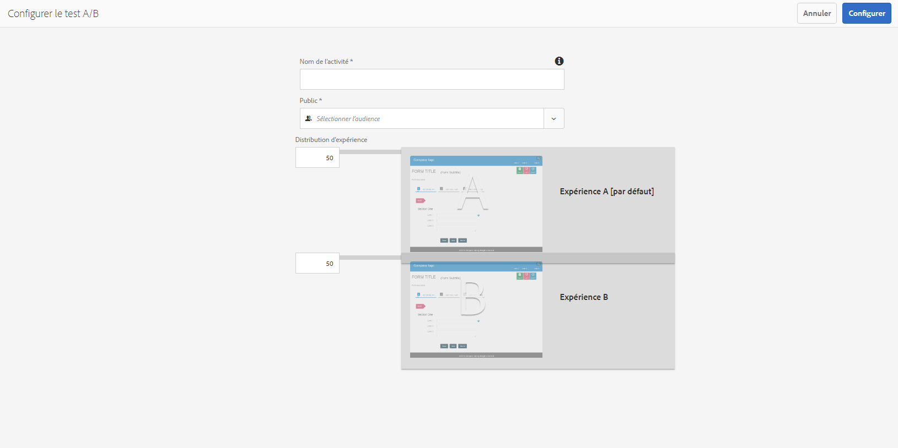
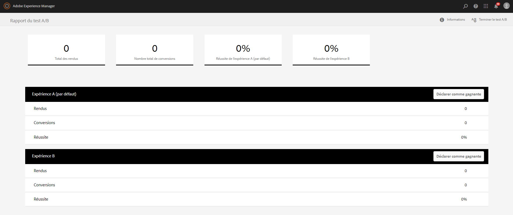

# Créer et gérer des tests A/B pour les formulaires adaptatifs{#create-and-manage-a-b-test-for-adaptive-forms}

## Présentation {#overview-br}

Vos clients sont susceptibles d’abandonner un formulaire si l’expérience qu’ils en font n’est pas satisfaisante. Si elle est frustrante pour les clients, elle peut aussi bouleverser le volume et les coûts d’assistance de votre entreprise. Il est aussi primordial que difficile d’identifier et d’offrir une bonne expérience client qui augmente le taux de conversion. Adobe Experience Manager Forms détient la clé sur ce problème.

AEM Forms s’intègre à Adobe Target, une solution Adobe Marketing Cloud qui permet de fournir des expériences client personnalisées et attrayantes par le biais de plusieurs canaux numériques. Une des fonctionnalités essentielles de Target est un test A/B qui vous permet de définir rapidement les tests simultanés A/B, de présenter le contenu correspondant aux utilisateurs cible, puis d’identifier l’expérience conduisant à un meilleur taux de conversion.

Avec AEM Forms, vous pouvez configurer et exécuter des tests A/B sur des formulaires adaptatifs en temps réel. Le module propose également des fonctionnalités personnalisables de rapport et prêtes à l’emploi afin de visualiser les performances de vos expériences de formulaire en temps réel et d’identifier celle qui optimise l’engagement et la conversion de l’utilisateur.

## Installation et intégration de Target dans AEM Forms {#set-up-and-integrate-target-in-aem-forms}

Avant de commencer à créer et analyser les tests A/B pour les formulaires adaptatifs, vous devez installer votre serveur Target et l’intégrer à AEM Forms.

### Configuration de Target  {#set-up-target}

Pour intégrer AEM avec Target, vérifiez que vous disposez d’un compte Adobe Target valide. Lorsque vous vous inscrivez à Adobe Target, vous recevez un code client. Vous avez besoin du code client, de l’adresse e-mail associée au compte Target et du mot de passe pour vous connecter à AEM avec Target.

Le code client identifie le compte client Adobe Target et est utilisé comme un sous-domaine dans l’URL lors de l’appel du serveur Adobe Target. Avant de commencer, assurez-vous que vos identifiants de connexion vous permettent de vous connecter sur [https://testandtarget.omniture.com/](https://testandtarget.omniture.com/).

### Intégration de Target dans AEM Forms  {#integrate-target-in-aem-forms}

Pour intégrer un serveur Target en cours d’exécution avec AEM Forms, procédez comme suit :

1. Sur AEM serveur, accédez à https://*nom_hôte*:&quot;a2/>port&lt;a3/&quot;/libs/cq/core/content/tools/cloudservices.html.**

1. Dans la section **Adobe Target**, cliquez sur **Afficher les configurations** puis sur l’icône **+** pour ajouter une nouvelle configuration.
Si vous configurez Target pour la première fois, cliquez sur **Configurer maintenant.**

1. Dans la boîte de dialogue Créer une configuration, spécifiez un **titre** et éventuellement un **nom** pour la configuration.

1. Cliquez sur **Créer**. La boîte de dialogue Modifier le composant s’ouvre.
1. Spécifiez les détails du compte Target, tels que le code client, l’adresse et le mot de passe.
1. Sélectionnez **Rest** dans la liste déroulante Type d’API.

1. Cliquez sur **Se connecter à Adobe Target** pour lancer la connexion à Target. Si la connexion est établie, le message Connexion réussie s’affiche. Cliquez sur **OK** dans le message et **OK** dans la boîte de dialogue. Le compte Target est configuré.

1. Créez une structure Target, comme décrit à la section [Ajout d’une structure](/help/sites-administering/target.md).

1. Accédez à https://&quot;a0/>hostname *:&quot;a2/>port&lt;a3/&quot;/system/console/configMgr.***

1. Cliquez sur **AEM Forms Target Configuration**.
1. Sélectionnez **Target Framework**.
1. Dans le champ **Target URLs**, spécifiez toutes les URL où les tests A/B seront exécutés. Par exemple, https://&quot;a0/>hostname *:&quot;a2/>port&lt;a3/&quot;/ pour le serveur AEM Forms sur OSGi ou https://&quot;a4/>hostname&lt;a5/&quot;:&quot;a6/>port&lt;a7/&quot;/lc/ pour le serveur AEM Forms sur JEE.*******
 Si vous souhaitez configurer une URL Target pour une instance de publication à laquelle vos clients peuvent accéder à l’aide du nom d’hôte ou de l’adresse IP, vous devez configurer les deux comme des URL Target (via le nom d’hôte ainsi que l’adresse IP). Si vous configurez uniquement une des URL, votre test A/B ne s’exécutera pas pour les clients provenant de l’autre URL. Cliquez sur le signe **+** pour spécifier plusieurs URL.

1. Cliquez sur **Enregistrer**.

Votre serveur Target est intégré à AEM Forms. Vous pouvez désormais activer le test A/B si vous disposez d’une licence complète vous permettant d’utiliser Adobe Target. 

Si vous disposez d’une licence complète vous permettant d’utiliser Adobe Target, démarrez le serveur selon les paramètres suivants après avoir intégré Target avec AEM Forms :

`parameter -Dabtesting.enabled=true java -Xmx2048m -XX:MaxPermSize=512M -jar -Dabtesting.enabled=true`

Si une instance AEM s’exécute sur JBoss, démarrée en tant que procédure clé en main, dans le fichier `jboss\bin\standalone.conf.bat`, ajoutez le paramètre -Dabtesting.enabled=true dans l’entrée suivante :

`set "JAVA_OPTS=%JAVA_OPTS% -Dadobeidp.serverName=server1 -Dfile.encoding=utf8 -Djava.net.preferIPv4Stack=true -Dabtesting.enabled=true"`

En plus du serveur jboss, vous pouvez ajouter l’argument jvm -Dabtesting.enabled=true dans le script de démarrage du serveur pour chaque serveur d’application. Vous pouvez à présent créer et exécuter des tests A/B pour les formulaires adaptatifs.

>[!NOTE]
>
>Si vous mettez à jour les URL Target configurées ultérieurement, veillez à mettre à jour tous les tests A/B actifs pour qu’ils pointent vers les URL mises à jour. Pour plus d’informations sur la mise à jour des tests A/B, voir[ Mettre à jour le test A/B](/help/forms/using/ab-testing-adaptive-forms.md#p-update-a-b-test-p).

## Créer des publics dans AEM  {#create-audiences-within-aem}

AEM vous permet de créer un public et de les utiliser pour un test A/B. Le public que vous créez dans AEM est disponible dans AEM Forms. Procédez comme suit pour créer un public dans AEM :

1. Dans l’instance d’auteur, appuyez sur **Adobe Experience Manager** >**Personnalisation** >**Publics**.

1. Dans la page Publics, appuyez sur **Créer un public > Créer le public cible**.
1. Dans la boîte de dialogue Configuration d’Adobe Target, sélectionnez une configuration Cible et cliquez sur **Ok**.
1. Sur la page Créer un public, créez des règles. Les règles vous permettent de classer le public par catégorie. Par exemple, vous pouvez trier les publics par catégorie en fonction du système d’exploitation. Le public A provient de Windows et le public B de linux.

   1. Pour classer les audiences en fonction de Windows, dans la règle 1, sélectionnez le type d’attribut **OS**. Dans la liste déroulante, sélectionnez **Windows.**

   1. Pour classer les audiences selon Linux, dans la règle n° 2, sélectionnez le type d’attribut **OS**. Dans la liste déroulante **Lorsque**, sélectionnez **Linux**, puis cliquez sur **Suivant**.

1. Spécifiez un nom pour le public créé, puis cliquez sur **Enregistrer**.

Vous pouvez sélectionner le public lorsque vous configurez le test A/B d’un formulaire, comme illustré ci-dessous.

## Création d’un test A/B  {#create-a-b-test}

Effectuez les étapes suivantes pour créer un test A/B pour un formulaire adaptatif.

1. Accédez à **Forms &amp; Documents** à l&#39;adresse https://&quot;a2/>hostname&lt;a3/&quot;:&quot;a4/>port&lt;a5/&quot;/aem/forms.html/content/dam/formsanddocuments.****

1. Accédez au dossier contenant le formulaire adaptatif.
1. Cliquez sur l’outil **Sélection** dans la barre d’outils et sélectionnez le formulaire adaptatif.
1. Cliquez sur le bouton **Plus** dans la barre d’outils et sélectionnez **Configurer les tests A/B**. La page de configuration des tests A/B s’ouvre.

1. Spécifiez un **nom d’activité** pour le test A/B.

1. Dans la liste déroulante Public, sélectionnez un public auquel vous souhaitez proposer différentes expériences du formulaire. Par exemple, les **visiteurs utilisant Chrome**. La liste de public est renseignée depuis le serveur Target configuré.

1. Dans les champs **Distribution d’expérience** pour les expériences A et B, spécifiez la répartition, sous forme de pourcentage, pour déterminer la répartition des expériences dans le public total. Par exemple, si vous spécifiez 40 et 60 pour les expériences A et B, respectivement, l’expérience A sera transmise à 40 % du public et les 60 % restant verront s’afficher l’expérience B.
1. Cliquez sur **Configurer**. Une boîte de dialogue s’affiche pour confirmer la création du test A/B.
1. Cliquez sur **Modifier l’expérience B** pour ouvrir le formulaire adaptatif en mode d’édition. Modifiez le formulaire pour créer une expérience différente de l’expérience A par défaut. Les variations possibles permises dans l’expérience B sont des modifications concernant :

   * CSS ou style
   * Ordre des champs dans différents panneaux ou le sur même panneau
   * Disposition du panneau
   * Titres des panneaux
   * Description, libellé et texte d’aide pour un champ
   * Scripts qui n’affectent pas ou n’interrompent pas le flux d’envoi
   * Validations (à la fois de la part des clients et du côté du serveur)
   * Thème de l’expérience B (vous pouvez choisir un autre thème pour l’expérience B)

1. Accédez à l’interface utilisateur Formulaires &amp; Documents, sélectionnez le formulaire adaptatif, puis cliquez sur **Plus** et sélectionnez **Démarrer le test A/B**.

Votre test A/B s’exécute désormais et le public visé aura accès aux expériences de façon aléatoire en fonction de la distribution spécifiée.

## Mise à jour du test A/B  {#update-a-b-test}

Vous pouvez mettre à jour le public et la répartition d’expérience d’un test A/B actif. Pour ce faire :

1. Dans l’interface utilisateur Formulaires &amp; Documents, accédez au dossier contenant le formulaire adaptatif sur lequel le test A/B fonctionne.
1. Sélectionnez le formulaire adaptatif.
1. Cliquez sur **Plus** et sélectionnez **Modifier le test A/B.** La page de mise à jour du test A/B s’ouvre.

1. Mettez à jour le public et la répartition d’expérience, si nécessaire.
1. Cliquez sur **Mettre à jour**.

## Afficher et analyser le rapport du test A/B {#view-and-analyze-a-b-test-report}

Une fois que vous avez activé l’exécution du test A/B pendant la période souhaitée, vous pouvez générer un rapport et contrôler quelle expérience a obtenu la meilleure conversion. Vous pouvez déclarer gagnante l’expérience la plus performante ou choisir d’exécuter un autre test A/B. Pour ce faire, procédez comme suit :

1. Sélectionnez le formulaire adaptatif, cliquez sur le bouton **Plus**, puis cliquez sur **Rapport du test A/B**. Le rapport s’affiche.

1. Analysez le rapport et voyez si vous disposez de suffisamment de points de données pour décider quelle expérience a le mieux fonctionné. Vous pouvez choisir de continuer le même test A/B pendant plus longtemps ou de désigner une expérience probante et terminer le test A/B.
1. Pour déclarer qu’une expérience est probante et terminer les tests A/B, cliquez sur le bouton **Terminer le test A/B** sur le tableau de bord de génération de rapports. Une boîte de dialogue vous invite à choisir celle des deux expériences qui obtient les meilleurs résultats. Sélectionnez l’expérience la plus probante et confirmez la fin du test A/B.
 Autrement, vous pouvez d’abord désigner une expérience gagnante en cliquant sur le bouton **Déclarer gagnante** de l’expérience correspondante. Vous êtes invité(e) à confirmer l’expérience gagnante. Cliquez sur **Oui** pour terminer le test A/B.

Si vous considérez que l’expérience A est la meilleure, le test A/B sera arrêté, et à partir de ce moment-là, seule l’expérience A sera transmise à tous les publics.
