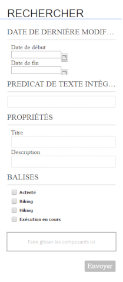
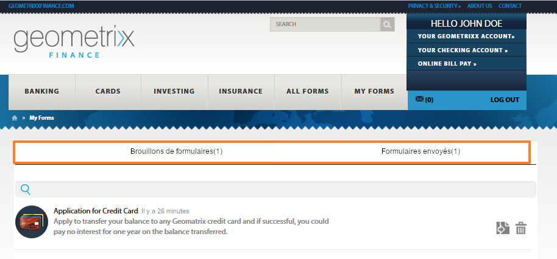
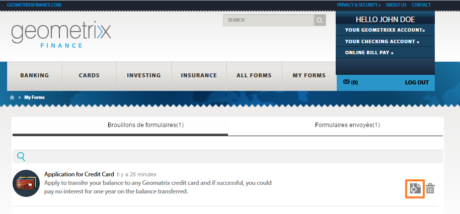

# Accès et remplissage des formulaires publiés{#accessing-and-filling-published-forms}

Dans une configuration de déploiement de portail basée sur l’utilisation de formulaires, le développement des formulaires et le développement du portail sont deux activités bien distinctes. Tandis que les créateurs de formulaires créent des formulaires et les stockent dans un référentiel, les développeurs Web créent une application Web qui répertorie les formulaires et gère les envois. Les formulaires sont alors copiés sur la plateforme Web, car il n’existe aucune communication entre le référentiel des formulaires et l’application Web.

Cela se traduit souvent par des problèmes au niveau de la gestion des délais de configuration et de production. Par exemple, si une nouvelle version d’un formulaire est disponible dans le référentiel, le concepteur de formulaires remplace le formulaire sur la plateforme Web, modifie l’application Web, puis déploie à nouveau le formulaire sur le site public. Le redéploiement de l’application Web peut entraîner un temps d’arrêt au niveau du serveur. Dans la mesure où les temps d’arrêt de serveur sont dus à une activité planifiée, les modifications ne peuvent pas être diffusées instantanément vers le site public.

Forms Portal réduit la charge de gestion et les retards de production. Il fournit aux développeurs Web des composants pour la création et la personnalisation d’un portail de formulaires sur les sites Web créés à l’aide d’Adobe Experience Manager (AEM).

Pour plus d’informations sur le portail des formulaires et ses fonctions, reportez-vous à la section [Présentation de la publication de formulaires sur un portail](/help/forms/using/introduction-publishing-forms.md).

## Prise en main de Forms Portal {#getting-started-with-forms-portal}

Accédez à la page du portail des formulaires publiés. Pour plus d’informations sur la création d’une page Forms Portal, voir [Création d’une page Forms Portal](../../forms/using/creating-form-portal-page.md).

Le composant Search and Lister de Forms Portal affiche les formulaires disponibles sur l’instance de publication du serveur AEM. Cette liste comprend tous les formulaires ou les formulaires définis dans le filtre au moment de la création de la page Forms Portal. Une page de Forms Portal est similaire à celle illustrée à la figure suivante :

Exemple de page de Forms Portal

### Search and Lister {#search-and-lister}

Le composant Search and Lister vous permet d’ajouter les fonctionnalités suivantes à votre portail de formulaires :

* Affichage des formulaires sous forme de panneau, de carte ou de grille disponibles en dehors de la zone. Les formulaires templatesList personnalisés issus de dossiers spécifiques dans Forms Manager sont également pris en charge.
* Spécification du mode de rendu des formulaires (HTML5, PDF ou les deux).
* Indication du mode de rendu des formulaires PDF et XGA : HTML5, PDF ou les deux. Formulaires non-XFA au format HTML5.
* Activation de la recherche de formulaires selon différents critères, tels que les propriétés, les métadonnées et les balises de formulaire.
* Envoi de données de formulaire vers une servlet.
* Utilisation de feuilles de style (CSS) personnalisées pour la personnalisation de l’aspect et du style du portail.
* Création de liens vers des formulaires.

Vous pouvez rechercher des formulaires dans la page Forms Portal à l’aide des options suivantes :

* Recherche de texte intégral
* Recherche avancée

La recherche de texte intégral permet de rechercher et de répertorier les formulaires avec des mots-clés spécifiques.

Boîte de dialogue de recherche avancée

La recherche avancée vous permet de rechercher des formulaires en fonction de propriétés de formulaire spécifiques. Elle fournit des résultats plus précis que la recherche de texte intégral. La recherche avancée comprend une recherche basée sur des balises, des propriétés (telles que l’auteur, la description et le titre), la date de modification et le texte intégral.

Le composant Lister affiche des formulaires en fonction de paramètres de recherche. Chaque formulaire dans le résultat de la recherche est signalé par une icône, qui est liée au formulaire associé. Pour ouvrir et utiliser le formulaire associé, cliquez sur l’icône.

### Remplissage d’un formulaire {#filling-a-form}

Exemple de formulaire adaptatif

L’accès aux formulaires peut s’effectuer par le biais du lien fourni avec celui-ci dans le composant Search and Lister de la page.

Chaque formulaire contient des informations d’aide qui permettent à l’utilisateur de le remplir.

#### Drafts &amp; Submission  {#drafts-and-submission}

L’utilisateur a la possibilité d’enregistrer un brouillon de formulaire en cliquant sur le bouton Enregistrer. Il peut ainsi travailler sur un formulaire pendant un certain temps avant de l’envoyer.

Les données renseignées dans le formulaire (y compris les pièces jointes) sont enregistrées sous la forme d’un brouillon sur le serveur. Le brouillon d’un formulaire peut être enregistré un nombre illimité de fois. Le formulaire enregistré apparaît dans l’onglet Brouillons du composant Drafts &amp; Submission de la page.

Une fois le formulaire complété, l’utilisateur l’envoie en cliquant sur le bouton Envoyer. Les formulaires envoyés sont affichés dans l’onglet Envois du composant Drafts &amp; Submission de la page.

>[!NOTE]
>
>Les formulaires envoyés apparaissent dans l’onglet Forms envoyé uniquement si l’action d’envoi du formulaire adaptatif est configurée comme Action d’envoi du portail Forms. Pour plus d’informations sur les actions d’envoi, reportez-vous à la section [Configuration de l’action Envoyer](../../forms/using/configuring-submit-actions.md).

Composant Drafts &amp; Submission

## Démarrage d’un nouveau formulaire avec des données de formulaire envoyé {#start-a-new-form-using-submitted-form-data}

Il existe des formulaires que vous devez remplir et envoyer très souvent. Par exemple, le formulaire de déclaration de revenus des particuliers est envoyé chaque année. Dans ce cas, alors que certaines informations changent à chaque fois que le formulaire est rempli, la plupart des détails personnels et relatifs à la famille ne change pas. Toutefois, vous êtes tenu de remplir un nouveau formulaire en entier, en partant de zéro.

AEM Forms peut vous aider à optimiser l’opération de remplissage du formulaire et à réduire considérablement le temps de remplissage et d’envoi d’un formulaire déjà envoyé au préalable. Les utilisateurs finaux peuvent démarrer un nouveau formulaire avec des données d’un formulaire qui a déjà été envoyé. Cette fonctionnalité est intégrée dans le composant [Drafts and Submissions](../../forms/using/draft-submission-component.md). Lorsque vous ajoutez un composant Drafts and Submission à votre page Forms Portal et que vous le publiez, les utilisateurs finaux ont une option dans les onglets Formulaires envoyés et Brouillons de formulaires pour démarrer un nouveau formulaire en utilisant des données d’un formulaire déjà envoyé. L’image suivante illustre cette option.

Lorsque vous cliquez sur le bouton pour commencer un nouveau formulaire, il ouvre un formulaire avec les données du formulaire envoyé correspondant. Vous pouvez maintenant revoir et mettre à jour les informations, selon les besoins, puis envoyer le formulaire.
