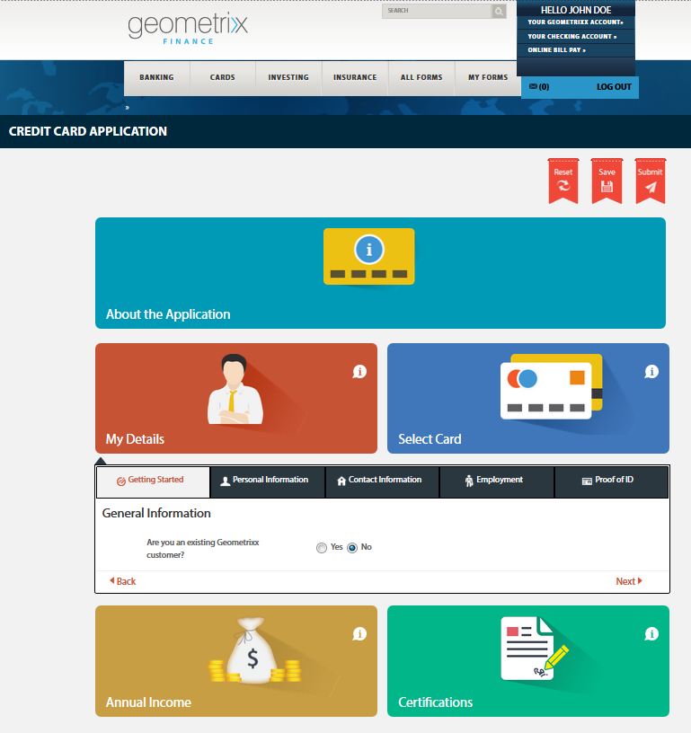

# Accès et remplissage des formulaires publiés{#accessing-and-filling-published-forms}

Dans une configuration de déploiement de portail basée sur l’utilisation de formulaires, le développement des formulaires et le développement du portail sont deux activités bien distinctes. Alors que les concepteurs et conceptrices de formulaires créent et stockent des formulaires dans un référentiel, les développeurs et développeuses web créent une application web qui répertorie les formulaires et gère les envois. Forms est ensuite copié sur le niveau web, car il n’existe aucune communication entre le référentiel de formulaires et l’application web.

Cela entraîne souvent des problèmes lors de la gestion des délais de configuration et de production. Par exemple, si une version plus récente d’un formulaire est disponible dans le référentiel, le concepteur ou la conceptrice de formulaires remplace le formulaire sur la plateforme web, modifie l’application web et redéploie le formulaire sur le site public. Le redéploiement de l’application web peut entraîner un temps d’arrêt du serveur. Les temps d’arrêt du serveur étant une activité planifiée, les modifications ne peuvent pas être déployées immédiatement sur le site public.

Le portail Formulaires réduit les surcharges de gestion et les délais de production. Les composants permettent aux développeurs et développeuses web de créer et de personnaliser un portail Formulaires sur les sites web créés à l’aide d’Adobe Experience Manager (AEM).

Pour plus d’informations sur le portail Formulaires et ses fonctionnalités, reportez-vous à la section [Présentation de la publication de formulaires sur un portail](/help/forms/using/introduction-publishing-forms.md).

## Prise en main du portail Formulaires {#getting-started-with-forms-portal}

Accédez à la page du portail Formulaires publiée. Pour plus d’informations sur la création d’une page de portail Formulaires, reportez-vous à la section [Création d’une page de portail Formulaires](../../forms/using/creating-form-portal-page.md).

Le composant Search and Lister du portail Formulaires affiche les formulaires disponibles sur l’instance de publication du serveur AEM. Cette liste comprend tous les formulaires ou les formulaires définis dans le filtre au moment de la création de la page du portail Formulaires. Une page du portail Formumaires se présente comme illustré dans l’image suivante :

Exemple de page du portail Formulaires

### Search and Lister {#search-and-lister}

Le composant Search and Lister vous permet d’ajouter les fonctionnalités suivantes à votre portail Formulaires :

* Répertoriez les formulaires prêts à l’emploi en mode Panneau, Carte ou Grille. Les formulaires templatesList personnalisés issus de dossiers spécifiques dans Forms Manager sont également pris en charge.
* Spécification du mode de rendu des formulaires (HTML5, PDF ou les deux).
* Indication du mode de rendu des formulaires PDF et XGA : HTML5, PDF ou les deux. Formulaires non-XFA au format HTML5.
* Activation de la recherche de formulaires selon différents critères, tels que les propriétés, les métadonnées et les balises de formulaire.
* Envoi de données de formulaire vers un servlet.
* Utilisation de feuilles de style (CSS) personnalisées pour la personnalisation de l’aspect et du style du portail.
* Création de liens vers des formulaires.

Vous pouvez rechercher des formulaires sur la page du portail Formulaires à l’aide des options suivantes :

* Recherche en texte intégral
* Recherche avancée

La recherche en texte intégral permet de rechercher et de répertorier des formulaires en fonction de mots-clés.

Boîte de dialogue de recherche avancée.

La recherche avancée vous permet de rechercher des formulaires en fonction des propriétés de formulaire. Elle fournit des résultats plus précis que la recherche en texte intégral. La recherche avancée comprend les recherches portant sur des balises, des propriétés (telles que le créateur ou la créatrice, la description et le titre), la date de modification et le texte intégral.

Le composant Lister affiche les formulaires en fonction des paramètres de recherche. Chaque formulaire dans le résultat de la recherche est signalé par une icône, qui est liée au formulaire associé. Cliquez sur l’icône pour ouvrir et utiliser le formulaire associé.

### Remplissage d’un formulaire {#filling-a-form}

Exemple de formulaire adaptatif.

L’accès aux formulaires peut s’effectuer par le biais du lien fourni avec celui-ci dans le composant Search and Lister de la page.

Chaque formulaire contient des informations d’aide qui permettent à l’utilisateur ou à l’utilisatrice de le remplir.

#### Brouillons et envois {#drafts-and-submission}

Un utilisateur ou une utilisatrice peut éventuellement enregistrer un brouillon de formulaire en cliquant sur **Enregistrer**. Cela permet ainsi de travailler sur un formulaire pendant un certain temps avant de l’envoyer.

Les données renseignées dans le formulaire (y compris les pièces jointes) sont enregistrées sous la forme d’un brouillon sur le serveur. Le brouillon d’un formulaire peut être enregistré un nombre illimité de fois. Le formulaire enregistré apparaît dans l’onglet Brouillons du composant Drafts &amp; Submission de la page.

Une fois le formulaire complété, l’utilisateur ou l’utilisatrice l’envoie en cliquant sur le bouton Envoyer. Les formulaires envoyés sont affichés dans l’onglet Envois du composant Drafts &amp; Submission de la page.

>[!NOTE]
>
>Les formulaires envoyés n’apparaissent dans l’onglet Formulaires envoyés que si l’action Envoyer du formulaire adaptatif est configurée comme Action d’envoi du Portail Formulaires. Pour plus d’informations sur les actions d’envoi, reportez-vous à la section [Configuration de l’action Envoyer](../../forms/using/configuring-submit-actions.md).

Composant Brouillons et envois.

## Démarrage d’un nouveau formulaire avec des données de formulaire envoyé {#start-a-new-form-using-submitted-form-data}

Il existe des formulaires que vous devez remplir et envoyer souvent. Par exemple, le formulaire de déclaration de revenus des particuliers est envoyé chaque année. Dans ce cas, alors que certaines informations changent à chaque fois que le formulaire est rempli, la plupart des détails personnels et relatifs à la famille ne change pas. Toutefois, vous êtes tenu de remplir un nouveau formulaire en entier, en partant de zéro.

AEM Forms peut vous aider à optimiser l’opération de remplissage du formulaire et à réduire considérablement le temps de remplissage et d’envoi d’un formulaire déjà envoyé au préalable. Les utilisatrices et utilisateurs finaux peuvent démarrer un nouveau formulaire avec des données d’un formulaire qui a déjà été envoyé. Cette fonctionnalité est intégrée dans le [composant Drafts and Submissions](../../forms/using/draft-submission-component.md). Lorsque vous ajoutez le composant Drafts and Submission à votre page de portail Formulaires et que vous le publiez, les utilisatrices et utilisateurs finaux voient une option dans les onglets Formulaires envoyés et Brouillons de formulaires. Cette option permet de lancer un nouveau formulaire à partir des données d’un formulaire envoyé. L’image suivante illustre cette option.

Lorsque vous cliquez sur le bouton pour commencer un nouveau formulaire, il ouvre un formulaire avec les données du formulaire envoyé correspondant. Vous pouvez maintenant revoir et mettre à jour les informations, selon les besoins, puis envoyer le formulaire.
