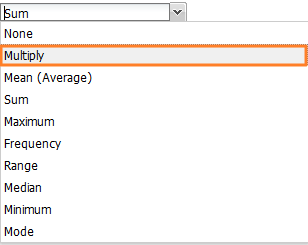

# Graphiques de formulaires adaptatifs {#af-charts}


Un diagramme ou un graphique est une représentation visuelle des données. Il vous permet de condenser de grandes quantités d’informations dans un format visuel facile à comprendre, ce qui vous permet de mieux visualiser, interpréter et analyser des données complexes.
Le module complémentaire AEM Forms fournit un composant de graphique d’usine. Vous pouvez utiliser dans vos formulaires et documents adaptatifs pour une représentation visuelle des données bidimensionnelles dans **panneaux répétables** et **tables**. Le composant Graphique vous permet d’ajouter et de configurer les types de graphiques suivants :

1. Diagramme circulaire
1. Colonnes
1. Anneau
1. Barre
1. Ligne
1. Ligne et point
1. Point
1. Domaine

Le composant Graphique prend en charge et fournit des fonctions statistiques intégrées (somme, moyenne, maximum, minimum, mode, médiane, plage et fréquence) pour calculer et tracer des valeurs sur un graphique. Outre les fonctions disponibles d’usine, vous pouvez créer vos propres fonctions personnalisées et les rendre disponibles pour utilisation dans les graphiques.

Examinons maintenant comment ajouter et configurer le composant Graphique :

## Ajouter un graphique {#add-chart}

Par défaut, le composant Graphique est disponible dans AEM barre latérale. Vous pouvez faire glisser et déposer le composant Graphique de la barre latérale AEM vers le formulaire ou le document adaptatif en mode création. Lorsque vous déposez le composant, il crée un espace réservé pour un graphique.

## Configurer le graphique {#configure-chart}

>[!NOTE]
> 
> Avant de configurer le graphique, assurez-vous que la ligne du panneau ou du tableau pour lequel vous configurez le graphique est définie sur répétable. Vous pouvez spécifier les valeurs minimale et maximale pour la ligne de panneau ou de tableau répétable dans l’onglet Paramètres de répétition de la boîte de dialogue Modifier le composant.

Pour configurer le graphique, cliquez sur le composant Graphique, puis sur  pour ouvrir la boîte de dialogue Modifier le graphique . La boîte de dialogue comprend les onglets Titre et texte, Configuration, Options avancées et Style qui vous permettent de configurer le graphique.

### Éléments de base {#basic}

Dans l’onglet De base , vous pouvez configurer les propriétés suivantes :


* **Nom de l’élément**: identifiant de l’élément de graphique dans la structure de contenu JCR. Elle n’est pas visible sur le graphique, mais elle s’avère utile lorsque vous faites référence à l’élément à partir d’autres composants, scripts et expressions SOM.
* **Type de graphique**: indique le type de graphique à générer. Les options disponibles sont Circulaire, Anneau, Barre, Colonne, Ligne, Ligne et Point, Point et Aire. Dans cet exemple, le type de graphique est Colonne.
* **Répétition du nom de la ligne ou du nom du panneau pour la source de données**: spécifie le nom de l’élément de la ligne du tableau ou du panneau répétable à partir duquel les données seront issues. Dans cet exemple, statementDetails est le nom de l’élément de la ligne répétable dans le tableau Statement Details.
* **Axe X > Titre**: spécifie le titre de l’axe X. Dans l’exemple, le titre de l’axe X est Catégorie.
* **Axe X > Champ**: spécifie le nom de l’élément du champ (ou d’une cellule d’un tableau) à tracer sur l’axe X. Dans cet exemple, les catégories sont paramétrées sur l&#39;axe X. Le nom d’élément de la cellule de tableau dans la colonne Catégorie de l’exemple de tableau est category.
* **Axe X > Utiliser la fonction**: spécifie la fonction statistique à utiliser pour calculer les valeurs sur l’axe X. Dans l’exemple, l’option sélectionnée est Aucun. Pour plus d’informations sur les fonctions, voir Utilisation des fonctions dans le graphique.
* **Axe Y > Titre**: spécifie le titre de l’axe Y. Dans l’exemple, le titre de l’axe Y est Frais.
* **Axe Y > Champ**: indique le nom de l’élément du champ (ou de la cellule d’un tableau) à tracer sur l’axe Y. Dans l’exemple, configurez la quantité sur l’axe Y. Le nom de l’élément de la cellule du tableau dans la colonne Montant de l’exemple de tableau est amount.
* **Axe Y > Utiliser la fonction**: spécifie la fonction statistique à utiliser pour calculer les valeurs sur l’axe Y. Dans l’exemple, le montant dépensé dans chaque catégorie est ajouté et la valeur calculée est tracée sur l’axe Y. Par conséquent, sélectionnez Somme dans la liste déroulante Utiliser la fonction . Pour plus d’informations sur les fonctions, voir Utilisation des fonctions dans le graphique.
* **Position de la légende**: indique la position de la légende par rapport au graphique. Les options disponibles sont Droite, Gauche, Haut et Bas.
* **Afficher la légende**: affiche une légende pour le graphique lorsqu’il est activé.
* **Info-bulle**: spécifie le format dans lequel l’info-bulle s’affiche lorsque vous pointez sur un point de données du graphique. La valeur par défaut est **\${x}(\${y})**. En fonction du type de graphique, les variables sont utilisées pour indiquer le pointeur de la souris sur un point, une barre ou une tranche du graphique. **\${x}** et **\${y}** sont remplacés dynamiquement par les valeurs correspondantes sur l’axe X et l’axe Y, puis affichés dans l’info-bulle. Comme illustré dans l’exemple ci-dessous, l’info-bulle s’affiche sous la forme **Magasins de détail (5870)** lorsque vous pointez sur la colonne Retails Stores (Magasins de vente). Pour désactiver l’info-bulle, laissez le champ Info-bulle vide. Cette option ne s’applique pas aux graphiques en courbes et de surface.
* **Configurations spécifiques au graphique**: en plus des configurations courantes, la configuration spécifique au graphique suivante est disponible :
* **Rayon interne**: disponible pour les graphiques en anneau pour spécifier le rayon (en pixels) du cercle intérieur du graphique.
* **Couleur de ligne**: disponible pour les graphiques en courbes, en lignes et en points, ainsi que les diagrammes de surface, afin de spécifier la valeur hexadécimale de la couleur de la ligne dans le graphique.
* **Couleur du point**: disponible pour les graphiques en points et lignes et points pour spécifier la valeur hexadécimale de la couleur pour les points du graphique.
* **Couleur de la zone**: disponible pour les graphiques à aires pour spécifier la valeur hexadécimale de la couleur pour la zone située sous la ligne du graphique.
* **Classe CSS**: spécifiez le nom d’une classe CSS dans le champ de classe CSS pour appliquer un style personnalisé au graphique.

### Configuration {#configuration}

Dans l’onglet De base, vous définissez le type de graphique, le panneau source ou la ligne de tableau contenant les données, les valeurs à tracer sur l’axe X et l’axe Y du graphique, et éventuellement la fonction statistique pour calculer les valeurs à mapper sur le graphique.

Examinons en détail les informations de cet onglet, à l’aide d’un exemple de tableau répétable dans un relevé de carte de crédit. Supposons que vous souhaitiez générer un graphique afin de représenter et de corréler les dépenses totales dans différentes catégories dans la section des détails du relevé d’un relevé de carte de crédit, comme illustré ci-dessous.

Pour ce faire, vous devez tracer les catégories sur l’axe X et, sur l’axe Y, tracer le total des dépenses dans chaque catégorie.


Le relevé de carte de crédit utilisé dans cet exemple est un document de formulaire adaptatif et la section des détails du relevé est un tableau, qui se présente comme suit en mode création.


Examinons les conditions et exigences suivantes pour générer le graphique :

* Le graphique affiche les dépenses totales dans chaque catégorie dans le tableau Détails du relevé .
* Le type de graphique est Colonne, mais vous pouvez choisir n’importe quel autre type de graphique, le cas échéant.
* La ligne Tableau du tableau Détails du relevé peut être répétée. Vous pouvez le configurer dans le champ Paramètres de répétition des propriétés de ligne du tableau.
* Le nom d’élément de la ligne est Statement Details. Vous pouvez le configurer dans les propriétés Ligne du tableau .
* Le nom d’élément de la cellule de tableau dans la colonne Catégorie est Catégorie. Vous pouvez le spécifier en ligne. Sélectionnez la cellule et appuyez sur le bouton Modifier.
* Le nom de l’élément de la cellule du tableau dans la colonne Montant est Montant. En outre, la cellule de tableau de la colonne Montant est une zone numérique.
* Avec la configuration spécifiée, le graphique à colonnes de l&#39;exemple apparaîtra comme suit. Chaque couleur représente une catégorie et des éléments de ligne individuels ou des quantités pour une catégorie sont ajoutés dans le graphique.

  

La légende et l’info-bulle apparaissent comme suit.


### Style {#styling}

En mode Style, vous pouvez configurer la largeur, en pourcentage de la largeur totale disponible dans le formulaire ou le document, et la hauteur, en pixels, du graphique. Les autres options incluent le texte, l’arrière-plan, la bordure, les effets et les remplacements CSS.

Pour passer en mode Style, dans la barre d’outils de la page, **appuyez > Style**.


## Utiliser des fonctions dans le graphique {#use-functions}

Vous pouvez configurer un graphique pour qu’il utilise des fonctions statistiques afin de calculer des valeurs à partir des données source destinées au tracé sur le graphique. Bien que le composant Graphique dispose de certaines fonctions intégrées, vous pouvez créer vos propres fonctions et les rendre disponibles pour une utilisation dans la configuration du graphique.

>[!NOTE]
>
> Vous pouvez utiliser des fonctions pour calculer les valeurs de l’axe X ou de l’axe Y dans un graphique.

### Fonctions par défaut {#default-functions}

Les fonctions suivantes sont disponibles par défaut avec le composant de graphique :

* **Moyenne (moyenne)**: renvoie la moyenne des valeurs sur l’axe X ou Y pour une valeur donnée sur l’autre axe.
* **Somme**: renvoie la somme de toutes les valeurs sur l’axe X ou Y pour une valeur donnée sur l’autre axe.
* **Maximum**: renvoie le nombre maximal de valeurs sur l’axe X ou Y pour une même valeur sur l’autre axe.
* **Fréquence**: renvoie le nombre de valeurs sur l’axe X ou Y pour une même valeur sur l’autre axe.
* **Plage**: renvoie la différence entre le maximum et le minimum des valeurs sur l’axe X ou Y pour une même valeur sur l’autre axe.
* **Médiane**: renvoie la valeur qui sépare les valeurs supérieures et inférieures en deux sur l’axe X ou Y pour une valeur donnée sur l’autre axe.
* **Minimum**: renvoie le minimum des valeurs sur l’axe X ou Y pour une même valeur sur l’autre axe.
* **Mode**: renvoie la valeur comportant le plus d’occurrences sur l’axe X ou Y pour une valeur donnée sur l’autre axe.

### Fonctions personnalisées {#custom-functions}

En plus d’utiliser les fonctions par défaut dans les graphiques, vous pouvez écrire. [fonctions personnalisées](/help/forms/using/rule-editor.md#custom-functions-in-rule-editor-custom-functions) en JavaScript et rendez-les disponibles dans la liste des fonctions du composant de graphique.

Une fonction prend un tableau ou des valeurs et un nom de catégorie comme entrées et renvoie une valeur. Par exemple :

```
Multiply(valueArray, category) {
    var val = 1;
    _.each(valueArray, function(value) {
        val = val * value;
    });
    return val;
}
```

Une fois que vous avez rédigé une fonction personnalisée, procédez comme suit pour la rendre disponible pour une utilisation dans la configuration du graphique :

1. Ajoutez la fonction personnalisée dans la bibliothèque cliente associée au formulaire ou au document adaptatif.
1. Dans CRXDE Lite, créez un noeud nt:unstructured dans le dossier apps avec les propriétés suivantes :
   * Définissez guideComponentType sur fd/af/reducer. (mandatory)
   * Définissez la valeur sur un nom qualifié complet de la fonction JavaScript personnalisée. (mandatory)
   * Définissez jcr:description sur un nom significatif. Il apparaît dans la variable **Fonction Use** liste déroulante. Par exemple, **Multiplier**. 
   * Définissez qtip avec une brève description de la fonction. Il s’affiche sous forme d’info-bulle lorsque vous placez le pointeur sur le nom de la fonction dans la liste déroulante Utiliser la fonction .
   * Cliquez sur **Enregistrer tout** pour enregistrer la configuration.
   * Cette fonctionnalité est désormais disponible dans le graphique.




## Actualisation automatique du graphique {#auto-refresh-chart}

Un graphique s’actualise automatiquement lorsque les utilisateurs effectuent l’une des opérations suivantes :
* Ajoutez ou supprimez une instance du panneau de source de données ou de la ligne du tableau.
* Modifiez toute valeur tracée sur l’axe X ou Y dans le panneau de source de données ou la ligne du tableau.
* Modifiez le type de graphique.

## Utilisation du type de graphique dans les règles de formulaire adaptatif {#chart-in-rules}

La propriété chartType spécifie le type de graphique. Les valeurs possibles sont Circulaire, Anneau, Barre, Ligne, Ligne, Point de ligne, Point et Zone. Il s’agit d’une propriété scriptable, ce qui signifie que vous pouvez l’utiliser dans [règles de formulaire adaptatif](/help/forms/using/rule-editor.md) pour manipuler les configurations de graphique. Comprenons-le avec l&#39;aide d&#39;un exemple.

Supposons que vous ayez configuré un graphique à colonnes. Cependant, vous souhaitez également offrir aux utilisateurs la possibilité de sélectionner un autre type de graphique dans une liste déroulante et de redessiner le graphique. Pour ce faire, utilisez la propriété chartType dans une règle comme suit :

1. Faites glisser et déposez un composant Liste déroulante de la barre latérale AEM sur le formulaire adaptatif.
1. Sélectionnez le composant et appuyez sur .
1. Indiquez un titre pour la liste déroulante. Par exemple, Sélectionner le type de graphique.
1. Ajoutez les types de graphiques pris en charge dans la section Éléments pour remplir la liste déroulante. Cliquez sur **Terminé**.
   

1. Sélectionnez le composant de liste déroulante et appuyez sur . Dans l’éditeur de règles, écrivez une règle dans l’éditeur de règles visuel comme illustré ci-dessous.
   

   Dans cet exemple, le nom de l’élément du composant de graphique est : **myChart**.

   Vous pouvez également écrire les règles suivantes dans l’éditeur de code.

   

   Pour plus d’informations sur l’écriture de règles, voir [Éditeur de règles](/help/forms/using/rule-editor.md)

1. Cliquez sur Terminé pour enregistrer la règle.

Vous pouvez maintenant sélectionner un type de graphique dans la liste déroulante et cliquer sur Actualiser pour redessiner le graphique.


