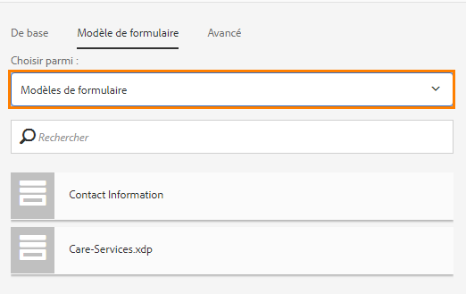
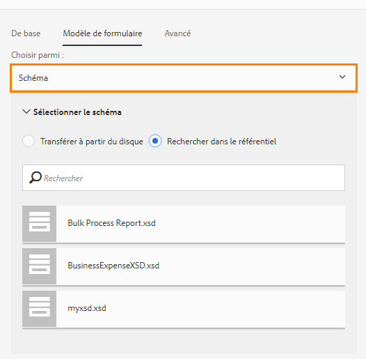
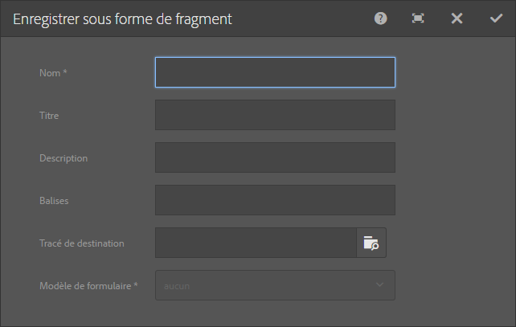

# Fragments de formulaire adaptatif{#adaptive-form-fragments}

Bien que chaque formulaire soit conçu pour un rôle spécifique, certains segments sont communs à la plupart des formulaires, comme les informations personnels tels que le nom et l’adresse, les informations relatives à la famille et aux revenus, etc. Les développeurs de formulaire sont nécessaires pour créer ces segments communs à chaque fois qu’un formulaire est créé.

Les formulaires adaptatifs fournissent un mécanisme pratique pour créer un segment de formulaire, comme un panneau ou un groupe de champs, une seule fois et pour les réutiliser dans des formulaires adaptatifs. Ces segments réutilisables et autonomes s’appellent des fragments de formulaire adaptatif.

## Création d’un fragment {#create-a-fragment}

Vous pouvez créer un fragment de formulaire adaptatif à partir de zéro ou enregistrer un panneau dans un formulaire adaptatif existant en tant que fragment.

### Créer un fragment à partir de zéro {#create-fragment-from-scratch}

1. Log into AEM Forms author instance at https://[*hostname*]:[*port*]/aem/forms.html.
1. Cliquez sur **Créer > Fragment de formulaire adaptatif**.
1. Indiquez le titre, le nom, la description, et les balises du fragment.

   >[!NOTE]
   >
   >Assurez-vous de spécifier un nom unique pour le fragment. S’il existe déjà un fragment portant le même nom, la création du fragment échoue.

1. Cliquez pour ouvrir l’onglet **Modèle de formulaire**, puis dans le menu déroulant **Sélectionner dans**, sélectionnez l’un des modèles de fragment suivants :

   * **Aucun** : indique de créer un fragment à partir de zéro, sans utiliser aucun modèle de formulaire.
   * **Modèle de formulaire** : indique de créer le fragment à l’aide d’un modèle XDP téléchargé dans AEM Forms. Sélectionnez le modèle XDP correspondant en tant que modèle de formulaire pour le fragment.
   

   Les sous-formulaires marqués comme fragments dans le modèle de formulaire sélectionné sont également affichés. Vous pouvez sélectionner un sous-formulaire comme fragment de formulaire adaptatif dans la liste déroulante.

   

   En outre, vous pouvez créer un fragment de formulaire adaptatif en utilisant les sous-formulaires qui ne sont pas marqués comme des fragments dans le modèle de formulaire en spécifiant l’expression SOM du sous-formulaire dans la liste déroulante.

   * **Schéma XML** : indique de créer un fragment à partir d’un schéma XML téléchargé dans AEM Forms. Vous pouvez télécharger ou sélectionner l’un des schémas XML comme modèle de formulaire pour le fragment.
   

   Vous pouvez également créer un fragment de formulaire adaptatif en choisissant un type complexe présent dans le schéma sélectionné dans la liste déroulante.

   

1. Cliquez sur **Créer** puis sur **Ouvrir** pour ouvrir le fragment, avec un modèle par défaut, en mode d’édition.

En mode d’édition, vous pouvez faire glisser tout composant de formulaire adaptatif depuis le panneau latéral AEM sur le fragment. Pour plus d’informations sur les composants de formulaire adaptatif, consultez la section [Introduction à la création de formulaires adaptatifs](../../forms/using/introduction-forms-authoring.md).

En outre, si vous avez sélectionné un modèle de schéma XML ou de formulaire XDP comme modèle de formulaire pour votre fragment, un nouvel onglet affichant la hiérarchie des modèles de formulaire apparaît dans l’outil de recherche de contenu. Il vous permet de faire glisser des éléments du modèle de formulaire sur le fragment. Les éléments de modèle de formulaire ajoutés sont convertis en composants de formulaire tout en conservant les propriétés d’origine du modèle XDP ou XSD associé.

### Enregistrer le panneau sous forme de fragment {#save-panel-as-a-fragment}

1. Ouvrez un formulaire adaptatif qui contient le panneau que vous voulez enregistrer en tant que fragment de formulaire adaptatif.
1. Dans la barre d’outils du panneau, cliquez sur **[!UICONTROL Enregistrer sous forme de fragment]**. La boîte de dialogue Enregistrer sous forme de fragment s’ouvre.

   >[!NOTE]
   >
   >Si le panneau que vous enregistrez sous forme de fragment contient le panneau enfant, le fragment obtenu les comprend.

1. Dans la boîte de dialogue de création de fragment, spécifiez les informations suivantes :

   * **Nom** : nom du fragment. La valeur par défaut est le nom de l’élément du panneau. Ce champ est obligatoire.
      ***Remarque **: assurez-vous de spécifier un nom unique pour le fragment. S’il existe déjà un fragment portant le même nom, la création du fragment échoue.*

   * **Titre** : titre du fragment. La valeur par défaut est le titre du panneau. 

   * **Description** : description du fragment.

   * **Balises** : métadonnées de balises de fragment. 

   * **Tracé de destination** : chemin d’accès au référentiel où le fragment est enregistré. Si vous ne spécifiez pas de chemin, un nœud portant le même nom que celui du fragment est créé en regard du nœud contenant le formulaire adaptatif. Le fragment est enregistré dans ce nœud. 

   * **Modèle de formulaire** : selon le modèle de formulaire pour le formulaire adaptatif, ce champ affiche le **schéma XML**,**modèle de formulaire** ou **aucun**. Ce champ n’est pas modifiable.

   * **Racine du modèle de fragment** : s’affiche uniquement dans les formulaires adaptatifs XSD. Il indique la racine pour le modèle du fragment. Vous pouvez choisir **/** ou le type complexe de schéma XSD dans la liste déroulante. Notez que vous pouvez réutiliser le fragment dans un autre formulaire adaptatif que si vous avez sélectionné le type complexe sous forme de fragment racine du modèle.
Si vous choisissez **/** comme racine du modèle de fragment, l’arborescence complète de schéma XSD depuis la racine est visible dans l’onglet de modèle de données de formulaire adaptatif. Pour une racine de modèle de fragment de type complexe, seuls les descendants du type complexe sélectionné sont visibles dans l’onglet du modèle de données de formulaire adaptatif. 

   * **Référence de schéma XSD** : s’affiche uniquement dans les formulaires adaptatifs XSD. Il indique l’emplacement du schéma XML. 

   * **Référence de XDP** : s’affiche uniquement dans les formulaires adaptatifs basés sur XDP. Il indique l’emplacement du modèle de formulaire XDP.
   

   Boîte de dialogue Enregistrer sous forme de fragment 

1. Cliquez sur **OK**.

   Le panneau est enregistré dans l’emplacement spécifié ou dans l’emplacement par défaut dans le référentiel. Dans le formulaire adaptatif, le panneau est remplacé par un instantané du fragment. Comme illustré ci-dessous, le panneau Informations générales et ses panneaux enfants, Informations personnelles et Adresse, sont enregistrés en tant que fragment.

   Pour modifier le fragment, cliquez sur **[!UICONTROL Modifier l’actif]** dans la barre d’outils du panneau. Le fragment s’ouvre dans un nouvel onglet ou une nouvelle fenêtre en mode d’édition.

   

## Utilisation des fragments {#working-with-fragments}

### Configurer l’aspect du fragment {#configure-fragment-appearance}

Tout fragment que vous insérez dans les formulaires adaptatifs s’affiche en image d’espace réservé. L’espace réservé affiche les titres jusqu’à un maximum de dix panneaux enfants dans le fragment. Vous pouvez configurer AEM Forms de sorte à afficher le fragment complet à la place de l’image d’espace réservé.

Effectuez les étapes suivantes pour afficher les fragments complets dans les formulaires :

1. Go to AEM web console configuration page at https:[*host*]:[*port*]/system/console/configMgr.

1. Recherchez et cliquez sur **[!UICONTROL Service de configuration de formulaire adaptatif]** pour l’ouvrir en mode d’édition.
1. Décochez la case d’**[!UICONTROL activation de l’espace réservé à la place du fragment]** pour afficher les fragments complets à la place de l’image d’espace réservé.

### Insertion d’un fragment dans un formulaire adaptatif {#insert-a-fragment-in-an-adaptive-form}

Les fragments de formulaire adaptatif créés apparaissent dans l’onglet Fragments de formulaire adaptatif de l’outil de recherche de contenu AEM. Pour insérer un fragment dans un formulaire adaptatif :

1. Ouvrez le formulaire adaptatif, en mode d’édition, dans lequel vous souhaitez insérer un fragment de formulaire adaptatif.
1. Click **Assets**  in the sidebar. In the assets browser, select **Adaptive Form Fragments** from the drop-down.

   Vous pouvez également choisir d’afficher tous les fragments de formulaire adaptatif ou de les filtrer en fonction du modèle de formulaire - modèle de formulaire, schéma XML, ou modèle de base.

1. Faites glisser un fragment de formulaire adaptatif sur le formulaire adaptatif.

   >[!NOTE]
   >
   >Le fragment de formulaire adaptatif ne peut pas être créé au sein même du formulaire adaptatif. De plus, vous ne pouvez pas utiliser un fragment basé sur XSD dans un formulaire adaptatif basé sur JSON et inversement.

Le fragment de formulaire adaptatif est inséré par référence dans le formulaire adaptatif et synchronisé avec le fragment autonome du formulaire adaptatif. Cela signifie que, lorsque vous mettez à jour le fragment de formulaire adaptatif, les modifications sont répercutées dans tous les formulaires adaptatifs où le fragment est utilisé.

### Inclusion d’un fragment dans un formulaire adaptatif {#embed-a-fragment-in-adaptive-form}

Vous pouvez choisir d’inclure un fragment de formulaire adaptatif en cliquant sur le bouton **Inclure le fragment : &lt;*fragmentName*>** dans la barre d’outils du panneau du fragment ajouté, comme illustré dans l’exemple ci-dessous.

>[!NOTE]
>
>Le fragment inclus n’est plus lié au fragment autonome. Vous pouvez modifier les composants dans le fragment inclus à partir du formulaire adaptatif.

### Utilisation de fragments dans les fragments {#using-fragments-within-fragments}

Vous pouvez créer des fragments de formulaire adaptatif imbriqués, ce qui signifie que vous pouvez faire glisser un fragment dans un autre fragment, et avoir une structure de fragment imbriqué.

### Modification des fragments {#change-fragments}

Vous pouvez remplacer ou modifier un fragment de formulaire adaptatif par un autre fragment à l’aide de la propriété **Sélectionner une ressource un fragment** dans la boîte de dialogue Modifier le composant, pour un panneau de fragment de formulaire adaptatif.

## Correspondance automatique des fragments pour la liaison de données {#auto-mapping-of-fragments-for-data-binding}

Lorsque vous créez un fragment de formulaire adaptatif à partir d’un modèle de formulaire XFA ou d’un type XSD complexe, et que vous le faites glisser dans un formulaire adaptatif, le fragment XFA ou le type XSD complexe est automatiquement remplacé par le fragment de formulaire adaptatif correspondant dont la racine de modèle de fragment est mappée au fragment XFA ou un type XSD complexe.

Vous pouvez modifier la ressource de fragment et ses liaisons dans la boîte de dialogue Modifier le composant.

>[!NOTE]
>
>Vous pouvez également faire glisser un fragment de formulaire adaptatif lié depuis la bibliothèque des fragments de formulaire adaptatif dans l’outil de recherche de contenu AEM et fournir la référence correcte de liaison depuis la boîte de dialogue Modifier le composant du panneau du fragment de formulaire adaptatif.

## Gestion des fragments {#manage-fragments}

Vous pouvez effectuer plusieurs opérations sur des fragments de formulaire adaptatif depuis l’interface utilisateur AEM Forms.

1. Aller à `https://[hostname]:[port]/aem/forms.html`.

1. Cliquez sur **Sélectionner** dans la barre d’outils de l’interface utilisateur AEM Forms et sélectionnez un fragment de formulaire adaptatif. La barre d’outils affiche les opérations suivantes que vous pouvez effectuer sur le fragment de formulaire adaptatif sélectionné.

<table>
 <tbody>
  <tr>
   <td>
<strong>Operation</strong>
 </td>
   <td>
<strong>Description</strong>
 </td>
  </tr>
  <tr>
   <td>
Ouvrez
 </td>
   <td>
Ouvre le fragment de formulaire adaptatif sélectionné en mode d’édition.    
 </td>
  </tr>
  <tr>
   <td>
Afficher les propriétés
 </td>
   <td>
Ouvre le panneau Propriétés. Dans le panneau Propriétés, vous pouvez afficher et modifier les propriétés, générer un aperçu, et télécharger une vignette du fragment sélectionné. Pour plus d’informations, voir <a href="../../forms/using/manage-form-metadata.md" target="_blank">Gestion des métadonnées</a>.    
 </td>
  </tr>
  <tr>
   <td>
Copier
 </td>
   <td>
Effectue une copie du fragment sélectionné. Le bouton Coller apparaît dans la barre d’outils.    
 </td>
  </tr>
  <tr>
   <td>
Téléchargement
 </td>
   <td>
Télécharge le fragment sélectionné.    
 </td>
  </tr>
  <tr>
   <td>
Aperçu
 </td>
   <td>
Fournit des options de prévisualisation du fragment en HTML ou un aperçu personnalisé en fusionnant les données d’un fichier XML avec le fragment. Pour plus d’informations, voir <a href="/help/forms/using/previewing-forms.md" target="_blank">Prévisualisation d’un formulaire</a>.    
 </td>
  </tr>
  <tr>
   <td>
Démarrage de la révision/Gestion de la révision
 </td>
   <td>
Permet de lancer et de gérer la révision du fragment sélectionné. Pour plus d’informations, voir <a href="../../forms/using/create-reviews-forms.md" target="_blank">Création et gestion de révisions</a>.    
 </td>
  </tr>
  <tr>
   <td>
Création d’un dictionnaire
 </td>
   <td>
Génère un dictionnaire pour localiser le fragment sélectionné. Pour plus d’informations, voir <a href="/help/forms/using/lazy-loading-adaptive-forms.md" target="_blank">Localisation des formulaires adaptatifs</a>.    
 </td>
  </tr>
  <tr>
   <td>
Publier / Annuler la publication
 </td>
   <td>
Publie ou annule la publication du fragment sélectionné.    
 </td>
  </tr>
  <tr>
   <td>
Supprimer
 </td>
   <td>
Supprime le fragment sélectionné.    
 </td>
  </tr>
 </tbody>
</table>

## Localisation du formulaire adaptatif contenant des fragments {#localizing-adaptive-form-containing-fragments}

Pour localiser un formulaire adaptatif contenant des fragments de formulaire adaptatif, vous devez localiser le fragment et le formulaire séparément. Il s’agit de localiser un fragment une seule fois et de le réutiliser dans plusieurs formulaires adaptatifs.

>[!NOTE]
>
>Les touches de localisation dans le fragment n’apparaîtront pas dans le fichier XLIFF d’un formulaire adaptatif.

## Points essentiels à respecter lorsque vous utilisez des fragments {#key-points-to-remember-when-working-with-fragments}

* Assurez-vous que le nom du fragment est unique. La création du fragment échoue s’il existe déjà un fragment portant le même nom.
* Dans un formulaire adaptatif basé sur XDP, si vous enregistrez un panneau en tant que fragment contenant une autre partie du fragment XDP, le fragment obtenu sera automatiquement lié au fragment XDP enfant. Dans le cas d’un formulaire adaptatif basé sur un schéma XSD, le fragment obtenu sera associé à la racine de schéma.
* Lorsque vous créez un fragment de formulaire adaptatif, un nœud de fragment est créé, similaire au nœud guideContainer pour un formulaire adaptatif, dans CRXDe Lite.
* Un fragment dans un formulaire adaptatif qui utilise un modèle de données de formulaire différent n’est pas pris en charge. Par exemple, un fragment basé sur XDP n’est pas pris en charge dans un formulaire adaptatif basé sur XSD et inversement.
* Les fragments de formulaire adaptatif sont disponibles par l’onglet Fragments de formulaire adaptatif dans l’outil de recherche de contenu AEM.
* Toute expression, tout script ou tout style d’un fragment de formulaire adaptatif autonome est conservé lorsqu’il est inséré par référence ou inclus dans un formulaire adaptatif.
* Vous ne pouvez pas modifier un fragment de formulaire adaptatif, inséré par référence, au sein même d’un formulaire adaptatif. Pour le modifier, vous modifiez le fragment de formulaire adaptatif autonome ou vous incorporez le fragment dans le formulaire adaptatif.
* Lorsque vous publiez un formulaire adaptatif, vous devez publier le fragment de formulaire adaptatif autonome inséré par référence dans le formulaire adaptatif.
* Lorsque vous publiez de nouveau un fragment de formulaire adaptatif mis à jour, les modifications sont répercutées dans les instances publiées du formulaire adaptatif dans lequel le fragment est utilisé.
* Le formulaire adaptatif contenant le composant Vérifier ne prend pas en charge les utilisateurs anonymes. En outre, il n’est pas recommandé d’utiliser pour le composant Vérifier dans un fragment de formulaire adaptatif.
* (**Mac uniquement**) Pour vous assurer que la fonctionnalité des fragments de formulaire fonctionne parfaitement dans tous les scénarios, ajoutez l’entrée suivante au fichier /private/etc/hosts :
   `127.0.0.1 <Host machine>` Ordinateur **** hôte : Ordinateur Apple Mac sur lequel AEM Forms est déployé.

## Fragments de référence {#reference-fragments}

Les fragments de formulaires adaptatifs de référence que vous pouvez utiliser pour créer votre formulaire sont disponibles. Pour plus d’informations, voir [Fragments de référence](../../forms/using/reference-adaptive-form-fragments.md).
