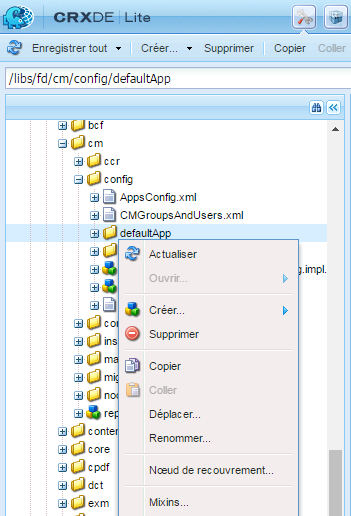
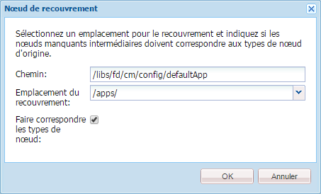
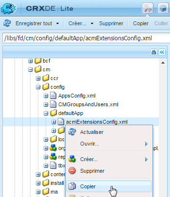
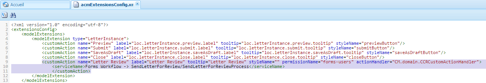
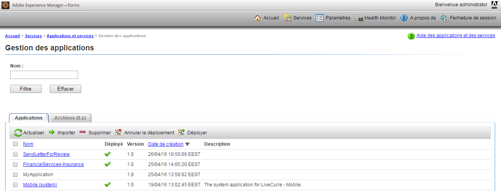
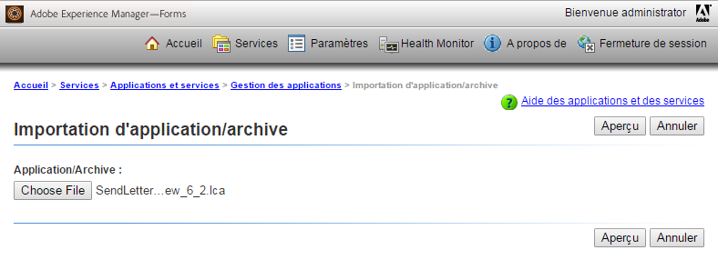

# Ajout d’une action ou d’un bouton personnalisé à l’interface utilisateur de création de correspondance {#add-custom-action-button-in-create-correspondence-ui}

## Présentation {#overview}

La solution Correspondence Management vous permet d’ajouter des actions personnalisées à l’interface utilisateur de création de correspondance.

Le scénario de ce document explique comment créer un bouton dans l’interface utilisateur de création de correspondance pour partager une lettre en tant que révision PDF jointe à un courrier électronique.

### Conditions préalables {#prerequisites}

Les éléments suivants sont requis pour terminer ce scénario :

* Connaissances de CRX et Javascript
* Serveur LiveCycle

## Scénario : Création du bouton dans l’interface utilisateur de création de correspondance en vue de la révision d’une lettre {#scenario-create-the-button-in-the-create-correspondence-user-interface-to-send-a-letter-for-review}

L’ajout d’un bouton d’action (ici : envoi de la lettre pour révision) à l’interface utilisateur de création de correspondance comprend :

1. L’ajout du bouton à l’interface utilisateur de création de correspondance
1. L’ajout d’un traitement d’action au bouton
1. L’ajout du processus LiveCycle pour permettre le traitement d’action

### Ajout du bouton à l’interface utilisateur de création de correspondance {#add-the-button-to-the-create-correspondence-user-interface}

1. Go to `https://'[server]:[port]'/[ContextPath]/crx/de` and login as Administrator.
1. In the apps folder, create a folder named `defaultApp` with path/structure similar to the defaultApp folder (located in config folder). Procédez comme suit pour créer le dossier :

   1. Right-click the **defaultApp** folder at the following path and select **Overlay Node**:

      /libs/fd/cm/config/defaultApp/

      

   1. Assurez-vous que la boîte de dialogue du nœud de recouvrement possède les valeurs suivantes :

      **Chemin :** /libs/fd/cm/config/defaultApp/

      **Emplacement de l’incrustation :** /apps/

      **Faire correspondre les types de noeud :** Coché

      

   1. Cliquez sur **OK**.
   1. Cliquez sur **Enregistrer tout**.

1. Effectuez une copie du fichier acmExtensionsConfig.xml (branche /libs) sous la branche /apps.

   1. Accédez à « /libs/fd/cm/config/defaultApp/acmExtensionsConfig.xml ».

   1. Right click the acmExtensionsConfig.xml file and select **Copy**.

      

   1. Faites un clic droit sur le dossier **defaultApp** sous « /applications/fd/cm/config/defaultApp/, » et sélectionnez **Coller**.
   1. Cliquez sur **Enregistrer tout**.

1. Double-cliquez sur la copie du fichier acmExtentionsConfig.xml créée dans le dossier d’applications. Le fichier à modifier s’ouvre.
1. Recherchez le code suivant :

   ```xml
   <?xml version="1.0" encoding="utf-8"?>
   <extensionsConfig>
       <modelExtensions>
           <modelExtension type="LetterInstance">
     <customAction name="Preview" label="loc.letterInstance.preview.label" tooltip="loc.letterInstance.preview.tooltip" styleName="previewButton"/>
               <customAction name="Submit" label="loc.letterInstance.submit.label" tooltip="loc.letterInstance.submit.tooltip" styleName="submitButton" permissionName="forms-users"/>
               <customAction name="SaveAsDraft" label="loc.letterInstance.saveAsDraft.label" tooltip="loc.letterInstance.saveAsDraft.tooltip" styleName="submitButton" permissionName="forms-users"/>
               <customAction name="Close" label="loc.letterInstance.close.label" tooltip="loc.letterInstance.close.tooltip" styleName="closeButton"/>
           </modelExtension>
       </modelExtensions>
   </extensionsConfig>
   ```

1. Pour envoyer la lettre par courrier électronique, vous pouvez utiliser le flux de travail LiveCycle Forms. Ajoutez une balise customAction sous la balise modelExtension dans acmExtensionsConfig.xml comme suit :

   ```xml
    <customAction name="Letter Review" label="Letter Review" tooltip="Letter Review" styleName="" permissionName="forms-users" actionHandler="CM.domain.CCRCustomActionHandler">
         <serviceName>Forms Workflow -> SendLetterForReview/SendLetterForReviewProcess</serviceName>
       </customAction>
   ```

   

   La balise modelExtension dispose d’un jeu de balises enfant customAction qui permet de configurer l’action, les autorisations et l’aspect du bouton d’action. Voici la liste des balises de configuration customAction :

   | **Nom** | **Description** |
   |---|---|
   | nom est | Nom alphanumérique de l’action à exécuter. La valeur de cette balise est obligatoire, doit être unique (dans la balise modelExtension) et doit commencer par une lettre de l’alphabet. |
   | label | Libellé du bouton d’action. |
   | tooltip | Texte de l’info-bulle du bouton, qui s’affiche lorsque l’utilisateur passe le pointeur de la souris sur le bouton. |
   | styleName | Nom du style personnalisé appliqué au bouton d’action. |
   | permissionName | L’action correspondante s’affiche uniquement si l’utilisateur dispose de l’autorisation spécifiée par permissionName. Lorsque vous spécifiez la valeur permissionName en tant que `forms-users`, tous les utilisateurs ont accès à cette option. |
   | actionHandler | Nom complet de la classe ActionHandler appelée lorsque l&#39;utilisateur clique sur le bouton. |

   Outre les paramètres ci-dessus, des configurations supplémentaires associées à une action personnalisée customAction peuvent exister. Ces configurations supplémentaires sont mises à la disposition du gestionnaire par le biais de l’objet CustomAction.

   | **Nom** | **Description** |
   |---|---|
   | serviceName | Si une action personnalisée contient une balise enfant nommée serviceName, puis en cliquant sur le bouton/lien approprié, un processus est appelé avec le nom représenté par la balise serviceName. Assurez-vous que ce processus a la même signature que le post-processus de lettre. Ajoutez le préfixe « Flux de travail Forms - > » au nom du service. |
   | Paramètres contenant le préfixe cm_ dans le nom de balise | Si une action personnalisée contient une balise enfant dont le nom commence par cm_, ces paramètres sont disponibles dans le code XML d’entrée sous la balise appropriée avec le préfixe cm_, dans le post-processus (qu’il s’agisse du post-processus de lettre ou du processus spécial représenté par la balise serviceName). |
   | actionName | Chaque fois qu’un post-processus est dû à un clic, le code XML envoyé contient une balise spéciale avec un nom sous la balise avec le nom de l’action de l’utilisateur. |

1. Cliquez sur **Enregistrer tout**.

#### Création d’un dossier de paramètres régionaux avec le fichier de propriétés dans la branche /apps {#create-a-locale-folder-with-properties-file-in-the-apps-branch}

Le fichier ACMExtensionsMessages.properties contient des libellés et des messages d’info-bulle de divers champs de l’interface utilisateur de création de correspondance. Effectuez une copie de ce fichier dans la branche /apps afin que les actions/boutons personnalisé(e)s fonctionnent.

1. Right-click the **locale** folder at the following path and select **Overlay Node**:

   /libs/fd/cm/config/defaultApp/locale

1. Assurez-vous que la boîte de dialogue du nœud de recouvrement possède les valeurs suivantes :

   **Chemin :** /libs/fd/cm/config/defaultApp/locale

   **Emplacement de l’incrustation :** /apps/

   **Faire correspondre les types de noeud :** Coché

1. Cliquez sur **OK**.
1. Cliquez sur **Enregistrer tout**.
1. Right-click the following file and select **Copy**:

   `/libs/fd/cm/config/defaultApp/locale/ACMExtensionsMessages.properties`

1. Faites un clic droit sur le dossier **Paramètres régionaux** à l’emplacement suivant et sélectionnez **Coller** :

   `/apps/fd/cm/config/defaultApp/locale/`

   Le fichier ACMExtensionsMessages.properties est copié dans le dossier de paramètres régionaux.

1. To localize the labels of the newly added custom action/button, create the ACMExtensionsMessages.properties file for the relevant locale in `/apps/fd/cm/config/defaultApp/locale/`.

   Par exemple, pour localiser l’action/le bouton personnalisé(e) créé(e) dans cet article, créez un fichier nommé ACMExtensionsMessages_fr.properties avec l’entrée suivante :

   `loc.letterInstance.letterreview.label=Revue De Lettre`

   De même, vous pouvez ajouter d’autres propriétés, telles que l’info-bulle et le style, dans ce fichier.

1. Cliquez sur **Enregistrer tout**.

#### Redémarrage du lot du bloc de création Adobe Asset Composer {#restart-the-adobe-asset-composer-building-block-bundle}

Après avoir effectué chaque modification côté serveur, redémarrez le lot du bloc de création Adobe Asset Composer. Dans ce scénario, les fichiers acmExtensionsConfig.xml et ACMExtensionsMessages.properties côté serveur sont modifiés. Par conséquent, le lot du bloc de création Adobe Asset Composer nécessite un redémarrage.

>[!NOTE]
>
>Vous devrez peut-être vider la mémoire cache du navigateur.

1. Accédez à `https://[host]:'port'/system/console/bundles`. Le cas échéant, connectez-vous en tant qu’administrateur.

1. Recherchez le lot du bloc de création Adobe Asset Composer. Redémarrez le lot : cliquez sur Arrêter, puis sur Démarrer.

   

Après le redémarrage du lot du bloc de création Adobe Asset Composer, le bouton personnalisé s’affiche dans l’interface utilisateur de création de correspondance. Vous pouvez ouvrir une lettre dans l’interface utilisateur de création de correspondance afin de prévisualiser le bouton personnalisé.

### Ajouter un traitement d’action au bouton {#add-action-handling-to-the-button}

Par défaut, la classe ActionHandler est intégrée dans le fichier cm.domain.js de l’interface utilisateur de création de correspondance à l’emplacement suivant :

/libs/fd/cm/ccr/gui/components/admin/clientlibs/ccr/js/cm.domain.js

Concernant le traitement de l’action personnalisée, créez un recouvrement du fichier cm.domain.js dans la branche /apps de CRX.

La gestion de l’action/du bouton lors d’un clic sur l’action/le bouton comprend la logique pour :

* Rendre l’action ajoutée visible/invisible : via le remplacement de la fonction actionVisible().
* Activation/désactivation de l’action ajoutée : en remplaçant la fonction actionEnabled().
* Gestion réelle de l’action lorsque l’utilisateur clique sur le bouton : en remplaçant l’implémentation de la fonction handleAction().

1. Accédez à `https://'[server]:[port]'/[ContextPath]/crx/de`. Le cas échéant, connectez-vous en tant qu’administrateur.

1. Dans le dossier d’applications, créez un dossier nommé `js` dans la branche /apps de CRX, dont la structure est semblable au dossier suivant :

   `/libs/fd/cm/ccr/gui/components/admin/clientlibs/ccrui/js`

   Procédez comme suit pour créer le dossier :

   1. Right-click the **js** folder at the following path and select **Overlay Node**:

      `/libs/fd/cm/ccr/gui/components/admin/clientlibs/ccrui/js`

   1. Assurez-vous que la boîte de dialogue du nœud de recouvrement possède les valeurs suivantes :

      **Chemin :** /libs/fd/cm/ccr/gui/components/admin/clientlibs/ccrui/js

      **Emplacement de l’incrustation :** /apps/

      **Faire correspondre les types de noeud :** Coché

   1. Cliquez sur **OK**.
   1. Cliquez sur **Enregistrer tout**.

1. Dans le dossier js, créez un fichier nommé ccrcustomization.js avec le code de traitement d’action du bouton en procédant comme suit :

   1. Right-click the **js** folder at the following path and select **Create > Create File**:

      `/apps/fd/cm/ccr/gui/components/admin/clientlibs/ccrui/js`

      Nommez le fichier ccrcustomization.js.

   1. Double-cliquez sur le fichier ccrcustomization.js pour l’ouvrir dans CRX.
   1. Dans le fichier, collez le code suivant puis cliquez sur **Enregistrer tout** :

      ```
      /* for adding and handling custom actions in Extensible Toolbar.
        * One instance of handler will be created for each action.
        * CM.domain.CCRCustomActionHandler is actionHandler class.
        */
      var CCRCustomActionHandler;
          CCRCustomActionHandler = CM.domain.CCRCustomActionHandler = new Class({
              className: 'CCRCustomActionHandler',
              extend: CCRDefaultActionHandler,
              construct : function(action,model){
              }
          });
          /**
           * Called when user user click an action
           * @param extraParams additional arguments that may be passed to handler (For future use)
           */
          CCRCustomActionHandler.prototype.handleAction = function(extraParams){
              if (this.action.name == CCRCustomActionHandler.SEND_FOR_REVIEW) {
                  var sendForReview = function(){
                      var serviceName = this.action.actionConfig["serviceName"];
                      var inputParams = {};
                      inputParams["dataXML"] = this.model.iccData.data;
                      inputParams["letterId"] = this.letterVO.id;
                      inputParams["letterName"] = this.letterVO.name;
                      inputParams["mailId"] = $('#email').val();
                      /*function to invoke the LivecyleService */
                      ServiceDelegate.callJSONService(this,"lc.icc.renderlib.serviceInvoker.json","invokeProcess",[serviceName,inputParams],this.onProcessInvokeComplete,this.onProcessInvokeFail);
                      $('#ccraction').modal("hide");
                  }
                  if($('#ccraction').length == 0){
                      /*For first click adding popup & setting letterName.*/
                      $("body").append(popUp);
                      $("input[id*='letterName']").val(this.letterVO.name);
                      $(document).on('click',"#submitLetter",$.proxy( sendForReview, this ));
                  }
                  $('#ccraction').modal("show");
              }
          };
          /**
           * Should the action be enabled in toolbar
           * @param extraParams additional arguements that may be passed to handler (For future use)
           * @return flag indicating whether the action should be enabled
           */
         CCRCustomActionHandler.prototype.actionEnabled = function(extraParams){
                  /*can be customized as per user requirement*/
                  return true;
          };
          /**
           * Should the action be visible in toolbar
           * @param extraParams additional arguments that may be passed to handler (For future use)
           * @return flag indicating whether the action should be enabled
           */
          CCRCustomActionHandler.prototype.actionVisible = function(extraParams){
              /*Check can be enabled for Non-Preview Mode.*/
              return true;
          };
          /*SuccessHandler*/
          CCRCustomActionHandler.prototype.onProcessInvokeComplete = function(response) {
              ErrorHandler.showSuccess("Letter Sent for Review");
          };
          /*FaultHandler*/
          CCRCustomActionHandler.prototype.onProcessInvokeFail = function(event) {
              ErrorHandler.showError(event.message);
          };
          CCRCustomActionHandler.SEND_FOR_REVIEW  = "Letter Review";
      /*For PopUp*/
          var popUp = '<div class="modal fade" id="ccraction" tabindex="-1" role="dialog" aria-hidden="true">'+
          '<div class="modal-dialog modal-sm">'+
              '<div class="modal-content">' +
                  '<div class="modal-header">'+
                      '<button type="button" class="close" data-dismiss="modal" aria-label="Close"><span aria-hidden="true">&times;</code></button>'+
                      '<h4 class="modal-title"> Send Review </h4>'+
                  '</div>'+
                  '<div class="modal-body">'+
                      '<form>'+
                          '<div class="form-group">'+
                              '<label class="control-label">Email Id</label>'+
                              '<input type="text" class="form-control" id="email">'+
                          '</div>'+
                          '<div class="form-group">'+
                              '<label  class="control-label">Letter Name</label>'+
                              '<input id="letterName" type="text" class="form-control" readonly>'+
                          '</div>'+
                          '<div class="form-group">'+
                              '<input id="letterData" type="text" class="form-control hide" readonly>'+
                          '</div>'+
                      '</form>'+
                  '</div>'+
                  '<div class="modal-footer">'+
                     '<button type="button" class="btn btn-default" data-dismiss="modal"> Cancel </button>'+
                     '<button type="button" class="btn btn-primary" id="submitLetter"> Submit </button>'+
                  '</div>'+
              '</div>'+
          '</div>'+
      '</div>';
      ```

### Ajout d’un processus LiveCycle pour activer le traitement <span class="acrolinxCursorMarker"></code>d’action {#add-the-livecycle-process-to-enable-action-span-class-acrolinxcursormarker-span-handling}

Dans ce scénario, activez les composants suivants, qui font partie du fichier joint components.zip :

* Composant JAR DSC (DSCSample.jar)
* Processus LCA d’envoi de la lettre pour révision (SendLetterForReview.lca)

Téléchargez et décompressez le fichier components.zip pour obtenir les fichiers DSCSample.jar et SendLetterForReview.lca. Utilisez ces fichiers comme indiqué dans les procédures suivantes.
components.zip

#### Configuration du serveur LiveCycle pour exécuter le processus LCA {#configure-the-livecycle-server-to-run-the-lca-process}

>[!NOTE]
>
>Cette étape n’est requise que si vous utilisez une configuration OSGI et que l’intégration LC est requise pour le type de personnalisation que vous implémentez.

Le processus LCA s’exécute sur le serveur LiveCycle et requiert l’adresse du serveur et les informations d’identification.

1. Go to `https://'[server]:[port]'/system/console/configMgr` and login as Administrator.
1. Localisez la configuration du SDK client d’Adobe LiveCycle et cliquez sur **Modifier** (icône de modification). Le panneau de configuration s’ouvre.

1. Enter the following details and click **Save**:

   * **URL** du serveur : URL du serveur LC dont le service Send For Review est utilisé par le code du gestionnaire d’actions.
   * **Nom d&#39;utilisateur**: Nom d’utilisateur administrateur du serveur LC
   * **Mot de passe** : mot de passe du nom d’utilisateur de l’administrateur.

   

#### Installation de LiveCycle Archive (LCA) {#install-livecycle-archive-lca}

Processus LiveCycle requis qui active le processus du service de messagerie électronique.

>[!NOTE]
>
>Workbench est requis pour connaître le fonctionnement de ce processus ou créer un processus similaire.

1. Log in as Administrator to Livecycle Server adminui at `https:/[lc server]/:[lc port]/adminui`.

1. Accédez à **Accueil > Services > Applications et services > Gestion des applications**.

1. Si l’application SendLetterForReview est déjà présente, ignorez les étapes restantes de cette procédure, sinon passez aux étapes suivantes.

   

1. Cliquez sur **Importer**.

1. Click **Choose File** and select SendLetterForReview.lca.

   

1. Cliquez sur **Aperçu**.  

1. Select **Deploy assets to runtime when import is complete**.

1. Cliquez sur **Importer**.

#### Adding ServiceName to the Allowlist Service list {#adding-servicename-to-the-allowlist-service-list}

Indiquez dans le serveur AEM les services LiveCycle auxquels vous souhaitez qu’il accède.

1. Connectez-vous en tant qu’administrateur à `https:/[host]:'port'/system/console/configMgr`.

1. Locate and click **Adobe LiveCycle Client SDK Configuration**. Le panneau Configuration du SDK client d’Adobe LiveCycle s’affiche.
1. In the Service Name list, click + icon and add a serviceName **SendLetterForReview/SendLetterForReviewProcess**.

1. Cliquez sur **Enregistrer**.

#### Configuration du service de courrier électronique {#configure-the-email-service}

Dans ce scénario, configurez le service de messagerie dans le serveur LiveCycle afin que Correspondence Management puisse envoyer un courrier électronique.

1. Log in with Admin credentials to Livecycle Server adminui at `https:/[lc server]:[lc port]/adminui`.

1. Accédez à **Accueil > Services > Applications et services > Gestion des services**.

1. Recherchez et cliquez sur **EmailService**.

1. In **SMTP Host**, configure the email service.

1. Cliquez sur **Enregistrer**.

#### Configuration du service DSC {#configure-the-dsc-service}

Pour utiliser l’API Correspondence Management, téléchargez le fichier DSCSample.jar (joint à ce document dans le cadre de components.zip) et téléchargez-le sur le serveur LiveCycle. Une fois le fichier DSCSample.jar téléchargé sur le serveur LiveCycle, le serveur AEM utilise le fichier DSCSample.jar pour accéder à l’API renderLetter.

Pour plus d’informations, voir [Connexion d’AEM Forms à Adobe LiveCycle](/help/forms/using/aem-livecycle-connector.md).

1. Mettez à jour l’URL du serveur AEM dans cmsa.properties dans DSCSample.jar, qui se trouve à l’emplacement suivant :

   DSCSample.jar\com\adobe\livecycle\cmsa.properties

1. Indiquez les paramètres suivants dans le fichier de configuration :

   * **crx.serverUrl**=https:/host:port/[du chemin]de contexte/URL[AEM]
   * **crx.username**= nom d’utilisateur AEM
   * **crx.password**= mot de passe AEM
   * **crx.appRoot**=/content/apps/cm

   >[!NOTE]
   >
   >À chaque modification apportée au côté serveur, redémarrez le serveur LiveCycle. Pour plus d’informations sur la création de votre propre composant LiveCycle, voir [Extension du logiciel LiveCycle ES via le développement d’un DSC personnalisé](https://www.adobe.com/devnet/livecycle/articles/dsc_development.html).

   Le fichier DSCSample.jar utilise l’API renderLetter. For more Information about the renderLetter API, see [Interface LetterRenderService](https://helpx.adobe.com/aem-forms/6-1/javadocs/com/adobe/icc/ddg/api/LetterRenderService.html).

#### Importer DSC vers LiveCycle {#import-dsc-to-livecyle}

Le fichier DSCSample.jar utilise l’API renderLetter pour effectuer le rendu de la lettre en tant qu’octets PDF à partir de données XML que C fournit en entrée. Pour plus d’informations sur l’API renderLetter et les autres API, voir [Service de rendu de lettre](https://helpx.adobe.com/aem-forms/6-1/javadocs/com/adobe/icc/ddg/api/LetterRenderService.html).

1. Démarrer Workbench et connectez-vous.
1. Select **Window > Show Views > Components**. La vue Composants est ajoutée à Workbench ES2.

1. Right-click **Components** and select **Install Component**.

1. Select the **DSCSample.jar** file through the file browser and click **Open**.
1. Right-click **RenderWrapper** and select **Start Component**. Si le composant démarre, une flèche verte apparaît en regard du nom du composant.

## Envoi de la lettre pour révision {#send-letter-for-review}

Après avoir configuré l’action et le bouton d’envoi de la lettre pour révision :

1. Videz la mémoire cache du navigateur.

1. Dans l’interface utilisateur de création de correspondance, cliquez sur **Révision de lettre** et indiquez l’ID de messagerie du réviseur.

1. Cliquez sur **Envoyer**.


Le réviseur reçoit un courrier électronique du système contenant la lettre en tant que pièce jointe.
