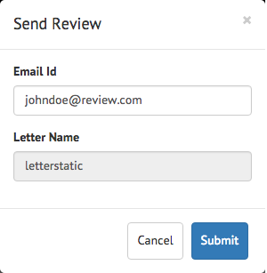

# Ajouter un bouton d’action personnalisé dans l’interface utilisateur de création de correspondance {#add-custom-action-button-in-create-correspondence-ui}

## Présentation {#overview}

La solution Correspondence Management vous permet d’ajouter des actions personnalisées à l’interface utilisateur de création de correspondance.

Le scénario présenté dans ce document explique comment créer un bouton dans l’interface utilisateur de création de correspondance pour partager une lettre sous la forme d’un PDF de révision joint à un e-mail.

### Prérequis {#prerequisites}

Pour terminer ce scénario, vous devez disposer des éléments suivants :

* Connaissance de CRX et JavaScript
* LiveCycle Server

## Scénario : Création du bouton dans l’interface utilisateur de création de correspondance pour envoyer une lettre à réviser {#scenario-create-the-button-in-the-create-correspondence-user-interface-to-send-a-letter-for-review}

L’ajout d’un bouton avec une action (ici, envoyer une lettre pour révision) à l’interface utilisateur de création de correspondance comprend :

1. Ajout du bouton à l’interface utilisateur de création de correspondance
1. Ajout d’une gestion des actions au bouton
1. L’ajout du processus LiveCycle pour permettre le traitement d’action

### Ajout du bouton à l’interface utilisateur de création de correspondance {#add-the-button-to-the-create-correspondence-user-interface}

1. Accédez à `https://'[server]:[port]'/[ContextPath]/crx/de` et connectez-vous en tant qu’administrateur.
1. Dans le dossier des applications, créez un dossier appelé `defaultApp` avec un chemin d’accès / structure similaire au dossier defaultApp (situé dans le dossier de configuration). Procédez comme suit pour créer le dossier :

   1. Faites un clic droit sur le dossier **defaultApp** à l’emplacement suivant et sélectionnez **Nœud de recouvrement** :

      /libs/fd/cm/config/defaultApp/

      

   1. Assurez-vous que la boîte de dialogue du nœud de recouvrement possède les valeurs suivantes :

      **Chemin d’accès :** /libs/fd/cm/config/defaultApp/

      **Emplacement du recouvrement :** /apps/

      **Correspondance des types de nœuds :** activé.

      

   1. Cliquez sur **OK**.
   1. Cliquez sur **Enregistrer tout**.

1. Effectuez une copie du fichier acmExtensionsConfig.xml (branche /libs) sous la branche /apps.

   1. Accédez à « /libs/fd/cm/config/defaultApp/acmExtensionsConfig.xml ».

   1. Cliquez avec le bouton droit sur le fichier acmExtensionsConfig.xml et sélectionnez **Copier**.

      

   1. Cliquez avec le bouton droit de la souris sur le **defaultApp** dossier à l’emplacement &quot;/apps/fd/cm/config/defaultApp/&quot;, puis sélectionnez **Coller**.
   1. Cliquez sur **Enregistrer tout**.

1. Double-cliquez sur la copie du fichier acmExtentionsConfig.xml que vous venez de créer dans le dossier des applications. Le fichier s’ouvre pour modification.
1. Recherchez le code suivant :

   ```xml
   <?xml version="1.0" encoding="utf-8"?>
   <extensionsConfig>
       <modelExtensions>
           <modelExtension type="LetterInstance">
     <customAction name="Preview" label="loc.letterInstance.preview.label" tooltip="loc.letterInstance.preview.tooltip" styleName="previewButton"/>
               <customAction name="Submit" label="loc.letterInstance.submit.label" tooltip="loc.letterInstance.submit.tooltip" styleName="submitButton" permissionName="forms-users"/>
               <customAction name="SaveAsDraft" label="loc.letterInstance.saveAsDraft.label" tooltip="loc.letterInstance.saveAsDraft.tooltip" styleName="submitButton" permissionName="forms-users"/>
               <customAction name="Close" label="loc.letterInstance.close.label" tooltip="loc.letterInstance.close.tooltip" styleName="closeButton"/>
           </modelExtension>
       </modelExtensions>
   </extensionsConfig>
   ```

1. Pour envoyer la lettre par courrier électronique, vous pouvez utiliser le workflow LiveCycle Forms. Pour ajouter une balise customAction sous la balise modelExtension dans le fichier acmExtensionsConfig.xml, procédez comme suit :

   ```xml
    <customAction name="Letter Review" label="Letter Review" tooltip="Letter Review" styleName="" permissionName="forms-users" actionHandler="CM.domain.CCRCustomActionHandler">
         <serviceName>Forms Workflow -> SendLetterForReview/SendLetterForReviewProcess</serviceName>
       </customAction>
   ```

   

   La balise modelExtension comporte un ensemble de balises enfants customAction configurant l’action, les autorisations et l’aspect du bouton d’action. Voici la liste des balises de configuration customAction :

   | **Nom** | **Description** |
   |---|---|
   | name | Le nom alphanumérique de l’action à exécuter. La valeur de cette balise est obligatoire, doit être unique (dans la balise modelExtension) et doit commencer par une lettre de l’alphabet. |
   | label | Libellé à afficher sur le bouton d’action |
   | tooltip | Texte de l’info-bulle du bouton, qui s’affiche lorsque l’utilisateur passe la souris sur le bouton. |
   | styleName | Nom du style personnalisé appliqué au bouton d’action. |
   | permissionName | L’action correspondante s’affiche uniquement si l’utilisateur dispose de l’autorisation spécifiée par la valeur permissionName. Lorsque vous spécifiez la valeur permissionName en tant que `forms-users`, tous les utilisateurs ont accès à cette option. |
   | actionHandler | Nom complet de la classe ActionHandler appelée lorsque l’utilisateur clique sur le bouton. |

   Outre les paramètres ci-dessus, des configurations supplémentaires associées à une action personnalisée customAction peuvent exister. Ces configurations supplémentaires sont accessibles au gestionnaire via l’objet CustomAction.

   | **Nom** | **Description** |
   |---|---|
   | serviceName | Si une action personnalisée customAction comprend une balise enfant nommée serviceName, le fait de cliquer sur le bouton/lien correspondant appelle un processus dont le nom est représenté par la balise serviceName. Vérifiez que ce processus présente la même signature que le post-processus de lettre. Ajoutez le préfixe « Workflow Forms - > » au nom du service. |
   | Paramètres contenant le préfixe cm_ dans le nom de balise | Si une action personnalisée (customAction) contient une balise enfant dont le nom commence par cm_, au cours du post-processus (qu’il s’agisse d’un post-processus de lettre ou d’un processus spécifique représenté par la balise serviceName), ces paramètres sont disponibles dans le code XML d’entrée, sous la balise correspondante et sans le préfixe cm_. |
   | actionName | Lorsqu’un post-processus est généré par un clic, les données XML soumises présentent une balise spéciale dont le nom contient le nom de l’action utilisateur. |

1. Cliquez sur **Enregistrer tout**.

#### Création d’un dossier de paramètres régionaux avec le fichier de propriétés dans la branche /apps {#create-a-locale-folder-with-properties-file-in-the-apps-branch}

Le fichier ACMExtensionsMessages.properties comprend des libellés et des messages d’info-bulles correspondant à plusieurs champs de l’interface utilisateur de création de correspondance. Effectuez une copie de ce fichier dans la branche /apps afin que les actions/boutons personnalisé(e)s fonctionnent.

1. Faites un clic droit sur le dossier **Paramètres régionaux** au chemin d’accès suivant et sélectionnez **Nœud de recouvrement** :

   /libs/fd/cm/config/defaultApp/locale

1. Assurez-vous que la boîte de dialogue du nœud de recouvrement possède les valeurs suivantes :

   **Chemin d’accès :** /libs/fd/cm/config/defaultApp/locale

   **Emplacement du recouvrement :** /apps/

   **Respect des types de nœud :** activé

1. Cliquez sur **OK**.
1. Cliquez sur **Enregistrer tout**.
1. Faites un clic droit sur le fichier suivant et sélectionnez **Copier** :

   `/libs/fd/cm/config/defaultApp/locale/ACMExtensionsMessages.properties`

1. Faites un clic droit sur le dossier **Paramètres régionaux** à l’emplacement suivant et sélectionnez **Coller** :

   `/apps/fd/cm/config/defaultApp/locale/`

   Le fichier ACMExtensionsMessages.properties est copié dans le dossier de paramètres régionaux.

1. Pour localiser les libellés de l’action/du bouton personnalisé(e) nouvellement ajouté(e), créez le fichier ACMExtensionsMessages.properties correspondant au paramètre régional approprié dans `/apps/fd/cm/config/defaultApp/locale/`.

   Par exemple, pour localiser l’action/le bouton personnalisé(e) créé(e) dans cet article, créez un fichier nommé ACMExtensionsMessages_fr.properties avec l’entrée suivante :

   `loc.letterInstance.letterreview.label=Revue De Lettre`

   De même, vous pouvez ajouter des propriétés supplémentaires (par rapport à l’info-bulle et au style, par exemple) dans ce fichier.

1. Cliquez sur **Enregistrer tout**.

#### Redémarrez le lot du bloc de création Adobe Asset Composer {#restart-the-adobe-asset-composer-building-block-bundle}

Après avoir effectué chaque modification côté serveur, redémarrez le lot du bloc de création Asset Composer Adobe. Dans ce scénario, les fichiers acmExtensionsConfig.xml et ACMExtensionsMessages.properties côté serveur sont modifiés et, par conséquent, le lot du bloc de création Adobe Asset Composer nécessite un redémarrage.

>[!NOTE]
>
>Vous devrez peut-être vider la mémoire cache du navigateur.

1. Accédez à `https://[host]:'port'/system/console/bundles`. Le cas échéant, connectez-vous en tant qu’administrateur.

1. Recherchez le lot du bloc de création Adobe Asset Composer. Redémarrez le lot : cliquez sur Arrêter, puis sur Démarrer.

   

Après le redémarrage du lot du bloc de création Adobe Asset Composer, le bouton personnalisé s’affiche dans l’interface utilisateur de création de correspondance. Vous pouvez ouvrir une lettre dans l’interface utilisateur de création de correspondance pour prévisualiser le bouton personnalisé.

### Ajout de la gestion des actions au bouton {#add-action-handling-to-the-button}

Par défaut, l’interface utilisateur de création de correspondance dispose de l’implémentation d’ActionHandler dans le fichier cm.domain.js à l’emplacement suivant :

/libs/fd/cm/ccr/gui/components/admin/clientlibs/ccr/js/cm.domain.js

Concernant le traitement de l’action personnalisée, créez un recouvrement du fichier cm.domain.js dans la branche /apps de CRX.

Le traitement de l’action/du bouton lors d’un clic sur l’action/le bouton comprend la logique pour :

* Rendre l’action ajoutée visible/invisible : via le remplacement de la fonction actionVisible().
* Activer/désactiver l’action ajoutée : via le remplacement de la fonction actionEnabled().
* Traiter réellement l’action lorsque l’utilisateur clique sur le bouton : via le remplacement de l’implémentation de la fonction handleAction().

1. Accédez à `https://'[server]:[port]'/[ContextPath]/crx/de`. Le cas échéant, connectez-vous en tant qu’administrateur.

1. Dans le dossier d’applications, créez un dossier nommé `js` dans la branche /apps de CRX, dont la structure est semblable au dossier suivant :

   `/libs/fd/cm/ccr/gui/components/admin/clientlibs/ccrui/js`

   Procédez comme suit pour créer le dossier :

   1. Cliquez avec le bouton droit sur le dossier **js** à l’emplacement suivant et sélectionnez **Nœud de recouvrement** :

      `/libs/fd/cm/ccr/gui/components/admin/clientlibs/ccrui/js`

   1. Assurez-vous que la boîte de dialogue du nœud de recouvrement possède les valeurs suivantes :

      **Chemin :** /libs/fd/cm/ccr/gui/components/admin/clientlibs/ccrui/js

      **Emplacement du recouvrement :** /apps/

      **Respect des types de nœud :** activé

   1. Cliquez sur **OK**.
   1. Cliquez sur **Enregistrer tout**.

1. Dans le dossier js, procédez comme suit pour créer un fichier nommé ccrcustomization.js avec le code de traitement d’action du bouton :

   1. Cliquez avec le bouton droit sur le dossier **js** au chemin suivant, puis sélectionnez **Créer > Créer un fichier** :

      `/apps/fd/cm/ccr/gui/components/admin/clientlibs/ccrui/js`

      Nommez le fichier ccrcustomization.js.

   1. Double-cliquez sur le fichier ccrcustomization.js pour l’ouvrir dans CRX.
   1. Dans le fichier , collez le code suivant, puis cliquez sur **Enregistrer tout**:

      ```javascript
      /* for adding and handling custom actions in Extensible Toolbar.
        * One instance of handler will be created for each action.
        * CM.domain.CCRCustomActionHandler is actionHandler class.
        */
      var CCRCustomActionHandler;
          CCRCustomActionHandler = CM.domain.CCRCustomActionHandler = new Class({
              className: 'CCRCustomActionHandler',
              extend: CCRDefaultActionHandler,
              construct : function(action,model){
              }
          });
          /**
           * Called when user user click an action
           * @param extraParams additional arguments that may be passed to handler (For future use)
           */
          CCRCustomActionHandler.prototype.handleAction = function(extraParams){
              if (this.action.name == CCRCustomActionHandler.SEND_FOR_REVIEW) {
                  var sendForReview = function(){
                      var serviceName = this.action.actionConfig["serviceName"];
                      var inputParams = {};
                      inputParams["dataXML"] = this.model.iccData.data;
                      inputParams["letterId"] = this.letterVO.id;
                      inputParams["letterName"] = this.letterVO.name;
                      inputParams["mailId"] = $('#email').val();
                      /*function to invoke the LivecyleService */
                      ServiceDelegate.callJSONService(this,"lc.icc.renderlib.serviceInvoker.json","invokeProcess",[serviceName,inputParams],this.onProcessInvokeComplete,this.onProcessInvokeFail);
                      $('#ccraction').modal("hide");
                  }
                  if($('#ccraction').length == 0){
                      /*For first click adding popup & setting letterName.*/
                      $("body").append(popUp);
                      $("input[id*='letterName']").val(this.letterVO.name);
                      $(document).on('click',"#submitLetter",$.proxy( sendForReview, this ));
                  }
                  $('#ccraction').modal("show");
              }
          };
          /**
           * Should the action be enabled in toolbar
           * @param extraParams additional arguements that may be passed to handler (For future use)
           * @return flag indicating whether the action should be enabled
           */
         CCRCustomActionHandler.prototype.actionEnabled = function(extraParams){
                  /*can be customized as per user requirement*/
                  return true;
          };
          /**
           * Should the action be visible in toolbar
           * @param extraParams additional arguments that may be passed to handler (For future use)
           * @return flag indicating whether the action should be enabled
           */
          CCRCustomActionHandler.prototype.actionVisible = function(extraParams){
              /*Check can be enabled for Non-Preview Mode.*/
              return true;
          };
          /*SuccessHandler*/
          CCRCustomActionHandler.prototype.onProcessInvokeComplete = function(response) {
              ErrorHandler.showSuccess("Letter Sent for Review");
          };
          /*FaultHandler*/
          CCRCustomActionHandler.prototype.onProcessInvokeFail = function(event) {
              ErrorHandler.showError(event.message);
          };
          CCRCustomActionHandler.SEND_FOR_REVIEW  = "Letter Review";
      /*For PopUp*/
          var popUp = '<div class="modal fade" id="ccraction" tabindex="-1" role="dialog" aria-hidden="true">'+
          '<div class="modal-dialog modal-sm">'+
              '<div class="modal-content">' +
                  '<div class="modal-header">'+
                      '<button type="button" class="close" data-dismiss="modal" aria-label="Close"><span aria-hidden="true">&times;</code></button>'+
                      '<h4 class="modal-title"> Send Review </h4>'+
                  '</div>'+
                  '<div class="modal-body">'+
                      '<form>'+
                          '<div class="form-group">'+
                              '<label class="control-label">Email Id</label>'+
                              '<input type="text" class="form-control" id="email">'+
                          '</div>'+
                          '<div class="form-group">'+
                              '<label  class="control-label">Letter Name</label>'+
                              '<input id="letterName" type="text" class="form-control" readonly>'+
                          '</div>'+
                          '<div class="form-group">'+
                              '<input id="letterData" type="text" class="form-control hide" readonly>'+
                          '</div>'+
                      '</form>'+
                  '</div>'+
                  '<div class="modal-footer">'+
                     '<button type="button" class="btn btn-default" data-dismiss="modal"> Cancel </button>'+
                     '<button type="button" class="btn btn-primary" id="submitLetter"> Submit </button>'+
                  '</div>'+
              '</div>'+
          '</div>'+
      '</div>';
      ```

### Ajouter le processus de LiveCycle pour activer l’action <span class="acrolinxCursorMarker"></code>gestion {#add-the-livecycle-process-to-enable-action-span-class-acrolinxcursormarker-span-handling}

Dans ce scénario, activez les composants suivants, qui font partie du fichier joint components.zip :

* Composant DSC jar (DSCSample.jar)
* Processus LCA d’envoi de la lettre pour révision (SendLetterForReview.lca)

Téléchargez et décompressez le fichier components.zip pour obtenir les fichiers DSCSample.jar et SendLetterForReview.lca. Utilisez ces fichiers comme indiqué dans les procédures suivantes.
[Obtenir le fichier](assets/components.zip)

#### Configuration du serveur LiveCycle pour exécuter le processus LCA {#configure-the-livecycle-server-to-run-the-lca-process}

>[!NOTE]
>
>Cette étape est requise uniquement dans le cadre d’une configuration OSGI. En outre, l’intégration LC est requise par rapport au type de personnalisation mis en œuvre.

Le processus LCA s’exécute sur le serveur LiveCycle et requiert l’adresse du serveur et les informations d’identification.

1. Accédez à `https://'[server]:[port]'/system/console/configMgr` et connectez-vous en tant qu’administrateur.
1. Localisez la configuration du SDK client d’Adobe LiveCycle et cliquez sur **Modifier** (icône de modification). Le panneau de configuration s’ouvre.

1. Saisissez les informations suivantes, puis cliquez sur **Enregistrer** :

   * **URL du serveur** : URL du serveur LC dont dépend le service Envoi pour révision utilisé par le code du gestionnaire d’action.
   * **Nom d’utilisateur** : nom d’utilisateur de l’administrateur du serveur LC.
   * **Mot de passe** : mot de passe du nom d’utilisateur de l’administrateur.

   

#### Installation de LiveCycle Archive (LCA) {#install-livecycle-archive-lca}

Processus LiveCycle requis permettant l’exécution du processus de service de courrier électronique.

>[!NOTE]
>
>Workbench est requis pour connaître le fonctionnement de ce processus ou créer un processus similaire.

1. Connectez-vous en tant qu’administrateur à l’interface administrateur du serveur LiveCycle® à l’adresse `https:/[lc server]/:[lc port]/adminui`.

1. Accédez à **Accueil > Services > Applications et services > Gestion des applications**.

1. Si l’application SendLetterForReview est déjà présente, ignorez les étapes restantes de cette procédure. Dans le cas contraire, effectuez les étapes suivantes.

   

1. Cliquez sur **Importer**.

1. Cliquez sur **Choisir un fichier** et sélectionnez SendLetterForReview.lca.

   

1. Cliquez sur **Aperçu**. 

1. Sélectionnez **Déployer les ressources à l’exécution à la fin de l’importation**.

1. Cliquez sur **Importer**.

#### Ajouter ServiceName à la liste du service Allowlist {#adding-servicename-to-the-allowlist-service-list}

Indiquez dans le serveur Experience Manager les services LiveCycle auxquels vous souhaitez qu’il accède.

1. Connectez-vous en tant qu’administrateur à `https:/[host]:'port'/system/console/configMgr`.

1. Recherchez et cliquez sur **Configuration du SDK client d’Adobe LiveCycle**. Le panneau Configuration du SDK client d’Adobe LiveCycle s’affiche.
1. Dans la liste Nom du service, cliquez sur l’icône + et ajoutez un nom de service **SendLetterForReview/SendLetterForReviewProcess**.

1. Cliquez sur **Enregistrer**.

#### Configuration du service de messagerie {#configure-the-email-service}

Dans ce scénario, pour que Correspondence Management puisse envoyer un email, configurez le service de messagerie dans le serveur LiveCycle.

1. Connectez-vous avec les informations d’identification d’administrateur à l’interface administrateur du serveur LiveCycle à `https:/[lc server]:[lc port]/adminui`.

1. Accédez à **Accueil > Services > Applications et services > Gestion des services**.

1. Recherchez et cliquez sur **EmailService**.

1. Dans **Hôte SMTP**, configurez le service de messagerie.

1. Cliquez sur **Enregistrer**.

#### Configuration du service DSC {#configure-the-dsc-service}

Pour utiliser l’API Correspondence Management, téléchargez le fichier DSCSample.jar (joint à ce document en tant qu’élément de components.zip) et chargez-le sur le serveur LiveCycle. Une fois le fichier DSCSample.jar chargé sur le serveur LiveCycle, le serveur Experience Manager l’utilise pour accéder à l’API renderLetter.

Pour plus d’informations, voir [Connexion d’AEM Forms à Adobe LiveCycle](/help/forms/using/aem-livecycle-connector.md).

1. Mettez à jour l’URL du serveur Experience Manager dans cmsa.properties dans DSCSample.jar, qui se trouve à l’emplacement suivant :

   DSCSample.jar\com\adobe\livecycle\cmsa.properties

1. Indiquez les paramètres suivants dans le fichier de configuration :

   * **crx.serverUrl**=https:/host:port/[context path]/[AEM URL]
   * **crx.username**= nom d’utilisateur Experience Manager
   * **crx.password**= mot de passe Experience Manager
   * **crx.appRoot**=/content/apps/cm

   >[!NOTE]
   >
   >À chaque modification apportée au côté serveur, redémarrez le serveur LiveCycle.

   Le fichier DSCSample.jar utilise l’API renderLetter. Pour plus d’informations sur l’API renderLetter, voir [Interface LetterRenderService](https://www.adobe.io/experience-manager/reference-materials/6-5/forms/javadocs/index.html?com/adobe/icc/ddg/api/LetterRenderService.html).

#### Importer DSC vers LiveCycle {#import-dsc-to-livecyle}

Le fichier DSCSample.jar utilise l’API renderLetter pour effectuer le rendu d’une lettre sous forme d’octets PDF à partir des données XML fournies par DSC en tant qu’entrée. Pour plus d’informations sur renderLetter et les autres API, voir [Service de rendu de lettre](https://www.adobe.io/experience-manager/reference-materials/6-5/forms/javadocs/index.html?com/adobe/icc/ddg/api/LetterRenderService.html).

1. Démarrez Workbench et connectez-vous.
1. Sélectionnez **Fenêtre > Afficher les vues > Composants**. La vue Composants est ajoutée à Workbench ES2.

1. Faites un clic droit sur **Composants** et sélectionnez **Installer un composant**.

1. Sélectionnez le fichier **DSCSample.jar** via l’explorateur de fichiers et cliquez sur **Ouvrir**.
1. Faites un clic droit sur **RenderWrapper** et sélectionnez **Démarrer le composant**. Si le composant démarre, une flèche verte apparaît en regard du nom du composant.

## Envoyer une lettre pour révision {#send-letter-for-review}

Après avoir configuré l’action et le bouton permettant d’envoyer la lettre pour révision :

1. Videz la mémoire cache du navigateur.

1. Dans l’interface utilisateur de création de correspondance, cliquez sur **Révision de lettre** et indiquez l’ID de messagerie du réviseur.

1. Cliquez sur **Envoyer**.



Le réviseur reçoit un courrier électronique du système contenant la lettre en tant que pièce jointe.
