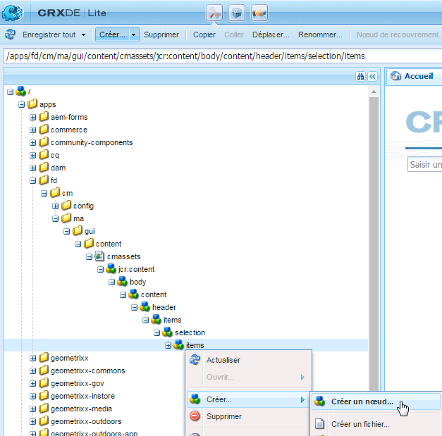
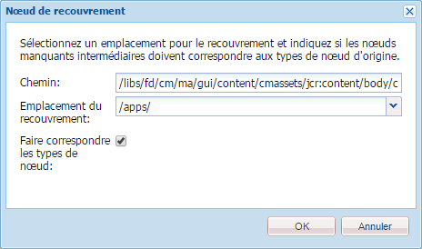
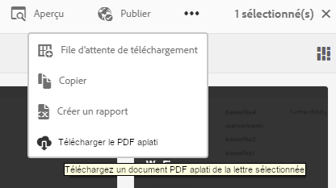

# Ajout d’une action personnalisée à la vue Liste des ressources{#add-custom-action-to-the-asset-listing-view}

## Présentation {#overview}

La solution Correspondence Management vous permet d’ajouter des actions personnalisées à l’interface utilisateur de gestion des actifs.

Vous pouvez ajouter une action personnalisée à la vue Liste des ressources pour :

* Un ou plusieurs types de ressources ou de lettres
* Exécution (l’action/la commande devient active) dans la sélection des ressources/des lettres simples et multiples ou en l’absence de sélection

Cette personnalisation est illustrée par un scénario qui ajoute une commande « Télécharger un PDF aplati » dans la vue Liste des ressources de lettres. Ce scénario de personnalisation permet à vos utilisateurs de télécharger un PDF aplati d’une seule lettre sélectionnée.

### Prérequis {#prerequisites}

Pour suivre le scénario ci-après ou un scénario similaire, vous devez disposer des connaissances suivantes :

* CRX 
* JavaScript
* Java

## Scénario : Ajoutez une commande à l’interface utilisateur des listes Lettres pour envoyer la version PDF aplatie d’une lettre {#addcommandtoletters}

Les étapes ci-dessous ajoutent une commande « Télécharger un PDF aplati » à la vue Liste des ressources de lettres et permettent à vos utilisateurs de télécharger le PDF aplati de la lettre sélectionnée. Le suivi de ces étapes à l’aide du code et des paramètres appropriés permet d’ajouter une autre fonctionnalité pour une ressource différente, telle que des dictionnaires de données ou des textes.

Pour personnaliser Correspondence Management et permettre aux utilisateurs de télécharger un fichier PDF aplati ou des lettres, suivez les étapes ci-après :

1. Accédez à `https://'[server]:[port]'/[ContextPath]/crx/de` et connectez-vous en tant qu’administrateur.

1. Dans le dossier d’applications, créez un dossier nommé éléments avec un chemin/une structure similaires au dossier d’éléments situé dans le dossier de sélection en procédant comme suit :

   1. Cliquez avec le bouton droit sur le dossier **items** à l’emplacement suivant et sélectionnez **Noeud de recouvrement** :

      `/libs/fd/cm/ma/gui/content/cmassets/jcr:content/body/content/header/items/selection/items`

      >[!NOTE]
      >
      >Ce chemin est spécifique à la création d’une action qui fonctionne avec la sélection d’une ou plusieurs ressources/lettres. Si vous souhaitez créer une action qui se déroule sans sélection, vous devez créer un nœud de recouvrement pour le chemin suivant et suivre les étapes restantes :
      >
      >
      >`/libs/fd/cm/ma/gui/content/cmassets/jcr:content/body/content/header/items/default/items`

      

   1. Assurez-vous que la boîte de dialogue du nœud de recouvrement possède les valeurs suivantes :

      **Chemin d’accès :** /libs/fd/cm/ma/gui/content/massets/jcr:content/body/content/header/items/selection/items

      **Emplacement :** /apps/

      **Faire correspondre les types de noeud :** Sélectionné

      

   1. Cliquez sur **OK**. La structure du dossier est créée dans le dossier des applications.

      Cliquez sur **Enregistrer tout**.

1. Dans le dossier d’éléments nouvellement créé, ajoutez un noeud pour le bouton/l’action personnalisé(e) d’une ressource particulière (par exemple : downloadFlatPDF) à l’aide des étapes suivantes :

   1. Cliquez avec le bouton droit sur le dossier **items** et sélectionnez **Créer** > **Créer un noeud**.

   1. Assurez-vous que la boîte de dialogue de création du nœud possède les valeurs suivantes et cliquez sur **OK** :

      **Nom :** downloadFlatPDF (ou le nom que vous souhaitez donner à cette propriété)

      **Type :** nt:unstructured

   1. Cliquez sur le nouveau nœud que vous avez créé (ici downloadFlatPDF). CRX affiche les propriétés du nœud.

   1. Ajoutez les propriétés suivantes au nœud (ici downloadFlatPDF) et cliquez sur **Enregistrer tout** :

      <table>
        <tbody>
        <tr>
        <td><strong>Nom</strong></td>
        <td><strong>Type</strong></td>
        <td><strong>Valeur et description</strong></td>
        </tr>
        <tr>
        <td>catégorie</td>
        <td>Chaîne</td>
        <td>foundation-collection-action</td>
        </tr>
        <tr>
        <td>foundation-collection-action</td>
        <td>Chaîne</td>
        <td><p>{"target": ".cq-manageasset-admin-childpages", "activeSelectionCount": "single","type": "LETTER"}<br /> <br /> <br /> <strong>activeSelectionCount</strong> peut être unique ou multiple pour permettre la sélection de ressources uniques ou multiples sur lesquelles l’action personnalisée est effectuée.</p> <p><strong></strong> peut être une ou plusieurs entrées (plusieurs entrées séparées par des virgules) des éléments suivants : LETTRE,TEXT,LIST,CONDITION,DATADICTIONARY</p> </td>
        </tr>
        <tr>
        <td>icône</td>
        <td>Chaîne</td>
        <td>icône-téléchargement<br /><br /> Icône affichée par Correspondence Management sur le côté gauche de la commande/du menu. Pour connaître les icônes et paramètres disponibles, voir la <a href="https://docs.adobe.com/docs/en/aem/6-3/develop/ref/coral-ui/coralui3/Coral.Icon.html" target="_blank">documentation relative aux icônes CoralUI</a>.<br /> </td>
        </tr>
        <tr>
        <td>jcr:primaryType</td>
        <td>Nom</td>
        <td>nt:unstructured</td>
        </tr>
        <tr>
        <td>rel</td>
        <td>Chaîne</td>
        <td>download-flat-pdf-button</td>
        </tr>
        <tr>
        <td>sling:resourceType</td>
        <td>Chaîne</td>
        <td>granite/ui/components/endor/actionbar/button</td>
        </tr>
        <tr>
        <td>text</td>
        <td>Chaîne</td>
        <td>Télécharger le PDF aplati (ou tout autre libellé)<br /> <br />Commande affichée dans l’interface de liste des ressources</td>
        </tr>
        <tr>
        <td>titre</td>
        <td>Chaîne</td>
        <td>Téléchargez un document PDF aplati de la lettre sélectionnée (ou de tout autre libellé/texte de remplacement)<br /><br />Le titre correspond au texte affiché par Correspondence Management lorsque l’utilisateur passe sa souris sur la commande personnalisée.</td>
        </tr>
        </tbody>
       </table>

1. Dans le dossier d’applications, créez un dossier nommé js avec un chemin/une structure similaires au dossier d’éléments situé dans le dossier admin en procédant comme suit :

   1. Cliquez avec le bouton droit sur le dossier **js** à l’emplacement suivant et sélectionnez **Noeud de recouvrement** :

      `/libs/fd/cm/ma/gui/components/admin/clientlibs/admin/js`

   1. Assurez-vous que la boîte de dialogue du nœud de recouvrement possède les valeurs suivantes :

      **Chemin d’accès :** /libs/fd/cm/ma/gui/components/admin/clientlibs/admin/js

      **Emplacement :** /apps/

      **Faire correspondre les types de noeud :** Sélectionné

   1. Cliquez sur **OK**. La structure du dossier est créée dans le dossier des applications. Cliquez sur **Enregistrer tout**.

1. Dans le dossier js, procédez comme suit pour créer un fichier nommé formaction.js avec le code de traitement d’action du bouton :

   1. Cliquez avec le bouton droit sur le dossier **js** à l’emplacement suivant et sélectionnez **Créer > Créer un fichier** :

      `/apps/fd/cm/ma/gui/components/admin/clientlibs/admin/js`

      Nommez le fichier formaction.js.

   1. Double-cliquez sur le fichier pour l’ouvrir dans CRX.
   1. Dans le fichier formaction.js (sous la branche /apps), copiez le code à partir du fichier formaction.js à l’emplacement suivant :

      `/libs/fd/cm/ma/gui/components/admin/clientlibs/admin/js/formaction.js`

      Ajoutez ensuite le code suivant à la fin du fichier formaction.js (sous la branche /apps) et cliquez sur **Enregistrer tout** :

      ```javascript
      /* Action url for xml file to be added.*/
      var ACTION_URL = "/apps/fd/cm/ma/gui/content/commons/actionhandlers/items/letterpdfdownloader.html";
      
      /* File upload handling*/
      var fileSelectedHandler = function(e){
          if(e && e.target && e.target.value)
              $(".downloadLetterPDFBtn").removeAttr('disabled');
          else
              $(".downloadLetterPDFBtn").attr('disabled','disabled');
      }
      
      /*Handing of Download button in pop up.*/
      var downloadClickHandler = function(){
          $('#downloadLetterPDFDilaog').modal("hide");
          var element = $('.foundation-selections-item');
          var path = $(element).data("path");
          $("#fileUploadForm").attr('action', ACTION_URL + "?letterId="+path).submit();
      }
      
      /*Click handling on action button.*/
      $(document).on("click",'.download-flat-pdf-button',function(e){
          $("#uploadSamepledata").val("");
           if($('#downloadLetterPDFDilaog').length == 0){
              $(document).on("click",".downloadLetterPDFBtn",downloadClickHandler);
              $(document).on("change","#uploadSamepledata",fileSelectedHandler);
              $("body").append(downloadLetterPDFDilaog);
          }
            $('#downloadLetterPDFDilaog').modal("show");
      });
      
      /*Download popup.*/
      var downloadLetterPDFDilaog = '<div id="downloadLetterPDFDilaog" class="coral-Modal notice " role="dialog"  aria-hidden="true">'+
          '<form id="fileUploadForm" method="POST" enctype="multipart/form-data">'+
              '<div class="coral-Modal-header">'+
                  '<h2 class="coral-Modal-title coral-Heading coral-Heading--2" id="modal-header1443020790107-label" tabindex="0">Download Letter as PDF.</h2>'+
                  '<button type="button" class="coral-MinimalButton coral-Modal-closeButton" data-dismiss="modal">×</button>'+
              '</div>'+
              '<div class="coral-Modal-body" id="modal-header1443020790107-message" role="document" tabindex="0">'+
                  '<div class="coral-Modal-message">'+
                      '<p></p>'+
                  '</div>'+
                  '<div class="coral-Modal-uploader">'+
                      '<p>Select sample data for letter.</p>'+
                      '<input type="file" id="uploadSamepledata" name="file" accept=".xml" size="70px">'+
                  '</div>'+
              '</div>'+
           '</form>'+
              '<div class="coral-Modal-footer">'+
                  '<button type="button" class="coral-Button" data-dismiss="modal">Cancel</button>'+
                  '<button type="button" class="coral-Button coral-Button--primary downloadLetterPDFBtn" disabled="disabled">Download</button>'+
              '</div>'+
      '</div>';
      ```

      Le code que vous ajoutez dans cette étape remplace le code dans le dossier libs. Vous devez donc copier le code précédent vers le fichier formaction.js dans la branche /apps. La copie du code de la branche /libs vers la branche /apps garantit que la fonctionnalité précédente marche également.

      Le code ci-dessus correspond au traitement des actions spécifiques aux lettres de la commande créée dans cette procédure. Pour le traitement des actions d’autres ressources, modifiez le code javascript.

1. Dans le dossier d’applications, créez un dossier nommé éléments avec un chemin/une structure similaires au dossier d’éléments situé dans le dossier actionhandlers. Pour cela, procédez comme suit :

   1. Cliquez avec le bouton droit sur le dossier **items** à l’emplacement suivant et sélectionnez **Noeud de recouvrement** :

      `/libs/fd/cm/ma/gui/content/commons/actionhandlers/items/`

   1. Assurez-vous que la boîte de dialogue du nœud de recouvrement possède les valeurs suivantes :

      **Chemin d’accès :** /libs/fd/cm/ma/gui/content/commons/actionhandlers/items/

      **Emplacement :** /apps/

      **Faire correspondre les types de noeud :** Sélectionné

   1. Cliquez sur **OK**. La structure du dossier est créée dans le dossier des applications.

   1. Cliquez sur **Enregistrer tout**.

1. Sous le noeud d’éléments que vous venez de créer, ajoutez un noeud pour le bouton/l’action personnalisé(e) d’une ressource particulière (par exemple : letterpdfdownloader) à l’aide des étapes suivantes :

   1. Cliquez avec le bouton droit sur le dossier éléments et sélectionnez **Créer > Créer un nœud**.

   1. Assurez-vous que la boîte de dialogue de création du nœud possède les valeurs suivantes et cliquez sur **OK** :

      **Nom :** letterpdfdownloader (ou le nom que vous souhaitez donner à cette propriété) doit être unique. Si vous utilisez un autre nom ici, indiquez-le également dans la variable ACTION_URL du fichier formaction.js.)

      **Type :** nt:unstructured

   1. Cliquez sur le nouveau nœud que vous avez créé (ici downloadFlatPDF). CRX affiche les propriétés du nœud.

   1. Ajoutez la propriété suivante au nœud (ici letterpdfdownloader) et cliquez sur **Enregistrer tout** :

      | **Nom** | **Type** | **Valeur** |
      |---|---|---|
      | sling:resourceType | Chaîne | fd/cm/ma/gui/components/admin/clientlibs/admin |

1. Créez un fichier nommé POST.jsp avec le code de gestion de l’action de la commande à l’emplacement suivant :

   /apps/fd/cm/ma/gui/components/admin/clientlibs/admin

   1. Cliquez avec le bouton droit sur le dossier **admin** à l’emplacement suivant et sélectionnez **Créer > Créer un fichier** :

      /apps/fd/cm/ma/gui/components/admin/clientlibs/admin

      Nommez le fichier POST.jsp. (Le nom du fichier doit être POST.jsp uniquement.)

   1. Double-cliquez sur le fichier **POST.jsp** pour l’ouvrir dans CRX.
   1. Ajoutez le code suivant au fichier POST.jsp et cliquez sur **Enregistrer tout** :

      Ce code est spécifique au service de rendu de la lettre. Pour toute autre ressource, ajoutez les bibliothèques Java de la ressource à ce code. Pour plus d’informations sur les API AEM Forms, voir [API AEM Forms](https://adobe.com/go/learn_aemforms_javadocs_63_en).

      Pour plus d’informations sur les bibliothèques AEM, voir AEM [Composants](/help/sites-developing/components.md).

      ```xml
      /*Import libraries. Here we are downloading letter flat pdf with input xml data so we require letterRender Api. For any other Module functionality we need to first import that library. */
      <%@include file="/libs/foundation/global.jsp"%>
      <!DOCTYPE html lang="en" PUBLIC "-//W3C//DTD XHTML 1.1//EN" "https://www.w3.org/TR/xhtml11/DTD/xhtml11.dtd">
      <%@page import="com.adobe.icc.ddg.api.*"%>
      <%@page import="com.adobe.icc.dbforms.obj.*"%>
      <%@page import="com.adobe.icc.render.obj.*" %>
      <%@page import="com.adobe.icc.services.api.*" %>
      <%@page import="org.apache.sling.api.resource.*" %>
      <%@page import="java.io.File" %>
      <%@page import="java.util.*" %>
      <%@page import="com.adobe.livecycle.content.appcontext.AppContextManager"%>
      <%@page import=" com.adobe.icc.dbforms.exceptions.ICCException"%>
      <%@page import="java.io.InputStream" %>
      <%@page import="java.io.FileInputStream" %>
      <%@page import="org.apache.commons.io.IOUtils" %>
      <%@page session="false" contentType="text/html; charset=utf-8"%>
      <%@taglib prefix="sling" uri="https://sling.apache.org/taglibs/sling/1.0"%>
      <%@taglib prefix="cq" uri="https://www.day.com/taglibs/cq/1.0" %>
       <%@page session="false" contentType="text/html; charset=utf-8"%>
      <%
         AppContextManager.setCurrentAppContext("/content/apps/cm");
         /*Get letter id sent in js file.*/
          String letterId = request.getParameter("letterId");
          if(letterId.lastIndexOf("?") != -1)
              letterId = letterId.substring(0, letterId.indexOf("?"));
          String fileName = null;
          String letterName = null;
          InputStream inputStream = null;
          /*Get xml file data*/
          if (slingRequest.getRequestParameter("file") != null)
              inputStream = slingRequest.getRequestParameter("file").getInputStream();
          if(letterId != null){
              String xmlData = null;
              try{
                  xmlData = IOUtils.toString(inputStream, "UTF-8");
              }
              catch (Exception e) {
                  log.error("Xml data does not exists.");
              }
              /*letter Name from letter letter id.*/
              letterName = letterId.substring(letterId.lastIndexOf("/")+1);
              /*Invoking letter render services API.*/
              LetterRenderService letterRenderService = sling.getService(LetterRenderService.class);
              /*using CM renderLetter api to get pdfbytes.*/
              PDFResponseType  pdfResponseType= letterRenderService.renderLetter(letterId,xmlData,true,false,false,false);
              byte[] bytes = null;
              /*Downloading pdf bytes as pdf.*/
              if(pdfResponseType != null && pdfResponseType.getFile() != null){
                  bytes = pdfResponseType.getFile().getDocument();
                  /*set the response header to enable download*/
                  response.setContentType("application/OCTET-STREAM");
                  response.setHeader("Content-Disposition", "attachment;filename=\"" + letterName + ".pdf\"");
                  response.setHeader("Pragma", "cache");
                  response.setHeader("Cache-Control", "private");
                  out.clear();
                  response.getOutputStream().write(bytes);
              }
          }
          else{
              log.error("Letter id does not exists.");
          }
      %>
      ```

## Télécharger le PDF aplati à partir d’une lettre à l’aide de la fonction personnalisée {#download-flat-pdf-of-a-letter-using-the-custom-functionality}

Après avoir ajouté une fonctionnalité personnalisée pour télécharger le PDF aplati de vos lettres, vous pouvez suivre les étapes suivantes pour télécharger la version PDF aplatie de la lettre que vous sélectionnez :

1. Accédez à `https://'[server]:[port]'/[ContextPath]/projects.html` et connectez-vous.

1. Sélectionnez **Formulaires > Lettres**. Correspondence Management répertorie les lettres disponibles dans le système.
1. Cliquez sur **Sélectionner**, puis cliquez sur une lettre pour la sélectionner.
1. Sélectionnez **Plus** **&lt;Télécharger un PDF aplati>** (la fonctionnalité personnalisée créée à l’aide des instructions de cet article). La boîte de dialogue Télécharger la lettre en tant que PDF s’affiche.

   Le nom, la fonctionnalité et le texte secondaire de l’élément de menu dépendent de la personnalisation créée dans [Scénario : Ajoutez une commande à l’interface utilisateur de la liste Lettres pour télécharger la version PDF aplatie d’une lettre.](#addcommandtoletters)

   

1. Dans la boîte de dialogue Télécharger la lettre en tant que PDF, sélectionnez le fichier XML approprié à partir duquel vous souhaitez renseigner les données dans le PDF.

   >[!NOTE]
   >
   >Avant de télécharger la lettre au format PDF aplati, vous pouvez créer le fichier XML avec les données de la lettre à l’aide de l’option **Créer un rapport**.

   

   La lettre est téléchargée sur votre ordinateur au format PDF aplati.
