# Ajout de propriétés personnalisées aux actifs Correspondence Management{#add-custom-properties-to-correspondence-management-assets}

## Présentation {#overview}

Vous pouvez personnaliser l’interface utilisateur de Correspondence Management et présenter aux utilisateurs un jeu personnalisé de propriétés et d’onglets. Cette personnalisation comprend l’ajout de champs/propriétés et d’onglets personnalisés à des types/lettres de ressource spécifiques ou à tous les types et lettres de ressource.

## Ajout de propriétés personnalisées aux ressources Correspondence Management {#adding-custom-properties-to-correspondence-management-assets}

Les scénarios suivants indiquent comment vous pouvez ajouter des propriétés/onglets aux ressources et aux lettres Correspondence Management :

* Ajout d’une propriété commune à tous les types de ressources
* Ajout d’un onglet commun à tous les types de ressources
* Ajout de propriétés personnalisées à des types de ressources spécifiques

En ajustant les propriétés, chemins et valeurs de ces scénarios, vous pouvez ajouter des propriétés et des onglets personnalisés à un jeu différent de ressources selon vos besoins.

### Scénario : ajout d’un champ commun (propriété) à tous les types de ressources {#scenario-adding-a-common-field-property-to-all-the-asset-types}

Ce scénario vous indique comment ajouter une propriété personnalisée à tous les types de ressources (texte, liste, condition et fragments de disposition) et aux lettres. Ce scénario vous permet d’ajouter une propriété, Emplacement des, à tous les actifs et lettres. L’emplacement de la propriété permet d’identifier la zone géographique de l’ à laquelle un actif ou une lettre est pertinent.

>[!NOTE]
>
>Si vous avez déjà ajouté une propriété personnalisée, la propriété commence à apparaître sur la page de création de la ressource. Pour masquer une telle propriété, voir Afficher/masquer les propriétés personnalisées sur les pages Création de ressources et Propriétés.

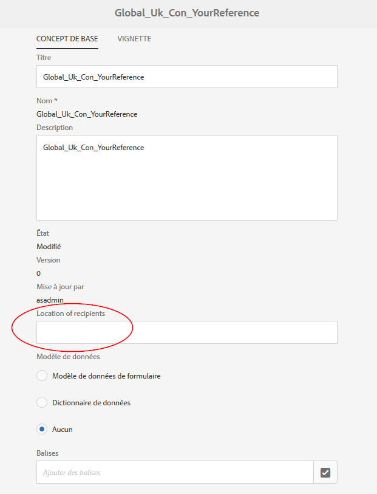

procédez comme suit pour ajouter une propriété personnalisée à tous les types de ressources et lettres :

1. Go to `https://'[server]:[port]'/[ContextPath]/crx/de` and login as Administrator.
1. Dans le dossier d’applications, créez un dossier nommé css avec un chemin/une structure similaires au dossier css (situé dans le dossier ccrui) à l’aide des étapes suivantes :

   1. Right-click the items folder at the following path and select **Overlay Node**:

      `/libs/fd/cm/ma/gui/content/cmmetadataproperties/commonproperties/col1/items`

      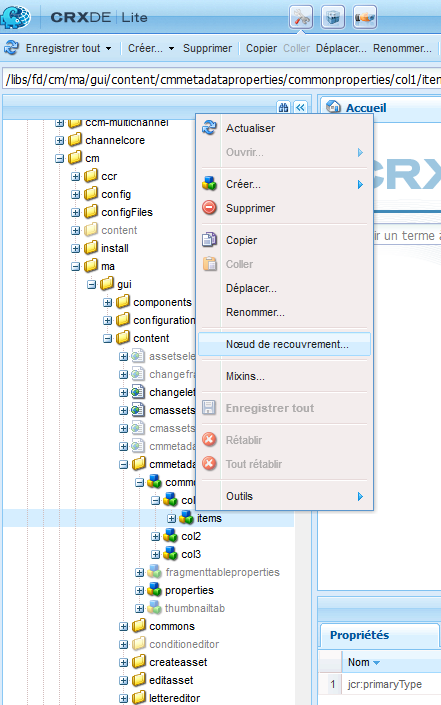

   1. Assurez-vous que la boîte de dialogue du nœud de recouvrement possède les valeurs suivantes :

      **Chemin :** /libs/fd/cm/ma/gui/content/cmmetadataproperties/commonproperties/col1/items

      **Emplacement :** /apps/

      **Faire correspondre les types de noeud :** Sélectionné

      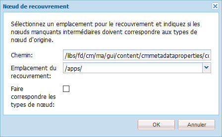

   1. Cliquez sur **OK**. La structure du dossier est créée dans le dossier des applications.

   1. Cliquez sur **Enregistrer tout**.

1. Dans le dossier des éléments nouvellement créés, ajoutez un noeud pour la propriété personnalisée dans tous les fichiers (Exemple : GeoLocation) à l’aide des étapes suivantes :

   1. Cliquez avec le bouton droit sur le dossier éléments et sélectionnez **Créer** > **Créer un nœud**.

      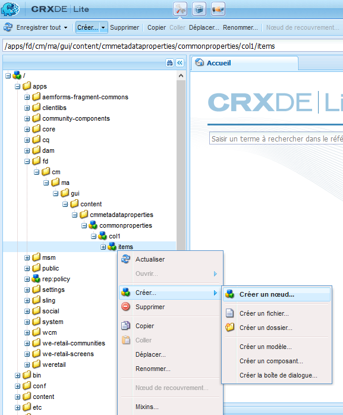

   1. Assurez-vous que la boîte de dialogue de création du nœud possède les valeurs suivantes et cliquez sur **OK** :

      **Nom :** GeoLocation (ou le nom que vous souhaitez donner à cette propriété)

      **Type :** nt:unstructured

      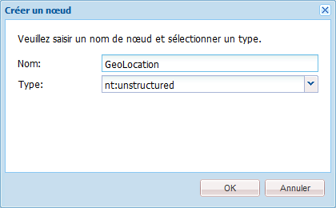

   1. Cliquez sur le nouveau nœud que vous avez créé (ici Geolocation). CRX affiche les propriétés du nœud.
   1. Ajoutez les propriétés suivantes au nœud (ici Geolocation) :

      | **Nom** | **Type** | **Valeur** |
      |---|---|---|
      | fieldLabel | Chaîne | Le nom que vous souhaitez donner à ce champ/cette propriété. (Ici : Emplacement des destinataires) |
      | nom est | Chaîne | `./extendedproperties/GeoLocation` (Conservez la même valeur que le nom du champ que vous avez créé sous le noeud d’éléments). |
      | renderReadOnly | Booléen | true |
      | sling:resourceType | Chaîne | `granite/ui/components/coral/foundation/form/textfield` |

   1. Cliquez sur **Enregistrer tout**.

1. Pour afficher votre personnalisation, placez le pointeur de la souris sur une ressource (texte, liste, condition ou fragment de disposition) ou une lettre, cliquez sur **Afficher les propriétés** puis cliquez sur **Modifier**. Le nouveau champ (Emplacement des destinataires) apparaît dans l’onglet De base dans les propriétés de la ressource/de la lettre.

   >[!NOTE]
   >
   >Vous devrez peut-être vider la mémoire cache du navigateur avant que la personnalisation ne s’affiche dans l’interface utilisateur.

   

   >[!NOTE]
   >
   >Les propriétés communes à toutes les ressources que vous ajoutez s’affichent dans l’onglet de base des propriétés des ressources. Par défaut, les propriétés communes ajoutées à toutes les ressources sont répertoriés sur la page de propriétés ainsi que sur la page de création de ressources. Pour masquer les propriétés communes, vous devez <!--link to show / hide properties]-->.

### Scénario : ajout d’une liste déroulante et de valeurs personnalisées à une propriété/un champ personnalisé(e){#scenario-add-custom-drop-down-and-values-to-a-custom-property-field}

Ce scénario vous indique comment ajouter une propriété personnalisée à tous les types de ressources et y ajouter des valeurs de liste déroulante.

1. Right-click the items folder at the following path and select **Overlay Node**:

   `/libs/fd/cm/ma/gui/content/cmmetadataproperties/commonproperties/col1/items`

1. Under the newly created overlay node (/apps/fd/cm/ma/gui/content/cmmetadataproperties/commonproperties/col1/items)
Create a node for each of the properties (fields) for which you need to create a drop-down (here `geographicallocation`) of the type nt:unstructured.
1. Ajoutez les propriétés suivantes au nœud (ici geographicallocation) et cliquez sur **Enregistrer tout** :

   <table>
   <tbody>
   <tr>
      <td><strong>Nom</strong></td>
      <td><strong>Type</strong></td>
      <td><strong>Valeur</strong></td>
   </tr>
   <tr>
      <td>fieldLabel</td>
      <td>Chaîne</td>
      <td>Le nom que vous souhaitez donner à ce champ/cette propriété. (Ici : geographicallocation)</td>
   </tr>
   <tr>
      <td>nom est</td>
      <td>Chaîne</td>
      <td>./extendedproperties/geographic allocation (conservez la valeur du nom de champ que vous avez créé sous le noeud items)</td>
   </tr>
   <tr>
      <td>renderReadOnly</td>
      <td>Booléen</td>
      <td>true</td>
   </tr>
   <tr>
      <td>sling:resourceType</td>
      <td>Chaîne</td>
      <td>granite/ui/components/coral/foundation/form/select<br /> </td>
   </tr>
   </tbody>
   </table>

1. Under property node (here geographicallocation), add a new node with name `items`. Sous le nœud d’éléments, ajoutez un nœud à chacune des valeurs de la liste déroulante. Comme bonne pratique, ajoutez un premier nœud vide pour qu’il serve de valeur par défaut à la liste déroulante et une option destinée à l’utilisateur pour qu’il spécifie Aucune valeur pour le champ. Pour ajouter plusieurs options/valeurs de liste déroulante, répétez les étapes suivantes :

   1. Cliquez avec le bouton droit sur le nœud de propriété (ici geographicallocation) et sélectionnez **Créer** > **Créer un nœud**.
   1. Enter name of the field as `item1,` retain type as nt:unstructured, and click **OK**.
   1. Add the following properties to the newly created node (here item1) and then click **Save All**:

      <table>
         <tbody>
         <tr>
          <td><strong>Nom</strong></td>
          <td><strong>Type</strong></td>
          <td><strong>Valeur</strong></td>
         </tr>
         <tr>
          <td>text</td>
          <td>Chaîne</td>
          <td>Il s’agit de la valeur de l’option déroulante qui est visible pour l’utilisateur. Laissez-la non renseignée pour la valeur zéro (par défaut) ou entrez la valeur, par exemple <strong>International</strong> ou <strong>Aux États-Unis</strong>.<br />  </td>
         </tr>
         <tr>
          <td>value</td>
          <td>Chaîne</td>
          <td>Valeur stockée dans CRXDE pour le texte. Saisissez un mot-clé unique. <br /> </td>
         </tr>
         </tbody>
   </table>

   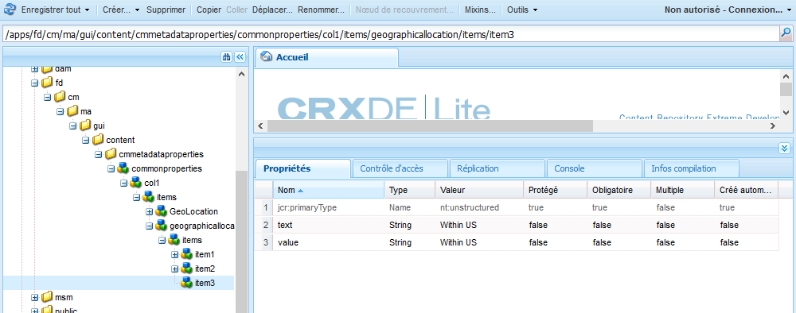

Une liste déroulante personnalisée s’affiche comme suit dans les propriétés des ressources :

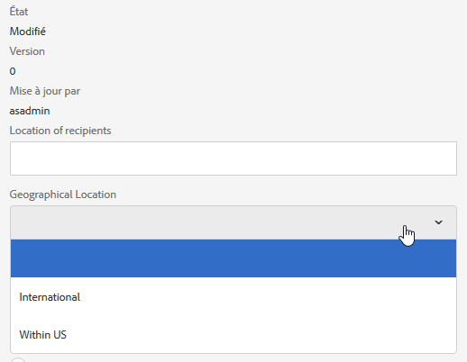

### Scénario : onglet commun à tous les types de ressources {#scenario-common-tab-for-all-asset-types}

Ce scénario vous indique comment ajouter un onglet personnalisé ou des destinataires à tous les types de ressources (texte, liste, condition et fragments de disposition) et aux lettres. L’onglet Destinataires vous permet de placer toutes vos propriétés personnalisées relatives aux destinataires.


Grâce à la procédure suivante, vous pouvez ajouter un onglet avec un champ à toutes vos ressources :

1. Go to `https://'[server]:[port]'/[ContextPath]/crx/de` and login as Administrator.
1. Dans le dossier d’applications, créez un dossier nommé cmmetadataproperties avec un chemin/une structure similaire au dossier cmmetadataproperties (situé dans le dossier de contenu) à l’aide des étapes suivantes :

   1. Right-click the cmmetadataproperties folder at the following path and select **Overlay Node**:

      `/libs/fd/cm/ma/gui/content/cmmetadataproperties`

      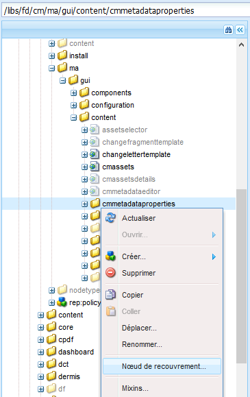

   1. Assurez-vous que la boîte de dialogue du nœud de recouvrement possède les valeurs suivantes :

      **Chemin :** /libs/fd/cm/ma/gui/content/cmmetadataproperties

      **Emplacement :** /apps/

      **Faire correspondre les types de noeud :** Sélectionné

   1. Cliquez sur **OK**. La structure du dossier est créée dans le dossier des applications.

      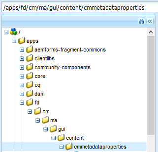

      Cliquez sur **Enregistrer tout**.

1. Dans le dossier cmmetadataproperties, ajoutez un noeud pour créer un onglet personnalisé pour tous les fichiers (Exemple : commontab) à l’aide des étapes suivantes :

   1. Cliquez avec le bouton droit sur le dossier éléments et sélectionnez **Créer** > **Créer un nœud**.

      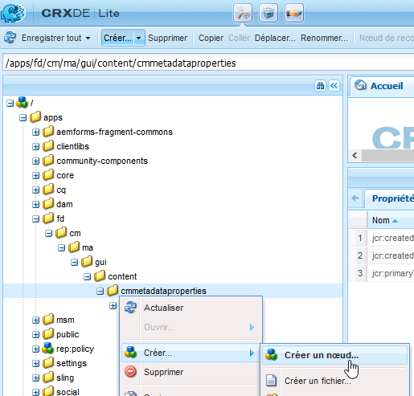

   1. Assurez-vous que la boîte de dialogue de création du nœud possède les valeurs suivantes et cliquez sur **OK** :

      **Nom :** commontab (ou le nom que vous souhaitez donner à cette propriété)

      **Type :** nt:unstructured

   1. Cliquez sur le nouveau nœud que vous avez créé (ici commontab). CRX affiche les propriétés du nœud.
   1. Ajoutez les propriétés suivantes au nœud (ici commontab) :

      <table>
         <tbody>
         <tr>
          <td><strong>Nom</strong></td>
          <td><strong>Type</strong></td>
          <td><strong>Valeur</strong></td>
         </tr>
         <tr>
          <td>jcr:title</td>
          <td>Chaîne</td>
          <td>Le nom que vous souhaitez donner à la colonne. (Ici : Destinataires)</td>
         </tr>
         <tr>
          <td>sling:resourceType</td>
          <td>Chaîne</td>
          <td>granite/ui/components/coral/foundation/container<br /> </td>
   </tr>
         </tbody>
       </table>

   1. Cliquez sur **Enregistrer tout**.

1. Pour le nœud onglet créé à la dernière étape (ici commontab), créez un nœud appelé item à l’aide des étapes suivantes :

   1. Cliquez avec le bouton droit sur le nœud approprié (ici commontab) et sélectionnez **Créer** > **Créer un nœud**.
   1. Assurez-vous que la boîte de dialogue de création du nœud possède les valeurs suivantes et cliquez sur **OK** :

      **Nom :** items

      **Type :** nt:unstructured

   1. Cliquez sur **Enregistrer tout:**

1. Dans le noeud d’éléments que vous avez créé à l’étape précédente (sous l’onglet commontab), ajoutez un noeud pour la création d’une colonne (ici Colonne1) dans l’onglet personnalisé (onglet commontab) à l’aide des étapes suivantes (pour ajouter d’autres colonnes, répétez cette étape) :

   1. Cliquez avec le bouton droit sur le nœud éléments et sélectionnez **Créer** > **Créer un nœud**.
   1. Assurez-vous que la boîte de dialogue de création du nœud possède les valeurs suivantes et cliquez sur **OK** :

      **Nom :** Colonne1 (ou le nom que vous souhaitez donner au noeud - ce nom n’apparaît pas dans l’interface utilisateur.)

      **Type :** nt:unstructured

   1. Add the following property to the node (Here Column1) and then click **Save All**:

      <table>
         <tbody>
         <tr>
           <td><strong>Nom</strong></td>
           <td><strong>Type</strong></td>
           <td><strong>Valeur</strong></td>
         </tr>
         <tr>
           <td>sling:resourceType</td>
           <td>Chaîne</td>
           <td>granite/ui/components/coral/foundation/container<br /> </td>
         </tr>
         </tbody>
       </table>

1. Dans le noeud que vous avez créé à l’étape précédente (ici Colonne1), ajoutez un noeud appelé éléments à l’aide des étapes suivantes :

   1. Cliquez avec le bouton droit sur le nœud (ici Column1) et sélectionnez **Créer** > **Créer un nœud**.
   1. Assurez-vous que la boîte de dialogue de création du nœud possède les valeurs suivantes et cliquez sur **OK** :

      **Nom :** items

      **Type :** nt:unstructured

   1. Cliquez sur **Enregistrer tout**.

1. Pour créer un champ dans l’onglet personnalisé (ici Destinataires), ajoutez un nœud (ici GeographicalLocation). Cette propriété correspond à la colonne que vous avez créée. Procédez comme suit pour créer le champ (pour créer plus de champs/nœuds, répétez ces étapes.) :

   1. Cliquez avec le bouton droit sur le nœud éléments et sélectionnez **Créer** > **Créer un nœud**.
   1. Assurez-vous que la boîte de dialogue de création du nœud possède les valeurs suivantes et cliquez sur **OK** :

      **Nom :** GeographicalLocation (ou un nom différent pour la propriété de champ)

      **Type :** nt:unstructured

   1. Ajoutez les propriétés suivantes au nœud de champ (ici GeographicalLocation) et cliquez sur **Enregistrer tout** :

      | **Nom** | **Type** | **Valeur** |
      |---|---|---|
      | fieldLabel | Chaîne | Emplacement des destinataires (ou le nom que vous souhaitez donner à la colonne.) |
      | nom est | Chaîne | ./extendedproperties/GeographicalLocation |
      | renderReadOnly | Booléen | true |
      | sling:resourceType | Chaîne | `/libs/granite/ui/components/coral/foundation/form/textfield` |

1. Pour ajouter cet onglet pour les lettres, créez un dossier de recouvrement avec un chemin/une structure similaire au dossier des éléments suivants du chemin ci-après :

   `/libs/fd/cm/ma/gui/content/cmmetadataproperties/properties/letter/items/tabs/items`

   To create overlay for a letters or a different asset use the following path by replacing [assettype] with text, condition, list, datadictionary, or fragment:

   `/libs/fd/cm/ma/gui/content/cmmetadataproperties/properties/[assettype]/items/tabs/items`

   1. Right-click the items folder at the following path and select **Overlay Node**:

      `/libs/fd/cm/ma/gui/content/cmmetadataproperties/properties/letter/items/tabs/items`

   1. Assurez-vous que la boîte de dialogue du nœud de recouvrement possède les valeurs suivantes :

      **Chemin:** `/libs/fd/cm/ma/gui/content/cmmetadataproperties/properties/letter/items/tabs/items`

      **Emplacement :** /apps/

      **Faire correspondre les types de noeud :** Sélectionné

   1. Cliquez sur **OK**. Le dossier est créé. Cliquez sur **Enregistrer tout**.

1. Dans le dossier des éléments nouvellement créés, ajoutez un noeud pour l’onglet personnalisé dans le fichier (ici, mytab - ce nom ne s’affiche pas dans l’interface utilisateur) en procédant comme suit :

   1. Cliquez avec le bouton droit sur le dossier éléments et sélectionnez **Créer** > **Créer un nœud**.
   1. Assurez-vous que la boîte de dialogue de création du nœud possède les valeurs suivantes et cliquez sur **OK** :

      **Nom :** mytab (ou le nom que vous souhaitez donner à cette propriété)

      **Type :** nt:unstructured

   1. Cliquez sur le nouveau nœud que vous avez créé (ici mytab). CRX affiche les propriétés du nœud.
   1. Ajoutez les deux propriétés suivantes au nœud (ici commontab) :

      <table>
         <tbody>
         <tr>
           <td><strong>Nom</strong></td>
           <td><strong>Type</strong></td>
           <td><strong>Valeur</strong></td>
         </tr>
         <tr>
           <td>path<br /> </td>
           <td>Chaîne</td>
           <td>fd/cm/ma/gui/content/cmmetadataproperties/commontab<br /> </td>
         </tr>
         <tr>
           <td>sling:resourceType</td>
           <td>Chaîne</td>
           <td>granite/ui/components/coral/foundation/include<br /> </td>
         </tr>
         </tbody>
       </table>

   1. Cliquez sur **Enregistrer tout**.

1. Pour afficher votre personnalisation, placez le pointeur de la souris sur la ressource pertinente (ici une lettre), cliquez sur Afficher les propriétés puis cliquez sur **Modifier**. Le nouvel onglet (Destinataires) et le champ (Emplacement des destinataires) s’affichent dans l’interface utilisateur.

   >[!NOTE]
   >
   >Vous devrez peut-être vider la mémoire cache du navigateur avant que la personnalisation ne s’affiche dans l’interface utilisateur.

   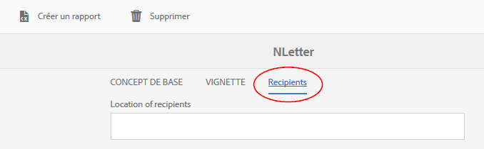

### Scénario : ajout de propriétés personnalisées à des types de ressources spécifiques {#scenario-adding-custom-properties-for-specific-asset-types}

Ce scénario vous indique comment ajouter une propriété personnalisée à un type de ressource spécifique tel qu’un champ à toutes les ressources de texte. Grâce à ce processus, vous pouvez ajouter des propriétés à l’un des éléments suivants :

* Texte
* Condition
* Liste
* Fragment de disposition
* Dictionnaire de données
* Lettre

Par exemple, pour les ressources de texte uniquement, vous souhaitez ajouter une propriété, Emplacement des, afin d’identifier la zone géographique à laquelle un fichier est pertinent.  

Procédez comme suit pour ajouter une propriété à un type de ressource :

1. Go to `https://'[server]:[port]'/[ContextPath]/crx/de` and login as Administrator.
1. Pour créer un onglet dans un type de fichier (tel que Texte), créez la structure de dossiers suivante dans le dossier des applications :

   `/libs/fd/cm/ma/gui/content/cmmetadataproperties/properties/[AssetType]/items/tabs/items`

   [AssetType] = texte, condition, , lettre, dictionnaire de données ou fragment

   Vous trouverez ci-dessous les étapes à suivre pour créer la structure de dossiers :

   1. Right-click the items folder at the following path and select **Overlay Node**:

      `/libs/fd/cm/ma/gui/content/cmmetadataproperties/properties/[AssetType]/items/tabs/items`

      Par exemple, si vous souhaitez créer une propriété pour des ressources de texte, sélectionnez le dossier suivant :

      `/libs/fd/cm/ma/gui/content/cmmetadataproperties/properties/text/items/tabs/items`

      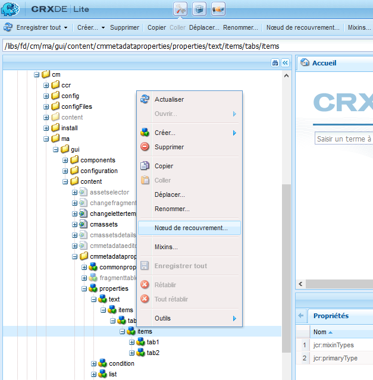

   1. Assurez-vous que la boîte de dialogue du nœud de recouvrement possède les valeurs suivantes :

      **Chemin :** /libs/fd/cm/ma/gui/content/cmmetadataproperties/properties/[AssetType]/items/tabs/items

      **Emplacement :** /apps/

      **Faire correspondre les types de noeud :** Sélectionné

   1. Cliquez sur **OK**. La structure du dossier est créée dans le dossier des applications.

      Cliquez sur **Enregistrer tout**.

1. Dans le dossier des éléments nouvellement créés, ajoutez un noeud pour l’onglet personnalisé dans le fichier (Exemple : customtab) à l’aide des étapes suivantes :

   1. Cliquez avec le bouton droit sur le dossier éléments et sélectionnez **Créer** > **Créer un nœud**.
   1. Assurez-vous que la boîte de dialogue de création du nœud possède les valeurs suivantes et cliquez sur **OK** :

      **Nom :** customtab (ou le nom que vous souhaitez donner à cette propriété)

      **Type :** nt:unstructured

   1. Cliquez sur le nouveau nœud que vous avez créé (ici customtab). CRX affiche les propriétés du nœud.
   1. Ajoutez les deux propriétés suivantes au nœud (ici commontab) :

      | **Nom** | **Type** | **Valeur** |
      |---|---|---|
      | sling:resourceType | Chaîne | granite/ui/components/coral/foundation/container |
      | jcr:title | Chaîne | Le nom du champ dans l’interface utilisateur (ici Mon onglet) |

   1. Cliquez sur **Enregistrer tout**.

1. Dans le noeud que vous avez créé à l’étape précédente (cet onglet personnalisé), ajoutez un noeud appelé éléments à l’aide des étapes suivantes :

   1. Cliquez avec le bouton droit sur le nœud (ici customtab) et sélectionnez **Créer** > **Créer un nœud**.
   1. Assurez-vous que la boîte de dialogue de création du nœud possède les valeurs suivantes et cliquez sur **OK** :

      **Nom :** items

      **Type :** nt:unstructured

   1. Cliquez sur **Enregistrer tout**.

1. Dans le noeud d’éléments que vous avez créé à l’étape précédente (sous customtab), ajoutez un noeud pour la création d’une colonne (ici Colonne1) dans l’onglet personnalisé à l’aide des étapes suivantes (pour ajouter d’autres colonnes, répétez cette étape) :

   1. Cliquez avec le bouton droit sur le nœud éléments et sélectionnez **Créer** > **Créer un nœud**.
   1. Assurez-vous que la boîte de dialogue de création du nœud possède les valeurs suivantes et cliquez sur **OK** :

      **Nom :** Colonne1 (ou le nom que vous souhaitez donner au noeud)

      **Type :** nt:unstructured

   1. Add the following property to the node (Here Column1) and then click **Save All**.

      <table>
         <tbody>
         <tr>
           <td><strong>Nom</strong></td>
           <td><strong>Type</strong></td>
           <td><strong>Valeur</strong></td>
         </tr>
         <tr>
           <td>sling:resourceType</td>
           <td>Chaîne</td>
           <td>granite/ui/components/coral/foundation/container<br /> </td>
         </tr>
         </tbody>
       </table>

1. Pour chaque colonne que vous créez (comme indiqué à l’étape précédente - ici Colonne1), créez un noeud appelé élément à l’aide des étapes suivantes :

   1. Cliquez avec le bouton droit sur la colonne (ici Column1) et sélectionnez **Créer** > **Créer un nœud**.
   1. Assurez-vous que la boîte de dialogue de création du nœud possède les valeurs suivantes et cliquez sur **OK** :

      **Nom :** items

      **Type :** nt:unstructured

   1. Cliquez sur **Enregistrer tout:**

1. Pour chacune des colonnes créées, créez un nœud sous le nœud items afin de créer un champ dans un nouvel onglet de l’interface utilisateur. Répétez cette étape pour créer d’autres champs dans la colonne :

   1. Cliquez avec le bouton droit sur le nœud approprié (ici Column1) et sélectionnez **Créer** > **Créer un nœud**.
   1. Assurez-vous que la boîte de dialogue de création du nœud possède les valeurs suivantes et cliquez sur **OK** :

      **Nom :** Nom de votre choix (ici GeoLocation)

      **Type :** nt:unstructured

   1. Ajoutez les propriétés suivantes au nœud et cliquez sur **Enregistrer tout**.

      | **Nom** | **Type** | **Valeur** |
      |---|---|---|
      | fieldLabel | Chaîne | Emplacement des destinataires (ou le nom que vous souhaitez donner à la colonne.) |
      | nom est | Chaîne | `./extendedproperties/GeoLocation` |
      | renderReadOnly | Booléen | true |
      | sling:resourceType | Chaîne | granite/ui/components/coral/foundation/form/textfield |

1. Pour afficher votre personnalisation, placez le pointeur de la souris sur la ressource pertinente (ici un texte), cliquez sur Afficher les propriétés puis cliquez sur **Modifier**. Le nouvel onglet et champ (Emplacement des destinataires) s’affichent dans l’interface utilisateur.

   >[!NOTE]
   >
   >Vous devrez peut-être vider la mémoire cache du navigateur avant que la personnalisation ne s’affiche dans l’interface utilisateur.

   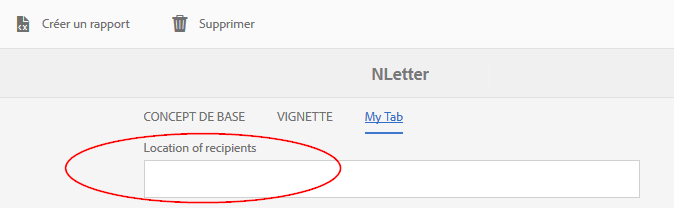

### Affichage des propriétés personnalisées sur la page de création des ressources {#display-custom-properties-on-the-asset-creation-page}

Par défaut, les propriétés personnalisées ajoutées aux nouveaux onglets sont visibles uniquement sur la page des propriétés et non sur la page de création de ressources, car la page de création de ressources ne comporte pas de mise en page de tabulation. Pour afficher les propriétés personnalisées sur la page de création des ressources avec d’autres propriétés, vous devez effectuer les opérations suivantes :

1. Right-click the items folder at the following path and select **Overlay Node**:

   `/libs/fd/cm/ma/gui/content/createasset/createletter/jcr:content/body/items/form/items/letterWizard/items/properties/items/properties/items/letterproperties/items`

1. Assurez-vous que la boîte de dialogue du nœud de recouvrement possède les valeurs suivantes pour une lettre. Pour les autres types de ressources, le chemin est indiqué dans le tableau suivant :

   **Chemin :** /libs/fd/cm/ma/gui/content/createasset/createletter/jcr:content/body/items/form/letterWizard/items/properties/items/properties/items/letterproperties/items/letterproperties/items

   **Emplacement :** /apps/

   **Faire correspondre les types de noeud :** Sélectionné

   Selon le type de propriété, le chemin suivant doit être utilisé :

   | **Asset/document type** | **Chemin à ajouter** |
   |---|---|
   | Texte | /libs/fd/cm/ma/gui/content/createasset/createtext/jcr:content/body/items/form/items/textwizard/items/editproperties/items/properties/items/tabs/items/tab1/items |
   | Liste | /libs/fd/cm/ma/gui/content/createasset/createlist/jcr:content/body/items/form/items/listwizard/items/editproperties/items/properties/items/tabs/items/tab1/items |
   | Condition | /libs/fd/cm/ma/gui/content/createasset/createcondition/jcr:content/body/items/form/items/conditionwizard/items/editproperties/items/properties/items/tabs/items/tab1/items |
   | Fragment | /libs/fd/cm/ma/gui/content/createasset/createfragment/jcr:content/body/items/form/items/fragmentwizard/items/properties/items/properties/items/tabs2/items/tab1/items |
   | Lettre | /libs/fd/cm/ma/gui/content/createasset/createletter/jcr:content/body/items/form/items/letterWizard/items/properties/items/properties/items/letterproperties/items |

1. Cliquez sur **OK**. La structure du dossier est créée dans le dossier des applications.

1. Under the overlay items node you created, create a node of the name col4 (or any other name) and click **Save All**.

   Par exemple, le nœud suivant est le nœud de recouvrement créé pour les lettres.

   `/apps/fd/cm/ma/gui/content/createasset/createletter/jcr:content/body/items/form/items/letterWizard/items/properties/items/properties/items/letterproperties/items`

1. Ajoutez les propriétés suivantes au nœud que vous venez de créer (ici col4) et cliquez sur **Enregistrer tout** :

<table>
 <tbody>
  <tr>
   <td><strong>Nom</strong></td>
   <td><strong>Type</strong></td>
   <td><strong>Valeur</strong></td>
  </tr>
  <tr>
   <td>path</td>
   <td>Chaîne</td>
   <td><p>Ce chemin pointe vers la colonne créée dans :</p>
    <ul>
     <li>Pour un onglet commun pour tous les types de fichier : /apps/fd/cm/ma/gui/content/cmmetadataproperties/commontab/items/col1</li>
     <li>Pour différentes propriétés pour différents types de fichier : /apps/fd/cm/ma/gui/content/cmmetadataproperties/properties/items/tabs/items/customtab/items/col1</li>
    </ul> </td>
  </tr>
  <tr>
   <td>sling:resourceType</td>
   <td>Chaîne</td>
   <td> granite/ui/components/coral/foundation/include<br /> </td>
  </tr>
 </tbody>
</table>

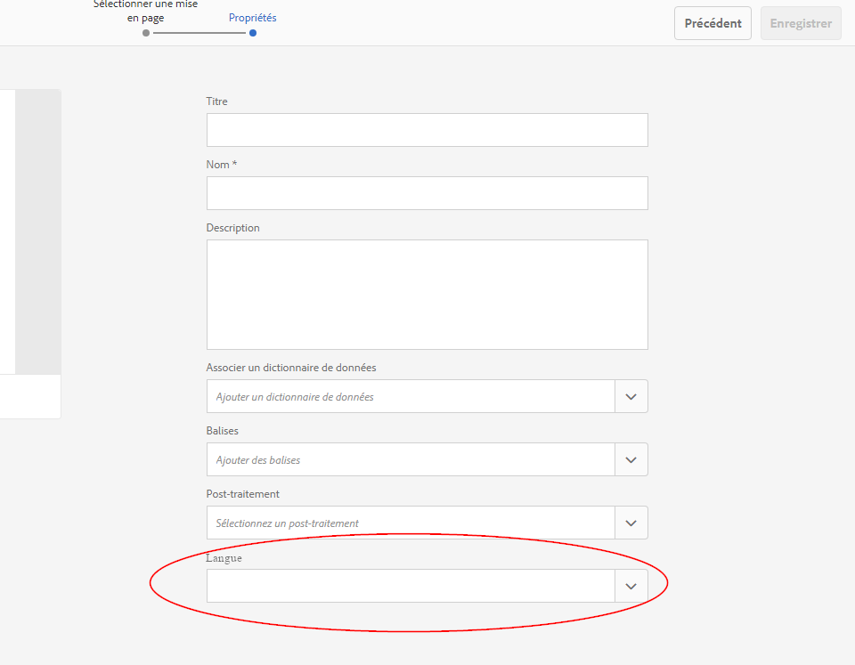

Propriété personnalisée, Langue, apparaissant dans l’interface utilisateur pour créer une lettre

## Personnalisation de la vue Liste afin d’afficher les propriétés personnalisées {#customize-the-list-view-to-show-custom-properties}

Après avoir ajouté une propriété personnalisée aux ressources de Correspondence Management, vous devez apporter des modifications supplémentaires à CRX/DE pour vous assurer que la propriété personnalisée s’affiche dans l’interface utilisateur de Correspondence Management.

Pour afficher la propriété personnalisée dans l’interface utilisateur du de ressources de Correspondence Management, procédez comme suit :

1. Go to `https://'[server]:[port]'/[ContextPath]/crx/de` and login as Administrator.
1. Créez la structure de dossiers suivante dans le dossier des applications :

   `/libs/fd/cm/ma/gui/content/cmassets/jcr:content/views/lists/columns`

   Vous trouverez ci-dessous les étapes à suivre pour créer la structure de dossiers :

   1. Right-click the columns folder at the following path and select **Overlay Node**:

      `/libs/fd/cm/ma/gui/content/cmassets/jcr:content/views/lists/columns`

   1. Assurez-vous que la boîte de dialogue du nœud de recouvrement possède les valeurs suivantes :

      **Chemin :** /libs/fd/cm/ma/gui/content/cmassets/jcr:content////columns

      **Emplacement :** /apps/

      **Faire correspondre les types de noeud :** Sélectionné

   1. Cliquez sur **OK**. La structure du dossier est créée dans le dossier des applications.

      Cliquez sur **Enregistrer tout**.

1. Pour chacune des propriétés créées, créez un nœud sous le nœud de colonnes pour créer une colonne dans l’interface utilisateur. Répétez cette étape pour créer plus de colonnes dans l’interface utilisateur :

   1. Cliquez avec le bouton droit sur le nœud approprié (columns) et sélectionnez **Créer** > **Créer un nœud**.
   1. Assurez-vous que la boîte de dialogue de création du nœud possède les valeurs suivantes et cliquez sur **OK** :

      **Nom :** Nom de votre choix (ici GeographicLocation)

      **Type :** nt:unstructured

   1. Ajoutez les propriétés suivantes au nœud et cliquez sur **Enregistrer tout**.

      <table>
         <tbody>
         <tr>
           <td><strong>Nom</strong></td>
           <td><strong>Type</strong></td>
           <td><strong>Valeur</strong></td>
         </tr>
         <tr>
           <td>jcr:primaryType</td>
           <td>Nom</td>
           <td><p>nt:unstructured</p> </td>
         </tr>
         <tr>
           <td>jcr:title</td>
           <td>Chaîne</td>
           <td><p>GeographicalLocation</p> <p>Cette valeur apparaît comme en-tête de colonne dans l’interface utilisateur. </p> </td>
         </tr>
         <tr>
           <td>pouvant être trié</td>
           <td>Booléen</td>
           <td><p>true</p> <p>La valeur true indique que l’utilisateur peut trier les valeurs de cette colonne. </p> </td>
         </tr>
         </tbody>
       </table>

1. Créez la structure de dossiers suivante dans le dossier des applications :

   `/libs/fd/cm/ma/gui/components/admin/childpagerenderer/childlistpage`

   Vous trouverez ci-dessous les étapes à suivre pour créer la structure de dossiers :

   1. Right-click the columns folder at the following path and select **Overlay Node**:

      `/libs/fd/cm/ma/gui/components/admin/childpagerenderer/childlistpage`

   1. Assurez-vous que la boîte de dialogue du nœud de recouvrement possède les valeurs suivantes :

      **Chemin :** /libs/fd/cm/ma/gui/components/admin/childpagererer/childlistpage

      **Emplacement :** /apps/

      **Faire correspondre les types de noeud :** Sélectionné

   1. Cliquez sur **OK**. La structure du dossier est créée dans le dossier des applications.

      Cliquez sur **Enregistrer tout**.

1. Copiez le fichier childlistpage.jsp à l’emplacement suivant :

   /libs/fd/cm/ma/gui/components/admin/childpagerenderer/childlistpage/childlistpage.jsp

   Collez le fichier à l’emplacement suivant :

   /apps//fd/cm/ma/gui/components/admin/childpagerenderer/childlistpage/.

1. Ouvrez le fichier childlistpage.jsp (/apps/fd/cm/ma/gui/components/admin/childpagerenderer/childlistpage/childlistpage.jsp) et apportez les modifications suivantes :

   1. Ajoutez l’élément suivant à la ligne 19 du fichier (en suivant les instructions de copyright).

      ```
      <%@page import="java.util.Map"%>
      ```

   1. Ajoutez le code suivant d’une fonction qui obtient une valeur pour chaque propriété personnalisée à la fin du fichier :

      ```
      <%!
          private String getCustomPropertyValue(Map<String, Object> extendedProperties, String propertyName) {
      
              String propertyValue = "";
              if (extendedProperties.containsKey(propertyName)) {
                  propertyValue = (String) extendedProperties.get(propertyName);
              }
      
              return propertyValue;
          }
      %>
      ```

   1. Ajouter ce qui suit avant le début de la balise &lt;tr> (&lt;tr &lt;%= attrs.build() %>>) :

      ```
      <%
          String GeoLocation = "";
          if (asset != null) {
                  Map<String, Object> extendedProperties = asset.getExtendedProperties();
                  if (extendedProperties != null) {
                      GeoLocation = getCustomPropertyValue(extendedProperties,"GeoLocation");
                  }
          }
      %>
      ```

      Dans le code, GeoLocation correspond à la valeur définie dans la propriété de nom lors de la création du nœud/champ personnalisé. Lors de la création d’un nœud/champ personnalisé, vous avez entré le nom de la propriété avec ./extendedproperties/ prefix : ./extendedproperties/GeoLocation. Dans le code, le préfixe n’est pas obligatoire.

   1. Pour afficher la nouvelle propriété dans l’interface utilisateur, ajoutez une balise TD comme suit avant la balise tr de fermeture (&lt;/tr>) :

      ```
      <td is="coral-td" value="<%= xssAPI.encodeForHTMLAttr(geographicalLocation) %>"><%= xssAPI.encodeForHTML(geographicalLocation) %></td>
      ```

      Pour ajouter d’autres colonnes, répétez les étapes 6.3 et 6.4.

   1. Cliquez sur **Enregistrer tout**.

1. Pour afficher votre personnalisation, ouvrez la vue de listes des fragments de documents ou les lettres dans lesquelles vous avez ajouté la propriété personnalisée.

   La colonne et la propriété d’interface utilisateur ajoutées au cours de cette procédure s’affichent pour tous les types de ressource. Toutefois, les valeurs de ces propriétés peuvent être entrées et affichées uniquement pour les types de ressource pour lesquels vous avez initialement ajouté la propriété personnalisée.

   Par exemple, à l’aide du scénario : L’ajout de propriétés personnalisées pour des types de ressource spécifiques lorsque vous ajoutez une propriété personnalisée à des ressources de texte vous permet de saisir des propriétés personnalisées pour des ressources de texte uniquement. Si, toutefois, vous affichez cette propriété personnalisée dans l’interface utilisateur, la colonne s’affiche pour tous les types de fichier.

   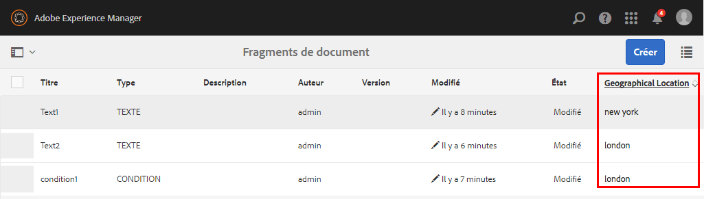

1. (Facultatif) Par défaut, la nouvelle colonne s’affiche comme la dernière colonne de l’interface utilisateur. Pour faire apparaître la colonne à une position spécifique, ajoutez la propriété suivante au nœud de colonne :

<table>
 <tbody>
  <tr>
   <td><strong>Nom</strong></td>
   <td><strong>Type</strong></td>
   <td><strong>Valeur</strong></td>
  </tr>
  <tr>
   <td>sling:orderBefore</td>
   <td>Chaîne</td>
   <td><p>Le nom du nœud de colonne sous le chemin « /libs/fd/cm/ma/gui/content/cmassets/jcr:content/views/list/columns » devant lequel la colonne personnalisée doit apparaître sur l’interface utilisateur.</p> <p>Ici, si vous souhaitez que la colonne Position géographique apparaisse avant (à gauche) de la colonne Version, ajoutez la propriété sling:orderBefore au nœud GeoLocation sous le chemin « /apps/fd/cm/ma/gui/content/cmassets/jcr:content/views/list/columns/GeoLocation » et définissez la valeur de la propriété sur celle de la version.</p> </td>
  </tr>
 </tbody>
</table>

Lorsque vous ajoutez la propriété sling:orderBefore pour spécifier l’emplacement de la colonne, vous devez également mettre à jour la séquence de la balise &lt;td> correspondante spécifiée à l’étape 6.4 de cette procédure. Par exemple, dans ce cas, vous devez vous assurer que la balise &lt;td> de la position géographique est placée avant la balise &lt;td> de la colonne Version :

```xml
<td is="coral-td" value="<%= xssAPI.encodeForHTMLAttr(geographicalLocation) %>"><%= xssAPI.encodeForHTML(geographicalLocation) %></td>
<td is="coral-td" value="<%= xssAPI.encodeForHTMLAttr(version) %>"><%= xssAPI.encodeForHTML(version) %></td>
```

## Activation de la recherche des propriétés personnalisées {#enable-search-for-custom-properties}

Par défaut, la recherche de texte intégral n’inclut pas les propriétés personnalisées que vous ajoutez à L’interface utilisateur au moyen de CRX/DE.

Pour inclure les propriétés personnalisées dans la recherche, vous devez autoriser l’indexation des propriétés personnalisées.

Pour ce faire, effectuez les étapes suivantes :

1. Go to `https://'[server]:[port]'/[ContextPath]/crx/de` and login as Administrator.
1. Go to `/oak:index/cmLucene`and add a node named **aggregates** under it.

   1. Cliquez avec le bouton droit sur le dossier cmLucene et sélectionnez **Créer** > **Créer un nœud**.
   1. Assurez-vous que la boîte de dialogue de création du nœud possède les valeurs suivantes et cliquez sur **OK** :

      **Nom :** aggregates

      **Type :** nt:unstructured

   1. Cliquez sur **Enregistrer tout**.

1. Sous le nouveau dossier de , ajoutez un noeud cm:resource. Sous cm:resource, ajoutez un nœud nommé include0.

   1. Cliquez avec le bouton droit sur le dossier aggregates et sélectionnez **Créer** > **Créer un nœud**. Assurez-vous que la boîte de dialogue de création du nœud possède les valeurs suivantes et cliquez sur **OK** :

      **Nom :** cm:resource

      **Type :** nt:unstructured

   1. Right click the cm:resource folder and select **Create** > **Create Node**. Assurez-vous que la boîte de dialogue de création du nœud possède les valeurs suivantes et cliquez sur **OK** :

      **Nom :** include0

      **Type :** nt:unstructured

   1. Cliquez sur le nouveau nœud que vous avez créé (ici include0). CRX affiche les propriétés du nœud.
   1. Ajoutez la propriété suivante au nœud (ici include0) :

      <table>
         <tbody>
         <tr>
           <td><strong>Nom</strong></td>
           <td><strong>Type</strong></td>
           <td><strong>Valeur</strong></td>
         </tr>
         <tr>
           <td>path</td>
           <td>Chaîne</td>
           <td>extendedProperties<br /> </td>
         </tr>
         </tbody>
       </table>

   1. Cliquez sur **Enregistrer tout**.

1. Go to properties at the following location and add a node location under it: `/oak:index/cmLucene/indexRules/cm:resource/properties`

   Recommencez cette étape pour chacune des propriétés personnalisées que vous voulez ajouter à la liste.

   1. Cliquez avec le bouton droit sur le dossier des propriétés et sélectionnez **Créer** > **Créer un nœud**.
   1. Assurez-vous que la boîte de dialogue de création du nœud possède les valeurs suivantes et cliquez sur **OK** :

      **Nom :** emplacement (ou nom de la propriété personnalisée à ajouter à la recherche)

      **Type :** nt:unstructured

   1. Cliquez sur le nouveau nœud que vous avez créé (ici location). CRX affiche les propriétés du nœud.
   1. Ajoutez les propriétés suivantes au nœud (ici location) :

      | **Nom** | **Type** | **Valeur** |
      |---|---|---|
      | analysé | Chaîne | true |
      | nom est | Chaîne | extendedProperties/location (ou le nom de la propriété personnalisée que vous souhaitez ajouter à la recherche) |
      | propertyIndex | Booléen | true |
      | useInSuggest | Booléen | true |

   1. Cliquez sur **Enregistrer tout**.

1. Vous pouvez désormais utiliser des valeurs de propriété personnalisée dans la recherche de texte intégral pour la localisation des ressources appropriées.

>[!NOTE]
>
>Si vous ne parvenez toujours pas à effectuer une recherche, un problème d’indexation peut en être la cause. Pour la réindexation, accédez au noeud suivant et définissez la valeur de la propriété &quot;re-index&quot; sur true :
>
>/oak:index/cmLucene » et modifier la valeur de la propriété

## Modification de la vue par défaut de la page de recherche {#change-default-view-of-the-search-page}

1. Go to `https://'[server]:[port]'/[ContextPath]/crx/de` and login as Administrator.
1. Dans le dossier d’applications, créez un dossier nommé  avec un chemin/une structure similaires au dossier  situé dans /libs/granite/ui/content/shell/omnisearch/searchresults/singleresults/ :

   1. Right-click the items folder at the following path and select **Overlay Node**:

      `/libs/granite/ui/content/shell/omnisearch/searchresults/singleresults/views/list`

   1. Assurez-vous que la boîte de dialogue du nœud de recouvrement possède les valeurs suivantes :

      **Chemin :** /libs/granite/ui/content/shell/omnisearch/searchresults/singleresults//

      **Emplacement :** /apps/

      **Faire correspondre les types de noeud :** Sélectionné

   1. Cliquez sur **OK**. La structure du dossier est créée dans le dossier des applications.

   1. Cliquez sur **Enregistrer tout**.

1. Ajoutez les propriétés suivantes au nœud dans le nœud que vous venez de créer (list) et cliquez sur **Enregistrer tout** :

   <table>
   <tbody>
   <tr>
      <td><strong>Nom</strong></td>
      <td><strong>Type</strong></td>
      <td><strong>Valeur</strong></td>
   </tr>
   <tr>
      <td>sling:orderBefore<br /> </td>
      <td>Chaîne</td>
      <td>card</td>
   </tr>
   </tbody>
   </table>

1. La personnalisation affiche les résultats de recherche dans la vue Liste pour toutes les consoles, y compris Formulaires et documents, Ressources et Sites.

## Modification de la vue par défaut de la page des ressources {#change-default-view-of-the-assets-page}

>[!NOTE]
>
>Ces étapes permettent de modifier la vue par défaut de toutes les consoles telles que Formulaires et documents, Ressources et Sites.

1. Go to `https://'[server]:[port]'/[ContextPath]/crx/de` and login as Administrator.
1. Dans le dossier d’applications, créez un dossier nommé  avec un chemin/une structure similaires au dossier  du situé dans :

   /libs/fd/cm/ma/gui/content/cmassets/jcr:content/views/

   1. Right-click the items folder at the following path and select **Overlay Node**:

      `/libs/fd/cm/ma/gui/content/cmassets/jcr:content/views/list`

   1. Assurez-vous que la boîte de dialogue du nœud de recouvrement possède les valeurs suivantes :

      **Chemin :** /libs/fd/cm/ma/gui/content/cmassets/jcr:content///

      **Emplacement :** /apps/

      **Faire correspondre les types de noeud :** Sélectionné

   1. Cliquez sur **OK**. La structure du dossier est créée dans le dossier des applications.

   1. Cliquez sur **Enregistrer tout**.

1. Ajoutez les propriétés suivantes au nœud dans le nœud que vous venez de créer (list) et cliquez sur **Enregistrer tout** :

   <table>
   <tbody>
   <tr>
      <td><strong>Nom</strong></td>
      <td><strong>Type</strong></td>
      <td><strong>Valeur</strong></td>
   </tr>
   <tr>
      <td>sling:orderBefore<br /> </td>
      <td>Chaîne</td>
      <td>card</td>
   </tr>
   </tbody>
   </table>

1. Effacez les cookies de votre navigateur ou utilisez le mode navigation privée de votre navigateur pour afficher les ressources. La page des ressources s’affiche par défaut dans la mise en page de carte.

## Afficher/masquer les propriétés personnalisées sur les pages Création de ressources et Propriétés {#show-hide-custom-properties-on-asset-creation-and-properties-pages}

Pour ce faire, effectuez les étapes suivantes :

1. Sous le noeud de propriétés personnalisées, tel que l’allocation géographique, créez un noeud nommé &quot;granite:rendercondition&quot; de type &quot;nt:unstructured&quot;.
1. Ajoutez la propriété suivante au nœud et cliquez sur **Save All** :

   <table>
   <tbody>
   <tr>
      <td><strong>Nom</strong></td>
      <td><strong>Type</strong></td>
      <td><strong>Valeur</strong></td>
   </tr>
   <tr>
      <td>sling:resourceType<br /> </td>
      <td>Chaîne</td>
      <td>fd/cm/ma/gui/components/admin/assetsproperties/custompropertyconfig<br /> </td>
   </tr>
   </tbody>
   </table>

1. To hide this property on the asset creation page, add the following property to it and click **Save All**:

   <table>
   <tbody>
   <tr>
      <td><strong>Nom</strong></td>
      <td><strong>Type</strong></td>
      <td><strong>Valeur</strong></td>
   </tr>
   <tr>
      <td>hideOnCreate<br /> </td>
      <td>Booléen</td>
      <td>true<br /> </td>
   </tr>
   </tbody>
   </table>

1. Pour masquer la propriété personnalisée sur la page des propriétés des ressources, ajoutez-y la propriété suivante et cliquez sur **Enregistrer tout** :

   <table>
   <tbody>
   <tr>
      <td><strong>Nom</strong></td>
      <td><strong>Type</strong></td>
      <td><strong>Valeur</strong></td>
   </tr>
   <tr>
      <td>hideOnEdit<br /> </td>
      <td>Booléen</td>
      <td>true<br /> </td>
   </tr>
   </tbody>
   </table>

   Pour à nouveau afficher les valeurs, réinitialisez les valeurs de propriété sur `false` ou supprimez les entrées de propriété.
