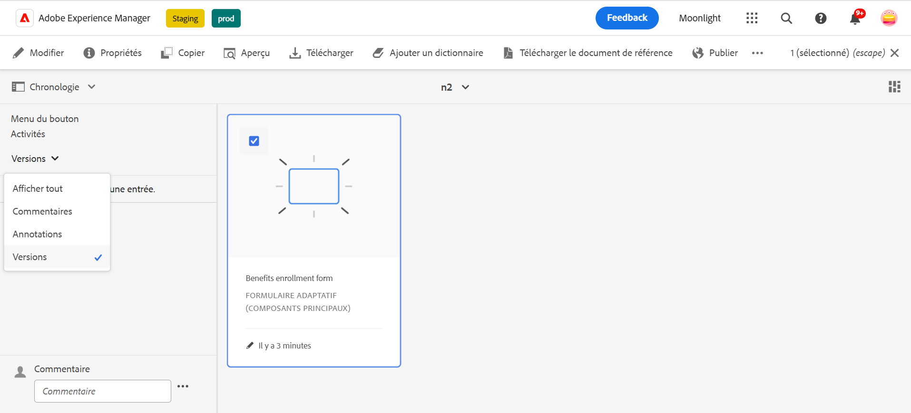
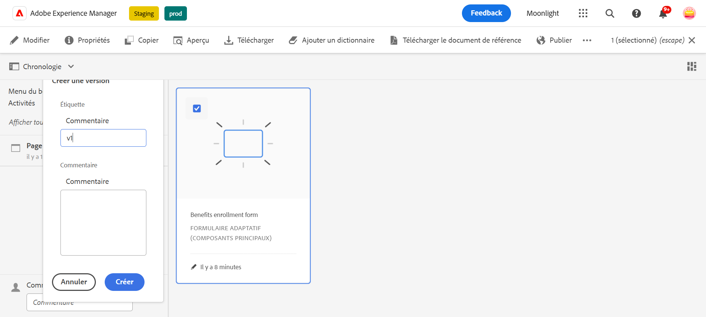
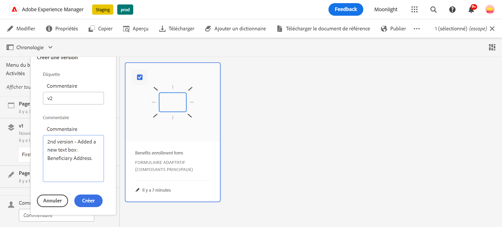
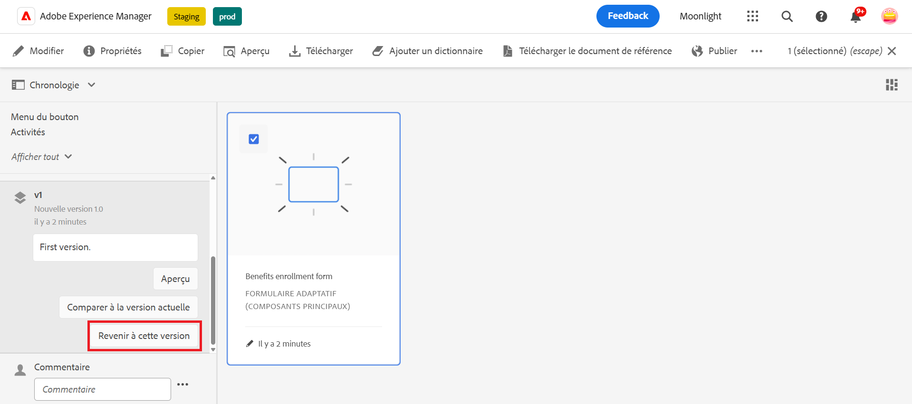
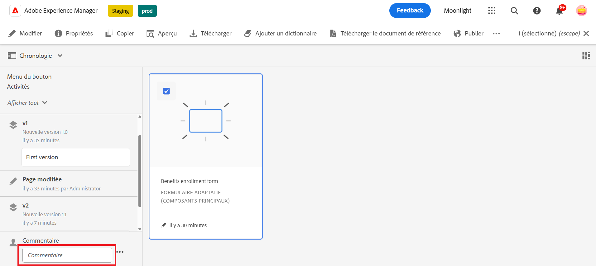
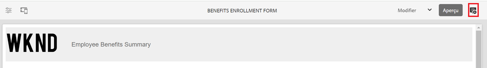
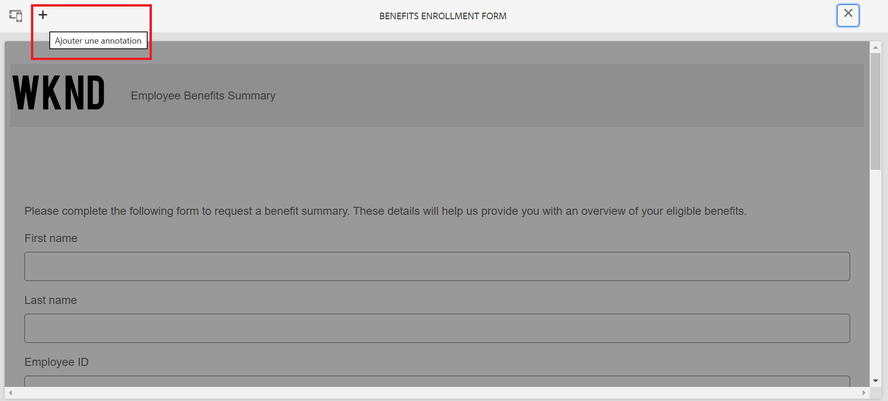
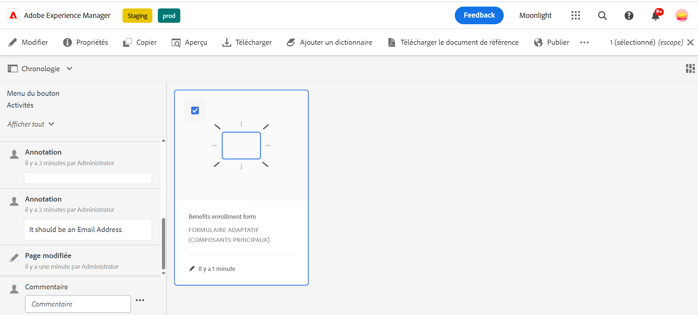

# Contrôle de version, révision et commentaires dans un formulaire adaptatif

<!--
 This feature is under the early adopter program. If you're interested in joining our early access program for this feature, send an email from your official address to aem-forms-ea@adobe.com to request access 
-->

Cette fonctionnalité n’est pas activée par défaut. Vous pouvez écrire à partir de votre adresse officielle à aem-forms-ea@adobe.com pour demander l’accès à la fonctionnalité.

Les composants principaux d’un formulaire adaptatif permettent aux auteurs et aux autrices de formulaires d’ajouter un contrôle de version, des commentaires et des annotations aux formulaires. Ces fonctionnalités simplifient le développement des formulaires en permettant aux utilisateurs et utilisatrices de créer et de gérer plusieurs versions, de collaborer par le biais de commentaires et d’ajouter des notes à des sections de formulaire spécifiques, améliorant ainsi l’expérience de création de formulaires.

Consultez cette vidéo détaillée pour découvrir les fonctionnalités de contrôle de version, de commentaires et d’annotations dans un formulaire adaptatif.

>[!VIDEO](https://video.tv.adobe.com/v/3463265)

## Prérequis {#prerequisite-versioning}

Pour utiliser les fonctions de contrôle de version, de commentaires et d’annotation dans un formulaire adaptatif, assurez-vous que les [composants principaux des formulaires adaptatifs](https://experienceleague.adobe.com/fr/docs/experience-manager-65/content/forms/adaptive-forms-core-components/enable-adaptive-forms-core-components) sont activés dans votre environnement AEM 6.5 Forms.

## Contrôle de version d’un formulaire adaptatif {#adaptive-form-versioning}

Le contrôle de version des formulaires adaptatifs permet d’ajouter des versions à un formulaire. Les auteurs et les autrices de formulaires peuvent facilement créer plusieurs versions d’un formulaire et utiliser celle qui convient le mieux aux objectifs de l’entreprise. De plus, les utilisateurs et utilisatrices du formulaire peuvent également revenir aux versions précédentes du formulaire. Cela permet également aux créateurs et aux créatrices de comparer deux versions d’un formulaire en les prévisualisant, afin de les aider à mieux analyser les formulaires du point de vue de l’interface d’utilisation. Examinons en détail chaque fonctionnalité de contrôle de version d’un formulaire adaptatif :

### Créer une version de formulaire {#create-a-form-version}

Pour créer une version d’un formulaire, procédez comme suit :

1. Dans votre environnement AEM Forms, accédez à **[!UICONTROL Formulaire]**>>**[!UICONTROL Formulaires et documents]**, puis sélectionnez votre **Formulaire**.
1. Dans la liste déroulante de sélection du panneau de gauche, sélectionnez **[!UICONTROL Versions]**.
   
1. Cliquez sur les **trois points** situés dans le panneau inférieur gauche, puis sur **[!UICONTROL Enregistrer en tant que version]**.
1. Spécifiez un libellé pour la version de formulaire. Vous pouvez également ajouter des informations sur le formulaire via un commentaire.
   

### Mettre à jour une version de formulaire {#update-a-form-version}

Lorsque vous modifiez et mettez à jour votre formulaire, vous ajoutez une nouvelle version au formulaire. Suivez les étapes indiquées dans la dernière section pour attribuer un nom à une nouvelle version du formulaire, comme illustré sur l’image :

### Revenir à une version précédente d’un formulaire {#revert-a-form-version}

Pour revenir à une version précédente d’un formulaire, sélectionnez une version de formulaire, puis cliquez sur **[!UICONTROL Rétablir cette version]**.

### Comparer les versions d’un formulaire {#compare-form-versions}

Les auteurs et les autrices de formulaires peuvent comparer deux versions différentes d’un formulaire à des fins de prévisualisation. Pour comparer des versions, sélectionnez une version de formulaire et cliquez sur **[!UICONTROL Comparer avec la version actuelle]**. Deux versions de formulaire différentes s’affichent en mode de prévisualisation.

## Ajouter des commentaires {#add-comments}

La révision est un mécanisme qui permet à un ou plusieurs réviseurs ou réviseuses de commenter des formulaires. Tout utilisateur et toute utilisatrice d’un formulaire peut ajouter des commentaires sur un formulaire ou réviser un formulaire à l’aide de commentaires. Pour ajouter un commentaire sur un formulaire, sélectionnez un **[!UICONTROL Formulaire]** et ajoutez un **[!UICONTROL Commentaire]** au formulaire.

>[!NOTE]
> Lorsque vous utilisez des commentaires dans les composants principaux de formulaires adaptatifs comme décrit ci-dessus, la fonctionnalité de formulaire [ajouter des réviseurs et réviseuses aux formulaires](/help/forms/using/create-reviews-forms.md) est désactivée.

## Ajouter des annotations {#adaptive-form-annotations}

Dans de nombreux cas, les utilisateurs et les utilisatrices d’un groupe de formulaire doivent ajouter des annotations à un formulaire à des fins de révision, par exemple sur un onglet spécifique ou sur les composants d’un formulaire. Dans de tels cas, les auteurs et les autrices peuvent utiliser des annotations.
Pour ajouter des annotations à un formulaire, procédez comme suit :

1. Ouvrez un formulaire en mode **[!UICONTROL édition]**.

1. Cliquez sur l’**icône ajouter** située dans le rail supérieur droit, comme indiqué sur l’image.
   

1. Cliquez maintenant sur l’**icône ajouter** située dans le rail supérieur gauche, comme illustré sur l’image, pour ajouter l’annotation.
   

1. Vous pouvez maintenant ajouter des commentaires et des dessins avec plusieurs couleurs aux composants du formulaire.

1. Pour afficher toutes les annotations ajoutées à un formulaire, sélectionnez votre formulaire et vous verrez les annotations ajoutées dans le panneau de gauche, comme illustré sur l’image.

   

## Voir également

* [Comparer les composants principaux de formulaires adaptatifs](/help/forms/using/compare-forms-core-components.md)
