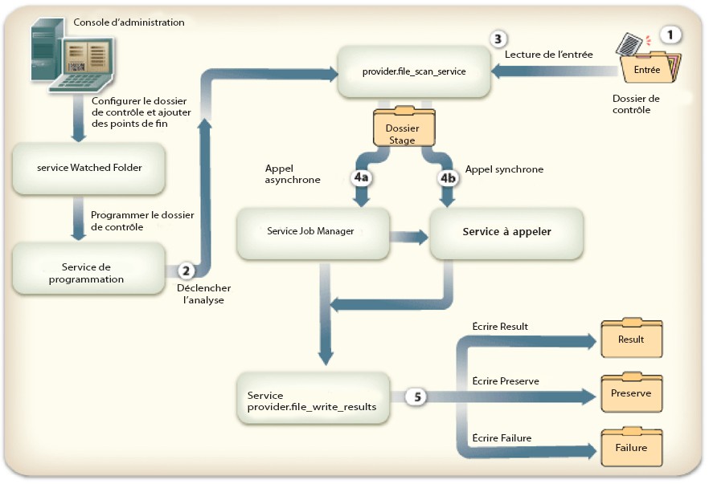
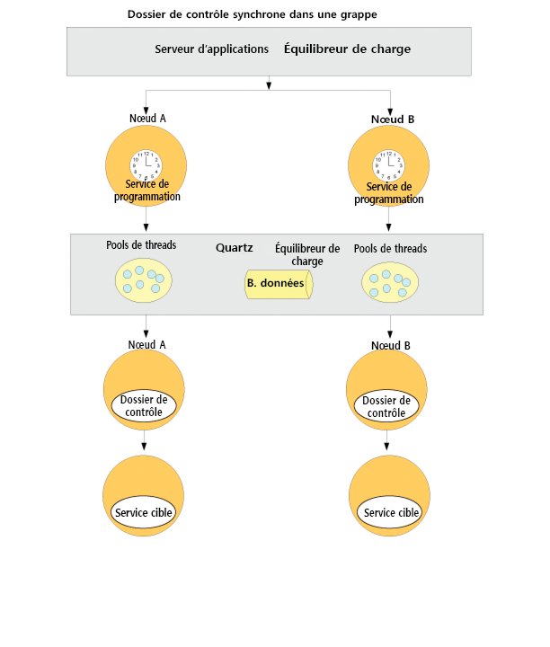
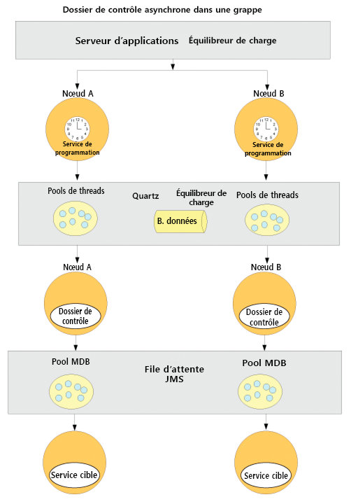

# Configuration des points de fin Watched Folder {#configuring-watched-folder-endpoints}

Un administrateur peut configurer un dossier réseau, appelé *dossier de contrôle* (en anglais Watched Folder), de sorte que lorsqu’un utilisateur y place un fichier (par exemple un fichier PDF), une opération de service configurée est appelée et manipule le fichier. Après que le service a effectué l’opération spécifiée, il enregistre le fichier modifié dans un dossier de sortie spécifié.

## Configuration du service Watched Folder {#configuring-the-watched-folder-service}

Avant de configurer un point de fin Watched Folder, configurez le service Watched Folder. Les paramètres de configuration du service Watched Folder ont deux objectifs :

* configurer les attributs communs à tous les points de fin Watched Folder ;
* fournir des valeurs par défaut à tous les points de fin Watched Folder.

Après avoir configuré le service Watched Folder, vous ajoutez un point de fin Watched Folder au service cible. Au moment de l’ajout de ce point de fin, vous définissez des valeurs telles que le nom du service et le nom de l’opération à appeler dès lors que les fichiers ou les dossiers sont placés dans le dossier input du service Watched Folder configuré. Pour plus d’informations sur la configuration du service Watched Folder, voir [Paramètres du service Watched Folder](/help/forms/using/admin-help/configure-service-settings.md#watched-folder-service-settings).

## Création d’un dossier de contrôle {#creating-a-watched-folder}

Vous pouvez créer un dossier de contrôle de deux manières :

* Lors de la configuration des paramètres d’un point de fin Watched Folder, indiquez le chemin d’accès complet au répertoire parent dans le champ Chemin d’accès et ajoutez-lui le nom du dossier de contrôle à créer, comme indiqué dans l’exemple suivant :
   `  C:\MyPDFs\MyWatchedFolder`Comme le dossier MyWatched Folder n’existe pas encore, AEM Forms tente de le créer à cet emplacement.

* Créez un dossier dans le système de fichiers avant de configurer un point de fin Watched Folder puis indiquez son chemin d’accès complet dans le champ Chemin d’accès.

Dans un environnement organisé en grappe, le dossier à utiliser comme dossier de contrôle doit être accessible, modifiable et partagé sur le système de fichiers ou le réseau. Dans ce cas, chaque instance du serveur d’applications dans la grappe doit avoir accès au même dossier partagé.

Sous Windows, si le serveur d’applications s’exécute en tant que service, il doit être démarré avec les droits d’accès appropriés sur le dossier partagé, de l’une des manières suivantes :

* Configurez le paramètre **Ouvrir une session en tant que du service du serveur d’applications** pour qu’il démarre avec un utilisateur disposant des droits d’accès appropriés sur le dossier de contrôle partagé.
* Sélectionnez Autoriser le service à interagir avec le bureau dans le champ Exécuter en tant que système local. Cette option requiert que le dossier de contrôle partagé soit accessible et modifiable par tout le monde.

## Chaînage des dossiers de contrôle {#chaining-together-watched-folders}

Les dossiers de contrôle peuvent être assemblés en chaîne de sorte qu’un document de résultats d’un dossier de contrôle corresponde au document d’entrée du dossier de contrôle suivant. Chaque dossier de contrôle peut appeler un service différent. En configurant les dossiers de contrôle de la sorte, plusieurs services peuvent être appelés. Par exemple, un premier dossier de contrôle peut convertir des fichiers PDF au format Adobe PostScript®, et un second dossier de contrôle, des fichiers PostScript au format PDF/A. Pour ce faire, configurez le dossier *result* du dossier de contrôle défini par votre premier point de fin, afin qu’il pointe vers le dossier *input* du dossier de contrôle défini par votre second point de fin.

La sortie de la première conversion serait placée dans le dossier \path\result. Et le dossier d’entrée de la seconde conversion serait \chemin\result et le dossier de sortie de la seconde conversion serait \chemin\result\result (ou le dossier défini dans la zone du dossier de résultats pour la seconde conversion).

## Interaction des utilisateurs avec les dossiers de contrôle {#how-users-interact-with-watched-folders}

Avec un point de fin Watched Folder, les utilisateurs peuvent lancer un processus en copiant ou en faisant glisser des fichiers ou des dossiers depuis le bureau vers un dossier de contrôle. Les fichiers sont traités selon leur ordre d’arrivée.

Avec plusieurs points de fin Watched Folder, si le travail ne requiert qu’un fichier d’entrée, l’utilisateur peut le copier à la racine du dossier de contrôle.

Si le travail contient plusieurs fichiers d’entrée, l’utilisateur doit créer, hors de l’arborescence du dossier de contrôle, un dossier contenant tous les fichiers requis. Ce nouveau dossier doit inclure les fichiers d’entrée (et éventuellement un fichier DDX s’il est requis par le processus). Une fois le dossier du travail créé, l’utilisateur le copie dans le dossier d’entrée du dossier de contrôle.

>[!NOTE]
>
>vérifiez que le serveur d’applications a révoqué l’accès aux fichiers dans le dossier de contrôle. Si AEM Forms ne peut pas supprimer les fichiers du dossier d’entrée après leur analyse, le processus associé est appelé indéfiniment.

## Sorties du dossier de contrôle {#watched-folder-output}

Lorsque l’entrée est un dossier et que la sortie compte plusieurs fichiers, AEM Forms crée un dossier de sortie portant le même nom que le dossier d’entrée, et copie les fichiers de sortie dans ce dossier. Lorsque la sortie est une cartographie de documents contenant une paire clé/valeur, comme la sortie d’un processus d’extraction, c’est la clé qui est utilisée comme nom du fichier de sortie.

Les noms des fichiers de sortie générés par un processus de point de fin ne peuvent pas contenir de caractères autres que des lettres, des chiffres et un point (.) avant l’extension. AEM Forms remplace les autres caractères par leurs valeurs hexadécimales.

Les applications clientes sélectionnent les documents de résultats dans le dossier result du dossier de contrôle. Les erreurs de traitement sont consignées dans le dossier failure du dossier de contrôle

## Fonctionnement du service Watched Folder {#how-watched-folder-works}

Le module Watched Folder contient les services suivants :

* service Watched Folder ;
* provider.file_scan_service ;
* provider.file_write_results_service.

Outre les services répertoriés ci-dessus, le service Watched Folder dépend également d’autres services, notamment le service Scheduler pour la programmation des travaux et le service Job Manager pour la prise en charge de l’appel asynchrone des services cibles.

### Traitement d’une demande d’appel par le service Watched Folder {#how-watched-folder-processes-an-invocation-request}

Le service de dossier de contrôle Watched Folder traite la création, la mise à jour et la suppression des points de fin. Une fois que l’administrateur crée les points de fin, ils doivent être déclenchés par le service de programmation en fonction de l’intervalle de répétition spécifié ou de l’expression cron.

Ce schéma illustre la façon dont Watched Folder traite une demande d’appel.

Le processus d’appel d’un service à l’aide des dossiers de contrôle fonctionne comme suit :

1. Une application cliente place les fichiers ou les dossiers dans le dossier d’entrée du dossier de contrôle.
1. Lorsque l’analyse de la tâche intervient, le service de programmation appelle provider.file_scan_service afin de traiter les fichiers ou les dossiers dans le dossier d’entrée.
1. provider.file_scan_service exécute les tâches suivantes :

   * Il analyse le dossier d’entrée à la recherche des fichiers ou des dossiers correspondant au modèle de fichiers inclus et exclut les fichiers ou les dossiers en fonction du modèle de fichiers exclus spécifié. Les fichiers ou les dossiers les plus anciens sont sélectionnés en premier. Les fichiers ou les dossiers antérieurs à la durée d’attente sont également sélectionnés. Le nombre de fichiers ou de dossiers traités au cours d’une analyse dépend de la taille du lot. Pour plus d’informations sur les modèles de fichiers, voir [A propos des modèles de fichier](configuring-watched-folder-endpoints.md#about-file-patterns). Pour plus d’informations sur la définition de la taille des lots, voir [Paramètres du service Watched Folder](/help/forms/using/admin-help/configure-service-settings.md#watched-folder-service-settings).
   * Il sélectionne les fichiers ou les dossiers à traiter. Les fichiers ou les dossiers non entièrement téléchargés feront partie de l’analyse suivante. Pour s’assurer que les dossiers sont entièrement téléchargés, les administrateurs doivent créer un dossier et le nommer en utilisant pour cela le modèle de fichiers exclus. Une fois tous les fichiers intégrés au dossier, celui-ci doit être renommé selon le modèle indiqué dans le modèle de fichiers inclus. Cette étape permet de s’assurer que le dossier contient tous les fichiers nécessaires à l’appel du service. Pour plus d’informations sur la manière de s’assurer que les dossiers sont bien téléchargés, voir [Conseils et astuces concernant les dossiers de contrôle](configuring-watched-folder-endpoints.md#tips-and-tricks-for-watched-folders).
   * Il déplace les fichiers ou les dossiers dans le dossier des fichiers traités après les avoir sélectionnés pour traitement.
   * Il convertit les fichiers ou les dossiers dans le dossier des fichiers traités et les envoie vers l’entrée appropriée, en fonction des mappages des paramètres d’entrée du point de fin. Pour plus d’informations sur le mappage des paramètres d’entrée, voir [Conseils et astuces sur les dossiers de contrôle](configuring-watched-folder-endpoints.md#tips-and-tricks-for-watched-folders).

1. Le service cible configuré pour le point de fin est appelé de manière synchrone ou asynchrone. Le service cible est appelé à l’aide du nom d’utilisateur et du mot de passe configurés pour le point de fin.

   * Un appel synchrone appelle le service cible directement et traite immédiatement la réponse.
   * Pour les appels asynchrones, le service cible est appelé par le biais du service Job Manager qui place la demande dans une file d’attente. A son tour, le service Job Manager appelle provider.file_write_results_service pour gérer les résultats.

1. provider.file_write_results_service gère la réponse ou l’échec de l’appel du service cible. Si l’appel est réussi, la sortie est enregistrée dans le dossier de résultat, en fonction de la configuration du point de fin. provider.file_write_results_service conserve également la source si le point de fin est configuré pour conserver les résultats après la réussite de l’appel.

   Lorsque l’appel du service cible est un échec, provider.file_write_results_service enregistre la raison de l’échec dans un fichier failure.log, puis place ce fichier dans le dossier failure. La création du dossier failure dépend des paramètres de configuration spécifiés pour le point de fin. Lorsque l’administrateur active l’option Conserver en cas d’échec pour la configuration du point de fin, provider.file_write_results_service copie également les fichiers source dans le dossier failure. Pour plus d’informations sur la récupération des dossiers depuis le dossier failure, voir [Points d’échec et récupération](configuring-watched-folder-endpoints.md#failure-points-and-recovery).

## Paramètres des points de fin Watched Folder {#watched-folder-endpoint-settings}

Définissez les paramètres suivants pour configurer un point de fin Watched Folder.

**Nom :** (obligatoire) identifie le point de fin. N’incluez pas de caractère « &lt; », car le nom affiché dans Workspace serait tronqué. Si vous saisissez une URL en tant que nom de point de fin, assurez-vous que celle-ci est conforme aux normes syntaxiques en la matière précisées dans le document RFC1738.

**Description :** Description du point de fin. N’incluez pas de caractère « &lt; », car la description affichée dans Workspace serait tronquée.

**Chemin :** (obligatoire) indique l’emplacement du dossier de contrôle. Dans un environnement organisé en grappe, ce paramètre doit pointer vers un dossier réseau partagé accessible à tous les ordinateurs de la grappe.

**Asynchrone :** Identifie le type d’appel comme étant asynchrone ou synchrone. La valeur par défaut est asynchrone. Le mode asynchrone est recommandé pour les processus de longue durée, tandis que le mode synchrone est préférable pour les processus transitoires ou de courte durée.

**Cron   :** Entrez un cron   si le dossier de contrôle doit être planifié à l’aide d’un cron . Si ce paramètre est configuré, l’intervalle de répétition est ignoré.

**Intervalle de répétition :** Intervalle en secondes pour l’analyse du dossier de contrôle en vue de l’entrée. A moins que le paramètre Ralentissement ne soit activé, l’attribut Intervalle de répétition doit être défini sur une valeur supérieure à la durée du traitement d’une tâche moyenne, faute de quoi le système risque d’être surchargé. La valeur par défaut est 5. Pour plus d’informations, voir la description du paramètre Taille du lot.

**Nombre de répétitions :** Nombre de fois où le dossier de contrôle analyse le dossier ou le répertoire. La valeur -1 indique une analyse indéfinie. La valeur par défaut est -1.

**Ralentir :** Lorsque cette option est sélectionnée, elle limite le nombre de tâches du dossier de contrôle qu’AEM forms traite à un moment donné. La valeur Taille du lot détermine le nombre maximal de tâches. Voir A propos du ralentissement .

**Nom d’utilisateur :** (obligatoire) nom d’utilisateur utilisé lors de l’appel d’un service de  à partir du dossier de contrôle. La valeur par défaut est SuperAdmin.

**Nom de domaine :** (obligatoire) domaine de l’utilisateur. La valeur par défaut est DefaultDom.

**Taille du lot :** Nombre de fichiers ou de dossiers à sélectionner par analyse. Ce paramètre permet d’éviter une surcharge du système, car l’analyse simultanée d’un trop grand nombre de fichiers peut provoquer une panne. La valeur par défaut est 2.   

Les paramètres Intervalle de répétition et Taille du lot permettent de déterminer le nombre de fichiers sélectionnés par Watched Folder pour chaque analyse. Watched Folder utilise un pool de threads Quartz pour analyser le dossier input. Le pool de threads est partagé avec d’autres services. Si l’intervalle d’analyse défini est court, les threads analysent fréquemment le dossier input. Si des fichiers sont déposés régulièrement dans le dossier de contrôle, il est préférable que l’intervalle d’analyse soit court. Si au contraire, des fichiers y sont déposés peu fréquemment, utilisez un intervalle d’analyse plus long afin que les autres services puissent utiliser les threads.

Si un gros volume de fichiers est déposé, définissez une grande taille de lot. Si par exemple, le service invoqué par le point de fin Watched Folder peut traiter 700 fichiers par minute et que les utilisateurs déposent des fichiers dans le dossier input à la même fréquence, la définition de la taille du lot sur 350 et de l’intervalle de répétition sur 30 secondes permet de maintenir les performances de Watched Folder sans subir les conséquences d’une analyse du dossier de contrôle trop fréquente.  

Lorsque des fichiers sont déposés dans le dossier de contrôle, ce dernier les répertorie dans les entrées, ce qui réduit parfois les performances si l’analyse s’effectue toutes les secondes. L’allongement de l’intervalle d’analyse permet d’améliorer les performances. Si le volume des fichiers déposés est réduit, ajustez la taille du lot et l’intervalle de répétition en conséquence. Par exemple, si 10 fichiers sont déposés toutes les secondes, essayez de définir l’intervalle de répétition sur 1 et la taille du lot sur 10. 

**Temps d’attente :** Temps, en millisecondes, à attendre avant d’analyser un dossier ou un fichier après sa création. Par exemple, si la durée d’attente est de 3 600 000 millisecondes (une heure) et que le fichier a été créé une minute auparavant, ce dernier est sélectionné après 59 minutes ou plus. La valeur par défaut est 0.

Ce paramètre assure la copie intégrale d’un fichier ou d’un dossier dans le dossier d’entrée. Par exemple, si vous devez traiter un fichier volumineux et que le téléchargement du fichier dure dix minutes, définissez le délai d’attente sur 10&amp;ast;60 &amp;ast;1000 millisecondes. ce qui évite que le dossier de contrôle analyse le fichier tant que ce dernier a une existence inférieure à dix minutes.

**Exclure le modèle de fichier :** un point-virgule **;** délimité de modèles utilisés par un dossier de contrôle pour déterminer les fichiers et les dossiers à analyser et à sélectionner. Les fichiers ou les dossiers pourvus de ce modèle ne sont pas analysés en vue d’être traités. 

Ce paramètre est utile lorsque l’entrée est un dossier contenant plusieurs fichiers. Vous pouvez copier le contenu du dossier dans un dossier dont le nom sera choisi par le dossier de contrôle. Ceci empêche le dossier de contrôle de sélectionner un dossier en vue de le traiter avant qu’il ne soit complètement copié dans le dossier d’entrée.

Vous pouvez utiliser des modèles de fichiers pour exclure les types de fichiers suivants :

* Fichiers avec des extensions de nom de fichier spécifiques ; par exemple, &amp;ast;.dat, &amp;ast;.xml, &amp;ast;.pdf.
* Fichiers portant des noms spécifiques, par exemple data.&amp;ast; would exclude files and folders named *data1*, *data2*, and so on.
* Fichiers contenant des expressions composites dans leur nom et leur extension, comme dans les exemples suivants :

   * Data[0-9][0-9][0-9].[dD][aA]&#39;port&#39;
   * &amp;ast;.[dD][Aa]&#39;port&#39;
   * &amp;ast;.[Xx][Mm][Ll]

Pour plus d’informations sur les modèles de fichiers, voir [A propos des modèles de fichier](configuring-watched-folder-endpoints.md#about-file-patterns).

**Inclure le modèle de fichier :** (obligatoire) un point-virgule **;** délimité de modèles que le dossier de contrôle utilise pour déterminer les dossiers et les fichiers à analyser et à sélectionner. Par exemple, si le modèle de fichier Inclure est input&amp;ast;, tous les fichiers et dossiers qui correspondent input&amp;ast; sont ramassées. Cela concerne les fichiers et les dossiers nommés input1, input2, etc.

La valeur par défaut est &amp;ast; et indique tous les fichiers et dossiers.

Vous pouvez utiliser des modèles de fichiers pour inclure les types de fichiers suivants :

* Fichiers avec des extensions de nom de fichier spécifiques ; par exemple, &amp;ast;.dat, &amp;ast;.xml, &amp;ast;.pdf.
* Fichiers portant des noms spécifiques, par exemple data.&amp;ast; would include files and folders named *data1*, *data2*, and so on.
* Fichiers contenant des expressions composites dans leur nom et leur extension, comme dans les exemples suivants :

   * Data[0-9][0-9][0-9].[dD][aA]&#39;port&#39;
   * &amp;ast;.[dD][Aa]&#39;port&#39;
   * &amp;ast;.[Xx][Mm][Ll]

Pour plus d’informations sur les modèles de fichiers, voir [A propos des modèles de fichier](configuring-watched-folder-endpoints.md#about-file-patterns).

**Dossier de résultats :** Dossier dans lequel les résultats enregistrés sont stockés. Si les résultats ne se trouvent pas dans ce dossier, vérifiez le dossier failure. Les fichiers en lecture seule ne sont pas traités et ils sont enregistrés dans le dossier failure. Il peut s’agir d’un chemin d’accès vide, relatif ou absolu répondant aux modèles de fichiers suivants :

* %F = préfixe du nom du fichier
* %E = extension du nom du fichier
* %Y = année (complète)
* %y = année (deux derniers chiffres)
* %M = mois
* %D = jour du mois
* %d = jour de l’année
* %H = heure (horloge 24 heures)
* %h = heure (horloge 12 heures)
* %m = minute
* %s = seconde
* %l = milliseconde
* %R = nombre aléatoire (entre 0 et 9)
* %P = ID de processus ou de travail

For example, if it is 8 PM on July 17, 2009 and you specify `C:/Test/WF0/failure/%Y/%M/%D/%H/`, the result folder is `C:/Test/WF0/failure/2009/07/17/20`.

Si le chemin d’accès n’est pas absolu, mais relatif, le dossier est créé dans le dossier de contrôle. La valeur par défaut est result/%Y/%M/%D/, qui correspond au dossier result dans le dossier de contrôle. Pour plus d’informations sur les modèles de fichiers, voir [A propos des modèles de fichier](configuring-watched-folder-endpoints.md#about-file-patterns).

***Remarque ** : plus les dossiers de résultats sont petits, plus les performances de Watched Folder augmentent. Par exemple, si la charge estimée pour le dossier de contrôle est de 1 000 fichiers par heure, utilisez un modèle de type`result/%Y%M%D%H`, afin qu’un nouveau sous-dossier soit créé toutes les heures. Si la charge est moindre (par exemple, 1 000 fichiers par jour), vous pouvez utiliser un modèle de type`result/%Y%M%D`.*

**Conserver le dossier :** Emplacement où les fichiers sont stockés après une analyse et un ramassage réussis. Ce chemin d’accès de répertoire peut être absolu, relatif ou null. Vous pouvez utiliser des modèles de fichiers, comme indiqué pour le dossier result. La valeur par défaut est preserve/%Y/%M/%D/.

**Dossier d’échec :** Dossier dans lequel les fichiers d’échec sont enregistrés. Cet emplacement dépend toujours du dossier de contrôle. Vous pouvez utiliser des modèles de fichiers, comme indiqué pour le dossier result.

Les fichiers en lecture seule ne sont pas traités et ils sont enregistrés dans le dossier failure.

La valeur par défaut est failure/%Y/%M/%D/.

**Conserver en cas d’échec :** Conserver les fichiers d’entrée en cas d’échec de l’exécution de l’opération sur un service. La valeur par défaut est true.

**Ecraser les noms de  de fichiers :** Lorsque la valeur est True, les fichiers du dossier des résultats et du dossier preserve sont remplacés. Lorsqu’il est défini sur false, les fichiers et les dossiers pourvus d’un suffixe d’index numérique sont utilisés pour le nom. La valeur par défaut est False.

**Durée de la purge :** (obligatoire) Les fichiers et les dossiers du dossier result sont purgés lorsqu’ils sont plus anciens que cette valeur. Cette valeur est mesurée en jours. Grâce à ce paramètre, le dossier obtenu n’est jamais plein. 

La valeur -1 jour indique de ne jamais supprimer le dossier result. La valeur par défaut est -1.

**Nom de l’opération :** (obligatoire) d’opérations pouvant être affecté au point de fin Watched Folder.

**Mappages des paramètres d’entrée :** Permet de configurer l’entrée requise pour traiter le service et l’opération. Les paramètres disponibles dépendent du service utilisant le point de fin Watched Folder. Il existe deux types d’entrées :

**Littéral :** Le dossier de contrôle utilise la valeur saisie dans le champ telle qu’elle est affichée. Tous les types Java de base sont pris en charge. Par exemple, si une interface API utilise une entrée de type chaîne, long, nombre entier ou valeur booléenne, cette entrée est convertie en type approprié, puis le service est appelé.

**Variable :** La valeur saisie est un modèle de fichier utilisé par le dossier de contrôle pour sélectionner l’entrée. Par exemple, dans le cas du service de mot de passe chiffré, où le d’entrée doit être un fichier PDF, l’utilisateur peut utiliser &amp;ast;.pdf comme modèle de fichier. Le dossier de contrôle sélectionne tous les fichiers qu’il contient correspondant à ce modèle et appelle le service pour chaque fichier. Si une variable est utilisée, tous les fichiers d’entrée sont convertis en documents. Seules les API utilisant le type d’entrée Document sont prises en charge.

**Mappages des paramètres de sortie :** Permet de configurer les sorties du service et de l’opération. Les paramètres disponibles dépendent du service utilisant le point de fin du dossier de contrôle. 

Les sorties de Watched Folder peuvent être un document unique, une liste de documents ou un mappage de documents. Ces documents de sortie sont ensuite enregistrés dans le dossier result, à l’aide du modèle défini dans le mappage des paramètres de sortie.

**Remarque**: La *spécification de noms de fichier de sortie uniques améliore les performances. For example, consider the case where the service returns one output document and the Output Parameter Mapping maps it to`%F.%E`(the file name and extension of the input file). Dans ce cas, si des utilisateurs déposent chaque minute des fichiers dont le nom est identique, que le dossier result est défini sur`result/%Y/%M/%D`et que le paramètre Remplacer les noms de fichier en double est inactif, Watched Folder tente de résoudre les noms de fichiers en double. Le processus impliqué dans la résolution des noms de fichiers en double peut affecter les performances. In this situation, changing the Output Parameter Mapping to`%F_%h_%m_%s_%l`to add hours, minutes, seconds, and milliseconds to the name, or ensuring that dropped files have unique names may improve performance.*

## A propos des modèles de fichier {#about-file-patterns}

Les administrateurs peuvent indiquer le type du fichier servant à appeler un service. Il est possible d’établir plusieurs modèles de fichier pour chaque dossier de contrôle. Un modèle de fichier peut être du type suivant :

* Fichiers avec des extensions de nom de fichier spécifiques ; par exemple, &amp;ast;.dat, &amp;ast;.xml, &amp;ast;.pdf,;
* Fichiers portant des noms spécifiques, par exemple data.&amp;ast;
* Fichiers contenant des expressions composites dans leur nom et leur extension, comme dans les exemples suivants :

   * Data[0-9][0-9][0-9].[dD][aA]&#39;port&#39;
   * &amp;ast;.[dD][Aa]&#39;port&#39;
   * &amp;ast;.[Xx][Mm][Ll]

L’administrateur peut définir le modèle de fichier du dossier output dans lequel enregistrer les résultats. Concernant les dossiers output (result, preserve et failure), il peut indiquer l’un de modèles de fichier suivants :

* %Y = année (complète)
* %y = année (deux derniers chiffres)
* %M = mois
* %D = jour du mois
* %d = jour de l’année
* %h = heure
* %m = minute
* %s = seconde
* %R = nombre aléatoire (entre 0 et 9)
* %J = nom de la tâche

For example, the path to the result folder may be `C:\Adobe\Adobe_Experience_Manager_forms\BarcodedForms\%y\%m\%d`.

Les mappages des paramètres de sortie peuvent également spécifier des modèles supplémentaires, du type :

* %F = nom du fichier source
* %E = extension du nom du fichier source

Si le modèle de mappage des paramètres de sortie se termine par « File.separator » (qui correspond au séparateur de chemin), un dossier est créé dans lequel le contenu est copié. Si le modèle ne se termine pas par « File.separator », le contenu (fichier ou dossier des résultats) est créé et utilise ce nom. Pour plus d’informations les mappages des paramètres de sortie, voir [Conseils et astuces concernant les dossiers de contrôle](configuring-watched-folder-endpoints.md#tips-and-tricks-for-watched-folders).

## A propos du ralentissement {#about-throttling}

Lorsque le ralentissement est activé au niveau du point de fin d’un dossier de contrôle, il permet de limiter le nombre de tâches du dossier de contrôle pouvant être traité à un moment donné. La valeur Taille du lot détermine le nombre maximal de tâches, le tout pouvant être configuré dans le point de fin Watched Folder. Les documents arrivant dans le répertoire des entrées du dossier de contrôle ne seront pas interrogés lorsque la limite fixée pour le ralentissement sera atteinte. Ces documents resteront dans le répertoire des entrées jusqu’à ce que d’autres tâches du dossier de contrôle soient terminées et qu’une autre demande d’interrogation soit effectuée. Dans le cas d’un traitement synchrone, toutes les tâches traitées dans une interrogation tiendront compte de la limite de ralentissement, même si les tâches sont traitées les unes après les autres, dans un seul thread.

>[!NOTE]
>
>aucune mise à l’échelle du ralentissement n’est effectuée dans une grappe. Lorsque l’option de ralentissement est activée, la grappe dans son ensemble ne traite pas plus de tâches que le nombre indiqué dans l’attribut Taille du lot. Cette limite est fixée par la grappe et n’est pas spécifique à chacun de ses nœuds. Par exemple, si l’attribut Taille du lot a pour valeur 2, la limite du ralentissement peut être atteinte avec le traitement de deux tâches sur un seul nœud et aucun autre nœud n’interrogera alors le répertoire des entrées tant que l’une des tâches n’est pas terminée.

### Fonctionnement du ralentissement {#how-throttling-works}

Watched Folder analyse le dossier input à chaque intervalle de répétition, sélectionne le nombre de fichiers indiqués dans la taille du lot, puis appelle le service cible pour chacun de ces fichiers. Par exemple, si l’attribut Taille du lot à pour valeur 4, Watched Folder sélectionnera quatre fichiers à chaque analyse, créera quatre demandes d’appel et appellera le service cible. Avant que ces demandes ne soient terminées, si le service Watched Folder est appelé, il démarrera à nouveau quatre tâches, indépendamment du fait que les quatre tâches précédentes sont ou non terminées.

L’option de ralentissement empêche Watched Folder d’appeler de nouvelles tâches avant que les tâches précédentes ne soient terminées. Watched Folder détectera les tâches en cours et traitera les nouvelles tâches en fonction de l’attribut Taille du lot défini, moins les tâches en cours. Par exemple, dans le second appel, si le nombre de tâches terminées est de trois seulement et qu’une tâche est toujours en cours, Watched Folder appelle uniquement trois autres tâches.

* Watched Folder considère le nombre de fichiers présents dans le dossier des fichiers traités pour calculer le nombre de tâches en cours. Si les fichiers restent dans le dossier des fichiers traités sans être traités, Watched Folder n’appelle plus aucune tâche. Par exemple, si l’attribut Taille du lot a pour valeur 4 et que 3 tâches sont bloquées, Watched Folder appellera une seule tâche dans les appels suivants. Plusieurs raisons expliquent que des fichiers restent dans le dossier stage, sans être traités. Si les tâches sont bloquées, l’administrateur peut mettre un terme au traitement dans la page d’administration du processus des formulaires et Watched Folder sortira alors les fichiers du dossier d&#39;étape.
* Si le serveur Forms tombe en panne avant que Watched Folder puisse appeler les tâches, l’administrateur peut sortir les fichiers du dossier d&#39;étape. Pour plus d’informations, voir [Points d’échec et récupération](configuring-watched-folder-endpoints.md#failure-points-and-recovery).
* Si le serveur Forms fonctionne mais que Watched Folder ne fonctionne pas lorsque le service Job Manager appelle de nouveau, ce qui arrive lorsque les services ne sont pas exécutés dans la séquence définie, l’administrateur peut sortir les fichiers du dossier d&#39;étape. Pour plus d’informations, voir [Points d’échec et récupération](configuring-watched-folder-endpoints.md#failure-points-and-recovery).

## Performances et évolutivité {#performance-and-scalability}

Watched Folder peut traiter un total de 100 dossiers sur un seul nœud. Les performances de Watched Folder dépendent de celles du serveur Forms. Pour un appel de type asynchrone, les performances dépendent davantage de la charge du système et des tâches situées dans la file d’attente de Job Manager.

Il est possible d’améliorer les performances de Watched Folder en ajoutant des nœuds à la grappe. Les tâches de Watched Folder sont réparties sur les nœuds de la grappe du fait de la présence du planificateur Quartz et du service Job Manager dans le cas de demandes asynchrones. Toutes les tâches sont enregistrées dans la base de données.

Watched Folder dépend du service de programmation pour la programmation, la déprogrammation et la reprogrammation des tâches. D’autres services (gestion des événements, User Manager et fournisseur de messagerie électronique) sont disponibles et partagent le pool de threads du service de programmation. Cela peut avoir une incidence sur les performances de Watched Folder. Un réglage du pool de threads du service de programmation sera nécessaire lorsque tous les services commenceront à l’utiliser.

## Dossiers de contrôle dans une grappe {#watched-folders-in-a-cluster}

Dans une grappe, Watched Folder s’appuie sur le planificateur Quartz et le service Job Manager pour l’équilibrage de la charge et le basculement. Pour plus d’informations sur le comportement de la grappe Quartz, voir la [documentation Quartz](https://www.quartz-scheduler.org/documentation).

A chaque interrogation, Watched Folder exécute les trois tâches suivantes :

* Analyse du dossier
* Appel du service cible
* Gestion des résultats

Le comportement de l’équilibrage de la charge et du basculement varie en fonction de la configuration du dossier de contrôle (en mode synchrone ou asynchrone).

### Dossier de contrôle synchrone dans une grappe {#synchronous-watched-folder-in-a-cluster}

Pour des appels synchrones, le programme d’équilibrage de charge Quartz décide du nœud recevant l’événement d’interrogation. Le nœud concerné exécutera l’ensemble des tâches suivantes : analyse du dossier, appel du service cible et gestion des résultats.

En mode synchrone, lorsqu’un nœud échoue, le planificateur Quartz envoie de nouveaux événements d’interrogation aux autres nœuds. Les appels lancés sur le nœud en échec sont perdus. Pour plus d’informations sur la façon de récupérer les fichiers associés à la tâche en échec, voir [Points d’échec et récupération](configuring-watched-folder-endpoints.md#failure-points-and-recovery).

### Dossier de contrôle asynchrone dans une grappe {#asynchronous-watched-folder-in-a-cluster}

Pour des appels asynchrones, le programme d’équilibrage de charge Quartz décide du nœud recevant l’événement d’interrogation. Le nœud concerné analyse le dossier input et appelle le service cible en plaçant la demande dans la file d’attente du service Job Manager. Le programme d’équilibrage de charge du service Job Manager décide en retour du nœud qui traitera la demande d’appel. Il est possible que même si le nœud A crée la demande d’appel, le nœud B termine le traitement de la demande. De même, il est possible que le nœud qui lance la demande d’appel termine le traitement de la demande.

En mode asynchrone, lorsqu’un nœud échoue, le planificateur Quartz envoie de nouveaux événements d’interrogation aux autres nœuds. Les demandes d’appel créées sur le nœud en échec seront placées dans la file d’attente du service Job Manager, puis envoyées vers d’autres nœuds en vue de leur traitement. Les fichiers pour lesquels des demandes d’appel ne sont pas créées resteront dans le dossier stage. Pour plus d’informations sur la façon de récupérer les fichiers associés à la tâche en échec, voir [Points d’échec et récupération](configuring-watched-folder-endpoints.md#failure-points-and-recovery).

## Points d’échec et récupération {#failure-points-and-recovery}

A chaque événement d’interrogation, Watched Folder verrouille le dossier input, déplace dans le dossier stage les fichiers correspondant au modèle de fichiers inclus, puis déverrouille le dossier input. Le verrouillage est nécessaire de sorte que deux threads ne sélectionnent pas le même jeu de fichiers et ne les traitent pas deux fois. La probabilité d’un traitement en double augmente lorsque l’intervalle de répétition est faible et que la taille du lot est importante. Une fois les fichiers déplacés dans le dossier stage, le dossier input est déverrouillé de sorte que d’autres threads puissent analyser le dossier. Cette étape offre un débit élevé du fait que d’autres threads peuvent effectuer une analyse pendant que l’un d’entre eux traite les fichiers.

Une fois les fichiers déplacés dans le dossier stage, les demandes d’appel sont créées pour chaque fichier et le service cible est appelé. Cependant, il arrive parfois que Watched Folder ne puisse pas récupérer les fichiers dans le dossier stage :

* Si une panne du serveur survient avant que Watched Folder n’ait eu le temps de créer la demande d’appel, les fichiers situés dans le dossier stage restent dans ce dossier et ne sont pas récupérés.
* Si Watched Folder a réussi à créer la demande d’appel pour chacun des fichiers du dossier stage et qu’une panne du serveur survient, deux comportements sont à noter, en fonction du type d’appel :

**Synchrone :** si Watched Folder est configuré pour appeler le service de manière synchrone, tous les fichiers du dossier stage restent dans ce dossier et ne subissent aucun traitement.

**Asynchrone :** dans ce cas, Watched Folder s’appuie sur le service Job Manager. Si le service Job Manager rappelle Watched Folder, les fichiers du dossier stage sont déplacés vers le dossier preserve ou le dossier failure, en fonction des résultats de l’appel. Si le service Job Manager ne rappelle pas Watched Folder, les fichiers restent dans le dossier stage et ne subissent aucun traitement. Cette situation survient lorsque Watched Folder n’est pas exécuté alors que Job Manager rappelle.

### Récupération des fichiers source non traités dans le dossier stage {#recovering-unprocessed-source-files-in-the-stage-folder}

Lorsque Watched Folder ne peut pas traiter les fichiers source dans le dossier stage, vous avez la possibilité de récupérer les fichiers n’ayant fait l’objet d’aucun traitement.

1. Redémarrez le serveur d’applications ou le nœud.
1. (Facultatif) Faites en sorte que Watched Folder ne traite plus aucun nouveau fichier d’entrée. Si vous ignorez cette étape, il vous sera plus difficile de déterminer les fichiers non traités dans le dossier stage. Pour empêcher que Watched Folder ne traite de nouveaux fichiers d’entrée, procédez comme suit :

   * Dans Applications et services, modifiez le paramètre Inclure le modèle de fichier pour le point de fin du dossier de contrôle et donnez-lui une valeur qui ne correspond à aucun nouveau fichier d’entrée (par exemple, saisissez `NOMATCH`).
   * Mettez un terme au processus de création de nouveaux fichiers d’entrée.
   Patientez jusqu’à ce qu’AEM Forms récupère et traite tous les fichiers. La majorité des fichiers devra être récupérée et tous les nouveaux fichiers d’entrée correctement traités. Le temps nécessaire à Watched Folder pour récupérer et traiter les fichiers dépendra de la durée de l’opération pour l’appel, ainsi que du nombre de fichiers à récupérer.

1. Déterminez les fichiers ne pouvant pas être traités. Si vous avez suffisamment attendu, que vous avez terminé l’étape précédente et qu’il reste encore des fichiers non traités dans le dossier stage, passez à l’étape suivante.

   >[!NOTE]
   >
   >recherchez la date et l’horodatage des fichiers dans le dossier stage. En fonction du nombre de fichiers et du temps normal de traitement, vous pouvez déterminer les fichiers considérés comme étant bloqués.

1. Copiez les fichiers non traités du répertoire des fichiers traités dans le répertoire des entrées.
1. Si vous avez empêché Watched Folder de traiter de nouveaux fichiers d’entrée à l’étape 2, redonnez au paramètre Inclure le modèle de fichier son ancienne valeur ou réactivez le processus préalablement désactivé.

## Remarques concernant la protection des dossiers de contrôle {#security-considerations-for-watched-folders}

Chaque dossier de contrôle est configuré au moyen d’un nom d’utilisateur et d’un mot de passe. Ces informations d’identification sont utilisées au moment de l’appel des services. Watched Folder compte sur le fait que le dossier partagé est protégé par le système de fichiers de sécurité sous-jacent de sorte que seul le propriétaire du dossier de contrôle peut accéder au dossier partagé.

## Conseils et astuces concernant les dossiers de contrôle {#tips-and-tricks-for-watched-folders}

Vous trouverez ci-dessous quelques conseils et astuces concernant la configuration de point de fin Watched Folder.

* Si un dossier de contrôle sous Windows traite des fichiers image, définissez des valeurs pour les options Inclure le modèle de fichier ou Exclure le modèle de fichier afin d’éviter que le fichier Thumbs.db généré automatiquement par Windows ne soit interrogé par le dossier de contrôle.
* Si une expression cron est spécifiée, l’intervalle de répétition est ignoré. L’utilisation de l’expression cron est basée sur le système de planification des tâches Open Source de Quartz, version 1.4.0 
* La taille du lot correspond au nombre de fichiers ou de dossiers pouvant être sélectionnés dans le cadre d’une analyse du dossier de contrôle. Si la taille du lot est définie pour deux fichiers ou dossiers et que dix d’entre eux sont déposés dans le dossier input du dossier de contrôle, uniquement deux seront sélectionnés pour l’analyse. Lors de l’analyse suivante, qui intervient après le délai indiqué dans l’intervalle de répétition, les deux fichiers suivants seront sélectionnés.
* En ce qui concerne les modèles de fichier, les administrateurs peuvent définir des expressions régulières afin de prendre en charge les modèles génériques. Watched Folder modifie le  normal  pour prendre en charge les modèles de caractères génériques tels que &amp;ast;.&amp;ast; ou &amp;ast;.pdf. qui ne sont pas pris en charge par les expressions régulières.
* Watched Folder analyse le dossier input pour les sélectionner mais ne sait pas si le fichier ou le dossier source est entièrement copié dans le dossier input avant de lancer le traitement. Pour vous assurer que le fichier ou le dossier source est entièrement copié dans le dossier input du dossier de contrôle avant leur sélection, procédez comme suit :

   * Utilisez l’attribut Durée d’attente qui correspond au temps d’attente de Watched Folder en millisecondes depuis l’heure de dernière modification. Cette fonction est utile si les fichiers à traiter sont volumineux. Par exemple, si le téléchargement d’un fichier prend 10 minutes, spécifiez le temps d’attente comme 10&amp;ast;60 &amp;ast;1000 millisecondes. Cela évitera à Watched Folder de sélectionner le fichier s’il ne date pas d’au moins 10 minutes.
   * Utilisez les modèles de fichiers exclus et inclus. For example, if the exclude file pattern is `ex*` and the include file pattern is `in*`, Watched Folder will pick up the files that start with &quot;in&quot; and will not pick up the files that start with &quot;ex&quot;. Pour copier des fichiers ou des dossiers volumineux, renommez tout d’abord le fichier ou le dossier de sorte que leur nom commence par « ex ». Une fois le fichier ou le dossier nommé &quot;ex&quot; complètement copié dans le dossier de contrôle, renommez-le en &quot;in&amp;ast;&quot;.

* Utilisez l’attribut Durée de la purge pour nettoyer le dossier result. Watched Folder nettoie tous les fichiers dont la date est antérieure à la durée mentionnée dans l’attribut Durée de la purge. Cette durée est exprimée en jours.
* Lorsque vous ajoutez un point de fin Watched Folder, après la sélection du nom de l’opération, le mappage des paramètres d’entrée est renseigné. Pour chaque entrée d’opération, un champ de mappage des paramètres d’entrée est généré. Vous trouverez ci-dessous quelques exemples de mappage des paramètres d’entrée :

   * Pour une entrée `com.adobe.idp.Document` : si l’opération de service dispose d’une entrée du type `Document`, l’administrateur peut définir le type de mappage sur `Variable`. Watched Folder va prélever de l’entrée du dossier de contrôle d’entrée du dossier basé sur le fichier motif spécifié pour le paramètre d’entrée. If the administrator specifies `*.pdf` as the parameter, each file that has an extension of .pdf will be picked up, converted to `com.adobe.idp.Document`, and the service invoked.
   * Pour une entrée `java.util.Map` : si l’opération de service dispose d’une entrée du type `Map`, l’administrateur peut définir le type de mappage sur `Variable` et saisir une valeur de mappage avec un modèle du type `*.pdf`. Par exemple, un service a besoin d’un mappage de deux objets `com.adobe.idp.Document`, ce qui représente deux fichiers dans le dossier input, du type 1.pdf et 2.pdf. Watched Folder créera alors une mappe avec pour clé le nom du fichier et pour valeur `com.adobe.idp.Document`.
   * Pour une entrée `java.util.List`  : si l’opération de service dispose d’une entrée du type List, l’administrateur peut définir le type de mappage sur `Variable` et saisir une valeur de mappage avec un modèle du type `*.pdf`. Lorsque les fichiers PDF seront déposés dans le dossier input, Watched Folder créera une liste des objets `com.adobe.idp.Document` représentant ces fichiers et appellera le service cible.
   * Pour `java.lang.String` : l’administrateur dispose de deux options. Tout d’abord, l’administrateur peut spécifier le type de mappage `Literal` et saisir une valeur de mappage sous la forme d’une chaîne, telle que `hello.` Watched Folder appellera le service avec la chaîne `hello`. Deuxième option : l’administrateur peut définir le type de mappage sur `Variable`, puis saisir une valeur de mappage avec un modèle du type `*.txt`. Dans le deuxième cas, les fichiers ayant pour extension .txt seront lus comme un document converti sous forme de chaîne pour appeler le service.
   * Java primitive type: The administrator can specify the mapping type as `Literal` and provide the value. Watched Folder appellera le service avec la valeur indiquée.

* Watched Folder fonctionne avec des documents. The supported outputs are `com.adobe.idp.Document`, `org.w3c.Document`, `org.w3c.Node`, as well as a list and map of these types. Tout autre type conduira à une sortie en échec dans le dossier failure.
* Si les résultats ne se trouvent pas dans le dossier result, vérifiez le dossier failure.
* Watched Folder fonctionne de manière optimale en mode asynchrone. Dans ce mode, Watched Folder place la demande d’appel en file d’attente et rappelle. La file d’attente est ensuite traitée de manière asynchrone. Lorsque l’option Asynchrone n’est pas définie, Watched Folder appelle le service cible de manière synchrone et le moteur de processus patiente jusqu’à ce que le service correspondant à la demande soit effectué et que les résultats soient générés. Si le service tarde à traiter la demande, Watched Folder peut générer des erreurs de délai d’expiration.
* La création de dossiers de contrôle pour des opérations d’importation ou d’exportation ne fait pas abstraction des extensions de nom de fichier. Lors de l’appel du service Form Data Integration à l’aide de dossiers de contrôle, le type d’extension du fichier de sortie peut différer du format de sortie prévu pour le type d’objet de document. Par exemple, si le fichier d’entrée pour un dossier de contrôle appelant l’opération d’exportation est un formulaire XFA contenant des données, le fichier de sortie doit correspondre à un fichier de données XDP. Pour obtenir un fichier de sortie doté de l’extension de fichier adéquate, vous pouvez la spécifier dans le cadre du mappage des paramètres de sortie. Dans cet exemple, vous pouvez utiliser %F.xdp pour le mappage des paramètres de sortie.
* Watched Folder peut traiter des fichiers d’entrée avant la fin de leur copie dans le dossier de contrôle. Contrairement à Windows, le verrouillage de fichiers sous UNIX n’est pas obligatoire. Par conséquent, lorsqu’un fichier est copié dans un dossier de contrôle, il est possible que Watched Folder déplace ce fichier vers le dossier des fichiers traités sans attendre la fin de la copie du fichier. Dans ce cas, le fichier d’entrée n’est traité que partiellement. A l’heure actuelle, il existe deux moyens de remédier à ce problème :

   * Solution n°1

      1. Spécifiez un modèle pour Exclure le modèle de fichier, tel que temp&amp;ast;.ps.
      1. Copiez les fichiers commençant par temp (par exemple, temp1.ps) dans le dossier de contrôle.
      1. Une fois le fichier complètement copié dans le dossier de contrôle, renommez-le pour qu’il corresponde au modèle spécifié pour l’option Inclure le modèle de fichier. Watched Folder déplace alors le fichier copié vers le dossier des fichiers traités.
   * Solution n°2

      Si vous connaissez la durée maximale requise par la copie de vos fichiers dans un dossier de contrôle, spécifiez cette durée en secondes dans l’option Temps d’attente du fichier. Watched Folder attend alors que ce laps de temps soit écoulé avant de déplacer le fichier vers le dossier des fichiers traités.

      Ce problème ne se produit pas pour les fichiers sous Windows, car Windows verrouille les fichiers pendant les opérations d’écriture par un thread. Toutefois, ce problème se présente pour les dossiers sous Windows. Concernant les dossiers, vous devez suivre la procédure de la solution n°1.

* Si l’attribut de point de fin Preserve Folder Name de Watched Folder est défini sur un chemin d’accès de répertoire null, le répertoire d’installation n’est pas nettoyé comme il le devrait. Il contient encore le fichier traité et le dossier temporaire.

## Recommandations relatives au service pour les dossiers de contrôle {#service-specific-recommendations-for-watched-folders}

Pour tous les services, vous devez ajuster la taille du lot et l’intervalle de répétition du dossier de contrôle de sorte que le rythme auquel Watched Folder sélectionne de nouveaux fichiers et dossiers en vue du traitement ne dépasse pas le nombre de tâches pouvant être traitées par le serveur AEM Forms. Les paramètres réels à utiliser varient en fonction du nombre de dossiers de contrôle configurés, des services utilisés dans ces dossiers et du caractère intensif du traitement des tâches.

### Recommandations relatives au service Generate PDF {#generate-pdf-service-recommendations}

* Le service Generate PDF peut convertir un seul fichier à la fois des types suivants : Microsoft Word, Microsoft Excel, Microsoft PowerPoint, Microsoft Project, AutoCAD, Adobe Photoshop®, Adobe FrameMaker® et Adobe PageMaker®. Il s’agit de tâches dont l’exécution prend du temps. Aussi, assurez-vous de définir une taille de lot faible. De même, augmentez l’intervalle de répétition si la grappe contient davantage de nœuds.
* Pour PostScript (PS), Encapsulated PostScript (EPS) et les fichiers image, le service Generate PDF peut traiter plusieurs fichiers en parallèle. Vous devez veiller à régler convenablement la taille du pool de bean session (qui gouverne le nombre de conversions à effectuer en parallèle) en fonction de la capacité de votre serveur et du nombre de nœuds dans la grappe. Augmentez ensuite la taille du lot en faisant en sorte qu’elle soit égale à la taille du pool bean session pour les types de fichiers que vous essayez de convertir. La fréquence d’interrogation doit être définie d’après le nombre de nœuds de la grappe. Toutefois, du fait que le service Generate PDF traite ce genre de tâches relativement vite, vous pouvez configurer l’intervalle de répétition sur une valeur faible, du type 5 ou 10.
* Même si le service Generate PDF ne peut convertir qu’un seul fichier OpenOffice à la fois, la conversion est relativement rapide. La logique ci-dessus pour les conversions PS, EPS et image s’applique également aux conversions OpenOffice.
* Pour une distribution uniforme de la charge dans la grappe, utilisez une taille de lot réduite et augmentez l’intervalle de répétition.

### Recommandations relatives au service Barcoded Forms {#barcoded-forms-service-recommendations}

* Pour obtenir de meilleures performances dans le traitement des formulaires à codes-barres (fichiers de petite taille), saisissez `10` pour la taille du lot et `2` pour l’intervalle de répétition.
* Lorsque le nombre de fichiers du dossier input est important, il n’est pas impossible que des erreurs avec des fichiers masqués appelés *thumbs.db* surviennent. It is therefore recommended that you set the Include File Pattern for the include files to the same value specified for the input Variable (for example, `*.tiff`). Cela empêche ainsi Watched Folder de traiter les fichiers DB.
* Une taille du lot de `5` et un intervalle de répétition de `2` suffisent normalement car Barcoded Forms traite habituellement un code-barres en 0,5 seconde.
* Watched Folder n’attend pas que le moteur de processus ait terminé la tâche avant de sélectionner de nouveaux fichiers ou dossiers. L’analyse du dossier de contrôle est maintenue, de même que l’appel du service cible. Ce comportement peut entraîner une surcharge du moteur, de même que des problèmes de ressources et des délais d’expiration. Veillez à utiliser un intervalle de répétition et une taille du lot pour ralentir l’entrée Watched Folder. Vous pouvez accroître l’intervalle de répétition et réduire la taille du lot si plusieurs dossiers de contrôle cohabitent ou bien encore activer le ralentissement sur le point de fin. Pour plus d’informations sur le ralentissement, voir [A propos du ralentissement](configuring-watched-folder-endpoints.md#about-throttling).
* Watched Folder prend l’identité de l’utilisateur indiqué dans le nom d’utilisateur et le nom de domaine. Watched Folder appelle le service au nom de cet utilisateur si l’appel est direct ou si le processus est de courte durée. Pour les processus de longue durée, l’appel s’effectue avec le contexte du système. Les administrateurs peuvent définir des stratégies propres au système d’exploitation pour faire en sorte que Watched Folder détermine les utilisateurs pour lesquels autoriser ou refuser l’accès.
* Utilisez les modèles de fichiers pour organiser les dossiers result, failure et preserve. Voir [A propos des modèles de fichier](configuring-watched-folder-endpoints.md#about-file-patterns).

* Watched Folder s’appuie sur le planificateur Quartz pour analyser les dossiers de contrôle. Le planificateur Quartz dispose d’un pool de threads pour l’analyse. Si l’intervalle de répétition du dossier de contrôle est très faible (&lt; 5 secondes) et que la taille du lot est importante (> 2), une condition de concurrence peut intervenir. Si tel est le cas, un fichier est sélectionné par deux threads Quartz :

   * L’un des threads réussit à trouver le fichier et s’appuie sur ce fichier pour appeler le service cible.
   * Le deuxième thread voit le fichier mais échoue à déterminer s’il est valide (fichier en mode lecture ou écriture) ce qui génère de faux échecs indiquant que le fichier ne peut pas être traité car il est en lecture seule. C’est le cas uniquement si l’intervalle de répétition est faible et la taille du lot élevée.

