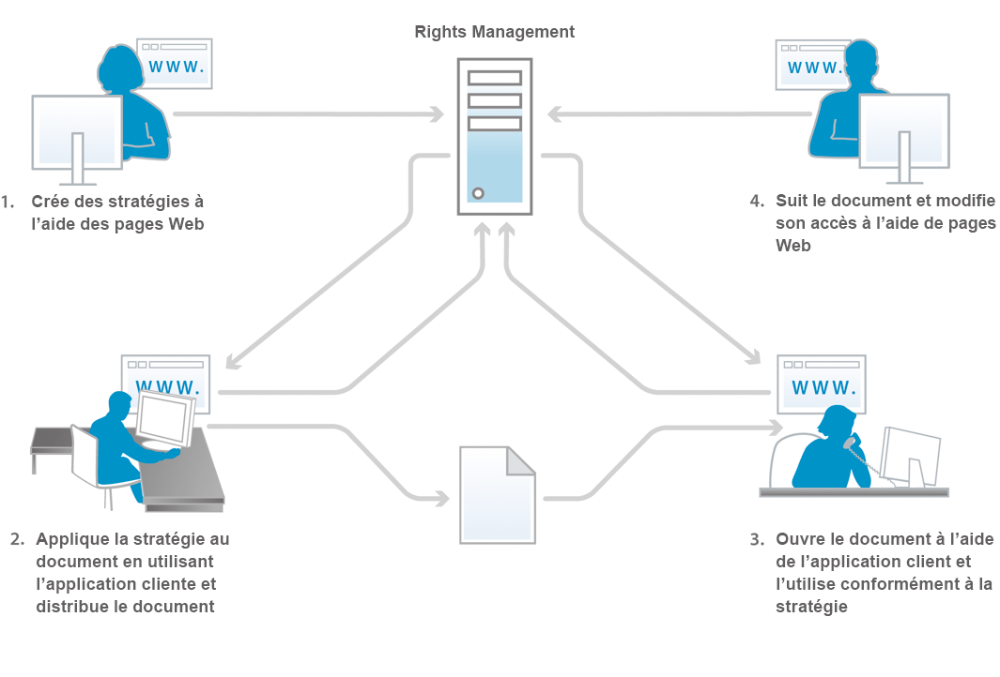
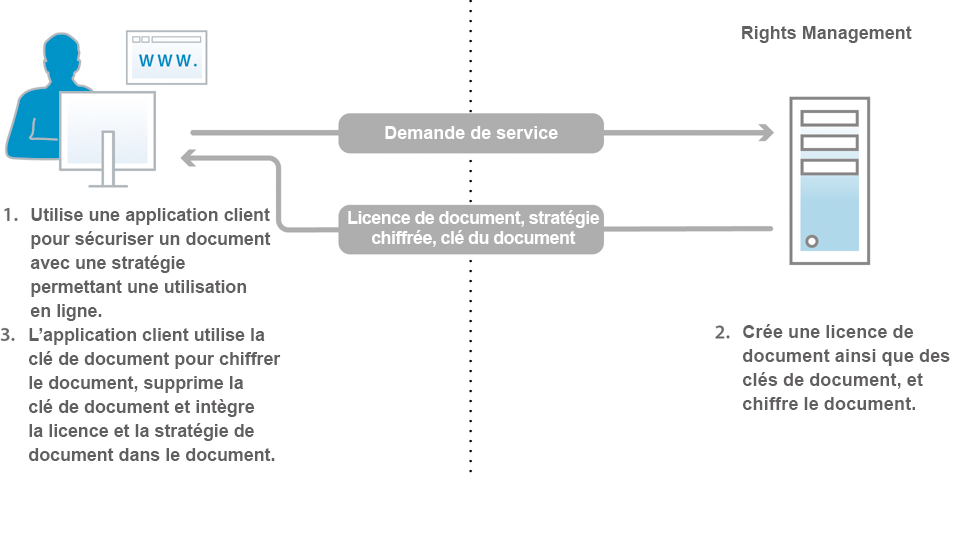
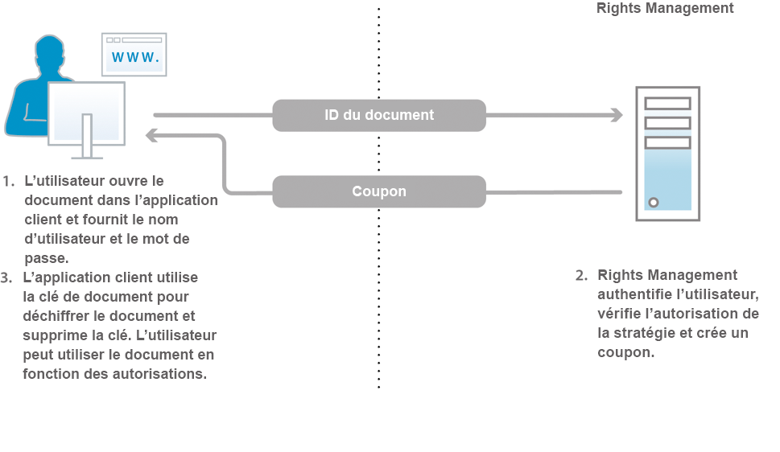

# À propos de Document Security {#about-document-security}

Grâce à Document Security, seuls les utilisateurs autorisés peuvent utiliser vos documents. Document Security vous permet de distribuer en toute sécurité toute information enregistrée sous un format pris en charge. Les formats de fichiers pris en charge sont :

* Les fichiers Adobe PDF
* Les fichiers Microsoft® Word, Excel et PowerPoint

Pour plus d’informations sur la façon dont les stratégies protègent les types de fichiers pris en charge, voir [Informations complémentaires sur Document Security](https://www.adobe.com/go/learn_aemforms_doc_security_63).

Avec Document Security, vous pouvez facilement créer, stocker et appliquer des paramètres de confidentialité prédéfinis à vos documents. Pour empêcher toute diffusion incontrôlée d’informations, vous pouvez également vérifier et contrôler la façon dont les destinataires utilisent les documents que vous leur avez distribués.

Vous pouvez protéger les documents à l’aide de stratégies. Une *stratégie* est un groupe d’informations comprenant des paramètres de confidentialité et une liste d’utilisateurs autorisés. Les paramètres de confidentialité que vous spécifiez dans une stratégie déterminent la mesure dans laquelle un destinataire peut utiliser un document auquel vous appliquez cette stratégie. Par exemple, vous pouvez spécifier si les destinataires sont autorisés à imprimer ou copier du texte, effectuer des modifications ou ajouter des signatures et des commentaires dans des documents protégés.

Les utilisateurs de Document Security créent des stratégies à l’aide de pages Web destinées aux utilisateurs finaux. Les administrateurs utilisent les pages Web de Document Security pour créer des jeux de stratégies contenant des stratégies partagées, accessibles à tous les utilisateurs autorisés.

Bien que les stratégies soient stockées dans Document Security, vous les appliquez aux documents par le biais de votre application cliente. Les modalités d’application des stratégies aux documents PDF sont décrites en détail dans l’*Aide d’Acrobat*. L’application de stratégies à l’aide d’autres applications, telles que Microsoft Office, est décrite dans l’*Aide des extensions d’Acrobat Reader DC* de l’application.

Lorsque vous appliquez une stratégie à un document, les paramètres de sécurité spécifiés dans la stratégie protègent les informations que le document contient. Les paramètres de confidentialité protègent également tout fichier (texte, audio ou vidéo) contenu dans un document PDF. Vous pouvez distribuer le document protégé par une stratégie, aux destinataires autorisés par la stratégie.

**Suivi des documents et contrôle d’accès aux documents**

En utilisant une stratégie pour protéger un document, vous maintenez un contrôle continu sur le document, même après sa distribution. Vous pouvez contrôler le document, modifier la stratégie, empêcher des utilisateurs d’accéder au document et changer la stratégie appliquée au document.

Grâce à Document Security, vous pouvez contrôler les documents protégés par une stratégie et assurer le suivi des événements, comme lorsqu’un utilisateur autorisé ou non tente d’ouvrir le document.

**Composants**

Document Security se compose d’un serveur et d’une interface utilisateur :

**Serveur :** composant central par l’intermédiaire duquel Document Security effectue des transactions telles que l’authentification des utilisateurs, la gestion en temps réel des stratégies et l’application de la confidentialité. Le serveur joue également le rôle de référentiel central pour les stratégies, les enregistrements de contrôle et d’autres informations associées.

**Pages Web :** interface vous permettant de créer des stratégies, de gérer vos documents protégés par une stratégie et de contrôler les événements associés aux documents protégés par une stratégie. Les administrateurs peuvent également configurer des options globales, telles que l’authentification des utilisateurs, le contrôle et l’envoi de messages aux utilisateurs invités et la gestion des comptes des utilisateurs invités.

Etapes représentées dans le schéma :

1. Le propriétaire du document crée des stratégies à l’aide des pages Web. Les propriétaires de documents peuvent créer des stratégies personnelles qui ne sont accessibles qu’à eux-mêmes. Les administrateurs et les coordinateurs de jeux de stratégies peuvent créer des stratégies partagées dans les jeux de stratégies qui sont accessibles aux utilisateurs autorisés.
1. Le propriétaire du document applique la stratégie, puis enregistre et diffuse le document. Le document peut être distribué par courrier électronique, via un dossier réseau ou sur un site Web.
1. Le destinataire du document ouvre le document dans l’application cliente voulue. Le destinataire peut utiliser le document conformément à sa stratégie.
1. Le propriétaire du document, le coordinateur de jeux de stratégies ou l’administrateur peut suivre les documents et modifier l’accès à ces derniers à l’aide des pages Web.

## À propos des utilisateurs de Document Security {#about-document-security-users}

Divers types d’utilisateurs recourent à Document Security pour accomplir différentes tâches :

* L’administrateur système ou un informaticien installe et configure Document Security. Cette personne peut également être chargée de la configuration des paramètres généraux du serveur, des pages Web, des stratégies et des documents.

   Ces options peuvent notamment inclure l’URL de base de Document Security, les notifications de contrôle et de confidentialité, les notifications d’enregistrement des utilisateurs invités et les périodes d’ouverture hors connexion par défaut.

* Les administrateurs de Document Security créent des stratégies et des jeux de stratégies, et gèrent les documents protégés par une stratégie pour les utilisateurs, selon les besoins. Ils créent également des comptes d’utilisateur invité et contrôlent les événements concernant le système, les documents, les stratégies, les jeux de stratégies ainsi que les événements personnalisés. Ils peuvent également être responsables de la configuration des paramètres généraux du serveur, des pages Web et des stratégies, conjointement avec un administrateur système.

   Les administrateurs peuvent affecter les rôles ci-après aux utilisateurs dans la zone Gestion des utilisateurs dans Administration Console. Les utilisateurs dotés de ces rôles exécutent leurs tâches dans la zone de l’interface utilisateur Document Security dans Administration Console.

   **Super-administrateur de Document Security**

   Les utilisateurs bénéficiant de ce rôle ont accès à tous les paramètres Document Security dans Administration Console. Ces autorisations sont associées au rôle :

   * Gestion de la configuration
   * Gestion de la stratégie
   * Gestion des jeux de stratégies
   * Gestion des documents
   * Gestion des éditeurs
   * Gestion des utilisateurs invités et locaux
   * Affichage des événements
   * Déléguer
   * Invitation d’utilisateurs externes

   **Administrateur de Document Security**

   Les utilisateurs bénéficiant de ce rôle peuvent configurer le serveur Document Security à l’aide de la page Configuration de la section Document Security dans Administration Console. Cette autorisation est associée au rôle Gestion de la configuration.

   >[!NOTE]
   >
   >Les utilisateurs bénéficiant de ce rôle doivent également disposer du rôle Utilisateur dans Administration Console pour être à même de se connecter à la console et de modifier les paramètres relatifs à la configuration.

   **Administrateur de jeu de stratégies Document Security**

   Les utilisateurs bénéficiant de ce rôle peuvent utiliser la section Document Security dans Administration Console pour modifier d’autres stratégies d’utilisateurs ainsi que pour créer, modifier et supprimer des jeux de stratégies. Lorsque l’administrateur d’un jeu de stratégies crée un jeu de stratégies, il peut affecter un coordinateur à ce jeu de stratégies. Ces autorisations sont associées au rôle :

   * Gestion de la stratégie
   * Gestion des jeux de stratégies
   * Gestion des documents
   * Gestion des éditeurs
   * Affichage des événements
   * Déléguer

   >[!NOTE]
   >
   >Les utilisateurs bénéficiant de ce rôle doivent également disposer du rôle Utilisateur dans Administration Console pour être à même de se connecter à la console et de modifier les paramètres relatifs à la configuration.

   **Gestion des utilisateurs invités et locaux**

   Les utilisateurs bénéficiant de ce rôle peuvent exécuter les tâches requises pour gérer tous les utilisateurs invités et locaux dans les pages Web Document Security appropriées. Ces autorisations sont associées au rôle :

   * Gestion des utilisateurs invités et locaux
   * Invitation d’utilisateurs externes
   * Accès aux pages Web destinées aux utilisateurs finaux

   >[!NOTE]
   >
   >Les utilisateurs bénéficiant de ce rôle doivent également disposer du rôle Utilisateur dans Administration Console pour être à même de se connecter à la console et de modifier les paramètres relatifs à la configuration.

   **Invitation d’un utilisateur de Document Security**

   les utilisateurs bénéficiant de ce rôle peuvent inviter des utilisateurs. Ces autorisations sont associées au rôle :

   * Invitation d’utilisateurs externes
   * Accès aux pages Web destinées aux utilisateurs finaux

   **Utilisateur final de Document Security**

   Les utilisateurs bénéficiant de ce rôle peuvent accéder aux pages Web Document Security destinées aux utilisateurs finaux. Ce rôle peut également être attribué aux administrateurs pour leur permettre de créer des stratégies à l’aide des pages destinées aux utilisateurs finaux. Cette autorisation est associée au rôle avec le rôle Accès aux pages Web destinées aux utilisateurs finaux.

* Les utilisateurs de l’entreprise qui possèdent des comptes Document Security valides créent leurs propres stratégies et utilisent des stratégies pour protéger des documents, contrôler et gérer leurs documents protégés par une stratégie et contrôler les événements concernant leurs documents.
* Les coordinateurs de jeux de stratégies gèrent les documents, affichent les événements et gèrent d’autres coordinateurs de jeux de stratégies (selon leurs autorisations). Les administrateurs désignent, parmi les utilisateurs, des coordinateurs pour certains jeux de stratégies.
* Les utilisateurs externes à l’entreprise (partenaires commerciaux, par exemple) peuvent utiliser les documents protégés par une stratégie s’ils figurent dans l’annuaire de Document Security, si l’administrateur leur crée un compte ou s’ils s’enregistrent dans Document Security par l’intermédiaire d’un processus automatisé d’invitation par courrier électronique. Selon le mode choisi par l’administrateur pour activer les paramètres d’accès, les utilisateurs invités peuvent également être autorisés à appliquer des stratégies à des documents, à créer, modifier et supprimer leurs stratégies, et à inviter d’autres utilisateurs externes à utiliser leurs documents protégés par une stratégie.
* Les développeurs utilisent le SDK d’AEM Forms pour intégrer des applications personnalisées à Document Security.

Les administrateurs de Document Security peuvent créer des rôles personnalisés à l’aide des autorisations ci-après dans Gestion des utilisateurs :

* Gestion de la configuration de Document Security
* Gestion des utilisateurs invités et locaux de Document Security
* Gestion des jeux de stratégies Document Security
* Gestion des jeux de stratégies Document Security
* Affichage des événements du serveur Document Security
* Modification du propriétaire d’une stratégie Document Security

## Stratégies et documents protégés par une stratégie  {#policies-and-policy-protected-documents}

Une *stratégie* définit un jeu de paramètres de confidentialité et d’utilisateurs habilités à accéder au document auquel la stratégie est appliquée. De plus, une stratégie permet de modifier dynamiquement les autorisations sur un document. Elle permet à la personne qui sécurise le document de modifier les paramètres de confidentialité, de révoquer l’accès au document ou de changer de stratégie.

La protection d’une stratégie peut être appliquée à un document PDF à l’aide d’Acrobat® Pro et d’Acrobat Standard. Elle peut également être appliquée à d’autres types de fichiers, tels que Microsoft Word, Excel et PowerPoint par le biais de l’application cliente, à condition que les extensions d’Acrobat Reader DC appropriées soient installées.

### Fonctionnement des stratégies  {#how-policies-work}

Les stratégies contiennent des informations sur les utilisateurs autorisés et les paramètres de confidentialité à appliquer aux documents. Les utilisateurs peuvent être des membres de votre entreprise, ainsi que des personnes extérieures qui possèdent un compte. Si l’administrateur active la fonction d’invitation d’utilisateur, il est même possible d’ajouter de nouveaux utilisateurs aux stratégies et de déclencher le processus d’envoi par courrier électronique d’une invitation à l’enregistrement.

Les paramètres de confidentialité d’une stratégie déterminent dans quelle mesure les destinataires peuvent utiliser le document. Par exemple, vous pouvez spécifier si les destinataires sont autorisés à imprimer ou copier du texte, effectuer des modifications ou ajouter des signatures et des commentaires dans des documents protégés. Une même stratégie peut également spécifier différents paramètres de confidentialité pour des utilisateurs spécifiques.

>[!NOTE]
>
>les paramètres de confidentialité appliqués par l’intermédiaire d’une stratégie ont priorité sur ceux qui peuvent avoir été appliqués à un document PDF dans Acrobat en utilisant les options de mot de passe ou de certificat (voir l’aide d’Acrobat pour plus d’informations).

Les utilisateurs et les administrateurs peuvent créer des stratégies par l’intermédiaire des pages Web de Document Security. Une seule stratégie à la fois peut être appliquée à un document. Les deux méthodes suivantes permettent d’appliquer une stratégie :

* Ouvrez le document dans Acrobat ou une autre application cliente et sélectionnez une stratégie pour protéger le document.
* Envoyez un document en tant que pièce jointe d’un courrier électronique dans Microsoft Outlook. Dans ce cas, vous pouvez sélectionner une stratégie dans la liste des stratégies ou choisir une stratégie générée automatiquement et créée par Acrobat avec un jeu de paramètres de confidentialité par défaut afin de ne protéger le document que pour les destinataires du courrier électronique.

Vous pouvez supprimer une stratégie d’un document à l’aide de l’application cliente.

Etapes représentées dans le schéma :

1. Le propriétaire du document sécurise le document à partir d’une application cliente prise en charge avec une stratégie qui autorise l’utilisation en ligne.
1. Document Security crée une licence de document ainsi que des clés de document, et chiffre la stratégie. La licence de document, la stratégie chiffrée et la clé du document sont renvoyées à l’application cliente.
1. Le document est chiffré avec la clé du document et cette dernière est rejetée. Le document intègre alors la licence et la stratégie. Ces tâches sont effectuées dans l’application cliente prise en charge.

Lorsque vous appliquez une stratégie à un document, les informations contenues dans le document, dont les fichiers (texte, audio ou vidéo) enregistrés dans le document PDF, sont protégées par les paramètres de confidentialité spécifiés dans la stratégie. Document Security génère une licence et des informations de chiffrement qui sont ensuite intégrées dans le document. Lorsque vous distribuez le document, Document Security peut authentifier les destinataires qui tentent d’ouvrir le document et autoriser l’accès en fonction des privilèges spécifiés dans la stratégie.

Si l’utilisation hors connexion est autorisée, les destinataires peuvent également utiliser hors connexion (sans être connectés à Internet ou au réseau) des documents protégés par une stratégie, pendant la période spécifiée dans la stratégie.

### Fonctionnement des documents protégés par une stratégie  {#how-policy-protected-documents-work}

Pour ouvrir et utiliser des documents protégés par une stratégie, cette dernière doit inclure votre nom en tant que destinataire et vous devez disposer d’un compte Document Security valide. Pour les documents PDF, vous devez disposer d’Acrobat ou d’Adobe Reader®. Pour les autres types de fichiers, vous devez disposer de l’application voulue et des extensions d’Adobe reader DC déjà installées.

Lorsque vous tentez d’ouvrir un document protégé par une stratégie, Acrobat, Adobe Reader ou les extension d’Acrobat Reader DC se connectent à Document Security pour vous authentifier. Ensuite, vous pouvez ouvrir une session. Si l’utilisation du document est contrôlée, un message de notification apparaît. Lorsque Document Security a déterminé les autorisations à accorder, il procède au déchiffrement du document. Vous pouvez ensuite utiliser le document conformément aux paramètres de confidentialité de la stratégie.

Etapes représentées dans le schéma :

1. L’utilisateur du document ouvre le document dans une application cliente prise en charge et s’authentifie auprès du serveur. L’identifiant du document est envoyé au serveur Document Security.
1. Document Security authentifie les utilisateurs, vérifie les autorisations de la stratégie et crée un coupon. Ce coupon (contenant la clé et les autorisations du document) est renvoyé à l’application cliente.
1. Le document est déchiffré avec la clé du document et celle-ci est rejetée. Le document peut ensuite être utilisé conformément aux paramètres de confidentialité spécifiés dans la stratégie. Ces tâches sont effectuées dans l’application cliente prise en charge.

Vous pouvez continuer à utiliser un document dans les conditions suivantes :

* indéfiniment ou pendant la période de validité spécifiée dans la stratégie ;
* jusqu’à ce que l’administrateur ou la personne ayant appliqué la stratégie révoque l’accès au document ou modifie la stratégie.

Vous pouvez également utiliser hors connexion (c’est-à-dire sans être connecté à Internet ou au réseau) les documents protégés par une stratégie, si la stratégie autorise l’accès hors connexion. Vous devez tout d’abord ouvrir une session Document Security pour synchroniser le document en ligne. Ensuite, vous pouvez utiliser le document pendant la durée d’ouverture hors connexion spécifiée dans la stratégie.

Lorsque la période d’ouverture hors connexion arrive à son terme, vous devez resynchroniser le document avec Document Security, soit en le remettant en ligne et en ouvrant un document protégé par une stratégie, soit en exécutant une commande dans l’application cliente (pour plus de précisions, consultez l’*Aide d’Acrobat* ou l’*Aide des extensions d’Acrobat Reader DC* appropriée).

Si vous enregistrez une copie d’un document protégé par une stratégie à l’aide de la commande Enregistrer ou Enregistrer sous, la stratégie est automatiquement appliquée au nouveau document. Les événements tels que les tentatives d’ouverture du nouveau document sont également contrôlés et enregistrés pour le document original.

## Jeux de stratégies  {#policy-sets}

Les *jeux de stratégies* regroupent plusieurs stratégies ayant une finalité commune. Ces jeux de stratégies sont ensuite rendus accessibles à un sous-groupe d’utilisateurs du système.

Chaque jeu de stratégies est associé à un coordinateur au moins. Le coordinateur de jeux de stratégies est un administrateur ou un utilisateur possédant des autorisations supplémentaires. Au sein de l’organisation, le *coordinateur de jeux de stratégies* est généralement la personne la plus à même de créer des stratégies dans un jeu donné.

Les coordinateurs de jeux de stratégie peuvent exécuter les tâches suivantes :

* créer des stratégies ;
* modifier et supprimer des stratégies dans un jeu de stratégies ;
* modifier des paramètres de jeux de stratégies ;
* ajouter et supprimer des coordinateurs de jeux de stratégies ;
* afficher des événements de stratégie et de document pour n’importe quel document ou stratégie du jeu de stratégies ;
* révoquer l’accès aux documents ;
* changer de stratégies pour le document.

Les jeux de stratégies sont créés et supprimés dans les pages Web d’administration de Document Security par des administrateurs et des coordinateurs de jeux de stratégies bénéficiant des autorisations requises.

Les jeux de stratégies sont généralement rendus accessibles à un nombre limité d’utilisateurs, par la spécification des utilisateurs ou groupes d’un domaine autorisés à se servir des stratégies du jeu de stratégies défini pour protéger des documents.

L’installation de Document Security crée un jeu de stratégies par défaut appelé *Jeu de stratégies global*. Ce jeu de stratégies est géré par l’administrateur ayant installé le logiciel.
