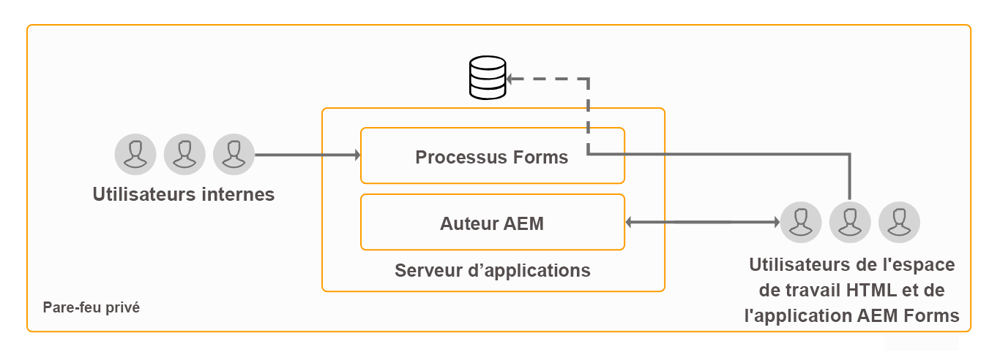
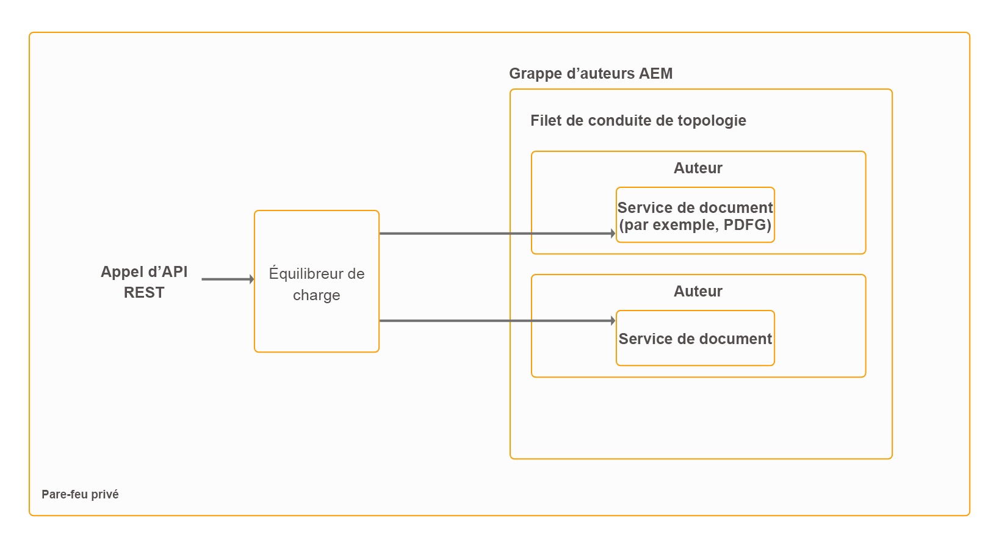

# Topologies d’architecture et de déploiement pour AEM Forms {#architecture-and-deployment-topologies-for-aem-forms}

## Architecture {#architecture}

AEM Forms est une application déployée dans AEM en tant que package AEM. Le package est appelé module complémentaire AEM Forms. Le module complémentaire AEM Forms contient à la fois des services (fournisseurs d’API), qui sont déployés dans le conteneur AEM OSGi, et des servlets ou JSP (qui offrent à la fois des fonctionnalités frontales et d’API REST) gérés par la structure Sling AEM. Le diagramme suivant illustre cette configuration:

L’architecture d’AEM Forms comprend les composants suivants :

* **Services AEM principaux :** services de base fournis par AEM à une application déployée. Ces services comprennent un référentiel de contenu compatible JCR, un conteneur de service OSGI, un moteur de workflow, un Trust Store, un magasin de clés, etc. Ces services sont accessibles par l’application AEM Forms mais ne sont pas fournis par les modules AEM Forms. Ces services font partie intégrante de la pile AEM globale et divers composants AEM Forms les utilisent.
* **Services Forms :** Proposez des fonctionnalités liées aux formulaires, telles que la création, l’assemblage, la distribution et l’archivage de documents PDF, l’ajout de signatures numériques pour limiter l’accès aux documents et le décodage de formulaires à code à barres. Ces services sont accessibles au public pour utilisation par le code personnalisé co-déployé dans AEM.
* **Couche Web :** JSP ou servlets, reposant sur les services communs et de formulaires, qui fournissent les fonctionnalités suivantes :

   * **Interface utilisateur frontale de création **: interface utilisateur de création et de gestion de formulaires pour créer et gérer des formulaires.
   * **Interface utilisateur frontale de rendu et de publication de formulaire** : interface utilisateur destinée à être utilisée par les utilisateurs finaux d’AEM Forms (par exemple, des citoyens accédant à un site Web gouvernemental). Ceci fournit des fonctionnalités de rendu de formulaire (affichage de formulaire dans un navigateur Web) et d’envoi.
   * **API REST **: les JSP et servlets exportent un sous-ensemble de services de formulaires à des fins d’utilisation distante par des clients HTTP appropriés, comme le kit SDK mobile des formulaires.

**AEM Forms sur OSGi :** Un AEM Forms sur un environnement OSGi est un AEM Author ou un AEM Publish standard avec un pack AEM Forms déployé dessus. You can run AEM Forms on OSGi in a [single server environment, Farm, and clustered setups](/help/sites-deploying/recommended-deploys.md). La configuration de la grappe est disponible uniquement pour les instances de AEM Author.

**AEM Forms sur JEE :** AEM Forms on JEE est un serveur AEM Forms s’exécutant sur la pile JEE. Il dispose d’un AEM Author avec des packages de modules complémentaires AEM Forms et d’autres fonctionnalités JEE AEM Forms co-déployées sur une pile JEE unique s’exécutant sur un serveur d’applications. Vous pouvez exécuter AEM Forms on JEE dans des configurations à serveur unique et en grappe. AEM Forms on JEE n’est nécessaire que pour exécuter la sécurité des documents, la gestion des processus et la mise à niveau vers les AEM Forms pour les clients LiveCycle. Voici quelques autres scénarios d’utilisation de AEM Forms on JEE :

* **Prise en charge de l’espace de travail HTML (pour les utilisateurs de l’espace de travail HTML) :** AEM Forms on JEE active l’authentification unique avec les instances de traitement, diffuse certains fichiers générés sur les instances de traitement et gère l’envoi de formulaires générés dans l’espace de travail HTML.
* **Traitement** avancé des données de communication interactives/formulaires supplémentaires : Les AEM Forms sur JEE peuvent être utilisés pour traiter en plus les données de communication interactives/de formulaire (et enregistrer les résultats dans un magasin de données approprié) dans des cas d’utilisation complexes où des fonctionnalités avancées de gestion de processus sont requises.

AEM Forms on JEE fournit également les services de prise en charge suivants aux composants AEM :

* **Gestion intégrée des utilisateurs :** Permet aux utilisateurs de AEM Forms sur JEE d’être reconnus comme des utilisateurs d’AEM forms on OSGi et aide à activer l’authentification unique pour les utilisateurs d’OSGi et de JEE. Ceci est nécessaire dans les cas où une authentification unique entre AEM forms on OSGi et AEM Forms on JEE est requise (par exemple, l’espace de travail HTML).
* **Hébergement de ressources :** Les AEM Forms sur JEE peuvent servir des ressources (par exemple, des formulaires HTML5) générées sur des AEM Forms sur OSGi.

L’interface utilisateur de création de AEM Forms ne prend pas en charge la création de Documents d’enregistrement (DOR), de PDF forms et de formulaires HTML5. Ces ressources sont conçues à l’aide de l’application autonome Forms Designer et téléchargées individuellement vers AEM Forms Manager. Vous pouvez également concevoir les formulaires pour AEM Forms on JEE sous la forme de ressources d’application (dans les outils AEM Forms) et les déployer sur le serveur AEM Forms on JEE.

Les AEM Forms sur OSGi et les AEM Forms sur JEE disposent tous deux de fonctionnalités de flux de travaux. Vous pouvez rapidement créer et déployer des workflows de base pour diverses tâches sur AEM forms on OSGi, sans avoir à installer la fonctionnalité de gestion des processus complète de AEM Forms on JEE. Les [fonctionnalités du flux de travaux orienté formulaire sur les AEM Forms sur OSGi et de la fonctionnalité de gestion des processus de AEM Forms sur JEE](capabilities-osgi-jee-workflows.md)diffèrent. Le développement et la gestion de workflows orientés formulaires sur des AEM Forms sur OSGi utilisent les fonctions familières de flux de travaux AEM et de boîte de réception AEM.

## Terminologies {#terminologies}

L’image suivante affiche diverses configurations de serveur AEM Forms et leurs composants utilisés dans un déploiement AEM Forms classique :

**Auteur :** une instance d’auteur est un serveur AEM Forms exécuté en mode d’exécution de création standard. Il peut s’agir d’un environnement AEM Forms on JEE ou AEM Forms on OSGi. Il est destiné aux utilisateurs internes, aux concepteurs de formulaires et de communication interactive, ainsi qu’aux développeurs. L’élément Publier active les fonctionnalités suivantes :

* **Création et gestion de formulaires et de communications interactives :** les concepteurs et développeurs peuvent créer et modifier des formulaires adaptatifs et des communications interactives, télécharger d’autres types de formulaires créés en externe, par exemple des formulaires créés dans Adobe Forms Designer, et gérer ces ressources à l’aide de la console de Gestionnaire de formulaires.
* **Publication de formulaires et de communications interactives :** les éléments hébergés sur une instance d’auteur peuvent être publiés sur une instance de publication pour exécuter des opérations d’exécution. La publication d’actifs utilise les fonctionnalités de réplication d’AEM. Adobe recommande qu’un agent de réplication soit configuré sur toutes les instances d’auteur pour transférer manuellement les formulaires publiés vers les instances de traitement, et qu’un autre agent de réplication soit configuré sur les instances de traitement avec le déclencheur *A réception* activé pour répliquer automatiquement les formulaires reçus afin de publier les instances.

**Publier :** Une instance de publication est un serveur AEM Forms s’exécutant en mode d’exécution Publier standard. Les instances de publication sont destinées aux utilisateurs finaux des applications de formulaires (par exemple, les utilisateurs accédant à un site Web public et envoyant des formulaires). L’élément Publier active les fonctionnalités suivantes :

* Rendu et envoi de formulaires pour les utilisateurs finaux.
* Transmission des données de formulaire brutes envoyées aux instances de traitement pour un traitement supplémentaire et le stockage dans le système d’enregistrements final. L’implémentation par défaut fournie dans AEM Forms effectue cette opération à l’aide de la fonctionnalité de réplication inverse d’AEM. Un autre type d’implémentation est également disponible pour transférer directement les données du formulaire aux serveurs de traitement au lieu de les enregistrer localement d’abord (cette dernière étape constituant un prérequis pour l’activation de la réplication inverse). Customers having concerns about storage of potentially sensitive data on publish instances can go in for this [alternative implementation](/help/forms/using/configuring-draft-submission-storage.md), since processing instances typically lie in a more secure zone.
* Rendu et envoi de communications et de lettres interactives : Une communication et une lettre interactives sont rendues sur les instances de publication et les données correspondantes sont envoyées aux instances de traitement pour enregistrement et post-traitement. Les données peuvent être sauvegardées localement sur une instance de publication et traitées par réplication inverse vers une instance de traitement (l’option par défaut) ultérieurement, ou directement transférées vers l’instance de traitement sans enregistrement sur l’instance de publication. Cette dernière implémentation est utile pour les clients soucieux de leur sécurité.

**Traitement :** instance de AEM Forms s’exécutant en mode d’exécution Auteur sans utilisateurs affectés au groupe Forms Manager. Vous pouvez déployer AEM Forms sur JEE ou AEM Forms sur OSGi en tant qu’instance de traitement. Les utilisateurs ne sont pas affectés pour s’assurer que les activités de création et de gestion de formulaires ne sont pas exécutées sur l’instance de traitement et se produisent uniquement sur l’instance d’auteur. Une instance de traitement permet les fonctionnalités suivantes :

* **Traitement des données de formulaire brutes provenant d’une instance de publication :** Cette opération est effectuée principalement sur une instance de traitement via les workflows AEM qui se déclenchent à l’arrivée des données. Les workflows peuvent utiliser l’étape Modèle de données de formulaire fournie prêt à l’emploi pour archiver les données ou le document dans un magasin de données approprié.
* **Stockage sécurisé des données de formulaire :** l’élément Traitement fournit un référentiel derrière le pare-feu pour les données de formulaire brutes qui sont également isolées des utilisateurs. Ni les concepteurs de formulaires sur l’instance d’auteur, ni les utilisateurs finaux sur l’instance de publication ne peuvent accéder à ce référentiel.

   >[!NOTE]
   >
   > Adobe recommande d’utiliser un magasin de données tiers pour enregistrer les données traitées finales au lieu d’utiliser le référentiel AEM.

* **Enregistrement et post-traitement des données de correspondance provenant d’une instance de publication :** Les workflows AEM effectuent le post-traitement facultatif des définitions de lettre correspondantes. Ces processus peuvent enregistrer les données finales traitées dans des magasins de données externes appropriés.

* **Hébergement** de Workspace HTML : Une instance de traitement héberge le frontal de Workspace HTML. L’espace de travail HTML fournit l’interface utilisateur pour l’affectation de tâche/groupe associée pour les processus de révision et d’approbation.

Une instance de traitement est configurée pour s’exécuter en mode d’exécution Auteur, car :

* Elle active la réplication inverse des données de formulaire brutes d’une instance de publication. Le gestionnaire d&#39;enregistrement de données par défaut requiert la fonction de réplication inverse.
* Les Workflows AEM, qui sont le principal moyen de traiter les données de formulaire brutes provenant d’une instance de publication, sont recommandés pour s’exécuter sur un système de style auteur.

## Exemples de topologies physiques pour AEM Forms on JEE {#sample-physical-topologies-for-aem-forms-on-jee}

Les topologies AEM Forms on JEE recommandées ci-dessous s’adressent principalement aux clients qui effectuent une mise à niveau à partir de LiveCycle ou d’une version précédente de AEM Forms on JEE. Adobe recommande l&#39;utilisation de AEM Forms sur OSGi pour les nouvelles installations. Une nouvelle installation de AEM Forms on JEE n’est recommandée que pour l’utilisation des fonctionnalités Document Security et Process Management.

### Topologie d’utilisation des services de document ou des fonctionnalités de sécurité des documents {#topology-for-using-document-services-or-document-security-capabilities}

Les clients AEM Forms prévoyant d’utiliser uniquement des services de document ou des fonctionnalités de sécurité des documents peuvent avoir une topologie similaire à celle affichée ci-dessous. Cette topologie recommande l’utilisation d’une seule instance de AEM Forms. Vous pouvez également créer une grappe ou une batterie de serveurs AEM Forms, si nécessaire. Cette topologie est recommandée lorsque la plupart des utilisateurs accèdent par programmation aux fonctionnalités du serveur AEM Forms et que l’intervention via l’interface utilisateur est minimale. La topologie s’avère utile pour le traitement par lots des opérations de document. Par exemple, utilisez le service de sortie pour créer quotidiennement des centaines de documents PDF non modifiables.

Bien que les AEM Forms vous permettent de configurer et d&#39;exécuter toutes les fonctionnalités à partir d&#39;un seul serveur, vous devez toutefois planifier la capacité, équilibrer la charge et configurer des serveurs dédiés pour des fonctionnalités spécifiques dans un environnement de production. Par exemple, pour un environnement qui utilise le service PDF Generator pour convertir des milliers de pages par jour et ajouter des signatures numériques afin de limiter l’accès aux documents, configurez des serveurs AEM Forms distincts pour le service PDF Generator et les fonctionnalités de signature numérique. Cela permet de fournir des performances optimales et de dimensionner les serveurs indépendamment les uns des autres.

### Topology for using AEM Forms process management {#topology-for-using-aem-forms-process-management}

Les clients AEM Forms qui prévoient d’utiliser des fonctions de gestion des processus AEM Forms, par exemple, Workspace HTML peut avoir une topologie similaire à celle affichée ci-dessous. Le serveur AEM Forms on JEE peut se trouver dans une configuration de serveur ou de grappe unique.

Si vous effectuez une mise à niveau à partir de LiveCycle ES4, cette topologie est étroitement liée à ce que vous avez déjà dans LiveCycle, à l’exception de l’ajout de AEM Author intégrés à AEM Forms on JEE. De plus, il n’y a pas de changement dans les exigences de mise en grappe pour les clients effectuant une mise à niveau. Si vous utilisiez des AEM Forms dans un environnement organisé en grappes, vous pouvez continuer avec la même chose dans AEM Forms 6.5. Pour une nouvelle installation des AEM Forms de JEE pour l’utilisation de Workspace HTML, l’exécution de l’instance d’auteur AEM intégrée à l’environnement JEE est une autre exigence.

Le magasin de données de formulaire est un magasin de données tiers utilisé pour stocker les données traitées finales des formulaires et des communications interactives. Il s’agit d’un élément facultatif dans la topologie. Vous pouvez également choisir de configurer une instance de traitement et d’utiliser son référentiel comme système d’enregistrement final, si nécessaire.

La topologie est recommandée aux clients qui prévoient d’utiliser le serveur AEM Forms on JEE pour des fonctionnalités de gestion de processus (HTML Workspace) sans utiliser de post-traitement, de formulaires adaptatifs, de formulaires HTML5 et de fonctionnalités de communication interactive.

### Topologie d’utilisation des formulaires adaptatifs, formulaires HTML5, fonctionnalités de communication interactive {#topology-for-using-adaptive-forms-html-forms-interactive-communication-capabilities}

Les clients AEM Forms prévoyant d’utiliser les fonctionnalités de capture de données AEM Forms, par exemple, les formulaires adaptatifs, les formulaires HTML5 et les formulaires PDF, peuvent avoir une topologie similaire à celle présentée ci-dessous. Cette topologie est également recommandée pour l’utilisation des capacités de communication interactive des AEM Forms.

Vous pouvez apporter les modifications/personnalisations suivantes à la topologie suggérée ci-dessus :

* L’utilisation d’Workspace HTML et d’une application AEM Forms nécessite une instance d’auteur ou de traitement AEM. Vous pouvez utiliser l’instance de création AEM intégrée au serveur AEM Forms on JEE au lieu de configurer un serveur de création AEM externe supplémentaire.
* Un AEM Author ou une instance de traitement est requis uniquement pour les workflows Forms sur OSGi, les formulaires adaptatifs, Forms Portal et les communications interactives.
* l&#39;interface utilisateur de l&#39;agent de communication interactive est généralement exécutée au sein de l&#39;entreprise. Ainsi, vous pouvez conserver un serveur de publication pour l’interface utilisateur de l’agent dans le réseau privé.
* L’instance d’AEM forms on OSGi intégrée au serveur AEM Forms on JEE peut également exécuter des workflows orientés sur Forms sur OSGi et les dossiers de contrôle.

## Exemples de topologies physiques pour AEM Forms on OSGi {#sample-physical-topologies-for-using-aem-forms-on-osgi}

### Topology for data capture, interactive communication, Form-Centric Workflow on OSGi capabilities {#topology-for-data-capture-interactive-communication-form-centric-workflow-on-osgi-capabilities}

Les clients AEM Forms prévoyant d’utiliser les fonctionnalités de capture de données AEM Forms, par exemple, les formulaires adaptatifs, les formulaires HTML5 et les formulaires PDF, peuvent avoir une topologie similaire à celle présentée ci-dessous. Cette topologie est également recommandée pour l’utilisation de la fonctionnalité de communications interactives et de processus basés sur l’utilisation de Forms on OSGi, par exemple pour utiliser la boîte de réception AEM et l’application AEM Forms pour les flux de processus métier.

### Topologie d’utilisation des fonctionnalités de dossier de contrôle pour le traitement par lots hors ligne {#topology-for-using-watched-folder-capabilities-for-offline-batch-processing}

Les clients AEM Forms qui envisagent d’utiliser des dossiers de contrôle pour le traitement par lots peuvent avoir une topologie similaire à celle affichée ci-dessous. La topologie affiche un environnement organisé en grappes, mais vous décidez d’utiliser une instance unique ou une batterie de serveurs AEM Forms en fonction de la charge. La source de données tierce est votre propre système d’enregistrement. Il agit comme une source d’entrée pour les dossiers de contrôle. La topologie affiche également la sortie sous la forme d’un fichier imprimé. Vous pouvez également stocker le contenu de sortie dans un système de fichiers, l’envoyer par courrier électronique et utiliser d’autres méthodes personnalisées pour utiliser les résultats.

### Topologie d’utilisation des fonctionnalités des services de document pour le traitement hors ligne basé sur l’API {#topology-for-using-document-services-capabilities-for-offline-api-based-processing}

Les clients AEM Forms prévoyant d’utiliser uniquement la fonctionnalité de services de document peuvent avoir une topologie similaire à celle affichée ci-dessous. Cette topologie recommande d’utiliser une grappe de serveurs AEM Forms on OSGi. Cette topologie est recommandée lorsque la plupart des utilisateurs accèdent par programmation aux fonctionnalités du serveur AEM Forms (à l’aide d’API) et que l’intervention via l’interface utilisateur est minimale. La topologie est très utile dans plusieurs cas de logiciels clients. Par exemple, plusieurs clients utilisant le service PDF Generator pour créer des documents PDF à la demande.

Bien qu’AEM Forms vous permette de configurer et d’exécuter toutes les fonctionnalités à partir d’un seul serveur, vous devez planifier la capacité, équilibrer la charge et configurer des serveurs dédiés pour des fonctionnalités spécifiques dans un environnement de production. Par exemple, pour un environnement utilisant le service PDF Generator pour convertir des milliers de pages par jour et plusieurs formulaires adaptatifs pour capturer des données, configurez des serveurs AEM Forms distincts pour le service PDF Generator et les fonctionnalités de formulaires adaptatifs. Cela permet de fournir des performances optimales et de dimensionner les serveurs indépendamment les uns des autres.

