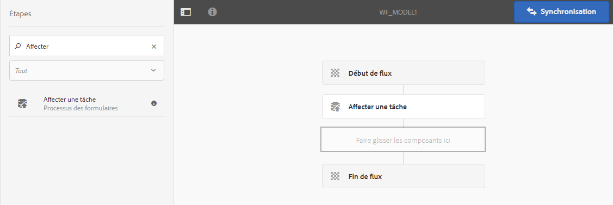
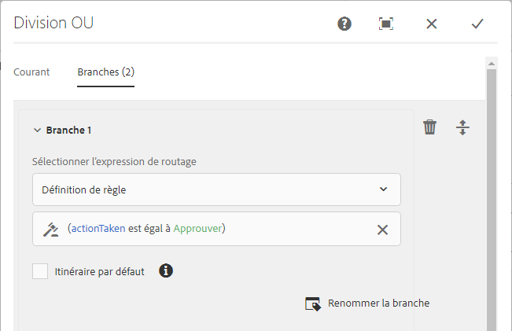
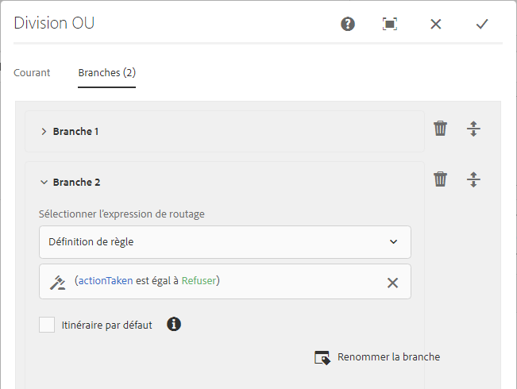
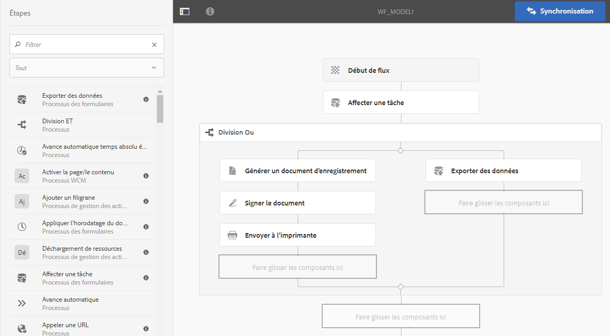

# Processus basé sur l’utilisation de Forms sur OSGi{#forms-centric-workflow-on-osgi}

Les entreprises collectent les données à partir de centaines, voire de milliers de formulaires, de différents systèmes principaux et de sources de données en ligne ou hors ligne. Elles disposent également d’un ensemble dynamique d’utilisateurs pour prendre des décisions concernant les données, qui impliquent les processus de révision et d’approbation itératifs.

Avec les processus de révision et d’approbation pour les publics internes et externes, les grandes entreprises sont soumises à des tâches répétitives : par exemple, la conversion d’un document PDF dans un autre format. Ces tâches prennent beaucoup de temps et mobilisent un grand nombre de ressources lorsqu’elles sont effectuées manuellement. Les entreprises ont également des obligations légales consistant à signer numériquement un document et à archiver des données de formulaire pour une utilisation ultérieure dans des formats prédéfinis..

## Présentation du processus basé sur l’utilisation de Forms sur OSGi {#introduction-to-forms-centric-workflow-on-osgi}

Vous pouvez utiliser des processus AEM pour créer rapidement des processus basés sur des formulaires adaptatifs. Ces processus peuvent être utilisés pour la révision et l’approbation, les flux de processus d’entreprise, le démarrage de Documents Services, l’intégration du processus de signature Adobe Sign et des opérations similaires : par exemple, le traitement de l’application de cartes de crédit, les processus d’approbation de congés des employés et l’enregistrement d’un formulaire en tant que document PDF. De plus, ces processus peuvent être utilisés dans une entreprise ou sur le pare-feu réseau.

Avec le processus basé sur l’utilisation de Forms sur OSGi, vous pouvez rapidement créer et déployer des processus pour différentes tâches sur la pile OSGi, sans avoir à installer la fonctionnalité Process Management complète sur la pile JEE. Le développement et la gestion des processus utilisent les fonctionnalités de boîte de messagerie AEM et AEM Workflow habituelles. Les processus forment la base de l’automatisation des processus réels d’entreprise, qui s’étendent sur plusieurs systèmes logiciels, réseaux, services et même organisations.

Une fois configurés, ces processus peuvent être déclenchés manuellement pour terminer une exécution ou un processus défini par programmation lorsque les utilisateurs envoient un formulaire ou une lettre [Correspondence Management](/help/forms/using/cm-overview.md). Avec des fonctionnalités AEM Workflow améliorées, AEM Forms offre deux fonctionnalités distinctes mais similaires. Dans le cadre de votre stratégie de déploiement, vous devez décider laquelle vous convient le mieux. See a [comparison](../../forms/using/capabilities-osgi-jee-workflows.md) of the Forms-centric AEM Workflows on OSGi and Process Management on JEE. Moreover, for the deployment topology see, [Architecture and deployment topologies for AEM Forms](/help/forms/using/aem-forms-architecture-deployment.md).

Le processus basé sur l’utilisation de Forms sur OSGi étend la [boîte de messagerie AEM](/help/sites-authoring/inbox.md) et fournit des composants supplémentaires (étapes) pour que l’éditeur du processus AEM ajoute la prise en charge des processus AEM basés sur l’utilisation de Forms. La boîte de messagerie AEM étendue dispose de fonctionnalités similaires à celles de l’[espace de travail AEM Forms](../../forms/using/introduction-html-workspace.md). Avec la gestion des processus basés sur les utilisateurs (approbation, révision, etc.), vous pouvez utiliser des processus AEM pour automatiser les opérations liées à [Document Services](/help/sites-developing/workflows-step-ref.md) (par exemple, la génération de PDF) et à la signature de documents (Adobe Sign) par voie électronique.

Toutes les étapes du processus AEM Forms prennent en charge l’utilisation de variables. Les variables permettent aux étapes du flux de travail de conserver et de transmettre les métadonnées entre les étapes au moment de l’exécution. Vous pouvez créer différents types de variables pour stocker différents types de données. Vous pouvez également créer des collections de variables (tableaux) pour stocker plusieurs instances de données identiques associées. En règle générale, vous utilisez une variable ou une collection de variables lorsque vous devez prendre une décision en fonction de la valeur qu’elle contient ou pour stocker des informations dont vous aurez besoin ultérieurement dans un processus. Pour plus d’informations sur l’utilisation de variables dans ces composants (étapes) de flux de travaux orientés Forms, voir Flux de travaux centrés sur [Forms sur OSGi - Guide de référence](../../forms/using/aem-forms-workflow-step-reference.md)des étapes. Pour plus d’informations sur la création et la gestion des variables, voir [Variables dans le](../../forms/using/variable-in-aem-workflows.md)AEM.

Le diagramme suivant illustre le processus complet de création, d’exécution et contrôle d’un processus basé sur l’utilisation de Forms sur OSGi.

## Avant de commencer {#before-you-start}

* Un processus est une représentation d’un processus réel d’entreprise. Conservez votre processus réel d’entreprise et répertoriez les participants du processus d’entreprise qui sont prêts. Par ailleurs, préparez les éléments associés (formulaires adaptatifs, documents PDF, etc.) avant de créer un processus.
* Un processus peut se composer de plusieurs étapes. Ces étapes sont répertoriées dans la boîte de réception AEM et facilitent la progression de rapport du processus. Divisez votre processus d’entreprise en étapes logiques.
* Vous pouvez configurer l’étape de tâche affectée des processus AEM pour envoyer des notifications électroniques aux utilisateurs ou aux personnes désignées. Ainsi, [autorisez les notifications électroniques](#configure-email-service).
* Un processus peut également utiliser Adobe Sign pour les signatures numériques. Si vous envisagez d’utiliser Adobe Sign dans un processus, [ configure Adobe Sign pour AEM Forms](../../forms/using/adobe-sign-integration-adaptive-forms.md) avant de l’utiliser dans un processus.

## Créer un modèle de processus {#create-a-workflow-model}

Un modèle de processus se compose de la logique et du flux d’un processus d’entreprise. Il se compose d’une série d’étapes. Ces étapes sont des composants d’AEM. Vous pouvez étendre les étapes de processus avec des paramètres et des scripts pour proposer davantage de fonctionnalités et de contrôle, selon les besoins. AEM Forms fournit quelques étapes supplémentaires par rapport aux étapes AEM prêtes à l’emploi. Pour obtenir la liste détaillée des étapes AEM et AEM Forms, consultez [Référence sur les étapes de processus AEM](/help/sites-developing/workflows-step-ref.md) et [Référence sur les étapes du processus basé sur l’utilisation de Forms on OSGi](../../forms/using/aem-forms-workflow.md).

AEM fournit une interface utilisateur intuitive pour créer un modèle de processus en suivant les étapes de processus fournies. Pour des instructions détaillées pour créer un modèle de processus, voir [Création de modèles de processus](/help/sites-developing/workflows-models.md). L’exemple suivant fournit des instructions détaillées pour créer un modèle de processus pour un processus d’approbation et de révision :

>[!NOTE]
>
>Vous devez être membre du groupe d’éditeurs de processus pour créer ou modifier un modèle de processus.

### Création d’un modèle pour un processus d’approbation et de révision {#create-a-model-for-an-approval-and-review-workflow}

Le processus d’approbation et de révision est destiné aux tâches qui nécessitent une intervention humaine pour une prise de décisions. L’exemple suivant crée un modèle de processus pour une demande de prêt immobilier à remplir par un conseiller bancaire. Une fois remplie, la demande est envoyée pour approbation. Par la suite, la demande approuvée est envoyée au demandeur pour signature électronique à l’aide d’Adobe Sign.

L’exemple est disponible en tant que package joint ci-dessous. Importez et installez l’exemple à l’aide du gestionnaire de package. Vous pouvez également effectuer les opérations suivantes afin de créer manuellement le modèle de processus de la demande :

Cet exemple crée un modèle de processus pour une demande de prêt immobilier à remplir par un conseiller bancaire. Une fois remplie, la demande est envoyée pour approbation. Par la suite, la demande approuvée est envoyée au client pour les signatures électroniques à l’aide d’Adobe Sign. Vous pouvez importer et installer l’exemple à l’aide du gestionnaire de package.

[Obtenir le fichier](assets/example-mortgage-loan-application.zip)

1. Ouvrez la console Modèles de processus. L’URL par défaut est `https://[server]:[port]/libs/cq/workflow/admin/console/content/models.html/etc/workflow/models`
1. Sélectionnez **Create** (Créer), puis **Creat Model** (Créer un modèle). La boîte de dialogue Add Workflow Model (Ajouter un modèle de processus) s’ouvre.
1. Saisissez **Title** (Titre) et **Name** (Nom) (facultatif). par exemple, une demande de prêt immobilier. Appuyez sur **Done** (Terminé). 
1. Sélectionnez le processus nouvellement créé et cliquez sur **Modifier**. Désormais, vous pouvez ajouter des étapes de processus pour créer une logique d’entreprise. Lorsque vous créez un modèle de processus pour la première fois, il contient :

   * les étapes : Début du processus et Fin du processus. Ces étapes définissent le début et la fin du processus. Ces étapes sont obligatoires et ne peuvent pas être modifiées ou supprimées.
   * Exemple d’étape Participant nommée Etape 1.  Cette étape est configurée pour affecter un élément de travail à l’utilisateur administrateur. Supprimez cette étape.

1. Activez les notifications électroniques. Vous pouvez configurer le flux de travail centré sur Forms sur OSGi pour envoyer des notifications par courrier électronique aux utilisateurs ou aux personnes désignées. Effectuez les configurations suivantes pour activer les notifications électroniques :

   1. Accédez au gestionnaire de configuration AEM à l’adresse `https://[server]:[port]/system/console/configMgr`.
   1. Ouvrez la configuration du **[!UICONTROL Service de messagerie Day CQ]**. Spécifiez une valeur pour les champs **[!UICONTROL Nom d’hôte du serveur SMTP]**, **[!UICONTROL Port du serveur SMTP]** et **[!UICONTROL Adresse de l’expéditeur]**. Cliquez sur **[!UICONTROL Enregistrer]**.
   1. Ouvrez la configuration de **[!UICONTROL Day CQ Link Externalizer]**. Dans le champ **[!UICONTROL Domaines]**, spécifiez le nom de hôte /l’adresse IP et le numéro de port réels pour les instances locale, de l’auteur et de publication. Cliquez sur **[!UICONTROL Enregistrer]**.

1. Créez des étapes de processus. Un processus peut se composer de plusieurs étapes. Ces étapes sont affichées dans la boîte de réception AEM et signalent la progression du processus.

   To define a stage, tap the  icon to open workflow model properties, open the **Stages** tab, add stages for the workflow model, and tap **Save &amp; Close**. Pour l’exemple de demande de prêt immobilier, créez des étapes : demande de prêt, état de la demande de prêt, documents à signer et document de prêt signé.

1. Drag-and-drop the **Assign Task** steps browser to the workflow model. Faites-en la première étape du modèle.

   Le composant de tâche affecte la tâche créée par processus à un utilisateur ou à un groupe. Lors de l’affectation de la tâche, vous pouvez utiliser le composant pour spécifier un formulaire adaptatif ou un fichier PDF non interactif pour la tâche. Le formulaire adaptatif est requis pour accepter une saisie des utilisateurs et un fichier PDF non interactif ou un formulaire adaptatif en lecture seule est utilisé pour les processus de révision uniquement.

   Vous pouvez également utiliser l’étape pour contrôler le comportement de la tâche. Par exemple, lors de la création d’un document d’enregistrement automatique, affectez la tâche à un utilisateur ou un groupe spécifique, le chemin des données envoyées, le chemin des données pré-renseignées et les actions par défaut. For detailed information about the options of the assign task step, see [Forms-centric workflow on OSGi - Step Reference](../../forms/using/aem-forms-workflow.md) document.

   

   Pour l’exemple de demande de prêt immobilier, configurez l’étape Affecter une tâche pour utiliser un formulaire adaptatif en lecture seule et afficher le document PDF une fois la tâche terminée. Par ailleurs, sélectionnez le groupe d’utilisateurs autorisé à approuver la demande de prêt. Dans l’onglet **Actions**, désactivez l’option **Envoyer**. Créez une variable **actionTaken** de type de données String et spécifiez la variable en tant que variable **Route**. par exemple, actionTaken. Ajoutez également les itinéraires Approuver et Refuser. Les itinéraires sont affichés sous forme d’actions distinctes (boutons) dans la boîte de réception AEM. Le processus sélectionne une branche en fonction de l’action (bouton) sélectionnée par l’utilisateur.

   Vous pouvez importer l’exemple de package, disponible au téléchargement au début de la section, pour l’ensemble complet de valeurs de tous les champs de l’étape Affecter une tâche configurée, par exemple la demande de prêt immobilier.

1. Faites glisser et déposez le composant Division OU de l’explorateur d’étapes vers le modèle de processus. La Division OU divise le processus et une seule branche est active par la suite. Cette étape vous permet d’ajouter des chemins de traitement conditionnels dans le workflow. Vous ajoutez des étapes de workflow à chaque branche selon vos besoins.

   Vous pouvez définir   pour une branche à l’aide d’une définition de règle, d’un script ECMA ou d’un script externe.

   Utilisez l’éditeur de  de  pour créer des de  pour les branches 1 et 2. Ces    vous aident à choisir une branche en fonction de l’action de l’utilisateur dans la boîte de réception AEM.

   **pour la branche 1**

   When a user taps **Approve** in AEM Inbox, Branch 1 is activated.

   

   **pour la branche 2**

   When a user taps **Reject** in AEM Inbox, Branch 2 is activated.

   

   Pour plus d’informations sur la création de    à l’aide de variables, voir [Variables dans le](../../forms/using/variable-in-aem-workflows.md)AEM Forms.

1. Ajoutez d’autres étapes de processus pour créer une logique d’entreprise.

   Pour l’exemple de prêt immobilier, ajoutez un document d’enregistrement généré, deux étapes Affecter une tâche et une étape de signature de document pour la Branche 1 du modèle, comme affiché dans l’image ci-dessous. Une étape Affecter une tâche consiste à afficher et envoyer des **documents de prêt à signer au demandeur** et un autre composant de tâche consiste à **afficher les documents signés**. Ajoutez également un composant Affecter une tâche à la branche 2. Elle est activée lorsqu’un utilisateur appuie sur Rejeter dans la boîte de réception AEM.

   Pour obtenir l’ensemble complet des valeurs de tous les champs des étapes Affecter une tâche, de l’étape Document d’enregistrement et de l’étape Signer le document configurées pour l’exemple de demande de prêt immobilier, importez l’exemple de package, disponible au téléchargement au début de cette section.

   Le modèle de processus est prêt. Vous pouvez lancer le processus via différentes méthodes. Pour plus de détails, voir [Lancement d’un processus basé sur l’utilisation de Forms sur OSGi](#launch).

   

## Créer une demande de processus basée sur l’utilisation de Forms {#create-a-forms-centric-workflow-application}

La demande est le formulaire adaptatif associé au processus. Lorsqu’une demande est envoyée via la boîte de réception, elle lance le processus associé. Pour rendre un processus Forms disponible en tant que demande dans la boîte de réception AEM et l’application AEM Forms, procédez comme suit pour créer une demande de processus :

>[!NOTE]
>
>Vous devez être membre du groupe administrateur-fd pour être en mesure de créer et de gérer les demandes de processus.

1. On your AEM author instance, go to  > **[!UICONTROL Forms]**> **[!UICONTROL Manage Workflow Application]** and taps **[!UICONTROL Create]**.
1. In the Create Workflow Application window, provide inputs for the following fields, and taps **Create**. Une nouvelle demande est créée et est répertoriée dans l’écran Demandes de processus.

<table>
 <tbody>
  <tr>
   <td>Field (Champ)</td>
   <td>Description</td>
  </tr>
  <tr>
   <td>Title (Titre)</td>
   <td>Le titre est visible dans la boîte de réception AEM et permet aux utilisateurs de sélectionner une demande. Assurez-vous qu’il soit descriptif. Par exemple, Demande d’ouverture de compte d’épargne.   </td>
  </tr>
  <tr>
   <td>Name (Nom) </td>
   <td>Indiquez le nom de la demande. Tous les caractères autres que les lettres, chiffres, tirets et traits de soulignement ont été remplacés par des tirets. </td>
  </tr>
  <tr>
   <td>Description</td>
   <td>La description est visible dans la boîte de réception AEM. Fournissez des informations détaillées sur la demande dans les champs de description. Par exemple, Objectif de la demande.  </td>
  </tr>
  <tr>
   <td>Formulaire adaptatif</td>
   <td>
Spécifiez le chemin d’un formulaire adaptatif. Lorsqu’un utilisateur commence une demande, le formulaire adaptatif spécifié est affiché.
 
<strong>Remarque :</strong> les demandes de processus ne prennent pas en charge les formulaires et documents PDF de plus d’une page ou qui nécessitent un défilement sur l’iPad d’Apple. Lorsqu’une demande est ouverte sur un iPad d’Apple et que la longueur du formulaire adaptatif ou du document PDF dépasse une page, les champs de formulaire et le contenu de la deuxième page sont perdus.
 </td>
  </tr>
  <tr>
   <td>Groupes d’accès</td>
   <td>
Sélectionnez un groupe. La demande est visible dans la boîte de réception AEM uniquement pour les membres du groupe sélectionné. L’option Accès au groupe permet de sélectionner tous les groupes du groupe d’utilisateurs du processus. 
   </td>
  </tr>
  <tr>
   <td>Service de préremplissage</td>
   <td>Sélectionnez un <a href="../../forms/using/prepopulate-adaptive-form-fields.md#aem-forms-custom-prefill-service" target="_blank">service de préremplissage</a> pour le formulaire adaptatif.  </td>
  </tr>
  <tr>
   <td>Modèle de processus</td>
   <td>Sélectionnez un <a href="../../forms/using/aem-forms-workflow.md#create-a-workflow-model">modèle de processus</a> pour la demande. Un modèle de processus se compose de la logique et du flux de processus d’entreprise. </td>
  </tr>
  <tr>
   <td>Chemin d’accès au fichier de données</td>
   <td>Spécifiez le chemin du fichier de données dans le référentiel crx. Le chemin est relatif à la charge utile de formulaire adaptatif et contient le nom du fichier de données. Intégrez toujours le nom complet du fichier, y compris son extension, le cas échéant. Par exemple, [charge utile]/data.xml. </td>
  </tr>
  <tr>
   <td>Chemin d’accès de la pièce jointe</td>
   <td>Spécifiez le chemin du fichier de pièces jointes dans le référentiel crx. Le chemin d’accès de la pièce jointe est relatif à l’emplacement de la charge utile. Par exemple, [charge utile]/data.xml. </td>
  </tr>
  <tr>
   <td>Chemin d’accès du document d’enregistrement</td>
   <td>Spécifiez le chemin d’accès du fichier Document d’enregistrement dans le référentiel crx. Le chemin est relatif à l’emplacement de la charge utile du formulaire adaptatif. Intégrez toujours le nom complet du fichier, y compris son extension, le cas échéant. Par exemple, [charge utile] /DOR/creditcard.pdf.</td>
  </tr>
 </tbody>
</table>

## Lancement d’un processus basé sur l’utilisation de Forms sur OSGi {#launch}

Vous pouvez lancer ou de déclencher un processus basé sur l’utilisation de Forms en :

* [Envoyant une demande depuis la boîte de réception AEM](#inbox)
* [Envoi d’une demande depuis l’application AEM Forms](#afa)

* [Envoyant un formulaire adaptatif](#af)
* [Utilisant le dossier de contrôle](#watched)

* [Envoyant une communication interactive ou une lettre](#letter)

### Envoi d’une demande depuis la boîte de réception AEM {#inbox}

La demande de processus que vous avez créée est disponible en tant qu’application dans la boîte de réception. Les utilisateurs qui sont membres du groupe d’utilisateurs de processus peuvent renseigner et envoyer la demande qui déclenche le processus associé. Pour plus d’informations sur l’utilisation de la boîte de réception AEM pour envoyer des demandes et gérer des tâches, voir [Gestion des applications et des tâches Forms dans la boîte de réception AEM](../../forms/using/manage-applications-inbox.md).

### Envoi d’une demande depuis l’application AEM Forms {#afa}

L’application AEM Forms se synchronise avec un serveur AEM Forms et vous permet de modifier les données de formulaire, les tâches, les demandes de processus et les informations enregistrées (brouillons/modèles) dans votre compte. For more information, see [AEM Forms app](/help/forms/using/aem-forms-app.md) and related articles.

### Envoyant un formulaire adaptatif {#af}

Vous pouvez configurer des actions d’envoi d’un formulaire adaptatif pour démarrer un processus lors de l’envoi du formulaire adaptatif. Les formulaires adaptatifs fournissent l’action d’envoi **Appeler un processus AEM** pour démarrer un processus lors de l’envoi d’un formulaire adaptatif. Pour obtenir des informations détaillées sur l’action d’envoi, voir [Configuration de l’action d’envoi](../../forms/using/configuring-submit-actions.md). Pour envoyer un formulaire adaptatif via l’application AEM Forms, activez la synchronisation avec l’application AEM Forms dans les propriétés du formulaire adaptatif.

Vous pouvez configurer la synchronisation, l’envoi et le déclenchement d’un processus depuis l’application AEM Forms. Pour plus de détails, consultez la section [Utilisation d’un formulaire](/help/forms/using/working-with-form.md).

### Utilisation d’un dossier de contrôle {#watched}

Un administrateur (un membre du groupe administrateur-fd) peut configurer un dossier réseau pour exécuter un processus préconfiguré lorsqu’un utilisateur y place un fichier (tel qu’un fichier PDF). Une fois que le processus est terminé, vous pouvez enregistrer le fichier de sortie dans un dossier de sortie spécifié. Un tel fichier est appelé [Dossier de contrôle](../../forms/using/watched-folder-in-aem-forms.md). Effectuez la procédure suivante pour configurer un dossier de contrôle afin de lancer un processus :

1. On your AEM author instance, go to  **>**[!UICONTROL Forms]**> Configure Watched Folder.** Une liste de dossiers de contrôle déjà configurés s’affiche.
1. Appuyez sur **[!UICONTROL Nouveau]**. Une liste des champs s’affiche. Spécifiez une valeur pour les champs suivants afin de configurer un dossier de contrôle pour un processus :

<table>
 <tbody>
  <tr>
   <td>Field (Champ)</td>
   <td>Description</td>
  </tr>
  <tr>
   <td>Nom</code></td>
   <td>Indiquez le nom du dossier de contrôle. Ce champ prend uniquement en charge les caractères alphanumériques.</td>
  </tr>
  <tr>
   <td>Chemin   </code></td>
   <td>Spécifiez l’emplacement physique du dossier de contrôle. Dans un environnement organisé en grappes, utilisez un dossier réseau partagé accessible à partir du noeud de la grappe AEM.</td>
  </tr>
  <tr>
   <td>Traiter les fichiers avec</code></td>
   <td>Select the Workflow </code>option. </code></td>
  </tr>
  <tr>
   <td>Modèle de processus</code></td>
   <td>Sélectionnez un modèle de processus.  </td>
  </tr>
  <tr>
   <td>Modèle de fichier de sortie</code></td>
   <td>Indiquez la structure de répertoires pour les fichiers de sortie et les répertoires. Vous pouvez également spécifier un <a href="/help/forms/using/admin-help/configuring-watched-folder-endpoints.md" target="_blank">modèle pour les fichiers de sortie et les répertoires</a>.</td>
  </tr>
 </tbody>
</table>

1. Appuyez sur **Avancé**. Specify a value for the following field and taps **Create**. Le dossier de contrôle est configuré pour lancer un processus. Désormais, chaque fois qu’un fichier est placé dans le répertoire d’entrée du dossier de contrôle, le processus spécifié est déclenché.

   | Field (Champ) | Description |
   |---|---|
   | Filtre de mappeur de charge | Lorsque vous créez un dossier de contrôle, il crée une structure de dossier dans le référentiel crx. La structure de dossier peut servir de charge utile au processus. Vous pouvez écrire un script pour mapper un processus AEM pour accepter les entrées de la structure du dossier de contrôle. Une implémentation prête à l’emploi est disponible et répertoriée dans le Filtre de mappeur de charge. Si vous ne disposez pas d’une implémentation personnalisée, choisissez l’implémentation par défaut. |

   L’onglet Avancé contient davantage de champs. La plupart de ces champs contiennent une valeur par défaut. Pour en savoir plus sur tous les champs, voir l’article [Création ou configuration d’un dossier de contrôle](/help/forms/using/admin-help/configuring-watched-folder-endpoints.md).

### Envoi d’une communication interactive ou d’une lettre {#letter}

Vous pouvez associer et exécuter un flux de travail Forms sur OSGi lors de l’envoi d’une communication interactive ou d’une lettre. Dans la gestion de la correspondance, les  sont utilisés pour les communications interactives et les lettres postérieures au traitement. par exemple, l’envoi de courriers électroniques, l’impression, la télécopie ou l’archivage des lettres finales. Pour les étapes détaillées, voir [Post-traitement des communications interactives et des lettres](../../forms/using/submit-letter-topostprocess.md).

## Autres configurations {#additional-configurations}

### Configuration du service de messagerie {#configure-email-service}

Vous pouvez utiliser les étapes Affecter une tâche et Envoyer un courrier électronique des processus AEM pour envoyer un courrier électronique. Effectuez les étapes suivantes pour spécifier les serveurs de messagerie et les autres configurations requises pour l’envoi de courriers électroniques :

1. Accédez au gestionnaire de configuration AEM à l’adresse `https://[server]:[port]/system/console/configMgr`.
1. Ouvrez la configuration du **[!UICONTROL Service de messagerie Day CQ]**. Spécifiez une valeur pour les champs **[!UICONTROL Nom d’hôte du serveur SMTP]**, **[!UICONTROL Port du serveur SMTP]** et **[!UICONTROL Adresse de l’expéditeur]**. Cliquez sur **[!UICONTROL Enregistrer]**.
1. Ouvrez la configuration de **[!UICONTROL Day CQ Link Externalizer]**. Dans le champ **[!UICONTROL Domaines]**, spécifiez le nom de hôte /l’adresse IP et le numéro de port réels pour les instances locale, de l’auteur et de publication. Cliquez sur **[!UICONTROL Enregistrer]**.

### Purge des instances de processus {#purge-workflow-instances}

Réduire le nombre d’instances de workflow améliore les performances du moteur de workflows. Vous pouvez donc purger régulièrement les instances de workflows terminées ou en cours d’exécution du référentiel. Pour plus d’informations, voir Purge [régulière des instances](/help/sites-administering/workflows-administering.md#regular) de flux de travail purge des instances de flux de travail.
