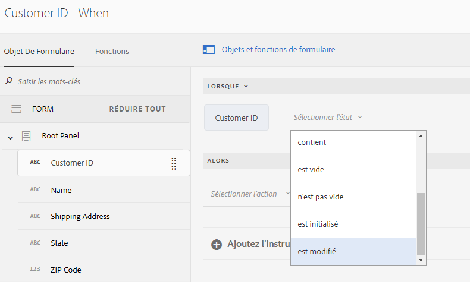
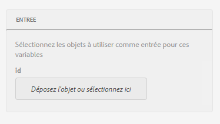
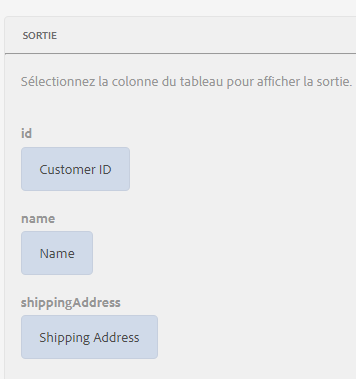
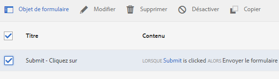
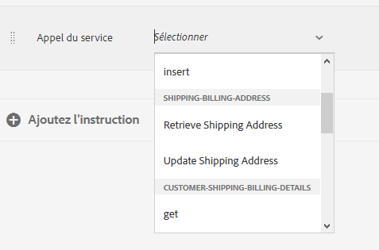
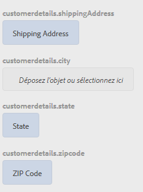

# Didacticiel : application de règles aux champs de formulaires adaptatifs {#tutorial-apply-rules-to-adaptive-form-fields}


Ce didacticiel est une étape de la série [Création de votre premier formulaire adaptatif](/help/forms/using/create-your-first-adaptive-form.md). Adobe recommande de suivre la série dans l’ordre chronologique pour comprendre, exécuter et démontrer le cas d’utilisation complet du didacticiel.

## À propos du didacticiel {#about-the-tutorial}

Vous pouvez utiliser des règles pour ajouter de l’interactivité, une logique d’entreprise et des validations intelligentes à un formulaire adaptatif. Les formulaires adaptatifs ont un éditeur de règles intégré. L’éditeur de règles offre une fonctionnalité de glisser-déposer, semblable aux visites guidées. L’option de glisser-déposer est la méthode la plus rapide et la plus simple pour créer des règles. L’éditeur de règles fournit également une fenêtre de code pour les utilisateurs intéressés par le test de leurs compétences de codage ou à par l’optimisation des règles.

Vous pouvez en savoir plus sur l’éditeur de règles dans [l’Éditeur de règles de formulaires adaptatifs](/help/forms/using/rule-editor.md).

À la fin du didacticiel, vous apprendrez à créer des règles pour :

* appeler un service de modèle de données de formulaire pour récupérer des données de la base de données ;
* appeler un service de modèle de données de formulaire pour ajouter des données à la base de données ;
* exécuter une vérification des validations et afficher les messages d’erreur.

Les images GIF interactives à la fin de chaque section du didacticiel vous aident à apprendre et à valider les fonctionnalités du formulaire que vous créez, à la volée. 

## Étape 1 : récupération d’un enregistrement client à partir de la base de données {#retrieve-customer-record}

Vous avez créé un modèle de données de formulaire en suivant l’article [Création d’un modèle de données de formulaire](/help/forms/using/create-form-data-model.md). Maintenant, vous pouvez utiliser l’éditeur de règles pour appeler les services de modèle de données de formulaire pour récupérer et ajouter des informations à la base de données.

Chaque client se voit attribuer un numéro d’ID de client unique, ce qui permet d’identifier les données client pertinentes dans une base de données. La procédure ci-dessous utilise l’ID de client pour récupérer les informations à partir de la base de données :

1. Ouvrez le formulaire adaptatif pour le modifier.

   [http://localhost:4502/editor.html/content/forms/af/change-billing-shipping-address.html](http://localhost:4502/editor.html/content/forms/af/change-billing-shipping-address.html)

1. Appuyez sur le champ **[!UICONTROL ID de client]** et appuyez sur l’icône **[!UICONTROL Modifier les règles]**. La fenêtre Éditeur de règles s’ouvre.
1. Appuyez sur l’icône **[!UICONTROL + Créer]** pour ajouter une règle. L’éditeur visuel s’ouvre.

   Dans Visual Editor, l&#39;instruction **[!UICONTROL WHEN]** est sélectionnée par défaut. En outre, l’objet de formulaire (dans ce cas, **[!UICONTROL ID de client]**) à partir duquel vous avez lancé l’éditeur de règles est spécifié dans l’instruction **[!UICONTROL WHEN]**.

1. Appuyez sur la liste déroulante **[!UICONTROL Sélectionner l’état]** et sélectionnez **[!UICONTROL est modifié]**.

   

1. Dans l’instruction **[!UICONTROL PUIS]**, sélectionnez **[!UICONTROL Appeler un service]** à partir du menu déroulant **[!UICONTROL Sélectionner une action.]**
1. Sélectionnez le service **[!UICONTROL Extraire l’adresse d’expédition]** dans le menu déroulant **[!UICONTROL Sélectionner]**.
1. Faites glisser le champ **[!UICONTROL ID client]** de l’onglet Objets de formulaire vers le champ **[!UICONTROL Déposez l’objet ou sélectionnez ici]** dans la zone **[!UICONTROL ENTRÉE]**.

   

1. Faites glisser et déposez le champ **[!UICONTROL ID client, nom, adresse d’expédition, état et code postal]** de l’onglet Objets de formulaire vers le champ **[!UICONTROL Déposez l’objet ou sélectionnez ici]** dans la zone **[!UICONTROL SORTIE]**.

   

   Appuyez sur **[!UICONTROL Terminé]** pour enregistrer la règle. Dans la fenêtre Éditeur de règles, appuyez sur **[!UICONTROL Fermer]**.

1. Prévisualisez le formulaire adaptatif. Entrez un ID dans le champ **[!UICONTROL ID client]**. Le formulaire peut maintenant récupérer les détails du client à partir de la base de données.

   

## Étape 2 : insertion de l’adresse client mise à jour dans la base de données {#updated-customer-address}

Une fois les détails du client extraits de la base de données, vous pouvez mettre à jour l’adresse de livraison, l’État et le code postal. La procédure ci-dessous appelle un service de modèle de données de formulaire pour mettre à jour les informations client dans la base de données :

1. Sélectionnez le champ **[!UICONTROL Envoyer]** et appuyez sur l’icône **[!UICONTROL Modifier les règles]**. La fenêtre Éditeur de règles s’ouvre.
1. Sélectionnez la règle **[!UICONTROL Envoyer - Cliquez sur]** et appuyez sur l&#39;icône **[!UICONTROL Modifier]**. Les options permettant de modifier la règle Envoi s’affichent.

   

   Dans l&#39;option WHEN, les options **[!UICONTROL Envoyer]** et **[!UICONTROL sont déjà sélectionnées en cliquant sur]**.

   

1. Dans l’option **[!UICONTROL PUIS]**, appuyez sur l’option **[!UICONTROL + Ajoutez l’instruction]**. Sélectionnez **[!UICONTROL Appel du service]** à partir du menu déroulant **[!UICONTROL Sélectionner l’action]**.
1. Sélectionnez le service **[!UICONTROL Mettre à jour l’adresse de livraison]** dans le menu déroulant **[!UICONTROL Sélectionner]**.

   

   

1. Faites glisser et déposez le champ **[!UICONTROL Adresse d’expédition, Etat et Code postal]** de l’onglet [!UICONTROL Objets de formulaire] vers la propriété .nom du tableau correspondant (par exemple, customerdetails .shippingAddress) du champ **[!UICONTROL Déposez l’objet ou sélectionnez ici]** dans la zone **[!UICONTROL INPUT]**. Tous les champs précédés d’un nom de table (par exemple, détails du client dans ce cas d’utilisation) servent de données d’entrée au service de mise à jour. Tout le contenu fourni dans ces champs est mis à jour dans la source de données.

   >[!NOTE]
   >
   >Ne faites pas glisser les champs **[!UICONTROL Nom]** et **[!UICONTROL ID de client]** vers la propriété tablename.correspondante (par exemple, customerdetails.name). Cela permet d’éviter de mettre à jour le nom et l’ID du client par erreur.

1. Glissez-déposez le champ **[!UICONTROL ID du client]** de l’onglet Objets de formulaire vers le champ ID dans la zone **[!UICONTROL ENTREE]**. Les champs sans nom de table prédéfini (par exemple, détails du client dans ce cas d’utilisation) servent de paramètre de recherche pour le service de mise à jour. Le champ **[!UICONTROL id]** dans cette affaire d&#39;utilisation identifie de manière unique un enregistrement dans la table **customerdetails**.
1. Appuyez sur **[!UICONTROL Terminé]** pour enregistrer la règle. Dans la fenêtre Éditeur de règles, appuyez sur **[!UICONTROL Fermer]**.
1. Prévisualisez le formulaire adaptatif. Récupérez les détails d’un client, mettez à jour l’adresse de livraison et envoyez le formulaire. Lorsque vous récupérez à nouveau les détails du même client, l’adresse de livraison mise à jour s’affiche.

## Étape 3 : (section bonus) utilisation de l’éditeur de code pour exécuter des validations et afficher les messages d’erreur  {#step-bonus-section-use-the-code-editor-to-run-validations-and-display-error-messages}

Vous devez exécuter la validation sur le formulaire pour vous assurer que les données saisies dans le formulaire sont correctes et qu’un message d’erreur s’affiche en cas de données incorrectes. Par exemple, si un ID client non existant est entré dans le formulaire, un message d’erreur doit s’afficher.

Les formulaires adaptatifs fournissent plusieurs composants avec des validations intégrées, par exemple, des champs d’adresse électronique et des champs numériques que vous pouvez utiliser pour les cas d’utilisation courants. Utilisez l’éditeur de règles pour les cas d’utilisation avancés, par exemple, pour afficher un message d’erreur lorsque la base de données renvoie zéro (0) enregistrement (aucun enregistrement).

La procédure suivante montre comment créer une règle pour afficher un message d’erreur si l’ID de client saisi dans le formulaire n’existe pas dans la base de données. La règle active et réinitialise également le champ **[!UICONTROL ID de client]**. La règle utilise [l’API dataIntegrationUtils du service de modèle de données de formulaire](/help/forms/using/invoke-form-data-model-services.md) pour vérifier si l’ID du client existe dans la base de données.

1. Appuyez sur le champ **[!UICONTROL ID de client]** et appuyez sur l’icône `Edit Rules`. La fenêtre [!UICONTROL Éditeur de règles] s&#39;ouvre.
1. Appuyez sur l’icône **[!UICONTROL + Créer]** pour ajouter une règle. L’éditeur visuel s’ouvre.

   Dans Visual Editor, l&#39;instruction **[!UICONTROL WHEN]** est sélectionnée par défaut. En outre, l’objet de formulaire (dans ce cas, **[!UICONTROL ID de client]**) à partir duquel vous avez lancé l’éditeur de règles est spécifié dans l’instruction **[!UICONTROL WHEN]**.

1. Appuyez sur la liste déroulante **[!UICONTROL Sélectionner l’état]** et sélectionnez **[!UICONTROL est modifié]**.

   

   Dans l’instruction **[!UICONTROL PUIS]**, sélectionnez **[!UICONTROL Appeler un service]** à partir du menu déroulant **[!UICONTROL Sélectionner une action.]**

1. Basculez de l’**[!UICONTROL éditeur visuel]** à l’**[!UICONTROL éditeur de code]**. Le contrôle du commutateur est sur le côté droit de la fenêtre. L’éditeur de code s’ouvre, affichant un code similaire à celui-ci :

   

1. Remplacez la section de variable d’entrée par le code suivant :

   ```javascript
   var inputs = {
       "id" : this
   };
   ```

1. Remplacez la section `guidelib.dataIntegrationUtils.executeOperation (operationInfo, inputs, outputs)` par le code suivant :

   ```javascript
   guidelib.dataIntegrationUtils.executeOperation(operationInfo, inputs, outputs, function (result) {
     if (result) {
         result = JSON.parse(result);
       customer_Name.value = result.name;
       customer_Shipping_Address = result.shippingAddress;
     } else {
       if(window.confirm("Invalid Customer ID. Provide a valid customer ID")) {
             customer_Name.value = " ";
            guideBridge.setFocus(customer_ID);
       }
     }
   });
   ```

1. Prévisualisez le formulaire adaptatif. Entrez un ID de client incorrect. Un message d’erreur s’affiche.

   

