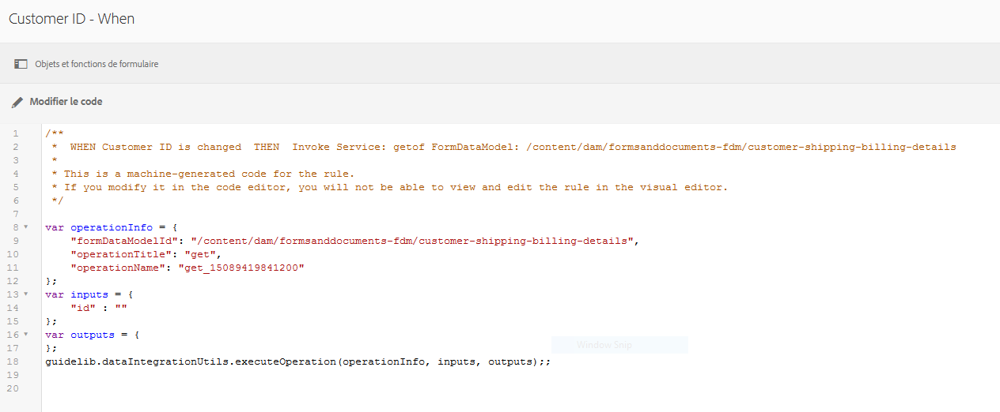

# Didacticiel : application de règles aux champs de formulaires adaptatifs {#tutorial-apply-rules-to-adaptive-form-fields}


Ce tutoriel fait partie de la série [Création de votre premier formulaire adaptatif](/help/forms/using/create-your-first-adaptive-form.md). Adobe recommande de suivre la série dans un ordre chronologique pour comprendre, exécuter et démontrer le cas d’utilisation complet du tutoriel.

## À propos du tutoriel {#about-the-tutorial}

Vous pouvez utiliser des règles pour ajouter de l’interactivité, une logique métier et des validations intelligentes à un formulaire adaptatif. Les formulaires adaptatifs disposent d’un éditeur de règles intégré. L’éditeur de règles propose une fonctionnalité de glisser-déposer, similaire aux visites guidées. La méthode glisser-déposer est la méthode la plus rapide et la plus simple pour créer des règles. L’éditeur de règles fournit également une fenêtre de code pour les utilisateurs qui souhaitent tester leurs compétences de codage ou passer les règles au niveau supérieur.

Pour en savoir plus sur l’éditeur de règles, voir [Éditeur de règles Adaptive Forms](/help/forms/using/rule-editor.md).

À la fin du didacticiel, vous apprendrez à créer des règles pour :

* Appeler un service de modèle de données de formulaire pour récupérer des données de la base de données
* Appeler un service de modèle de données de formulaire pour ajouter des données à la base de données
* exécuter une vérification des validations et afficher les messages d’erreur.

Les images GIF interactives à la fin de chaque section du didacticiel vous aident à apprendre et à valider les fonctionnalités du formulaire que vous créez, à la volée. 

## Étape 1 : récupération d’un enregistrement client de la base de données {#retrieve-customer-record}

Vous avez créé un modèle de données de formulaire en suivant la procédure suivante : [créer un modèle de données de formulaire](/help/forms/using/create-form-data-model.md) article. Vous pouvez désormais utiliser l’éditeur de règles pour appeler les services de modèle de données Forms afin de récupérer et d’ajouter des informations à la base de données.

Un numéro d’ID de client unique est attribué à chaque client, ce qui permet d’identifier les données client pertinentes dans une base de données. La procédure ci-dessous utilise l’ID de client pour récupérer les informations de la base de données :

1. Ouvrez le formulaire adaptatif pour le modifier.

   [http://localhost:4502/editor.html/content/forms/af/change-billing-shipping-address.html](http://localhost:4502/editor.html/content/forms/af/change-billing-shipping-address.html)

1. Sélectionnez la variable **[!UICONTROL ID de client]** et sélectionnez le champ **[!UICONTROL Modifier des règles]** Icône La fenêtre Éditeur de règles s’ouvre.
1. Sélectionnez la variable **[!UICONTROL + Créer]** pour ajouter une règle. Il ouvre l’éditeur visuel.

   Dans l’éditeur visuel, l’instruction **[!UICONTROL QUAND]** est sélectionnée par défaut. En outre, l’objet de formulaire (dans ce cas, **[!UICONTROL ID de client]**) d’où vous avez lancé l’éditeur de règles est spécifié dans l’instruction **[!UICONTROL QUAND]**.

1. Sélectionnez la variable **[!UICONTROL Sélectionner un état]** et sélectionnez **[!UICONTROL est modifié]**.

   

1. Dans le **[!UICONTROL ALORS]** instruction, sélectionnez **[!UICONTROL Appeler le service]** de la **[!UICONTROL Sélectionner une action]** menu déroulant.
1. Sélectionnez la variable **[!UICONTROL Récupérer l’adresse d’expédition]** du service **[!UICONTROL Sélectionner]** menu déroulant.
1. Faites glisser et déposez le champ **[!UICONTROL ID du client]** de l’onglet Objets de formulaire vers le champ **[!UICONTROL Déposer l’objet ou sélectionner ici]** dans la zone **[!UICONTROL ENTREE]**.

   

1. Faites glisser et déposez le champ **[!UICONTROL ID du client, Nom, Adresse d’expédition, État et Code postal]** de l’onglet Objets de formulaire vers le champ **[!UICONTROL Déposer l’objet ou sélectionner ici]** dans la zone **[!UICONTROL SORTIE]**.

   

   Sélectionner **[!UICONTROL Terminé]** pour enregistrer la règle. Dans la fenêtre de l’éditeur de règles, sélectionnez **[!UICONTROL Fermer]**.

1. Prévisualisez le formulaire adaptatif. Saisissez un identifiant dans la variable **[!UICONTROL ID de client]** champ . Le formulaire peut désormais récupérer les détails du client dans la base de données.

   

## Étape 2 : Ajout de l&#39;adresse client mise à jour à la base de données {#updated-customer-address}

Une fois les détails du client récupérés dans la base de données, vous pouvez mettre à jour l’adresse de livraison, l’état et le code postal. La procédure ci-dessous appelle un service de modèle de données de formulaire pour mettre à jour les informations client vers la base de données :

1. Sélectionnez la variable **[!UICONTROL Envoyer]** et sélectionnez le champ **[!UICONTROL Modifier des règles]** Icône La fenêtre Éditeur de règles s’ouvre.
1. Sélectionnez la variable **[!UICONTROL Envoyer - Clic]** et sélectionnez la règle **[!UICONTROL Modifier]** Icône Les options permettant de modifier la règle Envoi s’affichent.

   

   Dans l’option WHEN, les options **[!UICONTROL Envoi]** et **[!UICONTROL est activé]** sont déjà sélectionnées.

   

1. Dans le **[!UICONTROL ALORS]** , sélectionnez l’option **[!UICONTROL + Ajouter une instruction]** . Sélectionner **[!UICONTROL Appeler le service]** de la **[!UICONTROL Sélectionner une action]** menu déroulant.
1. Sélectionnez la variable **[!UICONTROL Mettre à jour l’adresse d’expédition]** du service **[!UICONTROL Sélectionner]** menu déroulant.

   

   

1. Faites glisser et déposez le champ **[!UICONTROL Adresse d’expédition, état et code postal]** de l’onglet [!UICONTROL Objets de formulaire] vers l’élément tablename.property correspondant (par exemple, customerdetails.shippingAddress) du champ **[!UICONTROL Déposer l’objet ou sélectionnez ici]** dans la zone **[!UICONTROL ENTRÉE]**. Tous les champs portant le préfixe tablename (par exemple, customerdetails dans ce cas d’utilisation) servent de données d’entrée pour le service de mise à jour. Tout le contenu fourni dans ces champs est mis à jour dans la source de données.

   >[!NOTE]
   >
   >Ne faites pas glisser les champs **[!UICONTROL Nom]** et **[!UICONTROL ID du client]** vers l’élément tablename.property correspondant (par exemple, customerdetails.name). Cela permet d’éviter de mettre à jour le nom et l’ID du client par erreur.

1. Glissez-déposez le champ **[!UICONTROL ID du client]** de l’onglet [!UICONTROL Objets de formulaire] vers le champ ID dans la zone **[!UICONTROL ENTREE]**. Les champs sans préfixe tablename (par exemple, customerdetails dans ce cas d’utilisation) servent de paramètre de recherche pour le service de mise à jour. Le champ **[!UICONTROL id]** dans ce cas d’utilisation identifie de manière unique un enregistrement dans la tableau **customerdetails**.
1. Sélectionner **[!UICONTROL Terminé]** pour enregistrer la règle. Dans la fenêtre de l’éditeur de règles, sélectionnez **[!UICONTROL Fermer]**.
1. Prévisualisez le formulaire adaptatif. Récupérez les détails d’un client, mettez à jour l’adresse de livraison et envoyez le formulaire. Lorsque vous récupérez à nouveau les détails du même client, l’adresse de livraison mise à jour s’affiche.

## Étape 3 : (section bonus) Utilisez l’éditeur de code pour exécuter des validations et afficher des messages d’erreur {#step-bonus-section-use-the-code-editor-to-run-validations-and-display-error-messages}

Vous devez exécuter la validation sur le formulaire pour vous assurer que les données saisies dans le formulaire sont correctes et qu’un message d’erreur s’affiche en cas de données incorrectes. Par exemple, si un ID de client non existant est saisi dans le formulaire, un message d’erreur s’affiche.

Les formulaires adaptatifs fournissent plusieurs composants avec des validations intégrées, par exemple, des champs de courrier électronique et numériques que vous pouvez utiliser pour des cas d’utilisation courants. Utilisez l’éditeur de règles pour les cas d’utilisation avancés, par exemple, pour afficher un message d’erreur lorsque la base de données renvoie zéro (0) enregistrement (aucun enregistrement).

La procédure suivante montre comment créer une règle pour afficher un message d’erreur si l’ID du client entré dans le formulaire n’existe pas dans la base de données. La règle met également l’accent sur le champ **[!UICONTROL ID du client]** et le réinitialise. La règle utilise [l’API dataIntegrationUtils du service de modèle de données de formulaire](/help/forms/using/invoke-form-data-model-services.md) pour vérifier si l’ID du client existe dans la base de données.

1. Sélectionnez la variable **[!UICONTROL ID de client]** et sélectionnez le champ `Edit Rules` Icône La fenêtre [!UICONTROL Éditeur de règles] s’ouvre.
1. Sélectionnez la variable **[!UICONTROL + Créer]** pour ajouter une règle. Il ouvre l’éditeur visuel.

   Dans l’éditeur visuel, l’instruction **[!UICONTROL QUAND]** est sélectionnée par défaut. En outre, l’objet de formulaire (dans ce cas, **[!UICONTROL ID de client]**) d’où vous avez lancé l’éditeur de règles est spécifié dans l’instruction **[!UICONTROL QUAND]**.

1. Sélectionnez la variable **[!UICONTROL Sélectionner un état]** et sélectionnez **[!UICONTROL est modifié]**.

   

   Dans le **[!UICONTROL ALORS]** instruction, sélectionnez **[!UICONTROL Appeler le service]** de la **[!UICONTROL Sélectionner une action]** menu déroulant.

1. Basculer depuis **[!UICONTROL Éditeur visuel]** to **[!UICONTROL Éditeur de code]**. La commande de commutation se trouve sur le côté droit de la fenêtre. L’éditeur de code s’ouvre, affichant du code similaire à ce qui suit :

   

1. Remplacez la section de variable d’entrée par le code suivant :

   ```javascript
   var inputs = {
       "id" : this
   };
   ```

1. Remplacez la section `guidelib.dataIntegrationUtils.executeOperation (operationInfo, inputs, outputs)` par le code suivant :

   ```javascript
   guidelib.dataIntegrationUtils.executeOperation(operationInfo, inputs, outputs, function (result) {
     if (result) {
         result = JSON.parse(result);
       customer_Name.value = result.name;
       customer_Shipping_Address = result.shippingAddress;
     } else {
       if(window.confirm("Invalid Customer ID. Provide a valid customer ID")) {
             customer_Name.value = " ";
            guideBridge.setFocus(customer_ID);
       }
     }
   });
   ```

1. Prévisualisez le formulaire adaptatif. Saisissez un ID de client incorrect. Un message d’erreur s’affiche.

   
