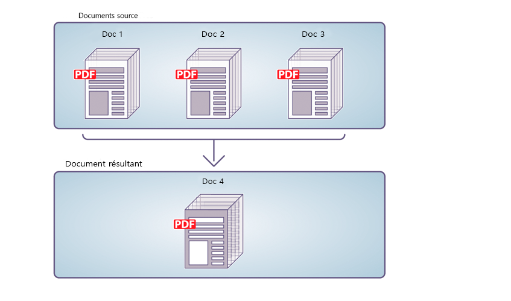
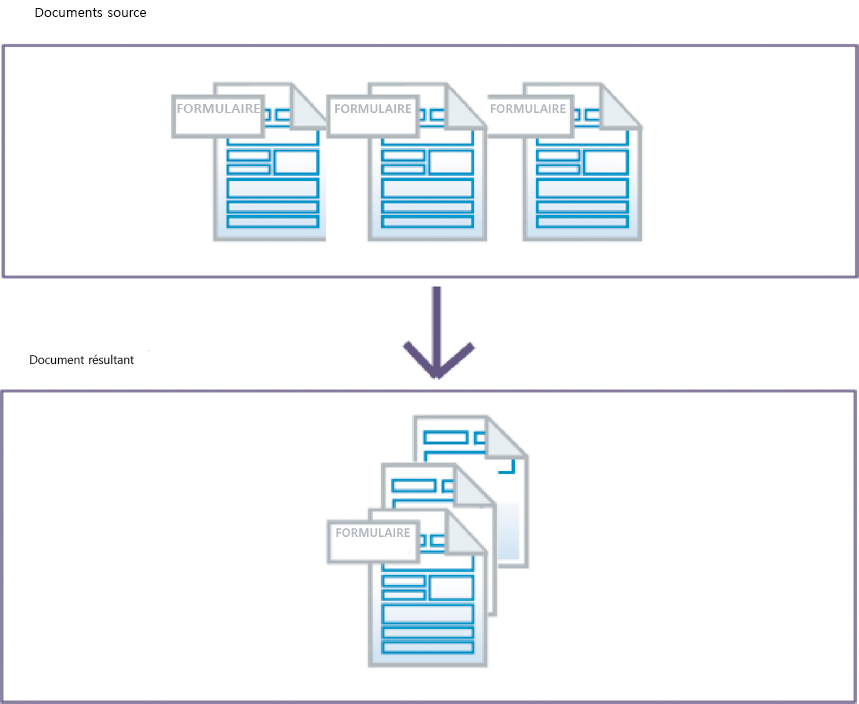
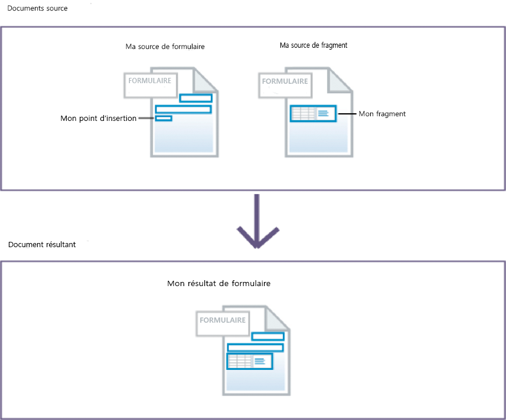
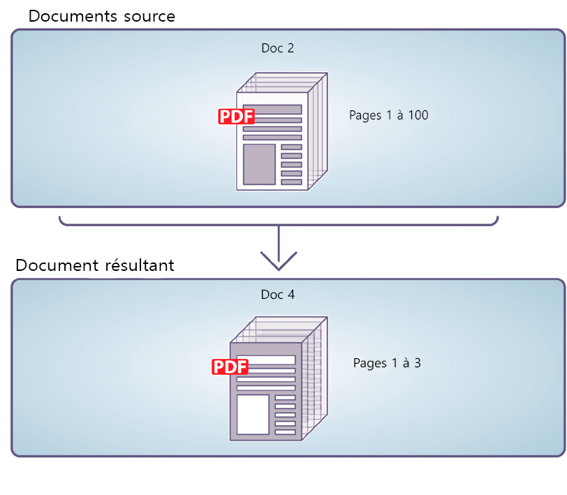
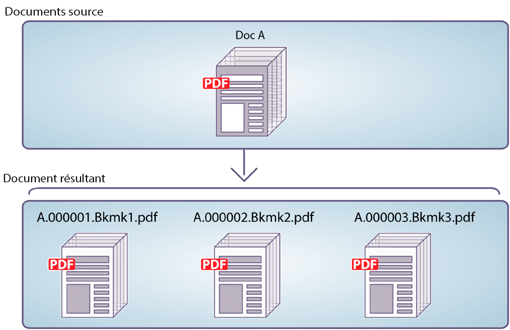

# Utilisation du Service Assembler{#using-assembler-service}

Le service Assembler vous permet de combiner, d’organiser et d’étendre vos documents aux formats PDF et XDP. Grâce à lui, vous pouvez également obtenir des informations sur les documents PDF. Chacun des travaux envoyés au service Assembler inclut un document DDX (Document Description XML), ainsi qu’un ensemble de documents source et de ressources externes (chaînes et graphiques). Pour plus d’informations sur le service Assembler, voir [Présentation du Service Assembler](../../forms/using/overview-aem-document-services.md#p-assembler-service-p).

Vous pouvez utiliser le service d’assemblage pour les opérations suivantes :

## Assemblage de documents PDF {#assemble-pdf-documents}

Vous pouvez utiliser le service Assembler pour assembler deux documents PDF ou plus en un seul document PDF ou portfolio PDF. Vous pouvez également appliquer différentes fonctions au document PDF, afin de faciliter la navigation ou d’optimiser la sécurité. Vous pouvez assembler des documents PDF de différentes manières, dont voici quelques exemples :

### Assemblage dans un document PDF unique {#assemble-a-simple-pdf-document}

L’illustration suivante présente la fusion de trois documents source en un seul document cible.



Assemblage d’un document PDF unique à de documents PDF multiples

L’exemple suivant représente un document DDX utilisé pour assembler ce document. Il spécifie les noms des documents source à utiliser pour produire le document cible, ainsi que le nom de ce document cible :

```xml
<PDF result="Doc4">
<PDF source="Doc1"/>
<PDF source="Doc2"/>
<PDF source="Doc3"/>
</PDF>
```

L&#39;assemblage de documents produit un document résultant qui contient le contenu suivant et\
caractéristiques :

* L’intégralité ou une partie de chacun des documents source ;
* L’intégralité ou une partie des signets de chacun des documents source, normalisés pour le document cible assemblé ;
* D’autres caractéristiques adoptées à partir du document de base (Doc1), telles que les métadonnées, les étiquettes de page et la taille des pages ;
* Le document produit peut inclure une table des matières générée à partir des signets présents dans les documents source (facultatif).

### Création d’un portfolio PDF  {#create-a-pdf-portfolio}

Le service Assembler peut créer des portfolios PDF qui contiennent une collection des documents et une interface d’utilisateur indépendante. Cette interface est appelée Interface de portfolio PDF ou Navigateur de portfolio PDF (navigateur). Les portfolios PDF élargissent les capacités des packages PDF en ajoutant un navigateur, des dossiers et des pages d’accueil. L’interface améliore l’expérience de l’utilisateur, qui peut profiter des chaînes de texte localisées, des schémas de couleurs et des ressources graphiques personnalisées. Le portfolio PDF peut également contenir des dossiers pour organiser les fichiers du portfolio.

Lorsque le service Assembler interprète le document DDX suivant, il regroupe un portfolio PDF qui inclut un navigateur de portfolio PDF et un package contenant deux fichiers. Le service récupère le navigateur à l’emplacement indiqué par la source myNavigator. Il change le schéma de couleur par défaut du navigateur, le remplaçant par pinkScheme.

```xml
<DDX xmlns="https://ns.adobe.com/DDX/1.0/">
<PDF result="Untitled 1">
<Portfolio>
<Navigator source="myNavigator"/>
<ColorScheme scheme="pinkScheme"/>
</Portfolio>
<PackageFiles>
<PDF source="sourcePDF1"/>
<PDF source="sourcePDF2"/>
</PackageFiles>
</PDF>
</DDX>
```

### Assemblage de documents chiffrés  {#assemble-encrypted-documents}

Lors de l’assemblage d’un document, vous pouvez également chiffrer le document PDF avec un mot de passe. Après le chiffrement d’un document PDF avec un mot de passe, l’utilisateur doit spécifier un mot de passe pour l’afficher dans Adobe Reader ou Acrobat. Pour chiffrer un document PDF avec un mot de passe, le document DDX doit contenir les valeurs d’élément de chiffrement requises.

Il n’est pas nécessaire que le service Encryption fasse partie de votre installation LiveCycle pour chiffrer un document PDF avec un mot de passe.

Si un ou plusieurs des documents d’entrée sont chiffrés, vous devez fournir un mot de passe pour ouvrir ce ou ces documents dans le DDX.

### Assemblage de documents à l’aide de la numérotation Bates  {#assemble-documents-using-bates-numbering}

Lors de l’assemblage d’un document, vous pouvez utiliser la numérotation Bates pour affecter un identifiant de page unique à chaque page. Avec la numérotation Bates, à chaque page du document (ou de l’ensemble de documents) correspond un numéro qui identifie la page de manière unique. Par exemple, des documents d’entreprise contenant une nomenclature et liés à la production d’un assemblage peuvent contenir un identifiant. Un numéro Bates contient une valeur numérique incrémentée séquentiellement et optionnellement un préfixe et un suffixe. L’ensemble préfixe + valeur numérique + suffixe est appelé modèle Bates.

L’illustration suivante présente un document PDF contenant un identifiant unique, situé dans l’en-tête du document.


Un document PDF qui contient un identifiant unique qui se trouve dans l’en-tête du document

### Aplatissement et assemblage de documents {#flatten-and-assemble-documents}

Vous pouvez utiliser le service Assembler pour transformer un document PDF interactif (par exemple, un formulaire) en document PDF non interactif. Un document PDF interactif permet aux utilisateurs de saisir ou de modifier des données contenues dans les champs de ce document. Le processus de transformation d’un document PDF interactif à un document PDF non interactif est appelé aplatissement. Lors de l’aplatissement, les champs des formulaires gardent leur apparence graphique mais ne sont plus interactifs. S’assurer que les données ne peuvent être modifiées est l’une des raisons de l’aplatissement d’un document PDF. De plus, les scripts associés aux champs ne fonctionnent plus.

Lorsque vous créez un document PDF assemblé à partir de documents PDF interactifs, le service Assembler aplatit ces formulaires avant de les assembler en un même document.

>[!NOTE]
>
>Le service Assembler utilise le service Output pour aplatir les formulaires XFA dynamiques. Si le service Assembler traite un DDX ayant besoin qu’il aplatisse un formulaire XFA dynamique et que le service Output n’est pas disponible, une exception est générée. Le service Assembler peut aplatir un formulaire ou un formulaire XFA statique sans utiliser le service Output.

## Assemblage de documents XDP  {#assemble-xdp-documents}

Vous pouvez utiliser le service Assembler pour assembler un ou plusieurs documents XDP en un document PDF ou XDP unique. Pour les fichiers XDP source incluant des points d’insertion, vous pouvez indiquer les fragments à insérer.

Vous pouvez assembler des documents XDP de différentes manières, dont quelques exemples se présentent ci-dessus :

### Assemblage d’un document XDP unique  {#assemble-a-simple-xdp-document}

L’illustration suivante présente la fusion de trois documents XDP source en un seul document XDP cible. Le document XDP produit contient les trois documents XDP source, ainsi que les données connexes. Le document cible récupère les attributs de base du document d’origine (premier document XDP source).



Assemblage d’un document XDP unique de plusieurs documents XDP

Voici le document DDX qui produit le résultat illustré ci-dessus.

```xml
<DDX xmlns="https://ns.adobe.com/DDX/1.0/">
<XDP result="MyXDPResult">
<XDP source="sourceXDP1"/>
<XDP source="sourceXDP2"/>
<XDP source="sourceXDP3"/>
</XDP>
</DDX>
```

### Résolution des références pendant l’assemblage  {#resolving-references-during-assembly}

Habituellement, les documents XDP peuvent contenir des images référencées par le biais de références absolues ou relatives. Le service Assembler conserve par défaut les références aux images dans le document XDP cible.

Vous pouvez spécifier la manière dont le service Assembler gère les images référencées dans les documents XDP source, par le biais de références absolues ou relatives dans les fichiers XDP lors de l’assemblage. Vous pouvez choisir d’incorporer toutes les images dans la cible, de sorte qu’elle ne contienne aucune référence absolue ou relative. Ce paramètre est défini en spécifiant la valeur de la balise resolveAssets, qui peut correspondre à l’une des options suivantes. Par défaut, aucune référence n’est résolue dans le document cible.

<table>
 <tbody> 
  <tr> 
   <th>Valeur</th> 
   <th>Description</th> 
  </tr> 
  <tr> 
   <td>aucune</td> 
   <td>Aucune référence résolue.</td> 
  </tr> 
  <tr> 
   <td>toutes</td> 
   <td>Incorpore toutes les images référencées dans le document XDP source.</td> 
  </tr> 
  <tr> 
   <td>relative</td> 
   <td>Incorpore toutes les images référencées dans les références relatives dans le document XDP <br />source.</td> 
  </tr> 
  <tr> 
   <td>absolu</td> 
   <td>Incorpore toutes les images référenc.es dans les références absolues dans le document XDP <br />source.</td> 
  </tr> 
 </tbody> 
</table>

Vous pouvez spécifier la valeur de l’attribut resolveAssets dans la balise XDP source ou dans la balise XDP cible parente. Si l’attribut est spécifié pour la balise XDP cible, il est hérité par tous les éléments XDP source qui sont des enfants de la cible XDP. Toutefois, le fait de spécifier de façon explicite l’attribut pour un élément source remplace le paramètre de l’élément cible pour ce document source uniquement.

#### Résolution de toutes les références source dans un document XDP  {#resolve-all-source-references-in-an-xdp-document}

Pour résoudre toutes les références dans les documents XDP source, spécifiez l’attribut resolveAssets pour la variable\
document obtenu pour tous, comme dans l’exemple ci-dessous :

```xml
<DDX xmlns="https://ns.adobe.com/DDX/1.0/">
<XDP result="result.xdp" resolveAssets="all">
<XDP source="input1.xdp" />
<XDP source="input2.xdp" />
<XDP source="input3.xdp" />
</XDP>
</DDX
```

Vous pouvez également spécifier l’attribut pour tous les documents XDP source indépendamment pour obtenir la même valeur\
résultat.

```xml
<DDX xmlns="https://ns.adobe.com/DDX/1.0/">
<XDP result="result.xdp">
<XDP source="input1.xdp" resolveAssets="all"/>
<XDP source="input2.xdp" resolveAssets="all"/>
<XDP source="input3.xdp" resolveAssets="all"/>
</XDP>
</DDX>
```

#### Résolution de références source sélectionnées dans un document XDP {#resolve-selected-source-references-in-an-xdp-document}

Vous pouvez spécifier de manière sélective les références source à résoudre en définissant leur attribut resolveAssets. Les attributs pour les différents documents source remplacent le paramètre du document XDP cible. Dans cet exemple, les fragments inclus sont également résolus.

```xml
<DDX xmlns="https://ns.adobe.com/DDX/1.0/">
<XDP result="result.xdp" resolveAssets="all">
<XDP source="input1.xdp" >
<XDPContent source="fragment.xdp" insertionPoint="MyInsertionPoint"
fragment="myFragment"/>
</XDP>
<XDP source="input2.xdp" />
</XDP>
</DDX>
```

#### Résolution sélective de références absolues ou relatives  {#selectively-resolve-absolute-or-relative-references}

Vous pouvez résoudre de manière sélective les références absolues ou relatives dans tous ou une partie des documents source, comme indiqué dans l’exemple ci-dessous :

```xml
<DDX xmlns="https://ns.adobe.com/DDX/1.0/">
<XDP result="result.xdp" resolveAssets="absolute">
<XDP source="input1.xdp" />
<XDP source="input2.xdp" />
</XDP>
</DDX
```

### Insertion dynamique de fragments de formulaires dans un formulaire XFA {#dynamically-insert-form-fragments-into-an-xfa-form}

Vous pouvez utiliser le service Assembler pour créer un formulaire XFA à partir d’un autre formulaire XFA, dans lequel des fragments ont été insérés. Cette fonction vous permet d’utiliser des fragments pour créer plusieurs formulaires.

L’insertion dynamique des fragments de formulaire étant prise en charge, le contrôle du code source unique est possible. Il vous suffit de disposer d’une source unique pour les composants les plus couramment utilisés. Par exemple, vous pouvez créer un fragment pour la bannière de votre entreprise. Si cette dernière change, vous n’aurez qu’à modifier le fragment. Les autres formulaires incluant ce fragment ne seront pas altérés.

Les concepteurs de formulaires utilisent LiveCycle Designer pour créer des fragments de formulaire. Ces fragments sont appelés sous-formulaires dans un formulaire XFA. Via Designer, les concepteurs de formulaires peuvent également créer des formulaires XFA présentant des points d’insertion dont le nom est unique. En tant que programmeur, vous pouvez rédiger des documents DDX définissant le mode d’insertion des fragments dans le formulaire XFA.

L’illustration suivante représente deux formulaires XML (modèles XFA). Le formulaire placé à gauche contient un point d’insertion appelé myInsertionPoint. Celui de droite inclut un fragment appelé myFragment.



Insertion des fragments des formulaires à un formulaire XFA

Lorsque le service Assembler interprète le document DDX suivant, il crée un formulaire XML contenant un autre formulaire XML. Le sous-formulaire appelé myFragment du document myFragmentSource est inséré au niveau du point d’insertion myInsertionPoint du document myFormSource.

```xml
<DDX xmlns="https://ns.adobe.com/DDX/1.0/">
<XDP result="myFormResult">
<XDP source="myFormSource">
<XDPContent fragment="myFragment" insertionPoint="myInsertionPoint"
source="myFragmentSource"/>
</XDP>
</XDP>
</DDX
```

### Conversion d’un document XDP en document PDF  {#package-an-xdp-document-as-pdf}

Vous pouvez utiliser le service Assembler pour convertir un document XDP en document PDF, comme le montre ce document DDX.

```xml
<DDX xmlns="https://ns.adobe.com/DDX/1.0/">
<PDF result="Untitled 1" encryption="passEncProfile1">
<XDP>
<XDP source="sourceXDP3"/>
<XDP source="sourceXDP4"/>
</XDP>
</PDF>
</DDX>
```

## Désassemblage de documents PDF  {#disassemble-pdf-documents}

Vous pouvez utiliser le service Assembler pour désassembler un document PDF. Ce service peut extraire des pages du document source ou diviser un document source en fonction de signets. Cette tâche est particulièrement utile lorsque le document PDF d’origine a été créé à partir de plusieurs documents séparés, par exemple un ensemble d’articles.

### Extraction de pages d’un document source  {#extract-pages-from-a-source-document}

Dans l’illustration qui suit, les pages 1 à 3 sont extraites du document source, puis insérées dans un nouveau document cible.



Extraction de pages spécifiques à partir d’un document source

L’exemple qui suit représente un document DDX utilisé pour désassembler ce document.

```xml
<PDF result="Doc4">
<PDF source="Doc2" pages="1-3"/>
</PDF>
```

### Division d’un document source en fonction de signets  {#divide-a-source-document-based-on-bookmarks}

Dans l’illustration suivante, le document DocA est divisé en plusieurs documents cible. Le signet de niveau 1 d’une page identifie le début d’un nouveau document cible.



La division d’un document source en fonction de signets en plusieurs documents

L’exemple qui suit représente un document DDX qui utilise des signets pour désassembler un document source.

```xml
<PDFsFromBookmarks prefix="A">
<PDF source="DocA"/>
</PDFsFromBookmarks>
```

## Vérification de la compatibilité PDF / A des documents  {#determine-whether-documents-are-pdf-a-compliant}

Vous pouvez utiliser le service Assembler pour déterminer si un document PDF est compatible PDF / A. PDF / A est un format d’archivage, prévu pour la conservation sur le long terme du contenu d’un document. Les polices sont incorporées dans le document et le fichier est décompressé. Par conséquent, un document PDF/A est généralement plus volumineux qu’un document PDF standard. De plus, un document PDF/A ne contient aucune donnée audio et vidéo.

## Obtention d’informations sur un document PDF  {#obtain-information-about-a-pdf-document}

Vous pouvez utiliser le service Assembler pour obtenir les informations suivantes concernant un document PDF :

* Informations sur le texte.

   * Nombre de mots sur chaque page du document.
   * Emplacement de chaque mot sur chaque page du document.
   * Nombre de phrases dans chaque paragraphe, sur chaque page du document.

* Nombre de signets (incluant le numéro de la page, le titre, la destination et l’apparence). Vous pouvez l’exporter\
   données d’un document PDF et importez-le dans un document PDF.

* Pièces jointes, y compris les informations sur les fichiers. Pour les pièces jointes au niveau de la page, elle inclut également la variable\
   emplacement de l’annotation de pièce jointe du fichier. Vous pouvez exporter ces données à partir d’un document PDF et\
   importez-le dans un document PDF.

* Les fichiers de package, y compris les informations sur les fichiers, dossiers, packages, schémas et données de champ. Vous pouvez exporter ces données à partir d’un document PDF et les importer dans un document PDF.

## Validation de documents DDX  {#validate-ddx-documents}

Vous pouvez utiliser le service Assembler pour déterminer si un document DDX est valide. Par exemple, si vous avez effectué une mise à niveau depuis une version précédente de LiveCycle, vous pouvez vérifier la validité du document DDX par ce biais.

## Appel d’autres services  {#call-other-services}

Vous pouvez utiliser les document DDX qui cause le service Assembler pour appeler aux services LiveCycle suivantes. Le service Assembler peut uniquement appeler les services installés via LiveCycle.

**Service Reader Extensions :** Permet aux utilisateurs d’adobe Reader de signer numériquement le document PDF produit.

**Service des formulaire :** Fussionne un fichier XDP et un fichier de données XML pour produire un document PDF contenant un formulaire interactive rempli.

**Service de sortie :** Convertit un formulaire XML dynamique à un document PDF contenant un formulaire non interactive (aplatissement du formulaire). Le service Assembler aplatit les formulaires XML statiques et les formulaires Acrobat sans appeler le service Output.

```xml
<?xml version="1.0" encoding="UTF-8"?>
<DDX xmlns="https://ns.adobe.com/DDX/1.0/">
<PDF result="outDoc">
<PDF source="doc1"/>
<PDF source="doc2"/>
<ReaderRights
credentialAlias="LCESCred"
digitalSignatures="true"/>
</PDF>
</DDX>
```

L’utilisation du DDX et du service Assembler pour appeler d’autres services LiveCycle peut simplifier le diagramme de procédure. Il peut également réduire l’effort de personnalisation de vos flux de travail. (Voir également
