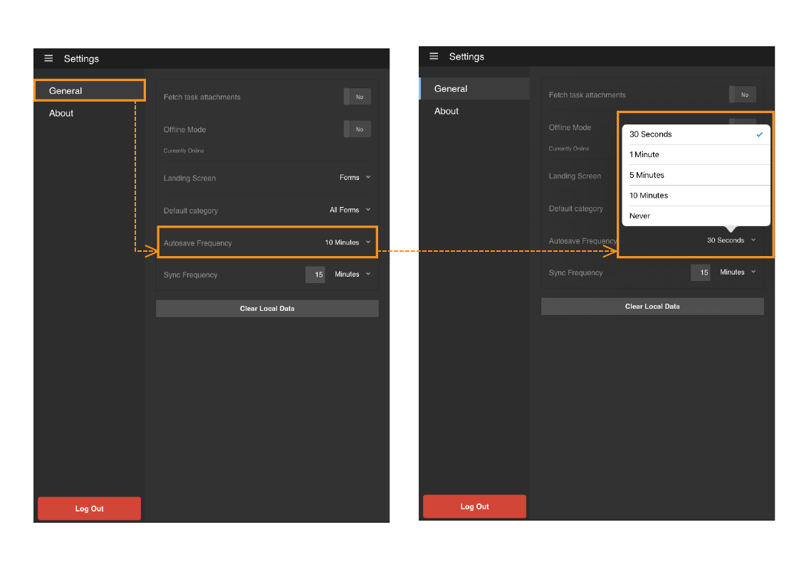
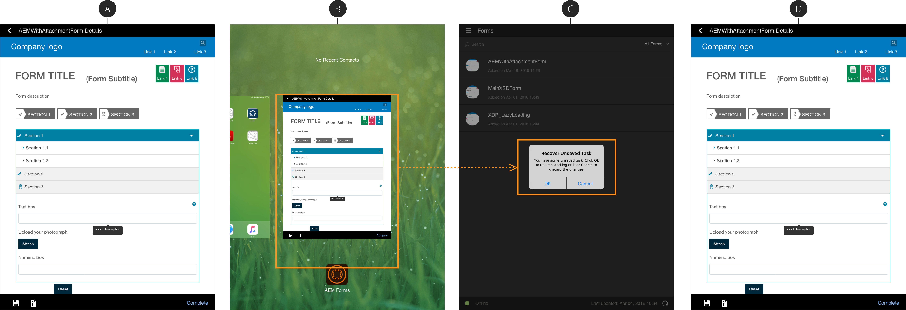

# Utiliser l’enregistrement automatique dans l’application AEM Forms{#using-autosave-in-aem-forms-app}

>[!NOTE]
>
>L’application AEM Forms est actuellement obsolète. Pour toute question ou aide, contactez [&#128279;](mailto:aemformsapp-android@adobe.com).

Lorsqu’un utilisateur ou une utilisatrice saisit des données dans l’application Adobe Experience Manager Forms, la fonctionnalité d’enregistrement automatique les enregistre à intervalles réguliers. La fonctionnalité d’enregistrement automatique de l’application AEM Forms vous permet d’éviter la perte de données si l’application se ferme accidentellement.

L’application se ferme accidentellement :

* si votre appareil s’arrête car sa batterie est faible ;
* Si l’utilisateur stoppe l’application
* si une panne inattendue se produit.

Vous pouvez spécifier les intervalles auxquels l’application enregistre les données saisies.

>[!NOTE]
>
>Sélectionnez la fréquence d’enregistrement automatique de manière judicieuse. Un enregistrement automatique fréquent peut avoir un impact perceptible sur les performances de votre appareil.

Suivez les étapes ci-après pour utiliser la fonction d’enregistrement automatique de l’application AEM Forms :

1. Connectez-vous à l’application et accédez à **Paramètres > Général**.
1. Dans l’écran Général, utilisez l’option **Fréquence d’enregistrement automatique** pour choisir les intervalles auxquels vous voulez que l’application enregistre les données saisies.
   

1. Lorsque vous redémarrez l’application et que vous vous connectez avec le même nom d’utilisateur, vous êtes invité à restaurer votre tâche à l’aide de la boîte de dialogue de récupération de la tâche non enregistrée. Cliquez sur **OK** dans la boîte de dialogue Récupérer des documents non sauvegardés pour recommencer à travailler sur la tâche enregistrée. Vous pouvez cliquer sur **Annuler** pour supprimer les données enregistrées correspondant au dernier enregistrement automatique déclenché et commencer à travailler sur une nouvelle tâche.

   Si vous cliquez sur **OK**, la tâche est restaurée avec les données correspondant au dernier enregistrement automatique déclenché avant que l’application ne s’arrête. Elle inclut les données d’un formulaire et toutes les pièces jointes liées à la tâche.
   **A.** Un formulaire de travail en cours **Application B.** fermée de force **L’application C.** a redémarré avec la boîte de dialogue Récupérer la tâche non enregistrée **Formulaire D.** restauré avec les données d’origine
