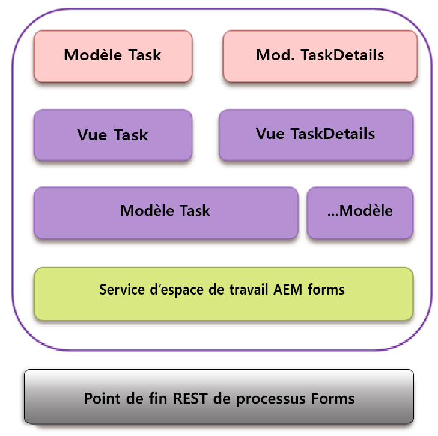

# Interaction de Backbone{#backbone-interaction}

Backbone est une bibliothèque qui permet de créer et de suivre une architecture MVC dans des applications Web. L’idée de base de Backbone est d’organiser votre interface en vues logiques, sauvegardées par des modèles, chacune d’entre elles pouvant être mise à jour de manière indépendante lorsque le modèle change, sans devoir redessiner la page. Pour plus d’informations sur Backbone, voir [https://backbonejs.org](https://backbonejs.org/).

Voici quelques concepts clés :

**Backbone** modelContient des données et la plupart de la logique liée à ces données.

**Backbone** viewUtilisé pour représenter l’état du modèle correspondant. Une vue Backbone se comporte en fait comme un contrôleur, écoutant les événements de l’interface utilisateur comme les clics de l’utilisateur, ou les événements de modèle (comme les modifications de données), et modifie l’interface utilisateur en fonction des besoins.

**Modèle HTML** : modèle d’élément wrapper contenant des espaces réservés renseignés par le modèle.

**AEM Forms** workspaceContient plusieurs composants individuels. Chaque composant :

* représente un seul élément d’interface utilisateur logique ;
* il peut s’agir d’un ensemble de composants similaires ;
* comprend le modèle Backbone, la vue Backbone et le modèle HTML ;
* contient une référence à un service ;
* contient une référence aux utilitaires requis.

Lorsqu’un composant est initialisé, les objets suivants sont créés :

* Une nouvelle instance du modèle Backbone du composant est créée. Ce service est inséré dans le modèle.
* Une nouvelle instance de la vue Backbone est créée.
* Les instances du modèle correspondant, du modèle HTML et des utilitaires sont insérées dans la vue.

Dans la vue Backbone, un événement map mappe les divers événements qui peuvent se produire en raison des interactions de l’interface utilisateur avec un gestionnaire correspondant. Ce mappage est initié une fois qu’un composant est initialisé.

Lorsqu’une vue est initialisée, elle appelle son modèle correspondant pour extraire les données du serveur. Une fois que toutes les données requises par une vue sont disponibles, la vue génère les données dans le format spécifié par le modèle HTML. Plusieurs vues peuvent partager un même modèle de communication.

Exemple :

1. L’utilisateur clique sur un modèle de tâche dans la liste des tâches.
1. La vue Tâches écoute le clic et appelle la fonction de rendu sur le modèle de tâche.
1. Le modèle de tâche appelle ensuite le service qui est un point commun pour toute communication avec le serveur AEM Forms.
1. La classe de service appelle le point de terminaison REST AEM Forms pour la méthode de rendu via ajax.
1. Le rappel réussi de cette invocation Ajax est défini dans le modèle de la tâche.
1. Le modèle de tâche déclenche un événement Backbone comme une notification indiquant que l’appel de rendu est terminé.
1. Une autre vue, la vue des détails de la tâche écoute cet événement du modèle de la tâche.
1. La vue des détails de la tâche modifie ensuite le modèle de détails de la tâche pour afficher la tâche générée (formulaire, détails, pièces jointes, notes, etc.) à l’utilisateur.
