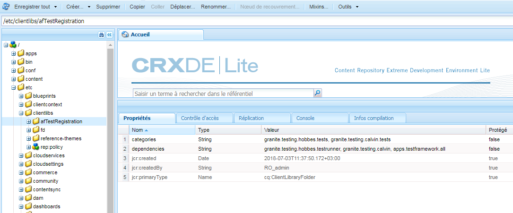
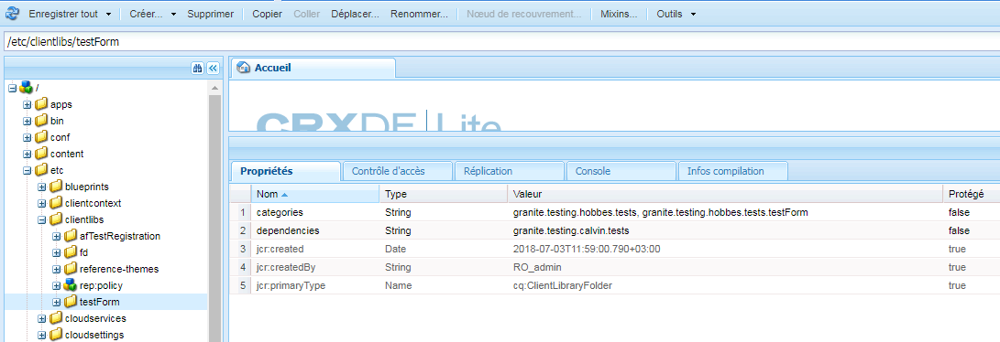
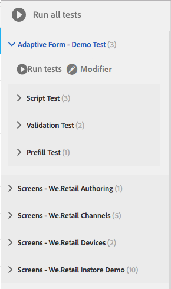
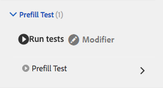
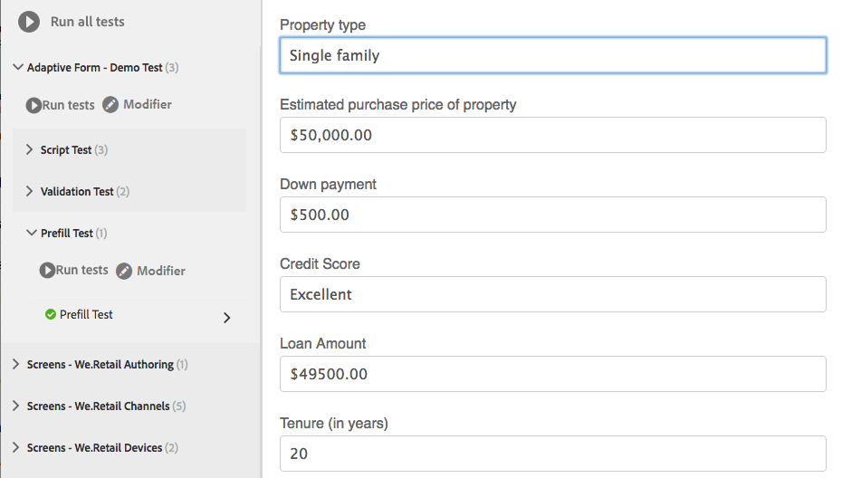
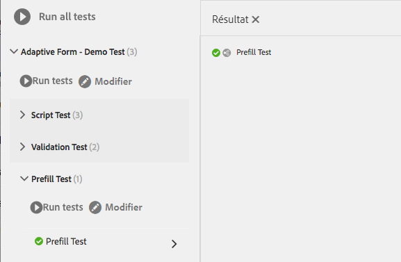

# Automatiser les tests des formulaires adaptatifs{#automate-testing-of-adaptive-forms}

## Présentation {#overview}

Les formulaires adaptatifs font partie intégrante de vos interactions avec les clients. Il est important de tester vos formulaires adaptatifs à chaque modification apportée, comme lors du déploiement d’un nouveau groupe de correctifs ou de la modification d’une règle dans le formulaire. Cependant, les formulaires adaptatifs de test fonctionnel et tous les champs qu’ils contiennent peuvent s’avérer fastidieux.

Calvin vous permet d’automatiser les tests de vos formulaires adaptatifs dans le navigateur Web. Calvin utilizes [Hobbes](/help/sites-developing/hobbes.md)&#39;s user interface for running the tests and provides the following tools:

* Une API JavaScript pour créer des tests.
* Une interface utilisateur pour exécuter des tests.

En utilisant Calvin, vous pouvez créer des cas de test dans CRXDE et exécuter des tests d’interface utilisateur directement dans le navigateur Web pour tester les aspects suivants de vos formulaires adaptatifs :

<table>
 <tbody>
  <tr>
   <td><strong>Aspect du formulaire adaptatif à tester</strong></td>
   <td><strong>Description</strong></td>
  </tr>
  <tr>
   <td>Expérience de remplissage automatique d’un formulaire adaptatif</td>
   <td>
    <ul>
     <li>Le formulaire est-il prérempli comme prévu en fonction du type de modèle de données ?</li>
     <li>Les valeurs par défaut des objets du formulaire sont-elles remplies comme prévu ?</li>
    </ul> </td>
  </tr>
  <tr>
   <td>Expérience d’envoi d’un formulaire adaptatif</td>
   <td>
    <ul>
     <li>Les données générées lors de l’envoi sont-elles correctes ?</li>
     <li>Le formulaire est-il à nouveau validé sur le serveur lors de l’envoi ?</li>
     <li>L’action d’envoi est-elle configurée pour le formulaire en cours d’exécution ?</li>
    </ul> </td>
  </tr>
  <tr>
   <td><p>Règles d’expression</p> <p> </p> </td>
   <td>
    <ul>
     <li>Les expressions associées aux objets de formulaire, telles que Calculer, Visible, Exécuter des scripts après la sortie d’un champ, sont-elles exécutées après l’exécution des opérations d’interface utilisateur pertinentes ?<br /> </li>
    </ul> </td>
  </tr>
  <tr>
   <td>Validations</td>
   <td>
    <ul>
     <li>Les validations de champs s’exécutent-elles comme prévu après avoir effectué les opérations ?</li>
    </ul> </td>
  </tr>
  <tr>
   <td><p>Chargement différé</p> <p> </p> </td>
   <td>
    <ul>
     <li>Lorsque les onglets sont sélectionnés (ou tout élément de navigation d’un panneau), le contenu HTML est-il récupéré du serveur selon la configuration de chargement différé ?</li>
    </ul></td>
  </tr>
  <tr>
   <td><p>Interaction de l’interface utilisateur</p> </td>
   <td>
    <ul>
     <li><a href="https://helpx.adobe.com/fr/aem-forms/6-3/calvin-sdk-javascript-api/calvin.html#toc2__anchor" target="_blank">Test de l’interaction de l’interface utilisateur avec les objets de formulaire adaptatif</a></li>
    </ul> </td>
  </tr>
 </tbody>
</table>

### Conditions préalables {#prerequisites}

Avant d’utiliser cet article pour créer vos cas de test, vous devez savoir ce qui suit :

* Creating test suites and executing test cases using [Hobbes](https://docs.adobe.com/docs/fr/aem/6-3/develop/components/hobbes.html)
* [API JavaScript Hobbes](https://docs.adobe.com/docs/fr/aem/6-2/develop/ref/test-api/index.html)
* [API JavaScript Calvin](https://helpx.adobe.com/fr/aem-forms/6-3/calvin-sdk-javascript-api/calvin.html)

## Exemple : créer une suite de tests pour un formulaire adaptatif en utilisant Hobbes comme cadre de test {#example-create-a-test-suite-for-an-adaptive-form-using-hobbes-as-testing-framework}

L’exemple suivant vous guide dans la création d’une suite de tests pour tester plusieurs formulaires adaptatifs. Vous devez créer un cas de test distinct pour chaque formulaire que vous souhaitez tester. En effectuant des étapes similaires à celles ci-dessous et en modifiant le code JavaScript à l’étape 11, vous pouvez créer votre propre suite de tests pour tester vos formulaires adaptatifs.

1. Go to CRXDE Lite in your web browser: `https://'[server]:[port]'/crx/de`.
1. Cliquez avec le bouton droit sur le sous-dossier /etc/clientlibs et sélectionnez **Créer** > **Créer un nœud**. Saisissez un nom (ici afTestRegistration), spécifiez le type de nœud en tant que cq:ClientLibraryFolder, puis cliquez sur **OK**.

   Le dossier clientlibs contient l’aspect enregistrement de votre application (JS et Init). Il est recommandé d’enregistrer tous les objets de suites de tests Hobbes spécifiques à un formulaire dans le dossier clientlibs.

1. Spécifiez les valeurs de propriété suivantes au nœud que vous venez de créer (ici, afTestRegistration), puis cliquez sur **Enregistrer tout**. Ces propriétés aident Hobbes à reconnaître le dossier en tant que test. Pour réutiliser cette bibliothèque client en tant que dépendance dans d’autres bibliothèques client, appelez-la granite.testing.calvin.tests.

<table>
 <tbody>
  <tr>
   <td>Propriété</td>
   <td>Type</td>
   <td>Valeur</td>
  </tr>
  <tr>
   <td><p>categories</p> </td>
   <td><p>Chaîne[]</p> </td>
   <td><p>granite.testing.hobbes.tests, granite.testing.calvin.tests</p> </td>
  </tr>
  <tr>
   <td><p>dependencies</p> </td>
   <td><p>Chaîne[]</p> </td>
   <td><p>granite.testing.hobbes.testrunner, granite.testing.calvin, apps.testframework.all</p> </td>
  </tr>
 </tbody>
</table>

>[!NOTE]
>
>Le clientlib granite.testing.calvin.af contient toutes les API de formulaires adaptatifs. Ces API font partie de l’espace de nommage calvin.



1. Right-click the test node (here **afTestRegistration)** and then click **Create** > **Create File**. Nommez le fichier js.txt et cliquez sur **OK**.
1. Dans le fichier js.txt, ajoutez le texte suivant :

   ```javascript
   #base=.
   js.txt
   ```

1. Cliquez sur **Enregistrer tout** et fermez le fichier js.txt.
1. Right-click the test node (here **afTestRegistration)** and click **Create** > **Create File**. Nommez le fichier init.js et cliquez sur **OK**.
1. Copy the following code to the init.js file and click **Save All**:

   ```javascript
   (function(window, hobs) {
       'use strict';
       window.testsuites = window.testsuites || {};
     // Registering the test form suite to the sytem
     // If there are other forms, all registration should be done here
       window.testsuites.testForm = new hobs.TestSuite("Adaptive Form - Demo Test", {
           path: '/etc/clientlibs/afTestRegistration/init.js',
           register: true
       });
    // window.testsuites.testForm1 = new hobs.TestSuite("testForm1");
   }(window, window.hobs));
   ```

   Le code ci-dessus crée une suite de tests nommée **Adaptive Form - Demo Test**. Pour créer une suite de tests avec un nom différent, changez le nom en conséquence.

1. Cliquez sur **Créer** > **Créer un nœud** pour créer un nœud sous le dossier clientlib pour chaque formulaire que vous souhaitez tester. Cet exemple utilise un nœud nommé **testForm** pour tester un formulaire adaptatif nommé **testForm**. Spécifiez les propriétés suivantes et cliquez sur **OK** :

   * Nom : testForm (le nom de votre formulaire)
   * Type : cq:ClientLibraryFolder

1. Ajoutez les propriétés suivantes au nouveau noeud (ici testForm) pour tester un formulaire adaptatif :

   | **Propriété** | **Type** | **Valeur** |
   |---|---|---|
   | categories | Chaîne[] | granite.testing.hobbes.tests, granite.testing.hobbes.tests.test.testForm |
   | dependencies | Chaîne[] | granite.testing.calvin.tests |

   >[!NOTE]
   >
   >Cet exemple utilise une dépendance sur le client lib granite.testing.calvin.tests pour une meilleure gestion. Cet exemple ajoute également une catégorie de bibliothèque client, « granite.testing.hobbes.tests.testForm » pour réutiliser cette bibliothèque client, si nécessaire.

   

1. Cliquez avec le bouton droit sur le dossier que vous avez créé pour le formulaire de test (ici testForm) et sélectionnez **Créer** > **Créer un fichier**. Nommez le fichier scriptingTest.js et ajoutez le code suivant au fichier, puis cliquez sur **Enregistrer tout.**

   Pour utiliser le code suivant afin de tester un autre formulaire adaptatif, modifiez le chemin et le nom du formulaire dans **navigateTo** (lignes 11, 36 et 62) et dans les cas de test respectifs. For more information on APIs for testing different aspects of forms and form objects, see [Calvin APIs](https://helpx.adobe.com/fr/aem-forms/6-3/calvin-sdk-javascript-api/calvin.html).

   ```javascript
   (function(window, hobs) {
       'use strict';
   
    var ts = new hobs.TestSuite("Script Test", {
           path: '/etc/clientlibs/testForm/scriptingTest.js',
     register: false
    })
   
       .addTestCase(new hobs.TestCase("Checking execution of calculate script")
           // navigate to the testForm which is to be tested
           .navigateTo("/content/forms/af/testForm.html?wcmmode=disabled")
           // check if adaptive form is loaded
           .asserts.isTrue(function () {
               return calvin.isFormLoaded()
           })
           .execSyncFct(function () {
               // create a spy before checking for the expression
               calvin.spyOnExpression("panel1.textbox1");
               // setValue would trigger enter, set the value and exit from the field
               calvin.setValueInDOM("panel1.textbox", "5");
           })
           // if the calculate expression was setting "textbox1" value to "5", let's also check that
           .asserts.isTrue(function () {
               return calvin.isExpressionExecuted("panel1.textbox1", "Calculate");
           })
           .execSyncFct(function () {
               calvin.destroySpyOnExpression("panel1.textbox1");
           })
           .asserts.isTrue(function () {
               return calvin.model("panel1.textbox1").value == "5"
           })
       )
   
       .addTestCase(new hobs.TestCase("Calculate script Test")
           // navigate to the testForm which is to be tested
           .navigateTo("/content/forms/af/cal/demoform.html?wcmmode=disabled&dataRef=crx:///content/forms/af/cal/prefill.xml")
           // check if adaptive form is loaded
           .asserts.isTrue(function () {
               return calvin.isFormLoaded()
           })
   
           .execSyncFct(function () {
               // create a spy before checking for the expression
               calvin.spyOnExpression("panel2.panel1488218690733.downPayment");
               // setValue would trigger enter, set the value and exit from the field
               calvin.setValueInDOM("panel2.panel1488218690733.priceProperty", "1000000");
           })
           .asserts.isTrue(function () {
               return calvin.isExpressionExecuted("panel2.panel1488218690733.downPayment", "Calculate");
           })
           .execSyncFct(function () {
               calvin.destroySpyOnExpression("panel2.panel1488218690733.downPayment");
           })
           .asserts.isTrue(function () {
               // if the calculate expression was setting "downPayment" value to "10000", let's also check that
      return calvin.model("panel2.panel1488218690733.downPayment").value == 10000
           })
       )
   
       .addTestCase(new hobs.TestCase("Checking execution of Value commit script")
           // navigate to the testForm which is to be tested
           .navigateTo("/content/forms/af/cal/demoform.html?wcmmode=disabled&dataRef=crx:///content/forms/af/cal/prefill.xml")
           // check if adaptive form is loaded
           .asserts.isTrue(function () {
               return calvin.isFormLoaded()
           })
   
           .execSyncFct(function () {
               // create a spy before checking for the expression
               calvin.spyOnExpression("panel2.panel1488218690733.priceProperty");
               // setValue would trigger enter, set the value and exit from the field
               calvin.setValueInDOM("panel2.panel1488218690733.priceProperty", "100");
           })
           .asserts.isTrue(function () {
               return calvin.isExpressionExecuted("panel2.panel1488218690733.priceProperty", "Value Commit");
           })
           .execSyncFct(function () {
               calvin.destroySpyOnExpression("panel2.panel1488218690733.priceProperty");
           })
           .asserts.isTrue(function () {
            // if the value commit expression was setting "textbox1488215618594" value to "0", let's also check that
               return calvin.model("panel2.panel1488218690733.textbox1488215618594").value == 0
           })
       );
   
    // register the test suite with testForm
     window.testsuites.testForm.add(ts);
   
    }(window, window.hobs));
   ```

   Le cas de test est créé. Passez à l’exécution du test pour tester les formulaires adaptatifs via Hobbes. For steps for running the test cases, see [Executing Tests in Testing Your UI Using Automated Tests](/help/sites-developing/hobbes.md).

Vous pouvez également installer le package dans le fichier joint SampleTestPackage.zip pour obtenir les mêmes résultats qu’avec les étapes expliquées dans Exemple : créer une suite de tests pour un formulaire adaptatif en utilisant Hobbes comme cadre de test.

[Obtenir le fichier](assets/sampletestpackage.zip)

## Tests de l’interface utilisateur à l’aide de tests automatisés {#testing-your-ui-using-automated-tests}

### Exécution distincte d’une suite de tests {#running-a-single-test-suite}

Les suites de tests peuvent être exécutées séparément. Lorsque vous lancez une suite de tests, la page change au fur et à mesure que les cas de tests et leurs actions sont exécutés et une fois que les résultats apparaissent à la fin du test. Les icônes indiquent les résultats.

Une coche indique un test réussi : 

An &quot;X&quot; icon indicates a failed test: 

Pour exécuter une suite de tests :

1. Dans le panneau Tests, cliquez ou entrez sur le nom du cas de test que vous souhaitez exécuter pour développer les détails des actions.

   

1. Cliquez ou appuyez sur le bouton Exécuter les tests. 

   

1. L’espace réservé est remplacé par le contenu de la page lors de l’exécution du test.

   

1. Passez en revue les résultats du cas de test en cliquant ou en appuyant sur la description pour ouvrir le panneau Résultat. Appuyez ou cliquez sur le nom de votre cas de test dans le panneau Résultat pour afficher tous les détails.

   

Les étapes de test de vos formulaires adaptatifs AEM sont similaires aux étapes de test de votre interface utilisateur AEM. Pour plus d’informations sur le test de vos formulaires adaptatifs, consultez les rubriques suivantes dans [Test de votre interface utilisateur](https://helpx.adobe.com//experience-manager/6-3/help/sites-developing/hobbes.html) :

* Affichage de suites de tests
* Exécution de plusieurs tests

## Glossaire    {#glossary}

<table>
 <tbody>
  <tr>
   <td><strong>Terme</strong></td>
   <td><strong>Description</strong></td>
  </tr>
  <tr>
   <td><p>Suite de tests</p> </td>
   <td><p>Une suite de tests est une série de cas de test associés.</p> </td>
  </tr>
  <tr>
   <td><p>Cas de test</p> </td>
   <td><p>Un cas de test représente une tâche effectuée par un utilisateur à l’aide de votre interface utilisateur. Ajoutez des cas de test à votre suite de tests pour tester les activités effectuées par les utilisateurs.</p> </td>
  </tr>
  <tr>
   <td><p>Actions </p> </td>
   <td><p>Les actions sont des méthodes qui effectuent un geste dans l’interface utilisateur, par exemple en cliquant sur un bouton ou en remplissant une zone de saisie avec une valeur.</p> <p>Les méthodes des classes hobs.actions.Asserts, hobs.actions.Core et hobs.utils.af sont des actions que vous pouvez utiliser dans vos tests. Toutes les actions sont exécutées de manière synchronisée.</p> </td>
  </tr>
  <tr>
   <td><p>Environnement d’auteur ou de publication</p> </td>
   <td><p>En général, les formulaires peuvent être testés dans un environnement d’auteur ou de publication. Dans le cas d’un environnement de publication, l’accès pour exécuter le test est restreint par défaut. Ce cas de figure est dû au fait que toutes les bibliothèques client liées au programme d’exécution de test se trouvent dans /libs dans la structure JCR.</p> </td>
  </tr>
 </tbody>
</table>

