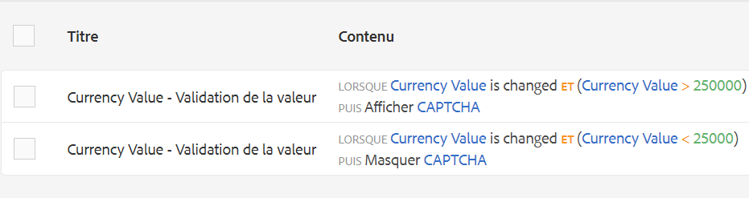

# Utilisation de CAPTCHA dans les formulaires adaptifs{#using-captcha-in-adaptive-forms}

CAPTCHA (Completely Automated Public Turing test to tell Computers and Humans Apart, Test public de Turing complètement automatique ayant pour but de différencier les humains des ordinateurs) est un programme couramment utilisé dans les transactions en ligne pour différencier les humains des programmes automatisés ou des robots. Cela pose un défi et évalue la réponse de l’utilisateur pour déterminer s’il s’agit d’un humain ou d’un robot interagissant avec le site. Cela empêche l’utilisateur de continuer si le test échoue et permet de sécuriser les transactions en ligne en empêchant les robots d’envoyer du spam ou des éléments malveillants.

AEM Forms prend en charge CAPTCHA dans les formulaires adaptatifs. Vous pouvez utiliser le service reCAPTCHA de Google pour implémenter CAPTCHA.

>[!NOTE]
>
>* AEM Forms prend en charge uniquement reCaptcha 2. Toute autre version n’est pas prise en charge.
>* CAPTCHA dans les formulaires adaptatifs n’est pas pris en charge dans le mode hors ligne sur l’application AEM Forms.

>


## Configurer le service ReCAPTCHA par Google {#google-recaptcha}

Les auteurs du formulaire peuvent utiliser le service reCAPTCHA de Google pour mettre en place CAPTCHA dans les formulaires adaptatifs. Il offre des fonctionnalités CAPTCHA avancées pour protéger votre site. Pour plus d’informations sur le fonctionnement de reCAPTCHA, voir [Google reCAPTCHA](https://developers.google.com/recaptcha/).


Pour mettre en place le service reCAPTCHA dans AEM Forms :

1. Obtenez la [paire de clés API reCAPTCHA](https://www.google.com/recaptcha/admin) auprès de Google. Elle comprend une clé de site et une clé secrète.
1. Créez un conteneur de configurations pour les services cloud.

   1. Accédez à **[!UICONTROL Outils > Général > Navigateur de configuration]**.
      * Pour plus d’informations, consultez la documentation de [Navigateur de configuration](/help/sites-administering/configurations.md).
   1. Procédez comme suit pour activer le dossier global pour les configurations cloud ou ignorez cette étape pour créer et configurer un autre dossier pour les configurations de service cloud.

      1. Dans le navigateur de configuration, sélectionnez le dossier **[!UICONTROL global]** et appuyez sur **[!UICONTROL Propriétés]**.

      1. Dans la boîte de dialogue Propriétés de configuration, activez **[!UICONTROL Configurations cloud]**.
      1. Appuyez sur **[!UICONTROL Enregistrer et fermer]** pour enregistrer la configuration et fermer la boîte de dialogue.
   1. Dans le navigateur de configuration, appuyez sur **[!UICONTROL Créer]**.
   1. Dans la boîte de dialogue Créer une configuration, indiquez un titre pour le dossier et activez **[!UICONTROL Configurations cloud]**.
   1. Appuyez sur **[!UICONTROL Créer]** pour créer le dossier activé pour les configurations de service cloud.


1. Configurez le service cloud pour reCAPTCHA.

   1. Sur votre instance d’auteur AEM, accédez à  > **Cloud Services**.
   1. Appuyez sur **[!UICONTROL reCAPTCHA]**. La page Configurations s’ouvre. Sélectionnez le conteneur de configurations créé à l’étape précédente et appuyez sur **[!UICONTROL Créer]**.
   1. Spécifiez le nom, la clé du site et la clé secrète pour le service reCAPTCHA et appuyez sur **[!UICONTROL Créer]** pour créer la configuration du service cloud.
   1. Dans cette boîte, spécifiez le site et les clés de site et secrète obtenues à l’étape 1. Appuyez sur **Enregistrer les paramètres**, puis sur **OK** pour terminer la configuration.

   Une fois que le service reCAPTCHA est configuré, il peut être utilisé dans les formulaires adaptatifs. Pour plus d’informations, voir [Utilisation de CAPTCHA dans les formulaires adaptatifs](#using-captcha).

## Utiliser CAPTCHA dans les formulaires adaptatifs  {#using-captcha}

Pour utiliser CAPTCHA dans les formulaires adaptatifs :

1. Ouvrez un formulaire adaptatif en mode d’édition.

   >[!NOTE]
   >
   >Assurez-vous que le conteneur de configurations sélectionné lors de la création d’un formulaire adaptatif contient le service cloud reCAPTCHA. Vous pouvez également modifier les propriétés de formulaire adaptatif pour modifier le conteneur de configurations associé au formulaire.

1. À partir du navigateur de composant, faites glisser et déposez le composant **Captcha** sur le formulaire adaptatif.

   >[!NOTE]
   >
   >L’utilisation de plusieurs composants Captcha dans un formulaire adaptatif n’est pas prise en charge. En outre, il n’est pas recommandé d’utiliser CAPTCHA dans un panneau marqué pour le chargement différé ou dans un fragment.

   >[!NOTE]
   >
   >Captcha est sensible au facteur temps et expire dans la minute. Par conséquent, il est recommandé de placer le composant Captcha juste avant le bouton Envoyer dans le formulaire adaptatif.

1. Sélectionnez le composant Captcha que vous avez ajouté et appuyez sur  pour modifier ses propriétés.
1. Indiquez un titre pour le widget CAPTCHA. La valeur par défaut est **Captcha**. Sélectionnez **Masquer le titre** si vous ne voulez pas que le titre apparaisse.
1. Dans la liste déroulante **Service Captcha**, sélectionnez **reCaptcha** pour activer le service reCAPTCHA si vous l&#39;avez configuré comme décrit dans le service [ReCAPTCHA de Google](#google-recaptcha). Sélectionnez une configuration dans la liste déroulante Paramètres. En outre, sélectionnez la taille **Normal** ou **Compact** pour le widget reCAPTCHA.

   >[!NOTE]
   >
   >Ne sélectionnez pas **[!UICONTROL Par défaut]** dans le menu déroulant Service Captcha puisque le service par défaut AEM CAPTCHA est obsolète.

1. Enregistrez les propriétés.

Le service reCAPTCHA est activé sur le formulaire adaptatif. Vous pouvez prévisualiser le formulaire et voir le fonctionnement de CAPTCHA.

### Afficher ou masquer le composant CAPTCHA en fonction de règles {#show-hide-captcha}

Vous pouvez choisir d’afficher ou de masquer le composant CAPTCHA en fonction des règles que vous appliquez à un composant d’un formulaire adaptatif. Appuyez sur le composant, sélectionnez , puis appuyez sur **[!UICONTROL Créer]** pour créer une règle. Pour plus d’informations sur la création de règles, voir [Éditeur de règles](rule-editor.md).

Par exemple, le composant CAPTCHA ne doit s’afficher dans un formulaire adaptatif que si la valeur du champ Valeur monétaire du formulaire est supérieure à 25 000.

Appuyez sur le champ **[!UICONTROL Valeur monétaire]** dans le formulaire et créez les règles suivantes :



### Valider le CAPTCHA {#validate-captcha}

Vous pouvez valider CAPTCHA dans un formulaire adaptatif lorsque vous envoyez le formulaire ou baser la validation CAPTCHA sur les actions et conditions des utilisateurs.

#### Valider CAPTCHA lors de l&#39;envoi du formulaire {#validation-form-submission}

Pour valider automatiquement un CAPTCHA lorsque vous envoyez un formulaire adaptatif :

1. Appuyez sur le composant CAPTCHA et sélectionnez  pour vue les propriétés du composant.
1. Dans la section **[!UICONTROL Valider CAPTCHA]**, sélectionnez **[!UICONTROL Valider CAPTCHA lors de l’envoi du formulaire]**.
1. Appuyez sur  pour enregistrer les propriétés du composant.

#### Valider CAPTCHA sur les actions et conditions des utilisateurs {#validate-captcha-user-action}

Pour valider un CAPTCHA en fonction des conditions et des actions des utilisateurs :

1. Appuyez sur le composant CAPTCHA et sélectionnez  pour vue les propriétés du composant.
1. Dans la section **[!UICONTROL Valider CAPTCHA]**, sélectionnez **[!UICONTROL Valider CAPTCHA sur une action utilisateur]**.
1. Appuyez sur  pour enregistrer les propriétés du composant.

[!DNL Experience Manager Forms] fournit une  `ValidateCAPTCHA` API pour valider CAPTCHA à l’aide de conditions prédéfinies. Vous pouvez appeler l’API à l’aide d’une action Envoyer personnalisée ou en définissant des règles sur les composants d’un formulaire adaptatif.

Voici un exemple d&#39;API `ValidateCAPTCHA` permettant de valider CAPTCHA à l&#39;aide de conditions prédéfinies :

```javascript
if (slingRequest.getParameter("numericbox1614079614831").length() >= 5) {
    	GuideCaptchaValidatorProvider apiProvider = sling.getService(GuideCaptchaValidatorProvider.class);
        String formPath = slingRequest.getResource().getPath();
        String captchaData = slingRequest.getParameter(GuideConstants.GUIDE_CAPTCHA_DATA);
        if (!apiProvider.validateCAPTCHA(formPath, captchaData).isCaptchaValid()){
            response.setStatus(400);
            return;
        }
    }
```

L’exemple signifie que l’API `ValidateCAPTCHA` valide le CAPTCHA dans le formulaire uniquement si le nombre de chiffres dans la zone numérique spécifiée par l’utilisateur lors du remplissage du formulaire est supérieur à 5.

**Option 1 : Utiliser l&#39;API  [!DNL Experience Manager Forms] ValidateCAPTCHA pour valider CAPTCHA à l&#39;aide d&#39;une action Envoyer personnalisée**

Effectuez les étapes suivantes pour utiliser l&#39;API `ValidateCAPTCHA` pour valider CAPTCHA à l&#39;aide d&#39;une action Envoyer personnalisée :

1. Ajoutez le script qui inclut l’API `ValidateCAPTCHA` à l’action d’envoi personnalisée. Pour plus d’informations sur les actions d’envoi personnalisées, voir [Création d’une action d’envoi personnalisée pour Forms adaptatif](custom-submit-action-form.md).
1. Sélectionnez le nom de l’action d’envoi personnalisée dans la liste déroulante **[!UICONTROL Action d’envoi]** des propriétés **[!UICONTROL Envoi]** d’un formulaire adaptatif.
1. Appuyez sur **[!UICONTROL Envoyer]**. Le CAPTCHA est validé en fonction des conditions définies dans l&#39;API `ValidateCAPTCHA` de l&#39;action Envoyer personnalisée.

**Option 2 : Utiliser l’API  [!DNL Experience Manager Forms] ValidateCAPTCHA pour valider CAPTCHA sur une action de l’utilisateur avant d’envoyer le formulaire**

Vous pouvez également appeler l&#39;API `ValidateCAPTCHA` en appliquant des règles à un composant d&#39;un formulaire adaptatif.

Par exemple, vous ajoutez un bouton **[!UICONTROL Valider CAPTCHA]** dans un formulaire adaptatif et créez une règle pour appeler un service en cliquant sur un bouton.

La figure suivante illustre comment vous pouvez appeler un service en cliquant sur un bouton **[!UICONTROL Valider CAPTCHA]** :


Vous pouvez appeler la servlet personnalisée qui inclut `ValidateCAPTCHA` API à l’aide de l’éditeur de règles et activer ou désactiver le bouton d’envoi du formulaire adaptatif en fonction du résultat de la validation.

De même, vous pouvez utiliser l’éditeur de règles pour inclure une méthode personnalisée pour valider CAPTCHA dans un formulaire adaptatif.

### Ajouter des services CAPTCHA personnalisés {#add-custom-captcha-service}

[!DNL Experience Manager Forms] fournit reCAPTCHA en tant que service CAPTCHA. Cependant, vous pouvez ajouter un service personnalisé à afficher dans la liste déroulante **[!UICONTROL Service CAPTCHA]**.

Voici un exemple de mise en oeuvre de l&#39;interface pour ajouter un service CAPTCHA supplémentaire à votre formulaire adaptatif :

```javascript
package com.adobe.aemds.guide.service;

import org.osgi.annotation.versioning.ConsumerType;

/**
 * An interface to provide captcha validation at server side in Adaptive Form
 * This interface can be used to provide custom implementation for different captcha services.
 */
@ConsumerType
public interface GuideCaptchaValidator {
    /**
     * This method should define the actual validation logic of the captcha
     * @param captchaPropertyNodePath path to the node with CAPTCHA configurations inside form container
     * @param userResponseToken  The user response token provided by the CAPTCHA from client-side
     *
     * @return  {@link GuideCaptchaValidationResult} validation result of the captcha
     */
     GuideCaptchaValidationResult validateCaptcha(String captchaPropertyNodePath, String userResponseToken);

    /**
     * Returns the name of the captcha validator. This should be unique among the different implementations
     * @return  name of the captcha validator
     */
     String getCaptchaValidatorName();
}
```

`captchaPropertyNodePath` fait référence au chemin de ressources du composant CAPTCHA dans le référentiel Sling. Utilisez cette propriété pour inclure des détails spécifiques au composant CAPTCHA. Par exemple, `captchaPropertyNodePath` contient des informations pour la configuration de cloud reCAPTCHA configurée sur le composant CAPTCHA. Les informations de configuration du cloud fournissent les paramètres **[!UICONTROL Clé du site]** et **[!UICONTROL Clé secrète]** pour la mise en oeuvre du service reCAPTCHA.

`userResponseToken` fait référence au  `g_recaptcha_response` qui est généré après la résolution d’un CAPTCHA dans un formulaire.
