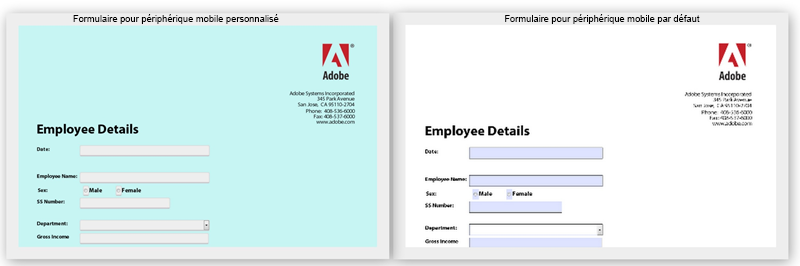

# Modification des styles par défaut des formulaires HTML5{#changing-default-styles-of-html-forms}

Les formulaires HTML5 sont rendu utilisant des fonctionnalités HTML5 et le style du formulaire rendu est fait utilisant CSS. L’apparence par défaut des formulaires HTML5 est similaire à son rendu PDF. Les développeurs peuvent utiliser des CSS personnalisés pour modifier l’apparence par défaut des formulaires HTML5.

This article provides step-by-step information to change style of an HTML5 form and [Introduction to Styles](/help/forms/using/css-styles.md) article contains detailed information about various styling aspects of HTML5 forms. Veillez à lire l’article Introduction aux styles avant d’exécuter les étapes mentionnées dans cet article.

Les deux images qui suivent montrent la différence entre les styles par défaut et les styles personnalisés.

## Donner du style à vos formulaires {#style-your-forms}

1. **Sélectionner un profil auquel ajouter des styles personnalisés**

   Access the CRX DE interface at the URL: **https://&lt;server>:&lt;port>/crx/de** and create a profile or choose an existing profile. To know how to create a profile, see [Creating a new Profile](/help/forms/using/custom-profile.md)

1. **Création d’une feuille de style CSS pour modifier le style des formulaires HTML5**

   Naviguez jusqu’au dossier dans lequel vous avez créé le rendu du profil et créez un fichier de feuille de style CSS. Les étapes à suivre sont :

   1. Right click the folder and select **create** > **create File** from the menu

   1. Dans la boîte de dialogue Création de fichier, entrez le nom de la feuille de style. Assurez -vous d’utiliser l’extension .css (par exemple stylesheet.css)
   1. Dans le volet de navigation, ouvrez le fichier CSS que vous avez créé.
   1. Définissez les classes CSS des composants dont vous souhaitez modifier le style et ajoutez des styles dans ces classes.
   Pour savoir quelles classes CSS il convient de créer pour un composant particulier de vos formulaires HTML5, consultez [Introduction aux styles](/help/forms/using/css-styles.md).

1. **Inclusion de la feuille de style dans le rendu de profil**

   Ouvrez la page de rendu du profil (fichier jsp) dans CRX DE et ajoutez le fichier CSS à la page juste en dessous de la bibliothèque du client XFA. Effectuez les étapes suivantes pour inclure le fichier CSS dans le profil.

   1. Recherchez la ligne suivante dans la page du rendu :

      &lt;cq:includeClientLib categories=&quot;xfaforms.profile&quot; />

   1. Insérez les éléments suivants sous la ligne ci-dessus pour inclure la feuille de style :

      &lt;link href=&quot;/path/to/stylesheet&quot; rel=&quot;stylesheet&quot; type=&quot;text/css&quot;/>

   1. Enregistrez le fichier .
