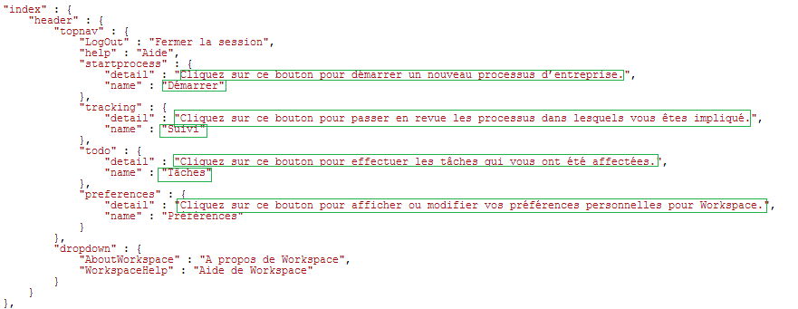

# Modification des paramètres régionaux de l’interface utilisateur de l’espace de travail AEM Forms{#changing-the-locale-of-aem-forms-workspace-user-interface}

L’espace de travail AEM Forms fournit une prise en charge immédiate des langues allemande, anglaise, française et japonaise. Il permet également de localiser l’interface utilisateur de l’espace de travail AEM Forms dans n’importe quelle autre langue.

Pour localiser l’interface utilisateur de l’espace de travail AEM Forms dans la langue de votre choix :

* Localisez le texte de l’espace de travail AEM Forms.
* Localisez les catégories réduites, les files d’attente et les processus.
* Localisez le sélecteur de date.

Before performing above steps, ensure that you follow the steps listed at [Generic steps for AEM Forms workspace customization](../../forms/using/generic-steps-html-workspace-customization.md).

>[!NOTE]
>
>Pour modifier la langue de l’écran de connexion de l’espace de travail AEM Forms, voir [Création d’un nouvel écran de connexion](../../forms/using/creating-new-login-screen.md).

## Localisation du texte {#localizing-text}

Perform the following steps to add support for a language *New* and the browser locale code *nw*.

1. Connectez-vous à CRXDE Lite.
L’URL par défaut de CRXDE Lite est `https://'[server]:[port]'/lc/crx/de/index.jsp`.
1. Navigate to the location `apps/ws/locales` and create a new folder `nw.`
1. Copiez le fichier `translation.json`de l’emplacement `/apps/ws/locales/en-US` vers l’emplacement `/apps/ws/locales/nw` .
1. Navigate to `/apps/ws/locales/nw` and open `translation.json` for editing. Effectuez des modifications spécifiques aux paramètres régionaux dans le fichier translation.json.

   Les exemples suivants contiennent le fichier translation.json pour les environnements locaux en anglais et en français de l’espace de travail AEM Forms.

    

## Localisation des catégories réduites, des files d’attente et des processus {#localizing-collapsed-categories-queues-and-processes}

L’espace de travail AEM Forms utilise des images pour afficher les en-têtes des , des files d’attente et des processus du. Vous avez besoin d’un progiciel de développement pour localiser ces en-têtes. For detailed information about creating development package, see [Building AEM Forms workspace code.](../../forms/using/introduction-customizing-html-workspace.md#main-pars-heading-3)

Dans les étapes suivantes, on considère que les nouveaux fichiers image localisés sont *Categories_nw.png*, *Queue_nw.png* et *Processes_nw.png*. La largeur recommandée des images est de 19 px.

>[!NOTE]
>
>Pour trouver le code de paramètres régionaux de la langue du navigateur de votre navigateur. Ouvrez `https://'[server]:[port]'/lc/libs/ws/Locale.html`.


Effectuez les étapes suivantes pour localiser les images :

1. A l’aide d’un client WebDAV, placez les fichiers images dans le dossier */apps/ws/images*.
1. Naviguez jusqu’à&#x200B;*/apps/ws/css*. Ouvrez *newStyle.css* pour le modifier et ajoutez les entrées suivantes :

   ```
   #categoryListBar .content.nw {
        background: #3e3e3e url(../images/Categories_nw.png) no-repeat 10px 10px;
    }
   
   #filterListBar .content.nw {
       background: #3e3e3e url(../images/Queues_nw.png) no-repeat 10px 10px;
   }
   
   #processNameListBar .content.nw {
       background: #3e3e3e url(../images/Processes_nw.png) no-repeat 10px 10px;
   }
   ```

1. Perform all the semantic changes listed in the [Workspace Customization](../../forms/using/introduction-customizing-html-workspace.md) article.
1. Accédez au dossier */js/runtime/utility* et ouvrez le fichier *usersession.js* pour le modifier.
1. Recherchez le code figurant dans le bloc de code original et ajoutez la condition *lang !== &#39;nw&#39;* to the if statement:

   ```
   // Orignal code
   setLocale = function () {
           var lang = $.trim(i18n.lng());
           if (lang === null || lang === '' || (lang !== 'fr-FR' && lang !== 'de-DE' && lang !== 'ja-JP')) {
               window.lcWorkspace.locale = 'en-US';
           } else {
               window.lcWorkspace.locale = lang;
           }
       }
   ```

   ```
   //new code
    setLocale = function () {
           var lang = $.trim(i18n.lng());
           if (lang === null || lang === '' || (lang !== 'fr-FR' && lang !== 'de-DE' && lang !== 'ja-JP' && lang !== 'nw')) {
               window.lcWorkspace.locale = 'en-US';
           } else {
               window.lcWorkspace.locale = lang;
           }
       }
   ```

## Localisation du sélecteur de date {#localizing-date-picker}

Vous avez besoin du progiciel de développement pour localiser l’API *datepicker*. For detailed information about creating development package, see [Building AEM Forms workspace code](../../forms/using/introduction-customizing-html-workspace.md#main-pars-heading-3).

1. Téléchargez et ouvrez le [progiciel d’interface utilisateur jQuery](https://jqueryui.com/download/all/), naviguez jusqu’à *&lt;progiciel d’interface utilisateur jQuery extrait>*\jquery-ui-1.10.2.zip\jquery-ui-1.10.2\ui\i18n.
1. Copiez le fichier jquery.ui.datepicker-nw.js du nouveau code de paramètres régionaux dans apps/ws/js/libs/jqueryui et apportez les modifications propres aux paramètres locaux dans le fichier.
1. Navigate to `apps/ws/js` and open the `jquery.ui.datepicker-nw.js` file for editing.
1. Dans le fichier main.js, créez un alias pour `jquery.ui.datepicker-nw.js.` le code de création d’un alias pour le `jquery.ui.datepicker-nw.js` fichier :

   ```
   jqueryuidatepickernw : pathprefix + 'libs/jqueryui/jquery.ui.datepicker-nw'
   ```

1. Use alias `jqueryuidatepickernw` to include the `jquery.ui.datepicker-nw.js` file in all the files that use datepicker. L’API datepicker est utilisée dans les fichiers suivants :

   * `js/runtime/views/outofoffice.js`
   * `js/runtime/views/searchtemplatedetails.js`
   L’exemple de code ci-dessous indique comment ajouter l’entrée de jquery.ui.datepicker-nw.js :

   ```
   //Original Code
   define([
       'jquery',
       'underscore',
       'backbone',
       'jqueryui',
       'jqueryuidatepickerja',
       'jqueryuidatepickerde',
       'jqueryuidatepickerfr',
       'slimscroll',
       'usersearchview',
       'logmanagerutil',
       'loggerutil'
   ], function ($, _, Backbone, jQueryUI, jQueryUIDatePickerJA, jQueryUIDatePickerDE, jQueryUIDatePickerFR, slimScroll, UserSearch, LogManager, Logger) {
   ```

   ```
   // Code with Date Picker alias for new language
   define([
       'jquery',
       'underscore',
       'backbone',
       'jqueryui',
       'jqueryuidatepickerja',
       'jqueryuidatepickerde',
       'jqueryuidatepickerfr',
       'jqueryuidatepickernw', // Date Picker alias
       'slimscroll',
       'usersearchview',
       'logmanagerutil',
       'loggerutil'
   ], function ($, _, Backbone, jQueryUI, jQueryUIDatePickerJA, jQueryUIDatePickerDE, jQueryUIDatePickerFR, jQueryUIDatePickerNW, slimScroll, UserSearch, LogManager, Logger) {
   ```

1. Dans tous les fichiers qui utilisent l’API datepicker, modifiez la valeur par défaut de l’API datepicker. L’API datepicker est utilisée dans les fichiers suivants :

   * apps\ws\js\runtime\views\searchtemplatedetails.js
   * apps\ws\js\runtime\views\outofoffice.js
   Modifiez le code suivant pour ajouter les nouveaux paramètres régionaux :

   ```
   if (locale === 'ja-JP') {
      $.datepicker.setDefaults($.datepicker.regional.ja);
   } else if (locale === 'de-DE') {
      $.datepicker.setDefaults($.datepicker.regional.de);
   } else if (locale === 'fr-FR') {
      $.datepicker.setDefaults($.datepicker.regional.fr);
   } else {
      $.datepicker.setDefaults($.datepicker.regional['']);
   }
   ```

   ```
   if (locale === 'ja-JP') {
       $.datepicker.setDefaults($.datepicker.regional.ja);
   } else if (locale === 'de-DE') {
       $.datepicker.setDefaults($.datepicker.regional.de);
   } else if (locale === 'fr-FR') {
       $.datepicker.setDefaults($.datepicker.regional.fr);
   } else if (locale === 'nw') {
       $.datepicker.setDefaults($.datepicker.regional.nw);
   } else {
       $.datepicker.setDefaults($.datepicker.regional['']);
   }
   ```

[Contacter le support technique](https://www.adobe.com/account/sign-in.supportportal.html)
