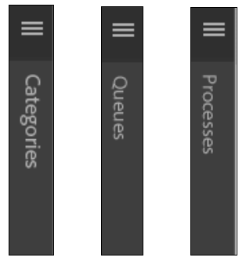

# Modifier les paramètres régionaux de l’interface utilisateur de l’espace de travail AEM Forms{#changing-the-locale-of-aem-forms-workspace-user-interface}

L’espace de travail AEM Forms fournit une prise en charge immédiate des langues suivantes : anglais, français, allemand et japonais. Cette application permet également de localiser l’interface utilisateur de l’espace de travail AEM Forms dans n’importe quelle autre langue.

Pour localiser l’interface utilisateur de l’espace de travail AEM Forms dans la langue de votre choix, procédez comme suit :

* Localisez le texte de l’espace de travail AEM Forms.
* Localisez les catégories réduites, les files d’attente et les processus.
* Localiser le sélecteur de date

Avant d’exécuter les étapes ci-dessus, assurez vous de suivre les étapes indiquées dans la [Procédure générique de personnalisation de l’espace de travail AEM Forms](../../forms/using/generic-steps-html-workspace-customization.md).

>[!NOTE]
>
>Pour modifier la langue de l’écran de connexion de l’espace de travail AEM Forms, consultez la section [Création d’un écran de connexion](../../forms/using/creating-new-login-screen.md).

## Localiser le texte {#localizing-text}

Exécutez les étapes suivantes pour ajouter la prise en charge d’une *nouvelle* langue et le code de paramètres régionaux du navigateur *nw*.

1. Connectez-vous à CRXDE Lite.
L’URL par défaut de CRXDE Lite est `https://'[server]:[port]'/lc/crx/de/index.jsp`.
1. Naviguez jusqu’à l’emplacement `apps/ws/locales` et créez un dossier `nw.`.
1. Copiez le fichier `translation.json` de l’emplacement `/apps/ws/locales/en-US` à l’emplacement `/apps/ws/locales/nw`.
1. Naviguez jusqu’à `/apps/ws/locales/nw` et ouvrez le fichier `translation.json` pour le modifier. Apportez des modifications spécifiques aux paramètres régionaux au fichier translation.json.

   Les exemples suivants contiennent le fichier translation.json pour les paramètres régionaux anglais et français de l’espace de travail AEM Forms.

    

## Localisation des catégories réduites, des files d’attente et des processus {#localizing-collapsed-categories-queues-and-processes}

L’espace de travail AEM Forms utilise des images pour afficher les en-têtes de catégories, des files d’attente et des processus. Vous avez besoin d’un package de développement pour localiser ces en-têtes. Pour plus d’informations sur la création d’un package de développement, consultez la section [Générer le code de lʼespace de travail AEM Forms.](introduction-customizing-html-workspace.md#building-html-workspace-code)

Dans les étapes suivantes, on considère que les nouveaux fichiers image localisés sont *Categories_nw.png*, *Queue_nw.png* et *Processes_nw.png*. La largeur recommandée des images doit être définie sur 19 pixels.

>[!NOTE]
>
>Pour trouver le code de paramètres régionaux de la langue du navigateur de votre navigateur. Ouvrez `https://'[server]:[port]'/lc/libs/ws/Locale.html`.



Pour localiser les images, procédez comme suit :

1. A l’aide d’un client WebDAV, placez les fichiers image dans le dossier */apps/ws/images*.
1. Naviguez jusqu’à&#x200B;*/apps/ws/css*. Ouvrez *newStyle.css* pour le modifier et ajoutez les entrées suivantes :

   ```css
   #categoryListBar .content.nw {
        background: #3e3e3e url(../images/Categories_nw.png) no-repeat 10px 10px;
    }
   
   #filterListBar .content.nw {
       background: #3e3e3e url(../images/Queues_nw.png) no-repeat 10px 10px;
   }
   
   #processNameListBar .content.nw {
       background: #3e3e3e url(../images/Processes_nw.png) no-repeat 10px 10px;
   }
   ```

1. Effectuez toutes les modifications sémantiques répertoriées dans l’article [Personnaliser lʼespace de travail](../../forms/using/introduction-customizing-html-workspace.md).
1. Accédez au dossier */js/runtime/utility* et ouvrez le fichier *usersession.js* pour le modifier.
1. Recherchez le code figurant dans le bloc de code original et ajoutez la condition *lang !== ‘nw’* à l’instruction « if » :

   ```javascript
   // Orignal code
   setLocale = function () {
           var lang = $.trim(i18n.lng());
           if (lang === null || lang === '' || (lang !== 'fr-FR' && lang !== 'de-DE' && lang !== 'ja-JP')) {
               window.lcWorkspace.locale = 'en-US';
           } else {
               window.lcWorkspace.locale = lang;
           }
       }
   ```

   ```javascript
   //new code
    setLocale = function () {
           var lang = $.trim(i18n.lng());
           if (lang === null || lang === '' || (lang !== 'fr-FR' && lang !== 'de-DE' && lang !== 'ja-JP' && lang !== 'nw')) {
               window.lcWorkspace.locale = 'en-US';
           } else {
               window.lcWorkspace.locale = lang;
           }
       }
   ```

## Localisation du sélecteur de date {#localizing-date-picker}

Vous avez besoin du package de développement pour localiser l’API *datepicker*. Pour plus d’informations sur la création d’un package de développement, consultez la section [Générer le code de lʼespace de travail AEM Forms](introduction-customizing-html-workspace.md#building-html-workspace-code).

1. Téléchargez et procédez à l’extraction du fichier [Package d’interface utilisateur jQuery](https://jqueryui.com/download/all/), puis accédez à *&lt;extracted jquery UI package>*\jquery-ui-1.10.2.zip\jquery-ui-1.10.2\ui\i18n.
1. Copiez le fichier jquery.ui.datepicker-nw.js pour le code de paramètres régionaux nw dans apps/ws/js/libs/jqueryui et apportez des modifications spécifiques aux paramètres régionauxdans le fichier.
1. Naviguez jusqu’à `apps/ws/js` et ouvrez le fichier `jquery.ui.datepicker-nw.js` pour le modifier.
1. Dans le fichier main.js, créez un alias pour `jquery.ui.datepicker-nw.js.` Le code permettant de créer un alias pour le fichier `jquery.ui.datepicker-nw.js` est :

   ```javascript
   jqueryuidatepickernw : pathprefix + 'libs/jqueryui/jquery.ui.datepicker-nw'
   ```

1. Utilisez l’alias `jqueryuidatepickernw` pour ajouter le fichier `jquery.ui.datepicker-nw.js` à tous les fichiers utilisant datepicker. L’API datepicker est utilisée dans les fichiers suivants :

   * `js/runtime/views/outofoffice.js`
   * `js/runtime/views/searchtemplatedetails.js`

   L’exemple de code ci-dessous montre comment ajouter l’entrée de jquery.ui.datepicker-nw.js :

   ```json
   //Original Code
   define([
       'jquery',
       'underscore',
       'backbone',
       'jqueryui',
       'jqueryuidatepickerja',
       'jqueryuidatepickerde',
       'jqueryuidatepickerfr',
       'slimscroll',
       'usersearchview',
       'logmanagerutil',
       'loggerutil'
   ], function ($, _, Backbone, jQueryUI, jQueryUIDatePickerJA, jQueryUIDatePickerDE, jQueryUIDatePickerFR, slimScroll, UserSearch, LogManager, Logger) {
   ```

   ```json
   // Code with Date Picker alias for new language
   define([
       'jquery',
       'underscore',
       'backbone',
       'jqueryui',
       'jqueryuidatepickerja',
       'jqueryuidatepickerde',
       'jqueryuidatepickerfr',
       'jqueryuidatepickernw', // Date Picker alias
       'slimscroll',
       'usersearchview',
       'logmanagerutil',
       'loggerutil'
   ], function ($, _, Backbone, jQueryUI, jQueryUIDatePickerJA, jQueryUIDatePickerDE, jQueryUIDatePickerFR, jQueryUIDatePickerNW, slimScroll, UserSearch, LogManager, Logger) {
   ```

1. Dans tous les fichiers qui utilisent l’API datepicker, modifiez les paramètres par défaut de l’API datepicker. L’API datepicker est utilisée dans les fichiers suivants :

   * apps\ws\js\runtime\views\searchtemplatedetails.js
   * apps\ws\js\runtime\views\outofoffice.js

   Modifiez le code suivant pour ajouter les nouveaux paramètres régionaux :

   ```javascript
   if (locale === 'ja-JP') {
      $.datepicker.setDefaults($.datepicker.regional.ja);
   } else if (locale === 'de-DE') {
      $.datepicker.setDefaults($.datepicker.regional.de);
   } else if (locale === 'fr-FR') {
      $.datepicker.setDefaults($.datepicker.regional.fr);
   } else {
      $.datepicker.setDefaults($.datepicker.regional['']);
   }
   ```

   ```javascript
   if (locale === 'ja-JP') {
       $.datepicker.setDefaults($.datepicker.regional.ja);
   } else if (locale === 'de-DE') {
       $.datepicker.setDefaults($.datepicker.regional.de);
   } else if (locale === 'fr-FR') {
       $.datepicker.setDefaults($.datepicker.regional.fr);
   } else if (locale === 'nw') {
       $.datepicker.setDefaults($.datepicker.regional.nw);
   } else {
       $.datepicker.setDefaults($.datepicker.regional['']);
   }
   ```
