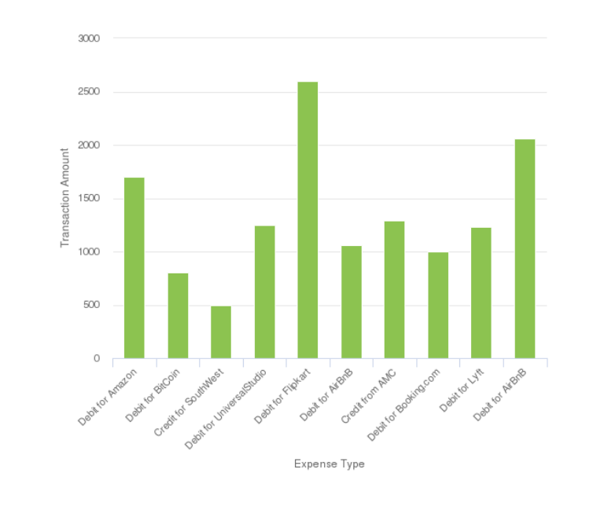

# Utilisation de graphiques dans les communications interactives{#using-charts-in-interactive-communications}

Un diagramme ou un graphique est une représentation visuelle des données. Elle concentre une grande quantité d’informations dans un format visuel simple à interpréter et permet aux destinataires de la communication interactive de mieux visualiser, interpréter et analyser les données complexes.

Lors de la création d’une communication interactive, vous pouvez ajouter des graphiques pour représenter visuellement des données bidimensionnelles à partir du modèle de données de formulaire de la communication interactive. Le composant Graphique vous permet d&#39;ajouter et de configurer les types de graphiques suivants : Circulaire, Colonne, anneau, Barre, Ligne, Ligne et point, Point, Zone et Quadrant.

## Add and configure chart in an Interactive Communication {#add-and-configure-chart-in-an-interactive-communication}

Effectuez les étapes suivantes pour ajouter et configurer un graphique dans une communication interactive :

1. Appuyez sur **Composants** depuis le panneau latéral de la communication interactive.
1. Faites glisser le composant **Graphique** vers l&#39;un des composants suivants :

   * canal d&#39;impression : Zone de Cible ou champ d’image
   * canal Web : Panneau ou zone de Cible

1. Appuyez sur le composant de graphique dans l’éditeur Interactive Communication et sélectionnez **[!UICONTROL Configurer (]** configure_icon ) dans la barre d’outils Composant.

   Les propriétés du graphique s’affichent dans le volet de gauche.

   

   Propriétés de base d’un graphique en ligne dans le canal d’impression

   

   Propriétés de base d’un graphique en ligne dans le canal web

1. Configurez les propriétés [du](../../forms/using/chart-component-interactive-communications.md#configure-chart-properties) graphique en fonction du type de canal.
1. (Print channel only) In the **[!UICONTROL Agent Settings]**, specify if it is mandatory for the agent to use this chart. If i **[!UICONTROL t Is Mandatory For the Agent To Use This Chart]** option is not selected, the agent can tap the eye icon for the chart in the **[!UICONTROL Content]** tab of Agent UI to show or hide the chart.

   

1. Tap  to save the chart properties.

   Appuyez sur **[!UICONTROL Prévisualisation]** pour vue de l’apparence et des données associées au graphique. Appuyez sur **[!UICONTROL Modifier]** pour reconfigurer les propriétés du graphique.

## Configuration des propriétés du graphique {#configure-chart-properties}

Configurez les propriétés suivantes lors de la création de graphiques pour l’impression et les canaux Web :

<table>
 <tbody>
  <tr>
   <td>Field (Champ)</td>
   <td>Description</td>
   <td>Type de canal</td>
  </tr>
  <tr>
   <td>Nom</td>
   <td>Identifiant de l’élément de graphique. Le nom du graphique spécifié dans ce champ n'est pas visible sur le graphique. Elle est utilisée lors de la référence à l’élément provenant d’autres composants, scripts et expressions SOM.</td>
   <td>Impression et web</td>
  </tr>
  <tr>
   <td>Type de graphique</td>
   <td>Type de graphique à générer. Les options disponibles sont Circulaire, Colonne, Entonnoir, Barre, Ligne, Ligne et Point, Point et Zone.</td>
   <td>Impression et web</td>
  </tr>
  <tr>
   <td>Séries &gt; Séries multiples</td>
   <td>Sélectionnez cette option pour ajouter plusieurs séries pour les éléments de collecte de modèles de données de formulaire tracés sur les axes X et Y.</td>
   <td>Impression et web</td>
  </tr>
  <tr>
   <td>Série &gt; Objet de modèle de données</td>
   <td>Nom de l’élément de collecte de modèle de données de formulaire à ajouter plusieurs séries au graphique.<br /> Choisissez une propriété d’objet de modèle de données de formulaire parent pour les propriétés tracées sur l’axe X et l’axe Y pour former une série significative. L’objet de modèle de données que vous liez doit être de type Nombre, Chaîne ou Date.</td>
   <td>Impression et web</td>
  </tr>
  <tr>
   <td>Afficher les éléments empilés</td>
   <td>Choisissez d’empiler les valeurs de chaque série les unes sur les autres.</td>
   <td>Impression et web</td>
  </tr>
  <tr>
   <td>Axe X &gt; Titre</td>
   <td>Titre de l’axe X.</td>
   <td>Impression et web</td>
  </tr>
  <tr>
   <td>Axe X &gt; Objet de modèle de données</td>
   <td><p>Nom de l’élément de collecte de modèle de données de formulaire à mapper sur l’axe X.</p> <p>Choisissez deux propriétés de type de collection/tableau du même objet de modèle de données parent qui ont un sens l’un par rapport à l’autre pour tracer les axes X et Y d’un graphique. L’objet de modèle de données que vous liez doit être de type Nombre, Chaîne ou Date.</p> </td>
   <td>Impression et web</td>
  </tr>
  <tr>
   <td>Axe Y &gt; Titre</td>
   <td>Titre de l’axe Y. </td>
   <td>Impression et web</td>
  </tr>
  <tr>
   <td>Axe Y &gt; Objet de modèle de données</td>
   <td><p>Elément de collecte de modèle de données de formulaire à mapper sur l’axe Y. Dans le canal d’impression, l’objet de modèle de données de l’axe Y doit être de type Nombre.</p> <p>Choisissez deux propriétés de type de collection/tableau du même objet de modèle de données parent qui ont un sens l’un par rapport à l’autre pour tracer les axes X et Y d’un graphique. </p> </td>
   <td>Impression et web</td>
  </tr>
  <tr>
   <td>Axe Y &gt; Fonction</td>
   <td>Fonction statistique/personnalisée à utiliser pour calculer les valeurs sur l’axe y.</td>
   <td>Impression et web</td>
  </tr>
  <tr>
   <td>Masquer l’objet</td>
   <td>Sélectionnez cette option pour masquer le graphique dans la sortie finale.</td>
   <td>Impression et web</td>
  </tr>
  <tr>
   <td>Title (Titre)</td>
   <td>Titre du graphique. </td>
   <td>Imprimer</td>
  </tr>
  <tr>
   <td>Hauteur</td>
   <td>Hauteur du graphique en pixels.</td>
   <td>Imprimer</td>
  </tr>
  <tr>
   <td>Largeur</td>
   <td>Largeur du graphique en pixels. Vous pouvez contrôler la largeur du graphique dans le canal web à l’aide du calque de style ou en appliquant un thème.</td>
   <td>Imprimer</td>
  </tr>
  <tr>
   <td>Saut de page obligatoire avant</td>
   <td>Sélectionnez cette option pour ajouter un saut de page obligatoire avant le graphique et pour placer le graphique en haut d’une nouvelle page. </td>
   <td>Imprimer</td>
  </tr>
  <tr>
   <td>Saut de page obligatoire après</td>
   <td>Sélectionnez cette option pour ajouter un saut de page obligatoire après le graphique et pour placer le contenu suivant le graphique en haut d’une nouvelle page. </td>
   <td>Imprimer</td>
  </tr>
  <tr>
   <td>Indentation</td>
   <td>Retrait du graphique à gauche de la page. </td>
   <td>Imprimer</td>
  </tr>
  <tr>
   <td>Info-bulle</td>
   <td><p>Format dans lequel l’info-bulle s’affiche lorsque vous placez le pointeur de la souris sur un point de données du graphique dans le canal Web. La valeur par défaut est ${x}(${y}). En fonction du type de graphique, lorsque vous pointez la souris sur un point, une barre ou une tranche du graphique, les variables ${x} et ${y} sont remplacées dynamiquement par les valeurs correspondantes sur l’axe X et l’axe Y et affichées dans l’info-bulle.</p> <p>To disable tool tip, leave the <span class="uicontrol">Tooltip</code> field blank. Cette option ne s’applique pas aux graphiques en ligne ni en points. For example, see <a href="#chartoutputprintweb">Example 1: Chart output in print and web</a>.</code></p> </td>
   <td>Web</td>
  </tr>
  <tr>
   <td>Configurations spécifiques au graphique</td>
   <td><p>En plus des configurations courantes, la configuration spécifique au graphique suivante est disponible :</p>
    <ul>
     <li><strong>Afficher la légende : </strong>Affiche une légende pour le graphique circulaire ou en anneau lorsqu’il est activé.</li>
     <li><strong>Position de la légende : </strong>Indique la position de la légende par rapport au graphique. Les options disponibles sont Droite, Gauche, Haut et Bas. Il est recommandé d’utiliser la légende de droite dans le canal d’impression.</li>
     <li><strong>Rayon</strong>intérieur : Disponible pour les graphiques en anneau pour spécifier le rayon (en pixels) du cercle intérieur du graphique.</li>
     <li><strong>Couleur</strong>de ligne : Disponible pour les graphiques en courbes, en lignes, en points et en aires afin de spécifier la couleur de la ligne dans le graphique.</li>
     <li><strong>Couleur</strong>du point : Disponible pour les graphiques en points, en lignes et en points afin de spécifier la couleur des points du graphique.<br /> </li>
     <li><strong>Couleur</strong>de la zone : Disponible pour les graphiques à aires pour spécifier la couleur de la zone sous la ligne du graphique.</li>
     <li><strong>Point de référence &gt; Type de liaison : </strong>Disponible pour les graphiques quadrant pour<strong> </strong>spécifier le type de liaison du point de référence. Utilisez le texte statique ou la propriété d’objet de modèle de données pour définir la valeur du point de référence.</li>
     <li><strong>Point de référence &gt; Axe X : </strong>Disponible pour les graphiques quadrant si vous sélectionnez <span class="uicontrol">Statique</code> dans la liste déroulante Type de liaison pour spécifier la valeur de l’axe X du point de référence.</code></li>
     <li><strong>Point de référence &gt; Axe Y : </strong>Disponible pour les graphiques quadrant si vous sélectionnez <span class="uicontrol">Statique</code> dans la liste déroulante Type de liaison pour spécifier la valeur de l’axe Y du point de référence.</code></li>
     <li><strong>Point de référence &gt; Objet de modèle de données pour la série : </strong>Disponible pour plusieurs graphiques quadrant de série si vous sélectionnez Objet <span class="uicontrol">de modèle de</code> données dans la liste déroulante Type de liaison. Définissez la propriété d’objet de modèle de données de formulaire pour identifier la série du point de référence. </code></li>
     <li><strong>Point de référence &gt; Valeur d’objet du modèle de données pour la série : </strong>Disponible pour plusieurs graphiques quadrant de série si vous sélectionnez Objet <span class="uicontrol">de modèle de</code> données dans la liste déroulante Type de liaison. Utilisez la propriété d’objet de modèle de données de formulaire pour la série et la valeur définie dans ce champ pour identifier la série pour le point de référence.</code></li>
     <li><strong>Point de référence &gt; Objet de modèle de données pour le point de référence : </strong>Disponible pour les graphiques quadrant si vous sélectionnez Objet <span class="uicontrol">de modèle de</code> données dans la liste déroulante Type de liaison. Définissez une propriété d’objet de modèle de données de formulaire qui est apparentée aux propriétés tracées sur les axes X et Y. En outre, pour plusieurs séries, définissez une propriété d’objet de modèle de données qui est une entité enfant de la propriété d’objet de modèle de données définie pour la série.</code></li>
     <li><strong>Point de référence &gt; Valeur d’objet du modèle de données pour le point de référence : </strong>Disponible pour les graphiques quadrant si vous sélectionnez Objet <span class="uicontrol">de modèle de</code> données dans la liste déroulante Type de liaison. Utilisez la propriété d’objet de modèle de données de formulaire pour le point de référence et la valeur définie dans ce champ pour identifier le point de référence du graphique.<br /> <strong>Quadrant Labels &gt; Haut gauche :</strong> Disponible pour les graphiques quadrant pour indiquer le nom du quadrant supérieur gauche.</code></li>
     <li><strong>Quadrant Labels &gt; Haut droite :</strong> Disponible pour les graphiques quadrant pour indiquer le nom du quadrant supérieur droit.</li>
     <li><strong>Quadrant Labels &gt; Bas droite : </strong>Disponible pour les graphiques quadrant pour indiquer le nom du quadrant inférieur droit.</li>
     <li><strong>Quadrant Labels &gt; Bas gauche : </strong>Disponible pour les graphiques quadrant pour indiquer le nom du quadrant inférieur gauche.</li>
    </ul> </td>
   <td>Impression et web</td>
  </tr>
 </tbody>
</table>

## Utilisation des fonctions dans le graphique {#use-functions-in-chart}

Vous pouvez configurer un graphique de sorte qu’il utilise des fonctions statistiques pour calculer des valeurs à partir des données source pour un mappage sur le graphique. L’application de fonctions dans un graphique vous permet de tracer des données qui ne sont pas directement fournies par le modèle de données de formulaire.


While the Chart component come with some in-built functions, you can write [custom functions](#customfunctionsweb) and make them available for use in the chart configuration in the web channel.

Les fonctions suivantes sont disponibles par défaut avec le composant de graphique :

**Moyenne (moyenne)** Renvoie la moyenne des valeurs sur l’axe X ou Y pour une valeur donnée sur l’autre axe.

**Somme** Renvoie la somme de toutes les valeurs sur l’axe X ou Y pour une valeur donnée sur l’autre axe.

**Maximum** Renvoie le maximum des valeurs sur l’axe X ou Y pour une valeur donnée sur l’autre axe.

**Fréquence** Renvoie le nombre de valeurs sur l&#39;axe X ou Y pour une valeur donnée sur l&#39;autre axe.

**Plage** Renvoie la différence entre le maximum et le minimum des valeurs sur l’axe X ou Y pour une valeur donnée sur l’autre axe.

**Médiane** Renvoie la valeur qui sépare les valeurs supérieures et inférieures en deux sur l’axe X ou Y pour une valeur donnée sur l’autre axe.

**Minimum** Renvoie le minimum des valeurs sur l’axe X ou Y pour une valeur donnée sur l’autre axe.

**Mode** Renvoie la valeur avec la plupart des occurrences sur l&#39;axe X ou Y pour une valeur donnée sur l&#39;autre axe.

Pour plus d’informations, voir [Exemple 2 : Application des fonctions Somme et Fréquence dans un graphique](#applicationsumfrequency)linéaire.

### Custom functions in web channel {#customfunctionsweb}

En plus d’utiliser les fonctions par défaut dans les graphiques, vous pouvez rédiger des fonctions personnalisées dans JavaScript™ et les rendre disponibles dans la liste des fonctions du composant de graphique du canal web.

Une fonction prend un tableau ou des valeurs et un nom de catégorie comme entrées et renvoie une valeur. Par exemple :

```javascript
Multiply(valueArray, category) {
 var val = 1;
 _.each(valueArray, function(value) {
 val = val * value;
 });
 return val;
}
```

Une fois que vous avez rédigé une fonction personnalisée, procédez comme suit pour la rendre disponible pour une utilisation dans la configuration du graphique :

1. Ajoutez la fonction personnalisée à la bibliothèque client associée à la communication interactive concernée. For more information, see [Configuring the Submit action](/help/forms/using/configuring-submit-actions.md) and [Using Client-Side Libraries](/help/sites-developing/clientlibs.md).

1. To display the custom function in Function drop-down, in CRXDe Lite, create an `nt:unstructured` node in the apps folder with the following properties:

   * Add property `guideComponentType` with value as `fd/af/reducer`. (mandatory)

   * Add property `value` to a fully qualified name of the custom JavaScript™ function. (obligatoire) et définissez sa valeur sur le nom de la fonction personnalisée, telle que Multiplier.
   * Add property `jcr:description` with the value you want to display as the name of the custom function that appears in the Function drop-down. Par exemple, **Multiplier**. 

   * Add property `qtip` with value that will be short description of the custom function. Elle s’affiche sous forme d’info-bulle lorsque le curseur est placé sur le nom de la **fonction** dans la liste déroulante.

1. Cliquez sur **Enregistrer tout** pour enregistrer la configuration.

Cette fonctionnalité est désormais disponible dans le graphique.

## Exemple 1 : sortie du graphique sur papier et sur le web {#chartoutputprintweb}

Dans l’onglet Simple, vous définissez le type de graphique, les propriétés du modèle de données du formulaire source qui contiennent des données, les étiquettes à mapper sur l’axe X et l’axe Y du graphique et éventuellement la fonction statistique pour calculer les valeurs à mapper sur le graphique.

Examinons en détail les informations minimales requises dans les propriétés de base, à l&#39;aide d&#39;un relevé de carte généré à l&#39;aide d&#39;une communication interactive. Imaginons que vous souhaitez générer un graphique pour décrire le montant total des différentes dépenses dans le relevé. Vous souhaitez utiliser différents types de graphiques pour l’impression et la sortie web de la communication interactive.

### Graphique à colonnes pour impression {#columnchartprint}

Pour ce faire, spécifiez les propriétés suivantes :

* **[!UICONTROL Nom]** : indiquez le nom du graphique.
* **[!UICONTROL Type]** de graphique : sélectionnez **Colonne** dans la liste déroulante.
* **[!UICONTROL Titre]** : indiquez le type de dépense pour l&#39;axe X et le montant de la transaction pour l&#39;axe Y.
* **[!UICONTROL Objets]** de modèle de données : sélectionnez les propriétés d&#39;objet de modèle de données pour créer des liaisons de données pour l&#39;axe X (Type de dépense) et l&#39;axe Y (Montant de la transaction).



Graphique à colonnes dans le canal d&#39;impression d&#39;une communication interactive

### Graphique en anneau pour le Web {#donutchartweb}

Pour ce faire, spécifiez les propriétés suivantes :

* **[!UICONTROL Nom]** : indiquez le nom du graphique.
* **[!UICONTROL Type]** de graphique : sélectionnez **[!UICONTROL Donut]** dans la liste déroulante.
* **[!UICONTROL Objets]** de modèle de données : sélectionnez les propriétés d&#39;objet de modèle de données pour créer des liaisons de données pour l&#39;axe X (Type de dépense) et l&#39;axe Y (Montant de la transaction).
* **[!UICONTROL Rayon]** interne : spécifiez la valeur Rayon interne sur 150 pour spécifier le rayon (en pixels) du cercle intérieur dans le graphique.
* **[!UICONTROL Info-bulle]** - Utilisez le format par défaut ${x}(${y}) pour afficher l&#39;info-bulle. L’info-bulle s’affiche comme suit : Type de dépense (Montant du mouvement). Exemple : Débit pour le Bitcoin(10000).


Graphique en anneau dans le canal Web d&#39;une communication interactive

## Exemple 2 : application des fonctions Somme et Fréquence dans un graphique en ligne {#applicationsumfrequency}

L’application de fonctions dans un graphique vous permet de tracer des données qui ne sont pas directement fournies par le modèle de données de formulaire. Ici, nous utilisons un exemple de relevé de carte de crédit pour comprendre comment les fonctions Somme et Fréquence peuvent être appliquées au graphique.


Diagramme linéaire sans fonction avec deux transactions &quot;Debit for AirBnB&quot;

### Fonction Somme {#sum-function}

Vous pouvez appliquer la fonction Somme pour additionner des valeurs de plusieurs instances de la même propriété Data et ne l’afficher qu’une seule fois. Par exemple, dans le graphique suivant, la fonction Somme est appliquée sur l’axe Y pour additionner le montant des deux débits pour les transactions AirBnB (2050 et 1050) et n’afficher qu’une seule transaction (3100).

La fonction Somme peut rendre le graphique plus utile si vous souhaitez assembler et afficher la somme de plusieurs instances de la même propriété Data.


### Fonction Fréquence {#frequency-function}

La fonction Fréquence renvoie le nombre de valeurs de l’axe Y pour une valeur donnée sur l’autre axe. Avec l&#39;application de la fonction Fréquence sur l&#39;axe Y (Montant de la transaction), le graphique affiche deux occurrences de Débit pour les transactions AirBnB et une occurrence du reste des types de transactions.


## Exemple 3 : Diagramme quadrant multisérie sur le Web {#example-multi-series-quadrant-chart-in-web}

Le graphique trace le montant des transactions effectuées au cours d&#39;une certaine période. Le graphique quadrant permet de diviser la zone du graphique en quatre sections avec un intitulé. L’omble utilise un point de référence statique pour l’axe X et l’axe Y. Utilisez la fonction de séries multiples pour séparer les données en fonction du nom de la banque.

Pour ce faire, spécifiez les propriétés suivantes :

* **Nom :** Indiquez le nom du graphique.
* **Type de graphique :** Sélectionnez **Quadrant** dans la liste déroulante.

* Cochez la case Série **multiple** .
* **Objet** de modèle de données : Spécifiez la propriété d’objet de modèle de données pour la série. La propriété d’objet de modèle de données pour le nom de banque est un parent des propriétés d’objet de modèle de données tracées dans les axes X et Y.
* **Objets de modèle de données :** Sélectionnez les propriétés d’objet du modèle de données pour créer des liaisons de données pour l’axe X (Date de transaction) et l’axe Y (Montant de la transaction).
* Dans la section Point **de** référence, sélectionnez **Statique** comme Type de liaison.

* Spécifiez les valeurs des points de référence de l’axe X et de l’axe Y.
* Spécifiez les étiquettes des quadrants pour les quadrants supérieur gauche, supérieur droit, inférieur droit et inférieur gauche.
* Cochez la case **Afficher les légendes** pour afficher les codes de couleur des noms de banque.


