# Condition intégrée et répétition dans les communications interactives et les lettres{#inline-condition-and-repeat-in-interactive-communications-and-letters}

## Conditions intégrées {#inline-conditions}

AEM Forms vous permet d’utiliser des conditions intégrées dans les modules de texte pour automatiser le rendu du texte qui dépend du contexte ou des données associées au modèle de données de formulaire (dans la communication interactive) ou au dictionnaire de données (dans les lettres). Une condition intégrée affiche du contenu spécifique selon qu’une évaluation de la condition est True ou False.

Les conditions effectuent des calculs sur les valeurs de données fournies par le modèle de données de formulaire/dictionnaire de données ou les utilisateurs finaux. Les conditions intégrées permettent de gagner du temps et de limiter les erreurs humaines lors de la création d’une communication interactive/de lettres hautement contextuelles et personnalisées.

Pour en savoir plus, voir:

* [Créer une communication interactive](../../forms/using/create-interactive-communication.md)
* [Présentation de Correspondence Management](/help/forms/using/cm-overview.md)
* [Texte dans les communications interactives](../../forms/using/texts-interactive-communications.md)

### Exemple : utilisation de règles pour conditionner le texte intégré dans la communication interactive {#example-using-rules-to-conditionalize-inline-text-in-interactive-communication}

Pour conditionner une phrase, un paragraphe ou une chaîne de texte dans une communication interactive, vous pouvez créer une règle dans le fragment de document texte approprié. L’exemple suivant utilise une règle pour afficher un numéro sans frais uniquement pour les destinataires des États-Unis de la communication interactive.

Pour plus d’informations, voir Créer une règle dans du texte dans [Textes dans les communications interactives](../../forms/using/texts-interactive-communications.md).

Une fois que vous avez inclus le fragment de texte dans une communication interactive et que l’agent utilise l’interface utilisateur de l’agent pour préparer une communication interactive, les données (modèle de données de formulaire) des destinataires sont évaluées et le texte est présenté uniquement aux destinataires aux États-Unis.

### Exemple : utilisation d’une condition intégrée dans une lettre pour effectuer le rendu de l’adresse appropriée  {#example-using-inline-condition-in-a-letter-to-render-the-appropriate-address}

Vous pouvez insérer une condition intégrée dans une lettre en insérant la condition intégrée dans le module de texte approprié. L’exemple suivant utilise deux conditions pour évaluer et afficher l’adresse appropriée, Monsieur ou Madame, dans une lettre basée sur le sexe de l’élément DD. En utilisant les mêmes étapes, vous pouvez créer d’autres conditions.

>[!NOTE]
>
>Si vos actifs existants incluent les anciennes expressions de condition/répétition (antérieures à 6.2 SP1 CFP 4), les actifs affichent l’ancienne syntaxe de condition et de répétition. Toutefois, l’ancienne condition/répétition fonctionne. Les nouvelles et anciennes expressions de condition/répétition sont compatibles entre elles pour créer un mélange d’expressions de condition/répétition anciennes et nouvelles.

1. Dans le module de texte approprié, sélectionnez la partie de texte à laquelle vous voulez appliquer des conditions et appuyez sur **Condition**.

   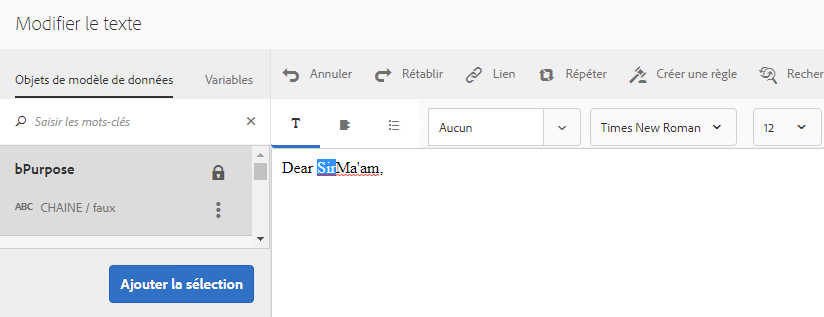

   La boîte de dialogue Condition s’affiche avec une condition vide.

   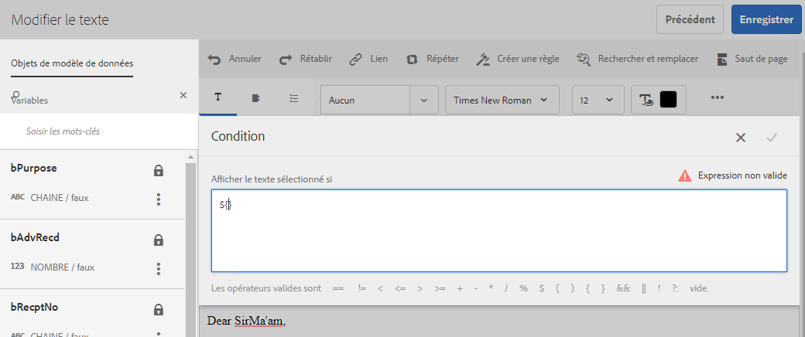

   >[!NOTE]
   >
   >Une expression conditionnelle vide ou non valide ne peut pas être enregistrée. Pour enregistrer l’expression, une expression conditionnelle valide doit se trouver à l’intérieur de `${}`.

1. Procédez comme suit pour créer une condition pour déterminer si le texte sélectionné/soumis à une condition apparaît dans la lettre, puis appuyez sur la coche pour enregistrer l’expression :

   Appuyez deux fois sur un élément DD pour l’insérer dans la condition. Insérez l’opérateur adéquat et créez la condition suivante dans la boîte de dialogue.

   ```javascript
   ${DD_creditcard_Gender=="Male"}
   ```

   Pour plus d’informations sur la création de l’expression, voir **Création d’expressions et de fonctions distantes avec le Générateur d’expression** dans [Expression Builder](../../forms/using/expression-builder.md). La valeur indiquée dans l’expression doit être prise en charge pour l’élément du dictionnaire de données. Pour de plus amples informations, voir [Dictionnaires de données](../../forms/using/data-dictionary.md).

   Une fois que la condition est insérée, vous pouvez placer le pointeur sur la poignée située à gauche de la condition pour afficher la condition. Vous pouvez appuyer sur la poignée pour afficher le menu contextuel de la condition, qui permet de modifier ou de supprimer la condition.

   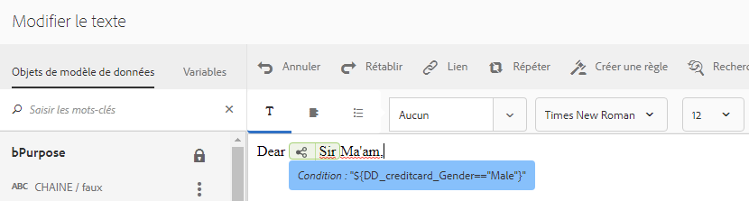 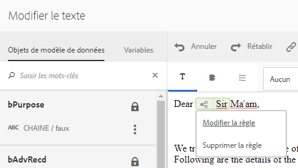

1. Insérez une condition similaire en sélectionnant le texte `Ma'am`.

   ```javascript
   ${DD_creditcard_Gender == "Female"}
   ```

1. Affichez l’aperçu de la lettre appropriée et notez que le texte est rendu en fonction de la condition intégrée. Vous pouvez saisir la valeur du sexe de l’élément DD en utilisant :

   * Un exemple de fichier de données XML créé en fonction du dictionnaire de données approprié lors de l’affichage de l’aperçu de la lettre avec des exemples de données.
   * Le fichier de données XML associé au dictionnaire de données approprié.

   Pour de plus amples informations, voir [Dictionnaires de données](../../forms/using/data-dictionary.md).

   

## Répéter {#repeat}

Vous pouvez disposer d’informations dynamiques dans votre communication interactive/lettre, telles que les transactions dans un relevé de carte de crédit, dont l’instance ou l’occurrence peut continuer de changer avec chaque lettre générée. La répétition permet de mettre en forme et structurer ces informations dynamiques dans votre fragment de document texte.

De plus, vous pouvez spécifier la condition/règle dans la structure de répétition pour appliquer une condition aux informations/entrées qui sont rendues dans la communication interactive/lettre.

### Exemple : utilisation de la répétition dans une communication interactive pour mettre en forme, structurer et afficher la liste des transactions de carte de crédit {#example-using-repeat-in-an-interactive-communication-to-format-structure-and-display-a-list-of-credit-card-transactions}

L’exemple suivant présente les étapes de l’utilisation de la répétition pour structurer et effectuer le rendu des transactions de carte de crédit dans une communication interactive.

1. Dans un fragment de document de texte basé sur un modèle de données de formulaire, insérez les objets de modèle de données de formulaire appropriés (et le texte incorporé requis pour les étiquettes, comme dans cet exemple) :

   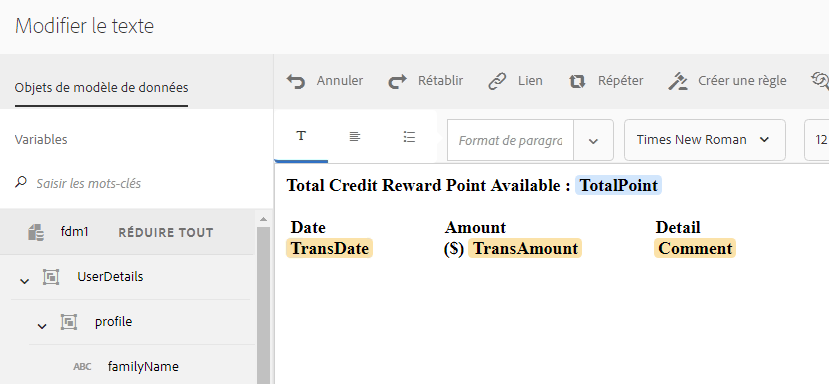

   >[!NOTE]
   >
   >Le contenu répétable doit inclure au moins une propriété du type Collection.

1. Sélectionnez le contenu sur lequel appliquer la répétition.

   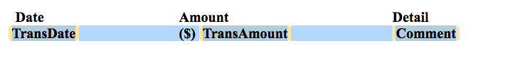

1. Appuyez sur Répéter.

   La boîte de dialogue Répéter s’affiche.

   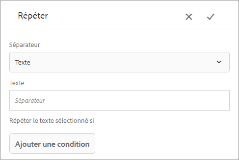

1. Sélectionnez Saut de ligne comme séparateur et, si nécessaire, appuyez sur Ajouter une condition pour créer une règle. Vous pouvez également utiliser le texte comme séparateur et spécifier les caractères à utiliser comme séparateur.

   La boîte de dialogue Créer une règle s’affiche.

1. Créez une règle pour afficher les transactions postérieures au 28 février 2018 afin d’inclure les transactions du mois de mars uniquement dans la communication interactive.

   >[!NOTE]
   >
   >Cet exemple suppose que l’agent créera la déclaration à la fin du mois de mars 2018. Sinon, vous pouvez créer une autre règle pour inclure les transactions antérieures au 01 avril 2018 et exclure les transactions postérieures à mars 2018.

   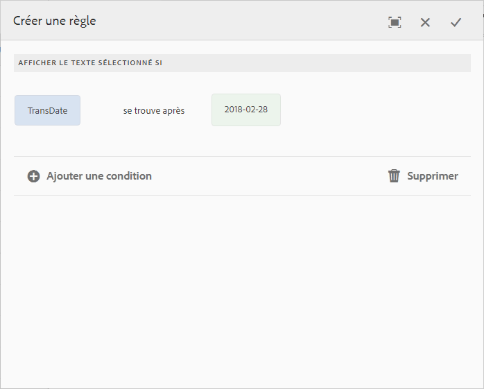

1. Enregistrez la condition/règle, puis enregistrez la répétition. La répétition conditionnelle est appliquée au contenu sélectionné.

   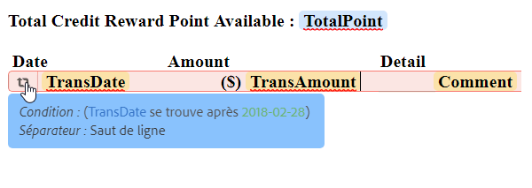

   Au passage de la souris, le fragment de document texte affiche la condition et le séparateur utilisé dans la répétition appliquée au contenu.

1. Enregistrez le fragment de document texte et prévisualisez la communication interactive concernée. Selon les données du modèle de données de formulaire, la répétition appliquée aux éléments effectue le rendu des détails de transaction similaires à ce qui suit dans l’aperçu :

   

### Exemple : utilisation de la répétition dans une lettre pour mettre en forme, structurer et afficher la liste des transactions de carte de crédit {#example-using-repeat-in-a-letter-to-format-structure-and-display-a-list-of-credit-card-transactions}

L’exemple suivant présente les étapes de l’utilisation de la répétition pour structurer et effectuer le rendu des transactions de carte de crédit dans une lettre. En utilisant les mêmes étapes, vous pouvez utiliser la répétition dans un scénario différent.

1. Ouvrez (lors de la modification ou de la création) un module de texte qui contient des éléments DD qui effectuent le rendu des données répétées/dynamiques et incorporez le texte requis autour des éléments DD. Par exemple, un module de texte comporte les éléments DD suivants pour créer une instruction des transactions d’une carte de crédit :

   ```javascript
   {^DD_creditcard_TransactionDate^} {^DD_creditcard_TransactionAmount^}
   {^DD_creditcard_TransactionType^}
   ```

   Ces éléments DD effectuent le rendu d’une liste des transactions réalisées sur la carte de crédit avec les informations suivantes :

   Date de transaction, montant de la transaction et type de transaction (débit ou crédit)

1. Incorporez le texte dans les éléments DD pour améliorer la lisibilité de l’instruction, comme suit :

   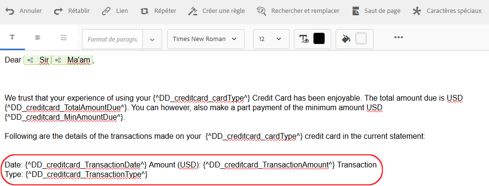

   ```javascript
   Date: {^DD_creditcard_TransactionDate^} Amount (USD): {^DD_creditcard_TransactionAmount^} Transaction Type: {^DD_creditcard_TransactionType^}
   ```

   Toutefois, la tâche de rendu d’une instruction mise en forme correctement n’est pas terminée. Si vous effectuez le rendu d’une lettre en fonction du travail réalisé jusqu’à présent, elle s’affiche comme suit :

   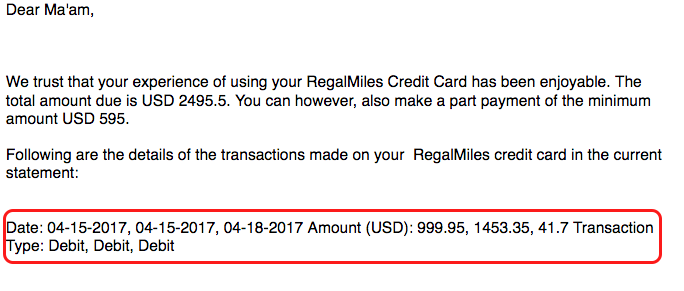

   Pour répéter le texte statique avec les éléments DD, vous devez appliquer la répétition comme expliqué dans les étapes supplémentaires.

1. Sélectionnez le texte statique ainsi que les éléments DD à répéter, comme illustré ci-dessous :

   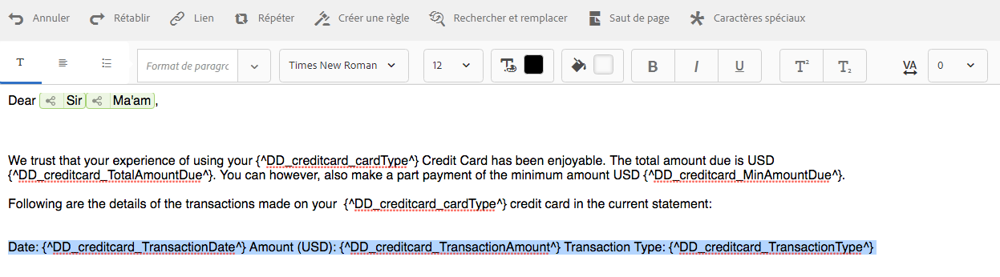

1. Appuyez sur **Répéter**. La boîte de dialogue Répéter s’affiche avec une condition intégrée vide.

   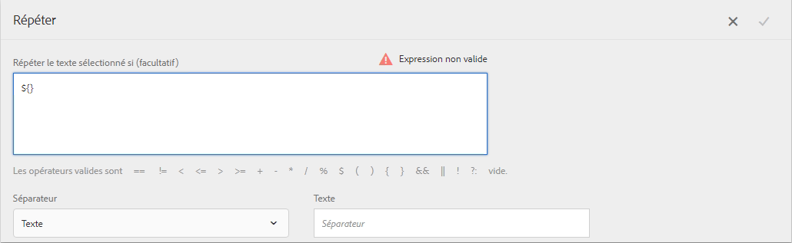

1. Si nécessaire, insérez une condition pour effectuer le rendu sélectif des transactions, par exemple pour effectuer le rendu des montants de transaction supérieurs à 50 cents :

   ```javascript
   ${DD_creditcard_TransactionAmount > 0.5}
   ```

   Dans le cas contraire, si vous n’avez pas besoin de rendre les informations (ici les transactions) de manière sélective, laissez la condition vide en supprimant ce qui suit dans la boîte de dialogue : `${}`. L’enregistrement d’une expression de répétition est activé lorsque la fenêtre d’expression de répétition est vide (sans ${} lorsqu’aucune de répétition n’est nécessaire) ou lorsqu’elle contient une condition valide pour la répétition.

1. Sélectionnez un séparateur pour mettre en forme le texte dynamique et appuyez sur la coche pour enregistrer :

   * **Saut de ligne** : insère un saut de ligne après chaque entrée de transaction dans la lettre de sortie.
   * **Texte** : insère le caractère de texte spécifié après chaque entrée de transaction dans la lettre de sortie.

   Une fois que la condition est insérée, le texte contenant la répétition est mis en surbrillance en rouge et une poignée apparaît sur sa gauche. Vous pouvez placer le pointeur sur la poignée située à gauche de la condition pour afficher la structure de la répétition.

   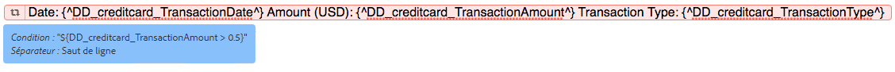

   Vous pouvez appuyer sur la poignée pour afficher le menu contextuel de la répétition, qui permet de modifier ou de supprimer la structure de la répétition.

   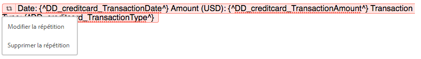

1. Affichez l’aperçu de la lettre appropriée et notez que le texte est rendu en fonction de la répétition. Vous pouvez saisir la valeur des éléments DD en utilisant :

   * Un exemple de fichier de données XML créé en fonction du dictionnaire de données approprié lors de l’affichage de l’aperçu de la lettre avec des exemples de données.
   * Le fichier de données XML associé au dictionnaire de données approprié.

   Pour de plus amples informations, voir [Dictionnaires de données](https://helpx.adobe.com/aem-forms/6-2/data-dictionary.html).

   

   Le texte statique se répète avec les détails de la transaction. La répétition du texte statique est facilitée par la répétition appliquée au texte dans cette procédure. La condition, ${DD_creditcard_TransactionAmount > 0.5}, garantit que les transactions inférieures à 0,5 USD ne sont pas rendues dans la lettre.

   >[!NOTE]
   >
   >Vous pouvez insérer la condition et la répétition uniquement lors de la création ou de la modification du module de texte approprié. Lors de la prévisualisation de la lettre, bien que vous puissiez apporter des modifications au module de texte, vous ne pouvez pas insérer une condition ou une répétition.

## Utilisation de la condition intégrée et de la répétition : plusieurs cas d’utilisation  {#using-inline-condition-and-repeat-some-use-cases}

### Répétition dans la condition {#repeat-within-condition}

Vous pouvez avoir besoin d’utiliser une répétition dans une condition. Correspondence Management vous permet d’utiliser la répétition dans une structure de condition intégrée.

Voici un exemple de répétition (mise en forme en rouge) dans une condition (mise en forme en vert).

Alors que la répétition rend les transactions de carte de crédit, la condition ${DD_creditcard_nooftransactions > 0} garantit que la structure de répétition est rendue uniquement s’il existe au moins une transaction.


De la même façon, selon vos besoins, vous pouvez créer :

* Une ou plusieurs conditions dans une condition
* Une ou plusieurs conditions dans une répétition
* Une combinaison de conditions et d’une répétition dans une condition ou répétition

### Condition intégrée vide {#empty-inline-condition}

Vous pouvez être amené à insérer des conditions intégrées et incorporer du texte et des éléments DD ultérieurement. Correspondence Management vous permet de procéder ainsi.

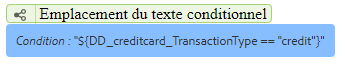

Il est toutefois recommandé, dans la mesure du possible, d’insérer le texte et les éléments DD en premier dans le module de texte avec la mise en forme prévue, telle que des puces, et d’appliquer une condition intégrée par la suite.
