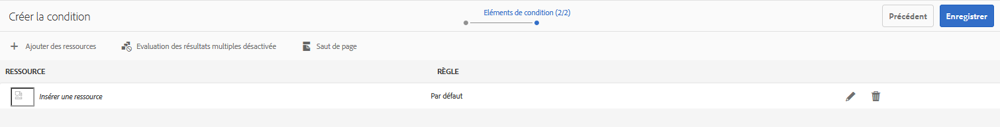
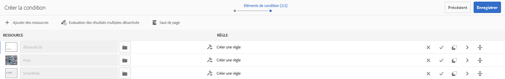
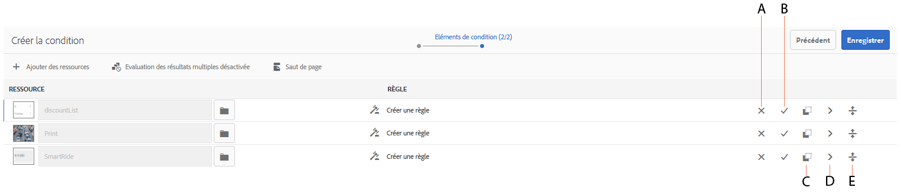
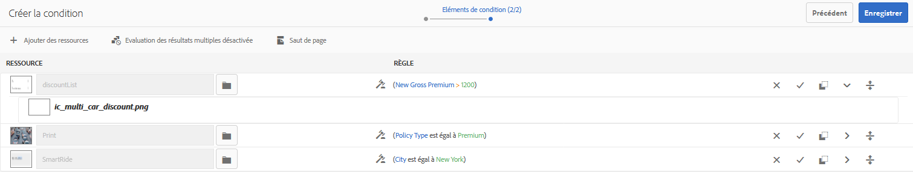
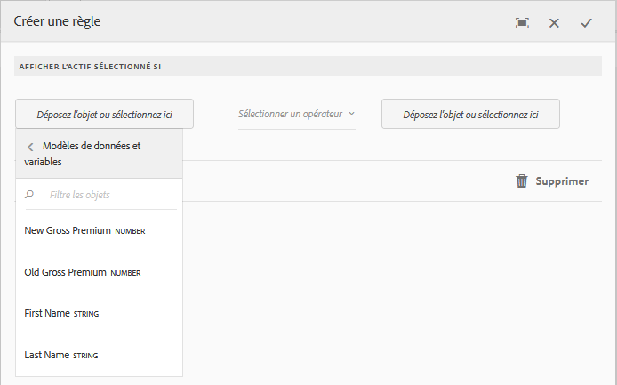
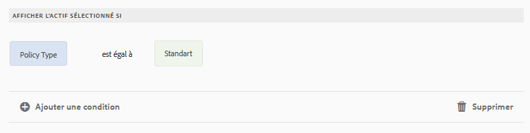
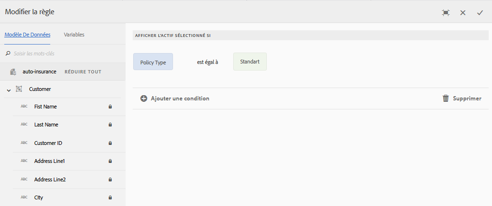
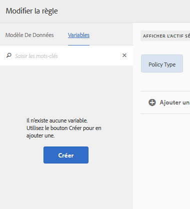

# Conditions dans les communications interactives{#conditions-in-interactive-communications}

Création et modification de fragments de condition à utiliser dans Communications interactives - Condition est l’un des quatre types de fragments de document utilisés pour créer des communications interactives. Les trois autres sont des fragments de texte, de liste et de mise en page.

## Présentation {#overview}

La condition est un fragment de document que vous pouvez inclure dans une communication interactive. Les autres fragments de document sont [texte](../../forms/using/texts-interactive-communications.md), liste et fragment de mise en page. Les conditions vous permettent de définir une ou plusieurs ressources contextuelles qui sont incluses dans une communication interactive en fonction des données et règles fournies.

Exemples :

* Dans un relevé de carte de crédit, affichez les frais annuels et l’image de la carte de crédit en fonction du type de carte de crédit du client.
* Dans un rappel relatif à une prime d’assurance, affichez les calculs de la taxe en fonction des impôts du client.

Les actifs des conditions rendues en fonction des règles appliquées et des valeurs transmises à la règle. Les règles des conditions peuvent vérifier les valeurs des types de données suivants :

* Propriété du modèle de données de formulaire associé
* Toute variable que vous créez dans la condition
* Chaînes
* Nombres
* Expressions mathématiques
* Dates

## Créer la condition {#createcondition}

1. Sélectionnez **[!UICONTROL Formulaires]** >**[!UICONTROL Fragments de document]**.
1. Sélectionnez **[!UICONTROL Créer]** > **[!UICONTROL Condition]**.
1. Saisissez les informations suivantes :

   * **[!UICONTROL Titre]** : (Facultatif) Saisissez le titre de la condition. Les titres ne doivent pas nécessairement être uniques et peuvent contenir des caractères spéciaux et des caractères dans une autre langue que l’anglais. Les conditions sont référencées par leur titre (le cas échéant) comme dans les vignettes et les propriétés.
   * **[!UICONTROL Nom]** : Nom unique de la condition, dans un dossier. Aucun fragment de document (texte, condition ou liste), quel que soit son état, ne peut porter le même nom qu’un autre fragment de document dans un dossier. Dans le champ nom, vous ne pouvez entrer que les caractères, les chiffres et les tirets d’anglais. Le champ Nom est automatiquement renseigné en fonction du champ Titre. Les caractères spéciaux, les espaces, les chiffres et les caractères non anglais saisis dans le champ Titre sont remplacés par des tirets dans le champ Nom. Bien que la valeur du champ Titre soit automatiquement copiée dans Nom, vous pouvez la modifier.

   * **[!UICONTROL Description]** : entrez une description du fragment de document.
   * **[!UICONTROL Modèle de données de formulaire]** : éventuellement, sélectionnez le bouton radio Modèle de données de formulaire pour créer la condition en fonction d’un modèle de données de formulaire. Lorsque vous sélectionnez l’option Modèle de données de formulaire, le champ **[!UICONTROL Modèle de données de formulaire]** s’affiche. Recherchez et sélectionnez un modèle de données de formulaire. Lorsque vous créez une condition pour une communication interactive, veillez à utiliser le même modèle de données que celui que vous avez l’intention d’utiliser dans la communication interactive. Pour plus d’informations sur le modèle de données de formulaire, consultez la section [Intégration de données](../../forms/using/data-integration.md).

   * **[!UICONTROL Balises]** : éventuellement, pour créer une balise personnalisée, entrez la valeur dans le champ de texte et appuyez sur Entrée. Lorsque vous enregistrez cette condition, les balises nouvellement ajoutées sont créées.

1. Appuyez sur **[!UICONTROL Next]** (Suivant).

   La page Créer une condition apparaît.

   

1. Appuyez sur **[!UICONTROL Ajouter des actifs]**.

   La page Sélectionner les actifs apparaît et affiche les textes, listes, conditions et images disponibles pour l’ajout dans la condition.

   >[!NOTE]
   >
   >Seuls les actifs basés sur le FDM et ceux non basés sur le FDM qui viennent d’être créés (créés à l’aide du même FDM que la condition créée) apparaissent dans la page Sélectionner les actifs.

1. Appuyez sur les actifs appropriés pour les sélectionner et les inclure dans la condition, puis appuyez sur **[!UICONTROL Terminé]**.

   La page Créer une condition apparaît et répertorie les actifs ajoutés.

   

   Vous pouvez utiliser les options suivantes pour gérer les actifs dans une condition :

   

   **[] AReject Change.** Appuyez sur cette icône pour rejeter les modifications que vous avez apportées à l’actif et à la règle dans la condition.
   **[] BAccept Change.** Appuyez sur cette icône pour accepter les modifications que vous avez apportées à l’actif et à la règle dans la condition.
   **[Ressource ] CDuplicate.** Appuyez sur cette icône pour créer une copie de l’actif avec la règle appliquée, le cas échéant, dans la condition. Vous pouvez ensuite modifier la règle et l’actif pour l’actif dupliqué. La duplication d’un actif est utile pour créer des règles similaires afin d’afficher des actifs alternatifs basés sur un contexte particulier.
   **[prévisualisation ] DShow.** Appuyez sur cette icône pour afficher un aperçu de l’actif dans la page Créer/Modifier la condition.
   **Réorganisation de &quot;serveur&quot;.** Appuyez et maintenez cette icône enfoncée pour glisser-déposer des actifs et les réorganiser dans une condition.

   Vous pouvez sélectionner les options suivantes pour spécifier le comportement de la condition au moment de l’exécution :

   * **Evaluation des résultats multiples désactivée/Evaluation des résultats multiples activée** : lorsque cette option est activée (s’affiche comme « Evaluation des résultats multiples activée »), toutes les règles sont évaluées et le résultat est la somme de toutes les règles réelles. Si cette option est désactivée (« Évaluation des résultats multiples désactivée »), alors seule la première règle qui s’avère vraie est évaluée et devient la sortie de la condition.

   * **Saut** de page : Sélectionnez cette option ( ) pour ajouter un saut de page entre les actifs des conditions. Si cette option n’est pas sélectionnée ( ), si une condition déborde sur la page suivante de la sortie d’impression, la condition entière est déplacée sur la page suivante au lieu de se briser entre les ressources de la condition.

1. Appuyez sur **[!UICONTROL Créer une règle]** pour ajouter des règles d’affichage ou de masquage des actifs, selon les besoins. Pour utiliser des variables dans les règles, consultez la section [Créer des variables](#variables). Pour plus d’informations, consultez la section [Ajouter des règles à la condition](#ruleeditor).

   Les règles créées apparaissent dans la colonne RULE de l’écran Créer une condition.

   

   >[!NOTE]
   >
   >Vous pouvez insérer dans votre condition des actifs dans lesquels des règles ou des répétitions ont déjà été appliquées.

1. Appuyez sur **[!UICONTROL Enregistrer]**.

   La condition est créée. Vous pouvez maintenant utiliser la condition comme bloc de construction lors de la création d’une communication interactive.

   >[!NOTE]
   >
   >Pour enregistrer une condition nouvelle ou modifiée, vous devez disposer d’au moins une règle pour chacun des actifs ajoutés à la condition.

## Modifier une condition {#edit-a-condition}

Vous pouvez modifier une condition en suivant les étapes suivantes. Vous pouvez également choisir de modifier une condition dans une communication interactive en sélectionnant Modifier le fragment dans le menu contextuel.

1. Sélectionnez **[!UICONTROL Formulaires]** >**[!UICONTROL Fragments de document]**.
1. Accédez à la condition et sélectionnez-la.
1. Appuyez sur **[!UICONTROL Modifier]**.
1. Effectuez les modifications nécessaires dans la condition. Pour plus de détails sur les informations que vous pouvez modifier dans une condition, consultez la section [Créer une condition](#createcondition).
1. Appuyez sur **[!UICONTROL Enregistrer]** puis sur **[!UICONTROL Fermer]**.

## Créer des règles dans une condition {#ruleeditor}

À l’aide de l’éditeur de règles dans une condition, vous pouvez créer des règles pour l’affichage ou le masquage des actifs en fonction de **conditions prédéfinies**. Ces conditions peuvent être construites en fonction de :

* Chaînes
* Nombres
* Expressions mathématiques
* Dates
* Propriétés du modèle de données de formulaire associé
* Toute [variable](#variables) que vous avez créée

### Créer une règle dans une condition  {#create-rule-in-condition}

1. Lors de la création ou de la modification d’une condition, appuyez sur l’icône  (Éditeur de règles) pour la ressource appropriée.

   La boîte de dialogue Créer une règle s’affiche. En plus de la chaîne, du nombre, de l’expression mathématique et de la date, les éléments suivants sont également disponibles dans l’éditeur de règles pour la création d’instructions :

   * Propriétés du modèle de données de formulaire associé
   * Les [variables](#variables) que vous avez potentiellement créées.

   

   Sélectionnez l’option pertinente à évaluer.

   >[!NOTE]
   >
   >La propriété Collection n’est pas prise en charge pour la création de règles d’affichage des actifs.

1. Sélectionnez l’opérateur approprié pour évaluer la règle, tel que Est égal à, Contient et Démarre avec.
1. Insérez l’expression d’évaluation, la chaîne, la propriété de modèle de données, la variable ou la date.

   

   Règle pour l’affichage d’un actif lorsque le type de stratégie est standard

   * Lors de la création ou de la modification d’une règle, vous pouvez également appuyer sur  (Redimensionner) pour développer la boîte de dialogue Créer une règle/Modifier la règle. La boîte de dialogue développée, pleine fenêtre, vous permet de créer des [variables](#variables) pour construire des règles. Appuyez à nouveau sur Redimensionner pour revenir à la boîte de dialogue Créer une règle.

   * Vous pouvez également créer plusieurs conditions dans une règle.

1. Appuyez sur **[!UICONTROL Done]** (Terminé). 

   La règle est appliquée à l’actif.

## Création et utilisation de variables dans une condition  {#variables}

Lors de la création ou de la modification d’une règle dans une condition, vous pouvez appuyer sur  (Redimensionner) pour développer la boîte de dialogue Créer une règle\Modifier la règle. La boîte de dialogue développée, pleine fenêtre, vous permet de :

* Créer et utiliser des variables dans la règle
* Glisser-déposer les propriétés et les variables du modèle de données de formulaire dans la règle

Appuyez à nouveau sur Redimensionner pour revenir à la boîte de dialogue Créer une règle\Modifier la règle.

### Créer des variables {#create-variables}

1. Lors de la création ou de la modification d’une règle dans une condition, vous pouvez appuyer sur  (Redimensionner) pour développer la boîte de dialogue Créer une règle\Modifier la règle.

   La boîte de dialogue développée, pleine fenêtre, s’affiche.

   

1. Dans le volet de gauche, appuyez sur **[!UICONTROL Variables]**.

   Le volet Variables apparaît.

   

1. Appuyez sur **[!UICONTROL Créer]**.

   Le volet Créer des variables apparaît.

1. Saisissez les informations suivantes et appuyez sur **[!UICONTROL Créer]** :

   * **[!UICONTROL Nom]** : Nom de la variable.
   * **[!UICONTROL Description]** : entrez éventuellement une description de la variable.
   * **[!UICONTROL Type]** : Sélectionnez un type de variable : Chaîne, Nombre, Valeur booléenne ou Date.
   * **[!UICONTROL Autoriser les valeurs spécifiques uniquement]** : pour les variables de type Chaîne et Nombre, vous pouvez garantir que l’agent choisisse parmi un ensemble spécifique de valeurs pour un espace réservé dans l’interface utilisateur de l’agent. Pour spécifier le jeu de valeurs, sélectionnez cette option, puis spécifiez des valeurs séparées par des virgules qui sont autorisées dans le champ **[!UICONTROL Valeurs]**.

1. Appuyez sur **[!UICONTROL Créer]**.

   La variable est créée et répertoriée dans le volet Variables.

1. Pour insérer une variable dans la règle, glissez-déposez-la dans un espace réservé à une option de la règle.
1. Après avoir construit une règle valide, appuyez sur **[!UICONTROL Terminé]**.

   Effectuez d’autres modifications dans la condition, si nécessaire, et enregistrez-la.

