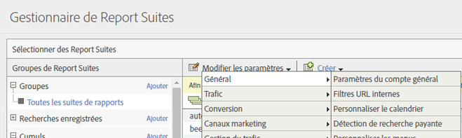
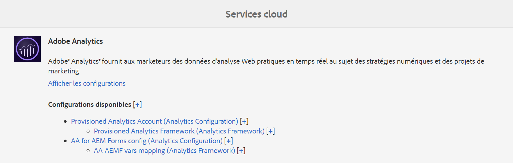
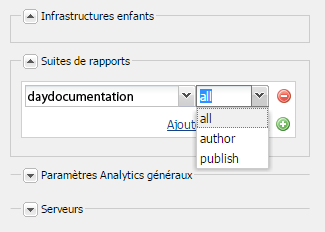
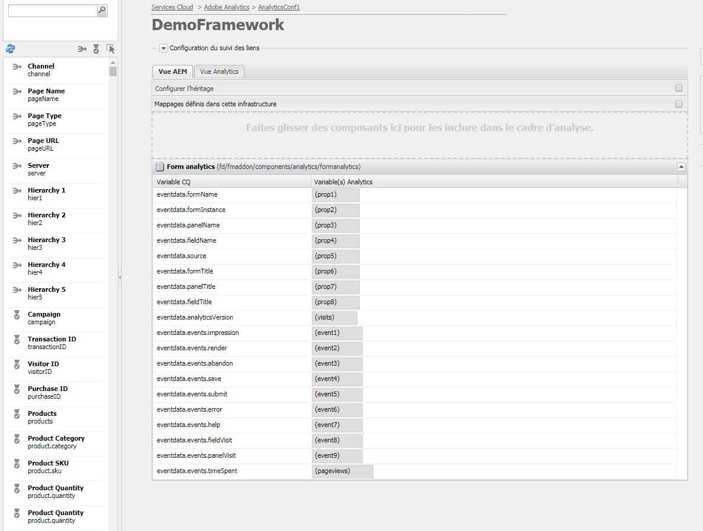
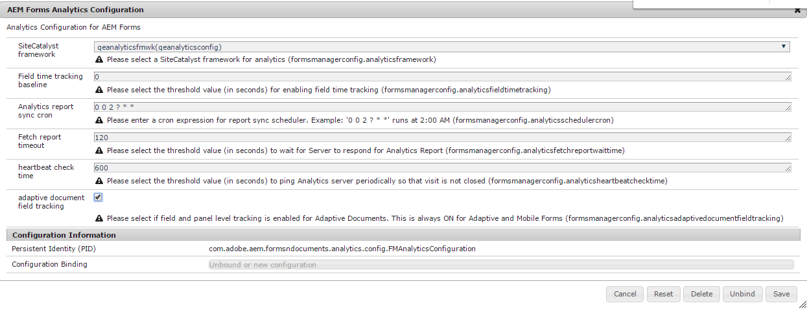
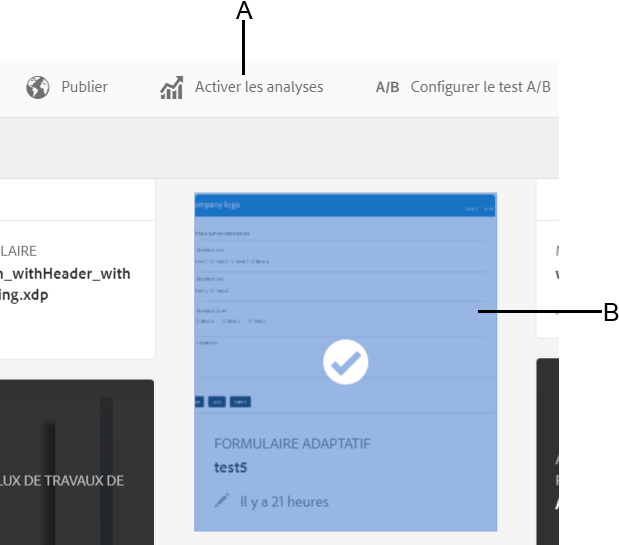

# Analytics avec le framework de service cloud {#analyticsusingcloudframework}

AEM Forms s’intègre à Analytics, ce qui permet la capture et le suivi des mesures de performances des formulaires et des documents que vous avez publiés. L’analyse de ces mesures contribue à une prise de décisions éclairée fondée sur les données, eu égard aux modifications requises pour concevoir des formulaires ou des documents plus faciles à utiliser.

>[!NOTE]
>
>La fonctionnalité d’analyse d’AEM Forms est disponible dans le package complémentaire d’AEM Forms. Pour plus d’informations sur l’installation du package de modules complémentaires, voir [Installation et configuration d’AEM Forms](../../forms/using/installing-configuring-aem-forms-osgi.md).
>
>Outre le package de modules complémentaires, vous devez disposer d’un compte Adobe Analytics et de droits d’administration sur l’instance AEM. Pour plus d’informations sur la solution, voir [Adobe Analytics](https://www.adobe.com/fr/solutions/digital-analytics.html).

Vous pouvez également effectuer des analyses à l’aide d’Adobe Launch. Pour plus d’informations sur l’intégration d’AEM Forms à Adobe Launch, reportez-vous à [Analytics avec Adobe Launch](/help/forms/using/integrate-aem-forms-with-adobe-analytics.md).

## Présentation {#overview}

Vous pouvez utiliser Adobe Analytics pour identifier les schémas et les problèmes d’interaction auxquels sont confrontés les utilisateurs lorsqu’ils utilisent des formulaires adaptatifs, des formulaires HTML5 et des communications interactives. D’emblée, Adobe Analytics permet d’effectuer le suivi et d’enregistrer les informations sur les paramètres suivants :

* **Durée moyenne de remplissage** : temps moyen passé au remplissage du formulaire.
* **Rendus** : nombre de fois qu’un formulaire est ouvert.
* **Brouillons** : nombre de fois qu’un formulaire est enregistré comme brouillon.
* **Envois** : nombre de fois qu’un formulaire est envoyé.
* **Abandons** : nombre de fois que les utilisateurs et utilisatrices ont quitté le site sans remplir le formulaire.

Vous pouvez personnaliser Adobe Analytics pour ajouter ou supprimer d’autres paramètres. Outre les informations ci-dessus, le rapport répertorie les informations suivantes à propos de chaque panneau du formulaire adaptatif et HTML5 :

* **Heure** :temps passé sur le panneau et les champs du panneau.
* **Erreur** : nombre d’erreurs survenues sur le panneau et sur les champs du panneau.
* **Aide** : nombre de fois qu’un utilisateur ouvre l’aide d’un panneau et des champs du panneau.

## Création d’une suite de rapports {#creating-report-suite}

Les données Analytics sont stockées dans des référentiels spécifiques aux utilisateurs et utilisatrices, appelés suites de rapports. Pour créer une suite de rapports et utiliser Adobe Analytics, vous devez disposer d’un compte Adobe Marketing Cloud valide. Avant d’effectuer les étapes suivantes, vérifiez que vous disposez d’un compte Adobe Marketing Cloud valide.

Procédez comme suit pour créer une suite de rapports.

1. Connectez-vous à [https://sc.omniture.com/login/](https://sc.omniture.com/login/).
1. Dans Marketing Cloud, sélectionnez **Admin** > **Admin Console** > **Suites de rapports**.
1. Sélectionnez **Nouveau** > **Suite de rapports** dans le Gestionnaire de suites de rapports.

   

   Création d’une suite de rapports

1. Veillez à ce que la première liste déroulante soit définie sur **Créer à partir d’un modèle**, puis sélectionnez **Commerce**.
1. Localisez le champ **Identifiant de suite de rapports** et ajoutez le nouvel identifiant de suite de rapports. Par exemple, JJEsquire. Un identifiant de suite de rapports apparaît sous le champ Identifiant de suite de rapports. Il contient un préfixe automatique, généralement le nom de la société.
1. Ajoutez un nouveau **Titre du site**. Par exemple, suite de démarrage JJEsquire. Ce titre est utilisé dans l’interface utilisateur d’Analytics. Utilisez l’identifiant de la suite de rapports dans votre code.
1. Sélectionnez un **Fuseau horaire** dans la liste déroulante. Toutes les données incluses dans cette suite de rapports sont enregistrées selon le fuseau horaire défini.
1. Laissez les champs **URL de base** et **Page par défaut** vides. Ces deux valeurs sont utilisées uniquement dans l’interface Adobe Marketing Cloud pour établir le lien vers votre site Web.
1. Laissez le champ **Date d’activation** défini sur aujourd’hui. La date d’activation détermine le jour d’activation de la suite de rapports.
1. Dans le champ **Estimation du nombre de pages vues par jour**, entrez 100. Utilisez ce champ pour donner une estimation du nombre de pages vues par jour que vous prévoyez sur votre site Web. Cette estimation permet à Adobe de mettre en place les ressources matérielles appropriées pour traiter les données que vous collecterez.
1. Sélectionnez une **devise de base** dans la liste déroulante. Toutes les données de devise incluses dans cette suite de rapports seront converties et stockées dans ce format de devise.
1. Cliquez sur **Créer une suite de rapports**. La page s’actualise avec un message indiquant que votre suite de rapports a été créée.
1. Sélectionnez la nouvelle suite de rapports. Cliquez sur **Modifier les paramètres** > **Général** > **Paramètres du compte général**.

   

   Paramètres du compte général

1. Sur l’écran Paramètres du compte général, activez **Rapports de géographie**, puis cliquez sur **Enregistrer.**.
1. Cliquez sur **Modifier les paramètres** > **Trafic** > **Variables de trafic**.
1. Dans la suite de rapports, configurez et activez les variables de trafic suivantes.

   * **formName** : identifiant d’un formulaire adaptatif.
   * **formInstance** : identifiant d’une instance de formulaire adaptatif. Activez les rapports Chemin d’accès pour cette variable.
   * **fieldName** : identifiant d’un champ de formulaire adaptatif. Activez les rapports Chemin pour cette variable.
   * **panelName** : identifiant d’un panneau de formulaire adaptatif. Activez les rapports Chemin d’accès pour cette variable.
   * **formTitle** : titre du formulaire.
   * **fieldTitle** : titre du champ de formulaire.
   * **panelTitle** : titre du panneau de formulaire.
   * **analyticsVersion** : version de l’analyse de formulaire.

1. Cliquez sur **Modifier les paramètres** > **Conversion** > **Événements de succès**. Définissez et activez les événements de succès suivants :

   | Événement de succès | Type |
   |---|---|
   | abandon | Compteur |
   | render | Compteur |
   | panelVisit | Compteur |
   | fieldVisit | Compteur |
   | save | Compteur |
   | erreur | Compteur |
   | help | Compteur |
   | envoyer | Compteur |
   | timeSpent | Numérique |

   >[!NOTE]
   >
   >Les numéros d’événements et de propriétés utilisés pour configurer AEM Forms Analytics doivent être différents des numéros d’événements et de propriétés utilisés dans la configuration d’[AEM Analytics](/help/sites-administering/adobeanalytics.md).

1. Déconnectez-vous du compte Adobe Marketing Cloud.

## Création de la configuration du service cloud {#creating-cloud-service-configuration}

La configuration du service cloud rassemble les informations sur votre compte Adobe Analytics. Elle permet à Adobe Experience Manager (AEM) de se connecter à Adobe Analytics. Créez une configuration distincte pour chaque compte Analytics que vous utilisez.

1. Connectez-vous à votre instance d’auteur en tant qu’administrateur AEM.
1. Dans le coin supérieur gauche, cliquez sur **Adobe Experience Manager** > **Outils**  > **Services cloud** > **Services cloud hérités**.
1. Recherchez l’icône **Adobe Analytics**. Cliquez sur **Afficher les configurations**, puis sur **[+]** pour ajouter une nouvelle configuration.

   Si vous êtes un utilisateur novice, cliquez sur **Configurer maintenant**.

1. Ajoutez un titre à votre nouvelle configuration (le champ Nom est facultatif). Par exemple, Configuration de mes analyses. Cliquez sur **Créer**.

1. Lorsque le panneau Modifier s’ouvre sur la page de configuration, renseignez les champs suivants :

   * **Entreprise** : le nom de votre entreprise comme présenté dans Adobe Analytics.
   * **Nom d’utilisateur** : nom utilisé pour se connecter à Adobe Analytics.
   * **Mot de passe** : mot de passe Adobe Analytics pour le compte ci-dessus.
   * **Centre de données** : centre de données de votre compte Adobe Analytics.

1. Cliquez sur **Se connecter à Analytics**. Une boîte de dialogue s’affiche pour indiquer que la connexion a réussi. Cliquez sur **OK**.

## Création du framework de service cloud {#creating-cloud-service-framework}

Un framework Adobe Analytics est un ensemble de mappages entre les variables Adobe Analytics et les variables AEM. Utilisez un framework pour configurer la façon dont vos formulaires renseignent les données dans les rapports Adobe Analytics. Les frameworks sont associés à une configuration Adobe Analytics. Vous pouvez créer plusieurs structures pour chaque configuration.

1. Sur la console de services Cloud AEM, cliquez sur **Afficher les configurations**, sous Adobe Analytics.
1. Cliquez sur le lien **[+]** en regard de votre configuration Analytics.

   

   Configuration d’Adobe Analytics

1. Saisissez un **titre** et un **nom** pour le cadre, sélectionnez le cadre **Adobe Analytics**, puis cliquez sur **Créer**. La structure s’ouvre en vue de la modification.
1. Dans la section Suites de rapport du volet latéral, cliquez sur **Ajouter un élément**, puis utilisez la liste déroulante pour sélectionner l’identifiant de la Suite de rapports (par exemple, JJEsquire) avec lequel interagira le cadre.
1. En regard de l’identifiant de la Suite de rapports, sélectionnez les instances de serveur pour lesquelles vous souhaitez envoyer des informations à la suite de rapports.

   

1. Faites glisser un **composant Form Analytics** de l’**autre** catégorie du panneau latéral sur le cadre.
1. Pour mapper les variables Analytics avec les variables qui sont définies dans le composant, faites glisser une variable de l’outil de recherche de contenu AEM sur un champ du composant de suivi.

   

1. Activez le cadre en utilisant l’**onglet de page** dans le panneau latéral, puis cliquez sur **Activer le cadre**.

## Configuration du service de configuration d’AEM Forms Analytics {#configuring-aem-forms-analytics-configuration-service}

1. Dans l’instance de création, ouvrez le gestionnaire de configuration de la console web d’AEM à l’adresse `https://<server>:<port>;/system/console/configMgr`.
1. Rechercher et ouvrir la Configuration Analytics d’AEM Forms

   

   Service de configuration d’AEM Forms Analytics

1. Indiquez les valeurs appropriées pour les champs suivants, puis cliquez sur **Enregistrer**.

   * **Framework de SiteCatalyst** : sélectionnez le framework ou la configuration que vous avez définie dans la section Configuration d’un framework pour le suivi .
   * **Ligne de base du suivi du temps passé sur le champ** : indiquez la durée, en secondes, après laquelle un suivi doit être effectué sur la visite du champ. La valeur par défaut est 0. Lorsque la valeur est supérieure à 0 (zéro), deux événements de suivi distincts sont envoyés au serveur Adobe Analytics. Le premier événement indique au serveur d’analyse d’arrêter le suivi du champ désactivé. Le second événement est envoyé une fois la durée spécifiée écoulée. Le second événement indique au serveur d’analyse de commencer le suivi du champ activé. L’utilisation de deux événements distincts permet de mesurer précisément le temps passé dans un champ. Lorsque la valeur est définie sur 0 (zéro), l’événement de suivi unique est envoyé au serveur Adobe Analytics.

   * **Expression cron de synchronisation des rapports d&#39;analyse** : spécifiez l’expression cron pour récupérer les rapports d’Adobe Analytics. La valeur par défaut est 0 0 2 ? &#42; &#42;.

   * **Délai de rapport d’extraction :** spécifiez la durée, en secondes, à attendre pour que le serveur réponde au rapport d’analyse. La valeur par défaut est de 120 secondes.

   >[!NOTE]
   >
   >Cela peut prendre jusqu’à 10 secondes de plus pour que l’opération de récupération du rapport expire, puis le nombre de secondes spécifié.

1. Répétez l’étape 1-3 sur l’instance à publier pour configurer les analyses.

Vous pouvez désormais activer les analyses pour les formulaires et générer un rapport d’analyse.

## Activation des analyses pour un formulaire ou un document {#enabling-analytics-for-a-form-or-document}

1. Connectez-vous au portail AEM à l’adresse `https://[hostname]:'port'`.
1. Cliquez sur **Formulaires > Formulaires &amp; Documents**, sélectionnez un formulaire ou un document, puis cliquez sur **Activer les analyses**. Les analyses sont activées.

   

   Activation des analyses pour un formulaire

   **A.** Bouton Activer Analytics **B.** Formulaire sélectionné

   Pour obtenir des informations détaillées sur l’affichage des rapports Forms Analytics, voir [Affichage et compréhension des rapports d’analyse d’AEM Forms](../../forms/using/view-understand-aem-forms-analytics-reports.md).
