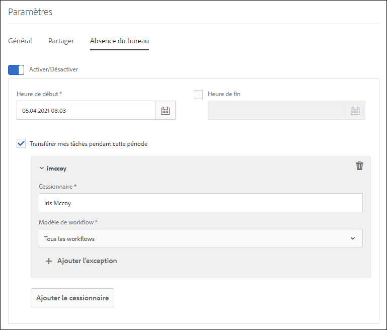

# Configuration du paramètre d’absence du bureau {#configure-out-of-office-settings}

Si vous prévoyez d’être absent du bureau, vous pouvez indiquer ce qui se passe pour les éléments qui vous sont affectés pour cette période.

Vous pouvez spécifier une date et une heure de début, ainsi qu’une date et une heure de fin, pour l’application de vos paramètres d’absence du bureau. Si vous vous trouvez dans un fuseau horaire différent du serveur, le fuseau horaire utilisé est celui du client.

Vous pouvez définir une personne par défaut à laquelle tous vos éléments sont envoyés. Vous pouvez également spécifier des exceptions pour les éléments de processus spécifiques à envoyer à un autre utilisateur ou à rester dans votre boîte de réception jusqu’à ce que vous reveniez. Si la personne désignée est également absente du bureau, l&#39;article est envoyé à l&#39;utilisateur qu&#39;elle a désigné. Si l&#39;article ne peut pas être affecté à un utilisateur qui n&#39;est pas absent du bureau, il reste dans votre boîte de réception.

Vous pouvez séparer la délégation d’éléments en fonction des modèles de processus. Par exemple, vous pouvez affecter un élément lié au flux de travail A à l’utilisateur A et affecter un élément lié au flux de travail B à l’utilisateur B.

>[!NOTE]
>
>* Lorsque vous activez le paramètre Absence du bureau, tous les éléments disponibles dans votre boîte de réception, avant d’activer ce paramètre, restent dans votre boîte de réception. Seuls les éléments reçus après l’activation du paramètre sont délégués.
>* Lorsque vous désactivez le paramètre d’absence du bureau, les éléments délégués ne vous sont pas automatiquement réaffectés. Vous pouvez utiliser la fonctionnalité de revendication pour vous affecter des éléments.
>* Lorsque l’utilisateur A délègue des éléments à l’utilisateur B et que l’utilisateur B délègue des éléments à l’utilisateur C, les éléments sont affectés uniquement à l’utilisateur C et non à l’utilisateur B.
>* Lorsqu’une boucle est présente dans l’affectation, les tâches restent avec l’utilisateur d’origine. Par exemple, lorsque l’utilisateur A délègue des éléments à l’utilisateur B, l’utilisateur C délègue des éléments à l’utilisateur C, l’utilisateur C délègue des éléments à l’utilisateur D et l’utilisateur D délègue des éléments à l’utilisateur B, une boucle est créée. Dans ce cas, l’élément reste à l’utilisateur d’origine. L’utilisateur A est l’utilisateur d’origine dans l’exemple ci-dessus.

## Activation du paramètre Absence du bureau pour votre compte {#enable-out-of-office}

Suivez les étapes ci-après pour activer le paramètre d’absence du bureau pour votre compte et déléguer vos éléments de boîte de réception à un autre utilisateur :

1. Connectez-vous à l’instance AEM  Appuyez sur l’icône  et appuyez sur **[!UICONTROL Vue tout]**. Une liste de vos éléments de boîte de réception s’affiche.
1. Appuyez sur l’icône Sélecteur  Vue ou Sélecteur  Vue située en regard du bouton **[!UICONTROL Créer]** et appuyez sur **[!UICONTROL Paramètres.]** La boîte de dialogue des paramètres s’affiche.
1. Ouvrez l’onglet **[!UICONTROL Absence du bureau]** dans la boîte de dialogue des paramètres.
1. Appuyez sur le bouton **[!UICONTROL Activer/Désactiver]** pour activer le paramètre Absence du bureau.
1. Spécifiez l’heure **[!UICONTROL de]** Début et l’heure **[!UICONTROL de]** fin du paramètre. Les éléments sont délégués uniquement pendant la période spécifiée. Laissez le champ Heure **[!UICONTROL de]** fin vide pour déléguer des éléments pour une période indéfinie.
1. Cochez la case **[!UICONTROL Transférer mes éléments pendant cette période]** . Si vous ne sélectionnez pas l’option et ne spécifiez pas de personne désignée, vos éléments ne sont transférés à aucun utilisateur. Bien que vous soyez absent et que le paramètre soit activé, les éléments restent dans votre boîte de réception.
1. Appuyez sur **[!UICONTROL Ajouter le signataire]**. Indiquez un utilisateur dans le champ **[!UICONTROL Personne]** à qui déléguer les éléments. Spécifiez le modèle **[!UICONTROL de]** flux de travail à déléguer à l’utilisateur spécifié. Vous pouvez sélectionner plusieurs modèles de processus.

   En outre, pour affecter tous les éléments, quel que soit le modèle de processus, à un utilisateur particulier, sélectionnez **[!UICONTROL Tous les Workflows]** dans la liste déroulante Modèle de processus.  

   Pour affecter des éléments à un utilisateur particulier pour tous les modèles de processus sauf quelques-uns, sélectionnez **[!UICONTROL Tous les Workflows]** dans la liste déroulante Modèle de processus, appuyez sur **[!UICONTROL + Ajouter les exceptions]**et spécifiez les modèles de processus à exclure.
    

   Répétez l’étape pour ajouter d’autres personnes désignées.  

   >[!NOTE]
   >
   >L&#39;ordre des personnes désignées est important. Lorsqu’un élément est affecté à un utilisateur qui a activé le paramètre d’absence du bureau, l’élément est évalué par rapport à la liste désignée dans l’ordre d’ajout des personnes désignées. Lorsqu’un élément correspond aux critères, il est affecté à la personne désignée et la personne désignée suivante n’est pas cochée.

1. Appuyez sur **[!UICONTROL Save]** (Enregistrer). Ce paramètre prend effet à la date et à l’heure de début spécifiées. Si vous vous connectez pendant que vous êtes absent du bureau, vous êtes toujours considéré comme absent du bureau jusqu’à ce que vous ayez modifié vos paramètres.

Désormais, les éléments qui vous sont affectés au cours de la période d’absence du bureau sont automatiquement affectés à la personne désignée.

>[!NOTE]
>
>(Pour les éléments de flux de travaux centrés sur les formulaires uniquement) Activez l’option **Autoriser les personnes désignées à déléguer à l’aide des paramètres** &quot;Absence du bureau&quot; de l’étape **Attribuer la tâche** du processus. Seuls les éléments pour lesquels l’option ci-dessus est activée sont délégués à d’autres utilisateurs.

## Restrictions {#limitations}

* L’affectation d’éléments à un groupe n’est pas prise en charge.
* L’activation de l’absence du bureau pour les tâches de projet n’est actuellement pas prise en charge.
