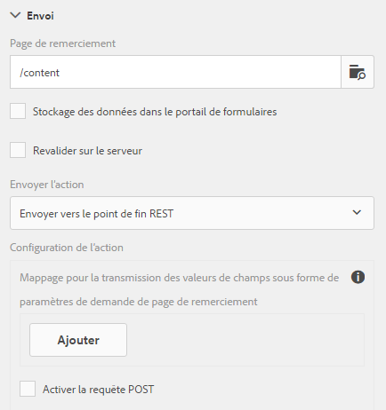

# Configuration de la page de redirection{#configuring-redirect-page}

Pour chaque formulaire, les auteurs peuvent configurer une page vers laquelle les utilisateurs seront redirigés après l’envoi du formulaire.

1. En mode d’édition, sélectionnez un composant, puis cliquez sur  > **Conteneur de formulaire adaptatif**, puis sur .

1. Dans la barre latérale, cliquez sur **Envoi**. 

1. Indiquez L’URL de la page de redirection sous Page de remerciement dans la section Envoyer. 
1. Sous Action Envoyer, vous pouvez éventuellement configurer le paramètre à transmettre à la page de redirection pour l’action Envoyer vers le point de fin REST.

Configuration de la page de redirection

Les auteurs de formulaires peuvent utiliser les paramètres suivants qui sont transmis à la page de remerciement. Pour toutes les actions d’envoi disponibles, les paramètres `status` et `owner` sont transmis. Outre ces deux paramètres, des paramètres supplémentaires sont transmis pour les actions d’envoi suivantes :

* **Action**  Stocker le contenu (obsolète) :  `contentPath`—le chemin d’accès du noeud dans le référentiel où sont stockées les données envoyées est transmis.

* **Action**  Stocker le PDF (obsolète) :  `contentPath`—des données envoyées et du chemin d’accès au noeud qui stocke le fichier PDF dans le référentiel—est transmis.

* **Flux de travail Envoyer aux formulaires** : les paramètres de sortie renvoyés à partir du flux de travail des formulaires sont transmis.

* **Envoyer vers le point de fin REST** : les paramètres ajoutés pour la correspondance entre le champ et le paramètre sont transmis. Les paramètres `status` et `owner` ne sont pas transmis à cette action d’envoi. Pour en savoir plus, consultez [Configuration de l’action d’envoi Envoyer vers le point de fin REST](../../forms/using/configuring-submit-actions.md). 

