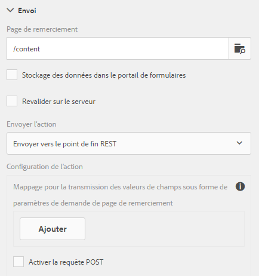

# Configurer l’action d’envoi{#configuring-the-submit-action}

 Adobe recommande d’utiliser la capture de données moderne et extensible. [Composants principaux](https://experienceleague.adobe.com/docs/experience-manager-core-components/using/adaptive-forms/introduction.html?lang=fr) pour [création d’un Forms adaptatif](/help/forms/using/create-an-adaptive-form-core-components.md) ou [Ajout de Forms adaptatif à des pages AEM Sites](/help/forms/using/create-or-add-an-adaptive-form-to-aem-sites-page.md). Ces composants représentent une avancée significative dans la création de Forms adaptatif, ce qui garantit des expériences utilisateur impressionnantes. Cet article décrit l’approche plus ancienne de la création de Forms adaptatif à l’aide de composants de base. 

| Version | Lien de l’article |
| -------- | ---------------------------- |
| AEM as a Cloud Service | [Cliquez ici](https://experienceleague.adobe.com/docs/experience-manager-cloud-service/content/forms/adaptive-forms-authoring/authoring-adaptive-forms-foundation-components/configure-submit-actions-and-metadata-submission/configuring-submit-actions.html?lang=fr) |
| AEM 6.5 | Cet article |

## Présentation des actions d’envoi {#introduction-to-submit-actions}

Une action d’envoi est déclenchée lorsqu’un utilisateur clique sur le bouton Envoyer d’un formulaire adaptatif. Vous pouvez configurer l’action d’envoi sur le formulaire adaptatif. Les formulaires adaptatifs fournissent quelques actions d’envoi prêtes à l’emploi. Vous pouvez copier et étendre les actions d’envoi par défaut afin de créer votre propre action. Cependant, en fonction des exigences, vous pouvez rédiger et enregistrer votre propre action d’envoi afin de traiter les données du formulaire envoyé. Une action d’envoi peut utiliser un [envoi synchrone ou asynchrone](../../forms/using/asynchronous-submissions-adaptive-forms.md).

Vous pouvez configurer une action d’envoi dans la section **Envoi** des propriétés du conteneur de formulaire adaptatif, dans la zone latérale.

Configuration de l’action d’envoi

Les actions d’envoi par défaut disponibles avec les formulaires adaptatifs sont les suivantes :

* Envoyer vers le point d’entrée REST
* Envoyer un e-mail
* Envoyer un PDF par courrier électronique
* Appeler un workflow de formulaires
* Envoyer à l’aide du modèle de données de formulaire
* Action d’envoi du Forms Portal
* Appeler un workflow AEM

>[!NOTE]
>
>L’envoi d’un PDF via une action Envoyer un e-mail s’applique uniquement aux formulaires adaptatifs qui utilisent le modèle XFA comme modèle de formulaire.

>[!NOTE]
>
>Vérifiez que le dossier [AEM_Installation_Directory]\crx-quickstart\temp\datamanager\ASM
>pas. Le répertoire est nécessaire pour stocker temporairement des pièces jointes. Si le fichier n’existe pas, créez-le.

>[!CAUTION]
>
>Si vous [préremplissez](../../forms/using/prepopulate-adaptive-form-fields.md) un modèle de formulaire, un modèle de données de formulaire ou un formulaire adaptatif basé sur un schéma avec des données XML ou JSON conformes à un schéma (schéma XML, schéma JSON, modèle de formulaire ou modèle de données de formulaire) présentant des données ne contenant pas les balises &lt;afData>, &lt;afBoundData> et &lt;/afUnboundData>, les données des champs illimités (les champs illimités sont les champs de formulaire adaptatif sans la propriété [bindref](../../forms/using/prepopulate-adaptive-form-fields.md)) du formulaire adaptatif sont perdues.

Vous pouvez écrire une action d’envoi personnalisée pour les formulaires adaptatifs afin de répondre à votre cas d’utilisation. Pour plus d’informations, voir [Création d’une action Envoyer personnalisée pour les formulaires adaptatifs](../../forms/using/custom-submit-action-form.md).

## Envoyer vers le point d’entrée REST {#submit-to-rest-endpoint}

La variable **Envoyer vers le point de fin REST** l’option d’envoi transmet les données renseignées dans le formulaire à une page de confirmation configurée dans le cadre de la demande de GET HTTP. Vous pouvez ajouter le nom des champs à demander. Le format de la requête est :

`{fieldName}={request parameter name}`

Comme illustré ci-dessous, `param1` et `param2` sont transmis en tant que paramètres avec des valeurs copiées à partir des champs **textbox** et **numericbox** pour la prochaine action.

Vous pouvez également **Activer la requête POST** et fournir une URL pour la publication de la requête. Pour envoyer des données au serveur Experience Manager qui héberge le formulaire, utilisez un chemin d’accès relatif correspondant au chemin racine du serveur Experience Manager. Par exemple, /content/forms/af/SampleForm.html. Pour envoyer des données vers un autre serveur, utilisez un chemin d’accès absolu.

Configuration de l’action Envoyer vers le point d’entrée REST

>[!NOTE]
>
Pour transmettre les champs en tant que paramètres dans une URL REST, tous les champs doivent avoir des noms d’éléments différents, même s’ils sont placés sur différents panneaux.

### Publier les données envoyées vers une ressource ou un point de fin REST externe  {#post-submitted-data-to-a-resource-or-external-rest-end-point-nbsp}

Utilisez l’action **Envoyer vers le point d’entrée REST** pour transmettre les données envoyées à l’URL REST. L’URL peut être celle d’un serveur interne (le serveur sur lequel le formulaire est rendu) ou externe.

Pour publier des données sur un serveur interne, indiquez le chemin de la ressource. Les données sont publiées avec le chemin de la ressource. Par exemple, /content/restEndPoint. Pour ces requêtes de publication, les informations d’authentification de la requête d’envoi sont utilisées.

Pour publier des données sur un serveur externe, indiquez une URL. Le format de l’URL est le suivant : https://host:port/path_to_rest_end_point. Assurez-vous de configurer le chemin pour que la requête POST soit traitée anonymement.

Dans l’exemple ci-dessus, les informations saisies par l’utilisateur dans `textbox` sont capturées au moyen du paramètre `param1`. La syntaxe permettant de publier les données capturées au moyen de `param1` est :

`String data=request.getParameter("param1");`

De même, les paramètres que vous utilisez pour publier des données XML et des pièces jointes sont `dataXml` et `attachments`.

Par exemple, vous utilisez ces deux paramètres dans votre script pour analyser les données à un point d’entrée REST. Vous utilisez la syntaxe suivante pour stocker et analyser les données :

`String data=request.getParameter("dataXml");`
`String att=request.getParameter("attachments");`

Dans cet exemple, `data` contient les données XML et `att` les données des pièces jointes.

## Envoyer un e-mail {#send-email}

L’action d’envoi **Envoyer un e-mail** envoie un message électronique à un ou plusieurs destinataires lors d’un envoi réussi du formulaire. Le message généré peut contenir des données de formulaire dans un format prédéfini.

>[!NOTE]
>
Tous les champs de formulaire doivent avoir des noms d’éléments différents, même s’ils sont placés sur des panneaux différents), afin d’inclure des données de formulaire dans un email.

## Envoyer un PDF par courrier électronique {#send-pdf-via-email}

L’action d’envoi **Envoyer le PDF par courrier électronique** envoie un message électronique avec un fichier PDF contenant des données de formulaire à un ou plusieurs destinataires lors d’un envoi réussi du formulaire.

>[!NOTE]
>
Cette action d’envoi est disponible pour les formulaires adaptatifs XFA et XSD ayant le modèle de document d’enregistrement.

## Appeler un processus de formulaires {#invoke-a-forms-workflow}

L’option d’envoi **Envoyer à Forms Workflow** envoie un fichier XML de données et des pièces jointes (le cas échéant) à un processus Adobe LiveCycle ou AEM Forms on JEE existant.

Pour plus d’informations sur la configuration de l’action d’envoi Envoyer au workflow de formulaires, voir [Envoyer et traiter vos données de formulaire à l’aide de workflows de formulaires](../../forms/using/submit-form-data-livecycle-process.md).

## Envoyer à l’aide du modèle de données de formulaire {#submit-using-form-data-model}

L’action d’envoi **Envoyer à l’aide du modèle de données de formulaire** écrit les données de formulaire adaptatif envoyés pour l’objet de modèle de données spécifié dans un modèle de données de formulaire vers sa source de données. Lors de la configuration de l’action d’envoi, vous pouvez choisir un objet de modèle de données dont vous souhaitez écrire les données envoyées dans sa source de données.

En outre, vous pouvez envoyer une pièce jointe de formulaire à l’aide d’un modèle de données de formulaire et d’un document d’enregistrement à la source de données.

Pour plus d’informations sur le modèle de données du formulaire, voir [Intégration de données AEM Forms](../../forms/using/data-integration.md).

## Action d’envoi du portail Forms {#forms-portal-submit-action}

L’option **Action d’envoi du portail Forms** rend les données de formulaire disponibles à travers un portail AEM Forms.

Pour plus d’informations sur le portail Forms et l’action d’envoi, voir [Composant Drafts &amp; Submissions](../../forms/using/draft-submission-component.md).

## Appeler un processus AEM {#invoke-an-aem-workflow}

L’action d’envoi **[!UICONTROL Appeler un processus AEM]** associe un formulaire adaptatif à un [processus AEM](/help/sites-developing/workflows-models.md). Lorsqu’un formulaire est envoyé, le processus associé commence automatiquement sur l’instance de création. Vous pouvez enregistrer le fichier de données, les pièces jointes et le document d’enregistrement dans le dossier correspondant, dans la payload du workflow ou dans une variable. Si le workflow est configuré pour le stockage de données externes, l’option Variable est disponible et non l’option Payload. Vous pouvez choisir dans la liste des variables disponibles pour le modèle de workflow. Si le processus est marqué pour le stockage des données externes à une étape ultérieure et non au moment de la création du processus, assurez-vous que les configurations de variable requises sont en place.

Avant d’utiliser l’action d’envoi **Appeler un workflow AEM**, [configurer les paramètres AEM DS](../../forms/using/configuring-the-processing-server-url-.md). Pour plus d’informations sur la création d’un processus AEM, voir [Processus basés sur l’utilisation de Forms sur OSGi](../../forms/using/aem-forms-workflow.md).

L’action Envoyer place les éléments suivants à l’emplacement de la payload du workflow. Notez toutefois que seule l’option Variable s’affiche si le modèle de workflow est configuré pour le stockage de données externes et non l’option Payload.

* **Fichier de données** : Il contient les données envoyées au formulaire adaptatif. Vous pouvez utiliser l’option **[!UICONTROL Chemin d’accès au fichier de données]** pour spécifier le nom du fichier et le chemin d’accès du fichier par rapport à la charge utile. Par exemple, le chemin d’accès `/addresschange/data.xml` crée un dossier nommé `addresschange` et le place par rapport à la charge utile. Vous pouvez également spécifier uniquement `data.xml` pour envoyer uniquement les données envoyées sans créer de hiérarchie de dossiers. Utilisez l’option Variable et sélectionnez la variable dans la liste des variables disponibles pour le modèle de workflow.

>[!NOTE]
>
Vous pouvez utiliser des variables que le modèle de workflow soit configuré pour le stockage de données externes ou non.

* **Pièces jointes** : vous pouvez utiliser l’option **[!UICONTROL Chemin d’accès aux pièces jointes]** pour spécifier le nom de dossier dans lequel stocker les pièces jointes chargées dans le formulaire adaptatif. Le dossier est créé par rapport à la payload. Si le workflow est marqué pour le stockage de données externe, utilisez l’option variable et sélectionnez la variable dans la liste des variables disponibles pour le modèle de workflow.

* **Document d’enregistrement** : il contient le document d’enregistrement généré pour le formulaire adaptatif. Vous pouvez utiliser l’option **[!UICONTROL Chemin du document d’enregistrement]** pour spécifier le nom du fichier de document d’enregistrement et le chemin d’accès du fichier par rapport à la charge utile. Par exemple, le chemin d’accès `/addresschange/DoR.pdf` crée un dossier nommé `addresschange` relatif à la charge utile et place `DoR.pdf` relatif à la charge utile. Vous pouvez également spécifier uniquement `DoR.pdf` pour n’enregistrer que le document d’enregistrement sans créer de hiérarchie de dossiers. Si le workflow est marqué pour le stockage de données externe, utilisez l’option variable et sélectionnez la variable dans la liste des variables disponibles pour le modèle de workflow.

## Revalidation côté serveur dans un formulaire adaptatif {#server-side-revalidation-in-adaptive-form}

En règle générale, dans n’importe quel système de capture de données en ligne, les développeurs placent des validations JavaScript côté client pour appliquer des règles métier. Mais dans les navigateurs modernes, les utilisateurs finaux peuvent contourner ces validations et effectuer les envois manuellement à l’aide de différentes méthodes, comme la console Web Browser DevTools. Ces méthodes sont également valables pour les formulaires adaptatifs. Un développeur de formulaires peut créer différentes logiques de validation, mais techniquement, les utilisateurs finaux peuvent contourner ces logiques de validation et soumettre des données non valides au serveur. Les données non valides enfreindraient les règles métier appliquées par un créateur ou une créatrice de formulaires.

La fonction de revalidation côté serveur permet également d’exécuter les validations fournies par un auteur de formulaires adaptatifs lors de la conception d’un formulaire adaptatif sur le serveur. Elle empêche toute erreur lors des envois de données et toute violation des règles de fonctionnement représentées en termes de validations de formulaire.

### Quels éléments valider sur le serveur ?  {#what-to-validate-on-server-br}

Toutes les validations de champ prêtes à l’emploi (OOTB) d’un formulaire adaptatif qui sont réexécutées sur le serveur sont les suivantes :

* Requis
* Clause d’image de validation
* Expression de validation

### Activation de la validation côté serveur {#enabling-server-side-validation-br}

Utilisez **Revalider sur le serveur** sous le conteneur de formulaires adaptatifs dans la zone latérale pour activer ou désactiver la validation côté serveur pour le formulaire actif.

Activer la validation côté serveur

Si l’utilisateur final ou l’utilisatrice finale contourne ces validations et soumet les formulaires, le serveur effectue à nouveau la validation. Si la validation échoue du côté du serveur, la transaction d’envoi est arrêtée. L’utilisateur final voit de nouveau s’afficher le formulaire d’origine. Pour l’utilisateur, les données capturées et les données envoyées s’affichent en tant qu’erreurs.

>[!NOTE]
>
La validation côté serveur permet de valider le modèle de formulaire. Il est recommandé de créer une bibliothèque cliente distincte pour les validations et de ne pas la mélanger à d’autres éléments tels que le style de HTML et la manipulation DOM dans la même bibliothèque cliente.

### Prise en charge des fonctions personnalisées dans les expressions de validation {#supporting-custom-functions-in-validation-expressions-br}

Parfois, en cas de règles de validation complexes, le script de validation exact réside dans des fonctions personnalisées que l’auteur doit appeler à partir de l’expression du champ de validation. Pour rendre cette bibliothèque de fonctions personnalisées visible et disponible lors des validations côté serveur, l’auteur de formulaires peut configurer le nom de la bibliothèque cliente AEM sous l’onglet **Réglages de base** des propriétés de conteneur de formulaires adaptatifs comme illustré ci-dessous.

Prendre en charge des fonctions personnalisées dans les expressions de validation

L’auteur peut configurer la bibliothèque personnalisée JavaScript pour chaque formulaire adaptatif. Dans la bibliothèque, conservez uniquement les fonctions réutilisables ayant une dépendance sur les bibliothèques tierces jquery et underscore.js.

## Gestion d’erreurs sur l’action d’envoi {#error-handling-on-submit-action}

Dans le cadre de la sécurité Experience Manager et des conseils de renforcement, configurez les pages d’erreur personnalisées telles que 404.jsp et 500.jsp. Ces gestionnaires sont appelés lorsque, lors de l’envoi d’un formulaire, des erreurs 404 ou 500 s’affichent. Les gestionnaires sont également appelés lorsque ces codes d’erreur sont déclenchés sur le nœud de publication.

Pour plus d’informations, voir [Personnaliser les pages affichées par le gestionnaire d’erreurs](/help/sites-developing/customizing-errorhandler-pages.md).
