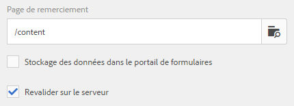

# Configuration de l’action d’envoi{#configuring-the-submit-action}

## Présentation des actions d’envoi {#introduction-to-submit-actions}

Une action d’envoi est déclenchée lorsqu’un utilisateur clique sur le bouton Envoyer d’un formulaire adaptatif. Vous pouvez configurer l’action d’envoi sur le formulaire adaptatif. Les formulaires adaptatifs fournissent quelques actions d’envoi prêtes à l’emploi. Vous pouvez copier et étendre les actions d’envoi par défaut pour créer votre propre action d’envoi. Cependant, en fonction des exigences, vous pouvez rédiger et enregistrer votre propre action d’envoi afin de traiter les données du formulaire envoyé. L’action d’envoi peut utiliser [envoi synchrone ou asynchrone](../../forms/using/asynchronous-submissions-adaptive-forms.md).

Vous pouvez configurer une action d’envoi dans la section **Envoi** des propriétés du conteneur de formulaire adaptatif, dans la zone latérale.

Configuration de l’action d’envoi

Les actions d’envoi par défaut disponibles avec les formulaires adaptatifs sont les suivantes :

* Envoyer vers le point de fin REST
* Envoyer un courrier électronique
* Envoyer un fichier PDF par courrier électronique
* Appeler un processus de formulaires
* Envoyer à l’aide du modèle de données de formulaire
* Action d’envoi du Forms Portal
* Appeler un processus AEM

>[!NOTE]
>
>L’envoi d’un PDF via une action Envoyer un e-mail s’applique uniquement aux formulaires adaptatifs qui utilisent le modèle XFA comme modèle de formulaire.

>[!NOTE]
>
>Assurez-vous que [AEM_Installation_Directory]\crx-quickstart\temp\datamanager\ASM folder
>pas. Le répertoire est nécessaire pour stocker temporairement des pièces jointes. Si le fichier n’existe pas, créez-le.

>[!CAUTION]
>
>Si vous [préremplissez](../../forms/using/prepopulate-adaptive-form-fields.md) un modèle de formulaire, un modèle de données de formulaire ou un formulaire adaptatif basé sur un schéma avec plainte de données XML ou JSON à un schéma (schéma XML, schéma JSON, modèle de formulaire ou modèle de données de formulaire) qui est des données ne contient pas de &lt;afData>, &lt;afBoundData> et &lt;/afUnboundData>, alors les données ne sont pas limitées Les champs non liés sont des champs de formulaire adaptatif sans [bindref](../../forms/using/prepopulate-adaptive-form-fields.md) propriété) du formulaire adaptatif perdus.

Vous pouvez créer une action d’envoi personnalisée pour les formulaires adaptatifs afin de répondre à votre cas d’utilisation. Pour plus d’informations, voir [Création d’une action Envoyer personnalisée pour les formulaires adaptatifs](../../forms/using/custom-submit-action-form.md).

## Envoyer vers le point de fin REST {#submit-to-rest-endpoint}

L’option d’envoi **Envoyer vers le point de fin REST** transmet les données renseignées dans le formulaire à une page de confirmation configurée dans le cadre de la requête HTTP GET. Vous pouvez ajouter le nom des champs à la requête. Le format de la requête est le suivant :

`{fieldName}={request parameter name}`

Comme illustré dans l’image ci-dessous, `param1` et `param2` sont transmis en tant que paramètres avec des valeurs copiées à partir des champs **textbox** et **zone numérique** pour l’action suivante.

Vous pouvez également **Activer la requête POST** et fournir une URL pour la publication de la requête. Pour envoyer des données au serveur Experience Manager hébergeant le formulaire, utilisez un chemin relatif correspondant au chemin racine du serveur Experience Manager. Par exemple, /content/forms/af/SampleForm.html. Pour envoyer des données vers un autre serveur, utilisez un chemin d’accès absolu.

Configuration de l’action Envoyer vers le point de fin REST

>[!NOTE]
Pour transmettre les champs en tant que paramètres dans une URL REST, tous les champs doivent avoir des noms d’éléments différents, même s’ils sont placés sur différents panneaux.

### Transmission des données envoyées à une ressource ou à un point de fin externe REST  {#post-submitted-data-to-a-resource-or-external-rest-end-point-nbsp}

Utilisez l’action **Envoyer vers le point de fin REST** pour transmettre les données envoyées à l’URL REST. L’URL peut être celle d’un serveur interne (le serveur sur lequel le formulaire est rendu) ou externe.

Pour transmettre des données à un serveur interne, indiquez le chemin de la ressource. Les données sont transmises selon le chemin de la ressource. Par exemple : /content/restEndPoint. Pour de telles requêtes de transmission, les informations d’authentification de la requête d’envoi sont utilisées.

Pour transmettre des données à un serveur externe, indiquez une URL. Le format de l’URL est https://host:port/path_to_rest_end_point. Assurez-vous de configurer le chemin pour que la requête POST soit traitée anonymement.

Dans l’exemple ci-dessus, les informations saisies par l’utilisateur dans `textbox` sont capturées au moyen du paramètre `param1`. La syntaxe permettant de publier les données capturées à l&#39;aide de `param1` est la suivante :

`String data=request.getParameter("param1");`

De même, les paramètres que vous utilisez pour publier des données et des pièces jointes XML sont `dataXml` et `attachments`.

Par exemple, vous utilisez ces deux paramètres dans votre script pour analyser les données à un point de fin REST. Utilisez la syntaxe suivante pour stocker et analyser les données :

`String data=request.getParameter("dataXml");`
`String att=request.getParameter("attachments");`

Dans cet exemple, `data` contient les données XML et `att` les données des pièces jointes.

## Envoyer un courrier électronique {#send-email}

L’action d’envoi **Envoyer un courrier électronique** envoie un courrier électronique à un ou plusieurs destinataires lors de l’envoi réussi du formulaire. Le message généré peut contenir des données de formulaire dans un format prédéfini.

>[!NOTE]
Tous les champs de formulaire doivent avoir des noms d’élément différents, même s’ils sont définis sur des panneaux différents, afin d’inclure les données de formulaire dans un message électronique.

## Envoyer un fichier PDF par courrier électronique {#send-pdf-via-email}

L’action d’envoi **Envoyer le PDF par courrier électronique** envoie un message électronique avec un fichier PDF contenant des données de formulaire à un ou plusieurs destinataires lors d’un envoi réussi du formulaire.

>[!NOTE]
Cette action d’envoi est disponible pour les formulaires adaptatifs basés sur XFA et les formulaires d’adaptation basés sur XSD qui possèdent le modèle Document d’enregistrement.

## Appeler un processus de formulaires {#invoke-a-forms-workflow}

L’option d’envoi **Envoyer au Forms Workflow** envoie un fichier XML de données et des pièces jointes (le cas échéant) à un LiveCycle d’Adobe ou à un processus AEM Forms on JEE existant.

Pour plus d’informations sur la configuration de l’action d’envoi Envoyer au Forms Workflow, voir [Envoi et traitement de vos données de formulaire à l’aide de workflows de formulaires](../../forms/using/submit-form-data-livecycle-process.md).

## Envoyer à l’aide du modèle de données de formulaire {#submit-using-form-data-model}

L&#39;action d&#39;envoi **Envoyer à l&#39;aide du modèle de données de formulaire** écrit les données de formulaire adaptatif envoyées pour l&#39;objet de modèle de données spécifié dans un modèle de données de formulaire à sa source de données. Lors de la configuration de l’action d’envoi, vous pouvez sélectionner un objet de modèle de données dont vous souhaitez écrire les données envoyées dans sa source de données.

En outre, vous pouvez envoyer une pièce jointe de formulaire à l’aide d’un modèle de données de formulaire et d’un document d’enregistrement vers la source de données.

Pour plus d’informations sur le modèle de données du formulaire, voir [Intégration de données AEM Forms](../../forms/using/data-integration.md).

## Action d’envoi du Forms Portal  {#forms-portal-submit-action}

L’option **Action d’envoi du portail Forms** rend les données de formulaire disponibles via un portail AEM Forms.

Pour plus d’informations sur le portail de formulaires et l’action d’envoi, voir [Composant Drafts &amp; Submissions](../../forms/using/draft-submission-component.md).

## Appeler un processus AEM  {#invoke-an-aem-workflow}

L’action d’envoi **Appeler un processus AEM** associe un formulaire adaptatif à un processus AEM. Lorsqu’un formulaire est envoyé, le processus associé commence automatiquement sur le nœud de traitement. De plus, il place le fichier de données, les pièces jointes et le document d’enregistrement, le cas échéant, à l’emplacement de charge utile du processus.

Avant d&#39;utiliser l&#39;action d&#39;envoi **Appeler un flux de travail AEM**, [configurez les paramètres DS Experience Manager](../../forms/using/configuring-the-processing-server-url-.md). Pour plus d’informations sur la création d’un processus AEM, voir [Processus basés sur l’utilisation de Forms sur OSGi](../../forms/using/aem-forms-workflow.md).

## Revalidation côté serveur dans un formulaire adaptatif {#server-side-revalidation-in-adaptive-form}

En règle générale, dans tout système de capture de données en ligne, les développeurs placent certaines validations JavaScript côté client pour appliquer quelques règles métier. Mais dans les navigateurs modernes, les utilisateurs finaux peuvent contourner ces validations et effectuer les envois manuellement à l’aide de différentes méthodes, comme la console Web Browser DevTools. Ces techniques sont également valides pour les formulaires adaptatifs. Un développeur de formulaires peut créer différentes logiques de validation, mais techniquement, les utilisateurs finaux peuvent ignorer ces logiques de validation et envoyer des données incorrectes au serveur. Les données incorrectes violeraient les règles de fonctionnement mises en place par un auteur de formulaires.

La fonction de revalidation côté serveur permet également d’exécuter les validations fournies par un auteur de formulaires adaptatifs lors de la conception d’un formulaire adaptatif sur le serveur. Elle empêche toute erreur lors des envois de données et toute violation des règles de fonctionnement représentées en termes de validations de formulaire.

### Quels éléments valider sur le serveur ?{#what-to-validate-on-server-br} 

Toutes les validations de champ prêtes à l’emploi d’un formulaire adaptatif qui sont réexécutées sur le serveur sont les suivantes :

* Requis
* Clause de validation d’image
* Expression de validation

### Activation de la validation côté serveur {#enabling-server-side-validation-br}

Utilisez **Revalider sur le serveur** sous le conteneur de formulaires adaptatifs dans la zone latérale pour activer ou désactiver la validation côté serveur pour le formulaire actif.

Activation de la validation côté serveur

Si l’utilisateur final contourne ces validations et envoie les formulaires, le serveur effectue de nouveau la validation. Si la validation échoue du côté du serveur, la transaction d’envoi est alors désactivée. Le formulaire d’origine est de nouveau présenté à l’utilisateur final. Pour l’utilisateur, les données capturées et les données envoyées s’affichent en tant qu’erreurs.

>[!NOTE]
La validation côté serveur permet de valider le modèle de formulaire. Il est recommandé de créer une bibliothèque client séparée pour les validations et de ne pas la mélanger à d’autres éléments. Par exemple, ne placez pas le style HTML et la manipulation DOM HTML dans la même bibliothèque client.

### Prise en charge des fonctions personnalisées dans les expressions de validation {#supporting-custom-functions-in-validation-expressions-br}

Parfois, s’il existe des règles de validation complexes, le script de validation exact réside dans des fonctions personnalisées et l’auteur appelle ces fonctions personnalisées à partir de l’expression de validation de champ. Pour rendre cette bibliothèque de fonctions personnalisées connue et disponible lors des validations côté serveur, l’auteur de formulaires peut configurer le nom de la bibliothèque cliente d’AEM sous l’onglet **Basic** des propriétés du Conteneur de formulaires adaptatifs comme illustré ci-dessous.

Prise en charge des fonctions personnalisées dans les expressions de validation

L’auteur peut configurer une bibliothèque personnalisée JavaScript par formulaire adaptatif. Dans la bibliothèque, conservez uniquement les fonctions réutilisables, qui dépendent des bibliothèques tierces jquery et underscore.js.

## Gestion d’erreurs sur l’action d’envoi {#error-handling-on-submit-action}

Dans le cadre de la sécurité des Experience Manager et des consignes de renforcement, configurez les pages d’erreur personnalisées telles que 404.jsp et 500.jsp. Ces gestionnaires sont appelés lorsque les erreurs 404 ou 500 s’affichent au moment d’envoyer un formulaire. Les gestionnaires sont également appelés lorsque ces codes d’erreur sont déclenchés sur le nœud de publication.

Pour plus d’informations, voir [Personnalisation des pages affichées par le gestionnaire d’erreurs](/help/sites-developing/customizing-errorhandler-pages.md).
