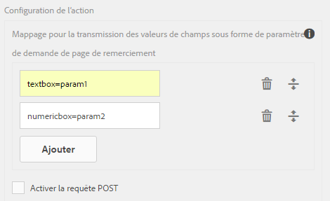
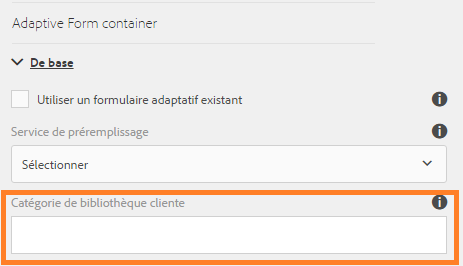

# Configurer l’action d’envoi {#configuring-the-submit-action}

 Adobe recommande d’utiliser les [composants principaux](https://experienceleague.adobe.com/docs/experience-manager-core-components/using/adaptive-forms/introduction.html?lang=fr) de capture de données modernes et extensibles pour [créer de nouveaux formulaires adaptatifs](/help/forms/using/create-an-adaptive-form-core-components.md) ou [ajouter des formulaires adaptatifs à des pages AEM Sites](/help/forms/using/create-or-add-an-adaptive-form-to-aem-sites-page.md). Ces composants représentent une avancée significative dans la création de formulaires adaptatifs, ce qui garantit des expériences utilisateur impressionnantes. Cet article décrit l’ancienne approche de la création de formulaires adaptatifs à l’aide de composants de base. 

| Version | Lien de l’article |
| -------- | ---------------------------- |
| AEM as a Cloud Service | [Cliquez ici](https://experienceleague.adobe.com/docs/experience-manager-cloud-service/content/forms/adaptive-forms-authoring/authoring-adaptive-forms-foundation-components/configure-submit-actions-and-metadata-submission/configuring-submit-actions.html?lang=fr) |
| AEM 6.5 | Cet article |

## Présentation des actions d’envoi {#introduction-to-submit-actions}

Une action d’envoi est déclenchée lorsqu’un utilisateur ou une utilisatrice clique sur le bouton Envoyer d’un formulaire adaptatif. Vous pouvez configurer l’action d’envoi sur le formulaire adaptatif. Les formulaires adaptatifs contiennent quelques actions d’envoi prêtes à l’emploi. Vous pouvez copier et étendre les actions d’envoi par défaut afin de créer votre propre action. Cependant, en fonction des exigences, vous pouvez rédiger et enregistrer votre propre action d’envoi afin de traiter les données du formulaire envoyé. Une action d’envoi peut utiliser un [envoi synchrone ou asynchrone](../../forms/using/asynchronous-submissions-adaptive-forms.md).

Vous pouvez configurer une action d’envoi dans la section **Envoi** des propriétés du conteneur de formulaire adaptatif, dans la zone latérale.

Configuration de l’action d’envoi

Les actions d’envoi par défaut disponibles avec les formulaires adaptatifs sont les suivantes :

* Envoyer vers le point d’entrée REST
* Envoyer un e-mail
* Envoyer un fichier PDF par e-mail
* Appeler un workflow de formulaires
* Envoyer à l’aide du modèle de données de formulaire
* Action d’envoi du Forms Portal
* Appeler un workflow AEM
* Envoyer à Power Automate

>[!NOTE]
>
>L’envoi d’un PDF via une action Envoyer un e-mail s’applique uniquement aux formulaires adaptatifs qui utilisent le modèle XFA comme modèle de formulaire.

>[!NOTE]
>
>Vérifiez que le dossier [AEM_Installation_Directory]\crx-quickstart\temp\datamanager\ASM
>pas. Le répertoire est nécessaire pour stocker temporairement des pièces jointes. Si le fichier n’existe pas, créez-le.

>[!CAUTION]
>
>Si vous [préremplissez](../../forms/using/prepopulate-adaptive-form-fields.md) un modèle de formulaire, un modèle de données de formulaire ou un formulaire adaptatif basé sur un schéma avec des données XML ou JSON conformes à un schéma (schéma XML, schéma JSON, modèle de formulaire ou modèle de données de formulaire) présentant des données ne contenant pas les balises &lt;afData>, &lt;afBoundData> et &lt;/afUnboundData>, les données des champs illimités (les champs illimités sont les champs de formulaire adaptatif sans la propriété [bindref](../../forms/using/prepopulate-adaptive-form-fields.md)) du formulaire adaptatif sont perdues.

Vous pouvez écrire une action d’envoi personnalisée pour les formulaires adaptatifs afin de répondre à votre cas d’utilisation. Pour plus d’informations, voir [Création d’une action Envoyer personnalisée pour les formulaires adaptatifs](../../forms/using/custom-submit-action-form.md).

## Envoyer vers le point d’entrée REST {#submit-to-rest-endpoint}

L’option d’envoi **Envoyer au point d’entrée REST** transmet les données renseignées dans le formulaire à une page de confirmation configurée dans le cadre de la requête HTTP GET. Vous pouvez ajouter le nom des champs à demander. Le format de la requête est :

`{fieldName}={request parameter name}`

Comme illustré ci-dessous, `param1` et `param2` sont transmis en tant que paramètres avec des valeurs copiées à partir des champs **textbox** et **numericbox** pour la prochaine action.

Vous pouvez également **Activer la requête POST** et fournir une URL pour la publication de la requête. Pour envoyer des données au serveur Experience Manager qui héberge le formulaire, utilisez un chemin d’accès relatif correspondant au chemin racine du serveur Experience Manager. Par exemple, /content/forms/af/SampleForm.html. Pour envoyer des données vers un autre serveur, utilisez un chemin d’accès absolu.

Configuration de l’action Envoyer vers le point d’entrée REST

>[!NOTE]
>
>Pour transmettre les champs en tant que paramètres dans une URL REST, tous les champs doivent avoir des noms d’éléments différents, même s’ils sont placés sur différents panneaux.

### Publier les données envoyées vers une ressource ou un point d’entrée REST externe {#post-submitted-data-to-a-resource-or-external-rest-end-point-nbsp}

Utilisez l’action **Envoyer vers le point d’entrée REST** pour transmettre les données envoyées à l’URL REST. L’URL peut être celle d’un serveur interne (le serveur sur lequel le formulaire est rendu) ou externe.

Pour publier des données sur un serveur interne, indiquez le chemin de la ressource. Les données sont publiées avec le chemin de la ressource. Par exemple, /content/restEndPoint. Pour ces requêtes de publication, les informations d’authentification de la requête d’envoi sont utilisées.

Pour publier des données sur un serveur externe, indiquez une URL. Le format de l’URL est le suivant : https://host:port/path_to_rest_end_point. Assurez-vous de configurer le chemin pour que la requête POST soit traitée anonymement.

Dans l’exemple ci-dessus, les informations saisies par l’utilisateur dans `textbox` sont capturées au moyen du paramètre `param1`. La syntaxe permettant de publier les données capturées au moyen de `param1` est :

`String data=request.getParameter("param1");`

De même, les paramètres que vous utilisez pour publier des données XML et des pièces jointes sont `dataXml` et `attachments`.

Par exemple, vous utilisez ces deux paramètres dans votre script pour analyser les données à un point d’entrée REST. Vous utilisez la syntaxe suivante pour stocker et analyser les données :

`String data=request.getParameter("dataXml");`
`String att=request.getParameter("attachments");`

Dans cet exemple, `data` contient les données XML et `att` les données des pièces jointes.

## Envoyer un e-mail {#send-email}

L’action d’envoi **Envoyer un e-mail** envoie un message électronique à un ou plusieurs destinataires lors d’un envoi réussi du formulaire. Le message généré peut contenir des données de formulaire dans un format prédéfini.

>[!NOTE]
>
>Tous les champs de formulaire doivent avoir des noms d’éléments différents, même s’ils sont placés sur des panneaux différents, afin d’inclure des données de formulaire dans un e-mail.

## Envoyer un fichier PDF par e-mail {#send-pdf-via-email}

L’action d’envoi **Envoyer le PDF par courrier électronique** envoie un message électronique avec un fichier PDF contenant des données de formulaire à un ou plusieurs destinataires lors d’un envoi réussi du formulaire.

>[!NOTE]
>
>Cette action d’envoi est disponible pour les formulaires adaptatifs XFA et XSD ayant le modèle de document d’enregistrement.

## Appeler un processus de formulaires {#invoke-a-forms-workflow}

L’option d’envoi **Envoyer à Forms Workflow** envoie un fichier XML de données et des pièces jointes (le cas échéant) à un processus Adobe LiveCycle ou AEM Forms on JEE existant.

Pour plus d’informations sur la configuration de l’action d’envoi Envoyer au workflow de formulaires, voir [Envoyer et traiter vos données de formulaire à l’aide de workflows de formulaires](../../forms/using/submit-form-data-livecycle-process.md).

## Envoyer à l’aide du modèle de données de formulaire {#submit-using-form-data-model}

L’action d’envoi **Envoyer à l’aide du modèle de données de formulaire** écrit les données de formulaire adaptatif envoyés pour l’objet de modèle de données spécifié dans un modèle de données de formulaire vers sa source de données. Lors de la configuration de l’action d’envoi, vous pouvez sélectionner un objet de modèle de données dont vous souhaitez récrire les données envoyées dans sa source de données.

En outre, vous pouvez envoyer un formulaire en pièce jointe à l’aide d’un modèle de données de formulaire et d’un document d’enregistrement (DoR) vers la source de données.

Pour plus d’informations sur le modèle de données du formulaire, voir [Intégration de données AEM Forms](../../forms/using/data-integration.md).

## Action d’envoi du portail Forms {#forms-portal-submit-action}

L’option **Action d’envoi du portail Forms** rend les données de formulaire disponibles à travers un portail AEM Forms.

Pour plus d’informations sur le Portail Formulaires et l’action d’envoi, voir [Composant Brouillons et envois](../../forms/using/draft-submission-component.md).

## Appeler un processus AEM {#invoke-an-aem-workflow}

L’action d’envoi **[!UICONTROL Appeler un processus AEM]** associe un formulaire adaptatif à un [processus AEM](/help/sites-developing/workflows-models.md). Lorsqu’un formulaire est envoyé, le processus associé commence automatiquement sur l’instance de création. Vous pouvez enregistrer le fichier de données, les pièces jointes et le document d’enregistrement dans le dossier correspondant, dans la payload du workflow ou dans une variable. Si le workflow est configuré pour le stockage de données externes, l’option Variable est disponible et non l’option Payload. Vous pouvez choisir dans la liste des variables disponibles pour le modèle de workflow. Si le processus est marqué pour le stockage des données externes à une étape ultérieure et non au moment de la création du processus, assurez-vous que les configurations de variable requises sont en place.

Avant d’utiliser l’action d’envoi **Appeler un workflow AEM**, [configurer les paramètres AEM DS](../../forms/using/configuring-the-processing-server-url.md). Pour plus d’informations sur la création d’un processus AEM, voir [Processus basés sur l’utilisation de Forms sur OSGi](../../forms/using/aem-forms-workflow.md).

L’action Envoyer place les éléments suivants à l’emplacement de la payload du workflow. Notez toutefois que seule l’option Variable s’affiche si le modèle de workflow est configuré pour le stockage de données externes et non l’option Payload.

* **Fichier de données** : Il contient les données envoyées au formulaire adaptatif. Vous pouvez utiliser l’option **[!UICONTROL Chemin d’accès au fichier de données]** pour spécifier le nom du fichier et le chemin d’accès du fichier par rapport à la charge utile. Par exemple, le chemin d’accès `/addresschange/data.xml` crée un dossier nommé `addresschange` et le place par rapport à la charge utile. Vous pouvez également spécifier uniquement `data.xml` pour envoyer uniquement les données envoyées sans créer de hiérarchie de dossiers. Utilisez l’option Variable et sélectionnez la variable dans la liste des variables disponibles pour le modèle de workflow.

>[!NOTE]
>
>Vous pouvez utiliser des variables que le modèle de workflow soit configuré pour le stockage de données externes ou non.

* **Pièces jointes** : vous pouvez utiliser l’option **[!UICONTROL Chemin d’accès aux pièces jointes]** pour spécifier le nom de dossier dans lequel stocker les pièces jointes chargées dans le formulaire adaptatif. Le dossier est créé par rapport à la payload. Si le workflow est marqué pour le stockage de données externe, utilisez l’option variable et sélectionnez la variable dans la liste des variables disponibles pour le modèle de workflow.

* **Document d’enregistrement** : il contient le document d’enregistrement généré pour le formulaire adaptatif. Vous pouvez utiliser l’option **[!UICONTROL Chemin du document d’enregistrement]** pour spécifier le nom du fichier de document d’enregistrement et le chemin d’accès du fichier par rapport à la charge utile. Par exemple, le chemin d’accès `/addresschange/DoR.pdf` crée un dossier nommé `addresschange` relatif à la charge utile et place `DoR.pdf` relatif à la charge utile. Vous pouvez également spécifier uniquement `DoR.pdf` pour n’enregistrer que le document d’enregistrement sans créer de hiérarchie de dossiers. Si le workflow est marqué pour le stockage de données externe, utilisez l’option variable et sélectionnez la variable dans la liste des variables disponibles pour le modèle de workflow.

## Envoyer à Power Automate {#microsoft-power-automate}

Vous pouvez configurer un formulaire adaptatif pour exécuter un flux cloud Power Automate lors de l’envoi. Le formulaire adaptatif configuré envoie les données capturées, les pièces jointes et le document d’enregistrement au flux Cloud Power Automate pour traitement. Il vous permet de créer une expérience de capture de données personnalisée tout en tirant parti de la puissance de Microsoft® Power Automate pour élaborer des logiques commerciales autour des données capturées et automatiser les workflows client. Voici quelques exemples de ce que vous pouvez faire après l’intégration d’un formulaire adaptatif à Microsoft® Power Automate :

* Utiliser des données de formulaires adaptatifs dans des processus d’entreprise Power Automate
* Utilisez Power Automate pour envoyer des données capturées à plus de 500 sources de données ou à toute API publique
* Exécuter des calculs complexes sur les données capturées
* Enregistrer des données de formulaires adaptatifs dans les systèmes de stockage selon un planning prédéfini

L’éditeur de formulaires adaptatifs fournit l’action d’envoi **Appeler un flux Microsoft® Power Automate** pour envoyer des données de formulaires adaptatifs, des pièces jointes et un document d’enregistrement au flux de cloud Power Automate. Pour utiliser l’action Envoyer afin d’envoyer les données capturées à Microsoft® Power Automate, [connectez votre instance AEM Forms à Microsoft® Power Automate](/help/forms/using/forms-microsoft-power-automate-integration.md).

Une fois la configuration réussie, utilisez l’action d’envoi [Appeler un flux Microsoft® Power Automate](/help/forms/using/forms-microsoft-power-automate-integration.md#use-the-invoke-a-microsoft&reg;-power-automate-flow-submit-action-to-send-data-to-a-power-automate-flow-use-the-invoke-microsoft-power-automate-flow-submit-action) pour envoyer des données à un flux Power Automate.

## Soumettre à la liste Microsoft® SharePoint{#submit-to-sharedrive}

>[!NOTE]
>
>La fonction Envoyer à une liste Microsoft® SharePoint a été introduite avec AEM 6.5 Forms pack de services 19 (6.5.19.0).

L’action d’envoi **[!UICONTROL Envoyer à SharePoint]** connecte un formulaire adaptatif à un stockage Microsoft® SharePoint. Vous pouvez envoyer le fichier de données de formulaire, les pièces jointes ou le document d’enregistrement au stockage Microsoft® SharePoint connecté.

### Connecter un formulaire adaptatif à une liste Microsoft® SharePoint {#connect-af-sharepoint-list}

Pour connecter un formulaire adaptatif à une liste Microsoft® SharePoint, procédez comme suit :

1. [Créer une configuration de liste SharePoint](#create-sharepoint-list-configuration) : connecte AEM Forms à votre stockage de listes Microsoft® SharePoint.
1. [Utilisez l’action d’envoi **Envoyer à l’aide d’un modèle de données de formulaire** dans un formulaire adaptatif](#use-submit-using-fdm) : envoie les données de votre formulaire adaptatif au stockage Microsoft® SharePoint configuré.

#### Créer une configuration de liste SharePoint {#create-sharepoint-list-configuration}

Pour connecter AEM Forms à votre liste Microsoft® SharePoint :

1. Accédez à **[!UICONTROL Outils]** > **[!UICONTROL Services cloud]** > **[!UICONTROL Microsoft® SharePoint]**.
1. Sélectionnez un **conteneur de configuration**. La configuration est stockée dans le conteneur de configuration sélectionné.
1. Cliquez sur **[!UICONTROL Créer]** > **[!UICONTROL Liste SharePoint]** dans la liste déroulante. L’assistant de configuration SharePoint s’affiche.
1. Spécifiez le **[!UICONTROL titre]**, l’**[!UICONTROL ID client]**, le **[!UICONTROL secret client]** et l’**[!UICONTROL URL OAuth]**. Pour savoir comment récupérer l’ID client et le secret client pour l’URL OAuth, consultez la [documentation Microsoft®](https://learn.microsoft.com/fr-fr/graph/auth-register-app-v2).
   * Vous pouvez récupérer l’`Client ID` et le `Client Secret` de votre application sur le portail Microsoft® Azure.
   * Sur le portail Microsoft® Azure, ajoutez l’URI de redirection en tant que `https://[author-instance]/libs/cq/sharepointlist/content/configurations/wizard.html`. Remplacez `[author-instance]` par l’URL de votre instance de création.
   * Ajoutez les autorisations d’API `offline_access` et `Sites.Manage.All` dans l’onglet **Graphique Microsoft®** pour fournir des autorisations de lecture/écriture. Ajoutez l’autorisation `AllSites.Manage` dans l’onglet **Sharepoint** pour interagir à distance avec les données SharePoint.
   * Utilisez l’URL OAuth `https://login.microsoftonline.com/tenant-id/oauth2/v2.0/authorize`. Remplacez `<tenant-id>` par le `tenant-id` de votre application depuis le portail Microsoft® Azure.

     >[!NOTE]
     >
     >Le champ du **secret client** est obligatoire ou facultatif selon la configuration de votre application Azure Active Directory. Si votre application est configurée pour utiliser un secret client, vous devez l’indiquer.

1. Cliquez sur **[!UICONTROL Connecter]**. Lors d’une connexion réussie, le message `Connection Successful` s’affiche.
1. Sélectionnez **[!UICONTROL Site SharePoint]** et **[!UICONTROL Liste SharePoint]** dans la liste déroulante.
1. Appuyez sur **[!UICONTROL Créer]** pour créer la configuration cloud pour la liste Microsoft® SharePoint.

#### Utiliser l’option Soumettre à l’aide d’un modèle de données de formulaire dans un formulaire adaptatif {#use-submit-using-fdm}

Vous pouvez utiliser la configuration de liste SharePoint créée dans un formulaire adaptatif pour enregistrer des données ou un document d’enregistrement généré dans une liste SharePoint. Suivez les étapes ci-dessous pour utiliser une configuration de stockage de listes SharePoint dans un formulaire adaptatif :

1. [Créer un modèle de données de formulaire à l’aide de Microsoft](/help/forms/using/create-form-data-model.md)
1. [Configurer le modèle de données de formulaire pour récupérer et envoyer des données](/help/forms/using/work-with-form-data-model.md#configure-services)
1. [Créez un formulaire adaptatif](/help/forms/using/create-adaptive-form.md).
1. [Configurer l’action de soumission à l’aide d’un modèle de données de formulaire](/help/forms/using/configuring-submit-actions.md#submit-using-form-data-model-submit)

Lorsque vous soumettez le formulaire, les données sont enregistrées dans le stockage de listes Microsoft® SharePoint que vous avez spécifié.

>[!NOTE]
>
>Dans la liste Microsoft® SharePoint, les types de colonnes suivants ne sont pas pris en charge :
>* Colonne image
>* Colonne métadonnées
>* Colonne personne
>* Colonne données externes

>[!NOTE]
>
>Pour définir les valeurs d’une configuration, [générez des configurations OSGi à l’aide du SDK AEM](https://experienceleague.adobe.com/docs/experience-manager-cloud-service/implementing/deploying/configuring-osgi.html?lang=fr#generating-osgi-configurations-using-the-aem-sdk-quickstart) et [déployez la configuration](https://experienceleague.adobe.com/docs/experience-manager-cloud-service/implementing/using-cloud-manager/deploy-code.html?lang=fr#deployment-process) sur votre instance de Cloud Service.

## Revalidation côté serveur dans un formulaire adaptatif {#server-side-revalidation-in-adaptive-form}

En règle générale, dans n’importe quel système de capture de données en ligne, les développeurs placent des validations JavaScript côté client pour appliquer des règles métier. Mais dans les navigateurs modernes, les utilisateurs finaux peuvent contourner ces validations et effectuer les envois manuellement à l’aide de différentes méthodes, comme la console Web Browser DevTools. Ces méthodes sont également valables pour les formulaires adaptatifs. Un développeur de formulaires peut créer différentes logiques de validation, mais techniquement, les utilisateurs finaux peuvent contourner ces logiques de validation et soumettre des données non valides au serveur. Les données non valides enfreindraient les règles métier appliquées par un créateur ou une créatrice de formulaires.

La fonction de revalidation côté serveur permet également d’exécuter les validations fournies par un auteur ou une autrice de formulaires adaptatifs lors de la conception d’un formulaire adaptatif sur le serveur. Elle empêche toute erreur lors des envois de données et toute violation des règles de fonctionnement représentées en termes de validations de formulaire.

### Quels éléments valider sur le serveur ?  {#what-to-validate-on-server-br}

Toutes les validations de champ prêtes à l’emploi d’un formulaire adaptatif qui sont réexécutées sur le serveur sont les suivantes :

* Requis
* Clause d’image de validation
* Expression de validation

### Activation de la validation côté serveur {#enabling-server-side-validation-br}

Utilisez **Revalider sur le serveur** sous le conteneur de formulaires adaptatifs dans la zone latérale pour activer ou désactiver la validation côté serveur pour le formulaire actif.

Activer la validation côté serveur

Si l’utilisateur final ou l’utilisatrice finale contourne ces validations et soumet les formulaires, le serveur effectue à nouveau la validation. Si la validation échoue du côté du serveur, la transaction d’envoi est arrêtée. L’utilisateur final voit de nouveau s’afficher le formulaire d’origine. Pour l’utilisateur, les données capturées et les données envoyées s’affichent en tant qu’erreurs.

>[!NOTE]
>
>La validation côté serveur permet de valider le modèle de formulaire. Il est recommandé de créer une bibliothèque client séparée pour les validations et de ne pas la mélanger à d’autres éléments. Par exemple, ne placez pas le style HTML et la manipulation DOM dans la même bibliothèque client.

### Prise en charge des fonctions personnalisées dans les expressions de validation {#supporting-custom-functions-in-validation-expressions-br}

Parfois, en cas de règles de validation complexes, le script de validation exact réside dans des fonctions personnalisées que l’auteur doit appeler à partir de l’expression du champ de validation. Pour rendre cette bibliothèque de fonctions personnalisées visible et disponible lors des validations côté serveur, l’auteur de formulaires peut configurer le nom de la bibliothèque cliente AEM sous l’onglet **Réglages de base** des propriétés de conteneur de formulaires adaptatifs comme illustré ci-dessous.

Prendre en charge des fonctions personnalisées dans les expressions de validation

L’auteur peut configurer la bibliothèque personnalisée JavaScript pour chaque formulaire adaptatif. Dans la bibliothèque, conservez uniquement les fonctions réutilisables ayant une dépendance sur les bibliothèques tierces jquery et underscore.js.

## Gestion d’erreurs sur l’action d’envoi {#error-handling-on-submit-action}

Dans le cadre de la sécurité Experience Manager et des conseils de renforcement, configurez les pages d’erreur personnalisées telles que 404.jsp et 500.jsp. Ces gestionnaires sont appelés lorsque les erreurs 404 ou 500 s’affichent au moment d’envoyer un formulaire. Les gestionnaires sont également appelés lorsque ces codes d’erreur sont déclenchés sur le nœud de publication.

Pour plus d’informations, voir [Personnaliser les pages affichées par le gestionnaire d’erreurs](/help/sites-developing/customizing-errorhandler-pages.md).
